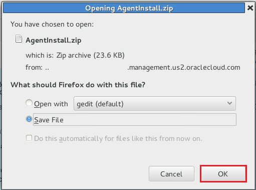
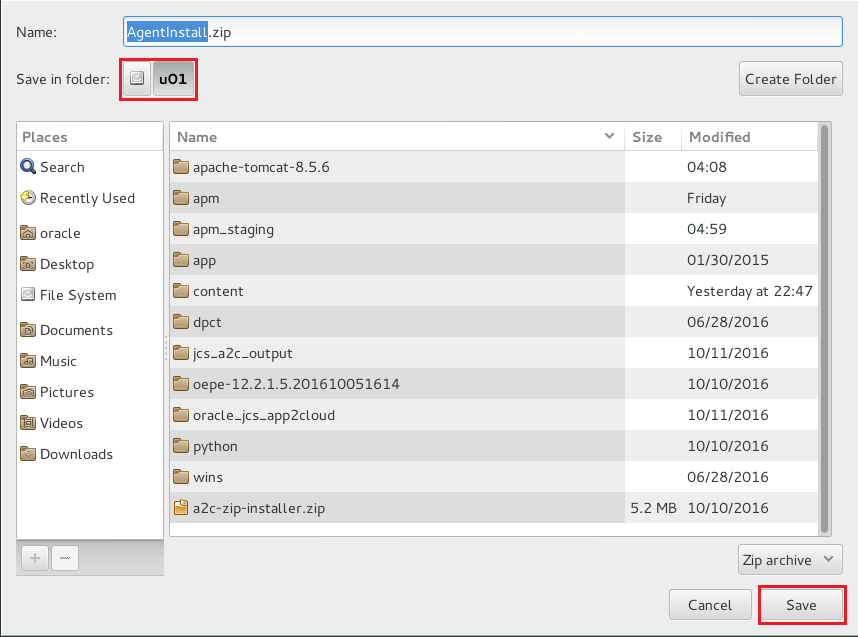
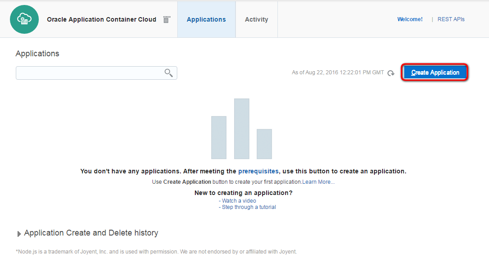
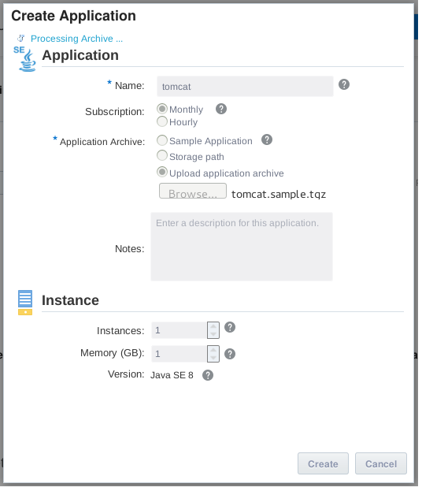
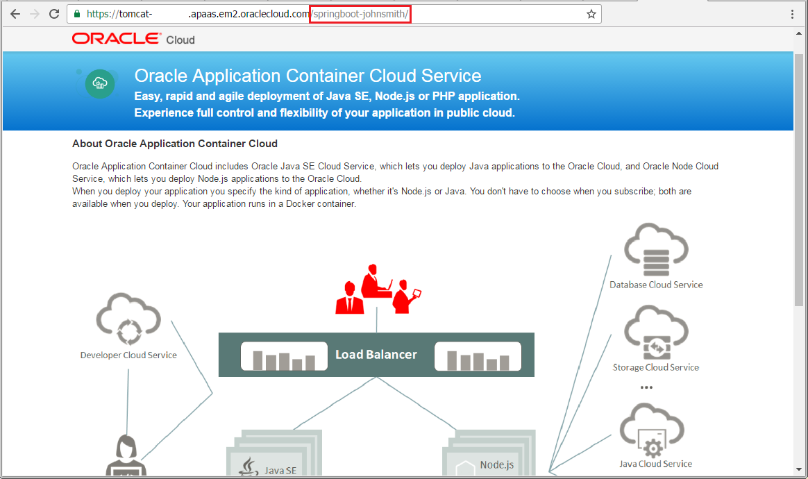
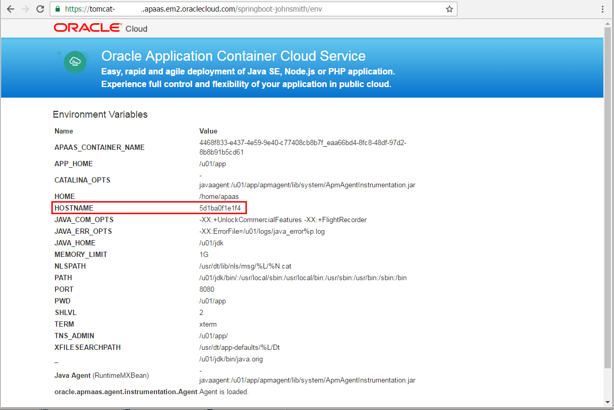
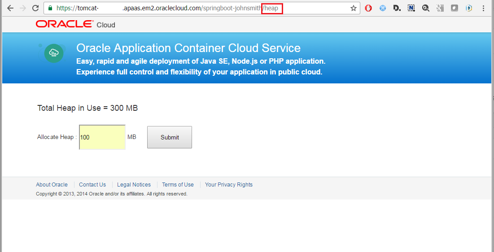

# ORACLE Cloud-Native DevOps workshop #
-----
## Deploying APM Agent and setting up Application Performance Monitoring ##

### Introduction ###
Oracle Application Performance Monitoring Cloud Service is a software-as-a service solution that provides deep visibility into your application performance from end-user experience, through application server requests, and down to application logs. With Oracle Application Performance Monitoring Cloud Service you can isolate problems before they impact your business, break down the barriers between Development and Operations teams and deliver better applications. 

In this tutorial a simple web application and APM agent in a Tomcat container runs on top of Application Container Cloud Service. Once the application has been deployed the APM agent collects and sends the container details to Oracle Management Cloud Service. Using the Application Performance Monitoring Web User Interface you can monitor all necessary details about the demo application.

### About this tutorial ###
This tutorial demonstrates how to:

+ Access Application Performance Monitoring Cloud Service
+ Download APM Agent
+ Prepare to Deploy APM Java Agent on Apache Tomcat
+ Prepare Tomcat container to deploy on Application Container Cloud Service
+ Set Up Application Performance Monitoring
+ How to Use Application Performance Monitoring

### Prerequisites ###

+ Oracle Public Cloud Services account including:
	+ Application Performance Monitoring Cloud Service
	+ Application Container Cloud Service

### Steps ###

#### Download Apache Tomcat container ####

Download Apache Tomcat 8.5.6 into folder `/u01` from [http://archive.apache.org/dist/tomcat/tomcat-8/v8.5.6/bin/apache-tomcat-8.5.6.tar.gz](http://archive.apache.org/dist/tomcat/tomcat-8/v8.5.6/bin/apache-tomcat-8.5.6.tar.gz). If the direct link doesn't work please find the right download location of the latest or desired version of Tomcat on [https://tomcat.apache.org/](https://tomcat.apache.org/).

	[oracle@localhost Desktop]$ cd /u01
	[oracle@localhost u01]$ wget http://archive.apache.org/dist/tomcat/tomcat-8/v8.5.6/bin/apache-tomcat-8.5.6.tar.gz -P /u01/
	--2016-10-20 02:45:08--  http://archive.apache.org/dist/tomcat/tomcat-8/v8.5.6/bin/apache-tomcat-8.5.6.tar.gz
	Resolving www-proxy.us.oracle.com (www-proxy.us.oracle.com)... 148.87.19.20
	Connecting to www-proxy.us.oracle.com (www-proxy.us.oracle.com)|148.87.19.20|:80... connected.
	Proxy request sent, awaiting response... 200 OK
	Length: 9304958 (8.9M) [application/x-gzip]
	Saving to: ‘/u01/apache-tomcat-8.5.6.tar.gz’
	
	100%[====================================================================================================================>] 9,304,958   2.87MB/s   in 3.1s   
	
	2016-10-20 02:45:12 (2.87 MB/s) - ‘/u01/apache-tomcat-8.5.6.tar.gz’ saved [9304958/9304958]
	
	[oracle@localhost u01]$ 

Extraxt the archive into `/u01`.

	[oracle@localhost u01]$ tar -zvxf /u01/apache-tomcat-8.5.6.tar.gz -C /u01
	apache-tomcat-8.5.6/conf/
	apache-tomcat-8.5.6/conf/catalina.policy
	apache-tomcat-8.5.6/conf/catalina.properties
	apache-tomcat-8.5.6/conf/context.xml
	...
	...
	...
	apache-tomcat-8.5.6/bin/setclasspath.sh
	apache-tomcat-8.5.6/bin/shutdown.sh
	apache-tomcat-8.5.6/bin/startup.sh
	apache-tomcat-8.5.6/bin/tool-wrapper.sh
	apache-tomcat-8.5.6/bin/version.sh
	[oracle@localhost u01]$

#### Prepare environment to deploy APM agent on Apache Tomcat ####

Before you can download and install an APM Java Agent, ensure that you set the staging directory in the target host running the application server. The application you want to monitor is installed on this application server.

Open terminal and create `apm_staging` directory in folder `/u01`. When it is ready set the `STAGE_DIR` variable to the staging directory:

	[oracle@localhost Desktop]$ cd /u01/
	[oracle@localhost u01]$ mkdir apm_staging
	[oracle@localhost u01]$ export STAGE_DIR=/u01/apm_staging
	[oracle@localhost u01]$ echo $STAGE_DIR 
	/u01/apm_staging
	[oracle@localhost u01]$ 

Now set the `DESTINATION` variable to point to the Apache Tomcat destination directory.

	[oracle@localhost u01]$ export DESTINATION=/u01/apache-tomcat-8.5.6
	[oracle@localhost u01]$ echo $DESTINATION 
	/u01/apache-tomcat-8.5.6
	[oracle@localhost u01]$

You also need to set the `REG_KEY` variable to the registration key. But it requires login to APM to download. See the next step.

#### Deploy SpringBoot sample application to Apache Tomcat ####

Change the directory to `GIT_REPO_LOCAL_CLONE/springboot-sample` and run `mvn install`.

	[oracle@localhost u01]$ cd /u01/content/cloud-native-devops-workshop/springboot-sample/
	[oracle@localhost springboot-sample]$ mvn install
	[INFO] Scanning for projects...
	Downloading: https://repo.maven.apache.org/maven2/org/springframework/boot/spring-boot-starter-parent/1.3.3.RELEASE/spring-boot-starter-parent-1.3.3.RELEASE.pom
	Downloaded: https://repo.maven.apache.org/maven2/org/springframework/boot/spring-boot-starter-parent/1.3.3.RELEASE/spring-boot-starter-parent-1.3.3.RELEASE.pom (7 KB at 11.3 KB/sec)
	...
	...
	...
	Downloaded: https://repo.maven.apache.org/maven2/org/apache/maven/shared/file-management/1.1/file-management-1.1.jar (31 KB at 13.7 KB/sec)
	[INFO] Reading assembly descriptor: assembly.xml
	[INFO] Building zip: /u01/content/cloud-native-devops-workshop/springboot-sample/target/springbootdemo-0.0.1.zip
	[INFO] 
	[INFO] --- maven-install-plugin:2.5.2:install (default-install) @ springbootdemo ---
	Downloading: https://repo.maven.apache.org/maven2/commons-codec/commons-codec/1.6/commons-codec-1.6.pom
	Downloaded: https://repo.maven.apache.org/maven2/commons-codec/commons-codec/1.6/commons-codec-1.6.pom (11 KB at 28.5 KB/sec)
	Downloading: https://repo.maven.apache.org/maven2/org/apache/maven/shared/maven-shared-utils/0.4/maven-shared-utils-0.4.pom
	Downloaded: https://repo.maven.apache.org/maven2/org/apache/maven/shared/maven-shared-utils/0.4/maven-shared-utils-0.4.pom (4 KB at 41.6 KB/sec)
	Downloading: https://repo.maven.apache.org/maven2/org/codehaus/plexus/plexus-utils/3.0.15/plexus-utils-3.0.15.pom
	Downloaded: https://repo.maven.apache.org/maven2/org/codehaus/plexus/plexus-utils/3.0.15/plexus-utils-3.0.15.pom (4 KB at 39.9 KB/sec)
	Downloading: https://repo.maven.apache.org/maven2/commons-codec/commons-codec/1.6/commons-codec-1.6.jar
	Downloading: https://repo.maven.apache.org/maven2/org/apache/maven/shared/maven-shared-utils/0.4/maven-shared-utils-0.4.jar
	Downloading: https://repo.maven.apache.org/maven2/org/codehaus/plexus/plexus-utils/3.0.15/plexus-utils-3.0.15.jar
	Downloaded: https://repo.maven.apache.org/maven2/org/apache/maven/shared/maven-shared-utils/0.4/maven-shared-utils-0.4.jar (152 KB at 538.3 KB/sec)
	Downloaded: https://repo.maven.apache.org/maven2/commons-codec/commons-codec/1.6/commons-codec-1.6.jar (228 KB at 800.4 KB/sec)
	Downloaded: https://repo.maven.apache.org/maven2/org/codehaus/plexus/plexus-utils/3.0.15/plexus-utils-3.0.15.jar (234 KB at 344.2 KB/sec)
	[INFO] Installing /u01/content/cloud-native-devops-workshop/springboot-sample/target/springbootdemo-0.0.1.war to /home/oracle/.m2/repository/com/example/springboot/springbootdemo/0.0.1/springbootdemo-0.0.1.war
	[INFO] Installing /u01/content/cloud-native-devops-workshop/springboot-sample/pom.xml to /home/oracle/.m2/repository/com/example/springboot/springbootdemo/0.0.1/springbootdemo-0.0.1.pom
	[INFO] Installing /u01/content/cloud-native-devops-workshop/springboot-sample/target/springbootdemo-0.0.1.zip to /home/oracle/.m2/repository/com/example/springboot/springbootdemo/0.0.1/springbootdemo-0.0.1.zip
	[INFO] ------------------------------------------------------------------------
	[INFO] BUILD SUCCESS
	[INFO] ------------------------------------------------------------------------
	[INFO] Total time: 01:31 min
	[INFO] Finished at: 2016-10-20T03:05:21-07:00
	[INFO] Final Memory: 29M/490M
	[INFO] ------------------------------------------------------------------------
	[oracle@localhost springboot-sample]$ 

To deploy the application simply copy and rename the application archive (`springbootdemo-0.0.1.war`) to the `TOMCAT_INSTALL_DIRECTORY/webapps` folder. Renaming is important because by default your application's context root will be the war file name and later on the APM interface you will use URL filtering to distinct different applications from each other. Thus rename your war file to include some unique identifier. It can be your first and last name e.g. `springboot-johnsmith.war`. 
	
	[oracle@localhost springboot-sample]$ cp target/springbootdemo-0.0.1.war /u01/apache-tomcat-8.5.6/webapps/springboot-johnsmith.war
	[oracle@localhost springboot-sample]$ ls /u01/apache-tomcat-8.5.6/webapps/
	docs  examples  host-manager  manager  ROOT  springboot-johnsmith.war
	[oracle@localhost springboot-sample]$ 

#### Download the Master Installer ####

Download the master installer to a shared directory that can be accessed by all the managed servers in the application server domain where APM Java Agents will be deployed.

[Sign in](../common/sign.in.to.oracle.cloud.md) to [https://cloud.oracle.com/sign_in](https://cloud.oracle.com) and go to Dashboard Page. Click **Launch APM**.

If you have separate Oracle Management Cloud Service access, for example in case of trial use the proper identity domain and credentials to login.

Once you have reached the Oracle Cloud Management Cloud Welcome page click **Application Navigator** and on the drop down list select **Administration** -> **Agents**

On the left menu select **Download** and click on the green donwload icon.

Save the AgentInstall.zip file.

Select `/u01` folder to save.

Before unzip the Agent installer get and set the Registration Key environment variable. Click **Registration Keys** on the left side menu. Copy to clipboard or note your Registration Key value.

Having the registration key value set the `REG_KEY` variable. Go back to a terminal where you have already exported the `STAGE_DIR` and `DESTINATION` variables and run the following using your registration key value:
	
	[oracle@localhost springboot-sample]$ export REG_KEY=R09s91UPwMqTGJL7nNBS
	[oracle@localhost springboot-sample]$ echo $REG_KEY 
	R09s91UPwMqTGJL7nNBS
	[oracle@localhost springboot-sample]$ echo $STAGE_DIR 
	/u01/apm_staging
	[oracle@localhost springboot-sample]$ echo $DESTINATION 
	/u01/apache-tomcat-8.5.6
	[oracle@localhost springboot-sample]$ 

Now go back to the terminal and unzip the agent installer to `/u01/apm_temp` folder:

	[oracle@localhost springboot-sample]$ cd /u01
	[oracle@localhost u01]$ unzip AgentInstall.zip -d /u01/apm_temp
	Archive:  AgentInstall.zip
	  inflating: /u01/apm_temp/AgentInstall.sh  
	  inflating: /u01/apm_temp/AgentInstall.bat  
	  inflating: /u01/apm_temp/README         
	[oracle@localhost u01]$ 

From the local directory where you have extracted the contents of the master installer ZIP file, change the permissions of `AgentInstall.sh`:

	[oracle@localhost u01]$ cd /u01/apm_temp/
	[oracle@localhost apm_temp]$ chmod 755 AgentInstall.sh
 
Now run the following command to download the software:

	[oracle@localhost apm_temp]$ ./AgentInstall.sh AGENT_TYPE=apm_java_as_agent STAGE_LOCATION=${STAGE_DIR} AGENT_REGISTRATION_KEY=${REG_KEY}
	Downloading apm agent software ...
	[oracle@localhost apm_temp]$ 

#### Installing and Provisioning APM Java Agent on Apache Tomcat ####

After you have downloaded and extracted the installer, install and provision the APM Java Agent in your application server domain running the `./ProvisionApmJavaAsAgent.sh -d ${DESTINATION}` command in the staging directory. Just for sure change te permissions for `ProvisionApmJavaAsAgent.sh`.

	[oracle@localhost apm_temp]$ cd ${STAGE_DIR}
	[oracle@localhost apm_staging]$ chmod +x ProvisionApmJavaAsAgent.sh
	[oracle@localhost apm_staging]$ ./ProvisionApmJavaAsAgent.sh -d ${DESTINATION}
	 The current destination for provisioning the APM Java AS Agent is TOMCAT. This needs to be done with no-wallet option. Hence the installation will be done with no wallet.
	*************************************************************************
	Your settings are as follows:
	 
	              Tenant_ID = usxxxxxxtrial
	            Destination = /u01/apache-tomcat-8.5.6
	        RegistrationKey = EQAAAA9idWlsdEluQUxDS2V5LjG5fm5XfcX985Q06kU2dZKhzVW8WocMgJIb63bDKqdZ072pnsoScmcpIjRxxxxxxxxxxxxxxxxxxx==
	 
	Do you wish to proceed with these values? y
	Archive:  /u01/apm_staging/ApmAgent-1.10.zip
	   creating: apmagent/
	   creating: apmagent/config/
	  inflating: apmagent/config/AgentHttpBasic.properties  
	  inflating: apmagent/config/MetricCollector.json  
	  inflating: apmagent/config/BrowserAgent.json  
	  inflating: apmagent/config/AgentStartup.properties  
	  inflating: apmagent/config/Servlet.json  
	   creating: apmagent/lib/
	   creating: apmagent/lib/system/
	  inflating: apmagent/lib/system/instrumentor-2.2.0.1.jar  
	  inflating: apmagent/lib/system/ApmAgentInstrumentation.jar  
	  inflating: apmagent/lib/system/ApmProbeSystem.jar  
	   creating: apmagent/lib/action/
	  inflating: apmagent/lib/action/ApmProbeAction.jar  
	   creating: apmagent/lib/agent/
	  inflating: apmagent/lib/agent/jackson-core-asl-1.9.13.jar  
	  inflating: apmagent/lib/agent/jackson-jaxrs-1.9.13.jar  
	  inflating: apmagent/lib/agent/commons-logging-1.1.1.jar  
	  inflating: apmagent/lib/agent/httpcore-4.2.4.jar  
	  inflating: apmagent/lib/agent/ApmAgentUtility.jar  
	  inflating: apmagent/lib/agent/ApmAgentRuntime.jar  
	  inflating: apmagent/lib/agent/commons-codec-1.8.jar  
	  inflating: apmagent/lib/agent/jackson-mapper-asl-1.9.13.jar  
	  inflating: apmagent/lib/agent/jettison-1.3.4.jar  
	  inflating: apmagent/lib/agent/ApmEumFilter.jar  
	  inflating: apmagent/lib/agent/cmnutil.jar  
	  inflating: apmagent/lib/agent/httpclient-4.2.5.jar  
	  inflating: apmagent/lib/agent/agentToEngine.jar  
	  inflating: apmagent/lib/agent/jackson-xc-1.9.13.jar  
	  inflating: apmagent/lib/agent/ApmProbeRuntime.jar  
	*******************************************************************************
	So far, so good! Now, one more thing to do, which you will perform manually.
	You will need to modify your destination's start up script so that
	the APM instrumentation you have just laid down and configured will be invoked.
	
	Here's what you do:
	
	
	Weblogic :
	---------
	
	1. Make a backup copy of your startWebLogic.sh file:
	        % cd $DOMAIN_HOME/bin
	        % cp startWebLogic.sh startWebLogic.sh.orig
	
	2. Now edit the script with your favorite text editor (e.g. "vi"), and add the 
	   -javaagent option to the set of JAVA_OPTIONS found therein, by adding the 
	   following line right after the "setDomainEnv.sh" call:
	   
	        JAVA_OPTIONS="${JAVA_OPTIONS} -javaagent:${DOMAIN_HOME}/apmagent/lib/system/ApmAgentInstrumentation.jar"
	
	3. Stop and restart your WebLogic Application Server. Note that you will use
	   the $DOMAIN_HOME/bin version of stopWebLogic.sh, but the $DOMAIN_HOME
	   version of startWebLogic.sh, even though you edited the $DOMAIN_HOME/bin
	   version. The "upper" level one will, in fact, invoke the "lower" level one:
	
	        % cd $DOMAIN_HOME/bin
	        % ./stopWebLogic.sh                        
	        % cd ..                                    
	        % nohup ./startWebLogic.sh >& startup.log &
	
	4. Finally, if you have any Managed WebLogic Application Servers, stop and 
	   restart them also:
	
	        % cd $DOMAIN_HOME/bin
	        % ./stopManagedWebLogic.sh {SERVER_NAME} {ADMIN_URL} {USER_NAME} {PASSWORD}                                                  
	        % nohup ./startManagedWebLogic.sh {SERVER_NAME} {ADMIN_URL} >& {SERVER_NAME}.log &
	
	Tomcat :
	-------
	
	1. Make a backup copy of your Catalina.sh file:
	            % cd "$CATALINA_HOME/bin"
	            % cp catalina.sh catalina.sh.orig
	
	2. Now edit the script with your favorite text editor (e.g. "vi") , and add the
	   -javaagent option to the set of CATALINA_OPTS, by adding the
	   following line:
	
	    	 CATALINA_OPTS="${CATALINA_OPTS} -javaagent:\"${CATALINA_HOME}/apmagent/lib/system/ApmAgentInstrumentation.jar\""
	
	3. Stop and restart your Tomcat Server.
	
	        % cd "$CATALINA_HOME/bin"
	        % ./shutdown.sh
	        % ./startup.sh
	
	JBoss 7.x/Wildfly(Standlone Mode):
	----------
	
	1. Make a backup copy of your standalone.conf file:
	        % cd $JBOSS_HOME/bin
		% cp standalone.conf standalone.conf.orig
	
	2. Now edit standalone.conf with your favorite text editor (e.g. "vi"), and search text 'JBOSS_MODULES_SYSTEM_PKGS'
		Add  oracle.apmaas,org.jboss.logmanager to it.
	 
	 	If it was JBOSS_MODULES_SYSTEM_PKGS="org.jboss.byteman" then the new value will be JBOSS_MODULES_SYSTEM_PKGS="org.jboss.byteman,oracle.apmaas,org.jboss.logmanager"	
	 
	3. Go to the end of the file and add following statements
	
		JAVA_OPTS="$JAVA_OPTS -Djava.util.logging.manager=org.jboss.logmanager.LogManager"
	
		# Location and version of below jar files would be different for jboss versions. You can modify java opts with correct version of jar file. If files are not present then you can download the jars and modify paths of jar in below statements.
	
		JAVA_OPTS="$JAVA_OPTS -Xbootclasspath/p:<JBOSS_HOME>/modules/org/jboss/logmanager/main/jboss-logmanager-1.2.2.GA.jar:<JBOSS_HOME>/modules/org/jboss/logmanager/log4j/main/jboss-logmanager-log4j-1.0.0.GA.jar:<JBOSS_HOME>/modules/org/apache/log4j/main/log4j-1.2.16.jar"
	
		JAVA_OPTS="$JAVA_OPTS -javaagent:<JBOSS_HOME>/apmagent/lib/system/ApmAgentInstrumentation.jar"
	
	4. Stop and restart your JBoss/Wildfly Server
	    		
	
	JBoss 7.x/Wildfly(Domain Mode):
	-----------------------
	
	1. Make a backup copy of your domain.conf file:
	        % cd $JBOSS_HOME/bin
		% cp domain.conf domain.conf.orig
	
	2. Now edit domain.conf with your favorite text editor (e.g. "vi"), and search text 'JBOSS_MODULES_SYSTEM_PKGS'
	
		Add  oracle.apmaas,org.jboss.logmanager to it.
	 
		If it was JBOSS_MODULES_SYSTEM_PKGS="org.jboss.byteman" then the new value will be JBOSS_MODULES_SYSTEM_PKGS="org.jboss.byteman,oracle.apmaas,org.jboss.logmanager"	
	 
	3. Go to the end of the file and add following statements
	
		JAVA_OPTS="$JAVA_OPTS -Djava.util.logging.manager=org.jboss.logmanager.LogManager"
	
		# Location and version of below jar files would be different for jboss versions. You can modify java opts with correct version of jar file. If files are not present then you can download the jars and modify paths of jar in below statements.
	
		JAVA_OPTS="$JAVA_OPTS -Xbootclasspath/p:<JBOSS_HOME>/modules/org/jboss/logmanager/main/jboss-logmanager-1.2.2.GA.jar:<JBOSS_HOME>/modules/org/jboss/logmanager/log4j/main/jboss-logmanager-log4j-1.0.0.GA.jar:<JBOSS_HOME>/modules/org/apache/log4j/main/log4j-1.2.16.jar"
	
		JAVA_OPTS="$JAVA_OPTS -javaagent:<JBOSS_HOME>/apmagent/lib/system/ApmAgentInstrumentation.jar"
	
	4. Stop and restart your JBoss/Wildfly Server 
	
	
	Websphere :
	-----------------------
	
	1. From websphere admin console, click on Servers tab and  select the server on which you want to provision the APM Agent. Expand Java and Process Management tab and select Process Definition. Select Java Virtual Machine under Additional Properties tab.
	
	2. In Generic JVM arguments field, add the following line: 
		-javaagent:$WAS_HOME/apmagent/lib/system/ApmAgentInstrumentation.jar -Dws.ext.dirs=$WAS_HOME/apmagent/lib/agent/ApmEumFilter.jar
	
	3. Create a backup of $WAS_HOME/properties/server.policy file 
	    	% cd $WAS_HOME/properties 
		% cp server.policy server.policy.orig
	
	4. Add the following snippet in $WAS_HOME/properties/server.policy to grant permission to apmagent directory. 
	 
	        grant codeBase "file:$WAS_HOME/apmagent/-" 
	        { 
	        permission java.security.AllPermission; 
	        }; 
	
	5. Restart the websphere server
	
	*******************************************************************************
	[oracle@localhost apm_staging]$ 

Now the local installation of Apache Tomcat is almost ready to run and includes APM agent. As you can see from the output you have to add `-javaagent:"${CATALINA_HOME}/apmagent/lib/system/ApmAgentInstrumentation.jar` to `CATALINA_OPTS` and restart the server. You will skip this step because this tutorial focuses on Application Container Cloud Service deployment hence you will include this changes in startup script dedicated to Application Container Cloud Service runtime environment. 

#### Prepare Apache Tomcat container and create archive to deploy on Application Container Cloud Service ####

The next step is to change configuration properties using current Apache Tomcat folder location and create manifest.json and proper startup script which enable this Apache Tomcat container to run on Application Container Cloud Service.

First modify `/u01/apache-tomcat-8.5.6/apmagent/config/AgentStartup.properties` to use environment variable for location.

	[oracle@localhost apm_staging]$ vi /u01/apache-tomcat-8.5.6/apmagent/config/AgentStartup.properties

Press **i** to edit file and replace the `/u01/apache-tomcat-8.5.6/apmagent` folder string to `@APM_AGENT_HOME@` token as shown below. The `@APM_AGENT_HOME@` token will be changed to location provided by Application Container Cloud Service before startup using script. See details below at startup script creation. Please note you have to change the location for two properties:

	oracle.apmaas.common.registrationKey = EQAAAA9idWlsdEluQUxDS2V5LjG5fm5XfcX985Q06kU2dZKhzVW8WocMgJIb63bDKqdZ072pnsoScmcpIjxxxxxxxxxxxxxxxxxxxx==
	oracle.apmaas.common.pathToCertificate = @APM_AGENT_HOME@/config/emcs.cer
	oracle.apmaas.common.pathToCredentials = @APM_AGENT_HOME@/config/AgentHttpBasic.properties
	~                                                                                                                                                 
	~                                                                                                                                                 
	~                                                                                                                                                 
	~                                                                                                                                                 
	~                                                                                                                                                 
	~                                                                                                                                                 
	~                                                                                                                                                 
	~                                                                                                                                                 
	~                                                                                                                                                 
	-- INSERT -- 

Use **Esc** then **Shift+Q** then write `wq` and hit Enter to save the file. There is now other configuration file where the location is written.

Now create a startup script for Apache Tomcat where you can pass the necessary `-javaagent` argument. Create file in Apache Tomcat folder and name it for `apm_starter.sh`:

	[oracle@localhost apm_staging]$ cd /u01/apache-tomcat-8.5.6
	[oracle@localhost apache-tomcat-8.5.6]$ vi /u01/apache-tomcat-8.5.6/apm_starter.sh

Press **i** to edit file. Write or copy the the following content:

	#!/bin/bash
	
	APM_AGENT_HOME=${APP_HOME}/apmagent

	sed "s|@APM_AGENT_HOME@|$APM_AGENT_HOME|g" -i.orig ${APM_AGENT_HOME}/config/AgentStartup.properties
	sed "s|8080|${PORT}|g" -i ${APP_HOME}/conf/server.xml
	
	export CATALINA_OPTS="-javaagent:${APP_HOME}/apmagent/lib/system/ApmAgentInstrumentation.jar"
	
	echo "APM CATALINA_OPTS: ${CATALINA_OPTS}"
	
	${APP_HOME}/bin/catalina.sh run
	~                                                                                                                                                 
	~                                                                                                                                                 
	~                                                                                                                                                 
	~                                                                                                                                                 
	~                                                                                                                                                 
	~                                                                                                                                                 
	~                                                                                                                                                 
	-- INSERT --

Use **Esc** then **Shift+Q** then write `wq` and hit Enter to save the file. This script will start the Apache Tomcat but first replace @APM_AGENT_HOME@ token what was defined in file AgentStartup.properties previously to set the assigned location by the Application Container Cloud. Also replace (default:8080) port value in the configuration file to the port provided by Application Container Cloud Service. Then export `CATALINA_OPTS` to add the APM required `-javaagent` option and finally starts the Apache Tomcat container.

Why we use `catalina.sh`? Tomcat needs to be started as a foreground process which means you cannot use `startup.sh` because that will background Tomcat and the container will exit. Instead you must use directly sh `catalina.sh run` to launch Tomcat in the foreground.

Don't forget to change the access permissions of the newly created startup script.

	[oracle@localhost apache-tomcat-8.5.6]$ chmod +x apm_starter.sh
	[oracle@localhost apache-tomcat-8.5.6]$

Before you upload your application to Oracle Application Container Cloud Service using the user interface, you must include a file called `manifest.json` in the application archive. This metadata file contains many parameters and the most important one is which command needs to be execute to start the application. Also important is to set which Java version is required to run your application. Create `manifest.json` in Apache Tomcat folder too:

	[oracle@localhost apache-tomcat-8.5.6]$ vi manifest.json

Press **i** to edit file. Write or copy the the following content:

	{
	  "runtime": {
	    "majorVersion": "8"
	  },
	  "command": "apm_starter.sh",
	  "notes": "SpringBoot demo application"
	}
	~                                                                                                                                                 
	~                                                                                                                                                 
	~                                                                                                                                                 
	~                                                                                                                                                 
	~                                                                                                                                                 
	~                                                                                                                                                 
	~                                                                                                                                                 
	-- INSERT --

Use **Esc** then **Shift+Q** then write `wq` and hit Enter to save the file. The `majorVersion` define the Java 8 version, the `command` includes what commands needs to be execute. Here you simply run the startup script created earlier.

Now package the Tomcat server which is already contains the sample application war file. The package name will be **tomcat.sample.tgz**: 

	[oracle@localhost apache-tomcat-8.5.6]$ cd /u01/	
	[oracle@localhost u01]$ cd /u01/apache-tomcat-8.5.6/ && tar -zcvf ../tomcat.sample.tgz * && cd ..
	bin/
	bin/version.sh
	bin/bootstrap.jar
	...
	...
	...
	work/Catalina/localhost/host-manager/
	work/Catalina/localhost/examples/
	work/Catalina/localhost/docs/
	
Check the result using `ls`. You have the **tomcat.sample.tgz** in folder `/u01`:

	[oracle@localhost u01]$ ls -la /u01/tomcat.sample.tgz
	-rw-rw-r--. 1 oracle oracle 29582162 Oct 20 07:07 /u01/tomcat.sample.tgz
	[oracle@localhost u01]$ 

#### Deploy to Application Cloud Container Service ####
The application now is ready to deploy. [Sign in](../common/sign.in.to.oracle.cloud.md) to [https://cloud.oracle.com](https://cloud.oracle.com). On the dashboard click **Instances** on Application Container Cloud Service tile to open Console.

If this is the first time when you access Application Container Cloud Service console most likely the Welcome page will be displayed. In this case click **Applications** to skip usefull informations and links.

On the Application Container Cloud service console click **Create**.

Click Java SE.

Provide application name. This will be the ACCS instance name. Select subscription type. Upload the `tomcat.sample.tgz` archive created above. You can set the instance (OCPU) and memory size for the deployment. Leave the  default. Click **Create**.

Click OK to confirm the acknowledgement and the detail page of the new instance appears. Wait until the application will be created. You can use the refresh button to get the latest information about the progress. Once the provisioning is ready the application URL will be enabled and you can click to open the application.

The URL goes to the default Tomcat page which already shows the server is up and running.

To hit the sample application append your unique *war* file name what you have choosen above. E.g. the example in this tutorial is `/springboot-johnsmith`. Do not type *.war* extension into the URL.

Your application is up and running. Before open APM UI check the Application Container Cloud Service instance's host name. By default the host name will be used as container name on the APM management interface. Append the end of the sample application's URL the `/env` string. Please note the `HOSTNAME` environment variable for further usage.

#### Set Up Application Performance Monitoring ####

[Sign in](../common/sign.in.to.oracle.cloud.md) to [https://cloud.oracle.com/sign_in](https://cloud.oracle.com) and go to Dashboard Page. Click **Launch APM**.

If you have separate Oracle Management Cloud Service access, for example in case of trial use the proper identity domain and credentials to login.

Once you have reached the Oracle Cloud Management Cloud Welcome page click **Application Performance Monitoring**.

Now you can see the landing page of APM. This is a dashboard which contains the top metrics. Click the hamburger icon on the left side next to the **Home** text. 

Click the last **Administration** menu item. 

Click the **Application definitions** menu item.

Here you can define new application definition. This definition ensures that your application(s) will have a single pane view. Click **Create Application Definition**.

On the Application Specification dialog define the criteria which is unique to your application or environment. In this tutorial you can use the customized context path of your Springboot sample application. In the tutorial this example is `springboot-johnsmith` because of renaming the *war* file. Use the name what you have choosen for your *war* file during the Apache Tomcat preparation. The Application Name can be anything but it is useful to use similar name to context path. Please note the Application Name can not contain '-'. Select **Pages** for criteria and choose **URL**. The pattern for URL can be the whole *war* filename without (!) *.war* extension. Check your application URL in the browser to find the right context path/criteria. Before you click **Save** you have to **Apply** the criteria.

Now go back to the Applications page using the left side menu. Click the hamburger icon and select the **Back** arrow then the **Applications** menu item.

Now you should see your newly defined Applications. Create some load (Ctrl+Refresh the applications page) on your applications to get some statistics.

TODO: discover APM

You can also use the `/heap` page to increase the Heap size of the JVM. Be carefull when you increase and keep in mind that the container has only 1GB (or more based on what you defined during deployment). You can not decrease the reserved Heap so in case of high usage restart your application using Application Container Cloud Console.

