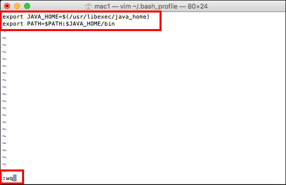
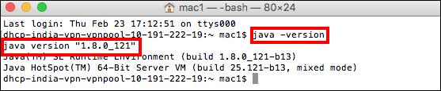
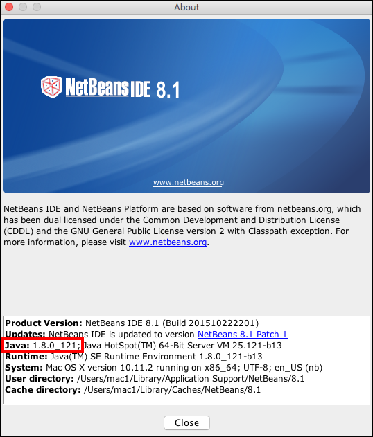
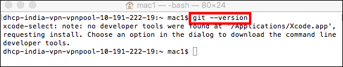
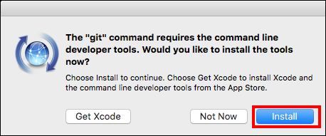
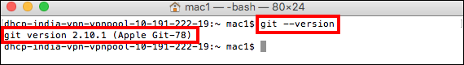
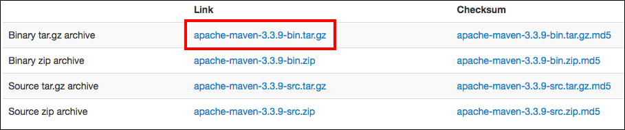
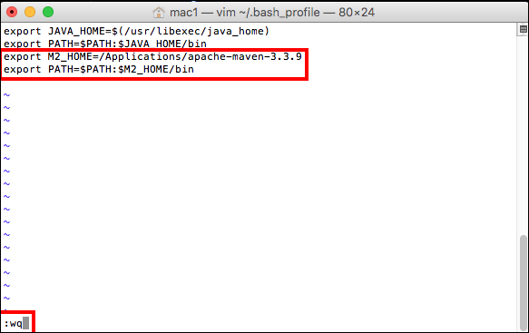

# PART I: Local Development Environment Setup

## Overview

This document helps students understand the process to setup the Java
development environment on their computer, create project using “Maven”
and “Netbeans” and deploy it on Developer Cloud Service.

Here students deploy their existing “Blackjack” project on a local
Application Server, followed by deploying it on Oracle Application Cloud
Container Service and finally accessing it from an HTML-5 client.

**Important Note:** Login credentials like Identity Domain Name, User Name
and Password are required to work with Developer Cloud Service and
Oracle Application Container Cloud Service. Gather this information from
the email you have received from Oracle and keep it handy

## Software Download List

| **Name and Version**       | **Download Link**                                                   |
|----------------------------|---------------------------------------------------------------------|
| **JDK 8 or higher**        | <http://www.oracle.com/technetwork/java/javase/overview/index.html> |
| **Netbeans 8.1 or higher** | <https://netbeans.org/downloads/>                                   |
| **GIT 2.10.1 or higher** | <https://git-scm.com/downloads>                                     |
| **Maven 3.3.9 or higher**  | <http://maven.apache.org/download.cgi>                              |

**Note**: List of software mentioned in the above table can be downloaded
and stored onto your computer before you get started to save download
time.

**Or**

Software can be downloaded as you go along with the exercises. Each
exercise contains detailed steps for downloading and installing required
software.

It is assumed that you will be working on a 64bit setup and provided
instructions accordingly to download and install software. If you are
not working on 64bit setup then download the software compatible to with
your setup.

## Installing JDK

Use the following instructions to download, install, and configure Java
Development Kit on your computer.

**Note: JDK-8U121** is the latest version of JDK available at the time of
creating this document. It is highly recommended that you download the
newer version of JDK (if available) and perform these lab activities.

If you already have the JDK 8 or higher version installed on your
computer then skip **Installing JDK activity** and proceed with **Setting Java
Environment Variables** activity to setup/verify environment variables.

1.  Open a browser and navigate to
    <http://www.oracle.com/technetwork/java/javase/overview/index.html>

2.  Click the **Downloads** tab and download the latest version of
    JDK available. In this case, we are downloading JDK-8U121.

    

3.  You must accept the “Oracle Binary Code License Agreement for Java
    SE” to download the software. Click the **Accept License
    Agreement** button.

4.  Download the **jdk-8u121-macosx-x64.dmg** installer file on to
    your computer. The download may take some time. Wait for the
    download to complete before proceeding to the next step.

5.  Double-click the **jdk-8u121-macosx-x64.dmg** file to start
    the installation.

6.  Double-click on **JDK 8 Update 121.pkg** icon to install Java
    Development Kit in JDK 8 updates 121 window.

7.  When the installer opens, click the **Continue** button in
    Introduction screen.

8.  Click Install button in Installation Type screen. Enter the
    administrator user name and password if prompted.

9.  Wait until the installer installs the JDK successfully and displays
    a “The installation was completed successfully” message. Click
    the **Close** button.

### Setting Java Environment Variables

#### Setting Up JAVA\_HOME, PATH, and CLASSPATH Environment Variables

Use the following instructions for setting JAVA\_HOME and PATH
environment variables

Note: You must be logged on to your computer as an Admin user.

1.  Open a terminal window and run `vim ~/.bash_profile` command

2.  Update the ~/.bash\_profile file with the below commands

        export JAVA_HOME=$(/usr/libexec/java_home)
        export PATH=$PATH:$JAVA_HOME/bin

3.  Save the ~/.bash\_profile file

    

### Verifying the JDK Installation

1.  **Verify the Java version:** Open a terminal window and run the `java
    -version` command. This verifies that a JRE is installed but does not
    verify that the JDK is installed. Verify that the output of the `java
    –version` command shows “1.8.0\_121” or higher.

    

## Installing Netbeans

Use the following instructions to download, install, and configure
Netbeans IDE on your computer.

**Note: Netbeans 8.1** is the latest version available at the time of
creating this document. It is highly recommended that you download the
newer version of the IDE (if available) and perform these lab
activities.

If you already have the Netbeans 8.1 or higher version installed on your
computer then skip **Installing Netbeans** step and proceed with **Verifying
the Netbeans Installation** step.

1.  In the Firefox browser, navigate to
    <https://netbeans.org/downloads/>.

2.  Download Netbeans 8.1 version which supports **All** technologies from
    the last column.

3.  Download the **netbeans-8.1-macosx.dmg** installer file to
    your computer. Download may take some time. Wait for the download to
    complete before proceeding to the next step.

4.  Double-click **netbeans-8.1-macosx.dmg** file to open the installer.

5.  Double-click **Netbeans 8.1.pkg** to start the installation.

6.  Click **Continue** button in the security warning window

7.  Click **Continue** button in the Introduction screen

8.  Accept the terms in the Software License Agreement window and click
    the **Continue** button.

9.  Accept the default Installation location.

10. Click **Customize** button, click the check box to select **Apache Tomcat
    8.0.27**, and click **Install** button.

11. Enter the Administrator user name and password if prompted.

12. Wait until the installer installs the Netbeans and displays a “**The
    Install was Successful.**” message. Click the **Close** button.

### Verifying the Netbeans Installation

1.  **Verify Netbeans:** To start the Netbeans IDE and verify the version
    number of the JDK used by the IDE, launch Netbeans 8.1
    from Applications. Netbeans opens to a “Start Page.” Open the
    Netbeans menu and select About Netbeans. The Netbeans and Java
    versions should be Netbeans IDE 8.1 and Java 1.8.0\_121. When done,
    Close the About window.

    

## Installing GIT

Use the following instructions to download and install GIT Tool on your
computer.

**Note: GIT Version 2.10.1** is the latest version of the tool available at
the time of creating this document. It is highly recommended that you
download the newer version of this tool  
(if available) and perform these lab activities.

If you already have the GIT 2.10.1 or higher version installed on your
computer then skip **Installing GIT** activity and proceed with **Verifying
the GIT Installation** activity.

1.  Open a terminal window and run git --version command

    

    **Note:** This command installs GIT tool if it is not installed already.

2.  Click on **Install** button

    

3.  Click on **Agree** button to accept the license agreement.

4.  Wait until the installer downloads and installs GIT tool and
    displays a “**The Software was installed.**” message. Click the
    **Done** button.

### Verifying the GIT Installation

1.  **Verify GIT Tool:** Open a terminal window and run `git
    --version` command. Verify that the output of the `git --version`
    command shows “git version 2.10.1 (Apple Git-78)”

    

## Installing Maven

Use the following instructions to download, install, and configure Maven
on your computer.

**Note: Maven 3.3.9** is the latest version of the tool available at the
time of creating this document. It is highly recommended that you
download the newer version of this tool (if available) and perform these lab
activities.

If you already have the Maven 3.3.9 or higher version installed on your
computer then skip **Installing Maven** activity and proceed with **Setting
Maven Environment Variables** activity to setup/verify the required
environment variables.

1.  Open a browser and navigate to
    <http://maven.apache.org/download.cgi>.

2.  Download the Binary ZIP archive, **apache-maven-3.3.9-bin.tar.gz** file
    on to your computer. The download may take some time. Wait for the
    download to complete before proceeding to the next step.

    

3.  Unzip the distribution archive to /Applications directory.

4.  Copy the complete path (/Applications/apache-maven-3.3.9) once the
    extraction is completed; this is required to create
    environment variables.

### Setting Maven Environment Variables

Use the following instructions for setting M2\_HOME and PATH environment
variables.

**Note:** You must be logged on to your computer as the Admin user.

1.  Open a terminal window and run `vim ~/.bash_profile` command

2.  Update the **~/.bash\_profile** file with the commands
    mentioned below.

        export M2_HOME=/Applications/apache-maven-3.3.9
        export PATH=$PATH:$M2_HOME/bin

3.  Save the **~/.bash\_profile** file

    

### Verifying Maven Installation

1.  **Verify the Maven version**: Restart your terminal window and run
    `mvn --version` command. Verify that the output of the `mvn -–version`
    command matches with the following screenshot:

    
