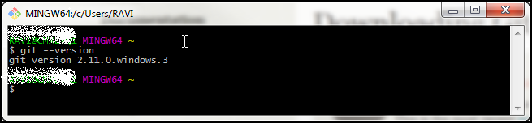
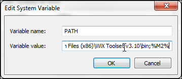
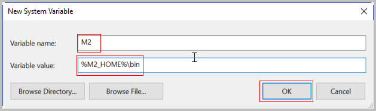
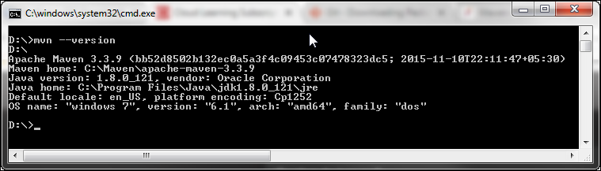

# PART I: Local Development Environment Setup

## Overview

This document helps students understand the process to setup the Java
development environment on their computer, create project using “Maven”
and “Netbeans” and deploy it on Developer Cloud Service.

Here students deploy their existing “Blackjack” project on a local
Application Server, followed by deploying it on Oracle Application Cloud
Container Service and finally accessing it from an HTML-5 client.

**Important Note:** Login credentials like Identity Domain Name, User
Name and Password are required to work with Developer Cloud Service and
Oracle Application Container Cloud Service. Gather this information from
the email you have received from Oracle and keep it handy

## Software Download List

| **Name and Version**       | **Download Link**                                                   |
|----------------------------|---------------------------------------------------------------------|
| **JDK 8 or higher**        | <http://www.oracle.com/technetwork/java/javase/overview/index.html> |
| **Netbeans 8.1 or higher** | <https://netbeans.org/downloads/>                                   |
| **GIT 2.11.0.3 or higher** | <https://git-scm.com/downloads>                                     |
| **Maven 3.3.9 or higher**  | <http://maven.apache.org/download.cgi>                              |

**Note**: List of software mentioned in the above table can be downloaded
and stored onto your computer before you get started to save download
time.

**Or**

Software can be downloaded as you go along with the exercises. Each
exercise contains detailed steps for downloading and installing required
software.

It is assumed that you will be working on a 64bit setup and provided
instructions accordingly to download and install software. If you are
not working on 64bit setup then download the software compatible to with
your setup.

## Installing JDK

Use the following instructions to download, install, and configure Java
Development Kit on your computer.

**Note: JDK-8U121** is the latest version of JDK available at the time
of creating this document. It is highly recommended that you download
the newer version of JDK (if available) and perform these lab
activities.

If you already have the JDK 8 or higher version installed on your
computer then skip **Installing JDK** step and proceed with **Setting Up
JAVA\_HOME, PATH, and CLASSPATH Environment Variables** to setup/verify
environment variables.

1.  In the Firefox browser, navigate to
    <http://www.oracle.com/technetwork/java/javase/overview/index.html>

2.  Click the **Downloads** tab and download the latest version of
    JDK available. In this case, we are downloading JDK-8U121.

    

3.  You must accept the “Oracle Binary Code License Agreement for Java
    SE” to download the software. Click the **Accept License
    Agreement** button.

4.  Download the **jdk-8u121-windows-x64.exe** installer file on to
    your computer. The download may take some time. Wait for the
    download to complete before proceeding to the next step.

5.  Double-click the **jdk-8u121-windows-x64.exe** file to start
    the installation.

    **Note:** If you receive a security warning such as “Do you want to
    allow the following program to make changes to this computer?” click
    **Yes**.

6.  When the installer opens, click the **Next** button.

7.  Accept the default installation locations and click **Next** twice.

8.  Wait until the installer installs the JDK successfully and displays
    a “Java SE Development Kit 8 Update 121 (64-bit)” message. Click the
    **Close** button.

### Windows 7 – Setting Environment Variables

#### Setting Up JAVA\_HOME, PATH, and CLASSPATH Environment Variables

**Note:** You must be logged on to your computer as the Admin user.

1.  Click the Windows **Start** button. Right-click **Computer** and
    select **Properties**. Click **Advanced system settings**.

2.  Click **Environment Variables**.

3.  In the Environment Variables window, under **System Variables**,
    click the **New** button.

4.  In the New System Variable window, enter the Variable name
    **JAVA\_HOME**, enter the Variable value **C:\\Program
    Files\\Java\\jdk1.8.0\_121,** and then click the **OK** button.

    

5.  Select **PATH** system variable and click the **Edit** button (If
    PATH system variable is not available, click the **New** button to
    create PATH variable, enter the Variable value **C:\\Program
    Files\\Java\\jdk1.8.0\_121,** and then click the **OK** button).

6.  In the Edit System Variable window, in the Variable value field,
    place the cursor at the starting position and enter **C:\\Program
    Files\\Java\\jdk1.8.0\_121\\bin**; Then click the **OK** button.

    

7.  Click the **New** button to create another System Variable.

8.  In the New System Variable window, enter the Variable name
    **CLASSPATH**, enter the Variable value **C:\\Program
    Fles\\Java\\jdk1.8.0\_121\\lib\\tools.jar;.;** (this has a
    semicolon, a period, and a semicolon at the end), and then click the
    **OK** button.

    .

9.  You have created/updated three system variables. Click the **OK**
    button to close the Environment Variables and System
    Properties windows. Close the Control Panel window.

### Windows 10 – Setting Environment Variables

#### Setting Up JAVA\_HOME, PATH, and CLASSPATH Environment Variables

**Note:** You must be logged on to your computer as the Admin user.

1.  In Windows Desktop, right-click on **This PC** and select
    **Properties**. Click **Advanced system settings**.

2.  Click **Environment Variables**.

3.  In the Environment Variables window, under **System Variables**,
    click the **New** button.

4.  In the New System Variable window, enter the Variable name
    **JAVA\_HOME**, enter the Variable value **C:\\Program
    Files\\Java\\jdk1.8.0\_121** and then click the **OK** button.

    

5.  Select **PATH** system variable and click the **Edit** button (If
    PATH system variable is not available, click the **New** button to
    create PATH variable, enter the Variable value **C:\\Program
    Files\\Java\\jdk1.8.0\_121;** and then click the **OK** button).

6.  In the Edit Environment Variable window, click **New** button and
    enter **C:\\Program Files\\Java\\jdk1.8.0\_121\\bin** then click the
    **OK** button.

    

7.  Click the **New** button to create another System Variable.

8.  In the New System Variable window, enter the Variable name
    **CLASSPATH**, enter the Variable value **C:\\Program
    Fles\\Java\\jdk1.8.0\_121\\lib\\tools.jar;.;** (this has a
    semicolon, a period, and a semicolon at the end), and then click the
    **OK** button.

    .

9.  You have created/updated three system variables. Click the **OK**
    button to close the Environment Variables and System
    Properties windows.

### Verifying the JDK Installation

1.  **Verify the Java version:** Open a Command Prompt window and run
    the `java -version` command. This verifies that a JRE is installed but
    does not verify that the JDK is installed. Verify that the output of
    the `java –version` command shows “1.8.0\_121” or higher.

    

## Installing Netbeans

Use the following instructions to download, install, and configure
Netbeans IDE on your computer.

**Note: Netbeans 8.1** is the latest version available at the time of
creating this document. It is highly recommended that you download the
newer version of the IDE (if available) and perform these lab
activities.

If you already have the Netbeans 8.1 or higher version installed on your
computer then skip **Installing Netbeans** step and proceed with
**Verifying the Netbeans Installation** step.

1.  In the Firefox browser, navigate to
    <https://netbeans.org/downloads/>.

2.  Download Netbeans 8.1 version which supports **All** technologies
    from the last column.

3.  Download the **netbeans-8.1-windows.exe** installer file on to
    your computer. The download may take some time. Wait for the
    download to complete before proceeding to the next step.

4.  Double-click the **netbeans-8.1-windows.exe** file to start
    the installation.

    **Note:** If you receive a security warning such as “Do you want to
    allow the following program to make changes to this computer?” click
    **Yes**.

5.  When the installer opens, click the **Customize**… button, click the
    check box to select **Apache Tomcat 8.0.27** under the **Runtimes**
    section, and click the **OK** button.

6.  Click the **Next** button on the Welcome screen to proceed with
    the installation.

7.  Accept the terms in the license agreement and click the
    **Next** button.

8.  Accept the default **Install the NetBeans IDE to:** path for
    NetBeans, make sure the correct installation path of
    JDK (jdk1.8.0\_121) is selected in the **JDK for the NetBeans IDE:**
    field, and click the **Next** button.

9.  Accept the default installation path for **Glassfish** and **Apache
    Tomcat** and click the **Next** button. Click the **Install**
    button on the Summary window.

10. Wait until the installer installs the Netbeans and displays a
    “**Setup Complete**” message. Click the **Finish** button.

### Verifying the Netbeans Installation

1.  **Verify Netbeans:** To start the Netbeans IDE and verify the
    version number of the JDK used by the IDE, double-click the
    **Netbeans 8.1** shortcut on the desktop. Netbeans opens to a “Start
    Page.” Open the **Help** menu and select **About**. The Netbeans and
    Java versions should be **Netbeans IDE 8.1** and
    **Java 1.8.0\_121.** When done, **Close** the **About** window.

## Installing GIT

Use the following instructions to download, install, and configure GIT
Tool on your computer.

**Note: GIT 2.11.0.3** is the latest version of the tool available at
the time of creating this document. It is highly recommended that you
download the newer version of this tool  
(if available) and perform these lab activities.

If you already have the GIT 2.11.0.3 or higher version installed on your
computer then skip **Installing GIT** step and proceed with **Verifying
the GIT Installation** step.

1.  In the Firefox browser, navigate to <https://git-scm.com/downloads>
    and click the **Downloads for Windows** button.

2.  Download the **Git-2.11.0.3-64-bit.exe** installer file to
    your computer. The download may take some time. Wait for the
    download to complete before proceeding to the next step.

3.  Double-click the **Git-2.11.0.3-64-bit.exe** file to start
    the installation.

    **Note:** If you receive a security warning such as “Do you want to
    allow the following program to make changes to this computer?” click
    **Yes**.

4.  When the installer opens, click the **Next** button.

5.  Accept the default installation path for **GIT** and click the
    **Next** button.

6.  Accept the default selection on the **Select Components** screen and
    click the **Next** button.

7.  Accept the default value on the **Select Start Menu Folder** screen
    and click the **Next** button.

8.  Select the **Use Git from Git Bash only** option on the **Adjusting
    your PATH environment** screen and click the **Next** button.

    

9.  Accept the default selection on the **Configuring the line ending
    conversions** screen and click the **Next** button.

10. Accept the default selection on the **Configuring the terminal
    emulator to use with Git Bash** screen and click the
    **Next** button.

11. Accept the default selection on the **Configuring extra options**
    screen and click the **Next** button.

12. Accept the default selection on the **Configuring experimental
    options** screen and click the **Install** button. Wait until the
    installer installs the **Git 2.11.0.3** and displays a “**Setup has
    finished installing Git on your computer**” message. Click the
    **Finish** button.

### Verifying the GIT Installation

1.  **Verify GIT:** Open **Git Bash** from the Windows **Start** menu
    and run the `git --version` command. Verify that the output of the `git
    --version` command shows “git version 2.11.0.windows.3.”

    

## Installing Maven

Use the following instructions to download, install, and configure Maven
on your computer.

**Note: Maven 3.3.9** is the latest version of the tool available at the
time of creating this document. It is highly recommended that you
download the newer version of this tool (if available) and perform these lab
activities.

If you already have the Maven 3.3.9 or higher version installed on your
computer then skip **Installing Maven** step and proceed with **Setting
Up the M2\_HOME, M2, and PATH Environment Variables** step to
setup/verify the required environment variables.

1.  In the Firefox browser, navigate to
    <http://maven.apache.org/download.cgi>.

2.  Download the Binary ZIP archive, **apache-maven-3.3.9-bin.zip** file
    on to your computer. The download may take some time. Wait for the
    download to complete before proceeding to the next step.

    

3.  Create a directory named **Maven** in C:\\ and unzip the
    distribution archive to **C:\\Maven** directory.

    **Note:** You should achieve the directory structure highlighted in the screenshot

    

4.  Copy the complete path (**C:\\Maven\\apache-maven-3.3.9**) once the
    extraction is completed; this is required to create
    environment variables.

### Windows 7 – Setting Environment Variables

#### Setting Up the M2\_HOME, M2, and PATH Environment Variables

**Note:** You must be logged on to your computer as the Admin user.

1.  Click the Windows **Start** button. Right-click **Computer** and
    select **Properties**. Click **Advanced system settings**.

2.  Click **Environment Variables**.

3.  In the Environment Variables window, under **System Variables**,
    click the **New** button.

4.  In the New System Variable window, enter the Variable name
    **M2\_HOME**, enter the Variable value
    **C:\\Maven\\apache-maven-3.3.9** , and then click the
    **OK** button.

    

5.  In the Environment Variables window, under **System Variables**,
    click the **New** button.

    In the New System Variable window, enter the Variable name **M2**,
    enter the Variable value **%M2\_HOME%\\bin** , and then click the
    **OK** button.

    

6.  Select the **PATH** system variable and click the **Edit** button.

7.  In the Edit System Variable window, in the Variable value field,
    place the cursor at the last position and enter **;%M2%** and then
    click the **OK** button.

    

8.  Click **OK** button twice to to close Edit System Variable and
    System Property windows

### Windows 10 – Setting Environment Variables

#### Setting Up the M2\_HOME, M2, and PATH Environment Variables

**Note:** You must be logged on to your computer as the Admin user.

1.  In Windows Desktop, right-click **This PC** and select
    **Properties**. Click **Advanced system settings**.

2.  Click **Environment Variables**.

3.  In the Environment Variables window, under **System Variables**,
    click the **New** button.

4.  In the New System Variable window, enter the Variable name
    **M2\_HOME**, enter the Variable value
    **C:\\Maven\\apache-maven-3.3.9** and then click the **OK** button.

    

5.  In the Environment Variables window, under **System Variables**,
    click the **New** button.

    In the New System Variable window, enter the Variable name **M2**,
    enter the Variable value **%M2\_HOME%\\bin** , and then click the
    **OK** button.

    

6.  Select the **PATH** system variable and click the **Edit** button.

7.  In the Edit System Variable window, in the Variable value field,
    place the cursor at the last position and enter **;%M2%** and then
    click the **OK** button.

    

8.  Click **OK** button twice to to close Edit System Variable and
    System Property windows

### Verifying Maven Installation

1.  **Verify the Maven version:** Open a Command Prompt window and run
    the `mvn --version` command. Verify that the output of the `mvn
    -–version` command matches with the following screenshot:

    
