# PART III: Test, Build and Deploy the BlackJack Web Service App

## Downloading BlackJack Project from the Repository

 Download the [blackjack.zip](BlackJack.zip) file to your local machine

## Deploying the BlackJack Application on a Local Server

Use the following instructions to deploy the BlackJack application to
Apache Tomcat Server bundled with the project.

1.  Open a graphical file explorer and navigate to the **cloud** directory.

2.  Inside the **cloud** directory, create a directory named
    **BlackJack** and copy the **BlackJack.zip** file that you
    downloaded in the earlier exercise.

3.  Unzip the **BlackJack.zip** file to the **cloud** **>**
    **BlackJack** directory.

4.  Launch Netbeans using the shortcut on the desktop.

5.  Open the **blackjack-part2** project in Netbeans.

    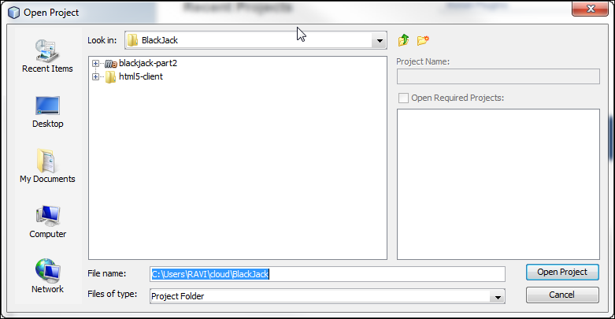

    **Note:** If you see a \[Unloaded\] tag against the project name then
    right-click on the project and select, **Resolve Project Problems**
    and then click on Resolve button. Please wait until Netbeans downloads
    the Maven related files then click on close button.

6.  Right-click the project and select the **Clean and**
    **Build** option.

    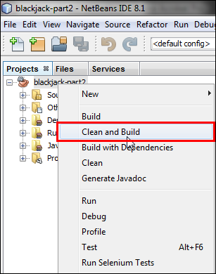

7.  Right-click the project and select **Run** to deploy the project on
    Tomcat Server.

    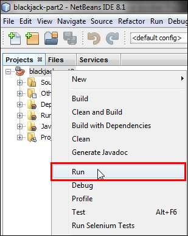

8.  Select **com.example.blackjack.rest.Application** from the Available
    Main Classes list and click the **Select Main Class** button.

    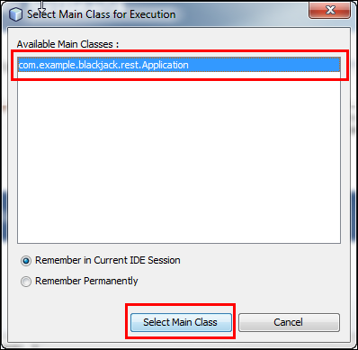

9.  You should receive a “*Started Application in
    &lt;&lt;seconds&gt;&gt; seconds (JVM running for 5.19)*” message in
    the Output window.

    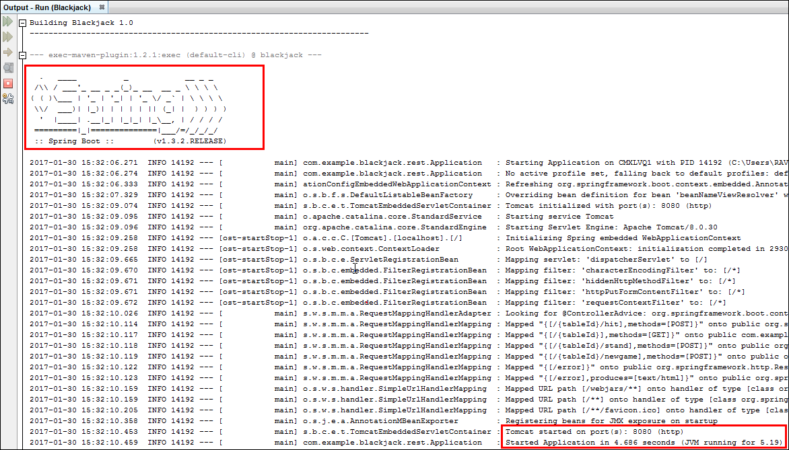

    **Note:** You may encounter a problem in running this project due to a
    port conflict issue. This application will be deployed to Apache Tomcat
    Server and it requires **8080** local port number to listen to the
    client request. Make sure you stop the services running on **8080**
    local port number.

    **TCPView** tool can be used to identify and terminate the process using
    this port number.

    [**Download Link**](https://technet.microsoft.com/en-us/sysinternals/bb897437)

## Testing the Locally Deployed BlackJack Application

An HTML-5 client application has been developed and supplied with the
BlackJack application to test its functionality once deployed on a
local/remote server.

Use the following instructions to test the BlackJack application.

1.  Open a graphical file explorer and navigate to the **cloud >
    BlackJack > html5-client** directory.

2.  Open the index.html file with a browser.

3.  Make sure that the first field, **Service**, is populated with
    **<http://127.0.0.1:8080/>** value, enter a number between 1 and 9
    in the second field, and then click Connect.

    

4.  Once you connect to the gaming console, click the **Debug on/off**
    button to view the Debug console.

    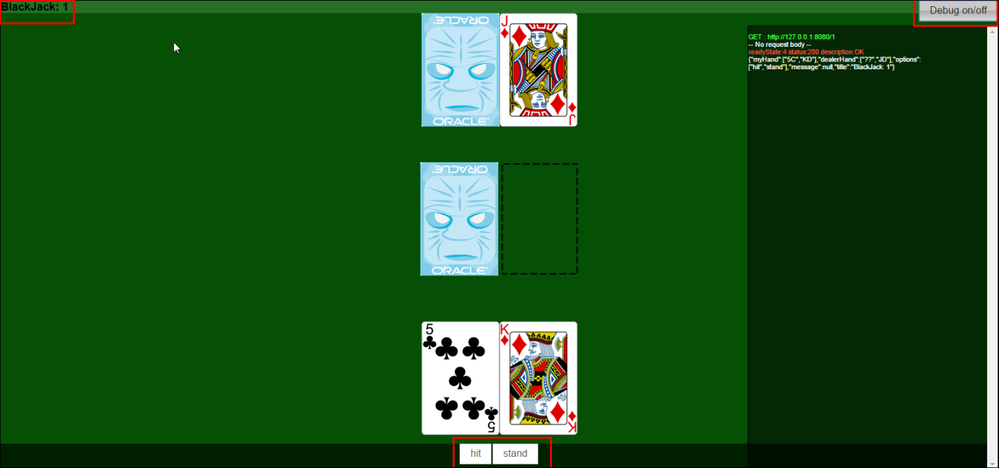

You can use the **Hit** and **Stand** buttons available on the UI to
play the game.

This HTML5 Client application interacts with the BlackJack gaming
application deployed on Tomcat Server running locally on your computer.
Close this HTML5 Client application once you are done.

## Generating Application Archive Files for the BlackJack Application

Oracle Application Container Cloud can deploy and run Java Platform,
Standard Edition (Java SE), and Node.js applications. First, to deploy
your application, we compress the application in a **ZIP** or **Gzipped
Tar (TGZ)** archive file, which includes the required configuration
information.

Use the following instructions to create an application archive.

1.  Open the blackjack-part2 application in Netbeans if it is not
    opened already.

2.  Right-click the project and click **Clean**.

    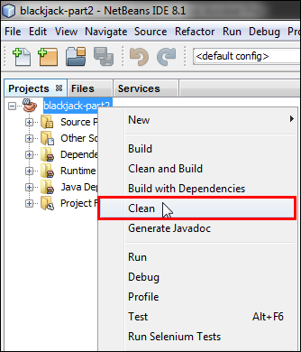

3.  Open a graphical file explorer, navigate to **cloud > BlackJack >
    blackjack-part2**, and make a note of the directory structure and
    its contents.

    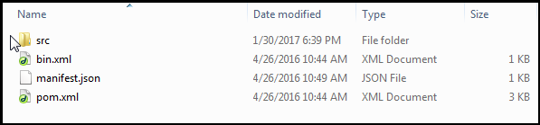

    **Note:** The manifest.json file is required for all applications
    deployed to Oracle Application Container Cloud Service. If this file
    is not present in the root directory of the .zip, .tar, or .tar.gz
    file, deployment will fail. At a minimum, this file specifies the
    major version of the runtime environment and the launch command.

    **Content of manifest.json file in this example**:

    ```json
    {
      "runtime": {
        "majorVersion": "8"
      },
      "command": "java -jar blackjack-part2-1.0.jar",
      "release": {
        "version": "1.0",
        "build": "1",
        "commit": "1A2B345"
      },
      "notes": "Blackjack Web Service"
    }
    ```

4.  Switch to Netbeans, right-click the project, and click **Build.**

    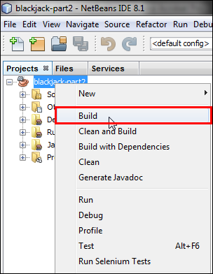

5.  Switch to the **cloud > BlackJack > blackjack-part2**
    directory and notice that a new directory named **target**
    is created.

6.  Examine the **target** directory. You will notice that **.zip and
    .tar.gz** distribution files have been generated. These are
    application archive files that we can use to deploy to OACCS.

    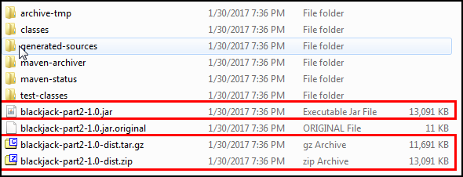

## Creating a New Project in Developer Cloud Service

Use the following instruction to create an empty Project on Developer
Cloud Service

1.  Login to your oracle cloud account.

2.  Click **Developer Cloud Service** on the Dashboard to go to the
    **ServiceDetails:developer85599 (Oracle Developer
    Cloud Service)** page.

    

3.  Click the **Open Service Console** button.

    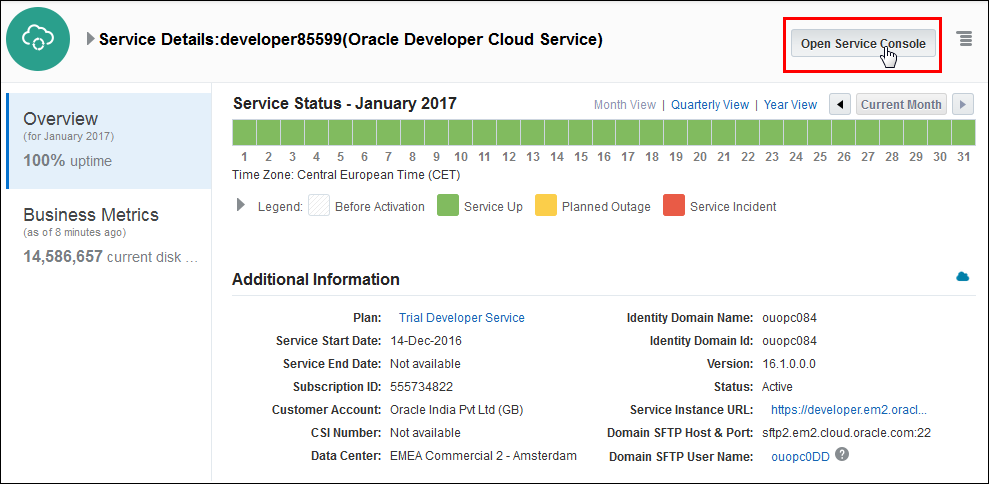

4.  Click **New Project**.

    

5.  Enter the Project Name and Description as shown in the following
    screenshot and click **Next**.

    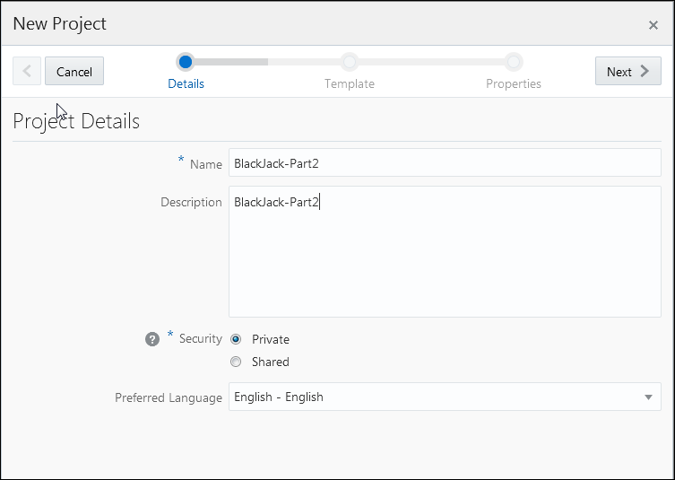

6.  Click the **Empty Project** template and **Next**.

    

7.  Select **MARKDOWN** from the Wiki Markup drop-down list and click
    **Finish.**

    

8.  Provisioning BlackJack-Part2 project may take several minutes. Wait
    until all the modules are provisioned and redirected to the
    BlackJack-Part2 home screen.

    

## Creating a GIT Repository in Developer Cloud Service

Use the following instructions to create an empty GIT repository on
Developer Cloud Service.

1.  Click the **New Repository** button in the **REPOSITORIES** section.

    

2.  In the New Repository window, enter the repository name and
    description as shown in the following screenshot and click **Create**.

    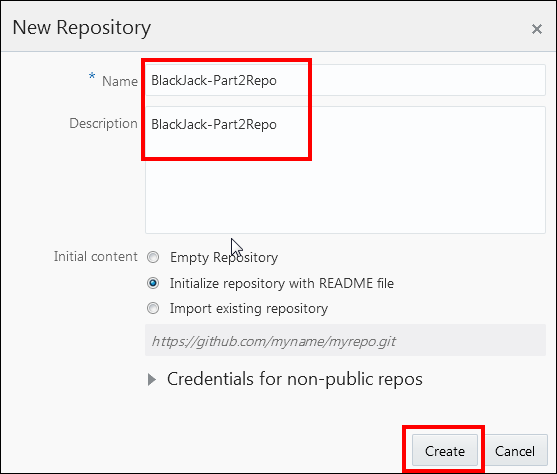

3.  It may take a few minutes to create a repository. Wait until the
    BlackJack-Part2Repo repository is created and redirected to its
    home page.

    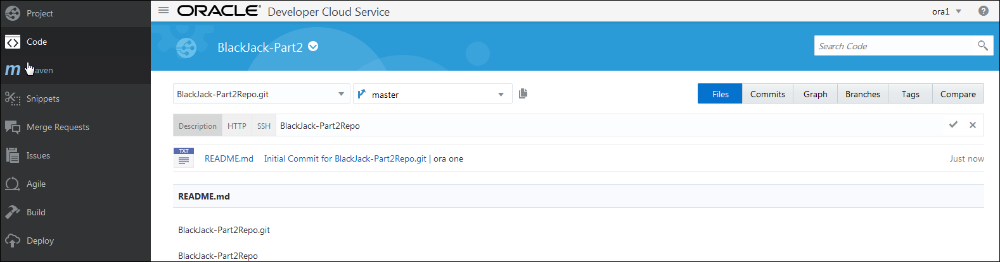

4.  Click the HTTP tab in the BlackJack-Part2Repo home page and copy
    the URL.

    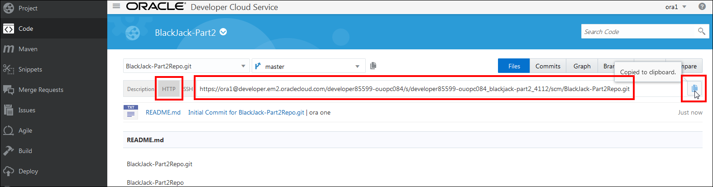

## Cloning a GIT Repository

Use the following instructions to clone the BlackJack-Part2 project to a
GIT repository on Developer Cloud Service.

1.  To clone a GIT repository, first change to the cloud/BlackJack
    directory that is the root directory for your repository.

2.  Execute `git clone https://ora1@developer.em2.oraclecloud.com/developer85599-ouopc084/s/developer85599-ouopc084\_blackjack-part2\_4112/scm/BlackJack-Part2Repo.git`

    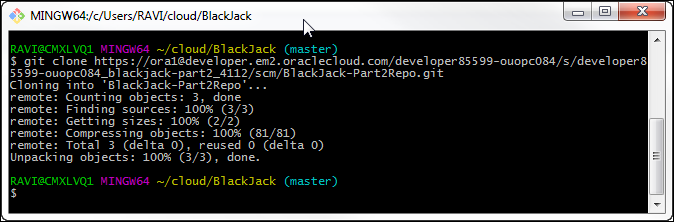

    **Notes:**

    -   Enter your cloud account username and password, if you are prompted.
    -   If you are not prompted for user name and password and if this
        command fails with 403 error then mention the password explicitly
        the GIT repository URL. For example: `git clone https://ora1@developer.em2.oraclecloud.com/developer85599-ouopc084/s/developer85599-ouopc084\_blackjack-part2\_4112/scm/BlackJack-Part2Repo.git`
    -   The output of this command should be similar to the output in the
        above screenshot.

3.  Notice that there is a new directory named **BlackJack-Part2Repo**
    created inside **cloud/BlackJack** directory.

4.  Copy and paste **blackjack-part2** project directory from
    **cloud/BlackJack** directory to **BlackJack-Part2Repo** directory

    **Note:** Content of the **BlackJack-Part2Repo** directory should
    match with the contents listed below screenshot.

    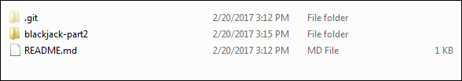

5.  Change to the **BlackJack-Part2Repo** directory

        cd BlackJack-Part2Repo

6.  Add the source files to GIT from project root directory

        git add .

7.  Commit the changes

        git commit –m "commiting changes to BlackJack-Part2Repo repository"

8.  Push the files to the repository on Developer Cloud Service

        git push origin master

    **Note:** Wait until all the files are pushed to repository

9.  Switch to Developer Cloud Service to verify the files pushed to the
    repository

10. In the **BlackJack-Part2** home page, click on **BlackJack-Part2Repo.git**

    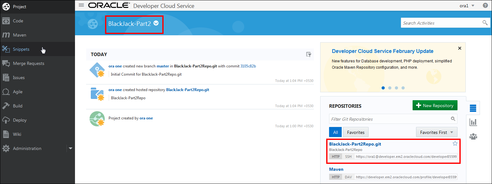

11. Notice that **blackjack-part2** project directory has been pushed to
    repository on Developer Cloud Service. Click on it and verify
    its contents.

    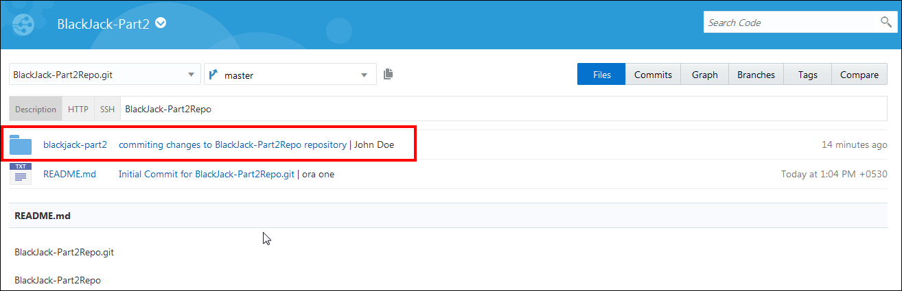

## Building a Project on Developer Cloud Service

Use the following instructions to build BlackJack-Part2 project in
Developer Cloud Service.

1.  In the left navigation pane, click on **Build** and then **New Job**.

    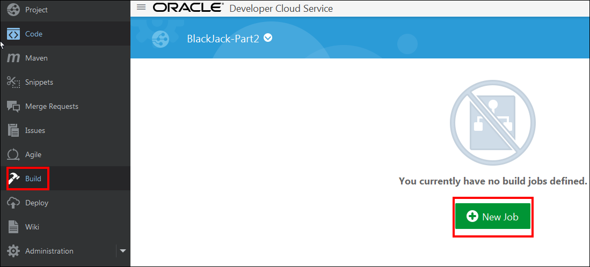

2.  In the New Job window, enter **BlackJack-Part2BuildJob** in the job
    name field and click on **Save**.

    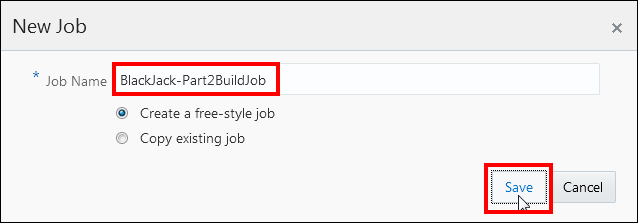

3.  In the **Main** tab, enter the following values:

    -   Edit the job name if it needs adjusting.
    -   Enter a description.
    -   Set the **JDK** to **JDK 8.**

    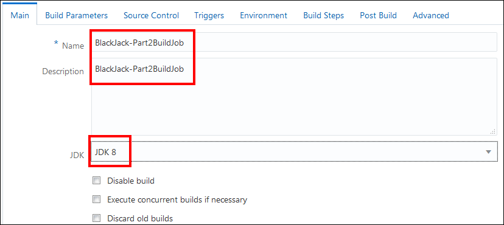

4.  Click the **Source Control** tab

    -   Select **Git** as your repository.
    -   For **URL**, select the URL to your Git repository.

    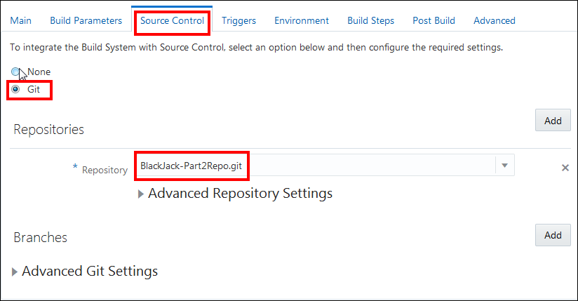

5.  Click the **Triggers** tab

    -   Based on SCM polling schedule

    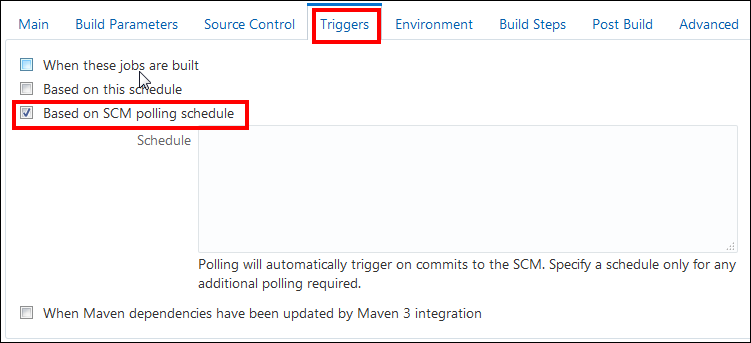

    **Note:** This setting will enable auto-deploy feature of DevCS. After
    the application is modified and if the changes are committed to GIT
    repository on DevCS, it automatically picks up the updated code and
    deploys.

6.  Click the **Build Steps** tab.

    -   Click Add Build Step and select Invoke Maven 3.
    -   Set the **Goals** to: clean package.
    -   Set the **POM File** location to: blackjack-part2/pom.xml

    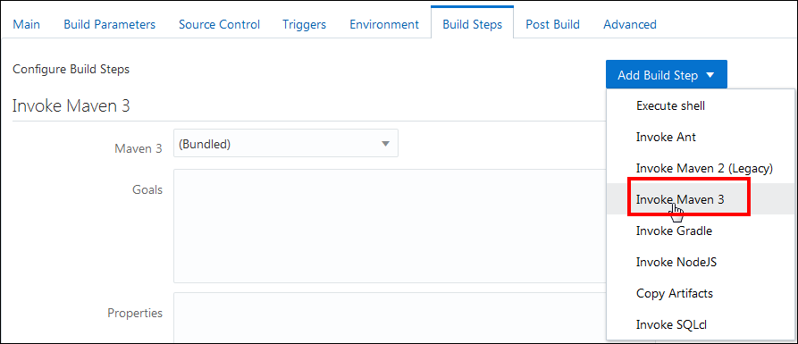
    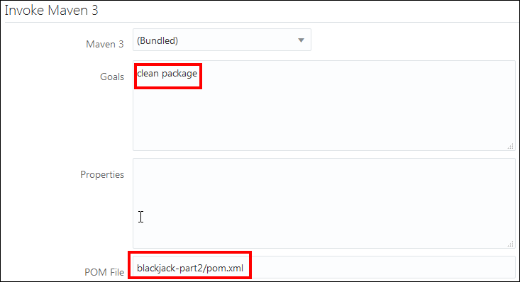

7.  Click the **Post Build** tab.

    -   Select Archive the artifacts.
    -   Set **Files To Archive** to: blackjack-part2/target/blackjack-part2-1.0.jar,
        blackjack-part2/target/blackjack-part2-1.0-dist.zip
    -   Set Compression Type to **NONE**.

    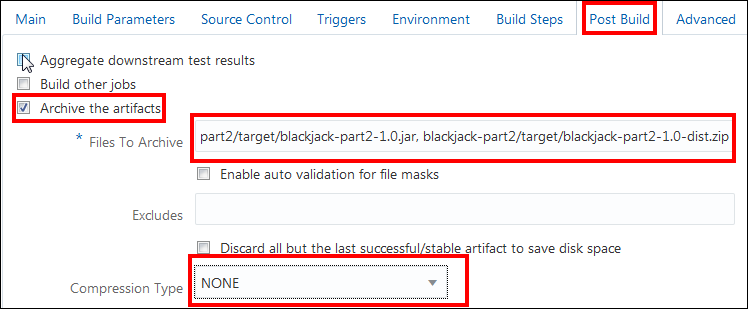

8.  Click **Save** and then click **Build Now**.

    If the build was successful, you'll see two files in the **Artifacts of Last Successful Build** section:
    -   blackjack-part2/target/blackjack-part2-1.0.jar
    -   blackjack-part2/target/blackjack-part2-1.0-dist.zip

    You can download them by clicking the file name.

    If the build failed then go back to check the build job configuration
    or click **Git Logs** to see more information about the error.

    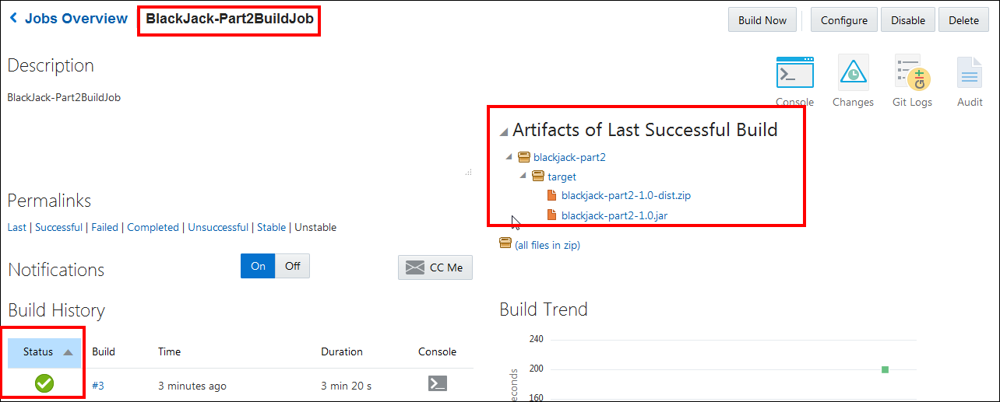

## Deploying a Project to ACCS from DevCS

Use the following instructions to deploy the BlackJack-Part2 to
Application Container Cloud Service from Developer Cloud Service.

1.  In the left navigation pane, click on **Deploy** and then **New
    Configuration**

    

2.  In the **New Deployment Configuration** page, enter
    the **Configuration Name** and **Application Name** as shown below

    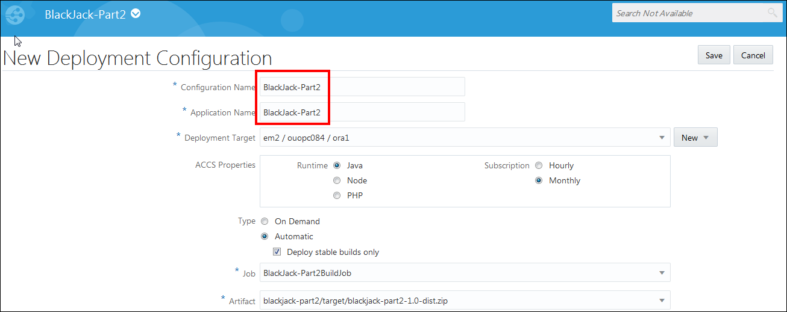

3.  In the **Deployment Target** field, click **New** and
    select **Application Container Cloud**

    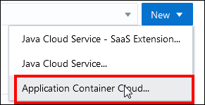

4.  In the **Deploy to Application Container Cloud** window, enter the
    following values and click **Test connection**

    -   Data center
    -   Identity Domain
    -   Username
    -   Password

    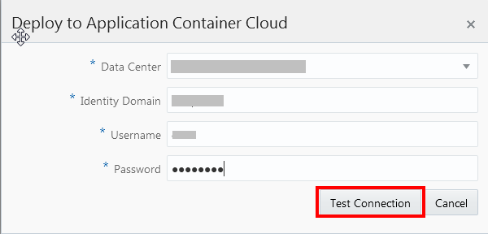

5.  When you see the **Successful** message click **Use Connection**

    

6.  Enter the following values and click **Save**

    -   **Type**: Automatic (Select Deploy stable build only)
    -   **Job:** BlackJack-Part2BuildJob
    -   **Runtime**: Java
    -   **Subscription:** Monthly
    -   **Artifact:** blackjack-part2/target/blackjack-part2-1.0-dist.zip

    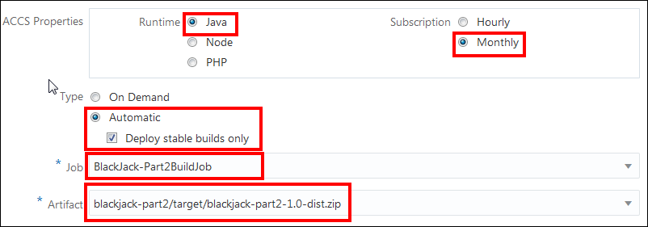

7.  Click the gear icon 
    and then select **Start** to deploy the application to Oracle
    Application Container Cloud Service.

8.  After the successful deployment, right-click on Blackjack-Part2
    project name and copy the URL

    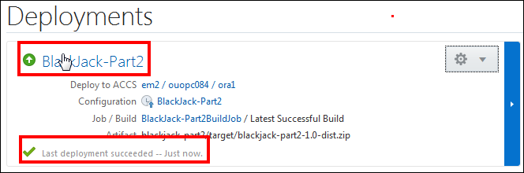

## Testing the BlackJack Application Deployed to OACCS from DevCS

An HTML-5 client application has been developed and supplied with the
BlackJack application to test its functionality once deployed on a
local/remote server.

Use the following instructions to test the BlackJack application.

1.  Open a graphical file explorer and navigate to the **cloud >
    BlackJack > html5-client** directory.

2.  Open the index.html file with a browser.

3.  Make sure that the first field, **Service**, is populated with the
    URL you copied in the previous exercise,
    <https://blackjack-part2-ouopc084.apaas.em2.oraclecloud.com/>. Enter a
    number between 1 and 9 in second field, and then click Connect.

    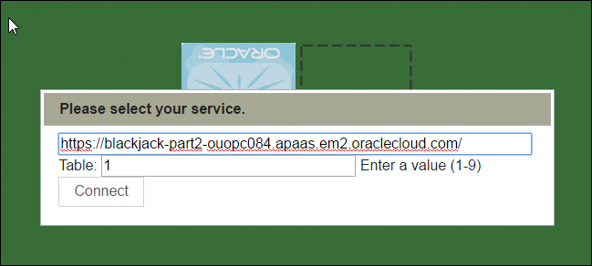

4.  Once you connect to the gaming console, click the **Debug on/off**
    button to view the Debug console.

    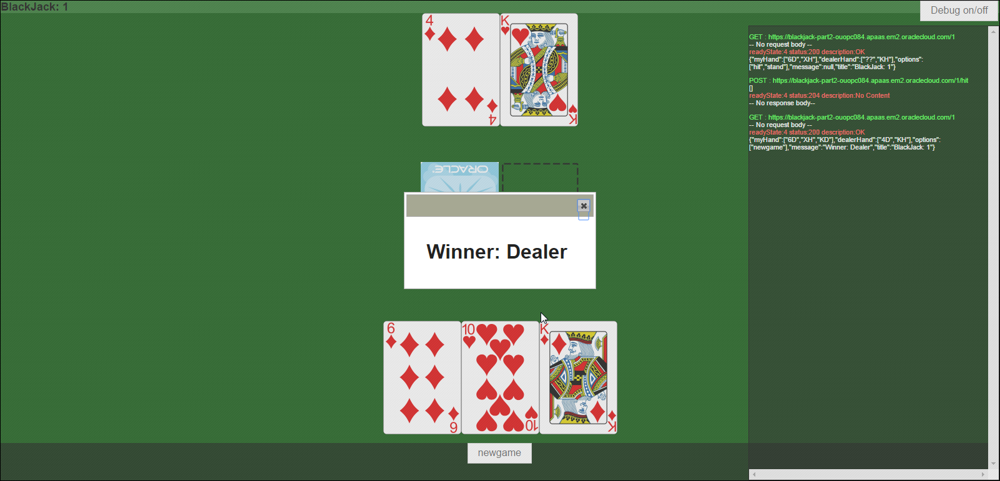

    **Note:** You can use the **Hit** and **Stand** buttons available on the
    UI to play the game.

This HTML5 Client application interacts with the BlackJack gaming
application deployed on OACCS on cloud.
