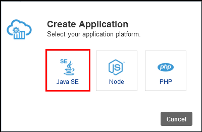
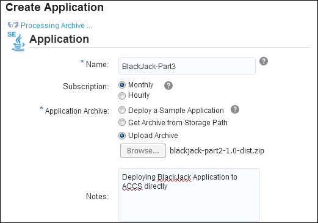
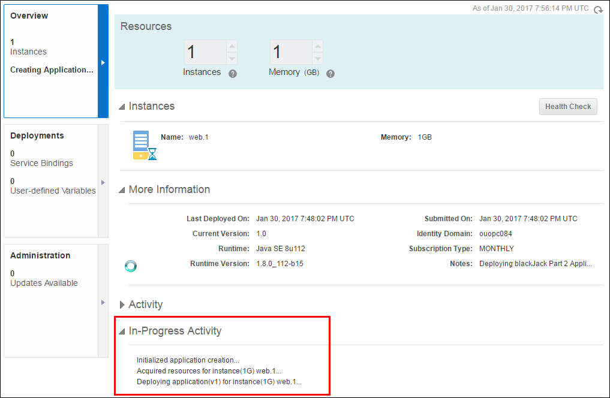
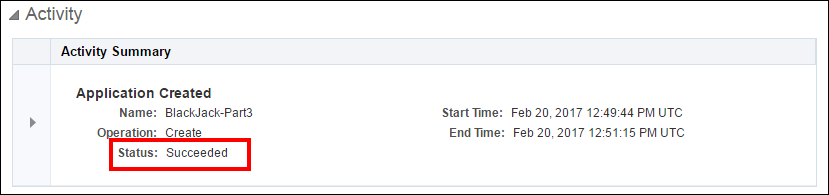

# PART IV: Deploy the BlackJack WebService App Directly to Oracle Application Container Cloud

## Activating Oracle Application Container Cloud Service (OACCS)

**Important Note:** The cloud login credentials and link are required to
perform this part of the lab activity. Gather this information from the
email you have received from Oracle and keep it handy.

For the purpose of creating this document, a cloud instance from the
EMEA region Data Center was used. You will get a cloud instance from the
NAMER region Data Center; select the Data Center accordingly.

Oracle Application Container Cloud Service can deploy and run Java
Platform, Standard Edition (Java SE), and Node.js applications. In this
activity, you will learn to deploy BlackJack application to ACCS using
the application archive file that we created in the previous activity.

Use the following instructions to deploy BlackJack application to ACCS
from its user interface.

1.  Sign In to Oracle Cloud account (Refer to **Activating Developer
    Cloud Service** activity for detailed instruction on how to Sign In)

2.  On a successful Sign In, we can see the **Identity Domain Name** and
    the **Username** on the Welcome page.

    

3.  Services that are assigned to your account will be visible on
    the Dashboard. If the **Application Container** service is not
    visible, click the **Customize Dashboard** button and **Show**
    button for **Application Container** to make it visible on
    the Dashboard.

    

4.  Click the **Application Container** on the Dashboard to go to the
    **Service Details: Oracle Application Container Cloud** page.

    

## Direct Deployment of BlackJack Application to OACCS

In this activity, you will learn to deploy an application archive to
ACCS directly. We are using the same sample application, BlackJack for
this deployment too.

Use the following instructions to deploy the BlackJack application to
OACCS directly.

1.  Click the **Open Service Console** button.

    

2.  Click the **Create Application** and **Java SE** buttons**.**

    

3.  In the **Create Application** dialog box, enter BlackJack-part3 for
    the application name, select **Monthly** for the subscription type,
    and enter **Deploying BlackJack Application to ACCS directly** in
    the Notes field. For the Application Archive field, select **Upload
    Archive**.

    

4.  Browse and select the **blackjack-part2-1.0-dist.zip** file from the
    **target** directory.

    

5.  The **Create Application** dialog box now shows the selected file.
    Under **Instance**, review the number of instances and the memory
    size, and make any necessary adjustments. Click **Create** to deploy
    your application to Oracle Application Container Cloud.

    

6.  A status message appears indicating that it is **Processing Archive**.

    

7.  After the archived application is uploaded, the service determines
    whether the archive is properly configured. If it is, the following
    dialog box appears. Click **OK**.

    

8.  It will take several minutes to deploy the application. The
    deployment status can be viewed under the In-Progress
    Activity section.

    

9.  You should see a **Status: Succeeded** message in the Activity
    section once the application has been deployed successfully.

    

10. Copy the application URL and paste it in a notepad. We will need
    this URL for testing purposes.

    

## Testing the BlackJack Application Deployed on OACCS

An HTML-5 client application has been developed and supplied with the
BlackJack application to test its functionality once deployed on a
local/remote server.

Use the following instructions to test the BlackJack application.

1.  Open a graphical file explorer and navigate to the **cloud >
    BlackJack > html5-client** directory.

2.  Open the index.html file with a browser.

3.  Make sure that the first field, **Service** is populated with the
    URL you copied in the previous exercise, <https://blackjack-part3-ouopc084.apaas.em2.oraclecloud.com/> .
    Enter a number between 1 and 9 in second field, and then
    click Connect.

    

4.  Once you connect to the gaming console, click the **Debug on/off**
    button to view the Debug console.

    

    **Note:** You can use the **Hit** and **Stand** buttons available on the
    UI to play the game.

This HTML5 Client application interacts with the BlackJack gaming
application deployed on OACCS on cloud.

With this you have successfully completed deploying BlackJack
application to ACCS directly using its user interface and testing.
