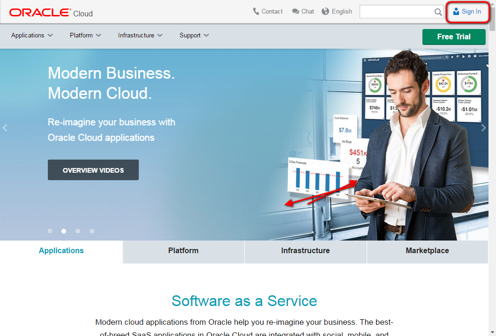
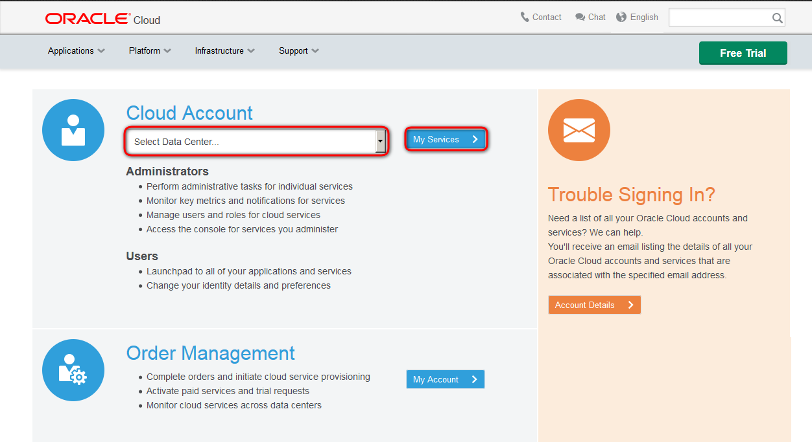
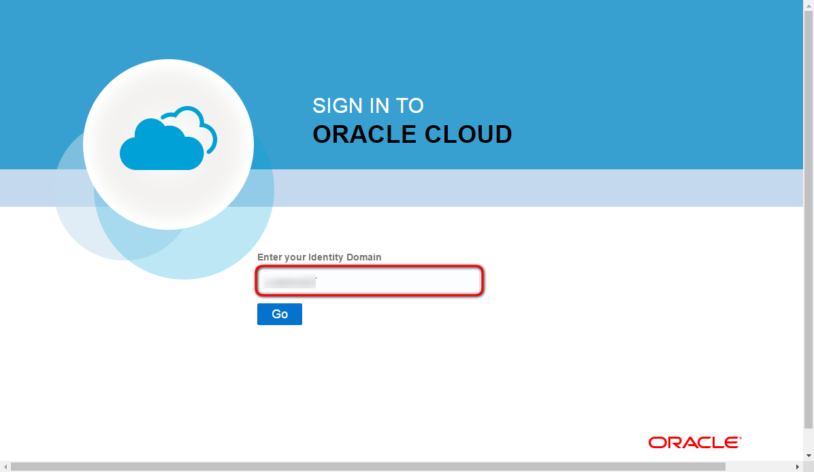
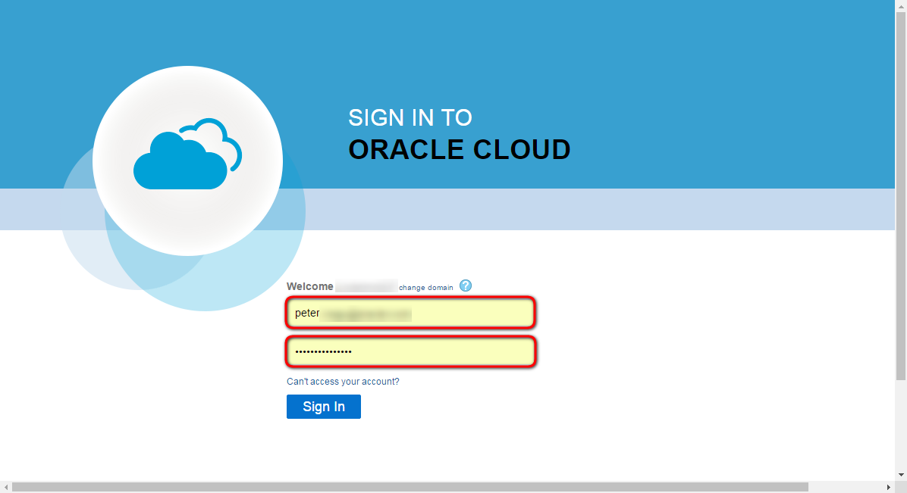
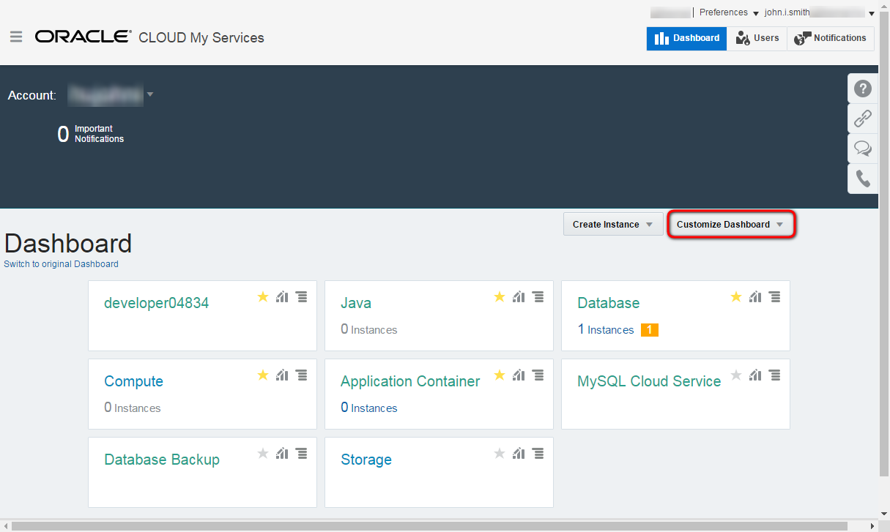

# ORACLE Cloud-Native DevOps workshop #
-----
## Sign In to Oracle Cloud ##

1. Open a browser and go to [cloud.oracle.com](https://cloud.oracle.com). Click **Sign In**.

2. Select the datacenter and click **My Services**.

3. Enter the identity domain and click **Go**.

4. Enter username and password of user with Service Administrator role. Click **Sign In**.

5. On the Dashboard there are predefined tiles for different services. If the shortcut doesn't appear for a service click **Customize Dashboard** and mark the service to show on the dashboard.
