---
# ORACLE Cloud-Native DevOps workshop #

## Build Node.js - Cassandra DB container packaged application using Wercker and deploy to Oracle Container Cloud Service ##

### About this tutorial ###
**Wercker** is a Docker-Native CI/CD  Automation platform for Kubernetes & Microservice Deployments. Wercker is integrated with Docker containers, which package up application code and can be easily moved from server to server. Each build artifact can be a Docker container. The user can take the container from the Docker Hub or his private registry and build the code before shipping it. Its SaaS platform enables developers to test and deploy code often. They can push software updates incrementally as they are ready, rather than in bundled dumps. It makes it easier for coders to practice continuous integration, a software engineering practice in which each change a developer makes to the codebase is constantly tested in the process so that software doesn’t break when it goes live.

**Oracle Container Cloud Service** provides an easy and quick way to create an enterprise-grade container infrastructure. It delivers comprehensive tooling to compose, deploy, orchestrate and manage Docker container-based applications on the Oracle Public Cloud. It is designed to provision a ready to run containerized infrastructure quickly, that can be used as a test infrastructure, with a limited lifespan, or operated as a production environment for long running container applications.

Oracle Container Cloud Service provides feature called stack. The stack comprises all of the necessary configuration for running a set of services in a coordinated way, managed as a single entity, plus default deployment options. Note that stacks themselves are neither containers nor images running in containers, but rather are high-level configuration objects that you can create, deploy, and manage using Oracle Container Cloud Service.

In this example, stack contains a Cassandra DB container and the containerized sample Node.js application.

**Architecture**

This tutorial demonstrates how to:

- create Wercker application (CI/CD) to build, package and push Node.js sample application to Docker public repository
- create Oracle Container Cloud Service based on containerized Node.js sample application
- create Oracle Container Cloud Stack which contains the Node.js sample application and Cassandra DB services.
- deploy stack to Oracle Container Cloud Service

### Prerequisites ###

- [Github](https://github.com) account
- [Oracle Public Cloud Service](https://cloud.oracle.com) account including Container Cloud Service
- [Docker](https://cloud.docker.com/) account to have Docker registry.

----
#### Create Oracle Container Cloud Service instance ####

If you already have Container Cloud Service instance you can skip this step.

First create Oracle Container Cloud Service. Sign in to [https://cloud.oracle.com/sign-in](https://cloud.oracle.com/sign-in). Select your datacenter then provide the identity domain and credentials. After a successful login you will see your Dashboard. Find the Container tile and click the hamburger icon. In the dropdown menu click **Open Service Console**.

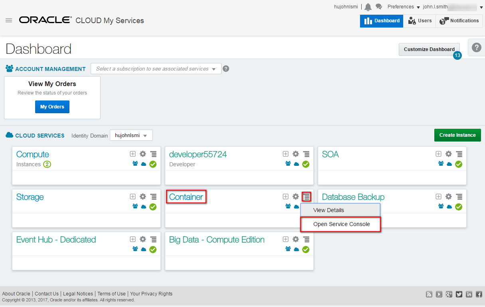

If it is the first time you launch this console then click **Go To Console** button on the Wizard page. Otherwise click immediately the **Create Service** button.

On the details page configure the service.

+ **Service Name**: name of the instance. E.g. *testOCCS*
+ **Description**: short description of the service. Can be anything which describes the purpose of this service.
+ **SSH Public Key**: to connect to the worker and master nodes you need to define your public key of your SSH keypair. Press the **Edit** button. In case if you already have one and you want to use that select the public key file or copy of that content into Key Value textfield. Otherwise and for test purposes I recommend to generate a new one. Select **Create a New Key** option and click **Enter**. A popup dialog will open which enables to download the newly generated key pair. It is important to have this key pair for later usage of this service. In case if you lost or forget where you saved the key pair you can [add new one](https://docs.oracle.com/cloud/latest/computecs_common/OCSUG/GUID-65AA23D4-5F57-4EF6-9704-C8E16932C0AD.htm#OCSUG233) using the My Services Dashboard.
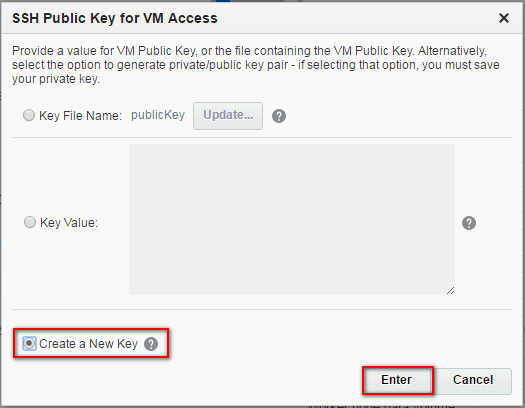
+ **Metering Frequency**: based on your subscription. Leave the default.
+ **Admin Username**: administrator's username of Container Cloud Service's console. You can leave the default.
+ **Admin Password**: administrator's password. Please note the password what you choose.
+ **Worker node Compute Shape**: the capacity of the service. For this sample the minimum is more than enough.
+ **Number of worker nodes**: The number of worker nodes which run the Docker containers. For this sample the default 1 node is enough. One node can execute more containers even if that share one OCPU only. Every worker node has a public IP address assigned what makes the running application publicly available.
+ **Worker node data volume size (GB)**: Leave the default.

Once all the details are configured click **Next**.

Check again the configuration and submit the instance provision request by clicking **Next**.

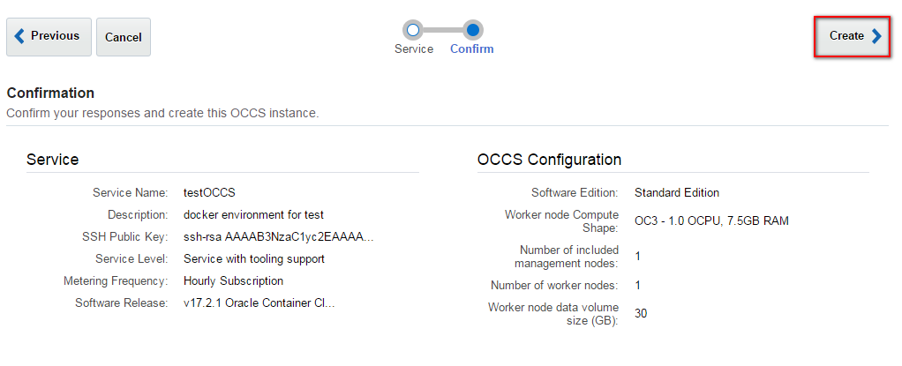

While the Container Cloud Service provisioning completes move forward to sign up Docker and create Wercker continous integration setup. 

#### Sign up to Docker ####

If you already have Docker account you can skip this step.

Go to [https://cloud.docker.com/](https://cloud.docker.com/) than choose your *Docker ID* enter your email address and a desired password. Click **Sign up**.

Now check your inbox and you should get a similar email. Click the **Confirm Your Email** button.

You can login now using your new Docker account.

#### Fork Node.js sample sources into your github repository ####

First make sure you are signed in to [https://github.com](https://github.com) using your account and than go to [https://github.com/nagypeter/node-cassandra-crud](https://github.com/nagypeter/node-cassandra-crud). In case you don't have Github account then please [sign up](https://github.com/join?source=header-home).

Now click **Fork**.

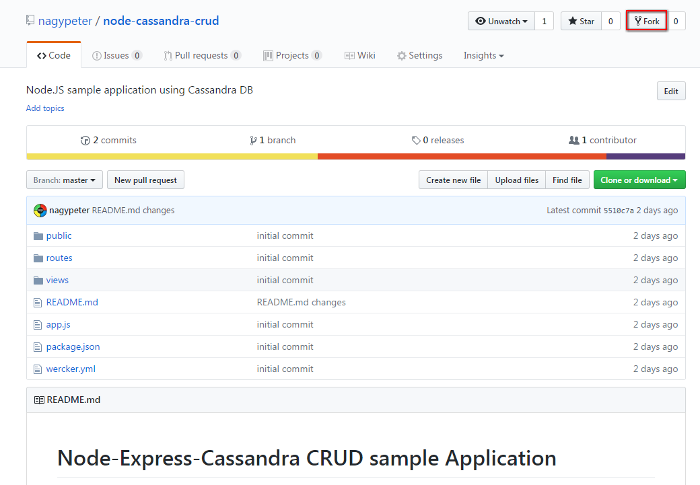

When the fork is done move to the next step.

Another option is to import this (*https://github.com/nagypeter/node-cassandra-crud.git*) repository as your new repository.

#### Sign up to Wercker using your Github account ####

When the import is done go to [https://app.wercker.com](https://app.wercker.com) and sign up using your github account. Click the **LOG IN WITH GITHUB** button.

If you use the same browser where you are already signed in to github then it will go directly to *Authorize application* github page. If not then enter your github's credentials to sign in to github. Click the **Authorize application** button to accept Wercker's request. You can revoke Wercker's authorization request anytime using your github's profile settings.

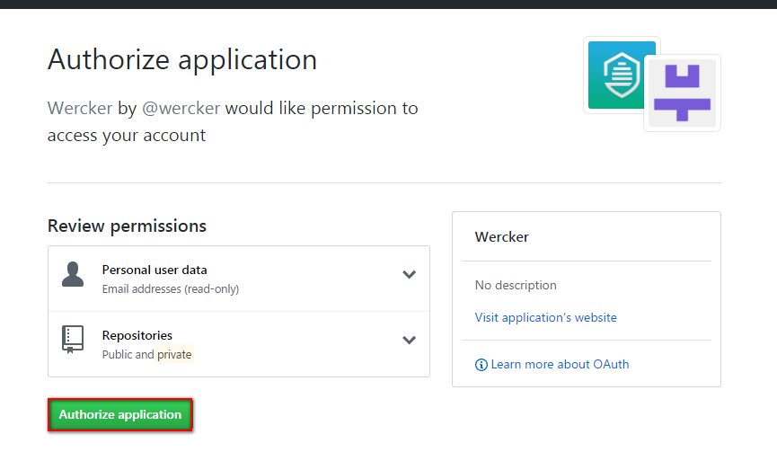

After the successfull authorization you will be redirected to *https://app.wercker.com*.

#### Create Wercker Application to build Docker container including Node.js sample application ####

Now here is the time to create your Wercker application. Wercker acts as continuous integration tool which will produce and push a complete Docker container including the Node.js sample application bits.

Go back to the Wercker's welcome page and click **Create your first application** button or the **+Create** dropdown list and select *Application*.

First select the repository you want to use as sources. By default it will show your Github provider and the available repositories. Select *node-cassandra-crud* and click **Use selected repo**. Leave the default checkout method and create as private.
After creation don't generate `wercker.yml` because the repository already contains so click the **trigger a build now** link. The default *build* pipeline starts to run which is a simple *npm install* -defined in *wercker.yml*- to get necessary node modules for Node.js sample application. The result should be successfull. You can open each step (on the right side) to get more details.

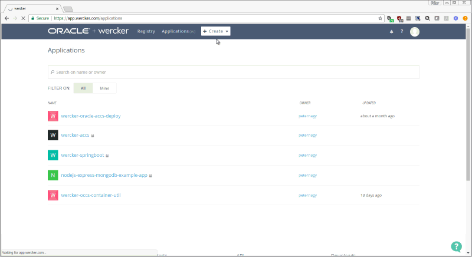

Before you move forward please inspect the *wercker.yml*. The source is available under your github repository. Open a new browser (tab) and go directly to *https://github.com/<YOUR_GITHUB_USERNAME>/node-cassandra-crud/blob/master/wercker.yml*. The configuration should be the same:

	box: node:6.10
	build:
	  steps:
	    # A step that executes `npm install` command
	    - npm-install
	push:
	  steps:
	    # Push to public docker repo
	    - internal/docker-push:
	        username: $DOCKER_USERNAME
	        password: $DOCKER_PASSWORD
	        tag: $WERCKER_GIT_COMMIT
	        repository: $DOCKER_REPOSITORY
	        registry: https://index.docker.io/v1/
	        cmd: node pipeline/source/app.js

The *wercker.yml* defines the configuration of your automation pipelines with a collection of Steps that you wish to execute.
In your *wercker.yml* you can specify any pipeline you like. There is one special pipeline called `dev` which will only be executed when running it with the CLI using the wercker dev command. Examples of pipeline names: *build-base-container*, *build*, *push-to-registry*, etc.

A pipeline can have its own base box (Docker container), like in this example the *node:6.10* official Node Docker container. You can use different base boxes per pipeline.

As you can see in this configuration we have the default pipeline *build* which executes the *npm-install* build and a *push* step which is not a reserved pipeline. You will create *push* pipeline in the next step. This is why you couldn't see the Docker push step in the first build.

Please also note the environment variables usage. After the *push* pipeline you will create these variables and set the values.

Now switch to **Workflows** tab and add a new pipeline what will do the Docker container image push to your Docker registry. Define the following values:

+ **Name**: *push-docker* (but can be anything else)
+ **YML Pipeline name**: it has to be *push*, because we already defined this pipeline in  the *wercker.yml*.
+ **Hook type**: leave default to ignore Git push. You will add this pipeline after build what has already this configuration.

Click **Create** and chain the new pipeline together via the Workflows editor as: build -> push-docker

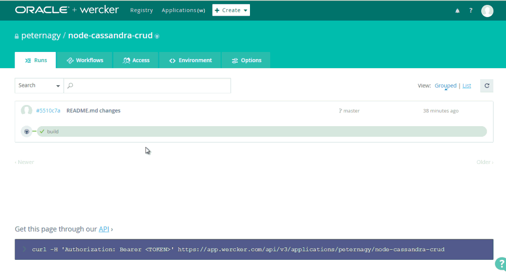

To add the values for variables used in `wercker.yml` you need to define them by selecting the "Environment" tab on your Wercker application, then adding the following:

+ **DOCKER\_USERNAME** = your Docker username
+ **DOCKER\_PASSWORD** = your Docker password
+ **DOCKER\_REPOSITORY** = <YOUR\_DOCKER\_USERNAME>/node-cassandra-crud

Notice you don't need to define `WERCKER_GIT_COMMIT` -which is use in `wercker.yml`- variable because it is a standard Wercker environment variable available in all runs. Select the "protected" tick box next to any value if you wish to keep them hidden from the web UI. Your environment variables tab should look something like this when finished:

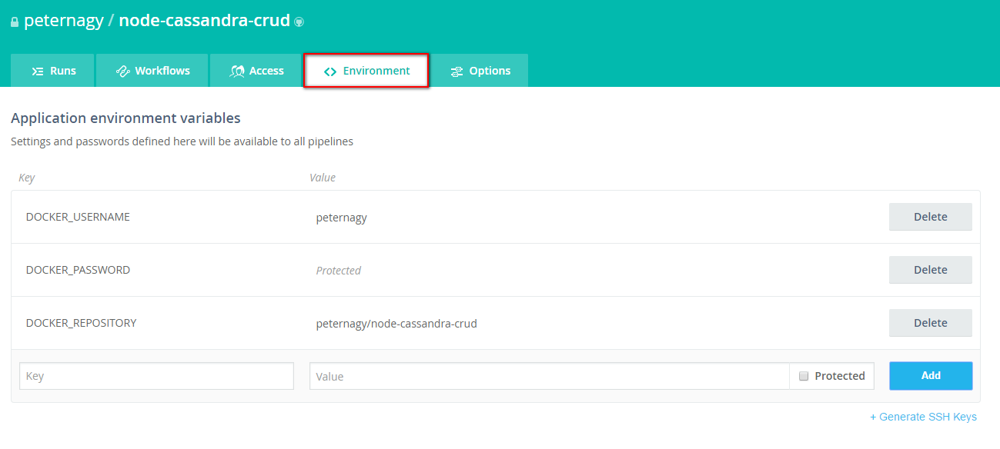

Now that you've defined the environment variables required and configured Wercker to run the pipelines defined in `wercker.yml`, you can instruct Wercker to carry out your run of your end-to-end pipeline!

This can be done by going back to the "Runs" tab, click the previous build and click **Actions **and select **Execute this pipeline again**. Enter a proper message to easily identify later the reason of the run and Push the **Execute pipeline** button, which will start a chain of Wercker pipeline runs, as defined on the Workflows tab.

1. A run will begin that will download your Node application package dependencies
2. If successful, a new run will begin which will create a Docker image from the new binary, then push it to your Docker registry

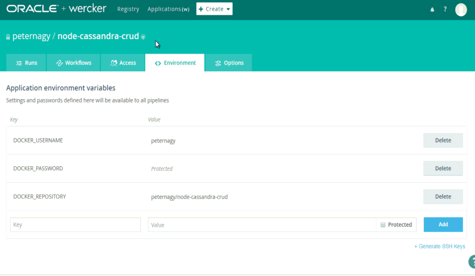

When the build and push-docker is done go back to the browser (tab) where you logged in to [https://cloud.docker.com](https://cloud.docker.com). Click on **Repositories**. Now you should see a new image called <YOUR\_DOCKER\_USERNAME>/node-cassandra-crud. This image based on the box defined in *wercker.yml* but Wercker baked the Node.js sample application into this image during the workflow. Which results a test/production/etc. ready container.

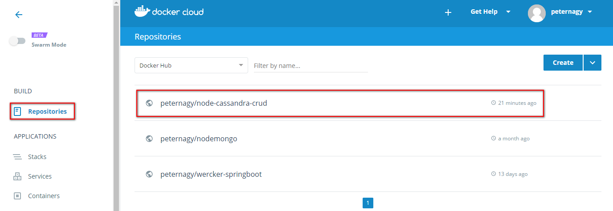

In the next step you will deploy your new container as part of a stack on Oracle Container Cloud Service using this Docker repository.

#### Create Oracle Container Cloud Service based on Node.js sample application container ####

Find your browser (tab) where you created Container Cloud Service at the beginning of this lab. If you hit the timeout or lost the browser (tab) then sign in again to [https://cloud.oracle.com/sign-in](https://cloud.oracle.com/sign-in). Select your datacenter then provide the identity domain and credentials. After a successful login you will see your Dashboard. Find the Container tile and click the hamburger icon. In the dropdown menu click **Open Service Console**.

Now you have to see your *testOCCS* (or different if you specified other name) Container Cloud Service instance ready. Click on the hamburger icon on the left and select **Container Console** from the dropdown menu.

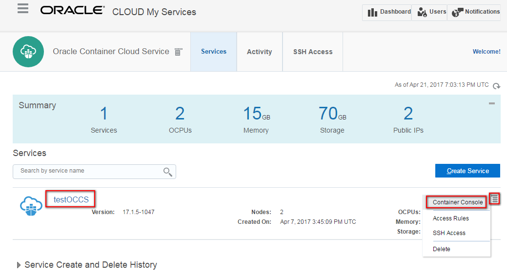

Due to the reason that the certification hasn't been setup you will get a security warning. Ignore that and allow to open the page. Enter the Administrator's credential for your Container Cloud Service. If you followed the guide the username has to be *admin*. Click **Login**.

First you need to define your new Service. The new service will comprise all of the necessary configuration for running your Docker container on a host, plus default deployment options. Click **Services** on the left navigation menu than click **New Service** button.

Enter the following parameters to define your new service:

+ **Service Name**: *node-cassandra*
+ **Service Description**: anything to describe your service.
+ **Image**: *YOUR\_DOCKER\_USERNAME/node-cassandra-crud* (the name of your Docker image stored in your registry) see previos step when checked your Docker registry.
+ **Ports**: first opt in the Ports on the right side. Then it will populate Ports attribute list. When *Ports* **+Add** button appears click to define port mapping. This port mapping enables internal docker container's port redirection for TCP protocol to different port on the host. Node.js sample application configured to listen on 3000 what you will map to host's 8099 port.

Click **Save** on service details page to save the service.

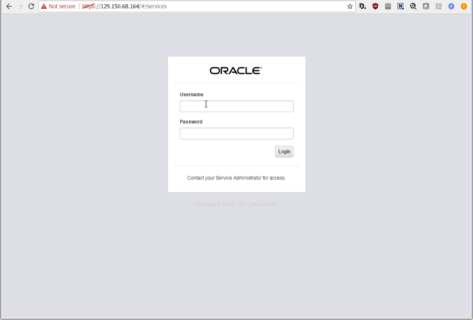

#### Create Oracle Container Cloud Service Stack to manage Node.js sample application and Cassandra services (containers) as a single application ####

Now Wercker built Node.js sample application container available as service. In OCCS Cassandra by default populated as service so you can create your stack. Click the **Stack** menu on the left side and than click **New Stack** button.

Enter the Stack name: *node-cassandra-stack*. Than drag and drop **Cassandra** service to the grid area. Configure Port mapping for Cassandra service to make available for Node.js application:

+ **Host Port**: 9042 (default Cassandra listen port)
+ **Container Port**: 9042 (default Cassandra listen port)
+ **Protocol**: TCP

Click **Save** to update Cassandra service in Stack. Find the *node-cassandra* service and drag and drop to the grid area. The service configuration page opens. Check in the **Links** option. Scroll down in the Builder area and click the **+Add** button next to the *Links*. Here you need to configure the (network) link between the containers. *Service* refers to the defined Container Cloud Service which is `cassandra` if you haven't changed the Cassandra configuration in the previous step. Finally *Alias* is the host name of the service. This is what needed to configure Cassandra driver to access Cassandra instance from Node.sj sample application service. Click **Save**.

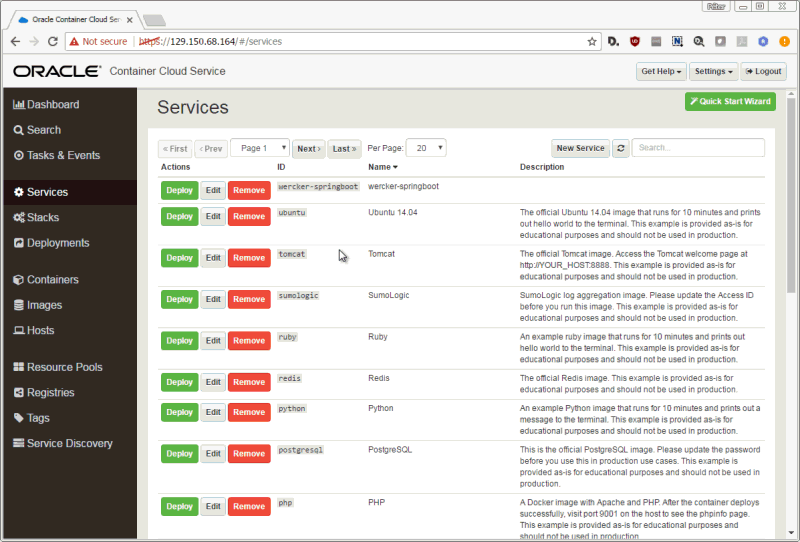

#### Deploy Oracle Container Cloud Stack and test the Node.js sample application ####

Stack is ready, so it is time to deploy and test the Node.js sample application. Find the newly created *node-cassandra-stack* stack and click the green **Deploy** button. 

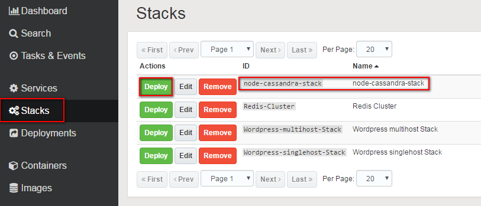

Leave the default configuration for orchestration and click **Deploy**.

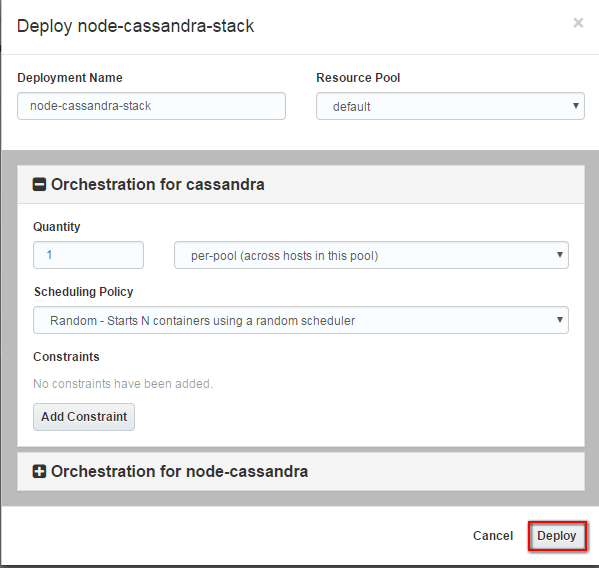

The stack deployment detail page opens. Wait until the stack is up and running. Everything should be green except the red Stop button. If you carefully watch the startup process you can see when the Oracle Container Cloud Service pulls the *peternagy/node-cassandra-crud* image from Docker hub.

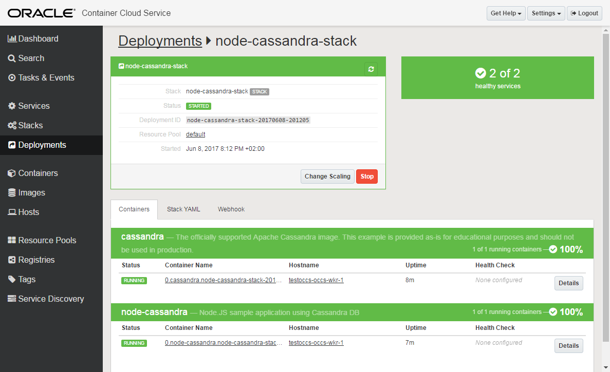

To test the application you need to get the host environment's public IP address. Click on the Hostname where the *node-cassandra* service is deployed. Find and note the *public_ip* address attribute.

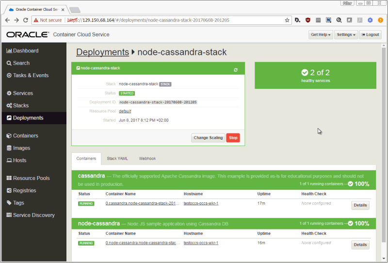

Open a new browser (tab) and enter or copy the host's public IP address and append the configured 8099 port. For example: `129.150.68.71:8099`. First the Cassandra needs to be initialized than you can create, update or delete Customer entity using the sample application.

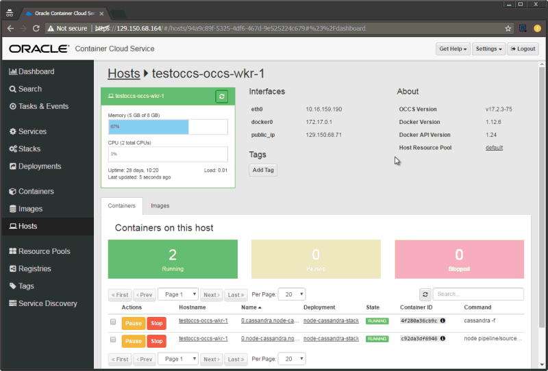
