# Rolling router sticky sessions with Wercker

## Deploy the rolling router sticky sessions service

### Clone the repository

<pre>
mkdir docker-images
git clone git@github.com:oracle/docker-images.git docker-images
cd docker-images/ContainerCloud
</pre>

### Login to Docker Hub
You will be building Docker images and pushing them to Docker Hub. In order to push to Docker Hub, you will need to authenticate with Docker Hub. Open a terminal and login to Docker Hub with this command:

<pre>
docker login
</pre>

You will then be prompted for your username and password. Enter your Docker Hub account name (which is NOT your email address). You can find this by logging in to Docker Hub in a Web browser and finding the name next to your avatar in the top navigation of the Docker Hub Web site.

<pre>
Login with your Docker ID to push and pull images from Docker Hub. If you don't have a Docker ID, head over to https://hub.docker.com to create one.
Username:
Password:
Login Succeeded
</pre>

### Configure the Builder to Use Your Docker Hub Account

Before you can build your first stack, open [images/build/vars.mk](images/build/vars.mk) and set the registry name variable as your Docker Hub account (usernames should be entered in lower case):

<pre>
REGISTRY_NAME ?= your_docker_hub_username
</pre>

### Build the image

Build the `rolling-router-sticky-sessions` image using make. You will need to also build the `runit` and `confd` dependencies if you have not built them before:

<pre>
  cd images/runit
  make
  cd images/confd
  make
  cd images/rolling-router-sticky-sessions
  make
  make publish
</pre>

The final `make publish` will upload the image to your Docker-hub.

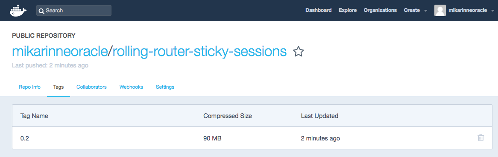

### Create the OCCS service

Login to OCCS and create a new service `rolling-router-sticky` with the following YML where the image repository refers to your Docker-hub account (bolded):

<pre>
version: 2
services:
  rolling-router-sticky:
    image: '<b>mikarinneoracle</b>/rolling-router-sticky-sessions:0.2'
    environment:
      - 'OCCS_API_TOKEN={{api_token}}'
      - KV_IP=172.17.0.1
      - KV_PORT=9109
      - APP_NAME=docker-hello-world
      - 'occs:availability=per-pool'
      - 'occs:scheduler=random'
    ports:
      - '80:80/tcp'
      - '8080:8080/tcp'
</pre>

If you haven't built the image of your own, you can use the YML above as is.

Deploy the service.

## Deploy the rolling router sticky sessions keyvalues with the GUI

Check the worker host `public_ip` from the OCCS admin:

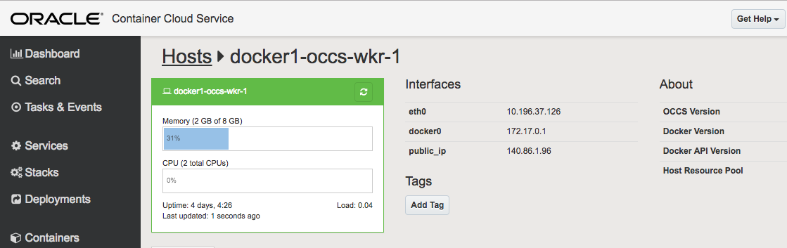

Check also the `API token` a.k.a Bearer from Settings/My Profile:

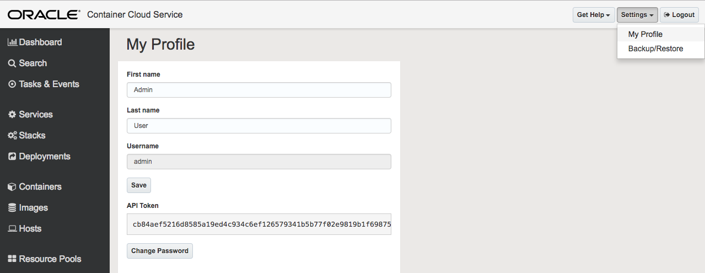

From your browser open the URL pointing to the worker host public_ip address e.g. `http://140.86.1.96:8080`.

The rolling router sticky sessions GUI should show up with a setup screen.

Enter the OCCS admin host ip, API Token (Bearer), Application name `docker-hello-world` and the preferred `host port` of the Docker application e.g. 3000:

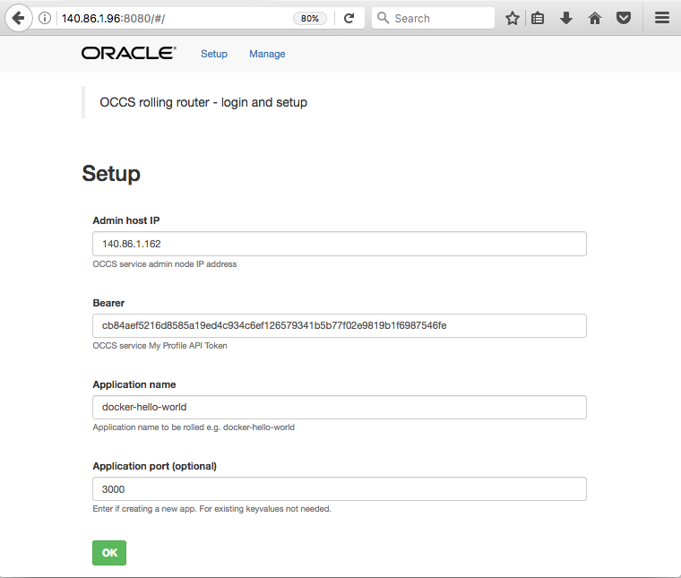

Press OK. The following screen should show up if the login with the given OCCS admin IP and API token was succesful:

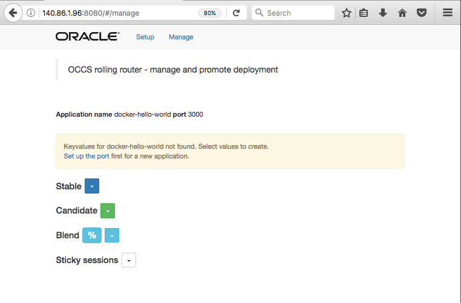

If the login was unsuccesful the following error should show up:

Create the initial keyvalues for the hello world application deployment by selecting the following values from the dropdowns:

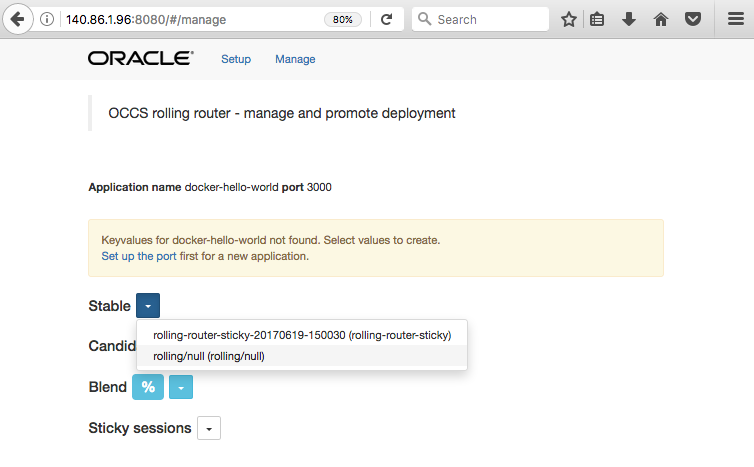

Set the values like this:

This will store the values in OCCS keyvalues for the hello world application in host port 3000:

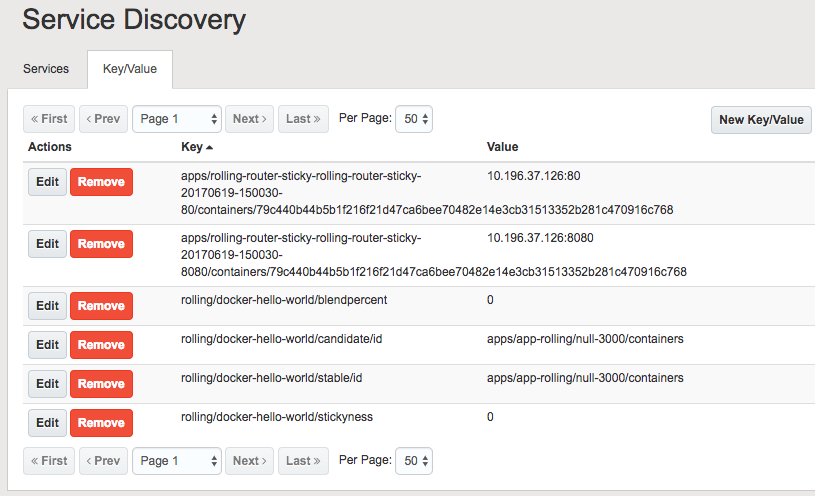

### GUI login and keyvalues for an existing application

If you have already created the keyvalues either manually or using the rolling router sticky sessions GUI, you don't have to specify the port in the login. Then, after clicking the login/setup OK button the GUI will find the keyvalues automatically (given the login was succesful). The port discovered will be shown along with application name on the page.

Also, if the keyvalues are changed in the OCCS using the admin or the REST API the GUI will detect the changes automatically after a short delay of max. 10 seconds.

## Setting up Wercker CI/CD

### Building the Hello world application base box image for Wercker

Since the rolling router sticky sessions Wercker CI/CD script for OCCS uses utilities like `jq`, `recode` and `curl` we have selected `Ubuntu`as the base image for our Hello world `Node.js` application.

#### Build Ubuntu with Node.js and required utilities

First build Ubuntu image with the utilities included from `scratch` and then using the built Ubuntu image build the actual Hello world application image for the rolling router sticky sessions deployment.

Here's the <a href="https://github.com/mikarinneoracle/docker-brew-ubuntu-core/blob/dist/trusty/Dockerfile#L50">Dockerfile</a> for the forked Ubuntu project with the following additions to enable the utilities along with Node.js in the Ubuntu image:

<pre>
RUN sudo apt-get -y install libc-dev-bin libc6 libc6-dev
RUN sudo apt-get install -y recode
RUN sudo apt-get install -y jq
RUN sudo apt-get install -y curl
RUN sudo curl -sL https://deb.nodesource.com/setup_7.x | sudo -E bash -
RUN sudo apt-get install -y nodejs
RUN sudo apt-get install -y build-essential
</pre>

You can clone the project and build the image and push it Docker hub (change the repository bolded to match your Docker hub account) using the branch `dist` and the version `trusty`:

<pre>
mkdir ubuntu
git clone git@github.com:mikarinneoracle/docker-brew-ubuntu-core.git ubuntu
cd ubuntu
git checkout dist
cd trusty
export tag=$(docker build -t ubuntu . | grep 'Successfully built' | tail -c 13)
docker tag $tag <b>mikarinneoracle</b>/ubuntu:trusty
docker push mikarinneoracle/ubuntu
</pre>

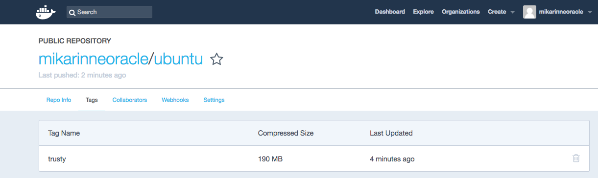

#### Build the Hello world application image

Using the custom built Ubuntu image build the Node.js Hello world application.
The <a href="https://github.com/mikarinneoracle/hello-world">source code</a> includes a Dockerfile with the following:

<pre>
FROM mikarinneoracle/ubuntu:trusty

# Create app directory; same as Wercker default
RUN mkdir -p /pipeline/source
WORKDIR /pipeline/source

# Install app dependencies
COPY package.json /pipeline/source/
RUN npm install

# Bundle app source
COPY . /pipeline/source/

EXPOSE 3000
CMD [ "npm", "start" ]
</pre>

Start by forking the Hello world project to your git-hub account:

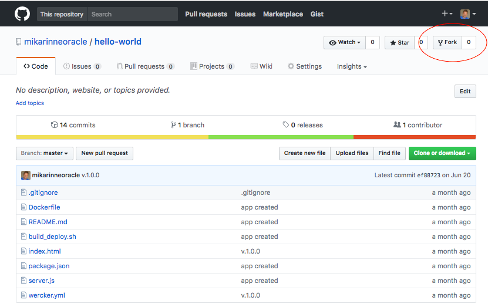

Then clone the project build and push the image to Docker hub (change the repository bolded to match your Git-hub and Docker hub accounts):

<pre>
mkdir hello-world
git clone git@github.com:<b>mikarinneoracle</b>/hello-world.git hello-world
cd hello-world
export tag=$(docker build -t hello-world . | grep 'Successfully built' | tail -c 13)
docker tag $tag <b>mikarinneoracle</b>/hello-world:latest
docker push mikarinneoracle/hello-world
</pre>

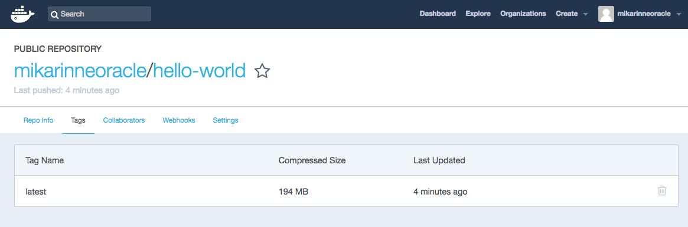

### Creating the Wercker workflow

Login to your Wercker account and create a Wercker `application` Hello world for the Node.js application that we just built using the Hello world git-hub repo:

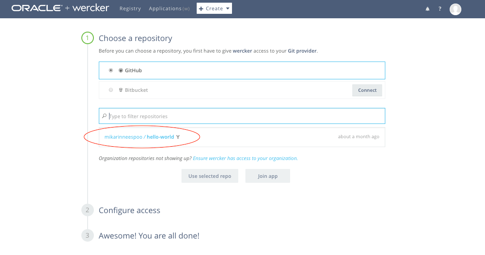

Complete by going thru the 3 steps. You can leave the settings to the defaults.

Then create a Wercker `workflow` with two steps `build` (the default) and `deploy`.

Add a new `step` deploy:

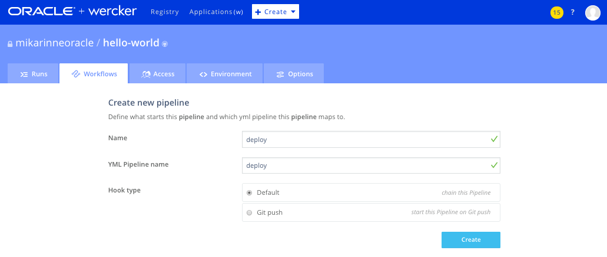

Add it to the workflow after the build step:

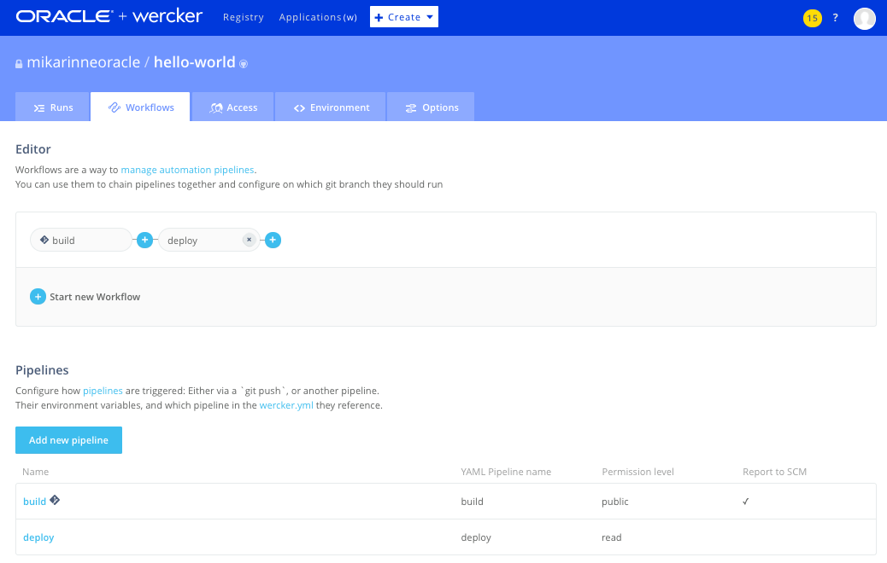

The YML pipeline names are identical to pipeline names.

### Creating Wercker application environment values for the Workflow

Create the following application environment values for the Wercker workflow:

<pre>
  SERVICE_MANAGER:    OCCS admin url e.g. https://140.86.1.162
  API_TOKEN:          OCCS API token (bearer)
  APP_NAME:           docker-hello-world
  APP_FRIENDLY_NAME:  Hello-world  
  DOCKER_EMAIL:       Docker hub account email
  DOCKER_USERNAME:    Docker hub account username
  DOCKER_PASSWORD:    Docker hub account password
  DOCKER_REGISTRY:    Docker hub registry; typically the same as the username e.g. mikarinneoracle
  EXPOSED_PORT:       Hello world application host port e.g. 3000
  IMAGE_NAME:         Wercker.yml box name e.g. hello-world
  APP_TAG:            Wercker.yml box tag e.g. latest
  SCALE_AMOUNT:       OCCS scale amount e.g. 1
  DOCKER_CMD:         OCCS image command e.g. npm start (for Node.js)
</pre>

### Launch the first build with the workflow

After setting the application environment variables you can start the first build by clicking the ` trigger a build now` link as below:

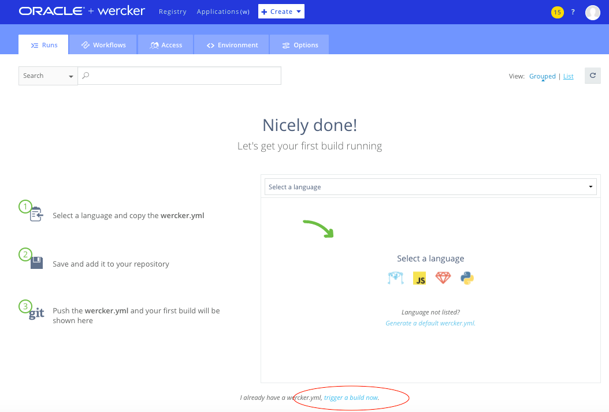

Workflow starts and runs the workflow:

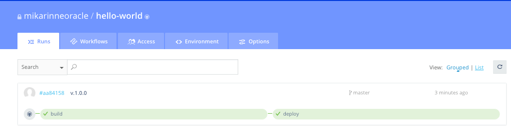

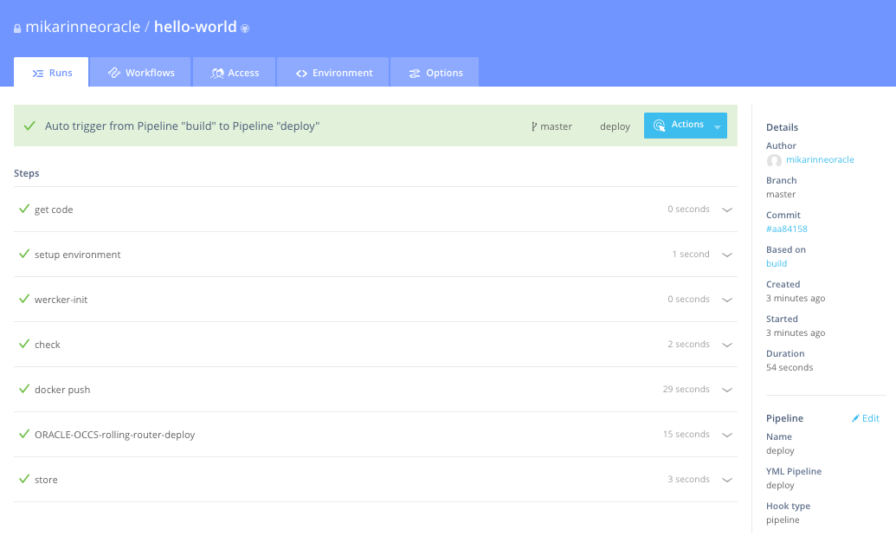

Hello world application candidate image with a `timestamp` tag (i.e. the Wercker environment variable `$WERCKER_MAIN_PIPELINE_STARTED` in the deploy script) was created and pushed to Docker hub:

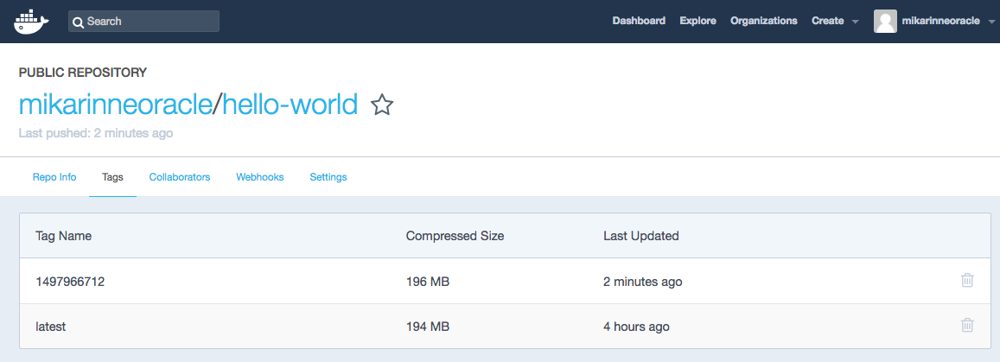

The new image was also deployed to OCCS and the candidate image of the Hello world application should be running:

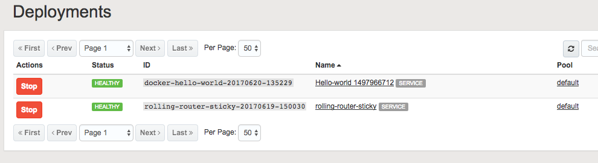

The Rolling router sticky sessions GUI was updated to reflect the keyvalue change in OCCS for the application candidate:

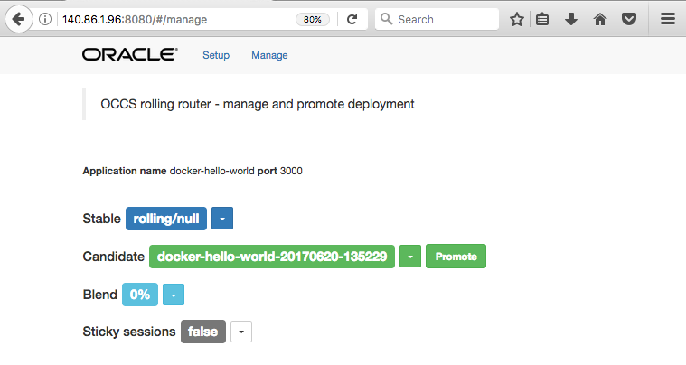

### Promoting the candidate image and calling the stable application from browser

Promote the candidate to `stable`by clicking promote button in the Rolling router sticky sessions GUI. The result should be that the stable version is now the image that was just built by Wercker and the candidate is rolling/null:

Now you can open a new tab to your browser and call the stable version of application by opening the URL pointing to the worker host public_ip address e.g. `http://140.86.1.96`.

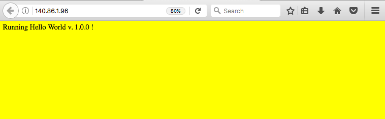

(The backgroud color and text can be slightly different)

You can reload the page few times to see it is responding.

### Building a new candidate

Make a chance to the Hello world `index.html` with a an editor like changing the background color to green and version to 1.0.1. Commit the change and push the change to the repository:

<pre>
git add index.html
git commit -m 'v.1.0.1'
git push origin master
</pre>

Wercker should pick up this change automatically and the workflow starts for a new candidate version of Hello world.

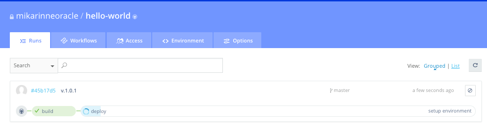

A new candidate image with a new tag should be uploaded to Docker hub:

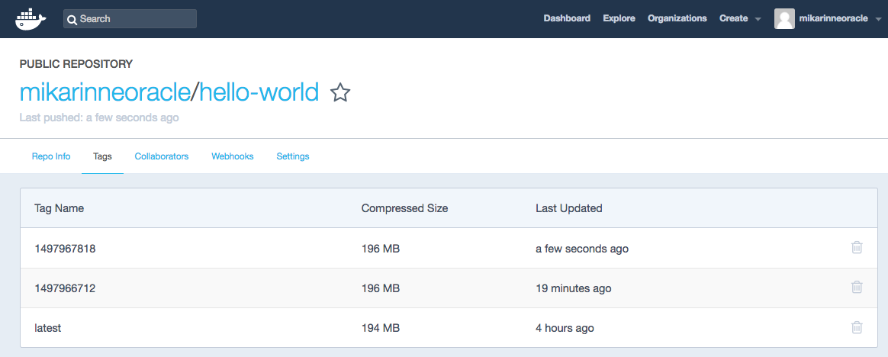

It should be also deployed and started in OCCS now both the stable and candidate running:

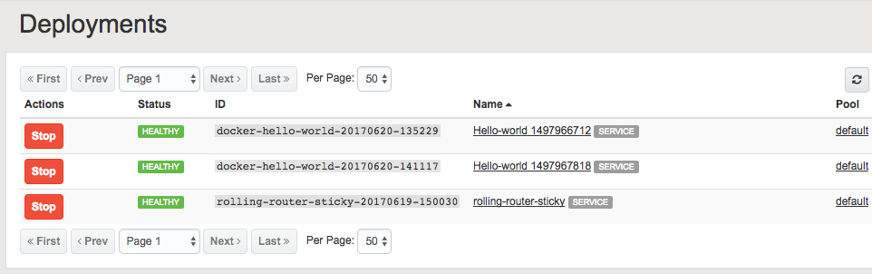

The rolling router sticky sessions GUI should now be updated with the candidate to reflect the change in the OCCS keyvalue for the application candidate:

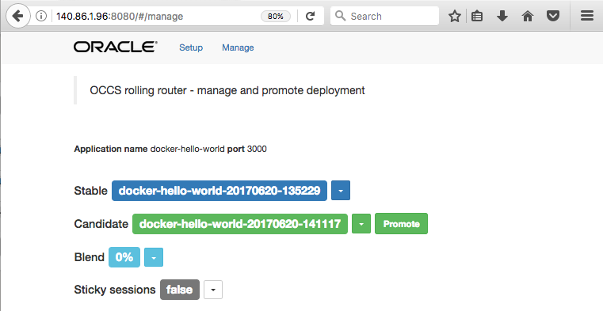

### Sending load to the candidate version

Since both versions are now running we can test the candidate version by sending load to it.
To do this adjust the blend % to 50:  

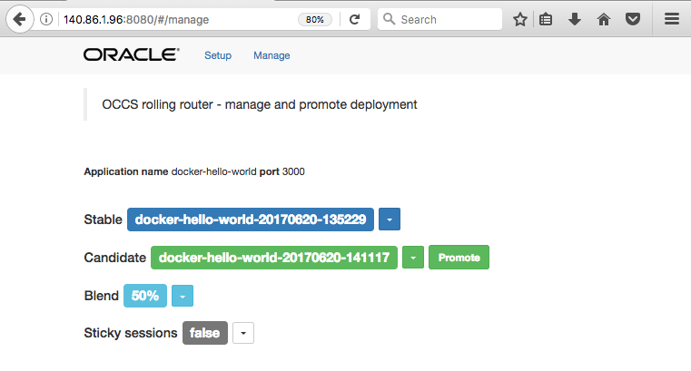

Now every other request to the worker host public_ip address e.g. http://140.86.1.96 should go to the candidate version:

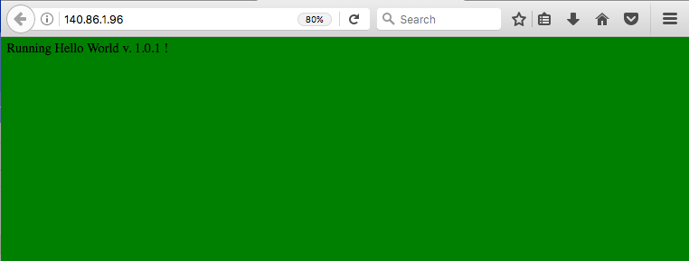

Keep on reloading the page to see the behaviour. You can also try setting the blend percent to 100 for example, then all requests should go to the candidate.

#### Rebuilding a new candidate version

Since the CI/CD pipeline is now working it is easy to build new versions of the candidate. Just make another change to the index.html like setting the background color to orange and then commit and push your change.

Again, the new Hello world application image gets built and uploaded to Docker hub with a tag. The existing candidate should be replaced by the new candidate in the OCCS:

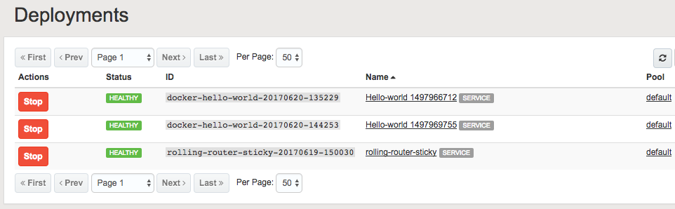

And the new candidate should also be updated in the rolling router sticky sessions GUI with the blend % zero:

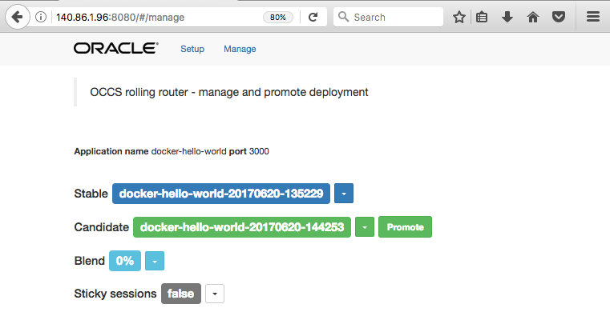

You can now increase the blend % and realod your application page a few times depending on blend %. A new version should show up eventually:

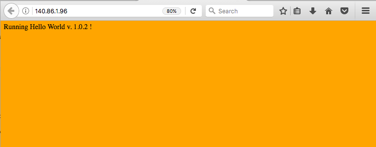

#### Promoting a new candidate as stable

At any point you can promote the candidate as stable. Then the blend goes to zero and the rolling router sticky sessions send only requests to the stable version. Then, you can deploy a new candidate making a change and pushing it to the repository and the process for the candidate starts again as seen earlier.

You also play with the stable and candidate values by selecting them from the dropdows of the GUI to see the effect when reloading the application page. There a short delay while the rolling router sticky sessions configuration is loaded after changing the values. If reloading the application page too fast you might experience a gateway error. In that case just reload the page.

### Session stickyness between stable and candidate

So far you have not played with the session stickiness (a.k.a affinity) yet.

This is easy to do just setting the stickyness to true:

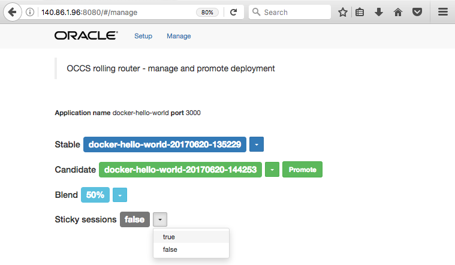

Now every subsequent request from the <i>same</i> client i.e. browser should go to the same application version, either stable or candidate, depending on which one it reached initially (based on the blend %). This means it should keep the session affinity and the user should experince the same version of the application all the time.

When the session stickyness is set to false, the client will be served from the application version, either stable or candidate, purely based on the blend % and no session affinity will be in place.

As this may be a bit harder to test without a load testing application you can still try opening multiple browsers to make requests to the application when session stickiness is set to true to experience this behaviour.

In real life application testing the session stickyness is important for the users to see a consistent user experience in case of web applications. In microservices testing, however, the session affinity has less value and can be set to false.

## Wercker.yaml and the Wercker registry step

The <a href="https://github.com/mikarinneoracle/hello-world/blob/master/wercker.yml">Wercker.yml</a> is included in the Hello world application. It consists of the box definition and then two pipelines named as `build` and `deploy`.

The box definition is based on our Node.js application image that was built on top of Ubuntu:

<pre>
box:
    id: $DOCKER_REGISTRY/$IMAGE_NAME
    tag: $APP_TAG
    registry: https://registry.hub.docker.com
</pre>

The build pipeline is very simple consisting only of one step:

<pre>
build:
  steps:
    - npm-install
</pre>

The deploy pipeline that is executed after a succesful build pipeline is a bit more complex having three steps:

<pre>
deploy:
  steps:
    - script:
        name: check
        code: |
            npm --version
            node --version
            jq --version
            curl --version
            recode --version
    - internal/docker-push:
        username: $DOCKER_USERNAME
        password: $DOCKER_PASSWORD
        tag: $WERCKER_MAIN_PIPELINE_STARTED
        repository: $DOCKER_REGISTRY/$IMAGE_NAME
        registry: https://registry.hub.docker.com
        - script:
            name: deploy
            code: |
            ...
</pre>

The first step `check` is just to verify we have built our box from a correct image having the required utlities available for the actual deploy to Oracle Container Cloud service.

The second step `internal/docker-push` pushes the built image to Docker-hub repository. Here, we are using `$WERCKER_MAIN_PIPELINE_STARTED` timestamp as the tag for the image being pushed.

The final step of deploy pipeline, and the whole workflow, is the actual deploy to Oracle Container Cloud service. The complete script is <a href="https://github.com/mikarinneoracle/hello-world/blob/master/wercker.yml#L25">here</a>.
