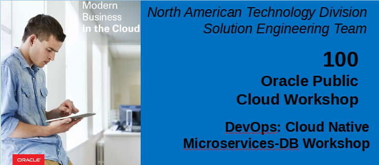
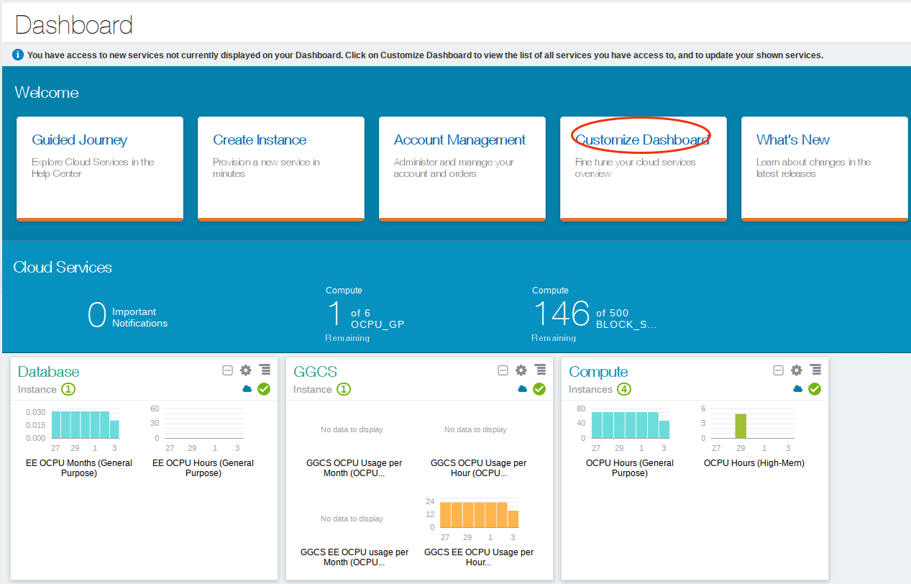
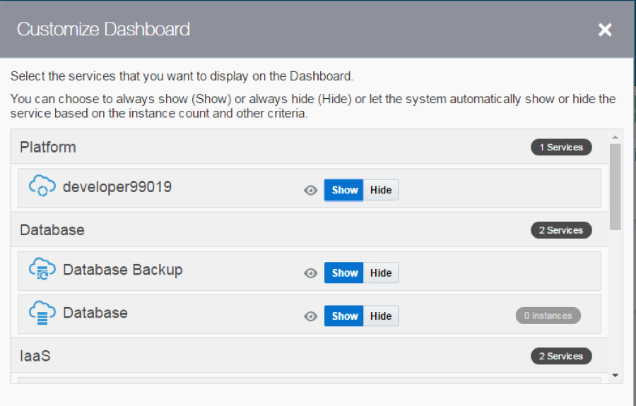
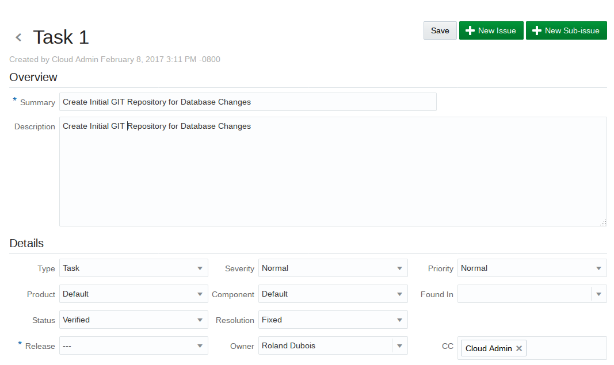
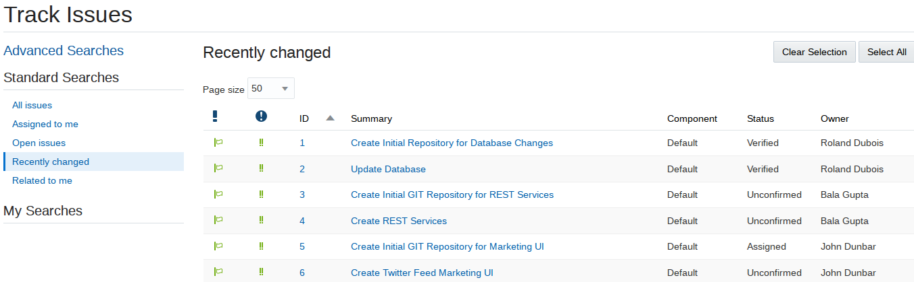
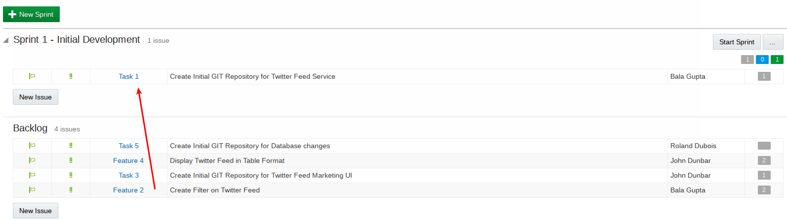
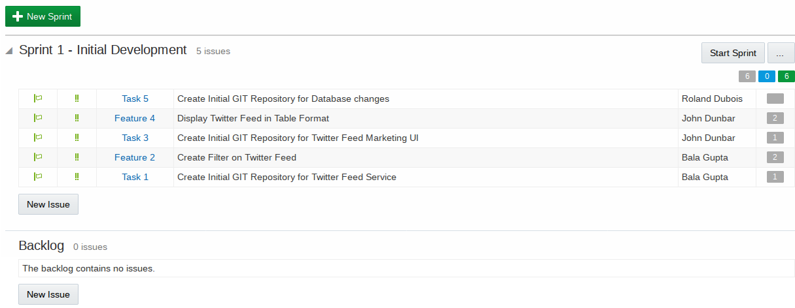
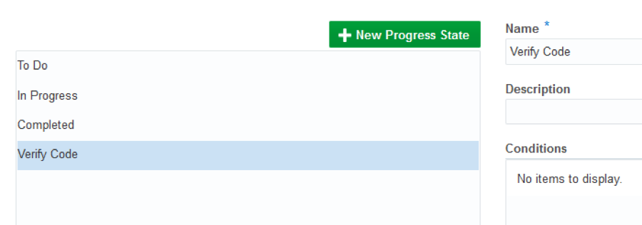
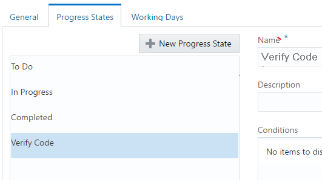
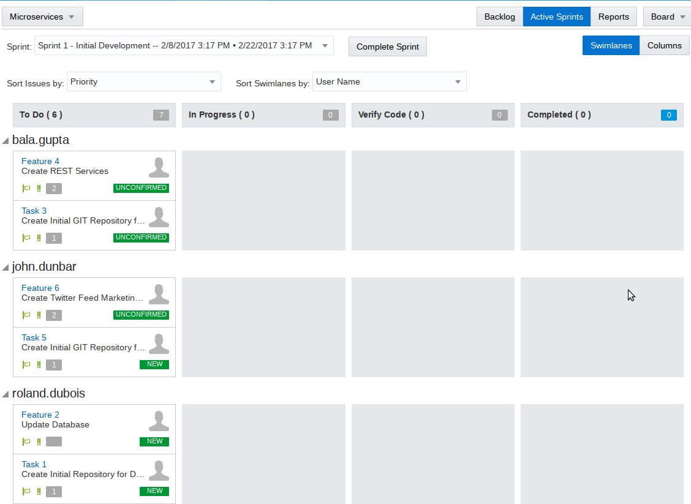

  
Update: March 1, 2017

# Introduction

This is the first of several labs that are part of the **Oracle Public Cloud DevOps Cloud Native Microservices workshop.** This workshop will walk you through the Software Development Lifecycle (SDLC) for a Cloud Native project that will create and use several Microservices.

You will take on 3 Personas during the workshop. The **Project Manager Persona** will create the projects, add tasks and features to be worked on, and assign tasks to developers.  The Project Manager will then start the initial sprint. The **Database Developer persona (Roland Dubois)** will provision a new test/development MySQL database and modify it to support the twitter feed.  The **Java Developer persona (Bala Gupta)** will develop a new twitter feed service that will create REST services to access data in the twitter feed and a MySql database.  The **JavaScript Developer persona (John Dunbar)** will develop a new Twitter Marketing UI that will display the Alphaoffice products with links to tweets related to those products for analysis.  During the workshop, you will get exposure to Oracle Developer Cloud Service and Oracle Application Container Cloud Service.  You will also see how Developer Cloud Service works with open source solutions such as Maven and Flyway (and other open source solutions) to provide a complete development environment.

Note that while we have four personas in this lab we will only by logging in with the userid given to you by the instructor for all four labs, but will assume the role of different users in the different labs.  Normally developers would log in with their own userids.

**Please direct comments to: Derrick Cameron (derrick.cameron@oracle.com).**

## Objectives
- Create Initial Project
    - Add Users to Project
- Create Product Issues
    - Create Issues for MySQL Database Microservice
    - Create Issues for REST Service Microservices
    - Create Issues for Twitter Feed Marketing UI
- Create Agile Board and initial Sprint
- Add Issues to Sprint

## Required Artifacts
- The following lab requires an Oracle Public Cloud account that will be supplied by your instructor.

# Create Alphaoffice Marketing Project

## Create Developer Cloud Service Project

### **STEP 1**: Login to your Oracle Cloud Account
- From any browser, go to the URL:
    `https://cloud.oracle.com`

- click **Sign In** in the upper right hand corner of the browser

    

- **IMPORTANT** - Under my services, ***ask your instructor*** which **Region** to select from the drop down list, and click on the **My Services** button.

    

- Enter your identity domain and click **Go**.

    **NOTE:** The **Identity Domain, User Name** and **Password** values will be given to you by the instructor.

    

- Once your Identity Domain is set, enter your User Name and Password and click **Sign In**

  **NOTE:** For this lab you will assume the role of Project Manager ***Lisa Jones***. 

    

- You will be presented with a Dashboard displaying the various cloud services available to this account.

    

- If all your services are not visible, **click** on the **Customize Dashboard**, you can add services to the dashboard by clicking **Show.** If you do not want to see a specific service click **Hide**

    

### **STEP 2**: Login to Developer Cloud Service

Oracle Developer Cloud Service provides a complete development platform that streamlines team development processes and automates software delivery. The integrated platform includes an issue tracking system, agile development dashboards, code versioning and review platform, continuous integration and delivery automation, as well as team collaboration features such as wikis and live activity stream. With a rich web based dashboard and integration with popular development tools, Oracle Developer Cloud Service helps deliver better applications faster.

- From the Cloud UI dashboard click on the **Developer** service. In our example, the Developer Cloud Service is named **developer99019**.  Note:  Due to the use of different environments during the development of these labs the screen shots will show different developer instances, but in fact in practice you will only have a single instance.

    

- The Service Details page gives you a quick glance of the service status overview.

    

- Click **Open Service Console** for the Oracle Developer Cloud Service. The Service Console will list all projects for which you are currently a member.

    

### **STEP 3**: Create Developer Cloud Service Project

- Click **New Project** to start the project create wizard.
- On Details screen enter the following data and click on **Next**.

    **Name:** `Twitter Feed Marketing Project`

    **Description:** `Project to gather and analyze twitter data`

    **Note:** A Private project will only be seen by you. A Shared project will be seen by all Developer Cloud users. In either case, users need to be added to a project in order to interact with the project.

    

- Leave default template set to **Empty Project** and click **Next**

    

- Select your **Wiki Markup** preference to **MARKDOWN** and click **Finish**.

    

- The Project Creation will take about 1 minute.

    

- You now have a new project, in which you can manage your software development.

    

## Add Team Members (Owners) to the Project

### **STEP 4**: Add Team Owners to the Project

**Note:** As previously mentioned, ***if you are not allowed to have multiple users in your Corporate or Trial accounts, you will skip step 4.*** When in subsequent steps/labs you are asked to log in as different users responsible for different roles, you will physically perform the tasks as the same user, but you should mentally assume the role of a different persona.

- Click on the **Team** icon  found on the far right side of the window.

- To add new Team Members, click **New Member**

    

- Set the Role to **Owner**, and enter the Username **roland.dubois**, and then click **Add**

- Repeat the process for Username **bala.gupta** and **John.dunbar**. When completed your team should consist of 4 members.

    

# Create Project Issues

## Create Issues for MySQL Database Microservice

### **STEP 5**: Create Issue for the initial MySql Database GIT Repository Creation

In this step you are still connected in the logical role of the Project Manager, ***Lisa Jones***.

- Click **Issues** on left hand navigation panel to display the Track Issues page.

    

- Click **New Issue**. Enter the following data in the New Issue page and click **Create Issue**.

    **Note:** no matter who you assign as the task “physical” owner, for the sake of this workshop, **Roland Dubois** will be the “logical” owner of this issue. The same concept holds true for other assignments made in this lab.

    **Summary:**
    `Create Initial GIT Repository for MySQL Datbase Changes`

    **Description:**
    `Create Initial GIT Repository for MySQL Database Changes`

    **Type:** `Task`
    **Owner:** `Roland Dubois (or you, if another user is not available)`
    **Story Points:** `1`

    Note: Story point is an arbitrary measure used by Scrum teams. This is used to measure the effort required to implement a story. To learn more: https://agilefaq.wordpress.com/2007/11/13/what-is-a-story-point/

    

### **STEP 6**: Create Issue for MySQL Database updates

- Click **New Issue**. Enter the following data in the New Issue page and click **Create Issue**.

    **Summary:** `Update Database`

    **Description:** `Update MySQL Database to add twitter tag and populate this new column.`

    **Type:** `Feature`

    **Owner:** `Roland Dubois (or you if another user is not available)`

    **Story Points:** `2`

## Create Issues for REST Services

### **STEP 7**: Create Issue for REST Services GIT Repository Creation

- Click **New Issue**. Enter the following data in the New Issue page and click **Create Issue**.

    **Summary:** `Create Initial GIT Repository for REST Services`

    **Description:** `Create Initial GIT Repository for REST Services`

    **Type:** `Task`

    **Owner:** `Bala Gupta (or you if another user is not available)`

    **Story Points:** `1`

### **STEP 8**: Create Issue for Creating REST Services
- Click **New Issue**. Enter the following data in the New Issue page and click **Create Issue**.

    **Summary:** `Create REST Services`

    **Description:** `Create REST Services for Twitter Feed and MySQL Database`

    **Type:** `Feature`

    **Owner:** `Bala Gupta`

    **Story Points:** `2`

## Create Issues for Twitter Marketing UI

### **STEP 9**: Create Issue for initial Twitter Marketing UI GIT Repository
- Click **New Issue**. Enter the following data in the New Issue page and click **Create Issue**.

    **Summary:** `Create Initial GIT Repository for Marketing UI`

    **Description:** `Create Initial GIT Repository for Marketing UI`

    **Type:** `Task`

    **Owner:** `John Dunbar`

    **Story Points:** `1`

### **STEP 10**: Create Issue for Twitter Marketing UI Development
- Click **New Issue**. Enter the following data in the New Issue page and click **Create Issue**.

    **Summary:** `Create Twitter Marketing UI`

    **Description:** `Create Twitter Marketing UI`

    **Type:** `Feature`

    **Owner:** `John Dunbar`

    **Story Points:** `2`

- Click on the **Issues** menu option (left menu) to view all newly created issues.  It should look like this.

    

# Create Agile Board

## Create Agile Board and Initial Sprint

### Developer Cloud Service Agile Page Overview

Before you start using the Agile methodology in Oracle Developer Cloud Service, it is important that you know the following key components of the Agile page.

- **Board** – A Board is used to display and update issues of the project. When you create a Board, you associate it with an Issue Query. The Board shows Issues returned by the Query.
You can either use a Board created by a team member, or create your own Board. You can create as many Boards as you like.
- **Sprint** – A Sprint is a short duration (usually, a week or two) during which your team members try to implement a product component.
You add the product component related issues to a Sprint. When you start working on a product component, you start (or activate) the related Sprints. To update issues using a Sprint, you must first activate the Sprint and add the Sprint to the Active Sprints view.
- **Backlog view** – Lists all Issues returned by the Board’s Query. The view also displays all active and inactive Sprints of the Board, and the sprints from other Boards that contain Issues matching the Board’s Query.
Each Sprint lists issues that are added to it. The Backlog section (the last section of the Backlog page) lists all open issues that are not part of any Sprint yet. The Backlog view does not show the resolved and closed Issues.
- **Active Sprints view** – Lists all active Sprints of the Board and enables you to update an Issue status simply by dragging and dropping it to the respective status columns.
- **Reports view** – select the Burndown Chart tab to display the amount of work left to do in a Sprint or use the Sprint Report tab to list open and completed Issues of a Sprint.

### **STEP 11**: Create Agile Board

- Click **Agile** on the Left Side Menu to display a page listing all existing Boards

    

- Click **New Board** and enter the following data. When done click **Create**.

  **Name:** `Microservices`

  **Estimation:** `Story Points`

    

### **STEP 12**: Create Sprint
- We will now create our first Sprint. Click **New Sprint**. Enter the following data and click **OK.**

    **Name:** `Sprint 1 - Initial Development`

    **Story Points:** `6`

    

### **STEP 13**:	Add Backlog Issues to Sprint

- Next we want to add the backlog issues to the newly created spring. **Drag and drop** the **6 issues** one at a time upward onto the **Sprint 1** section. This will add the issues to the sprint.

    

    

## Customize Agile Board

### **STEP 14**: Customize Board

In the following step you will customize an Agile Board, and add a new Progress State. If you desire more information about States and Conditions, the following link will provide a tutorial: http://www.oracle.com/webfolder/technetwork/tutorials/obe/cloud/developer/AgileDevelopment/AgileDevelopment.html

- Now we will show you how you can customize your board. In the right hand side click **Board -> Configure**

    

  **Note**: Before we create a new progress state, we want to un-assign some of the conditions that will be used in the new state. You can’t add new conditions or removed conditions, however, you can redefine progress states to suit your project’s needs and move conditions from one state to another. A large number of conditions are assigned to the Completed state by default.

- Click on **:Progress States**: then click **:Completed**: state. In the lower left panel of the window, scroll down the conditions and select all the **:RESOLVED conditions**:.  Click  to move them over to Unassigned Conditions panel

    

- Click **:New Progress State**:.  Change name to **:Verify Code**:. We will use this new State for performing QA and Testing.

    

- Highlight all the **:RESOLVED**: unassigned conditions, and click  to move them over to the Conditions column.

    

- With **:Verify Code**: highlighted, click  to move **:Verify Code**: above the Completed Process State.

    

- Click **Save** to persist change.

    

### **STEP 15**: Start Sprint

- Click **Start Sprint.** Leave the defaults and click **Start**

    

- Now click on **Active Sprints** to view the Sprint Dashboard

    

- Click on the **Reports** button to view the Burndown and Sprint reports.

    

- You are now ready to move to the next lab.
