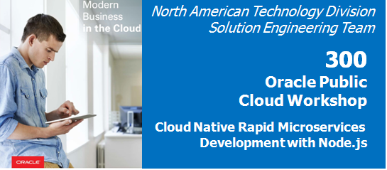

Update: April 30, 2017

# Introduction

This is the third of several labs that are part of the **Oracle Public Cloud DevOps Cloud Native Microservices Workshop**. This workshop walks you through the Software Development Lifecycle (SDLC) for a Cloud Native project that will create and use several microservices.

In the first lab (100) Lisa Jones, the project manager, created a new project in the Developer Cloud Service. She then added team members to the project, and created and assigned tasks to the developers of this application. The second lab (200) focused on deploying a MySQL database instance in the Oracle Cloud. In this third lab, you will assume the persona of microservices developer Bala Gupta, who will build two Node.js REST services. One of these REST services will extract Alphaoffice product data from the MySQL database that you built in Lab 200. The second REST service will extract data from a Twitter feed.

**Please direct comments to: John Hennen ([john.hennen@oracle.com](mailto:john.hennen@oracle.com)).**

## Objectives

- Access the Oracle Developer Cloud Service
- Import code from an external Git repository
- Import the project into the Brackets code editor, perform edits and push the edits to the repository in the Oracle Cloud
- Build and deploy the project using the Oracle Developer Cloud Service and the Oracle Application Container Cloud Service
- Follow the Git methodology for source code control
- Follow the Agile methodology for project management

## Required Artifacts

- The following lab requires an Oracle Public Cloud account that will be supplied by your instructor. Included in this account is an Oracle Compute Cloud Service that will simulate a client workstation with all necessary client software pre-installed for local code editing.  You will need to install VNC Viewer on your personal workstation to access this Compute Cloud Service client. 

# Create Initial REST Microservices

### **STEP 1**: Review and Update the Agile Board

- This Lab assumes that you completed Labs 100 and 200. It also assumes you and are still connected to the Oracle Cloud, that you're still in the Developer Cloud Service Dashboard, and that you're viewing the "Alphaoffice Marketing Project". If for some reason that is not the case, follow the first several steps of Lab 100 to once again view the Developer Cloud Service Console.

    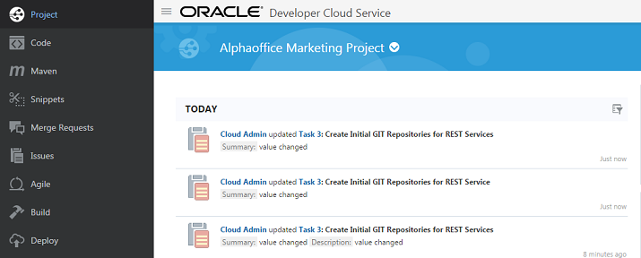   

- Although you will remain connected to the Oracle Cloud using the user account you were provided, you are to take on the persona of ***Bala Gupta*** (microservices developer) as you perform the following steps.

     

- Click on **Agile** on the navigation panel.

    

- Click on the **Microservices** Board **Active Sprints** and focus on the sprints for Bala Gupta.

    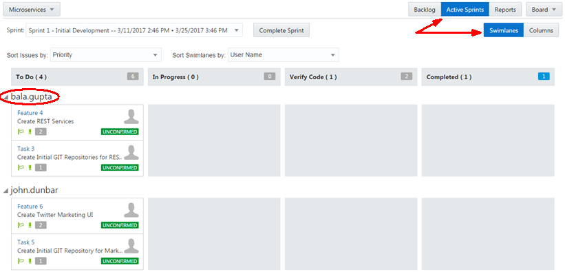

- Designate that Task 3 has moved to **In Progress** by dragging the Task 3 panel into the **In Progress** column.

    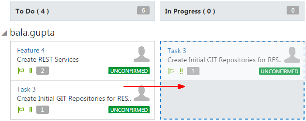

- Leave the default values and click **Next**.

    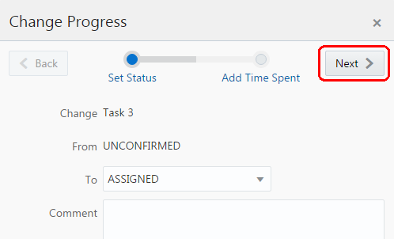

- Set the **Time Spent** value to 1 day and click **OK**.

    

- The **Active Sprints** screen shows the change.

    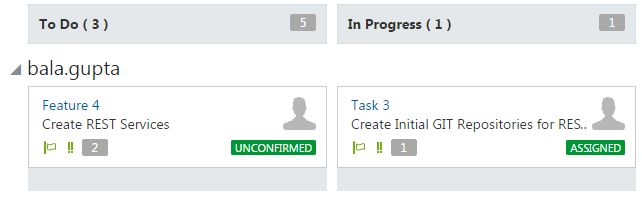

## Create the MySQL Microservice Repository, and the Default MySQL Microservice Build and Deploy Processes

### **MySQL REST STEP 2**: Create the New Git Repository for the MySQL Microservice Code

- Click on **Project** on the navigation panel.

    

- Click the **New Repository** button.

    

- In the **New Repository** popup, enter the following:
    - **Name** `AlphaofficeMySQLREST` 
    - **Description** (any)
    - Select **Import existing repository** 
    - Enter `https://github.com/johnhennen/AlphaofficeMySQLREST` for the existing repository location.  
    - Finally, click **Create**.

   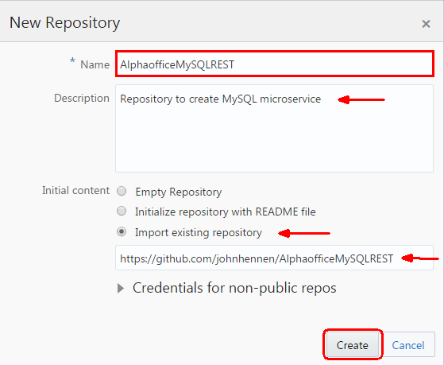

- Once all the code files are imported, you will have the file and folder structure below in the **AlphaofficeMySQLREST** repository.

    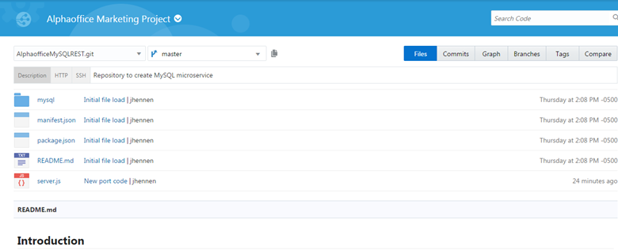

### **MySQL REST STEP 3**: Create Default Build Process

Now that you have the source code in your managed Git repository, you will need to create a build process that will be triggered whenever a commit is made to the master branch. In this step you will set up a shell script build process.

- Click **Build** on the navigation panel to access the build page, and then click the **New Job** button.

    

- In the New Job popup, enter `BuildMySQLREST` for Job Name. Select **Create a free-style job** and click **Save**.

    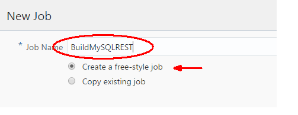

- You are now placed into the job configuration screen.

    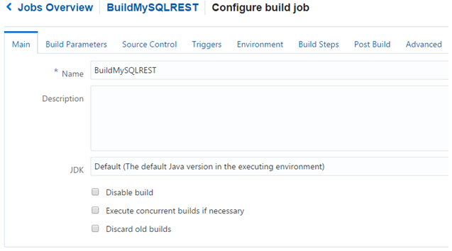

- Click the **Source Control** tab. Select **Git** and select **AlphaofficeMySQLREST.git** from the dropdown.

    

- Click the **Triggers** tab. Select **Based on SCM polling schedule**.

    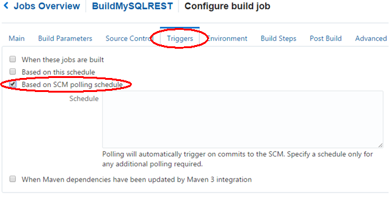

- Click the **Build Steps** tab. Click the **Add Build Step** dropdown and select **Execute shell**.

    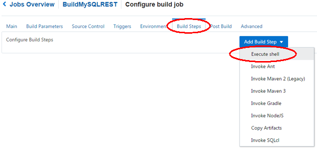

- For the shell script command enter `npm install`.

    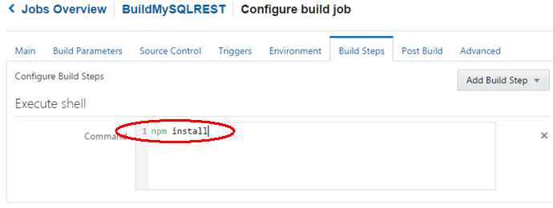

- Click the **Post Build** tab and enter the following:
    - Select **Archive the artifacts**
    - **Files To Archive:** `**/target/*`
    - **Compression Type:** **GZIP**

    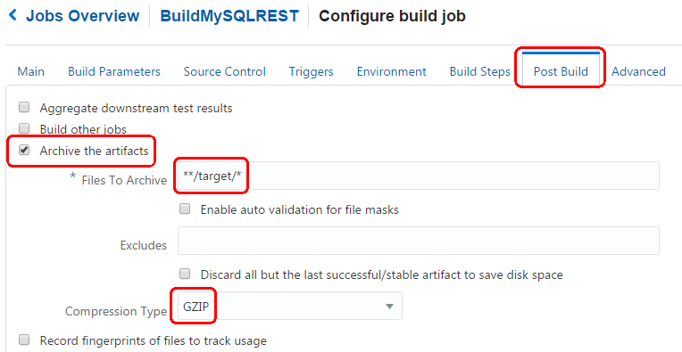

- Click the **Save** button in the upper right of the job configuration screen. 

    

- The build process should immediately queue to begin. If not, you can always initiate a build with the **Build Now** button.

    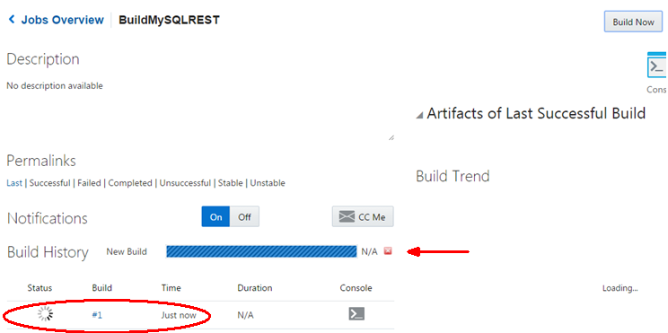

- After the build, the success status is shown with a check mark in a green circle.

    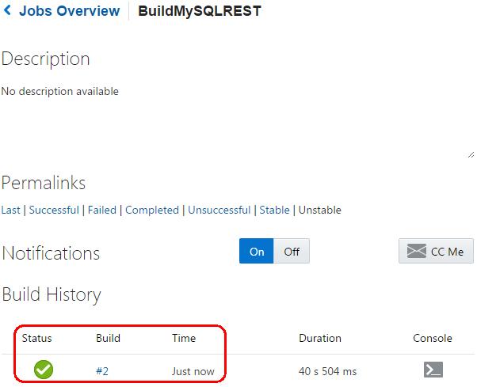

### **MySQL REST STEP 4**: Create Default Deploy Process

- Click **Deploy** on the navigation panel to access the Deployments page, and then click the **New Configuration** button.

    

- On the **New Deployment Configuration** popup, enter the following:
    - **Configuration Name:** `DeployMySQLREST` 
    - **Application Name:** `AlphaofficeMySQLREST` (This will be the name for the application in the Oracle Application Container Cloud Service, and this string will be incorporated into the URL for the deployed application.)
    - **Type:** **Automatic** 
    - **Job:** **BuildMySQLREST** 
    - **Artifact:** **target/msdbw-mysqlmicroservice.zip** 
    - Finally, click on the **New** button and select **Application Container Cloud** from the dropdown.

   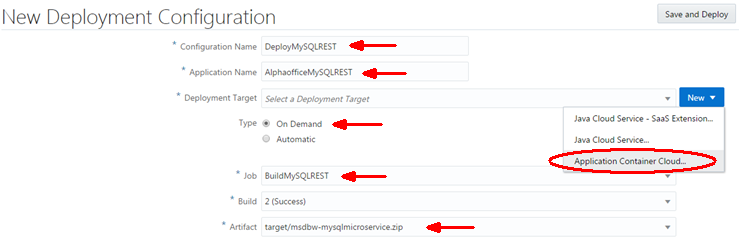

- Enter the Data Center, Identity Domain, Username and Password you were provided for the Oracle Cloud Service, and then click **Test Connection**.

    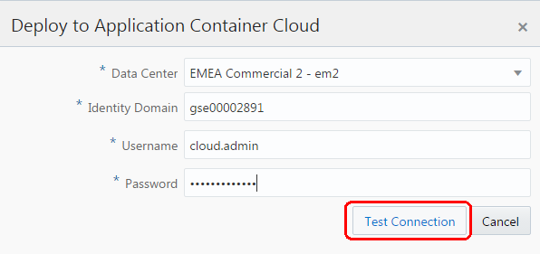

- When this comes back with a **Successful** status, click **Use Connection**.

    

- Make sure you have chosen the following:
    - **ACCS Properties:** **Node**
    - **Type:** **Automatic** with **Deploy stable builds only** checked
    - Finally, click **Save and Deploy**.

    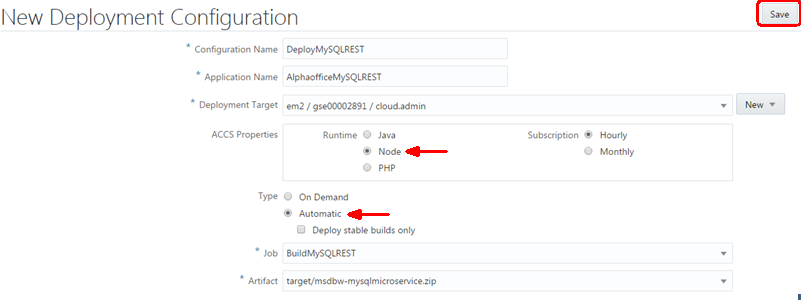

- The panel will first show the deployment in process, and then will show that the **Last deployment succeeded**.  ***Note: this may take several minutes.***

    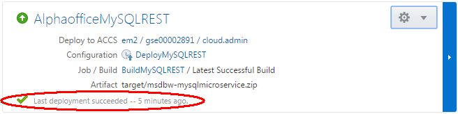

- If the arrow is not green but is orange and pointed down , this means the application has not been started.

- To manually start, stop or redeploy the application in Oracle Application Container Cloud Service, go to the gear dropdown icon for the application, and select the appropriate action.

    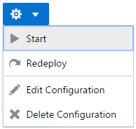

## Transition From the MySQL Microservice to the Twitter Microservice

 ***You have just completed steps MySQL REST STEP 2, MySQL REST STEP 3 and MySQL REST STEP 4.  These cover the initial build and deployment of the MySQL microservice. The next 3 steps (Twitter REST STEP 2, Twitter REST STEP 3 and Twitter REST STEP 4) are very similar to the MySQL REST steps. They cover the build and deployment of the Twitter microservice.***

## Create the Twitter Microservice Repository, and the Default Twitter Microservice Build and Deploy Processes

### **Twitter REST STEP 2**: Create the New Git Repository for the Twitter Microservice Code

- Click on **Project** on the navigation panel.

    

- Click the **New Repository** button.

    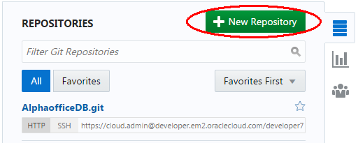

- In the **New Repository** popup, enter the following:
    - **Name** `AlphaofficeTitterREST` 
    - **Description** (any)
    - Select **Import existing repository** 
    - Enter `https://github.com/johnhennen/AlphaofficeTwitterREST` for the existing repository location.  
    - Finally, click **Create**.

    

- Once all the code files are imported, you will have the file and folder structure below in the **AlphaofficeTwitterREST** repository.

    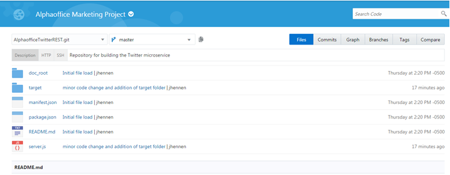

### **Twitter REST STEP 3**: Create Default Build Process

Now that you have the source code in your managed Git repository, you will need to create a build process that will be triggered whenever a commit is made to the master branch. In this step you will set up a shell script build process.

- Click **Build** on the navigation panel to access the build page, and then click the **New Job** button.

    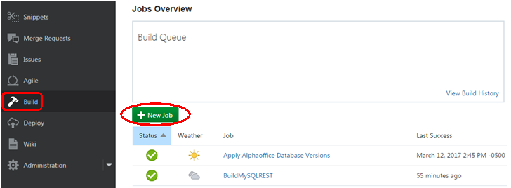

- In the New Job popup, enter `BuildTwitterREST` for Job Name. Select **Create a free-style job** and click **Save**.

    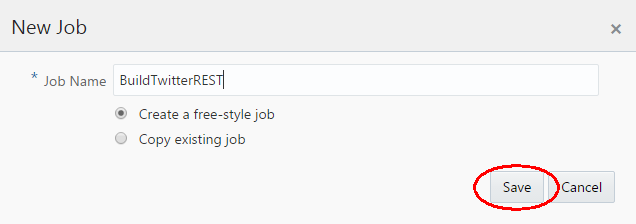

- You are now placed into the job configuration screen.

    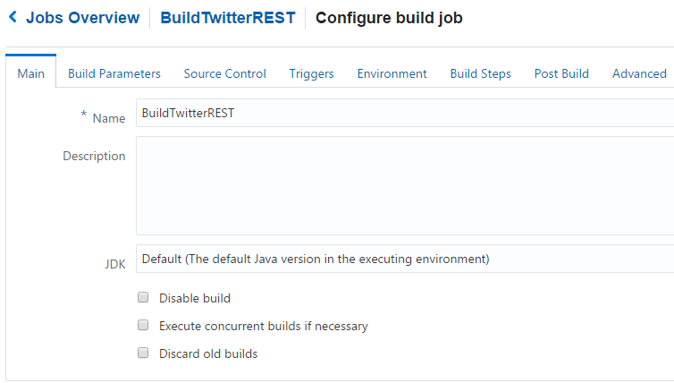

- Click the **Source Control** tab. Select **Git** and select **AlphaofficeTwitterREST.git** from the dropdown.

    

- Click the **Triggers** tab. Select **Based on SCM polling schedule**.

    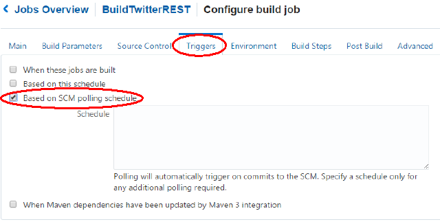

- Click the **Build Steps** tab. Click the **Add Build Step** dropdown and select **Execute shell**.

    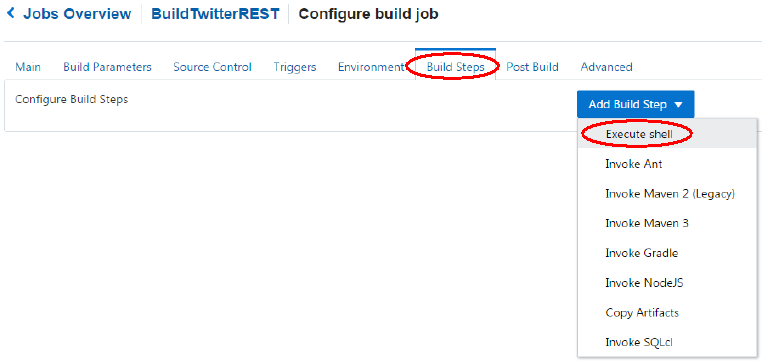

- For the shell script command enter `npm install`.

    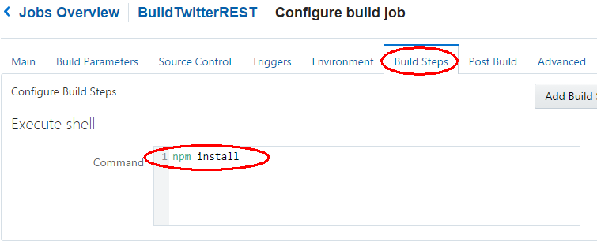

- Click the **Post Build** tab and enter the following:
    - Select **Archive the artifacts**
    - **Files To Archive:** `**/target/*`
    - **Compression Type:** **GZIP**

    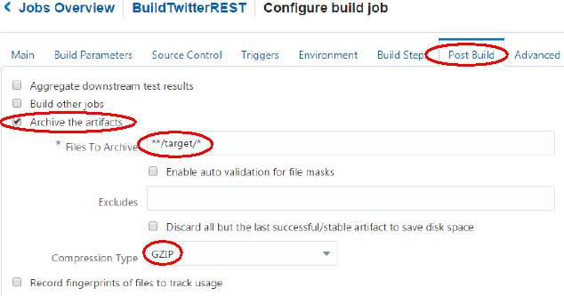

- Click the **Save** button in the upper right of the job configuration screen. 

    

- The build process should immediately queue to begin. If not, you can always initiate a build with the **Build Now** button.

    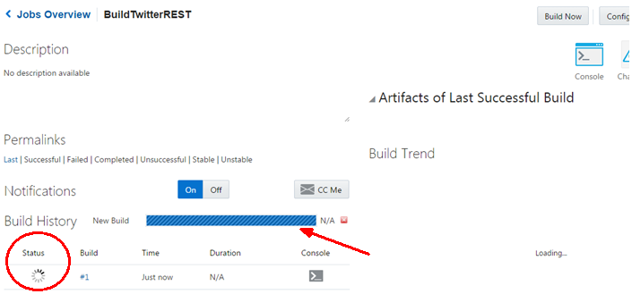

- After the build, the success status is shown with a check mark in a green circle.

    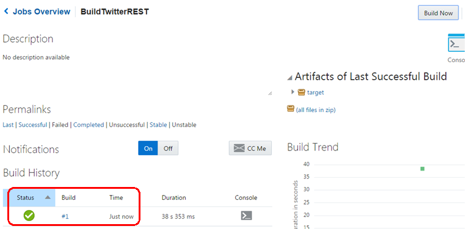

### **Twitter REST STEP 4**: Create Default Deploy Process

- Click **Deploy** on the navigation panel to access the Deployments page, and then click the **New Configuration** button.

    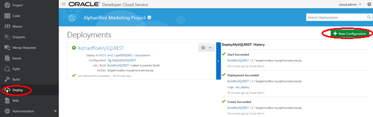

- On the **New Deployment Configuration** popup, enter the following:
    - **Configuration Name:** `DeployTwitterREST` 
    - **Application Name:** `AlphaofficeTwitterREST` (This will be the name for the application in the Oracle Application Container Cloud Service, and this string will be incorporated into the URL for the deployed application.)
    - **Type:** **Automatic** 
    - **Job:** **BuildTwitterREST** 
    - **Artifact:** **target/msdbw-twittermicroservice.zip** 
    - Finally, click on the **New** button and select **Application Container Cloud** from the dropdown.

    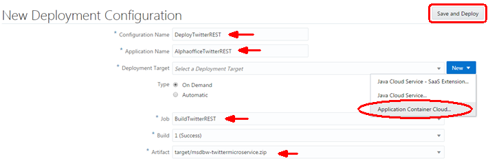

- Enter the Data Center, Identity Domain, Username and Password you were provided for the Oracle Cloud Service, and then click **Test Connection**.

    

- When this comes back with a **Succssful** status, click **Use Connection**.

    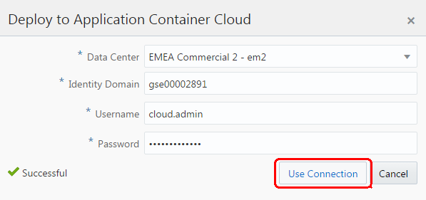

- Make sure you have chosen the following:
    - **ACCS Properties:** **Node**
    - **Type:** **Automatic** with **Deploy stable builds only** checked
    - Finally, click **Save and Deploy**.

    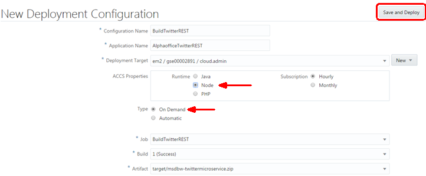

- The panel will first show the deployment in process, and then will show that the **Last deployment succeeded**.  ***Note: this may take several minutes.***

    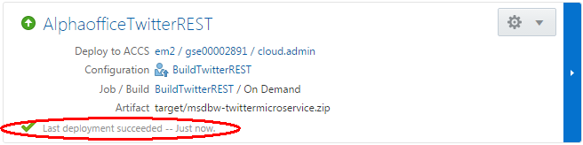

- If the arrow is not green but is orange and pointed down , this means the application has not been started.

- To manually start, stop or redeploy the application in Oracle Application Container Cloud Service, go to the gear dropdown icon for the application, and select the appropriate action.

    

## Test the Initial Microservice Deployments and Update the Agile Board

### **STEP 5**: Update the Agile Active Sprints Screen

- Click **Agile** on the navigation panel, and then drag the Task 3 panel from **In Progress** to the **Verify Code** column to signal Lisa, the project manager, that it's time to verify completion of Task 3.

    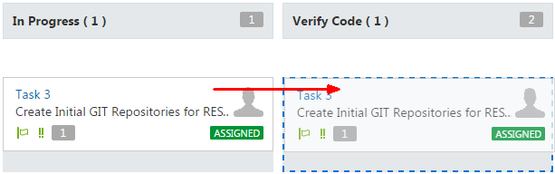

- Leave the default values and click **Next**.

    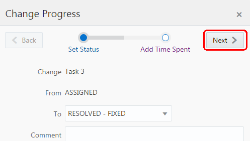

- Set the **Time Spent** value to 1 day and click **OK**.

    

- The **Active Sprints** screen shows the change.

    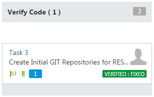

### **STEP 6**: Test the New Cloud Microservice Applications

- Click **Deploy** on the navigation panel. 

    

- Right click on the application name **AlphaofficeMySQLREST**, and choose **Copy link address** in the dropdown. This is the URL for the MySQLREST application in the Application Container Cloud Service.

     

- Paste this URL into the address bar of any browser (such as on your personal workstation), and then press **Enter** to navigate to the MySQLREST application in the Oracle Application Container Cloud Service. Note that there is no data displayed (only the JSON structure) because the code must be edited to access and return the MySQL data.

    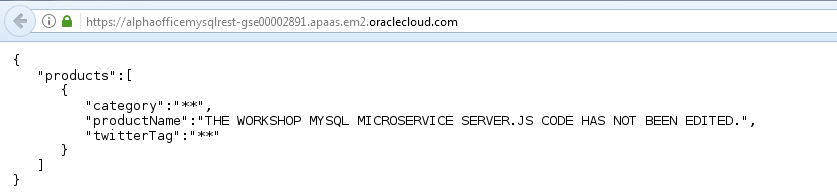 

- In the same way, right click on the application name **AlphaofficeTwitterREST**, and paste this URL into the address bar of any browser. Note that this shows an unfiltered listing of Twitter data in JSON format.

    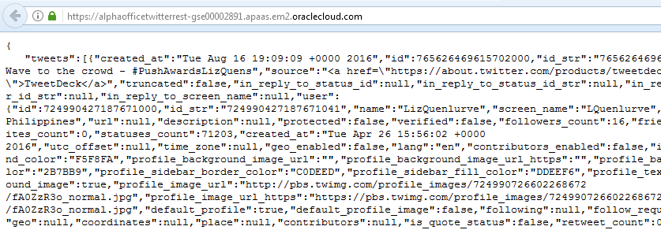 

### **STEP 7**: Designate That Repository Creation is Completed

- Briefly assume the persona of Lisa Jones (the project manager) to verify the completion of the repositories for the microservice applications. Drag the Task 3 panel from **Verify Code** to the **Completed** column.

    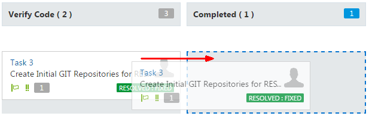  

- Leave the default values and click **Next**.

    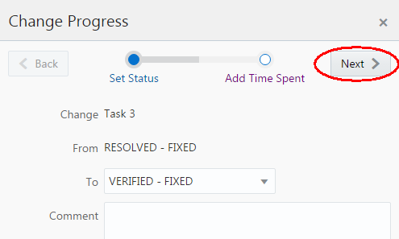  

- Set the **Time Spent** value to 1 day and click **OK**.

      

- The **Active Sprints** screen shows the change.

    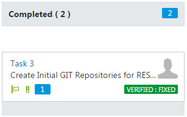  

# Edit the MySQL Microservice Code to Access the MySQL Data and Push the Edits to the Cloud

### **STEP 8**: Designate Feature 4 is **In Progress**

- At this point you will return to the persona of microservices developer Bala Gupta to designate that Feature 4 (Create REST Services) has been moved to **In Progress**. Do this by dragging the Feature 4 panel from **To Do** to the **In Progress** column.

    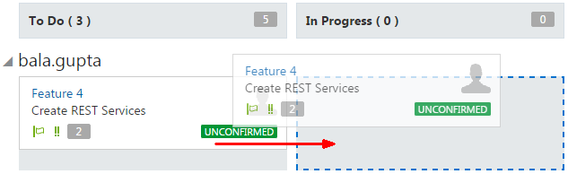  

- Leave the default values and click **Next**.

    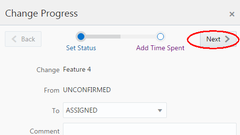  

- Set the **Time Spent** value to 1 day and click **OK**.

     

- The **Active Sprints** screen shows the change.

    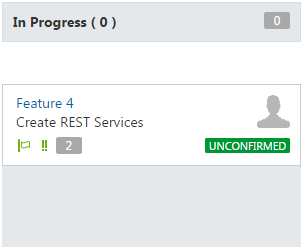

## Clone the MySQL Microservice Code and Test it on the Client Workstation

### **STEP 9**: Open the Brackets Code Editor

***At this point you will be moving to the client workstation. (This is the Oracle Compute Cloud Service with pre-installed client software that simulates a client workstation.)*** 

- Start the VNC Viewer software on your personal workstation, and enter the URL you have been provided (including ":" with the port number at the end). Also enter the password provided to you when prompted. After login, you are a user on a UNIX client workstation. 

    

- First open a terminal session on the workstation.

    

Your first task is to create (or locate) a working folder for the local AlphaofficeMySQLREST repository. If you were not given a specific folder location, any appropriate location in the UNIX folder structure will work as long as it is easy for you to access and organize this folder. (Perhaps name the folder **AlphaofficeMySQLREST**.) Also make sure permissions are sufficiently open for your work (chmod). Once an empty folder is created or located, you can move on to the next step.

- Click the Brackets icon on the workstation desktop to start the Brackets code editor.

    

- In the upper left, click on the dropdown for folder location and then select **Open Folder** from the dropdown.

    

- Navigate the ensuing popups to select the correct folder (the folder you just created or located).

    

- In the end you will have the correct folder displayed in the upper left.

    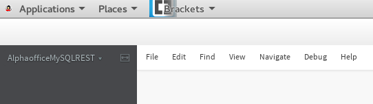

### **STEP 10**: Clone a Repository from the Oracle Developer Cloud Service Repository

- Click the Git icon on the right side of the Brackets screen to make sure the Git panel is open at the bottom of the Brackets screen.

    

- Click the **Clone** button at the top of the Git panel.

    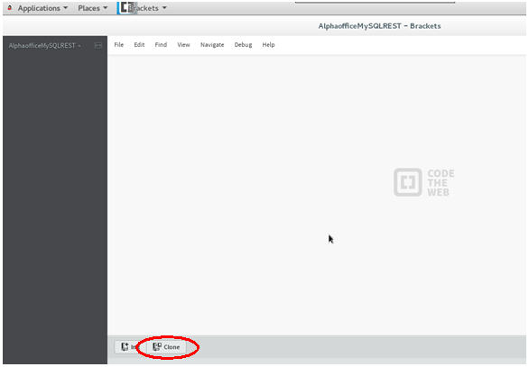

***At this point you will be returning very briefly to the Oracle Developer Cloud Service console.*** 

- Click **Project** on the navigation panel.

    

- In the **Repositories** panel, navigate to the URL for the **AlphaofficeMySQLREST.git** repository. Copy this URL 

    

***At this point you will be returning to the Brackets code editor on the client workstation.***

- Since you just clicked the **Clone** button in the Brackets editor, the **Clone repository** popup is displayed. 
    - Paste the Oracle Cloud repository URL for **AlphaofficeMySQLREST.git** into the field labeled **Enter Git URL of the repository you want to clone:**.
    - Enter the Username and Password for your Oracle Cloud account.
    - Check **Save credentials to remote url (in plain text)**.
    - Finally, click **OK**.

     

- Note the cloning **in progress** message.

    

- When the cloning is successfully completed, the code files and folders for the local repository will be displayed in the Brackets editor.

    

### **STEP 11**: Test the Local Code

At this point you will be testing the code running on the client workstation.

- Open a terminal session on the client workstation.

    

- Navigate to the folder where the **server.js** file is located in the local AlphaofficeMySQLREST repository. (The server.js file is in the root folder of the repository folder you opened in Step 9.) Then enter the command `node server.js` and press **Enter**.

    

The terminal session will appear to suspend without returning a new command prompt. At this point you may minimize the terminal window because the Node.js listener for server.js is running in the background.

- Enter the url `localhost:8002` in the address bar of the browser provided on the client workstation (with the icon displayed on the desktop) and press **Enter** to navigate to the local MySQLREST application.

    

Again note that there is no data displayed because the microservice code must be edited to access and return the MySQL data.

## Edit the Code and Test the Local Edited Version

### **STEP 12**: Edit the Local Version of the Code

- In the left code repository panel of the Brackets code editor, click on the **server.js** file. ***Note: there are a number of formatting and other non-fatal warnings that will be reported when you open the server.js file. Ignore these.***

    

In the section highlighted within the red rectangle, notice a number of values required to connect to the MySQL database that you deployed in Lab 200. In particular the host (IP address) and the password will be different from what is displayed in this image. Change these values in the code to reflect your MySQL database deployment.

- Note the code section with critical code commented out.

    

- Remove the `/*` and `*/` strings from the code to uncomment the code section.

    

- From the Brackets **File** menu, click **Save** to save your edits to **server.js**.

    

### **STEP 13**: Test the Edited Code

- You must terminate the Node.js session you started in **Step 11**. You must do this in order to execute the `node server.js` command again with the new edits to the server.js file. To do this, return to the terminal session you used in **Step 11** and press the **CTRL** and **C** keys simultaneously.

- Alternatively you can close the terminal session that you opened in **Step 11** and then open a new terminal session on the client workstation.

    

- Restart the Node.js module. To do this, navigate to the folder where the **server.js** file is located in the local AlphaofficeMySQLREST repository. Then enter the command `node server.js` and press **Enter**.

    

The terminal session will appear to suspend without returning a new command prompt. At this point you may minimize the terminal window because the Node.js listener for server.js is running in the background.

- Enter the url `localhost:8002` in the address bar of the browser provided on the client workstation (with the icon displayed on the desktop) and press **Enter** to navigate to the edited local MySQLREST application.

    

Notice that after the edits, the local version of the MySQL microservice application displays all the data from the Oracle Cloud MySQL database in JSON format. (If you do not see this data, make sure the MySQL database you deployed in Lab 200 is still accessible.)

## Create a New Branch and Push the Edits to the Cloud

### **STEP 14**: Create a New Branch and Commit the Changes

- Click on the **master** branch dropdown in the upper left panel of the Brackets code editor.  Then select **Create new branch**.

    

- In the **Create new branch...** popup, enter the branch name `serverjsV2` and click **OK**.

    

- You may need to click the Git icon  on the right side of the Brackets editor screen in order to display the Git panel at the bottom of the Brackets screen.

- Make sure both check boxes are checked at the bottom left of the Brackets screen. (One checkbox is on the same line as the **Commit** button, and one is on the same line as **server.js** and the label **Modified** or **Staged, Modified**.)

- Then click **Commit**.

    

- ***Note: there are a number of formatting and other non-fatal warnings that will be reported for the server.js file. Ignore these.***

- Enter a comment for the commit and click **OK**.

    

- You may need to enter a Git username. (Enter your username for your cloud service.) And you may need to enter some email address. (Any will do.) Finally, click **OK**.

    

### **STEP 15**: Push the Branch Commits to the Cloud

- Click on the **Git Push Icon** in the Brackets code editor.

    

- Enter your cloud username and password that you were given. Make sure **Save credentials to remote url (in plain text)** is checked. Finally, click **OK**.

    

- The edited branch within the local Git repository has been successfully pushed to the repository in the Oracle Developer Cloud Service. Click **OK**.

    

# Merge the Code Edits and Rebuild and Redeploy the MySQLREST Application

## Submit a Merge Request for the Branch With the Code Edits and Designate the Edited Code is Ready for Verification

### **STEP 16**: Create a Merge Request as Bala Gupta to Merge the Code Edits

It's time to follow the code repository push to the Oracle Developer Cloud Service. Return to the Oracle Developer Cloud Service Services Console.

- Click **Code** on the navigation panel.

     

- Choose **AlphaofficeMySQLREST.git** as the repository.

     

- Choose **serverjsV2** as the branch. (This is the branch that has the code edits which we wish to merge with the master branch.)

     

- Click the **Commits** button to view recent commits. Here we again see that the push we made from the Brackets code editor on the client workstation has succeeded. The edited files are now in the **servicerjsV2** branch of the Developer Cloud Service repository. They're all ready to be merged into the **master** branch. 

    

But remember, we are following a rigorous Git-based source control methodology. We cannot have developers like Bala Gupta make changes to the main branch of the code. 

- Instead Bala must make a **merge request** to Lisa the project manager.

    

- Click **Merge Request** on the navigation panel, and then click the **New Merge Request** button.

    

- On the **New Merge Request** popup, choose the **Repository**, **Target Branch** and **Review Branch**. Then click **Next**.

    

- On the second popup, add a summary description and select a reviewer. (In real life, Bala might designate several reviewers. In this exercise the only option may be **Cloud Admin**.)  Finally, click **Next**. 

    

- On the third popup, click **Create**.

    

### **STEP 17**: Designate That the UI Code is Ready for Verification

- Click **Agile** on the navigation panel.

     

- Drag the Feature 4 panel from **In Progress** to the **Verify Code** column to designate to the project manager (Lisa) that the code is ready for verification.

      

- Leave the default values and click **Next**.

    

- Set the **Time Spent** value to 1 day and click **OK**.

     

- The **Active Sprints** screen shows the change.

     

## As Lisa Jones (Project Manager) Merge the Edits, Test the Edited Code, and Designate the Edits and Merge Have Been Completed

### **STEP 18**: Perform the Merge as Lisa the Project Manager

- For this step, you will assume the persona of Lisa, the project manager.

    

- As Lisa, click the **Assigned To Me** button. Then click the merge request just submitted by Bala Gupta.

    

- Click on the **Changed Files** tab to review the changed code, and note how the changes reflect the edits Bala Gupta made in the Brackets code editor on the client workstation. As Lisa, approve and process the merge by clicking the **Merge** button.

    

- On the popup uncheck **Squash commits** and click **Merge**.

    

- Click **Build** on the navigation panel to navigate to the **Build** screen. Processing the merge automatically initiates a rebuild process. Note how the **BuildMySQLREST** job has been placed in the queue automatically.

    

- The rebuild begins.

    

- The rebuild has successfully completed.

    

- Click **Deploy** on the navigation panel to navigate to the **Deployments** screen. Once the rebuild is complete, a redeploy will also automatically start. The panel will first show the deployment in process, and then will show that the **Last deployment succeeded**.

    

- If the arrow is not green but is orange and pointed down , this means the application has not been started.

- To manually start, stop or redeploy the application in Oracle Application Container Cloud Service, go to the gear dropdown icon for the application, and select the appropriate action.

- ***If you must manually redeploy, make sure you deploy the latest build with the latest build number.***

    

### **STEP 19**: Test the Completed Code

- Click **Deploy** on the navigation panel.

     

- As Lisa Jones, test the code edits. Right click on the application name **AlphaofficeMySQLREST**, and choose **Copy link address** in the dropdown. This is the URL for the application in the Application Container Cloud Service.

    

- Paste this URL into the address bar of any browser (such as on your personal workstation), and then press **Enter** to navigate to the MySQLREST application in the Oracle Application Container Cloud Service. Note that all data from the database is now displayed in JSON format. The application is fully operational.

    

### **STEP 20**: Designate the Edits are Complete

- Again you have assumed the persona of Lisa, the project manager. As Lisa you will verify that the MySQL microservice code has been completed. Click **Agile** on the navigation panel.

    

- Drag the Feature 4 panel from **Verify Code** to the **Completed** column.

    

- Leave the default values and click **Next**.

    

- Set the **Time Spent** value to 1 day and click **OK**.

    

- The MySQL microservice edits have been completed and merged, and the Agile board has been updated. You have successfully completed Lab 300!

    

