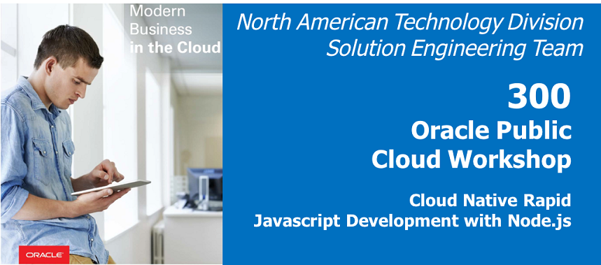  

Update: April 30, 2017

# Introduction

This is the fourth of several labs that are part of the **Oracle Public Cloud DevOps Cloud Native Microservices Workshop**. This workshop walks you through the Software Development Lifecycle (SDLC) for a Cloud Native project that will create and use several microservices.

In the first lab (100), Lisa the Project Manager created a new project in the Developer Cloud Service, added team members to the project, and created and assigned tasks to the developers of this application. The second lab (200) focused on deploying a MySQL database instance in the Oracle Cloud. Lab 300 developed and deployed two microservices to access MySQL database data and to access Twitter feed data. In this fourth lab, you will assume the persona of the UI developer (John Dunbar) who will build a Node.js UI front end application that consumes and displays the data from the two microservices created in Lab 300.

**Please direct comments to: John Hennen ([john.hennen@oracle.com](mailto:john.hennen@oracle.com)).**

## Objectives

- Access the Oracle Developer Cloud Service
- Import code from an external Git Repository
- Import the project into the Brackets code editor, perform edits and push the edits to the repository in the Oracle Cloud
- Build and deploy the project using the Oracle Developer Cloud Service and the Oracle Application Container Cloud Service
- Follow the Git methodology for source code control
- Follow the Agile methodology for project management

## Required Artifacts

- The following lab requires an Oracle Public Cloud account that will be supplied by your instructor. Included in this account is an Oracle Compute Cloud Service that will simulate a client workstation with all necessary client software pre-installed for local code editing.  You will need to install VNC viewer on your personal workstation to access this Compute Cloud Service client. 

# Create Initial Marketing UI Service

## Create the initial Git Repository

### **STEP 1**: Review and update the Agile Board

- This Lab assumes that you completed Lab 100, 200 and 300 and are still connected to the Oracle Cloud, that you're still in the Developer Cloud Service Dashboard, and you're viewing the "Alphaoffice Marketing Project". If for some reason that is not the case, follow the first several Steps of Lab 100 to once again view the Developer Cloud Service Console.

      

- Although you will remain connected to the Oracle Cloud using the user account you were provided, you are to take on the Persona of ***John Dunbar*** (UI developer) as you perform the following steps.

     

- Click on **Agile** on the navigation panel.

    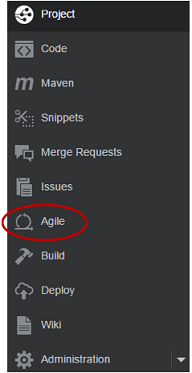  

- Click on the **Microservices** Board **Active Sprints**.

    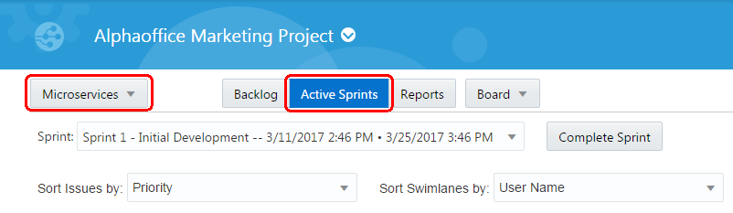

- Focus on the sprints for John Dunbar.

    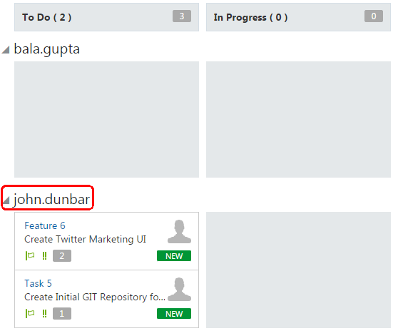

- Designate that Task 5 has moved to **In Progress** by dragging the Task 5 panel into the **In Progress** column.

    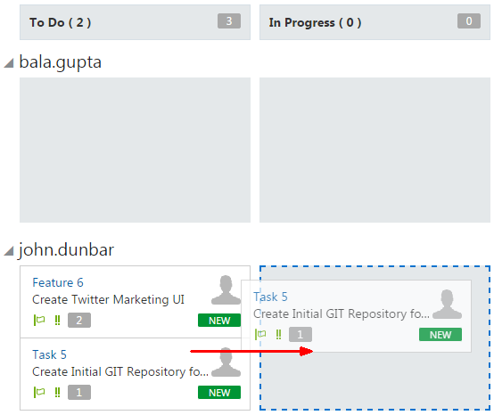

- Leave the default values and click **Next**.

    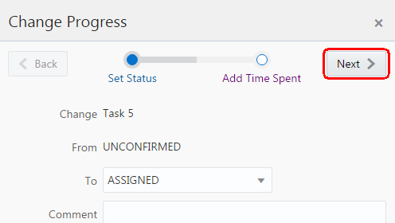

- Set the **Time Spent** value to 1 day and click **OK**.

    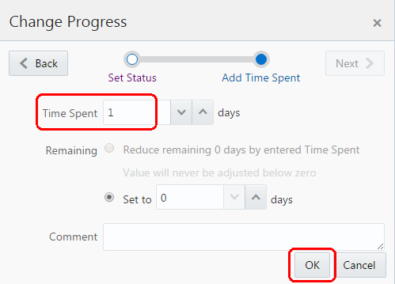

- The **Active Sprints** screen shows the change.

    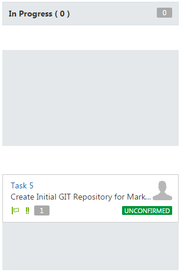

### **STEP 2**: Create the new Git repository for the UI code

- Click on **Code** on the navigation panel.

    

- Click the **New Repository** button.

    

- In the **New Repository** popup, enter `AlphaofficeUI` and enter a description. Select **Import existing repository**, and enter `https://github.com/johnhennen/AlphaofficeUI` for the outside repository location.  Then click **Create**.

    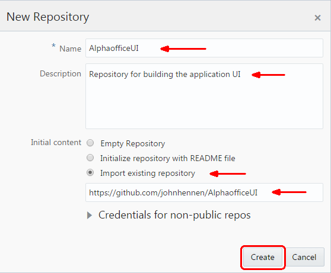

- Once all the code files are imported, you will have the file and folder structure below in the **AlphaofficeUI** repository.

    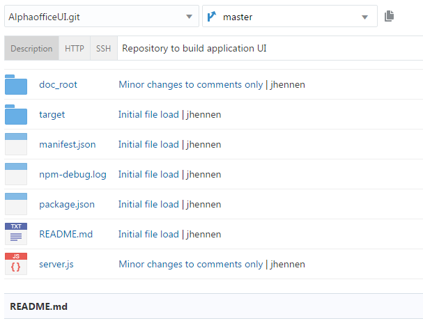

## Create Default Build and Deployment Process

### **STEP 3**: Create Default Build Process

Now that you have the source code in your managed Git repository, you will need to create a build process that will be triggered whenever a commit is made to the master branch. In this step you wil set up a shell script build process.

- Click **Build** on the navigation panel to access the build page, and then click the **New Job** button.

    

- In the New Job popup, enter `BuildUI` for Job Name. Select **Create a free-style job** and click **Save**.

    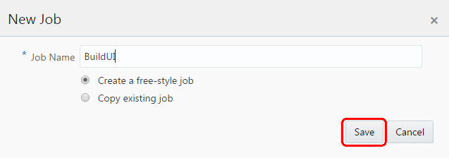

- You are now placed into the job configuration screen.

    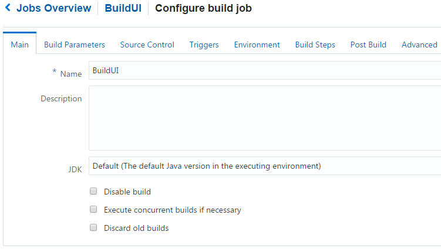

- Click the **Source Control** tab. Select **Git** and select **AlphaofficeUI.git** from the dropdown.

    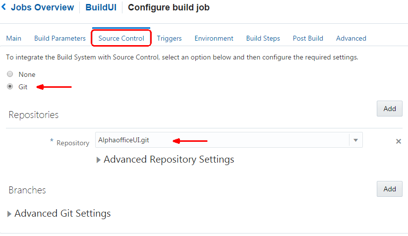

- Click the **Triggers** tab. Select **Based on SCM polling schedule**.

    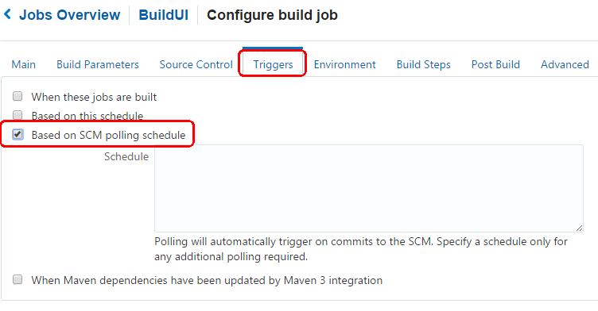

- Click the **Build Step** tab. Click the **Add Build Steps** dropdown and select **Execute shell**.

    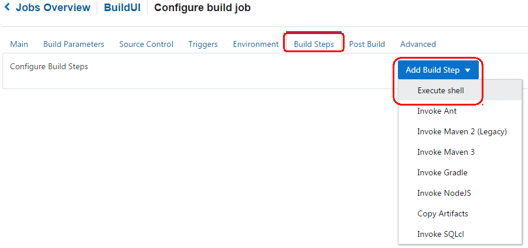

- For the shell script command enter `npm install`.

    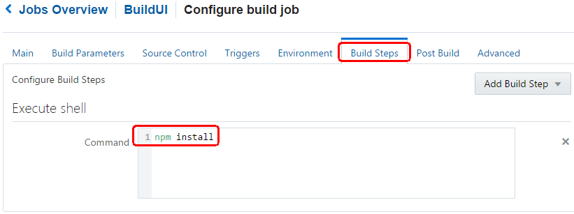

- Click the **Post Build** tab. Here select **Archive the artifacts** and select **GZIP** for the Compression Type. Then enter `**/target/*` for the Files To Archive value.

    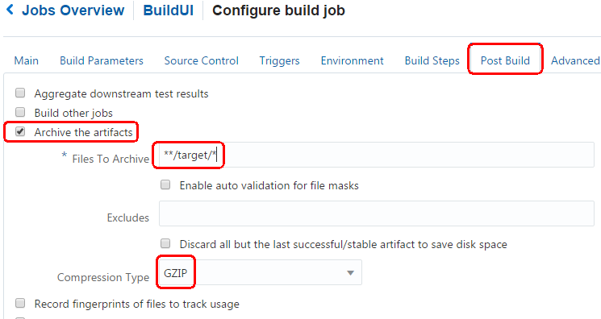

- Click the **Save** button in the upper right of the job configuration screen. 

    

- The build process should immediately queue to begin. If not, you can always initiate a build with the **Build Now** button.

    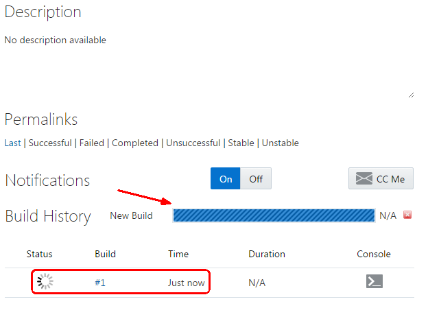

- After the build, the success status is shown with a check mark in a green circle.

    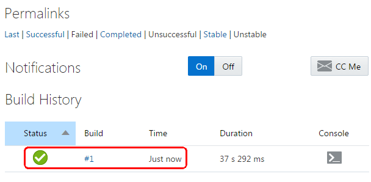

### **STEP 4**: Create Default Deploy Process

- Click **Deploy** on the navigation panel to access the Deployments page, and then click the **New Configuration** button.

    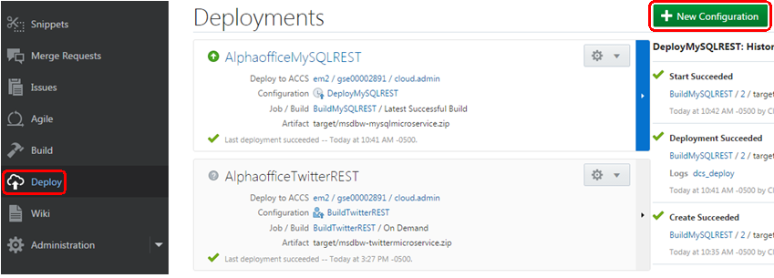

- On the **New Deployment Configuration** popup, Enter `DeployUI` for the **Configuration Name**. Then enter `AlphaofficeUI` as the **Application Name**. The latter will be the name for the application in the Oracle Application Container Cloud Service, and this string will be incorporated into the URL for the deployed application. Select **On Demand** for the Type. And make sure **BuildUI** is selected for Job and **target/msdbw-microserviceui.zip** is selected for Artifact. Click on the **New** button and select **Application Container Cloud** from the dropdown. Then click **Save and Deploy**.

    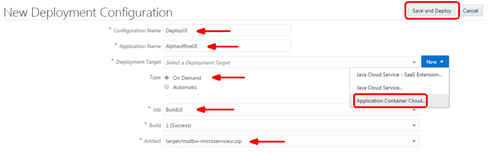

- Enter the Data Center, Identity Domain, Username and Password you were provided for the Oracle Cloud Service, and then click **Test Connection**.

    

- When this comes back with a **Succssful** status, click **Use Connection**.

    

- Make sure you have chosen **Node** for **ACCS Properties**, and then click **Save and Deploy**.

    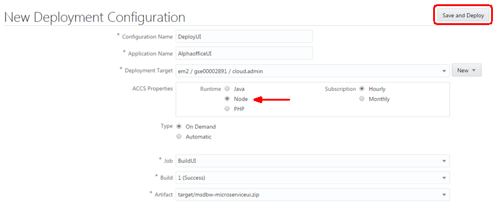

- The Panel will first show the deployment in process, and then will show that the **Last deployment succeeded**.

    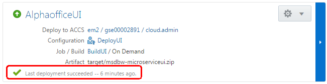

- If the arrow is not green but is orange and pointed down , this means the application has not been started.

- To manually start, stop or redeploy the application in Oracle Application Container Cloud Service, go to the gear dropdown icon for the application, and select the appropriate action.

    

### **STEP 5**: Update the Agile Active Sprints screen

- Click **Agile** on the navigation panel, and then drag the Task 5 panel from **In Progress** to the **Verify Code** column to signal Lisa, the project manager, that it's time to verify completion of Task 5.

    

- Leave the default values and click **Next**.

    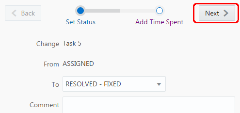

- Set the **Time Spent** value to 1 day and click **OK**.

    

- The **Active Sprints** screen shows the change.

    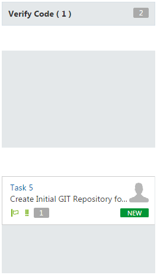

### **STEP 6**: Test the New Cloud UI Application

- While still in the **Deploy** screen, right click on the application name **AlphaofficeUI**, and choose **Copy link address** in the dropdown. This is the URL for the application in the Application Container Cloud Service.

     

- Paste this URL into the address bar of any browser (such as on your personal workstation), and then navigate to the UI application in the Oracle Application Container Cloud Service. Note that there is no data displayed, because the UI code must be edited to consume and display the microservices data.

    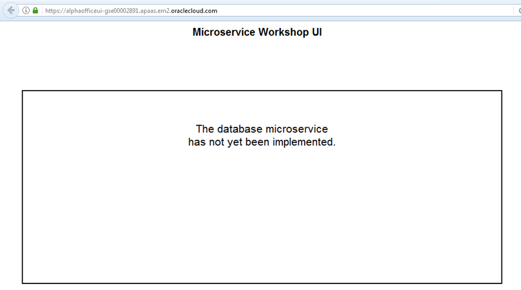  

### **STEP 7**: Designate That Repository Creation is Completed

- Briefly assume the persona of Lisa (the project manager) to verify the completion of the repository for the UI application. Drag the Task 5 panel from **Verify Code** to the **Completed** column.

    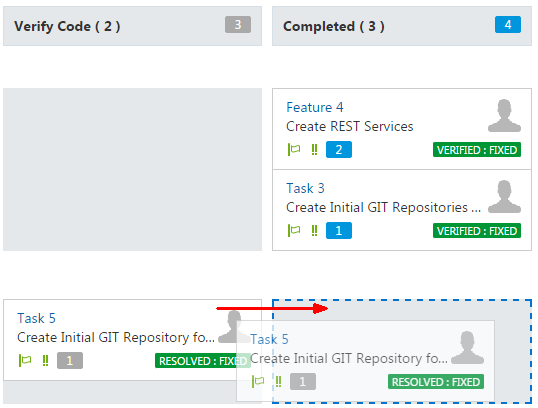  

- Leave the default values and click **Next**.

    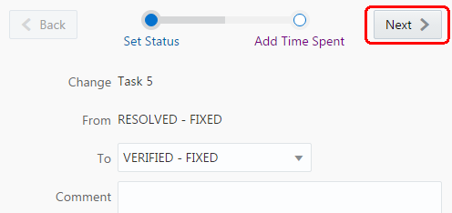  

- Set the **Time Spent** value to 1 day and click **OK**.

      

- The **Active Sprints** screen shows the change.

    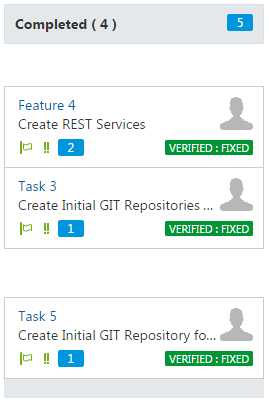  

# Edit the UI Code to Consume and Display the Microservices Data

### **STEP 8**: Designate Feature 6 is **In Progress**

- At this point you will return to the persona of UI developer John Dunbar to designate that Feature 6 (Create Twitter Marketing UI) has been moved to **In Progress**. Do this by dragging the Feature 6 panel from **To Do** to the **In Progress** column.

    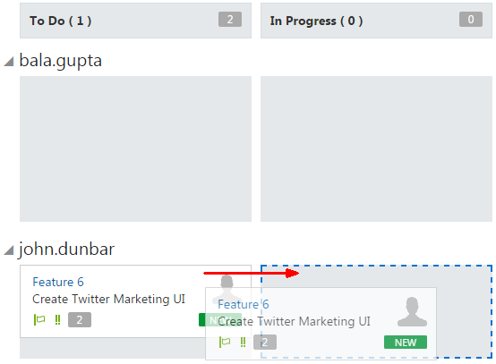  

- Leave the default values and click **Next**.

    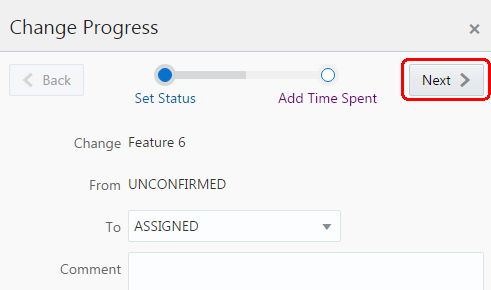  

- Set the **Time Spent** value to 1 day and click **OK**.

     

## Edit the UI Code on the Client Workstation

### **STEP 9**: Open the Brackets Code Editor

At this point you will be moving to the client workstation. (This is the Oracle Compute Cloud Service with pre-installed client software that simulates a client workstation.) 

- Start the VNC Viewer software on your personal workstation, and enter the URL you have been provided (including ":" with the port number at the end). Also enter the username and password provided to you when prompted. After login, you are a user on a UNIX client workstation. 

    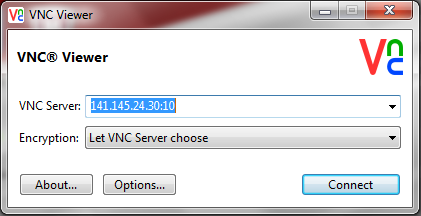

- First open a terminal session on the workstation.

    

Your first task is to create (or locate) a working folder for the local AlphaofficeUI repository. This is similar to what you did in Lab 300 for the AlphaofficeMySQLREST repository. Once an empty folder is created or located, you can move on to the next step.

- Click the Brackets icon on the workstation desktop to start the Brackets code editor.

    

- In the upper left, click on the dropdown for folder location and then select **Open Folder** from the dropdown.

    

- Navigate the ensuing popups to select the correct folder (the folder you just created or located).

    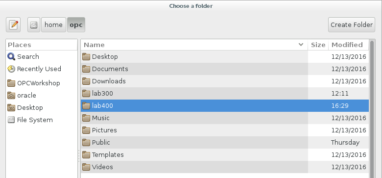

- In the end you will have the correct folder displayed in the upper left.

    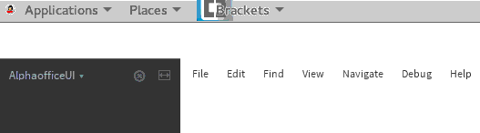

### **STEP 10**: Clone a repository from the Oracle Developer Cloud Service repository

- Click the Git icon to make sure the Git panel is open at the bottom of the Brackets screen.

    

- Click the **Clone** button at the top of the Git panel.

    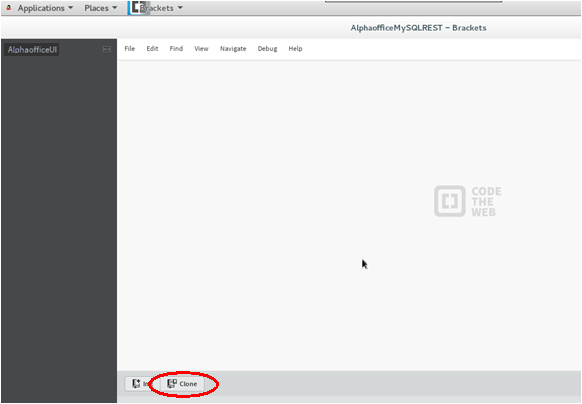

At this point you will be returning very briefly to the Oracle Developer Cloud Service console. 

- Click **Code** on the navigation panel.

    

- In the **Repositories** panel, navigate to the URL for the AlphaofficeUI.git repository. Copy this URL 

    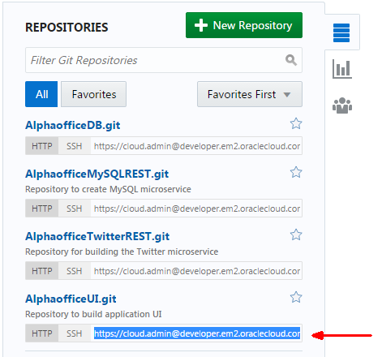

At this point you will be returning to the Brackets code editor on the client workstation.

- Since you just clicked the **Clone** button in the Brackets editor, the **Clone repository** popup is displayed. Paste the Oracle Cloud repository URL into the field labeled **Enter Git URL of the repository you want to clone:**. Enter the Username and Password for your Oracle Cloud account. Then click **OK**.

    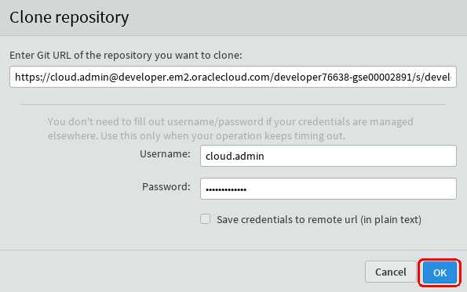 

- Note the cloning **in progress** message.

    

- When the cloning is successfully completed, the code files and folders for the local repository will be displayed in the Brackets editor.

    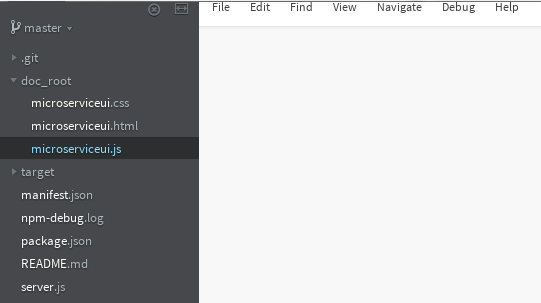

### **STEP 11**: Test the Local Code

At this point you will be testing the code running on the client workstation.

- Open a terminal session on the client workstation.

    

- Navigate to the folder where the **server.js** file is located in the local AlphaofficeUI repository. Then enter the command `node server.js` and press **Enter**.

    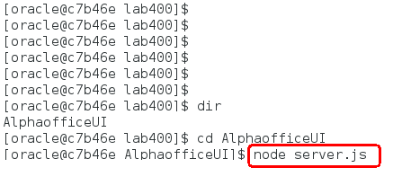

The terminal session will appear to suspend without returning a new command prompt. At this point you may minimize the terminal window because the Node.js listener for server.js is running in the background.

- Enter the url `localhost:8001` in the address bar of the browser provided on the client workstation (with the icon displayed on the desktop) and press **Enter**.

    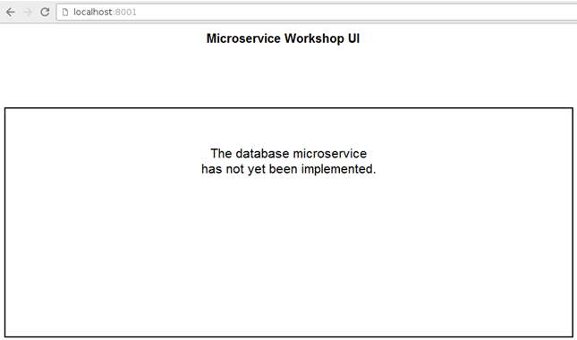

Again note that there is no data displayed because the UI code must be edited to consume and display the microservices data.

## Edit and Test the Local Version of the Code

### **STEP 12**: Edit the Local Version of the Code

- In the left code repository panel, click on the **microserviceui.js** file in the **doc_root** folder.

    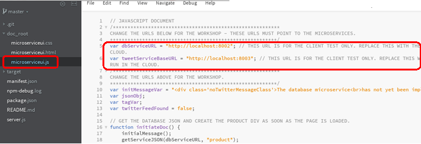

In the section highlighted within the red rectangle, notice the two variables **dbServiceURL** and **tweetServiceBaseURL**. These variables are currently pointing to localhost URLs for microservices that would run on the client workstation. These values must be updated to the working URLs for the Oracle Application Container Cloud Service applications for the two microservices. To obtain these, go back to the Oracle Developer Cloud Service services console. Then click **Deploy** on the navigation panel.

- Right click on the application name **AlphaofficeMySQLREST**, and choose **Copy link address** in the dropdown. This is the URL for the MySQL microservice. Repeat this step for the application named **AlphaofficeTwitterREST**.

    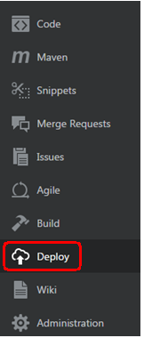

- Paste these copied URLs as values for the variables in the microserviceui.js code. Paste the URL for **AlphaofficeMySQLREST** into the value for the variable **dbServiceURL**. Paste the URL for **AlphaofficeTwitterREST** into the value for the variable **tweetServiceBaseURL**. 

    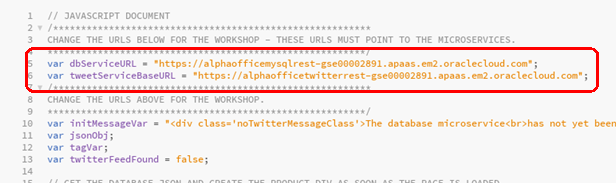

- Note the code section with critical code commented out.

    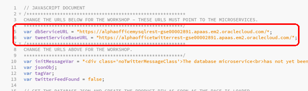

- Remove the `/*` and `*/` strings from the code to uncomment the code section.

    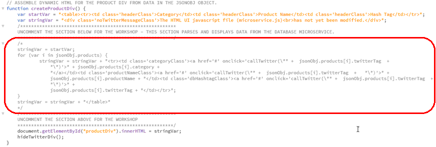

- From the Brackets **File** menu, click **Save** to save your edits to **microserviceui.js**.

    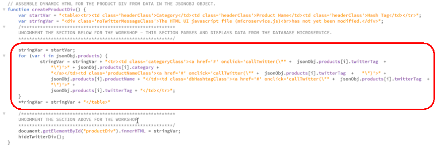

### **STEP 13**: Test the Edited Code

- Close the terminal session that you just opened in **Step 11**. You must close this in order to start the Node.js code with the new edits.

- Open a terminal session on the client workstation.

    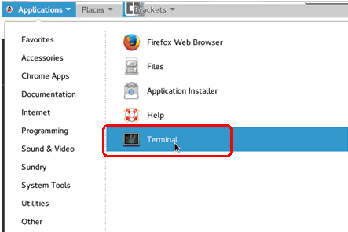

- Restart the Node.js module. To do this, navigate to the folder where the **server.js** file is located in the local AlphaofficeUI repository. Then enter the command `node server.js` and press **Enter**.

    

The terminal session will appear to suspend without returning a new command prompt. At this point you may minimize the terminal window because the Node.js listener for server.js is running in the background.

- Enter the url `localhost:8001` in the address bar of the browser provided on the client workstation (with the icon displayed on the desktop) and press **Enter**.

    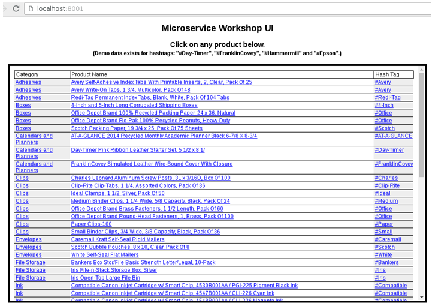

Notice that after the edit, the local version of the UI application displays all the data from the two Oracle Cloud microservices. (If you do not see this data, make sure both microservices are running in the Oracle Application Container Cloud Service.)

# Create a New Branch and Push the Edits to the Cloud

## Create and Commit a New Branch

### **STEP 14**: Create a new Branch and Commit the Changes

- Click on the **master** branch dropdown in the upper left panel of Brackets.  Then select **Create New Branch**.

    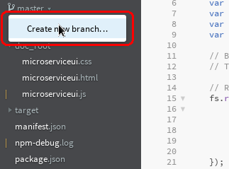

- In the **Create new branch...** popup, enter the branch name `microserviceuijsV2` and click **OK**.

    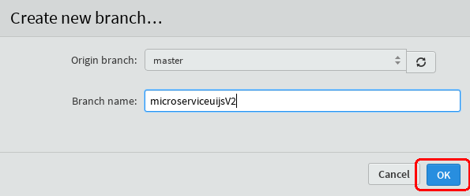

- You may need to click the Git icon  to display the Git panel at the bottom of the Brackets editor.

- Select the **Staged, Modified** entry for **doc_root/microserviceui.js** and click **Commit**.

    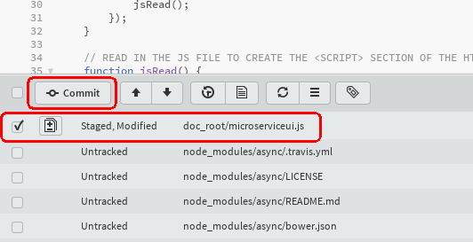

- Enter a comment for the commit and click **OK**.

    

- May need to enter a Git username. (Enter your username for your cloud service.) And you may need to enter some email address. (Any will do.)

    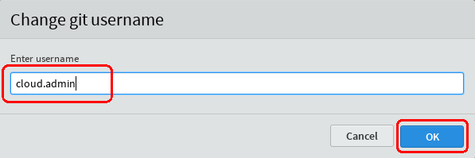

## Push the Edited Branch to the Cloud

### **STEP 15**: Push the Branch Commits

- Click on the **Git Push Icon**.

    

- Enter your cloud username and password that you were given, and click **OK**.

    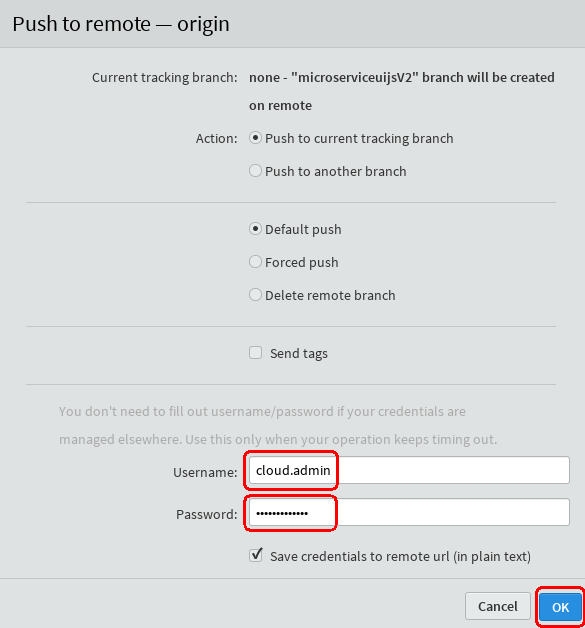

- The edited branch within the local Git repository has been successfully pushed to the repository in the Oracle Developer Cloud Service. Click **OK**.

    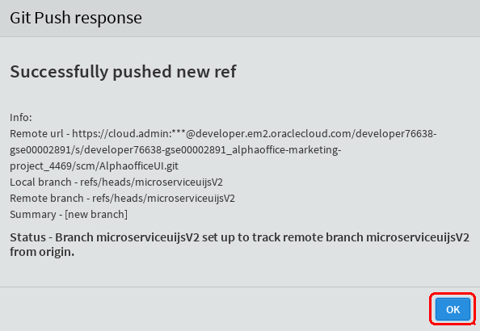

### **STEP 16**: Designate That the UI Code is Ready for Verification

- Return to the Developer Cloud Service services console, and click **Agile** on the navigation panel.

     

- Drag the Feature 6 panel from **In Progress** to the **Verify Code** column to designate to the project manager (Lisa) that the code is ready for verification.

      

- Leave the default values and click **Next**.

    

- Set the **Time Spent** value to 1 day and click **OK**.

     

# Merge the Code Edits and Rebuild and Redeploy the UI Application

## Merge the Code Edits

### **STEP 17**: Create a Merge Request as John Dunbar to Merge the Code Edits

It's time to follow the code repository push to the Oracle Developer Cloud Service.

- Click **Code** on the navigation panel.

     

- Choose **AlphaofficeUI.git** as the repository.

     

- Choose **microserviceuijsV2** as the branch. (This is the branch that has the code edits which we wish to merge with the master branch.)

     

- Click the **Commits** button to view recent commits. Here we again see that the push we made from the Brackets code editor on the client workstation has succeeded. The edited files are now in the **microserviceuijsV2** branch of the DCS repository. They're all ready to be merged into the **master** branch. 

    

But remember, we are following a rigorous Git-based source control methodology. We cannot have developers like John Dunbar make changes to the main branch of the code. 

- Instead John must make a **merge request** to Lisa the project manager.

    

- Click **Merge Request** on the navigation panel, and then click the **New Merge Request** button.

    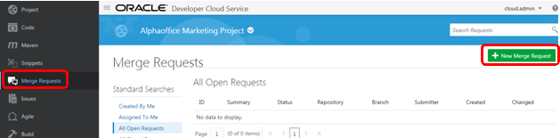

- On the **New Merge Request** popup, choose the **Repository**, **Target Branch** and **Review Branch**. Then click **Next**.

    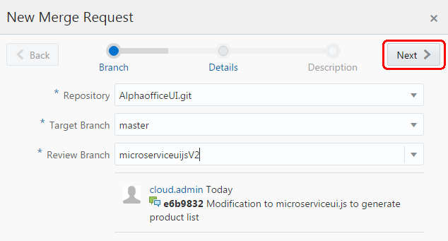

- On the second popup, add a summary description and select a reviewer. Then click **Next**. 

    

- On the third popup, click **Create**.

    

### **STEP 18**: Perform the Merge as Lisa the Project Manager

- For this step, you will briefly assume the persona of Lisa, the project manager.

    

- As Lisa, click the **Assigned To Me** button. Then click the merge request just submitted by John Dunbar.

    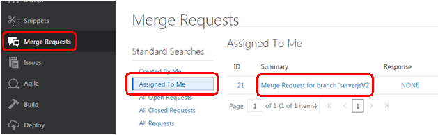

- Review the changed code, and note how the changes reflect the edits John Dunbar made in the Brackets code editor on the client workstation. As Lisa, approve and process the merge by clicking the **Merge** button.

    

- On the popup click **Merge**.

    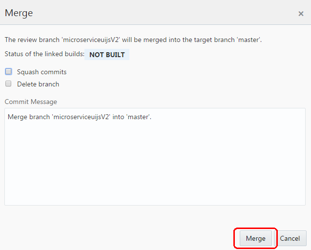

- Click **Build** on the navigation panel. Processing the merge automatically initiates a rebuild process. Note how the **BuildUI** job has been placed in the queue.

    

- The rebuild begins.

    

- The rebuild has successfully completed.

    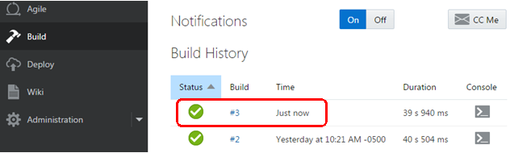

- Click **Deploy** on the navigation panel. Once the rebuild is complete, a redeploy will also automatically start. The panel will first show the deployment in process, and then will show that the **Last deployment succeeded**.

    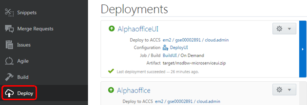

- If the arrow is not green but is orange and pointed down , this means the application has not been started.

- To manually start, stop or redeploy the application in Oracle Application Container Cloud Service, go to the gear dropdown icon for the application, and select the appropriate action.

    

## Test the Edited Code, and Designate the Edits and Merge Have Been Completed

### **STEP 19**: Test the Completed Code

- Click **Code** on the navigation panel.

     

- Right click on the application name **AlphaofficeUI**, and choose **Copy link address** in the dropdown. This is the URL for the application in the Application Container Cloud Service.

    

- Paste this URL into the address bar of any browser (such as on your personal workstation), and then navigate to the UI application in the Oracle Application Container Cloud Service. Note that all data from the microservices is now displayed. The application is fully operational.

    

### **STEP 20**: Designate the Edits are Complete

- Again assume the persona of Lisa, the project manager. As Lisa you will verify that the UI code has been completed. Click **Agile** on the navigation panel.

    

- Drag the Feature 6 panel from **In Progress** to the **Completed** column.

    

- Leave the default values and click **Next**.

    

- Set the **Time Spent** value to 1 day and click **OK**.

    

- The UI edits have been completed and merged, and the Agile board has been updated. You have successfully completed Lab 400!

    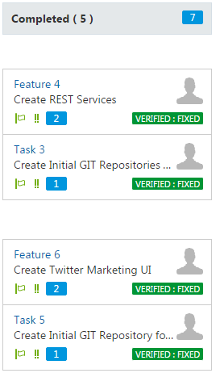

