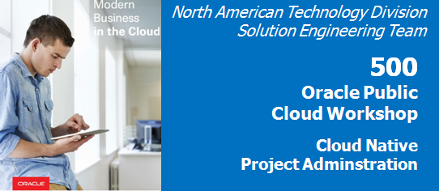  

Update: April 30, 2017

# Introduction

This is the fifth and final lab for the **Oracle Public Cloud DevOps Cloud Native Microservices Workshop**. This workshop walks you through the Software Development Lifecycle (SDLC) for a Cloud Native project that will create and use several microservices.

In this brief final lab, you will assume the persona of Lisa Jones, the project manager. You will complete all the final processes necessary to publish the completed microservices application, and you will make all the final updates on the Agile board. Lastly you will review several administrative screens relevant to the project.

**Please direct comments to: John Hennen ([john.hennen@oracle.com](mailto:john.hennen@oracle.com)).**

## Objectives

- Access the Oracle Developer Cloud Service
- Follow the Git methodology for source code control
- Follow the Agile methodology for project management
- Access additional administrative features of Oracle Developer Cloud Service

## Required Artifacts

- The following lab requires an Oracle Public Cloud account that will be supplied by your instructor. This lab will exclusively involve the Oracle Developer Cloud Service. 

# Complete all Technical Tasks Necessary to Publish the Project

## Merge Code Edits for the UI Application

### **STEP 1**: Perform the Merge as Lisa the Project Manager

- This Lab assumes that you completed Labs 100, 200, 300 and 400. It also assumes you and are still connected to the Oracle Cloud, that you're still in the Developer Cloud Service Dashboard, and that you're viewing the "Alphaoffice Marketing Project". If for some reason that is not the case, follow the first several steps of Lab 100 to once again view the Developer Cloud Service Console.

    

- In this lab you will assume the persona of ***Lisa Jones***, the project manager.

    

- Click **Merge Request** on the navigation panel.

    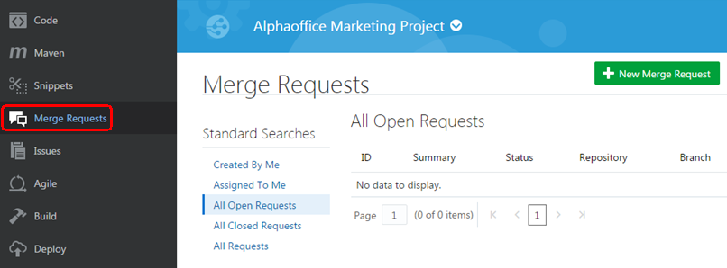

- Click the **Assigned To Me** button. Then click the merge request recently submitted by John Dunbar.

    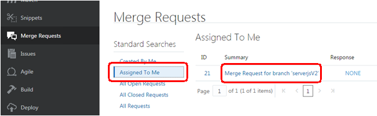

- Click on the **Changed Files** tab to review the changed code, and note how the changes reflect the edits John Dunbar made in the Brackets code editor on the client workstation. Because you are the project manager and have access privileges and responsibilities above those of developers such as Bala Gupta and John Dunbar, you are the one who must initiate the merge. Approve and process the merge by clicking the **Merge** button.

    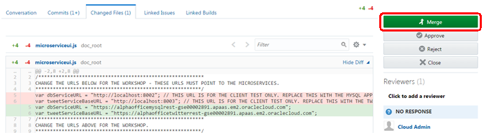

- On the popup uncheck **Squash commits** and click **Merge**.

    

- Click **Build** on the navigation panel. Processing the merge automatically initiates a rebuild process. Note how the **BuildUI** job has been placed in the queue.

    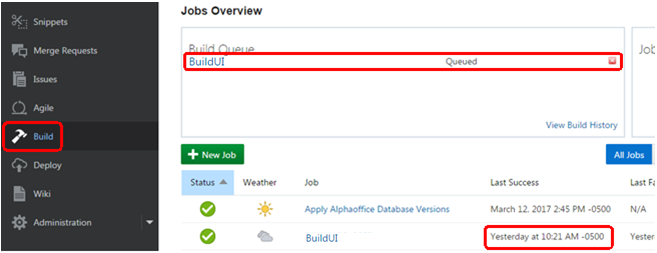

- The rebuild begins.

    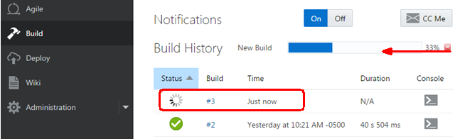

- The rebuild has successfully completed.

    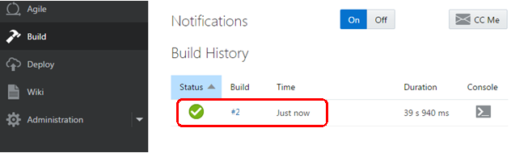

- Click **Deploy** on the navigation panel. Once the rebuild is complete, a redeploy will also automatically start. The panel will first show the deployment in process, and then will show that the **Last deployment succeeded**.

    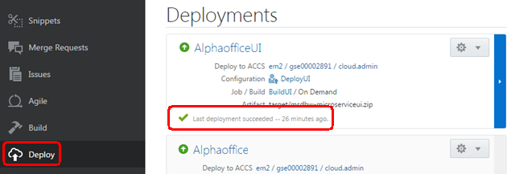

- If the arrow is not green but is orange and pointed down , this means the application has not been started.

- To manually start, stop or redeploy the application in Oracle Application Container Cloud Service, go to the gear dropdown icon for the application, and select the appropriate action.

- ***If you must manually redeploy, make sure you deploy the latest build with the latest build number.***

    

## Test the Edited Code, and Designate the Edits and Merge Have Been Completed

### **STEP 2**: Test the Completed Code

- Click **Deploy** on the navigation panel.

     

- Right click on the application name **AlphaofficeUI**, and choose **Copy link address** in the dropdown. This is the URL for the application in the Application Container Cloud Service. It is the URL you would publish to users of the application.

    

- Paste this URL into the address bar of any browser (such as on your personal workstation), and then press **Enter** to navigate to the UI application in the Oracle Application Container Cloud Service. Note that all data from the MySQL microservice is now displayed.

    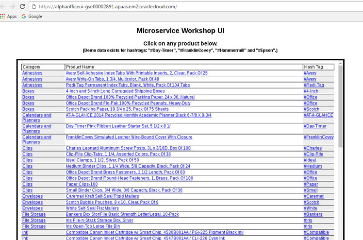

- The first page shows products from the MySQL database and the MySQLREST microservice. Click on the **#FranklinCovey** hashtag, and the application will display a second page with data from the Twitter feed and the TwitterREST microservice. The application is fully operational.

    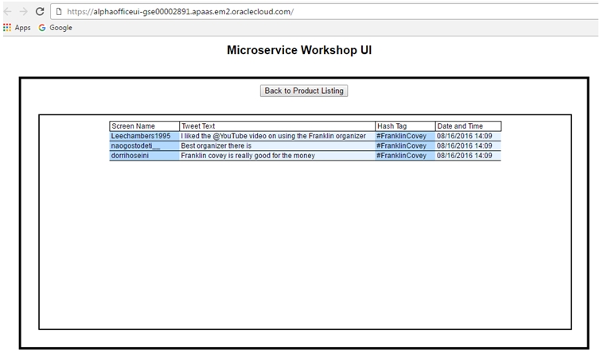

### **STEP 3**: Designate the Edits are Complete

- As Lisa the project manager, you are the one who must verify that the UI code has been completed. Click **Agile** on the navigation panel.

    

- Drag the Feature 6 panel from **In Progress** to the **Completed** column.

    

- Leave the default values and click **Next**.

    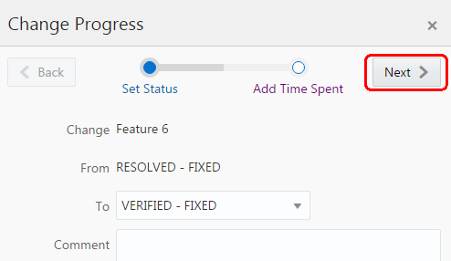

- Set the **Time Spent** value to 1 day and click **OK**.

    

- The UI edits have been completed and merged, and you have made the final updates to the Agile board. 

    

## Designate the Sprints are Completed, and Review Final Sprint Reports

### **STEP 4**: Complete the Sprints and Review Final Reports

- Since you have performed all updates to the Agile board for these sprints, it's time to move these sprints from active to completed. In the Agile Active Sprints screen, Click on **Complete Sprint**.

    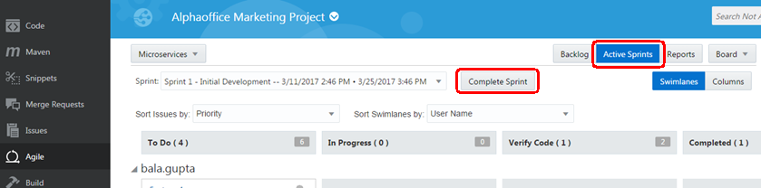

- Confirm by clicking **Complete Sprint**.

    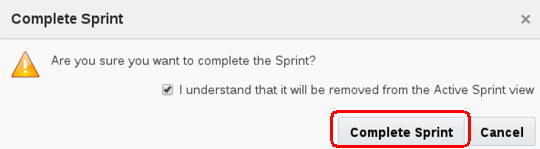

- Now Click on the **Reports** button and the **Burndown Chart** tab to review the Burndown Report by Story Points. Note: normally it would take several days to complete this project, and the report would provide information about the Burndown Rate per Day.

    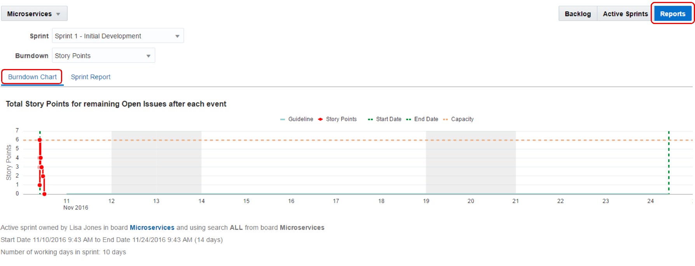

- Click on the **Sprint Report** tab. In this lab, the results will be skewed because this sprint was completed in a single day. However, the dotted line shows the starting point, and the red line shows the current remaining points. Normally this would step down towards the end of the sprint.

    

# Project Administrative Features

### **STEP 5**: Review the Administration Screens

- Click **Administration** on the navigation panel to view the available administrative options.

    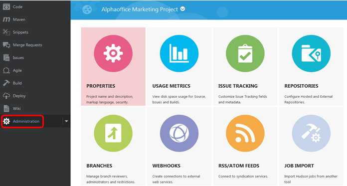

- Expand the dropdown on the **Administration** menu item on the navigation panel. Then click **Properties**. Here you see a number of settings for the project. Note this is also where you would delete projects in Oracle Developer Cloud Service.

    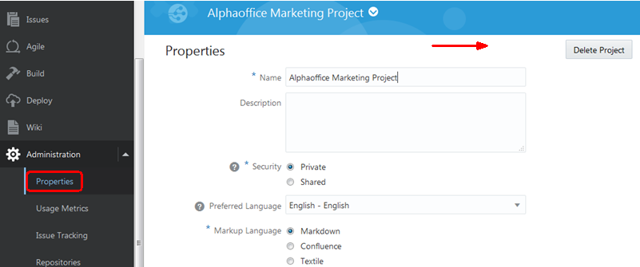

- Click on **Usage Metrics** in the dropdown. This is where you would see storage space utilization and storage availability metrics.

    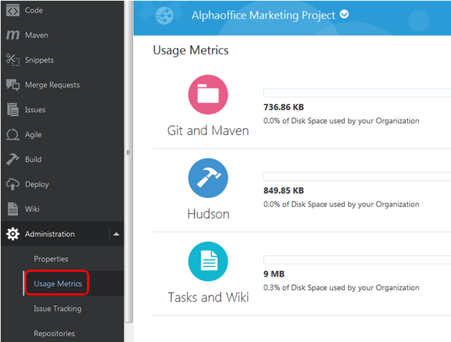

- Click on **Issues Tracking** in the dropdown. As you see here, this provides a subsystem to track and publish known issues within the various releases of your applications. It also provides functionality to list all components available within your applications.

    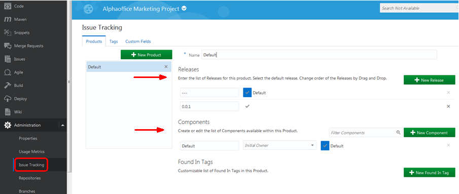

- Click on **Repositories** in the dropdown. Here you have a listing of all repositories in use, including external repositories.

    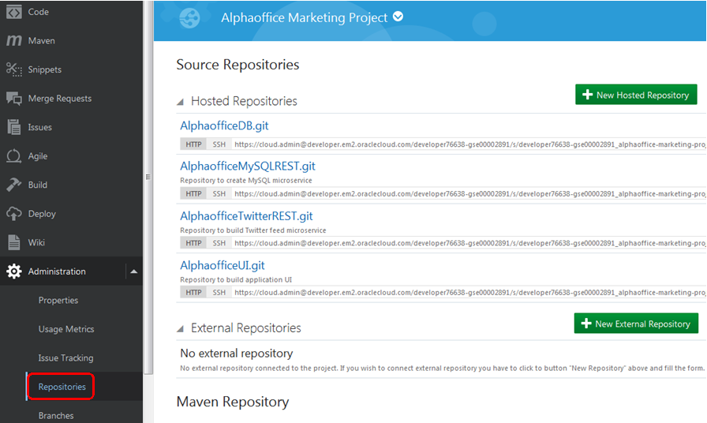

- Lastly, click on **Branches** in the dropdown. The **Branches** screen shows all branches for all repositories. It includes a listing by user.

    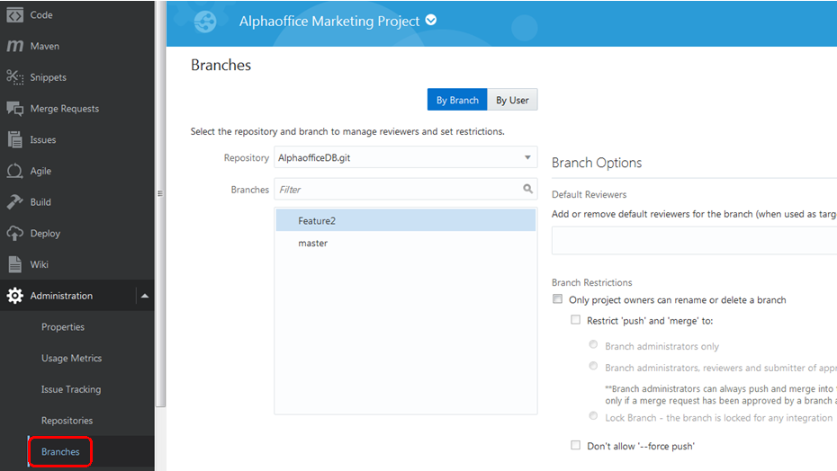

With this you have completed Lab 500 and the workshop! 
