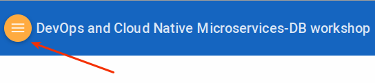

## IMPORTANT: How to prepare for this Workshop

**First**, ***Get an Oracle Cloud Account*** 
- Oracle provides several methods for gaining access to Oracle Cloud Accounts used to complete the Labs in this Hands-on-Workshop. 
- For some workshop events, cloud environments will be provided. 
- For others events (e.g. **Oracle Code**), or when completing this workshop in a self-service model, you must gain access to your own Trial account. Trial accounts can be obtained at [Try It](http://cloud.oracle.com/tryit) 
- If you are attending an Oracle sponsored event, please **review your Event invitation** for more instruction on how to gain access to your Workshop Account.

**Second**, ***How to View the Lab Guides***

- The Labguides are best viewed using the Workshop's [GitHub Pages Website URL](https://oracle.github.io/cloud-native-devops-workshop/db-devops/) 

- Once you are viewing the Workshop's GitHub Pages website, you can see a list of Lab Guides at any time by clicking on the **Menu Icon**

      

- To log issues and view the Lab Guide source, go to the [github oracle](https://github.com/oracle/cloud-native-devops-workshop/tree/master/db-devops) repository.

- Visit the [Workshop Interactive Labguide](http://launch.oracle.com/?cloudnativeDB) for a visual overview of the workshop content. 

**Third**, ***Cloud Accelerate for the Developer***

This Cloud Native Microservices Workshop is part of a **Free** Sales Program that Oracle offers. The Program is called **Cloud Accelerate for the Developer**. During this program Oracle can work with you to do the following:

- Understand your Development Interests and Capabilities
- Build your personalized Enablement Plan, including Hands-on Technical Enablement.
- Help you Exercise your acquired knowledges. 
- If you are interested, simply [Click on this Link](https://launch.oracle.com/?developeraccelerate), and provide us with your contact information. 

## DevOps and Cloud Native Microservices Workshop

The Oracle Public Cloud Cloud Native Microservices workshop is a one day workshop focused on DevOps in the Oracle Public Cloud. This workshop will walk you through the Software Development Lifecycle (SDLC) for a Cloud Native project that will create and use several Microservices. You will take on 4 Personas during the workshop. The Project Manager Persona will create the projects, add tasks and features to be worked on, and assign tasks to developers. The Project Manager will then start the initial sprint. The MySQL Database Developer persona will create a test and development database copy, and then update the database schema. The Java Developer persona will develop new REST services that will allow for access to twitter and MySQL data. The JavaScript Developer persona will develop a new Alphaoffice Marketing UI that will display the twitter data to allow for analysis. During the workshop, you will get exposure to Oracle Developer Cloud Service and Oracle Application Container Cloud Service.

## Workshop Details

**Reference the following Lab Guides by opening their Documentation Files:**

## Lab 100: Agile Project Management

**Documentation**: [CloudNative100.md](CloudNative100.md)

### Objectives

- Create Initial Project
- Add Users to Project
- Create Product Issues
- Create Issues for database updates, REST service development, and Marketing UI development
- Create Agile Board and initial Sprint
- Add Issues to Sprint

## Lab 200: Agile Database Development

**Documentation**: [CloudNative200.md](CloudNative200.md)

### Objectives

- Access Developer Cloud Service
- Import code from external Git Repository
- Initialize a new test MySQL Database
- Apply schema and data updates to a local MySQL database
- Deploy updates to the test MySQL Database

## Lab 300: Create REST Services to Access Twitter and Alphaoffice Data

**Documentation**: [CloudNative300.md](CloudNative300.md)

### Objectives

- Access Developer Cloud Service
- Import Code from external Git Repository
- Import Project into Brackets
- Build and Deploy project using Developer Cloud Service and Oracle Application Container Cloud Service

## Lab 400: Create Marketing Application to View Alphaoffice and Twitter Data

**Documentation**: [CloudNative400.md](CloudNative400.md)

### Objectives

- Access Developer Cloud Service
- Import Code from external Git Repository
- Import Project into Brackets
- Build and Deploy project using Developer Cloud Service and Oracle Application Container Cloud Service

## Lab 500: Cloud Native Developer Cloud Service Administration

**Documentation**: [CloudNative500.md](CloudNative500.md)

### Objectives

- Access the Oracle Developer Cloud Service
- Follow the Git methodology for source code control
- Follow the Agile methodology for project management
- Access additional administrative features of Oracle Developer Cloud Service