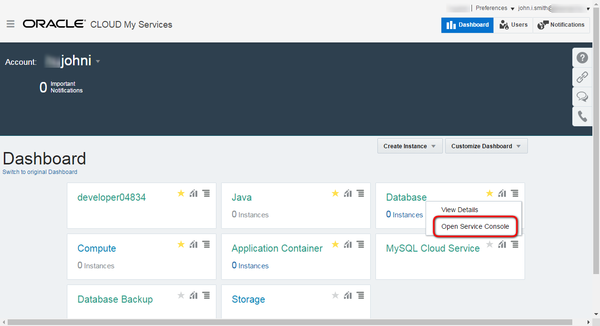
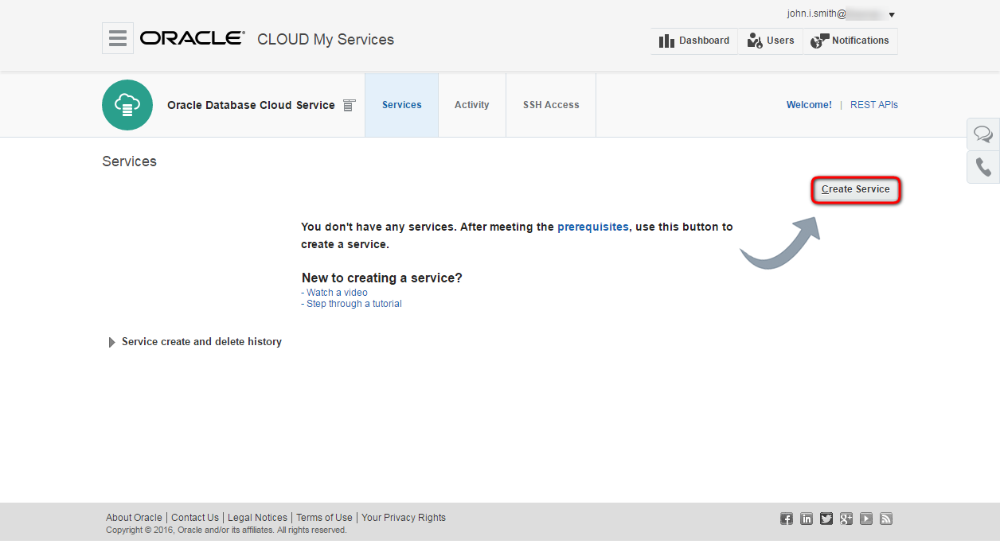
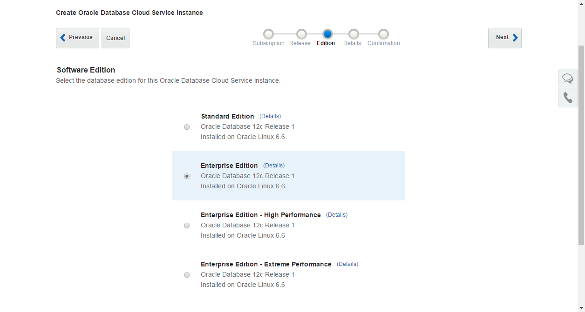
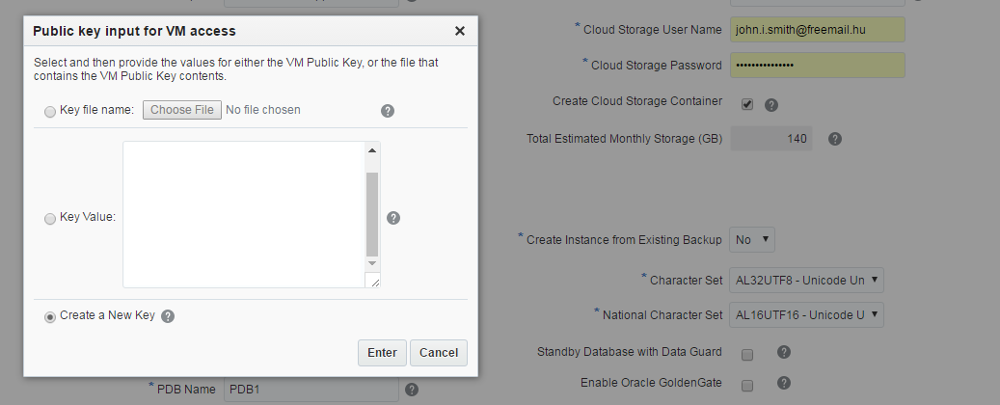
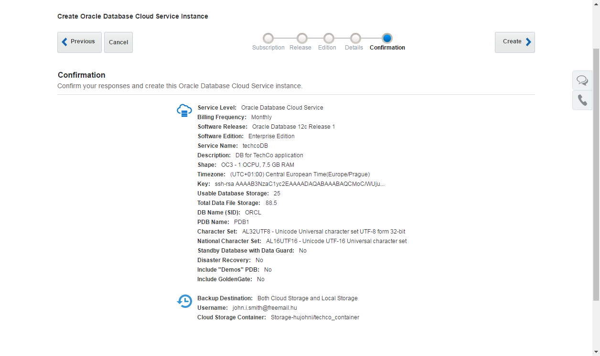
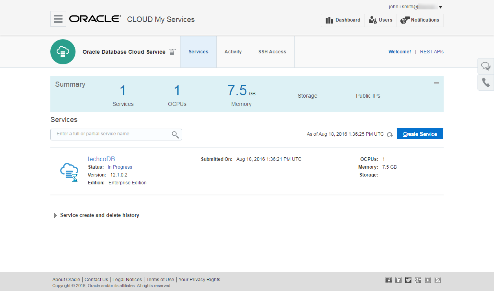

---
# ORACLE Cloud-Native DevOps workshop #
-----
## Create Database Cloud Service instance using user interface ##

### Introduction ###

Oracle Database Cloud Service provides you the ability to deploy Oracle databases in the Cloud, with each database deployment containing a single Oracle database. You have full access to the features and operations available with Oracle Database, but with Oracle providing the computing power, physical storage and (optionally) tooling to simplify routine database maintenance and management operations.

When you create database deployments, Database Cloud Service creates compute nodes to host the database, using computing and storage resources provided by Oracle Compute Cloud Service. Additionally, it provides access to the compute nodes (and thus to the database) using networking resources provided by Oracle Compute Cloud Service.

### About this tutorial ###
This tutorial demonstrates how to:
	
+ create Database Cloud Service using the user interface.

### Prerequisites ###

- Oracle Public Cloud Service account including Database and Storage Cloud Service

### Steps ###

[Sign in](../common/sign.in.to.oracle.cloud.md) to [https://cloud.oracle.com/sign-in](https://cloud.oracle.com/sign-in). First select your datacenter then provide the identity domain and credentials. After a successful login you will see your Dashboard. On the dashboard click the hamburger icon on the Database tile. Select **Open Service Console**.

This is the Database Cloud Service Console page. To create new instance click **Create Service** button.

Select subscription type. Select the fully managed Oracle Database Cloud Service and the desired billing format. For more details about subscription types see the [documentation](https://docs.oracle.com/cloud/latest/dbcs_dbaas/CSDBI/GUID-F1E6807A-D283-4170-AB2B-9D43CD8DCD92.htm#CSDBI3395).

Select the latest 12c Software Release.

When creating a database deployment Oracle Database Cloud Service, the following Oracle Database editions are available:

Select Enterprise Edition.

The last input page is the Service Details page. The following parameters have to be provided:
	
+ **Service Name**: the name of the service instance e.g. techcoDB.
+ **Description**: any description for your service.
+ **Shape**: number of OCPU and size of the RAM. Choose the smallest (default) one.
+ **Timezone**: set your timezone.
+ **SSH Public Key**: public key which will be uploaded to the VM during the creation. It allows to connect to the VM through ssh connection using the private key. To avoid additional task to create keypairs select Create a New Key option and download the newly generated keypair for later usage. Download the zip file to your `GIT_REPO_LOCAL_CLONE/cloud-utils` folder and unzip for later usage.
 
Open a terminal and change to folder `/GIT_REPO_LOCAL_CLONE/cloud-utils`. Unzip the file which contains the private and public keys. Most likely its (default) name is *sshkeybundle.zip*.

		$ [oracle@localhost Desktop]$ cd /GIT_REPO_LOCAL_CLONE/cloud-utils
		$ [oracle@localhost cloud-utils]$ unzip sshkeybundle.zip
		Archive:  sshkeybundle.zip
		  inflating: privateKey              
		  inflating: publicKey
Before using privateKey it is required to change the mode of the file to rw by owner only.

		$ [oracle@localhost cloud-utils]$  chmod 600 privateKey

+ **Administrator Password**: database instance's system password. Don't forget to note the provided password.
+ **DB Name (SID)**: container database service identifier.
+ **PDB Name**: pluggable database service identifier. You can leave the default PDB1
+ **Backup Destination**: Leave default; Both Cloud and Local Storage
+ **Cloud Storage Container**: the name of the container for database instance. The format is the following: Storage-IDENTITYDOMAIN/CONTAINERNAME. Replace the identitydomain value according to your environment and specify a container name. Container name is up to you. The container don't need to be created in advance, because -see below- there is an option to create automatically.
+ **Cloud Storage User Name and Password**: the credentials for storage. Usually it is the same what was used to sign in to Oracle Cloud Services.
+ **Create Cloud Storage Containers**: check in because the container does not exist what you specified above.
+ **Character Set**: The database character set for the database. Leave default.
+ **National Character Set**: The national character set is used for data stored in SQL NCHAR data types. Leave default.

For more details about parameters see the [documentation](https://docs.oracle.com/cloud/latest/dbcs_dbaas/CSDBI/GUID-D4A35763-53ED-4FBB-97BF-0366F21B05E0.htm#CSDBI3401). Click **Next**.

The final page is the summary about the configuration before submit the instance creation request. Click **Create** to start the provisioning of the new service instance.

When the request has been accepted the Database Service Console page appears and shows the new instance. The instance now is in Maintenance (Progress) mode. Click on In Progress to get more information about the status.

