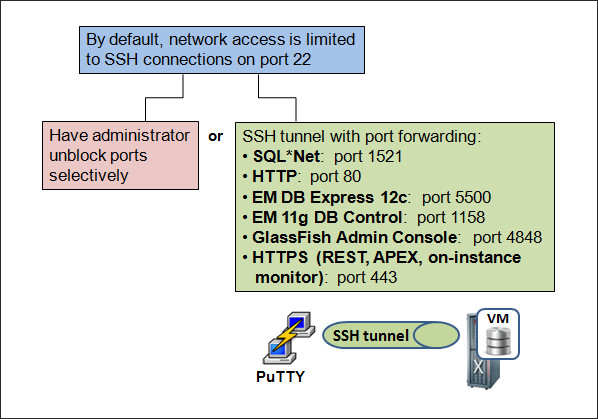
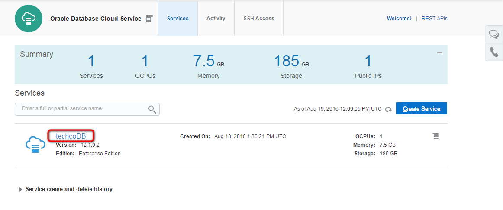
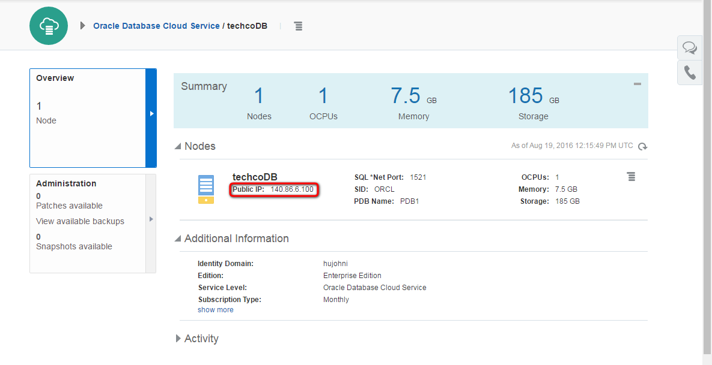

---
# ORACLE Cloud-Native DevOps workshop #
----
## Prepare Database Cloud Service for TechCo (Java EE) Demo Application ##

### Introduction ###
Oracle Database Cloud Service provides you the ability to deploy Oracle databases in the Cloud, with each database deployment containing a single Oracle database. You have full access to the features and operations available with Oracle Database, but with Oracle providing the computing power, physical storage and (optionally) tooling to simplify routine database maintenance and management operations.

When you create database deployments, Database Cloud Service creates compute nodes to host the database, using computing and storage resources provided by Oracle Compute Cloud Service. Additionally, it provides access to the compute nodes (and thus to the database) using networking resources provided by Oracle Compute Cloud Service.

When a DBaaS database instance is created, network access to the instance is limited to Secure Shell (SSH) connections on port 22. This access restriction ensures that the instance is secure by default.

### About this tutorial ###
This tutorial demonstrates how to:
	
+ connect to Database Cloud Service's VM using ssh,
+ execute SQL script to prepare database service for application

### Prerequisites ###

- [Running Database Cloud Service](../dbcs-create/README.md) instance to prepare.
- The IP address of a compute node associated with a database deployment on Database Cloud Service. The Public IP address is listed on the Database Cloud Service Overview page.
- The SSH private key file that matches the public key associated with the deployment.

### Steps ###
[Sign in](../common/sign.in.to.oracle.cloud.md) to [https://cloud.oracle.com/sign-in](https://cloud.oracle.com/sign-in). On the dashboard open the Database Cloud Service Console.

Click on the service instance what will be the database for the sample application.

Note the public IP address of the compute node hosting database service instance.

If you have not unzipped the public and private keys generated by Oracle Cloud during service creation then open a terminal otherwise skip the *unzip* and *chmod* steps. Change to folder `GIT_REPO_LOCAL_CLONE/cloud-utils` where the keypair was saved during [Database Cloud Service creation](../dbcs-create/README.md). Unzip the file which contains the private and public keys. Most likely its (default) name is `sshkeybundle.zip`.

    $ [oracle@localhost Desktop]$ cd /u01/content/cloud-native-devops-workshop/cloud-utils
    $ [oracle@localhost cloud-utils]$ unzip sshkeybundle.zip
    Archive:  sshkeybundle.zip
      inflating: privateKey              
      inflating: publicKey     
Before using privateKey it is required to change the mode of the file to rw by owner only.

    $ [oracle@localhost cloud-utils]$  chmod 600 privateKey

Now change to `/GIT_REPO_LOCAL_CLONE/techco-app` folder. In the same terminal change the directory.

    $ [oracle@localhost cloud-utils]$  cd ../techco-app
You will need to create an OE user in your DBCS PDB. This user will need rights to create and drop schema. Once the user is created the script create and populate the tables.

Use the `init-dbcs-pdb.sh` script to automate the creation of the user, tables and data. Usage is the following:

    usage: ./init-dbcs-pdb.sh <db user> <db password> <ssh key file> <db server ip> [<PDB name>]
`<db user>` should be `system`.  `<ssh key file>` the privateKey what is (based on our example) extracted to `/GIT_REPO_LOCAL_CLONE/cloud-utils` folder.  `<db server ip>` the public IP address was determined in the steps above. `<PDB name>` is likely 'PDB1' and the script will default to this value if it is not given however you may override.

    [oracle@localhost techco-app]$ ./init-dbcs-pdb.sh system syspassword ../cloud-utils/privateKey 140.86.6.100 PDB1
	The authenticity of host '140.86.6.165 (140.86.6.100)' can't be established.
	RSA key fingerprint is 75:e0:29:8a:9f:8a:98:5d:5d:2e:5a:70:01:5a:08:55.
	Are you sure you want to continue connecting (yes/no)? yes
	Warning: Permanently added '140.86.6.100' (RSA) to the list of known hosts.
	create_user.sh                                                                                100%  242     0.2KB/s   00:00    
	create_user.sql                                                                               100%   73     0.1KB/s   00:00    
	oe-min-drop-create.sh                                                                         100%  249     0.2KB/s   00:00    
	oe-min-drop-create.sql                                                                        100%  246KB 245.6KB/s   00:00    

    SQL*Plus: Release 12.1.0.2.0 Production on Fri Aug 19 14:02:30 2016

    Copyright (c) 1982, 2014, Oracle.  All rights reserved.

    Last Successful login time: Fri Aug 19 2016 13:28:58 +02:00

    Connected to:
    Oracle Database 12c Enterprise Edition Release 12.1.0.2.0 - 64bit Production

    SQL> DROP USER oe
    *
    ERROR at line 1:
    ORA-01922: CASCADE must be specified to drop 'OE'
    ...
	...
	...
	SQL> 
	1 row created.

	SQL> SQL> 
	Commit complete.

	SQL> Disconnected from Oracle Database 12c Enterprise Edition Release 12.1.0.2.0 - 64bit Production	

Now the database service is ready for the TechCo sample application.