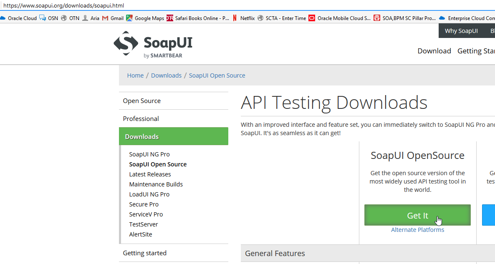

  

Update: March 30, 2017

# Installing 3rd Party Testing Tools

## SoapUI

We will use SoapUI to test an ICS Soap Web Service integration.

If you don't already have SoapUI installed on your workstation, you'll need to install it.

To install SoapUI for testing the ICS integration follow these instructions:

1. Download the SoapUI OpenSource application for your desktop/laptop from the URL: https://www.soapui.org/downloads/soapui.html

2. Save the download file to a temporary directory on your workstation.

3. Run the installer from the temporary directory

4. Install SoapUI on your workstation following the directions provided by SmartBear here: https://www.soapui.org/getting-started/installing-soapui.html 

---

# Supported Browsers

Most modern browsers including Chrome, Safari, Internet Explorer, Edge and Firefox are supported.

