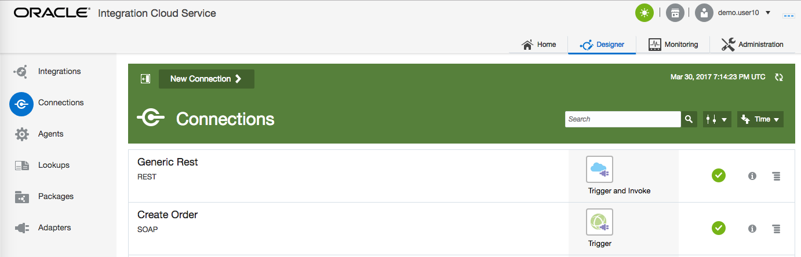
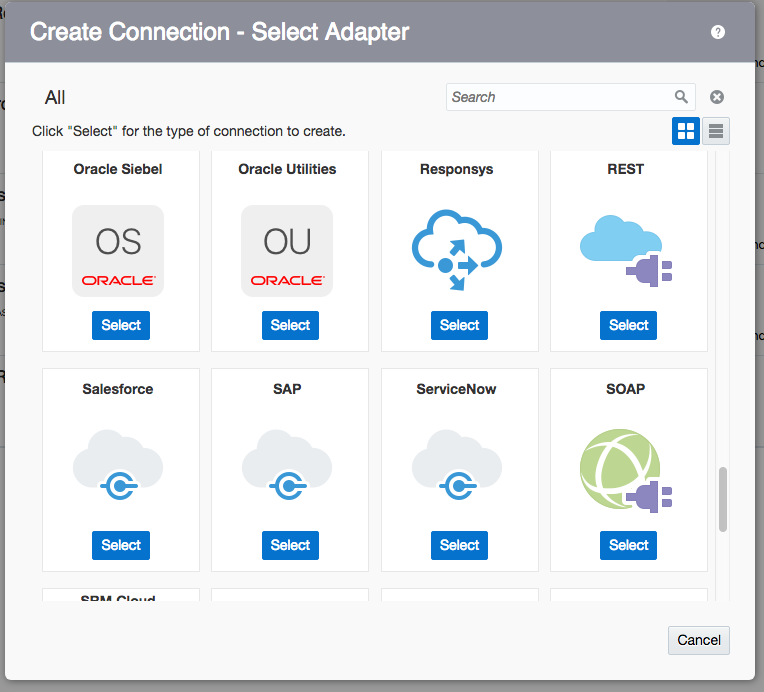
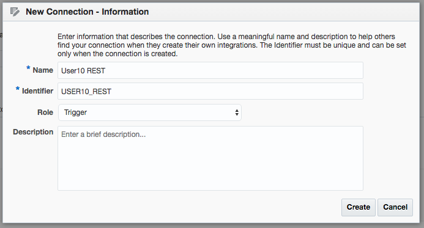
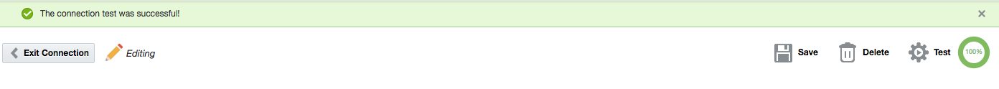
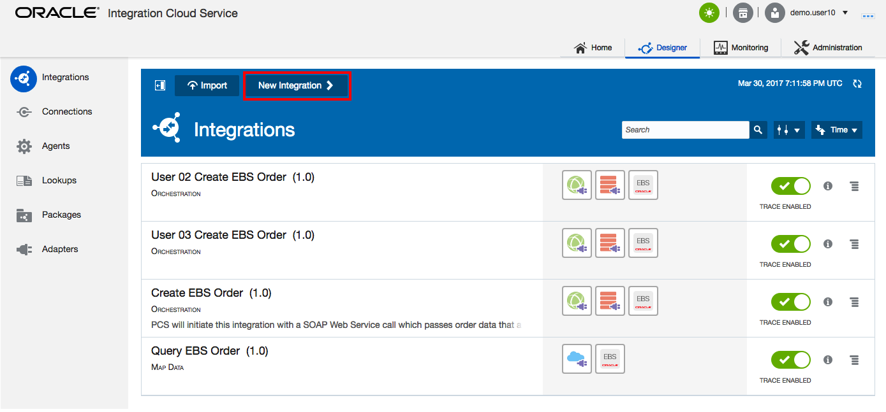
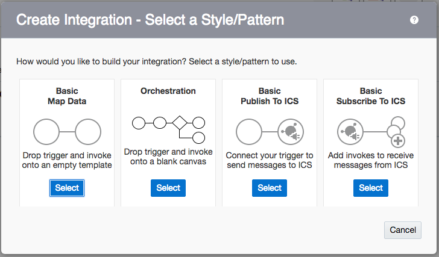
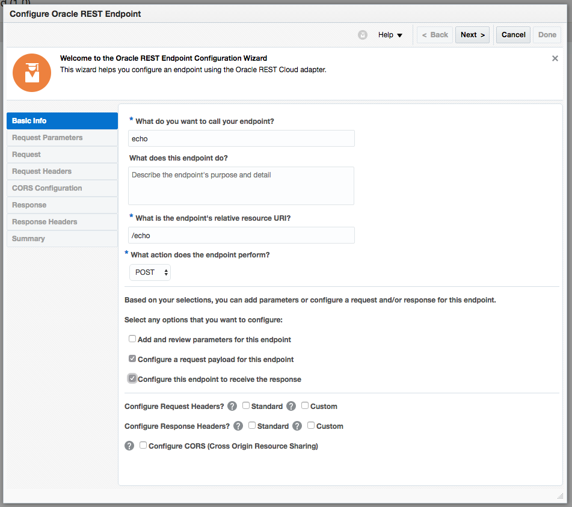

  

Update: March 23, 2017

# Lab 200 - Integration Cloud Service

---

## Introduction

This is the second of several labs that are part of the **ICS Deep dive** workshop. 

In this lab, you will learn how to create a basic 'hello world' echo service. 

Please direct comments to: John VanSant (john.vansant@oracle.com)

## Objectives

- Create your first mapping 

## Required Artifacts

- The following lab and an Oracle Public Cloud account that will be supplied by your instructor.

# Part 1: Create a REST Connection

In this first part of the lab, we will create a connection :

Let’s start by logging into the Oracle Cloud account using your allocated user (demo.user1..10)  

**NOTE:** All the screenshots uses the _demo.user10_ account. 

## Creating Connection

### **STEP 1**: Login to your Oracle Cloud account

---

    ***NOTE:*** the **User Name and Password** values will be given to you by your instructor.

  

- You will be presented with the ICS home page. 

### **STEP 2:**	Create a Connection

---

**2.1** Click on the **Connection** section

 

**2.2** Click on **New Connection**

 

**2.3** Select the **REST** Connection, by either doing a search, or by scrolling down to the **REST** connection, by clicking on the **Select** button of the **REST** connection.

**2.4** Fill in the information for the new connection 

- **Name** in the form of _UserXX REST_ where XX is the number in your allocated user.
- **Role** _Trigger_ since we going to use the connection as a trigger to start the integration

 

**2.7** click **Create**

 

>**Note** The default security configuration is set to **Basic Authentication**, which >by the way, is the only option available for REST trigger connections. When invoking >the trigger, we will use our ICS username/password. 

**2.6** Click on **Test** 

**2.7** Click **Save** 

 

**2.8** Click on **Exit Connection**

- Your first connection appears in the list of configured connections and is even marked as **New** !

 

**2.9** Click on the Home tab to get back to the Home page

 

### **STEP 3:**	Create an Integration

---

**3.1** Click on the **Integrations** section on the ICS home page

 

**3.2** Click on **New Integration** 

 

**3.3** In the **Create Integration - Select a Style/Pattern** popup, select the **Orchestration**

**3.4** Fill in the form with the following information

- _What triggers this integration?_ **Application event or business object**
- _Name_ **UserXX Hello World**

 

**3.5** Click on **Create**

**3.6** In the **Trggers** panel, find your connection, under **REST**

Drag anddrop your connection **UserXX REST** in to the circle with plus sign, you will see the plus sign twirling when ready to drop 
 

**3.7** Fill in the required values on **Basic Info** page, and click **Next >**

- **What do you want to call your endpoint?** _echo_
- **What is the endpoint's relative resource URI** _//echo_
- **What action does the endpoint perform?** _POST_
- **Configure a request payload for this endpoint** _Checked_
- **Configure for this endpoint to receive a response** _Checked_
- **Configure CORS (Cross Origin Resource Sharing)** _Checked_

- Now you can see your connection in the configured connection list

- This Lab is now completed.

