  

Update: March 30, 2017

# Lab 300 - Create an ICS Integration using a Database Adapter

---

## Introduction

This is the third of several labs that are part of the **ICS Development** workshop. 

In this lab, you develop an integration in ICS using a database adapter to query the Oracle EBS database.

In the previous lab, a REST connection was created.  In a similar manner we need to create the connections necessary for the integration in this lab which are for the inbound SOAP web service as well as the EBS Database.

The ICS integration that we'll be building is shown in the following picture:

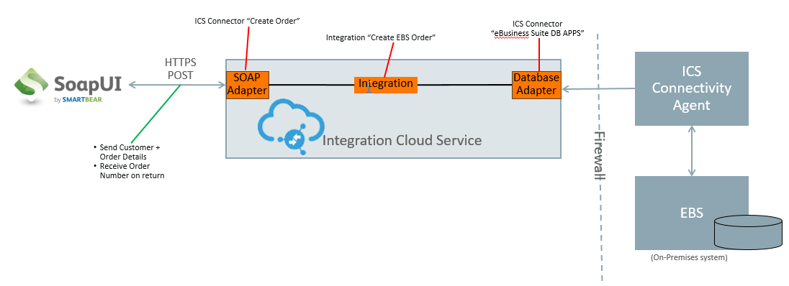

Here is a description of what is happening with this integration:

SoapUI will be used to test the exposed Web Service endpoint of the ICS integration called *UserXX Create EBS Order* (where XX will be 00 -> 10).  This integration has 3 connections.  The incoming message is received by the incoming *UserXX SOAP* Soap Connection.  The *UserXX Create EBS Order* orchestration makes 2 queries into the EBS database using the *UserXX EBS DB APPS* connection to get details needed to create an order.  The orchestration finally uses the *UserXX EBS OPERATIONS* EBS Adapter connection for creating the order in EBS.  After the order is created in EBS, the Order Number is returned to the calling web service.

## Objectives

- Learn how to create ICS SOAP and Database Adapter Connections
- Learn how to create an ICS Orchestration using the ICS Adapters
- Learn how to test the ICS integration using SoapUI

## Required Artifacts

- The following lab and an Oracle Public Cloud account that will be supplied by your instructor.
- SoapUI will need to be installed for ICS integration testing - see "Prerequisites" section of the workshop for details

## Part 1: Create the ICS Connections

### **1.1**: Login to your Oracle Cloud account

---

**1.1.1** From your browser (Firefox or Chrome recommended) go to the following URL:
<https://cloud.oracle.com>

**1.1.2** Click Sign In in the upper right hand corner of the browser
**IMPORTANT** - Under My Services, change Data Center to `US Commercial 2 (us2)` and click on Sign In to My Services

**1.1.3** If your identity domain is not already set, enter it and click **Go**

**NOTE:** the **Identity Domain** values will be given to you from your instructor.

  

**1.1.4** Once your Identity Domain is set, enter your `User Name` and `Password` and click **Sign In**

***NOTE:*** the **User Name and Password** values will be given to you by your instructor.

  

**1.1.5** You will be presented with a Dashboard displaying the various cloud services available to this account.

**NOTE:** The Cloud Services dashboard is intended to be used by the *Cloud Administrator* user role.  The Cloud Administrator is responsible for adding users, service instances, and monitoring usage of the Oracle cloud service account.  Developers and Operations roles will go directly to the service console link, not through the service dashboard.

**1.1.6**  To get to the Integration Cloud Service (ICS) service console where you will work on developing the integration, click on the `hamburger` icon, then click on the `View Details` link.

**1.1.7**  Select the `Open Service Console` link to go to the ICS Service Console.  

  

**1.1.8**  You will now be presented with the ICS Service Console from which you will be performing the rest of this workshop lab.

  

### **1.2**: Create the SOAP Connector

---

**1.2.1** Select the `Connections` graphic in the designer portal

 

**1.2.2** Click on **New Connection**

 

**1.2.3** Select the **SOAP** Connection, by either doing a search, or by scrolling down to the **SOAP** connection, then click on the **Select** button of the **SOAP** connection.

**1.2.4** Fill in the information for the new connection 

- **Name:** Enter in the form of _UserXX SOAP_ where XX is the number in your allocated user.
- **Role:** Select _Trigger_ since we going to use the connection as a trigger to start the integration

Note that the **Identifier** will automatically be created based on the **Name** you entered.

**1.2.5** Click **Create**

 

**1.2.6** Click the **Configure Connectivity** button

 

**1.2.7** For the *WSDL URL*, select the *Upload File* checkbox, then the *Upload* button.

 

**1.2.8** Select the *Browse* button and browse to the file `createOrder.wsdl` which can be found in github relative to this lab here: [../artifacts/ics/createOrder.wsdl](../artifacts/ics/createOrder.wsdl) (Save that file to your local workstation so it can be uploaded)

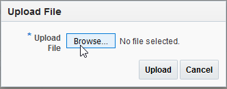 

**1.2.9** Select the "Upload" button

**1.2.10** In the field *Suppress insertion of timestamp into the re..." field, select *No*, then select the *OK* button.  This selection will disable the need for the WS-Utility (WSU) Timestamp in the WS-Security header.  When we test inbound requests with Basic Auth security policy, no timestamps will be required.

**1.2.11** Select the *Configure Security* button so we can change the default security configuration which is set to **Username Token**. 

**1.2.12** Select *Basic Authentication* from the picklist of _Security Policies_, then select the *OK* button.

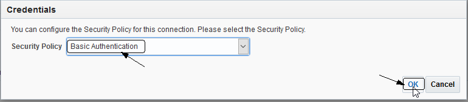

**1.2.13** At the top of the connection configuration screen, Click on the **Test** button to test the connection.

Note how the progress indicator will go from 75% to 100% after the connection tests successfully.

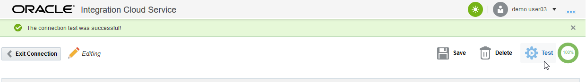 

**1.2.14** Click on the **Save** button in the upper right corner of the connection configuration screen.

 

**1.2.15** Click on the **Exit Connection** button in the upper right of the connection configuration screen.

Your new SOAP connection appears in the list of configured connections and is even marked as **New** !

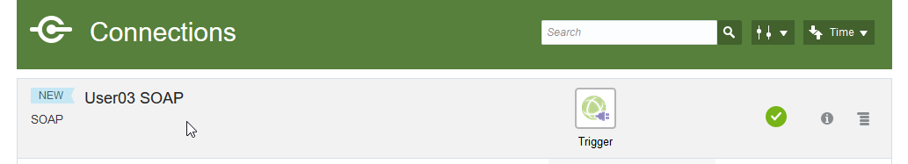 

### **1.3**: Create the Database Connector

---

**1.3.1** Select the `Connections` graphic in the designer portal

 

**1.3.2** Click on **New Connection** again

 

**1.3.3** Select the **Oracle Database** Connection, by either doing a search, or by scrolling down to the **Oracle Database** connection, then click on the **Select** button of the **Oracle Database** connection.

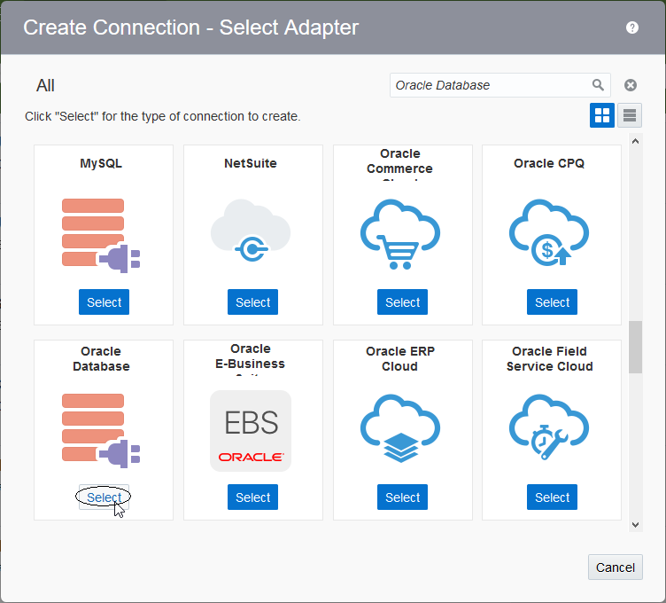

**1.3.4** Fill in the information for the new connection:

- **Name:** Enter in the form of _UserXX EBS DB APPS_ where XX is the number in your allocated user.
- **Role:** Select _Invoke_ since we going to call the connection as an invocation from the integration

Note that the **Identifier** will automatically be created based on the **Name** you entered.

**1.3.5** Click **Create**

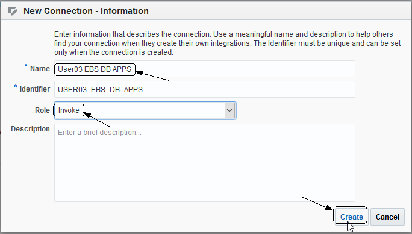 

**1.3.6** Click the **Configure Connectivity** button

 

**1.3.7** Enter the values given to you by your workshop instructor for the *Connection Properties*:

- **Host:** - `unit51102.oracleads.com` - this is only an example of an EBS hostname and may not be the EBS instance used in your workshop
- **Port:** - `1521` - this is the default database port for the EBS database
- **SID:** - `EBSSRV` - this is the Service ID for the sample EBS database we will be using
- **Service Name:** - leave this blank, you need either a SID, which we gave, or a Service Name but not both

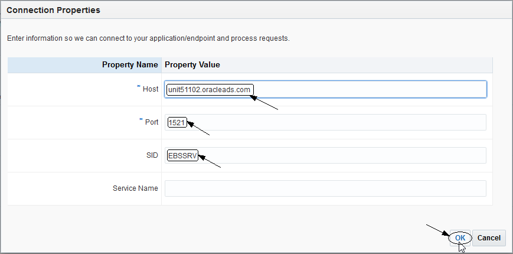 

**1.3.8** Next scroll down in the Connection Configuration page and select the **Configure Security** button.

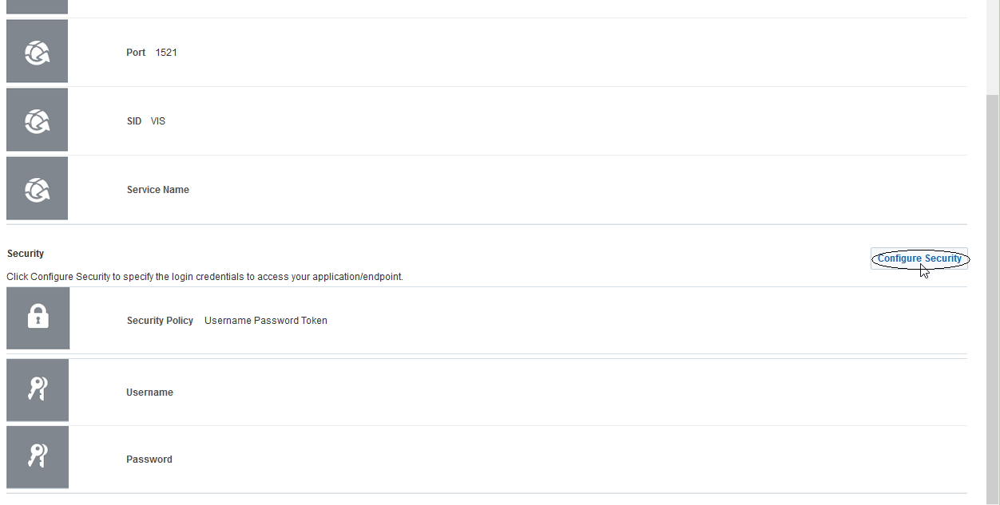 

**1.3.9** Enter the following Username and Password for the EBS adapter connection.

The following values are the default EBS DB schema username/password and may not be the one used in your workshop.  
Your workshop instructor will tell you if it needs to be changed.

- **Username:** - `apps` 
- **Password:** - `apps` 

**1.3.10** Click on the **OK** button to save the credentials.

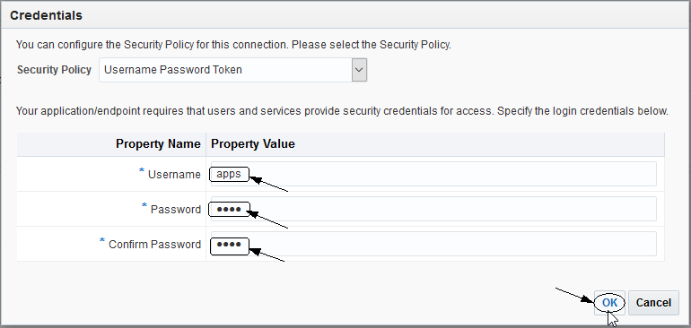

**1.3.11** Now, scroll down again in the Connection Configuration page and select the **Configure Agents** button.

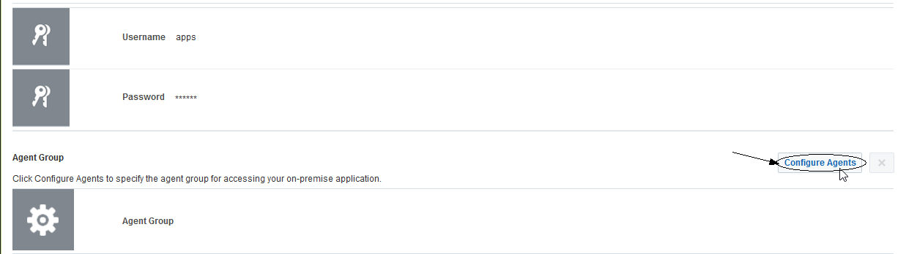

**1.3.12** Select the *EBS_AGENT_GROUP* which should be the only entry in the agent list by clicking the name, then select the **Use** button.

**1.2.12** At the top of the connection configuration screen, Click on the **Test** button to test the connection.

Note how the progress indicator will go from 85% to 100% after the connection tests successfully.

 

**1.2.13** Click on the **Save** button in the upper right corner of the connection configuration screen.

 

**1.2.14** Click on the **Exit Connection** button in the upper right of the connection configuration screen.

Your new Database connection appears in the list of configured connections and is even marked as **New** !

**Note** how the icon for the connection is different between the SOAP and Database connector.

 

## Part 2: Create the ICS Integration

---

### **2.1**: Create Orchestration Integration

**2.1.1** On the left-hand navigation of the Connections screen select the "Integrations" link

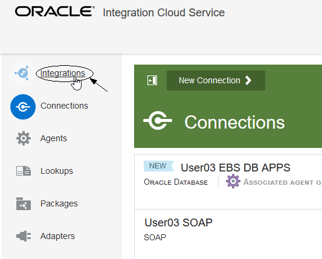

**2.1.2** Select the **New Integration** button in the top of the Integrations screen

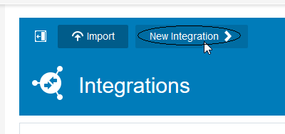

**2.1.3** In the **Create Integration - Select a Style/Pattern**, select the **Orchestration** style.  We want to use this because our integration will have two invocations to the EBS Database and later another invocation to the EBS API to create an order - the **Basic Map Data** style only has a single target service invocation as well as additional invocations for data enrichment of the payload before the target invocation call is made.

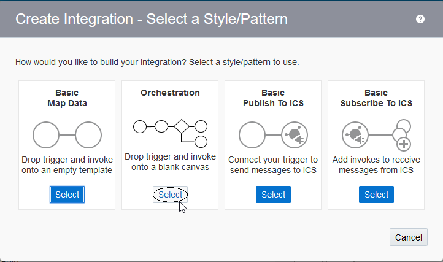

**2.1.4** Fill in the information for the new orchestration

- **What triggers this integration?** Select the radio button for `Application event or business object`.  Note that integrations can be scheduled to run at specific times if the `Schedule` trigger type is selected.
- **What do you want to call your integration?** Enter in the form of _UserXX Create EBS Order_ where XX is the number in your allocated user.
- **Identifier:** Accept the default - this value will be generated based on the name you enter.
- **Version:** Accept the default - if you want to clone and create newer versions later, you can change to a higher version than **01.00.0000** which is the default.

After you've filled in the information, select the **Create** button

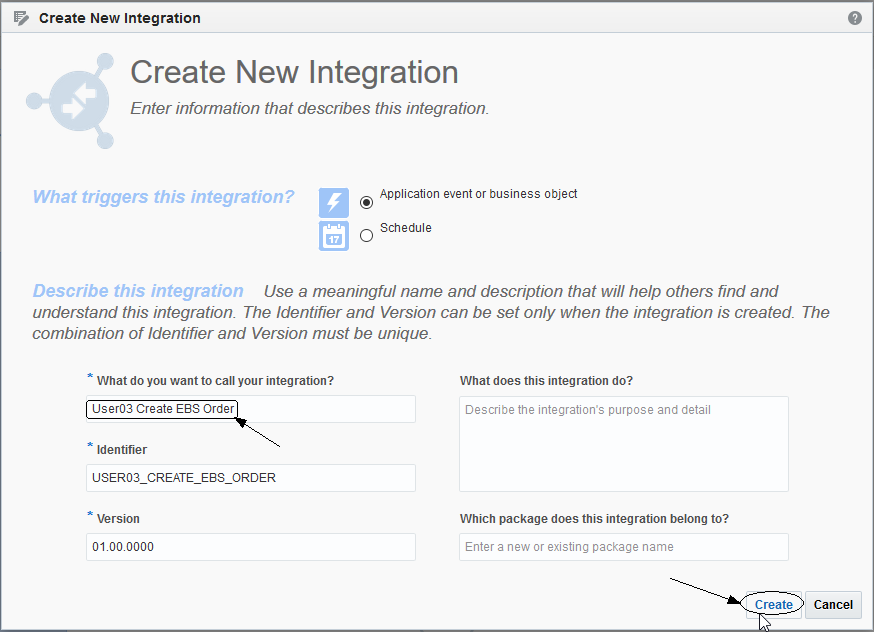

**2.1.5** Observe the design canvas for the new integration.  (The various features of the ICS designer were covered in lab 100 **Exploring ICS** earlier in this workshop)

**2.1.6** Create the Trigger for the orchestration. This integration will have a SOAP WSDL endpoint as defined when we created the **UserXX SOAP** connector earlier.

Expand the list of SOAP Triggers by clicking on the **SOAP(X)** link (where `X` will be the number of SOAP connections in the ICS instance - this will vary depending on how many others are running the workshop together).

Click and drag your SOAP connection identified by your assigned user (ie: `UserXX SOAP`) over to the **Start** target.  

(Note: After you click and start dragging your connection, the `Triggers` connection tray on the left hand side of the designer will become hidden)

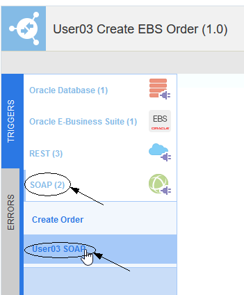

**2.1.7** Drop your connection onto the large *Plus Sign* inside the *Start* circle.

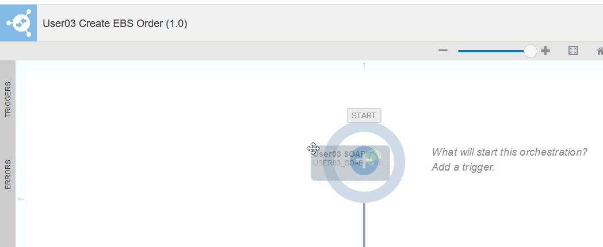

**2.1.8** Give your trigger a name in the *Configure SOAP Endpoint -> Basic Info* dialog.

- **What do you want to call your endpoint?** Enter the name `createOrder` as the trigger name.

Click on the **Next >** button

**2.1.9** Observe the SOAP operations/ports/objects in the *Configure SOAP Endpoint -> Operations* dialog.  These settings were all pulled from the WSDL which was uploaded in the configuration of the SOAP Connecter earlier.

After observing, click on the **Next >** button

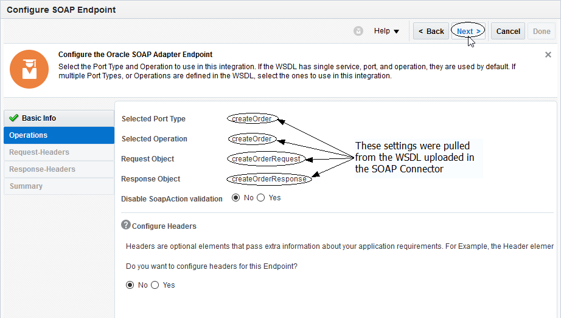

**2.1.10** Review the settings for your new Trigger in the *Configure SOAP Endpoint -> Summary* dialog.

After reviewing, click on the **Done** button

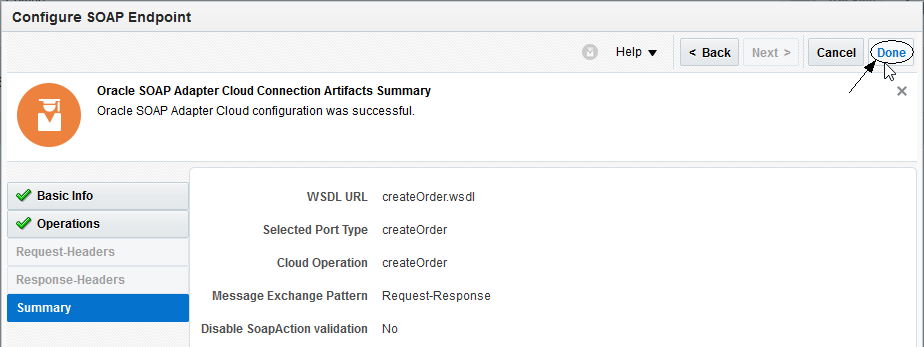

**2.1.11** Observe that the orchestration's design pallette is populated with the Trigger _createOrder_ just created along with the mapping and return operations which will be used for the SOAP trigger's response payload.

**2.1.12** Save the progress of your orchestration by clicking on the **Save** icon in the upper right of the design window

**2.1.13** Open the **INVOKES** connection tray by clicking on the `INVOKES` link in the very left of the orchestration design pallette so we can create the first call to the database.

**2.1.14** Select your database connector by clicking on the **Oracle Database(X)** link. (where `X` will be the number of Database connections in the ICS instance - this will vary depending on how many others are running the workshop together).
Click and drag your Database connection identified by your assigned user (ie: `UserXX EBS DB APPS`) over to the target which will be just below the `createOrder` trigger.

(Note: After you click and start dragging your connection, the `INVOKES` connection tray on the left hand side of the designer will become hidden)

**2.1.15** Drop your connection onto the large *Plus Sign* just below the `createOrder` trigger.

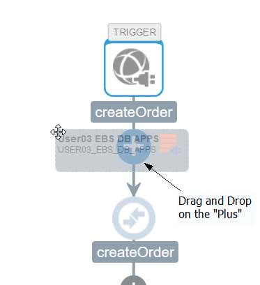

**2.1.16** Fill in the information for the new invoke in the *Oracle Adapter Endpoint Configuration Wizard* dialog.

- **What do you want to call your endpoint?** Enter the name `getCustomerBillingInfo` as the service invocation name.
- **What operation do you want to perform?** Select `Run a SQL Statement`.  The database adapter supports both calling database stored procedures as well as running ad-hoc SQL statements.

After filling in the basic information, click on the **Next >** button

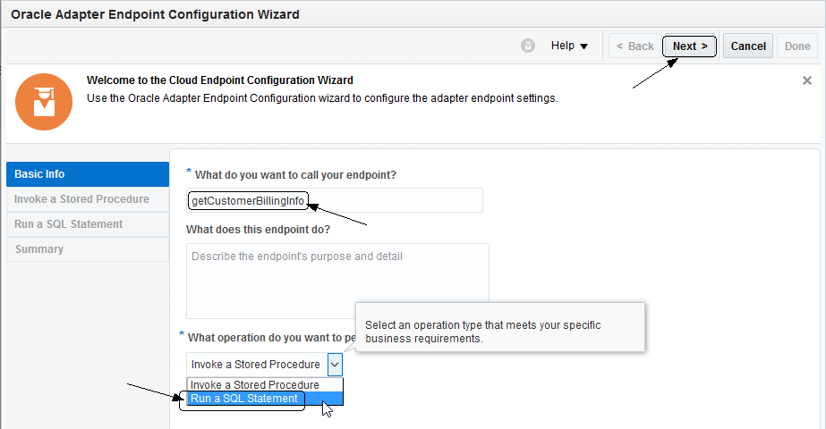

**2.1.17** Copy the SQL statement provided with this workshop in the file `getCustomerBillToInfoQueryForICS.sql` which can be found in github relative to this lab here: [../artifacts/ics/getCustomerBillToInfoQueryForICS.sql](../artifacts/ics/getCustomerBillToInfoQueryForICS.sql) (copy this query to your copy buffer so it can be pasted into the ICS invoke configuration wizard).

Also, for your convenience, the SQL query is shown inline here:

`SELECT DISTINCT rc1.party_name,rc1.PARTY_ID,rc2.ACCOUNT_NUMBER,ra1.location_id,ra1.party_site_id,ra4.SITE_USE_ID FROM hz_parties rc1,hz_cust_accounts rc2,hz_party_sites ra1,hz_locations ra2,hz_cust_acct_sites_all ra3,hz_cust_site_uses_all ra4 WHERE rc2.party_id=rc1.party_id AND rc2.cust_account_id=ra3.cust_account_id AND ra3.party_site_id=ra1.party_site_id AND ra2.location_id=ra1.location_id AND ra3.cust_acct_site_id=ra4.cust_acct_site_id AND ra4.site_use_code='BILL_TO' AND rc2.status='A' AND ra3.status='A' AND upper(rc1.party_name) = #CUSTOMER AND RA3.BILL_TO_FLAG='P' AND ra3.SHIP_TO_FLAG='P' AND RA3.ORG_ID=204`

Note that the SQL query has to be in one line and doesn't end with a semi-colon.

Click on the **Validate SQL Query** button so the query can be validated for proper SQL syntax.

 

**2.1.18** Verify that the SQL query was validated by the `Success!` message that will appear in the **Status** on the *Enter a SQL Query* dialog page.

If the query won't validate, then ensure you didn't paste in any funny characters or extra lines for the query.

Select the **Next >** button after you've validated the query has been successfully validated.

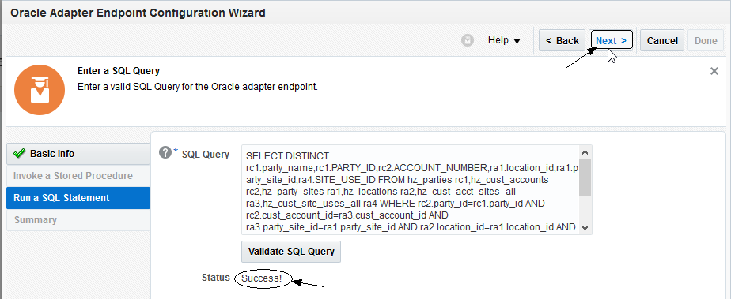

**2.1.19** Review the settings for your new adapter configuration in the *Oracle Adapter Endpoint Configuration Summary* dialog.

After reviewing, click on the **Done** button

**2.1.20** Observe that the orchestration's design pallette is populated with the invoke _getCustomerBillingInfo_ you just created along with the mapping needed to invoke this adapter.

Click on the **Zoom to Fit** button in the upper right of the design pallette if you want to see the entire orchestration.

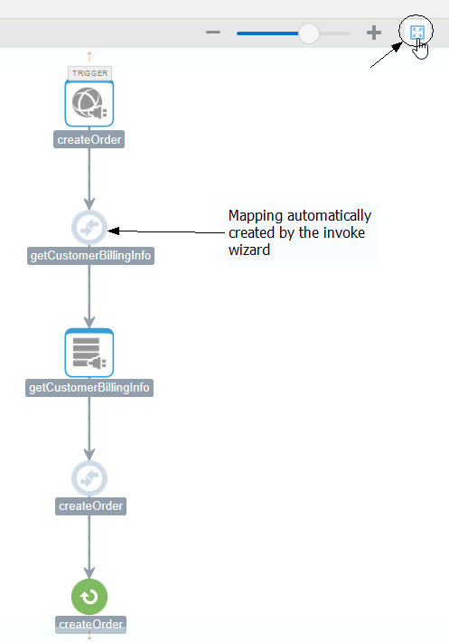

**2.1.21** Click on the *mapping symbol* for the _getCustomerBillingInfo_ mapping - this will bring up 3 icons for activities we can do to the mapping.  

Click on the `pencil icon` to edit the mapping.

Note: You can also upload an external XSLT file for this mapping that you've created external to ICS if desired by clicking the little `upload` icon.  You can also delete the mapping with the little `trash can` icon.

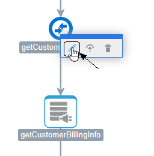

**2.1.22** Edit the mapping by clicking on the little circle to the right of the `AccountName` source variable and dragging it on top of the little circle just to the left of the `CUSTOMER` target variable.

Note: As described in the lab 100 ICS overview, this map could be tested by selecting the **Test** button in the upper right.  We aren't going to test this mapping because it is so simple.

After completing the mapping, save it by clicking on the **Save** icon in the upper right of the design window

**2.1.23** Exit the mapping editor by clicking on the **< Exit Mapper** button in the upper left.

**2.1.24** Save the progress of your orchestration by clicking on the **Save** icon in the upper right of the design window

**2.1.25**

## Part 3: Test the ICS Integration

