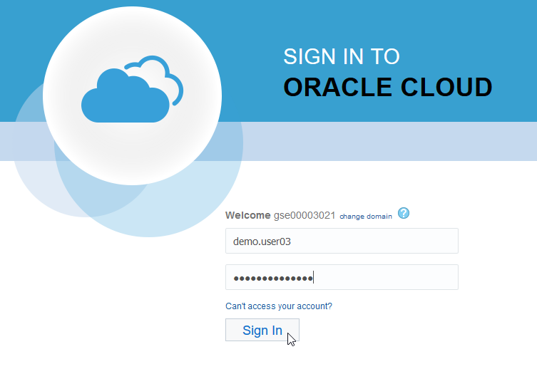
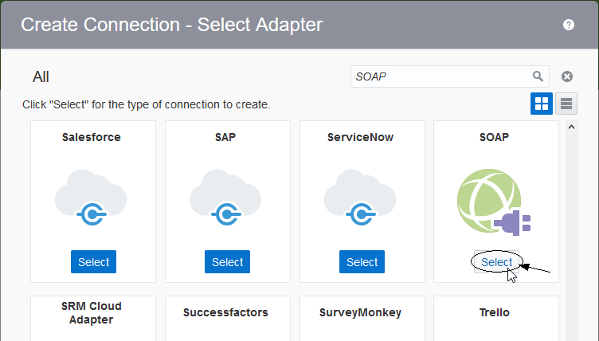

  

Update: March 30, 2017

# Lab 300 - Create an ICS Integration using a Database Adapter

---

## Introduction

This is the third of several labs that are part of the **ICS Development** workshop. 

In this lab, you develop an integration in ICS using a database adapter to query the Oracle EBS database.

## Objectives

- Learn how to create ICS Application Adapter Connections
- Learn how to create an ICS Orchestration using the ICS Adapter
- Learn how to test the ICS integration using SoapUI

## Required Artifacts

- The following lab and an Oracle Public Cloud account that will be supplied by your instructor.
- SoapUI will need to be installed for ICS integration testing - see "Prerequisites" section of the workshop for details

## Part 1: Create the ICS Connections

In the previous lab, a REST connection was created.  In a similar manner we need to create the connections necessary for the integration in this lab which are for the inbound SOAP web service as well as the EBS Database.

### **1.1**: Login to your Oracle Cloud account

---

- From your browser (Firefox or Chrome recommended) go to the following URL:
<https://cloud.oracle.com>
- Click Sign In in the upper right hand corner of the browser
- **IMPORTANT** - Under My Services, change Data Center to `US Commercial 2 (us2)` and click on Sign In to My Services

    

- If your identity domain is not already set, enter it and click **Go** (do not check to box to save it because this will set a cookie in the browser that needs to be cleared if you need to change identity domains later)  

    **NOTE:** the **Identity Domain** values will be given to you from your instructor.

      

- Once your Identity Domain is set, enter your `User Name` and `Password` and click **Sign In**

    ***NOTE:*** the **User Name and Password** values will be given to you by your instructor.

      

- You will be presented with a Dashboard displaying the various cloud services available to this account.

   **NOTE:** The Cloud Services dashboard is intended to be used by the *Cloud Administrator* user role.  The Cloud Administrator is responsible for adding users, service instances, and monitoring usage of the Oracle cloud service account.  Developers and Operations roles will go directly to the service console link, not through the service dashboard.

    

### **1.2**: Create Database Connections

---

**1.2.1** Select the `Connections` graphic in the designer portal

 

**1.2.2** Click on **New Connection**

 

**2.3** Select the **REST** Connection, by either doing a search, or by scrolling down to the **REST** connection, by clicking on the **Select** button of the **REST** connection.

**2.4** Fill in the information for the new connection 

- **Name** in the form of _UserXX REST_ where XX is the number in your allocated user.
- **Role** _Trigger_ since we going to use the connection as a trigger to start the integration

 

**2.7** click **Create**

 

>**Note** The default security configuration is set to **Basic Authentication**, which >by the way, is the only option available for REST trigger connections. When invoking >the trigger, we will use our ICS username/password. 

**2.6** Click on **Test** 

**2.7** Click **Save** 

 

**2.8** Click on **Exit Connection**

- Your first connection appears in the list of configured connections and is even marked as **New** !

 

#### **1.2.2**: Create the SOAP Connection

## Part 2: Create the ICS Integration

---

#### **2.1**: Create Orchestration Integration

## Part 3: Test the ICS Integration

