---
# ORACLE Cloud-Native DevOps workshop #
----
## Development lifecycle management using Eclipse IDE (Oracle Enterprise Pack for Eclipse) and Oracle Developer Cloud Service ##

### Introduction ###
This tutorial based on standardized developer workflow using Oracle Developer Cloud Service. The intent is to showcase how a team starting on the Oracle Developer Cloud Service would collaborate to address change management use-case.

One of the biggest change using cloud native applications after on-premise, silo type application architecture is to configure dependencies between services. For example application deployed on Application Cloud Container need to access to e.g. service running on Java Cloud Service. In the cloud world especially wrong approach to write the specific endpoint and even the configuration into the application's source code. Service endpoints (e.g. IP address, URL) can change quickly. To keep application architecture flexible Application Container Cloud Service provides **Service Bindings**. You can add service bindings to other subscribed Oracle Cloud services (e.g. Java Cloud Service and Database Cloud Service) using the Application Console or define in the `deployment.json` metadata file.

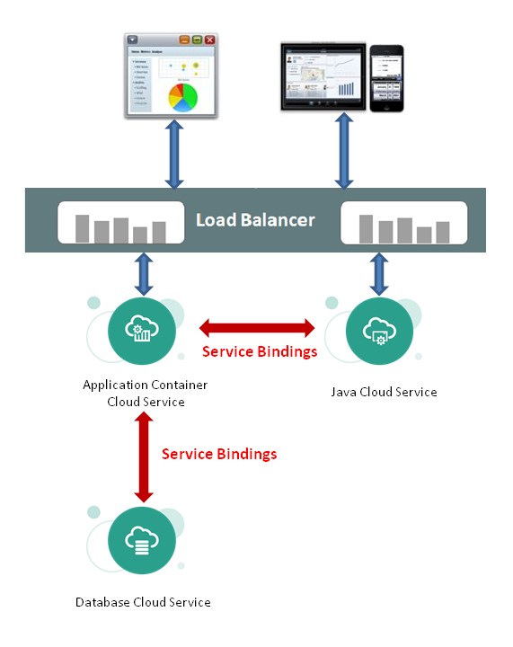

In this tutorial the change (new feature) for the Spring Boot demo application is to create new page which prints a REST call response. The REST endpoint is hosted on Java Cloud Service. 

### About this tutorial ###
This tutorial demonstrates how to:
  
+ Create issue/task using Oracle Developer Cloud Service user interface
+ Open/Close issue/task using OEPE Cloud Tooling
+ Add changes to the source code and push to remote (DevCS hosted) repository
+ How continuous integration can be triggered by source code changes
+ Create service bindings for Application Container Cloud Service
+ Check Application Cloud Container redeployment using OEPE Cloud Tooling

### Prerequisites ###

+ [Create Oracle Developer Cloud Service project for Spring Boot application](../springboot-sample/create.devcs.project.md)
+ [Create continuous build integration using Oracle Developer Cloud Service and Oracle Application Container Cloud Service](../springboot-sample/devcs.accs.ci.md)
+ [Using Eclipse IDE (Oracle Enterprise Pack for Eclipse) with Oracle Developer Cloud Service](../oepe/setup.oepe.md)
+ [Deploy JEE sample application to Oracle Java Cloud Service using Admin console](../jcs-deploy/README.md)

### Steps ###

#### Create Issue using Oracle Developer Cloud Service user interface ####

[Sign in](../common/sign.in.to.oracle.cloud.md) to [https://cloud.oracle.com/sign-in](https://cloud.oracle.com/sign-in). On the dashboard open the Developer Cloud Service Console.

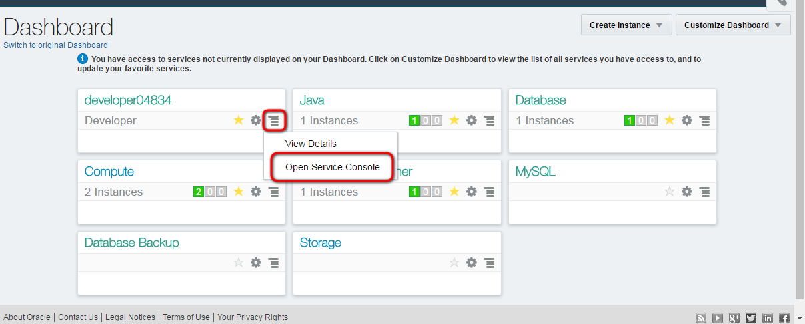

Open the Spring Boot project and click Issues tab. Click **New Issue**.

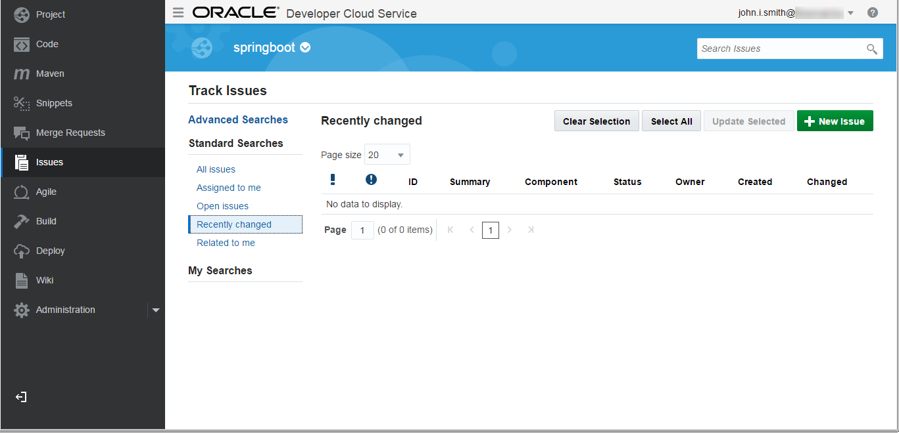

Enter properties of the new task. The new task will be to create new page in Spring Boot demo application to show TechCo products using that [application](../jcs-deploy/README.md)'s REST interface. You can use values on the picture but the point is only to create new Issue assigned to your account which can be used to simulate task assignement to specific user. So make sure the Owner of the Issue is assigned to your account name.

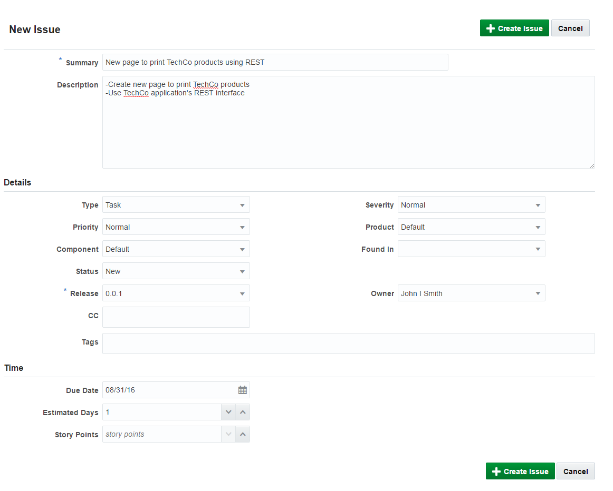

Now switch to OEPE to check your tasks. If your OEPE is already opened and cloud connection is activeted then you can see Eclipse notification about the assignement. To open the task  in OEPE click on notification link or activate your cloud connection and open myOracleCloud(cloud connaction name) -> Developer -> springboot(DevCS project name) -> Issues -> Mine

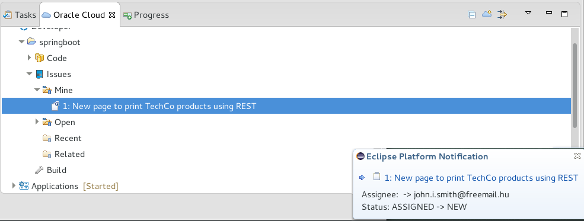

Double click on the task to open details. Scroll down and ACCEPT the assignement. Click **Submit** and start the development.

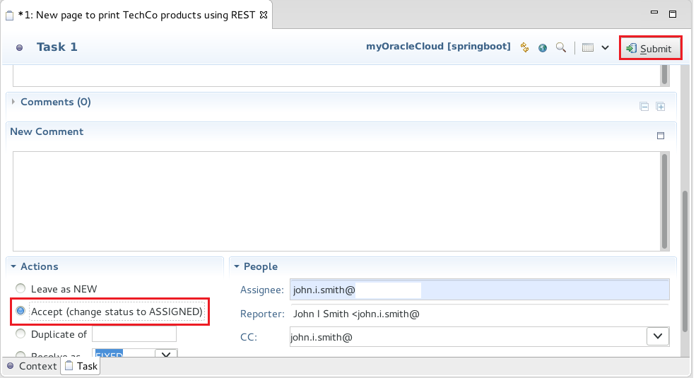

#### Implement new feature in the application ####

As first step add required dependencies to the Maven project. These dependencies the `org.apache.httpcomponents` to make REST call and `org.glassfish.javax.json` to process JSON formatted response. Open the pom.xml. Select Dependencies view of the project file and click **Add...** to add the dependencies.

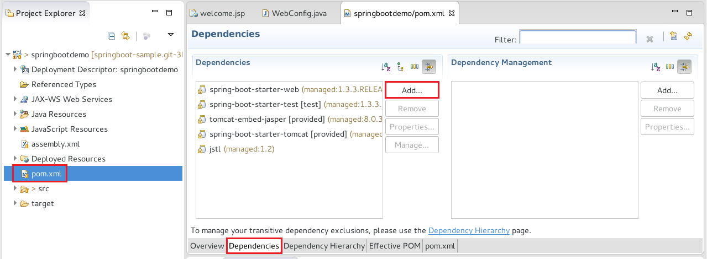

The `org.apache.httpcomponents` properties are the following:

+ **Group Id**: org.apache.httpcomponents
+ **Artifact Id**: httpclient
+ **Version**: 4.5

Click **OK**.

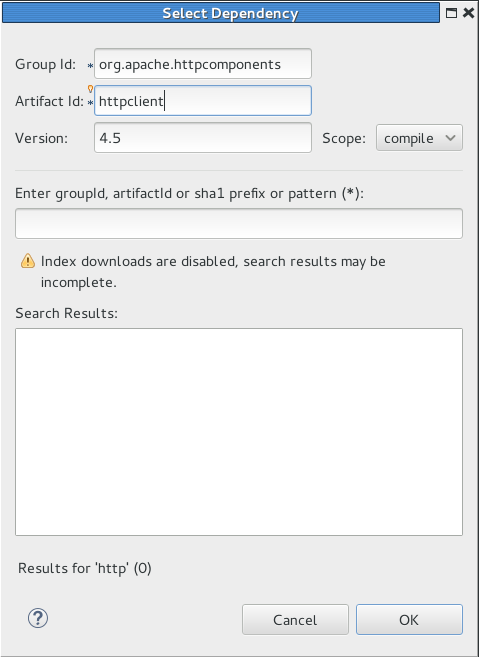

The `org.glassfish.javax.json` properties are the following:

+ **Group Id**: org.glassfish
+ **Artifact Id**: javax.json
+ **Version**: 1.0.4

Click **OK**.

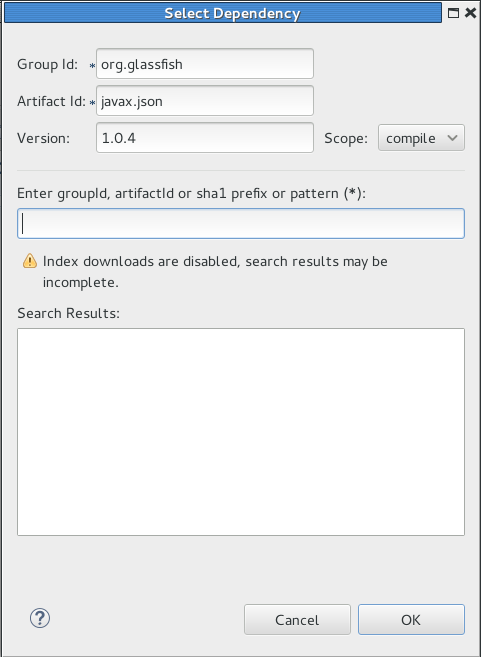

The result for the `pom.xml` should look like the following:

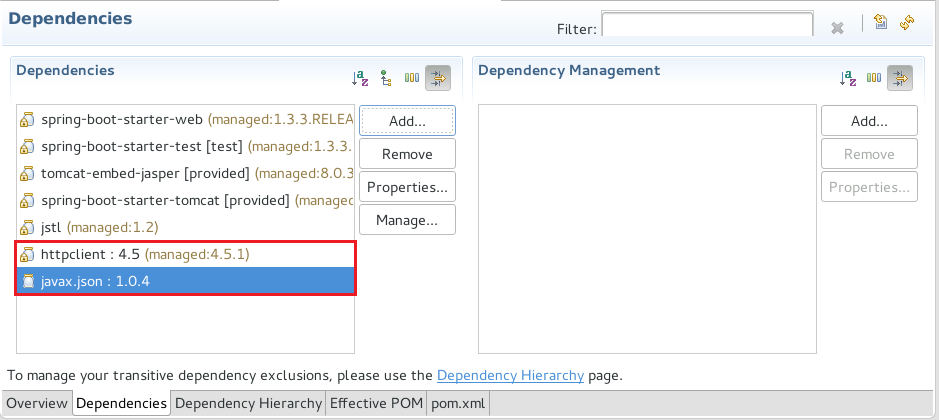

Here is the time to code. In the *springbootdemo* project open the **Java Resources -> src/main/java -> com.example.springboot.config -> WebConfig.java** and copy or write the view controller registration of the new page in the `public void addViewControllers(ViewControllerRegistry registry)` method:

	registry.addViewController("/restcall").setViewName("restcall");

The WelcomeController.class should look like as the following:

	package com.example.springboot.config;
	
	import org.springframework.context.annotation.Bean;
	import org.springframework.context.annotation.ComponentScan;
	import org.springframework.context.annotation.Configuration;
	import org.springframework.web.servlet.DispatcherServlet;
	import org.springframework.web.servlet.config.annotation.DefaultServletHandlerConfigurer;
	import org.springframework.web.servlet.config.annotation.EnableWebMvc;
	import org.springframework.web.servlet.config.annotation.ViewControllerRegistry;
	import org.springframework.web.servlet.config.annotation.WebMvcConfigurerAdapter;
	import org.springframework.web.servlet.view.InternalResourceViewResolver;
	import org.springframework.web.servlet.config.annotation.ResourceHandlerRegistry;
	
	@EnableWebMvc
	@ComponentScan
	@Configuration
	public class WebConfig extends WebMvcConfigurerAdapter {
	
		private static final String[] CLASSPATH_RESOURCE_LOCATIONS = {
	        "classpath:/META-INF/resources/", "classpath:/resources/",
	        "classpath:/static/", "classpath:/public/" };
	
		@Override
		public void addResourceHandlers(ResourceHandlerRegistry registry) {
		    registry.addResourceHandler("/**").addResourceLocations(CLASSPATH_RESOURCE_LOCATIONS);
		}
	
		@Override
		public void addViewControllers(ViewControllerRegistry registry) {
			registry.addViewController("/").setViewName("welcome");
			registry.addViewController("/env").setViewName("environment");
			registry.addViewController("/heap").setViewName("heap");
			registry.addViewController("/cpu").setViewName("cpu");
			registry.addViewController("/restcall").setViewName("restcall");
		}
	
		@Bean
		public InternalResourceViewResolver viewResolver() {
			InternalResourceViewResolver viewResolver = new InternalResourceViewResolver();
			viewResolver.setPrefix("/WEB-INF/views/");
			viewResolver.setSuffix(".jsp");
			return viewResolver;
		}
	
		@Bean
		// Only used when running in embedded servlet
		public DispatcherServlet dispatcherServlet() {
			return new DispatcherServlet();
		}
	
		@Override
		public void configureDefaultServletHandling(
				DefaultServletHandlerConfigurer configurer) {
			configurer.enable();
		}
	}

In the OEPE:

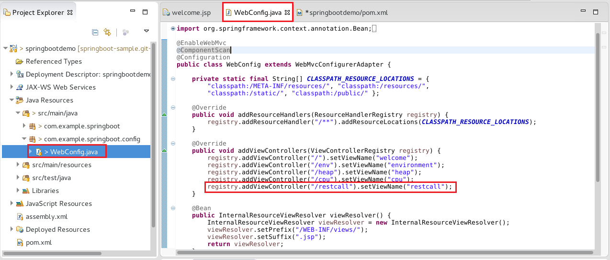

This part above route the `/restcall` path to the new JSP page. Now create this new page. In  the **Deployed Resources -> webapp -> WEB-INF -> views** create a new JSP page. Right click  the **views** folder and select **New -> JSP File**

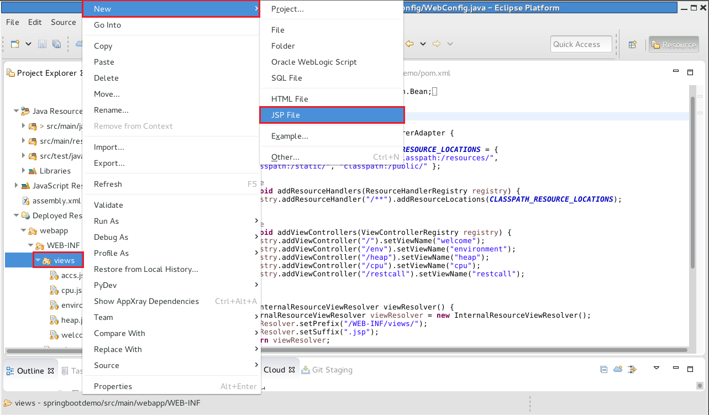

If the **JSP File** item is not available select **Other...** then find **JSP File** in the wizard dialog. Click Next.

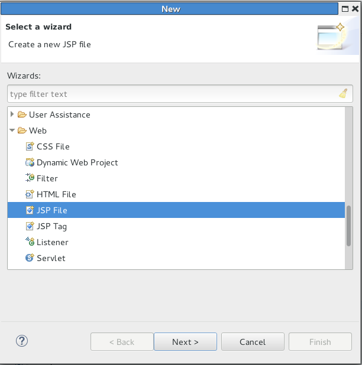

Enter name: `restcall.jsp` and click **Finish**.

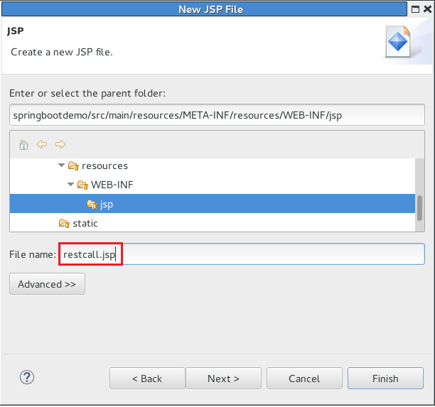

The new page will open in the editor using Design View. In the source code window select all and replace to the following:

	<%@ page language="java" contentType="text/html; charset=UTF-8"
	  pageEncoding="UTF-8"%>
	<!DOCTYPE html PUBLIC "-//W3C//DTD HTML 4.01 Transitional//EN" "http://www.w3.org/TR/html4/loose.dtd">
	<%@ taglib prefix="spring" uri="http://www.springframework.org/tags"%>
	<%@ taglib prefix="c" uri="http://java.sun.com/jsp/jstl/core"%>
	
	<%@ page import="java.io.InputStreamReader" %>
	<%@ page import="java.security.cert.CertificateException" %>
	<%@ page import="java.security.cert.X509Certificate" %>
	
	<%@ page import="javax.json.Json" %>
	<%@ page import="javax.json.JsonArray" %>
	<%@ page import="javax.json.JsonObject" %>
	<%@ page import="javax.json.JsonReader" %>
	<%@ page import="javax.net.ssl.SSLContext" %>
	
	<%@ page import="org.apache.http.client.methods.CloseableHttpResponse" %>
	<%@ page import="org.apache.http.client.methods.HttpGet" %>
	<%@ page import="org.apache.http.conn.ssl.NoopHostnameVerifier" %>
	<%@ page import="org.apache.http.conn.ssl.SSLConnectionSocketFactory" %>
	<%@ page import="org.apache.http.impl.client.CloseableHttpClient" %>
	<%@ page import="org.apache.http.impl.client.HttpClientBuilder" %>
	<%@ page import="org.apache.http.impl.client.HttpClients" %>
	<%@ page import="org.apache.http.ssl.SSLContexts" %>
	<%@ page import="org.apache.http.ssl.TrustStrategy" %>
	
	<html lang="en-US" >
	<head><meta http-equiv="Content-Type" content="text/html; charset=UTF-8">
	<meta http-equiv="X-UA-Compatible" content="IE=edge">
	<meta name="viewport" content="width=device-width, initial-scale=1.0, maximum-scale=1">
	<meta http-equiv="Content-Type" content="UTF-8">
	
	
	
	<title>About Oracle Application Container Cloud</title>
	
	</head>
	<body style="padding: 10px; border: 10px;">
	Spring Boot application demo.
	 
	<h2>REST call to Oracle Java Cloud Service from Oracle Application Container Cloud</h2>
	

	

	<% 
	final String JCS_URL = "JAAS_SECURE_CONTENT_URL";
	final String JCS_PORT = "JCS_PORT";
	final String TECHCO_REST_PATH = "TECHCO_REST_PATH";
	String sURL = System.getenv().get(JCS_URL);
	String restPath;
	String port;
	
	if (System.getenv().get(TECHCO_REST_PATH) != null) {
	  restPath = System.getenv().get(TECHCO_REST_PATH);
	} else {
	  restPath = "/TechCo-ECommerce/rest/products/all";
	}
	
	if (System.getenv().get(JCS_PORT) != null) {
	  port = ":" + System.getenv().get(JCS_PORT);
	} else {
	  port = "";
	}
	
	  
	  if (sURL == null) {
	    out.write("
<b>Java Cloud Service Instance bindings</b> (" + JCS_URL + "): <mark>Not defined.</mark>
");
	    out.write("
Please create service binding for application deployed on Oracle Application Container Cloud.
");
	  } else {
	  
	    out.write("
<b>Java Cloud Service Instance bindings (" + JCS_URL + "):</b> <mark>" + sURL + "</mark>
");
	    
	    try {
	      SSLContext sslContext = SSLContexts.custom().loadTrustMaterial(null, new TrustStrategy() {
	
	              @Override
	              public boolean isTrusted(final X509Certificate[] chain, final String authType) throws CertificateException {
	                  return true;
	              }
	          }).build();
	
	      SSLConnectionSocketFactory sslsf = new SSLConnectionSocketFactory(sslContext, NoopHostnameVerifier.INSTANCE);
	    
	      HttpClientBuilder builder = HttpClients.custom().setSSLSocketFactory(sslsf);
	      CloseableHttpClient httpclient = builder.build();
	    HttpGet httpGet = new HttpGet(sURL + port + restPath);
	    
	    out.write("
<b>Execute REST call:</b> <mark>" + sURL + port + restPath + "</mark>
");
	    CloseableHttpResponse restResponse = httpclient.execute(httpGet);
	  
	    out.write("
<b>HTTP Response:</b> " + restResponse.getStatusLine() + "
");
	    
	    if (restResponse.getStatusLine().getStatusCode() == 200) {
	      if (restResponse.getEntity() != null) {
	      
	        out.write("
<b>HTTP Content (formatted):</b>
");
	        out.write("
");
	        out.write("<table>");
	        out.write("  <tr>");
	        out.write("    <th>Product Name</th>");
	        out.write("    <th>Product Description</th>");
	        out.write("  </tr>");
	
	        InputStreamReader is = new InputStreamReader((restResponse.getEntity().getContent()));
	        JsonReader rdr = Json.createReader(is);
	        JsonObject obj = rdr.readObject();
	        JsonArray results = obj.getJsonArray("products");
	        for (JsonObject result : results.getValuesAs(JsonObject.class)) {
	        
	          out.write("  <tr>");
	          out.write("    <td>");      
	          out.write(result.getInt("productId") + " " + result.getString("productName"));
	          out.write("    </td>");
	          out.write("    <td>");
	          out.write(result.getString("productDescription"));
	          out.write("    </td>");
	          out.write("  </tr>");
	        }
	        out.write("<table>");
	        out.write("
");
	      }
	    } else {
	      out.write(" <b>Reason:</b> " + restResponse.getStatusLine().getReasonPhrase());
	    }
	  } catch (Exception e) {
	    out.write("
<b>Exception:</b>
 " + e.getMessage());
	    e.printStackTrace();
	  }
	  }
	  
	%>
	

	</body>
	</html>

The result would be the following in OEPE:

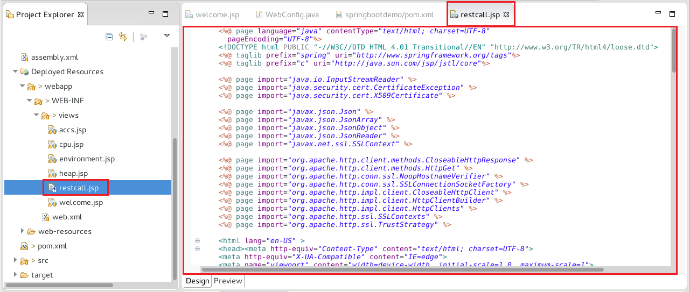

Now build the application. Right click on `pom.xml` and select **Run As -> Maven install**

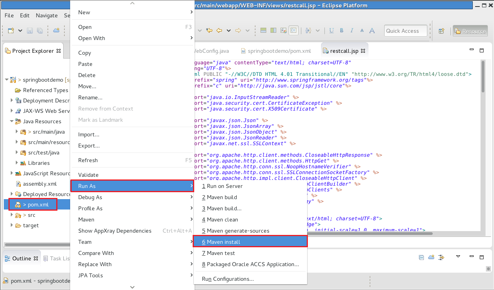 

You can see the result of a successfull build the console view.

#### Push changes to remote (Developer Cloud Service's project hosted) repository  ####

After the implementation and successful smoke test (which is out of scope of this tutorial because of length) you need to push your changes to the remote repository. Right click on project and select **Team -> Commit...**

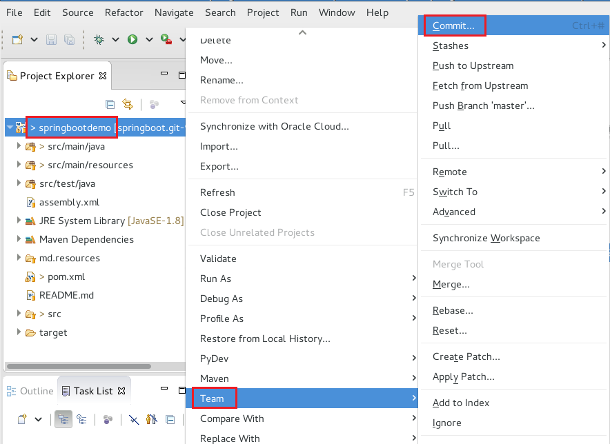

Git Staging view is displayed. First drag-and-drop the `restcall.jsp` to *Staged Changes* area where you can already find `pom.xml` and `WebConfig.java`. You don't need to add Eclipse specific files created in the local Git repository. Type a commit message. Please note when you type (in this case) Task 1 then that will change to a link. The reason that the OEPE Cloud Tooling realized that this is an existing task in the Issue tracking system and creates a link to the issue in the commit message. You can check later on the Developer Cloud Service user interface. Enter your name and Cloud username (email address). Click **Commit and Push...**

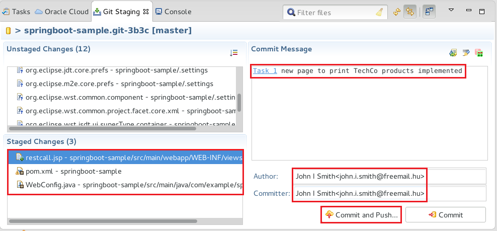

In the Push dialog leave the default master branch and click **OK**.

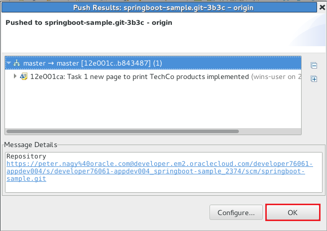

Now change back to the browser and check the Build page in the Oracle Developer Cloud Service project. You should see that a new build (in our case: *springboot_build*) has been fired by the Git changes.

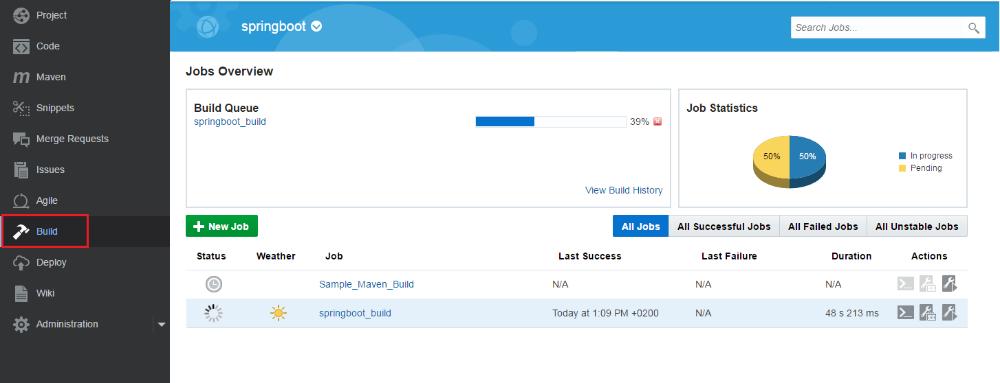

Once the job is done change to the tab to Deploy and you can see that a new deployment has been started too. If you remember the Deployment was configured to redeploy every time when a new successful build artifact is ready.

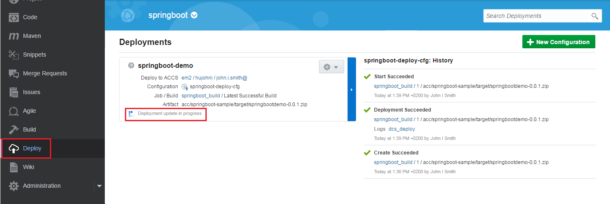

After the successful deployment to the Application Container Cloud Service a new entry appears on the righ side about the result. Hopefully it shows the Deployment Succeeded. To access to the application click on the link next to the *Deploy to ACCS*.

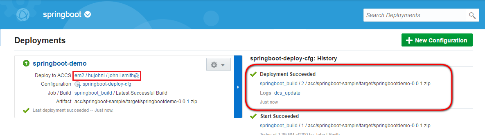

The application's welcome page has not changed.

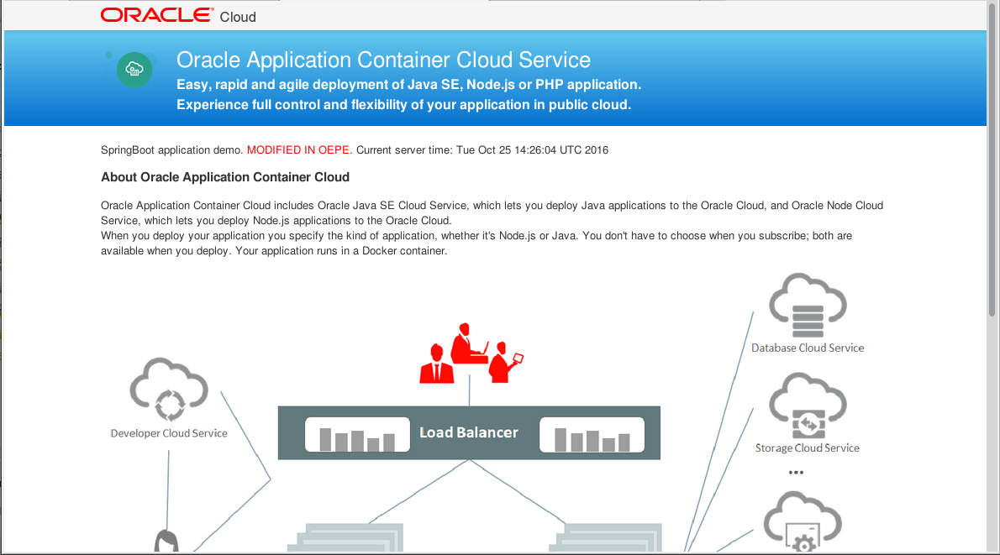

Now hit your new page. Append to the URL `/restcall`.

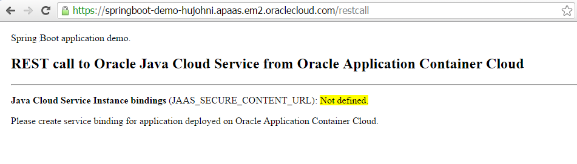

You can see the new page, but there is no result at this moment because you have no bindings to reach the TechCo application running on Java Cloud Service.

#### Create Java Cloud Service bindings for application deloyed on Application Container Cloud Service  ####

First test the TechCo application's REST interface. In the browser open a new tab and go to the Java Cloud Service console. If there is no Dashboard or other service console opened then [sign in](../common/sign.in.to.oracle.cloud.md) to [https://cloud.oracle.com/sign-in](https://cloud.oracle.com/sign-in). On the dashboard open the Java Cloud Service Console.

 

Click the name of the service instance to which the application is deployed.

On the service instance details pages, find the list of nodes, and take note of the public IP address for the virtual machine that contains the Administration Server and Managed Server.

Open a browser and write the following URL: `http://<public-ip-address>/TechCo-ECommerce/rest/products/all`. What you can see is the JSON formatted response of the REST interface to query all products. This is what SpringBoot application will invoke and print the result on its ne page.

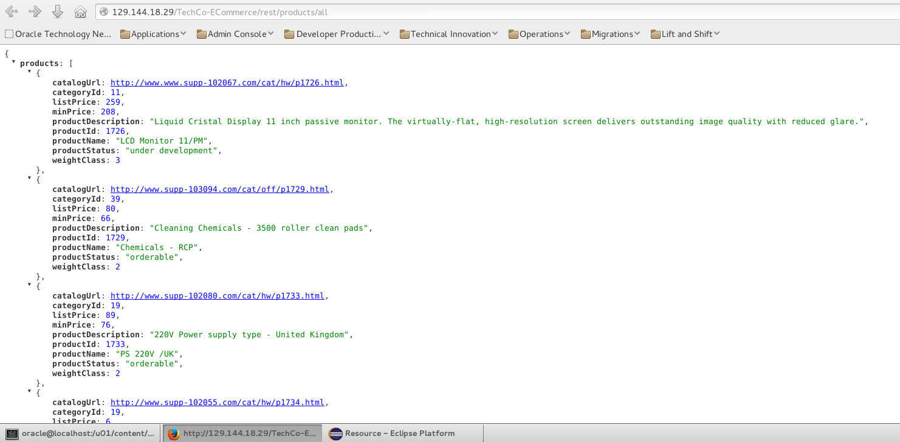

Go back to browser where Application Container Cloud Service console is open. If there is no such browser go to Java Cloud Service console page and use Dashboard button to navigate Application Cloud Container Service console. If there is no any Oracle Cloud Service related console opened then [sign in](../common/sign.in.to.oracle.cloud.md) to [https://cloud.oracle.com/sign-in](https://cloud.oracle.com/sign-in) and open again the Application Container Cloud Service console.

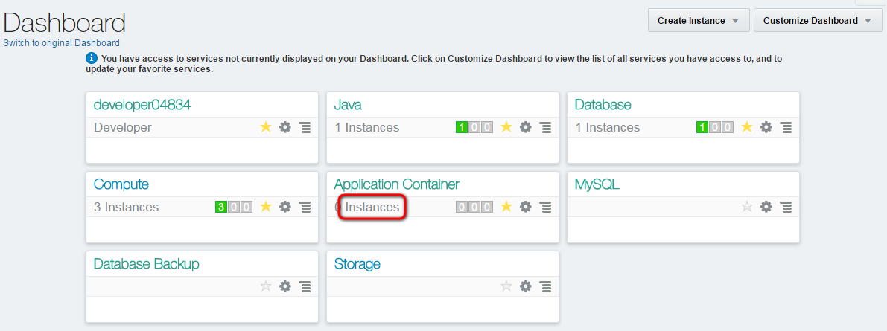

Click on the service name to manage the instance.

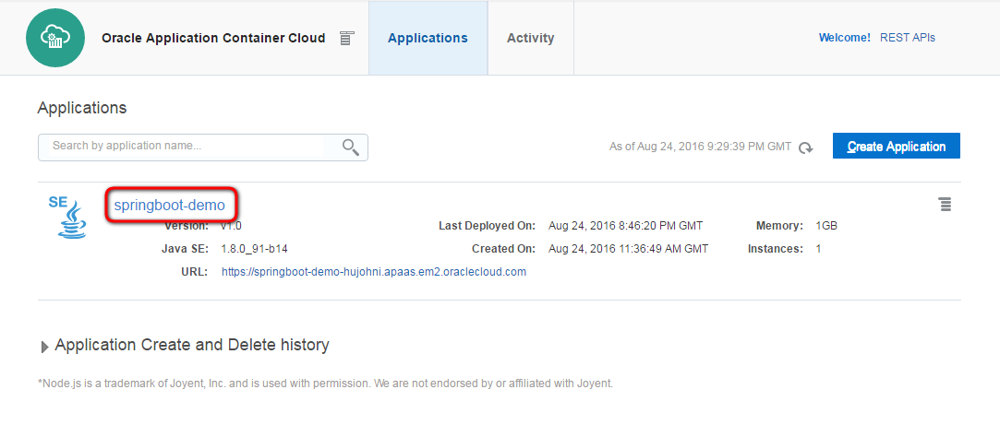

Click Deployments tile and then Add new *Service Bindings*.

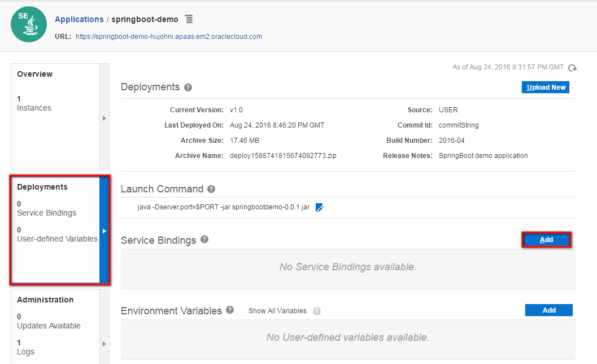

Configure the service bindings with the following properties:

+ **Service Type**: Java Cloud Service
+ **Service Name**: techco (the name of JCS instance where the TechCo application is deployed)
+ **Username** and **Password**: Cloud credentials

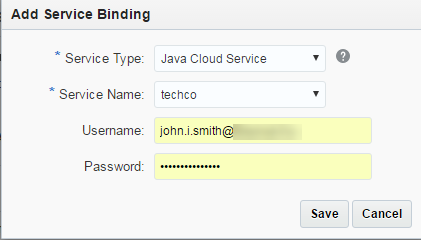

Click **Apply Edits** to restart the service. This may take some time.

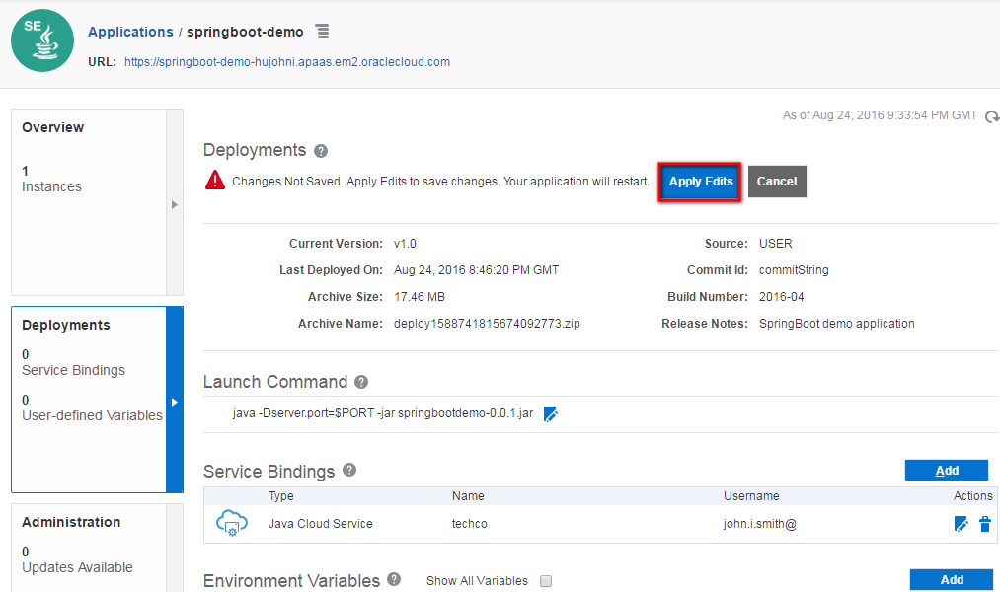

When the restart ready (use refresh button to update the information) switch to browser which shows the SpringBoot application's new page: `https://springboot-demo-<identitydomain>.apaas.<datacenter>.oraclecloud.com/restcall`. You can easily find the URL at Application Container Cloud Service console or ACCS instance's detail page.

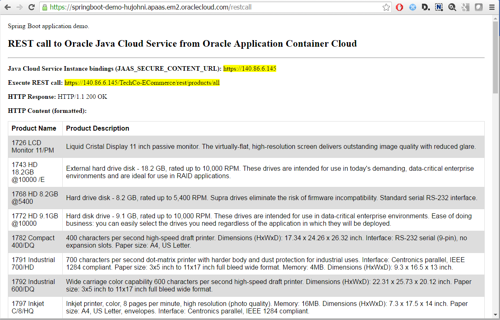

If the Service Bindings creation was successful the SpringBoot demo application can invoke TechCo application's REST interface (using the bindings) and you should see the product list result printed in HTML table.

#### Close Issue using OEPE Cloud Tooling ####

The new feature has been implemented so you can change your task's state to Resolved. Go back to OEPE and open your task if it is not opened already.

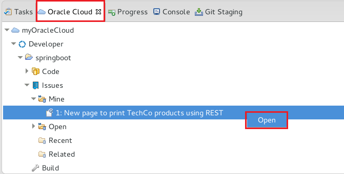

In the detail view scroll down enter new description and change state to Resolved.

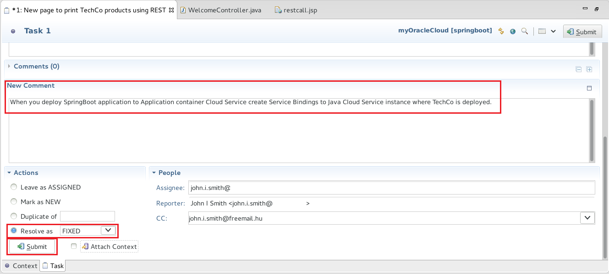

#### Check changes using Oracle Developer Cloud Service user interface ####

Now change to browser where Oracle Developer Cloud Service is open. If you have closed then [sign in](../common/sign.in.to.oracle.cloud.md) to [https://cloud.oracle.com/sign-in](https://cloud.oracle.com/sign-in). On the dashboard open the Developer Cloud Service Console.

On the Home page you can see the recent activities. Check what has happened with your project. If the page remained opened refresh to get the latest entries. You can see the changes you made on the task assigned. Scroll down and find the log entry related to code changes pushed to master branch in `<projectname>.git` (*springboot.git*) repository. The Git icon  can help to find this event. Click on the link named with the identifier of the git changes.

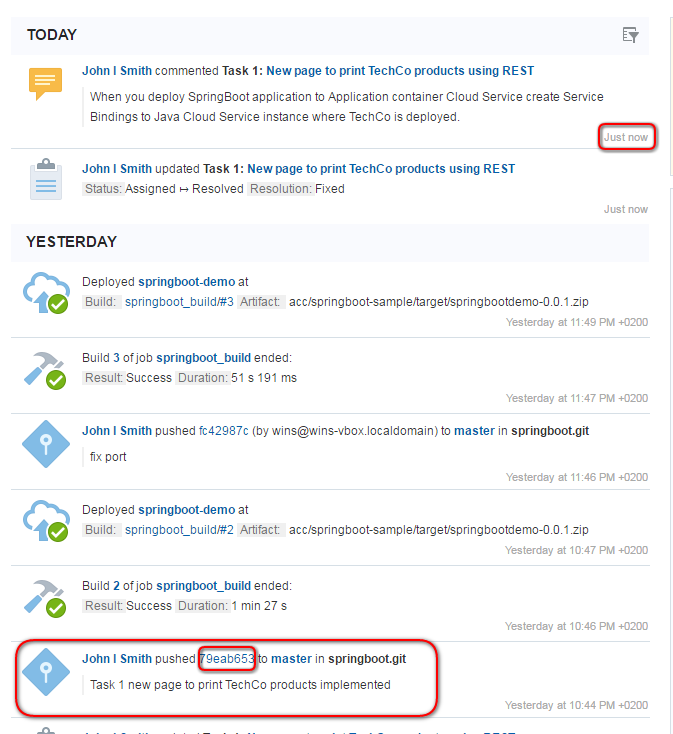

This link redirects you to the Code page where you can see the modifications belong to the specific git identifier. Scroll down to check what changes have happened on the source code.

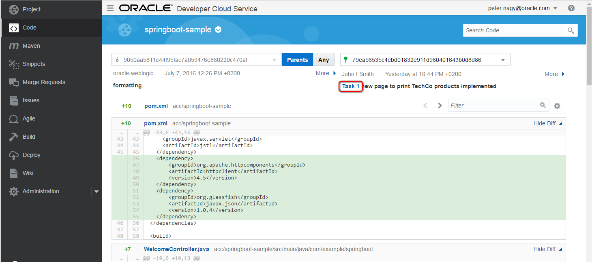

On the top right area you can see the comment of the Git commit. If you remember when you entered *Task 1* into the comment it was converted to link immediately. It is happened because Developer Cloud Service recognized as a valid Issue identifier. Now click the **Task 1** link to jump the related issue. You can modify the issue if you need, but in a typical development workflow the QA team will test the Fixed issues and step forward to Verified or Reopened status depending on the test result.

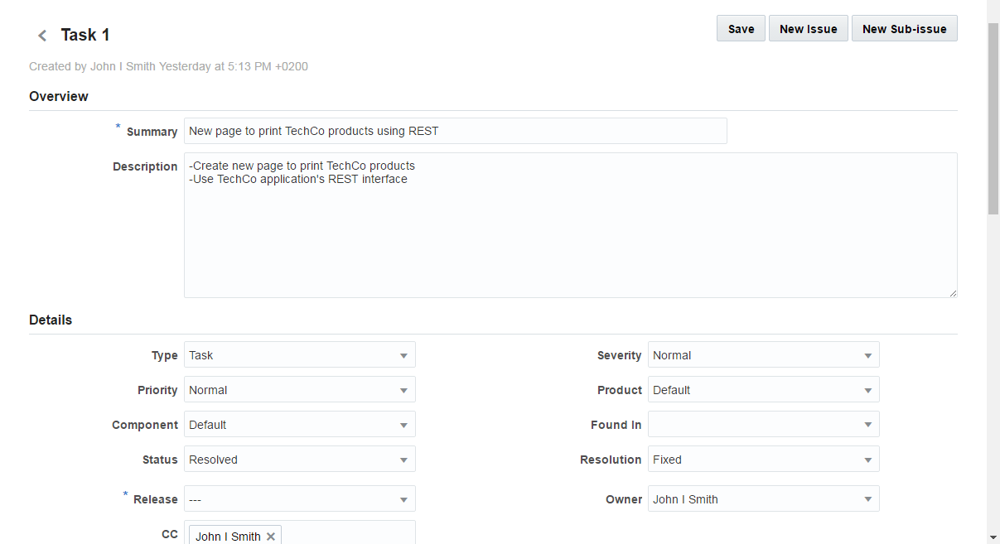

Please note that in a project, you can define products, components, owners of components, releases, and tags, of your project before creating and assigning issues to project members. You can define multiple product categories, components, and sub-components; customize the releases; provide custom tags; and add custom fields for your project. For more information see the [documentation](http://docs.oracle.com/cloud/latest/devcs_common/CSDCS/GUID-FFB070E5-DA29-43EB-A0CA-3FA8BB3FC3E1.htm#CSDCS3146).

