  

Update: March 23, 2017

# Lab 200 - Integration Cloud Service

## Introduction

This is the second of several labs that are part of the **ICS Development Workshop**. 

In this lab, you will learn how to create a basic 'hello world' echo service, using a basic orchestration. 

## Objectives

- Create your first integration to echo an input to the output 

## Required Artifacts

- The following lab and an Oracle Public Cloud account that will be supplied by your instructor.

## Login to your Oracle Cloud account

### Login to ICS Home Page

>***NOTE:*** the **User Name** and **Password** values will be given to you by your instructor. See _Lab 100 **1.1.1**: Login to your Oracle Cloud Account_ for more information on how to sign into the ICS home page

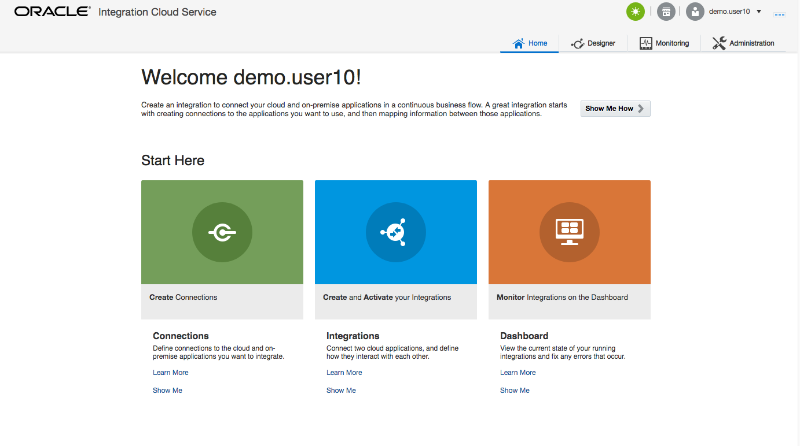  

## Creating Simple Orchestration Integration

### Create a REST Connection

In this first part of the lab, we will create a connection :

Let’s start by logging into the Oracle Cloud account using your allocated user (demo.user1..10)  

>**NOTE:** All the screenshots use the _demo.user10_ account. Replace the _demo.user10_ with your assigned account to validate the steps illustrated in the screenshots. 

---

**2.1** Click on the **Connection** section

 

**2.2** Click on **New Connection**

 

**2.3** Select the **REST** Connection, by either doing a search, or by scrolling down to the **REST** connection, by clicking on the **Select** button of the **REST** connection.


**2.4** Fill in the information for the new connection 

- **Name** in the form of _UserXX REST_ where XX is the number in your allocated user.
- **Role** _Trigger_ since we going to use the connection as a trigger to start the integration

 

**2.7** click **Create**

 

>***Note*** The default security configuration is set to **Basic Authentication**, which by the way, is the only option available for REST trigger connections. When invoking the trigger, we will use our ICS username/password. 

**2.6** Click on **Test** 


**2.7** Click **Save** 

 

**2.8** Click on **Exit Connection**

Your first connection appears in the list of configured connections and is even marked as **New** !

 

**2.9** Click on the Home tab to get back to the Home page

 

### Creating an Integration

**1.1** Click on the **Integrations** section on the ICS home page

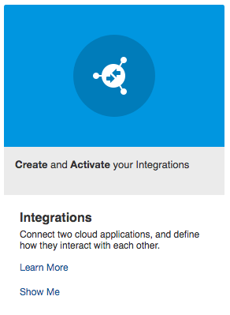 

**1.2** Click on **New Integration** 

 

**1.3** In the **Create Integration - Select a Style/Pattern** popup, select the **Orchestration**


**1.4** Fill in the form with the following information

- _What triggers this integration?_ **Application event or business object**
- _Name_ **UserXX Hello World**

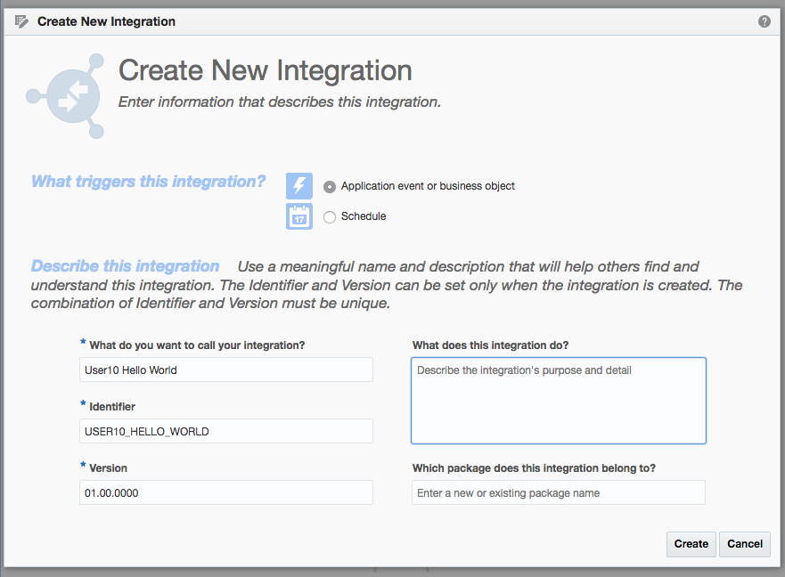 

**1.5** Click on **Create**

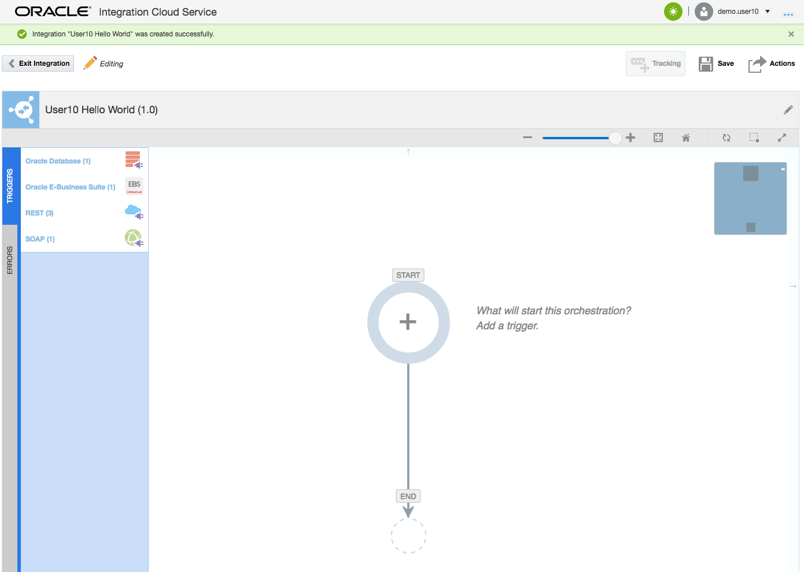

**1.6** In the **Trggers** panel, expand the **REST(nn)** heading, and find your connection, under **REST**

Drag and drop your connection **UserXX REST** in to the circle with plus sign, you will see the plus sign twirling when ready to drop 
 
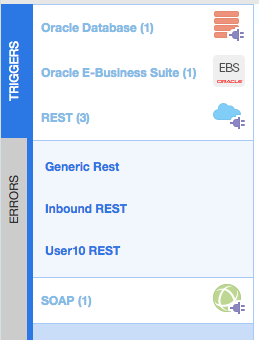

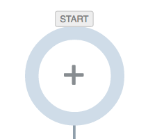

**1.7** Fill in the required values on **Basic Info** page, and click **Next >**

- **What do you want to call your endpoint?** _echo_
- **What is the endpoint's relative resource URI** _/echo_
- **What action does the endpoint perform?** _POST_
- **Configure a request payload for this endpoint** _Checked_
- **Configure for this endpoint to receive a response** _Checked_
- **Configure CORS (Cross Origin Resource Sharing)** _Checked_


**1.8** Select **JSON Sample**, select **JSON** in *type of payload* and click on **<<< inline >>>** to enter sample JSON

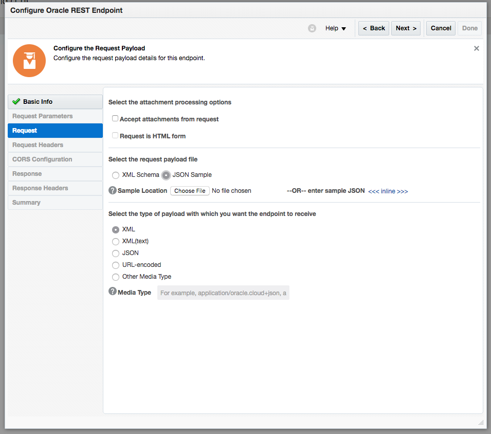

**1.9** Enter the following JSON into the **Enter Sample JSON**, and click **Ok**

```javascript
{
    "echo": "String to echo"
}
```


**1.10** Enable **CORS** for all domains, by entering **\*** in **Allowed Origins**

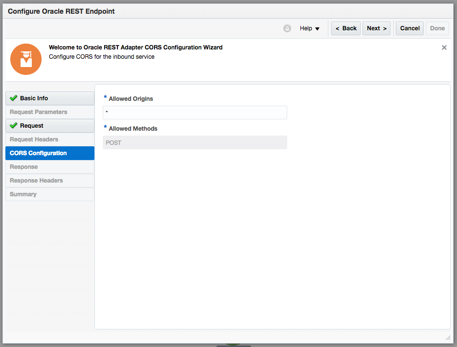

**1.11** Click on **Next >** to move on to the _Response_

**1.12** Select **JSON Sample**, select **JSON** in **type of payload** and click on **<<< inline >>>** to enter sample JSON

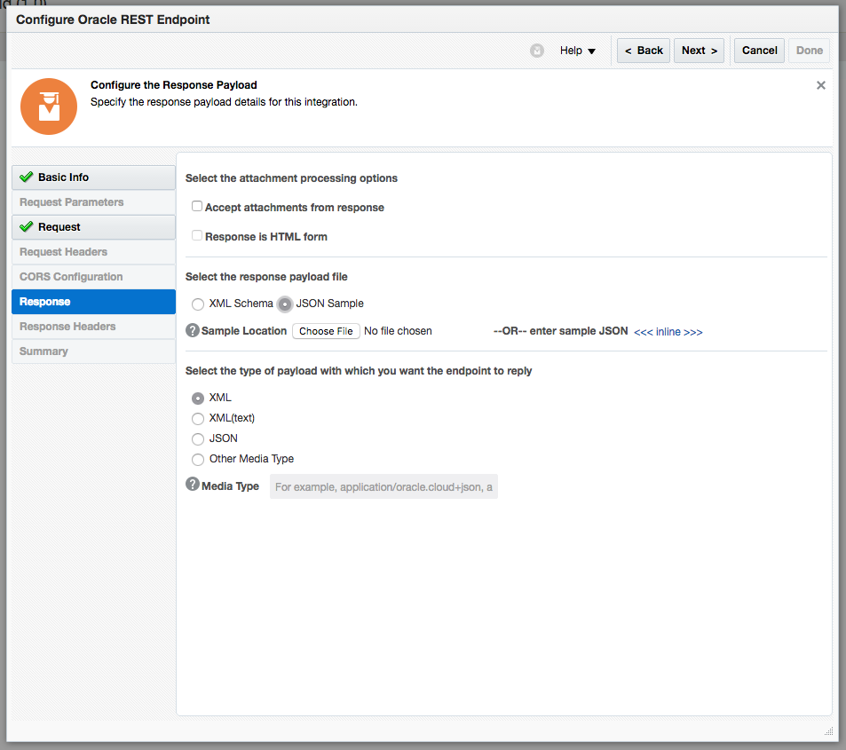

**1.13** Enter the following JSON into the **Enter Sample JSON**, and click **Ok**

```javascript
{
    "return": "String to echo"
}
```

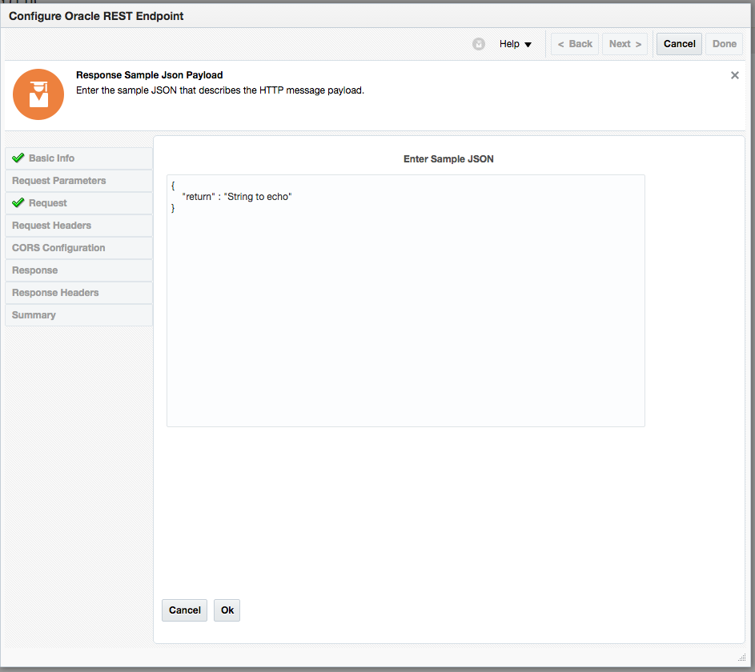

**1.14** Back on the Request Page,  click **Next >**

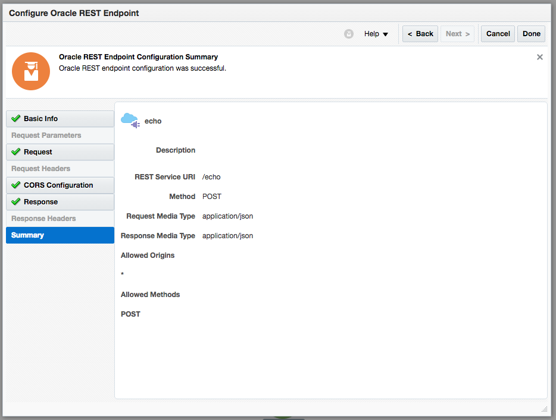

**1.15** Click **Done**. The full flow will now be presented:


**1.16** Click on the _echo_ **Map**, and then on _pencil_ icon


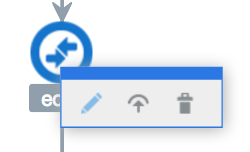

The _Mapper_ page will appear

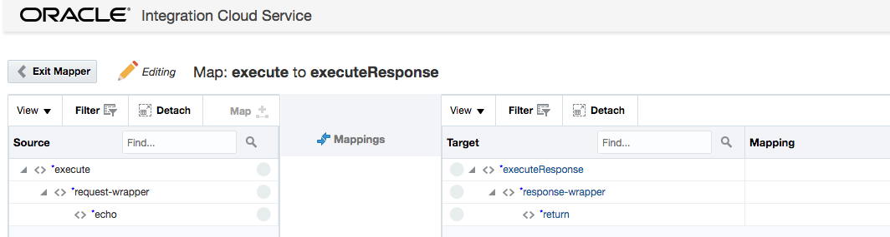

**1.17** Drag the **\<\>\*echo** and drop on to **\<\> \*return** 


**1.18** Click on **Save** 


**1.19** Click on **< Exit Mapper**

You will notice that your flow is _all green_ now.

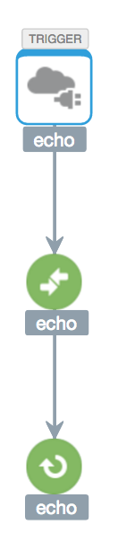

**1.20** Click on **Tracking**


**1.21** Drag **\*echo** across to the right hand side, under **Tracking Field**


**1.22** Click on **Done**

**1.23** Click on **Save** and the **< Exit Integration**


You should see your _New_ integration in list of _Integrations_


### Activating Integration

**1.1** Click on the switch next to your integration to activate


**1.2** On the **Activate Integration ?** popup window, select **Enable Tracing** and click on **Activate**


**1.3** Capture the link displayed after activation

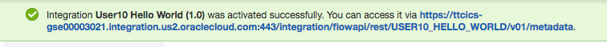

If you need the URL again, you can always get back to it by clicking on the **i** icon of your active integration

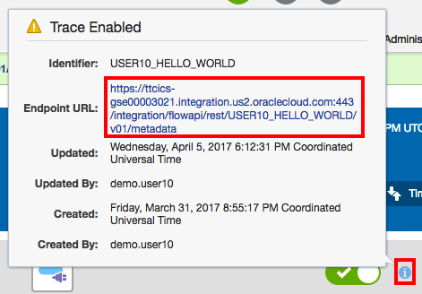

## Testing Integration

Testing the activated integration can be done using multiple tools and depends on your preference. See each relevant product's website on how to install the tool, if required.

----

### **APIARY** Swagger	_WORK IN PROGRESS_

----

Apiary does not support Swagger (JSON) format at the moment, so we first have to convert the Swagger JSON into Swagger.

**1.1** Back in a browser window, open the URL we have captured in **Activating Integration**, step **1.3**. Append ***/swagger*** - supply your username and password if asked for it.

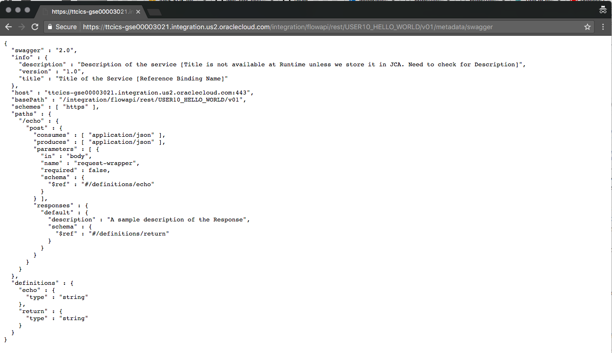

**1.2** Copy the Swagger text displayed in the browser window, it should look similar to the following. 

```javascript
{
  "swagger" : "2.0",
  "info" : {
    "description" : "Description of the service [Title is not available at Runtime unless we store it in JCA. Need to check for Description]",
    "version" : "1.0",
    "title" : "Title of the Service [Reference Binding Name]"
  },
  "host" : "ttcics-gse00003021.integration.us2.oraclecloud.com:443",
  "basePath" : "/integration/flowapi/rest/USERXX_HELLO_WORLD/v01",
  "schemes" : [ "https" ],
  "paths" : {
    "/echo" : {
      "post" : {
        "consumes" : [ "application/json" ],
        "produces" : [ "application/json" ],
        "parameters" : [ {
          "in" : "body",
          "name" : "request-wrapper",
          "required" : false,
          "schema" : {
            "$ref" : "#/definitions/echo"
          }
        } ],
        "responses" : {
          "default" : {
            "description" : "A sample description of the Response",
            "schema" : {
              "$ref" : "#/definitions/return"
            }
          }
        }
      }
    }
  },
  "definitions" : {
    "echo" : {
      "type" : "string"
    },
    "return" : {
      "type" : "string"
    }
  }
}
```

**1.3** Open http://editor.swagger.io 

**1.4** Open File -> Paste JSON...

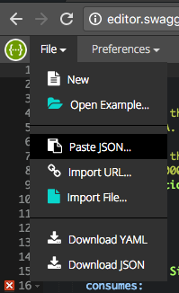

**1.5** Paste the Swagger JSON in the text box, and click on **Import**

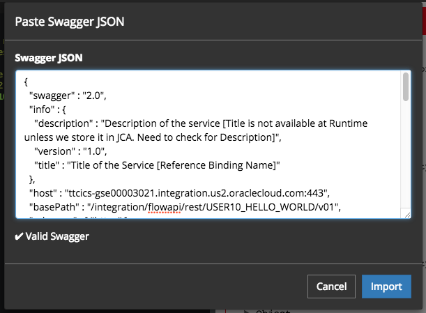

**1.6** In the editor you will see Swagger YAML. Copy this text.

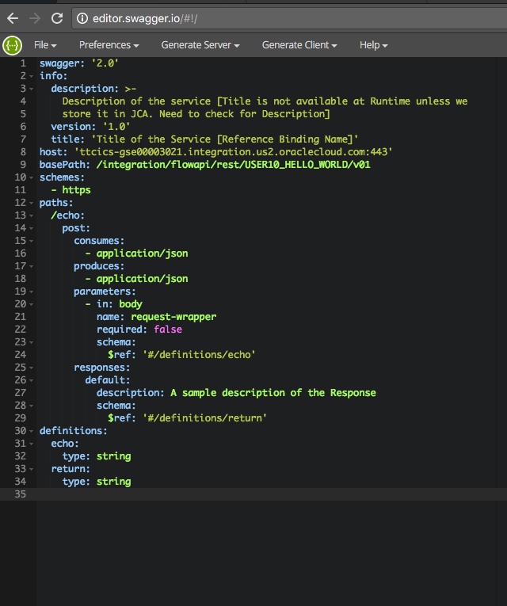

**1.7** Log into APIARY 

>**Note:** Follow instructions on the APIARY website to create an account.

**1.8** Create new API, making sure to **Start your API in** _Swagger_

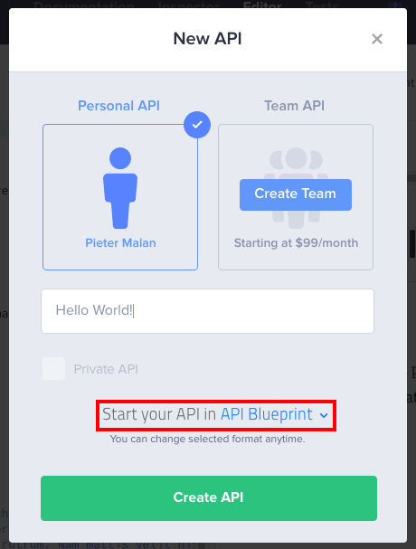

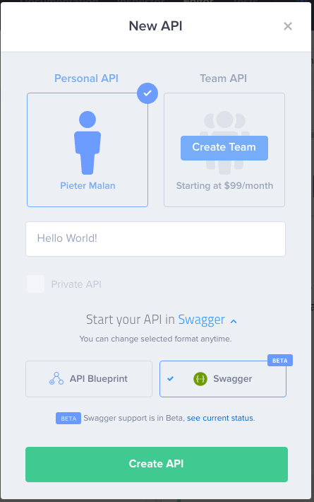

**1.9** Copy your selected text (from 1.6) into the editor in the left side

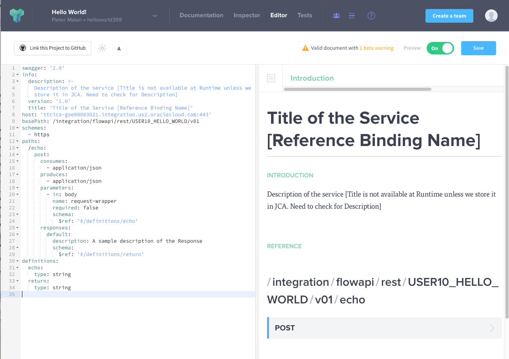

**1.10** Now, we have to add security definitions. 

- Change the code to the following, changes __marked <--__

```
swagger: '2.0'
info:
  description: >-
    Description of the service [Title is not available at Runtime unless we
    store it in JCA. Need to check for Description]
  version: '1.0'
  title: 'Title of the Service [Reference Binding Name]'
host: 'ttcics-gse00003021.integration.us2.oraclecloud.com:443'
basePath: /integration/flowapi/rest/USER10_HELLO_WORLD/v01
schemes:
  - https 
```
<-- Insert the following 
```
securityDefinitions:
  basicAuth:
    type: basic
    description: HTTP Basic Authentication. 
```
<-- Up to here
```
paths:
  /echo:
    post:
```
<-- Insert the following
```
      security:
       - basicAuth: []
```
<-- Up to here 
```
      consumes:
        - application/json
      produces:
        - application/json
      parameters:
        - in: body
          name: request-wrapper
          required: true
          schema:
            $ref: '#/definitions/echo'
      responses:
        default:
          description: A sample description of the Response
          schema:
            $ref: '#/definitions/return'
definitions:
  echo:
    type: string
  return:
    type: string

```

----

### **APIARY BluePrint**	

----


----

### **POSTMAN**	

----

**1.1** Got to URL **chrome:/apps** in _Chrome_ and open POSTMAN

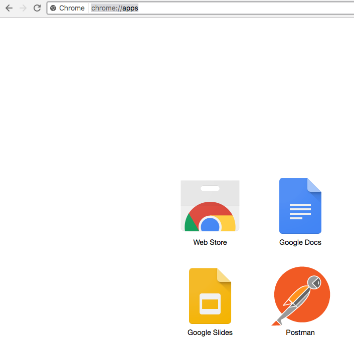

**1.2** Click on the **Import** on the main title bar


**1.3** Back in a browser window, open the URL we have captured in **Activating Integration**, step **1.3**. Append ***/swagger*** - supply your username and password if asked gor it.


**1.4** Copy the Swagger text displayed in the browser window, it should look similar to the following. 

```javascript
{
  "swagger" : "2.0",
  "info" : {
    "description" : "Description of the service [Title is not available at Runtime unless we store it in JCA. Need to check for Description]",
    "version" : "1.0",
    "title" : "Title of the Service [Reference Binding Name]"
  },
  "host" : "ttcics-gse00003021.integration.us2.oraclecloud.com:443",
  "basePath" : "/integration/flowapi/rest/USERXX_HELLO_WORLD/v01",
  "schemes" : [ "https" ],
  "paths" : {
    "/echo" : {
      "post" : {
        "consumes" : [ "application/json" ],
        "produces" : [ "application/json" ],
        "parameters" : [ {
          "in" : "body",
          "name" : "request-wrapper",
          "required" : false,
          "schema" : {
            "$ref" : "#/definitions/echo"
          }
        } ],
        "responses" : {
          "default" : {
            "description" : "A sample description of the Response",
            "schema" : {
              "$ref" : "#/definitions/return"
            }
          }
        }
      }
    }
  },
  "definitions" : {
    "echo" : {
      "type" : "string"
    },
    "return" : {
      "type" : "string"
    }
  }
}
```

**1.5** Back in POSTMAN, select **Paste Raw Text**, and paste the text into the text box 

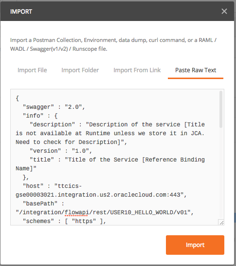

**1.6** Click on **Import** to import in POSTMAN

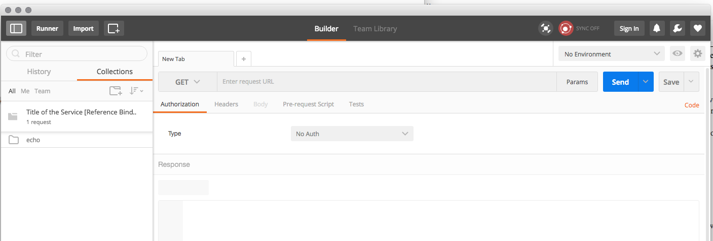

**1.7** Click on the **Authorization** tab

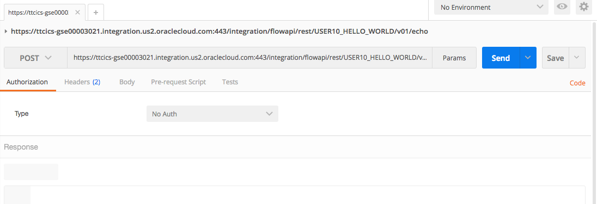

**1.8** Change the Authorization settings as follow:

- **Type**     _Basic Auth_

- **Username** _demo.userXX_

- **Password** _YOURPASSWORD FOR ICS_

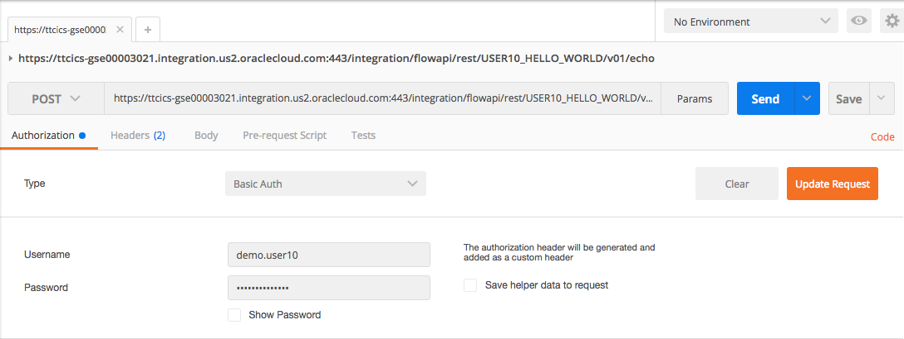

**1.9** Click **Update Request**

**1.10** Click on the **Body** tab, make sure **raw** and **JSON(application/json)** is selected. Enter the following text in to the body text box

````javascript
{
    "echo":"Hello World!"
}
````

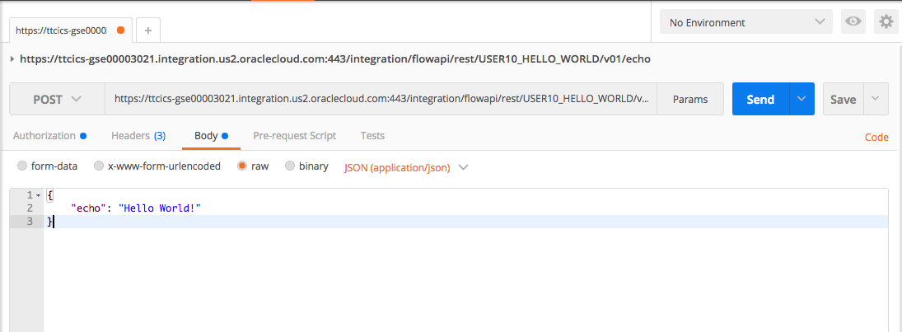

**1.11** Click on the blue **Send**. Look at the bottom to see the output, the Body should contain the following value, and the Status should indicate a **200 OK** 

````javascript
{
    "return":"Hello World!"
}
````

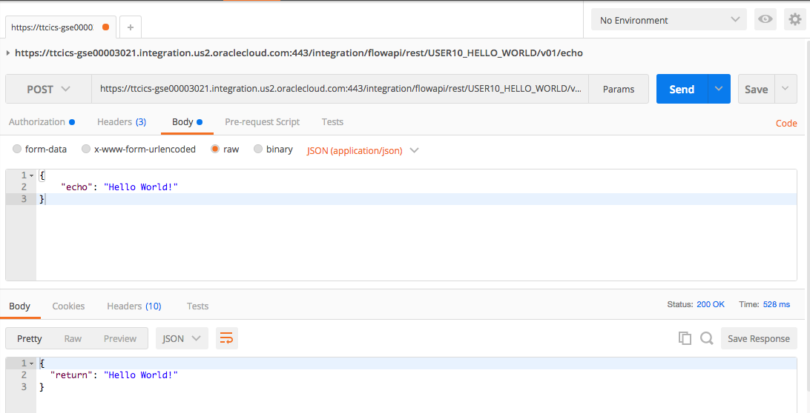

----

### **Swagger Editor**	

----

**1.1** Back in a browser window, open the URL we have captured in **Activating Integration**, step **1.3**. Append ***/swagger*** - supply your username and password if asked for it.


**1.2** Copy the Swagger text displayed in the browser window, it should look similar to the following. 

```javascript
{
  "swagger" : "2.0",
  "info" : {
    "description" : "Description of the service [Title is not available at Runtime unless we store it in JCA. Need to check for Description]",
    "version" : "1.0",
    "title" : "Title of the Service [Reference Binding Name]"
  },
  "host" : "ttcics-gse00003021.integration.us2.oraclecloud.com:443",
  "basePath" : "/integration/flowapi/rest/USERXX_HELLO_WORLD/v01",
  "schemes" : [ "https" ],
  "paths" : {
    "/echo" : {
      "post" : {
        "consumes" : [ "application/json" ],
        "produces" : [ "application/json" ],
        "parameters" : [ {
          "in" : "body",
          "name" : "request-wrapper",
          "required" : false,
          "schema" : {
            "$ref" : "#/definitions/echo"
          }
        } ],
        "responses" : {
          "default" : {
            "description" : "A sample description of the Response",
            "schema" : {
              "$ref" : "#/definitions/return"
            }
          }
        }
      }
    }
  },
  "definitions" : {
    "echo" : {
      "type" : "string"
    },
    "return" : {
      "type" : "string"
    }
  }
}
```

**1.3** Open http://editor.swagger.io 

**1.4** Open File -> Paste JSON...


**1.5** Paste the Swagger JSON in the text box, and click on **Import**


**1.6** In the editor you will see Swagger YAML. Change this text to add the security definition


- Change the code to the following, changes __marked <--__

```
swagger: '2.0'
info:
  description: >-
    Description of the service [Title is not available at Runtime unless we
    store it in JCA. Need to check for Description]
  version: '1.0'
  title: 'Title of the Service [Reference Binding Name]'
host: 'ttcics-gse00003021.integration.us2.oraclecloud.com:443'
basePath: /integration/flowapi/rest/USER10_HELLO_WORLD/v01
schemes:
  - https 
```
<-- Insert the following 
```
securityDefinitions:
  basicAuth:
    type: basic
    description: HTTP Basic Authentication. 
```
<-- Up to here
```
paths:
  /echo:
    post:
```
<-- Insert the following
```
      security:
       - basicAuth: []
```
<-- Up to here 
```
      consumes:
        - application/json
      produces:
        - application/json
      parameters:
        - in: body
          name: request-wrapper
          required: true
          schema:
            $ref: '#/definitions/echo'
      responses:
        default:
          description: A sample description of the Response
          schema:
            $ref: '#/definitions/return'
definitions:
  echo:
    type: string
  return:
    type: string

```

**1.7** Next we have change the input/out parameters

In the parameters and reponses, we have to change the definitions:

```` javascript

parameters:
        - in: body
          name: body
          description: Updated user object
          required: true
          schema:
            $ref: '#/definitions/echoBody'
      responses:
        '200':
          description: successful operation
          schema:
            $ref: '#/definitions/return'
        default:
          description: Error occured

````

And then define the schemas under definitions

```` javascript
definitions:
  echoBody:
    type: object
    properties:
      echo:
          type: string 
  return:
    type: object
    properties: 
      return:
        type: string
````

**1.8** Do the authentication call

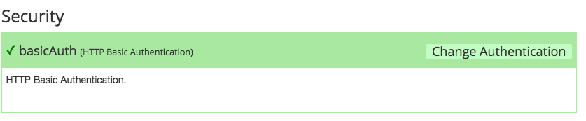

**1.9** Fill in your username and password for ICS, and click **Authenticate**

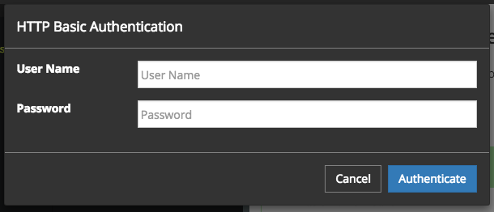

**1.10** Click **Try this operation**


**1.11** Fill in our **echo** value. Notice the change in the body underneath
----

### **SOAPUI**

----

**1.1** Open SOAPUI

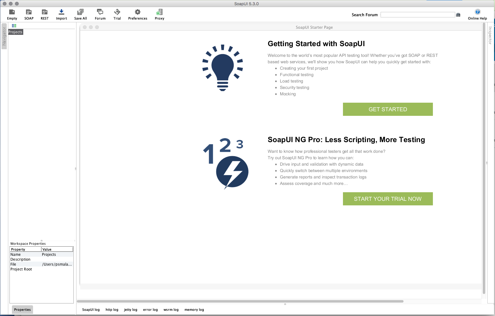

**1.2** Right click on **Projects** and select **Create Empty Project**

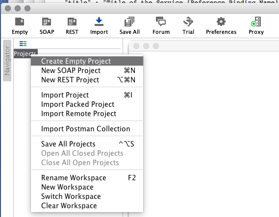

**1.3** Right click on the new **Project1** and select **Import Swagger**

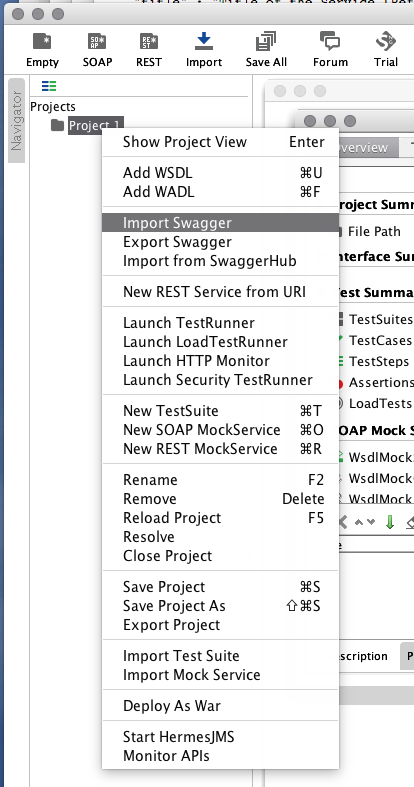

**1.4** Fill in the **Swagger Definition:** using the URL we have captured in **Activating Integration**, step **1.3**. Append ***/swagger*** 
Click on **OK** to import Swagger from ICS

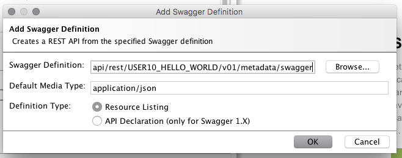

**1.5** When asked for credentials, enter your ICS user credentials

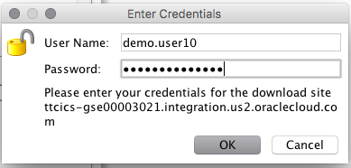

**1.6** Expand **Project 1** to show the **Request 1**. Double Click the **Request 1** to open the Request Window

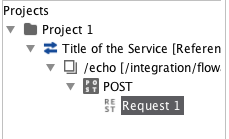

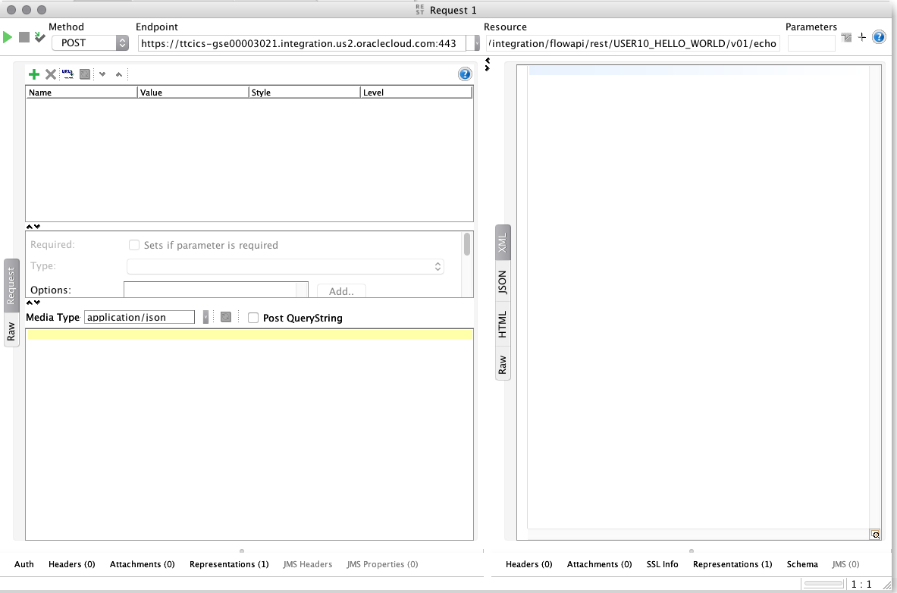

**1.6** Click on the Auth tab on the left hand bottom of the **Request 1** Window and select **Add New Authorization**

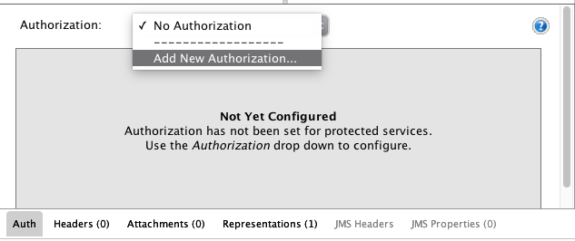

**1.7** Select **Basic** in the popup window


**1.8** Fill your username and password

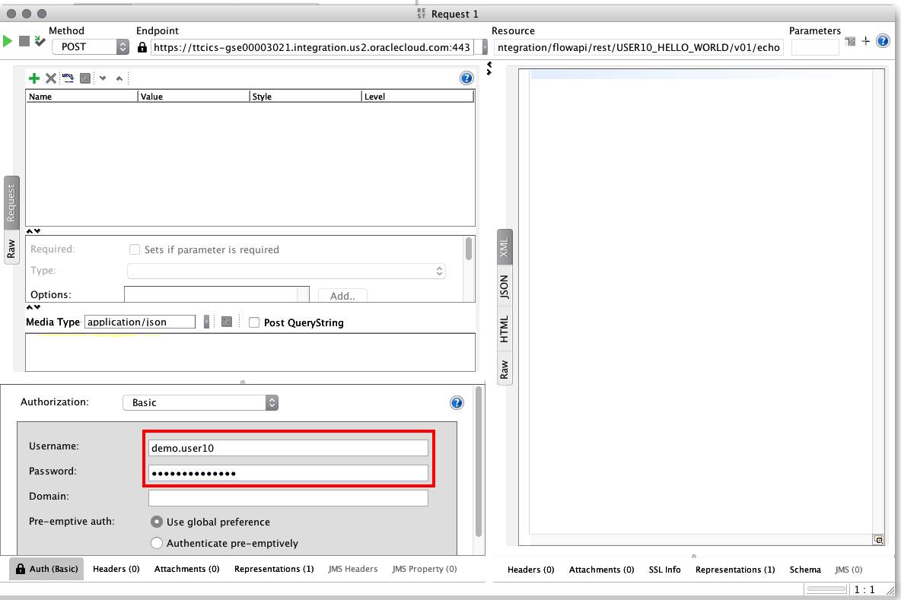

**1.9** Fill in the request body with following JSON:

```javascript
{ "echo": "Hello World!" }
```

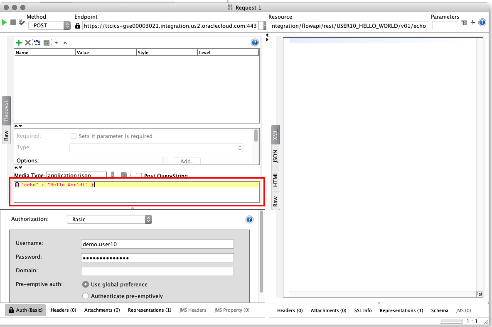

**1.10** Click on the green **Run** triangle at top **Request 1** Window

**1.11** Last step is to switch to JSON Format in the output panel

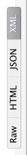

And you should be able to see an **echo** of your input in the output panel 

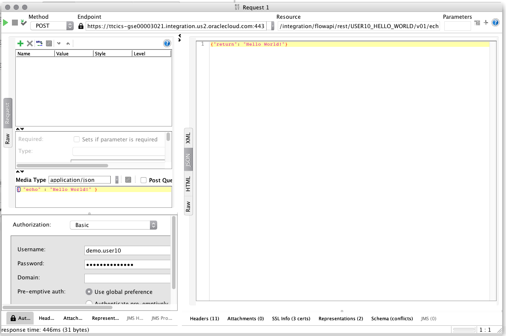

- This Lab is now completed.


