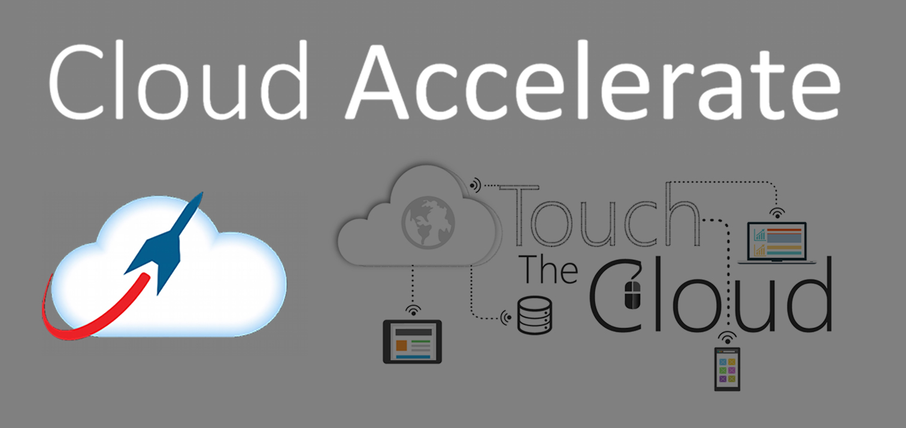  

Update: April 22, 2017

# Lab 400 - Modify an ICS Integration by adding an EBS Adapter and API call

---

## Introduction

This is the forth of several labs that are part of the **ICS Development** workshop. 

In this lab, you modify the integration that was created in Lab 300 using the ICS EBS adapter to call an EBS API in order to create an Order in EBS using the Order Management module.

The ICS integration that we'll be building is shown in the following picture:

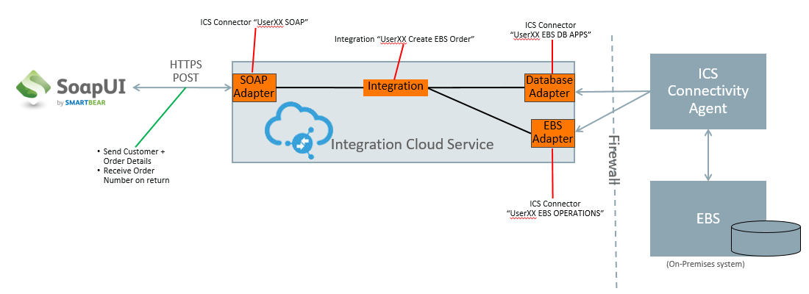

Here is a description of what is happening with this integration:

SoapUI will be used to test the exposed Web Service endpoint of the ICS integration called *UserXX Create EBS Order* (where XX will be 00 -> 10).  This integration has 3 connections.  The incoming message is received by the incoming *UserXX SOAP* Soap Connection.  The *UserXX Create EBS Order* orchestration makes 2 queries into the EBS database using the *UserXX EBS DB APPS* connection to get details needed to create an order.  The orchestration finally uses the *UserXX EBS OPERATIONS* EBS Adapter connection for creating the order in EBS.  After the order is created in EBS, the Order Number is returned to the calling web service.

## Objectives

- Learn how to create ICS EBS Adapter Connections
- Learn how to modify an ICS Orchestration to use the new EBS Adapter
- Test the updated ICS integration using SoapUI

## Required Artifacts

- The following lab and an Oracle Public Cloud account that will be supplied by your instructor.
- An EBS instance and connection URL that will be provided by your instructor.
- Completion of the previous *Lab 300*
- SoapUI will need to be installed for ICS integration testing - see *Prerequisites* section of the workshop for details

## Part 1: Create the EBS Connection

### **1.1**: Login to your Oracle Cloud account

------

**1.1.1** From your browser (Firefox or Chrome recommended) go to the following URL:
<https://cloud.oracle.com>

**1.1.2** Click Sign In in the upper right hand corner of the browser
**IMPORTANT** - Under My Services, change Data Center to `US Commercial 2 (us2)` and click on Sign In to My Services

**1.1.3** If your identity domain is not already set, enter it and click *Go*

**NOTE:** the *Identity Domain* values will be given to you from your instructor.

  

**1.1.4** Once your Identity Domain is set, enter your `User Name` and `Password` and click *Sign In*

***NOTE:*** the *User Name and Password* values will be given to you by your instructor.

  

**1.1.5** You will be presented with a Dashboard displaying the various cloud services available to this account.

**NOTE:** The Cloud Services dashboard is intended to be used by the *Cloud Administrator* user role.  The Cloud Administrator is responsible for adding users, service instances, and monitoring usage of the Oracle cloud service account.  Developers and Operations roles will go directly to the service console link, not through the service dashboard.

**1.1.6**  To get to the Integration Cloud Service (ICS) service console where you will work on developing the integration, click on the `hamburger` icon, then click on the `View Details` link.

**1.1.7**  Select the `Open Service Console` link to go to the ICS Service Console.  

  

**1.1.8**  You will now be presented with the ICS Service Console from which you will be performing the rest of this workshop lab.

  

### **1.2**: Create the EBS Connector

---

**1.2.1** Select the `Connections` graphic in the designer portal

 

**1.2.2** Click on *New Connection*

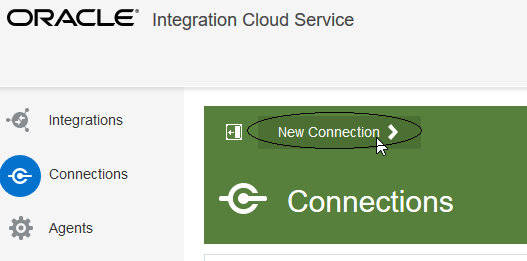 

**1.2.3** Select the *Oracle E-Business Suite* Connection, by either doing a search, or by scrolling down to the *Oracle E-Business Suite* connection, then click on the *Select* button of the *Oracle E-Business Suite* connection.

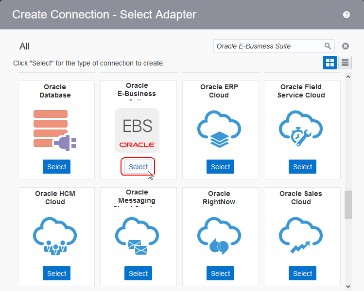

**1.2.4** Fill in the information for the new connection 

- *Name:* Enter in the form of _UserXX EBS OPERATIONS_ where XX is the number in your allocated user.
- *Role:* Select _Invoke_ since we going to use the connection to invoke APIs from EBS

Note that the *Identifier* will automatically be created based on the *Name* you entered.

**1.2.5** Click *Create*

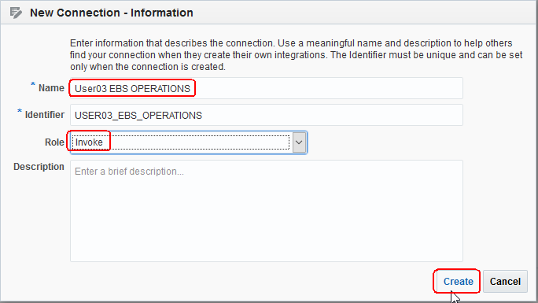

**1.2.6** Click the *Configure Connectivity* button

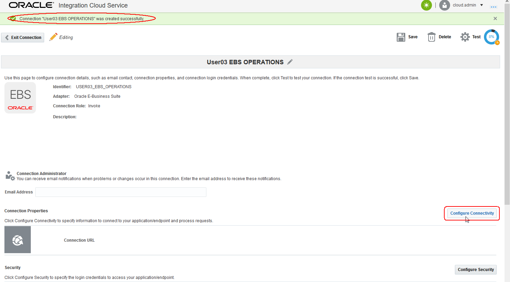

**1.2.7** Enter the *Connection URL* which you will be given by your instructor.  It will be in format like the following: `https://ucf4-ebs0116-gse.oracledemos.com`.

**1.2.8** After entering the *Connection URL*, select the *OK* button to save the value.

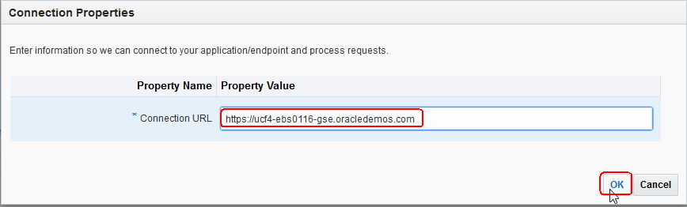

**1.2.9** Select the *Configure Security* button so we can change the default security configuration

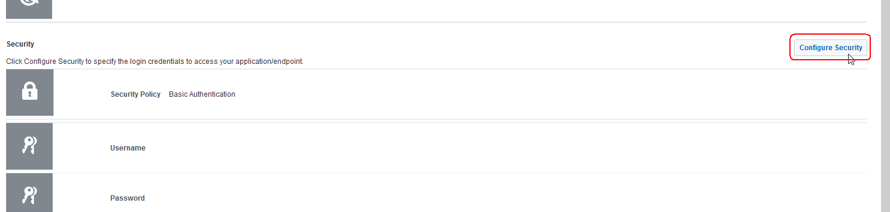

**1.2.10** Select the following options:

- *Security Policy*: `Basic Authentication`
- *Username*: `operations`
- *Password*: `welcome`

After the security policy properties have been setup, click on the *OK* button to dismiss the dialog

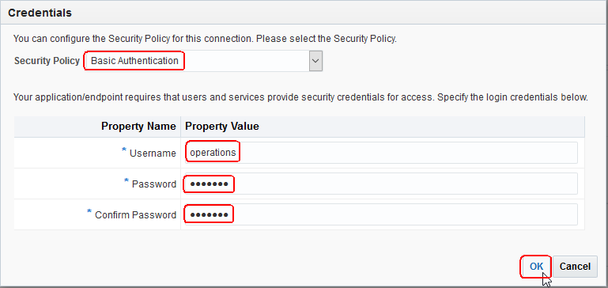

**1.2.11** Next, select the *Configure Agents* button so we can setup the association between this adapter and the ICS Connectivity Agent

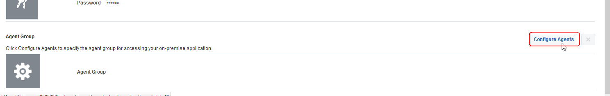

**1.2.12** Click on the only agent group `EBS_AGENT_GROUP`, then select the *Use* button

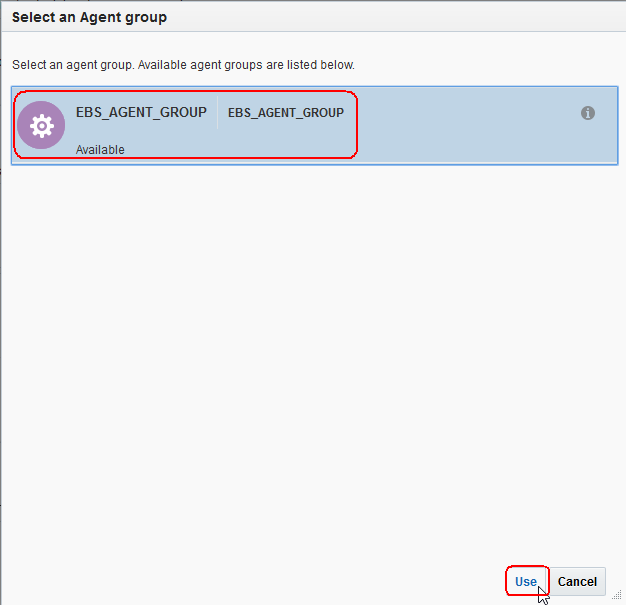

**1.2.13** The connection needs to be tested by clicking on the *Test* button in the upper-right of the *UserXX EBS Operations* connection definition page

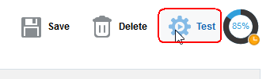

**1.2.14** Now, select the *Save* button to save the connection configuration.

**1.2.15** Note that after the successful test, the percentage complete in the upper-right should go to *100%*.  After the save, a green banner message will appear in the top indicating a successful save operation.

**1.2.16** Finally, select the *< Exit Connection* button to exit the connection configuration screen.

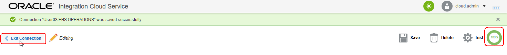

**1.2.17** You will now see your new **Oracle E-Business Suite** connection on top of the **Connections** list.

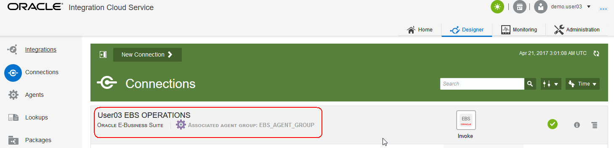

## Part 2: Modify the ICS Integration to Create an Order in EBS

In this second part of the lab, we will change the *UserXX Create EBS Order* ICS integration created in Lab 300 in order to use the EBS connection, just configured, to create an order in EBS.

### **2.1:** Open the ICS Design Console

---

**2.1.1** Select the `Designer` tab on top of the ICS Service Console to go to the `ICS Designer Portal`.

**2.1.2** Select the `Integrations` icon

   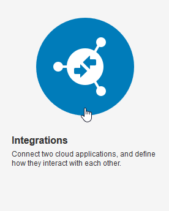

### **2.2:** Deactivate and Open the Integration for Editing

**2.2.1** Click on the green slider switch on the right side of the *UserXX Create EBS Order* integration to initiate deactivation.  We need to deactivate the integration before we are able to edit it.

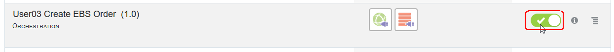

**2.2.2** Select *Deactivate* in order to deactivate the integration.

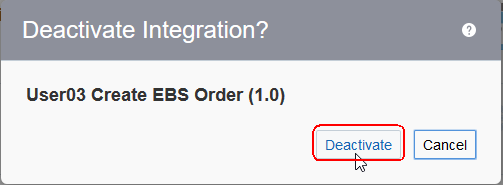

**2.2.3** Click on the orchestration name so that we can go to the integration editor.  In the image below `User03 Create EBS Order` is the hot-link to select.

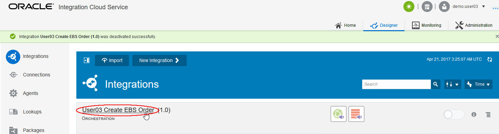

### **2.3:** Add the Invocation to EBS to the Orchestration

**2.3.1** Select *Invoke* on the left-hand navigation in order to open up the list of connections that were configured to be the *Invoke* type

**2.3.2** Select *Oracle E-Business Suite* connector types then click on the connector you just created (in the picture below it is the `User03 EBS OPERATIONS` connector)

**2.3.3** Click and drag the connection just under the *getCustomerShippingInfo* invocation

(_Note that the connector tray will go away after you select your connector and start to drag it_)

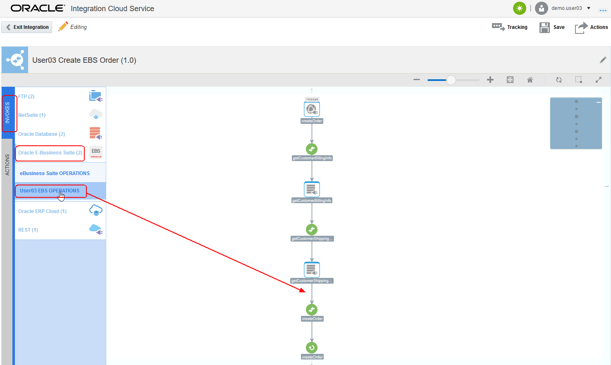

**2.3.4** Drop the connection on top of the green plus sign landing zone which will appear just below the *getCustomerShippingInfo* invocation

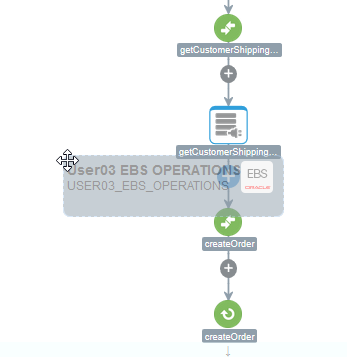

**2.3.5** In the *Basic Info* section of the _Configure Oracle E-Business Suite Adapter Endpoint_ wizard, give the endpoint a name of `createEBSOrder`.

**2.3.6** After giving the invocation a name, select the *Next* button.

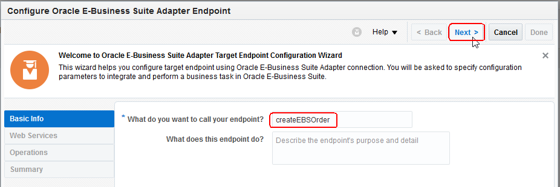

**2.3.7** In the *Web Services* section of the configuration wizard, for the *Product Family*, click on `=== Select ===` and then select `Order Management Suite`.  

(Note all the other EBS products for which APIs are available)

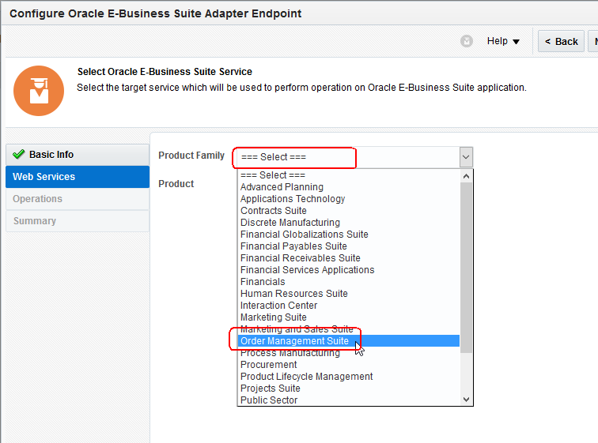

**2.3.8** Next, for the *Product*, click on `=== Select ===` and then select `Order Management`.  

(Note all the other EBS products for this suite which are available)

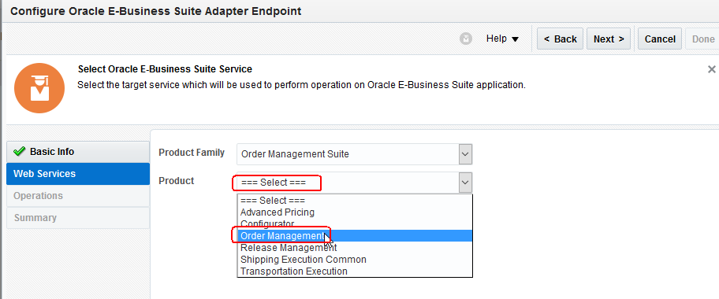

**2.3.9** Finally, for the *API*, scroll down and select the `Sales Order Services` API.  The *Internal Name* of `OE_INBOUND_INT` will automatically be populated.

**2.3.10** After selecting the API for the product family and product, select the *Next* button.

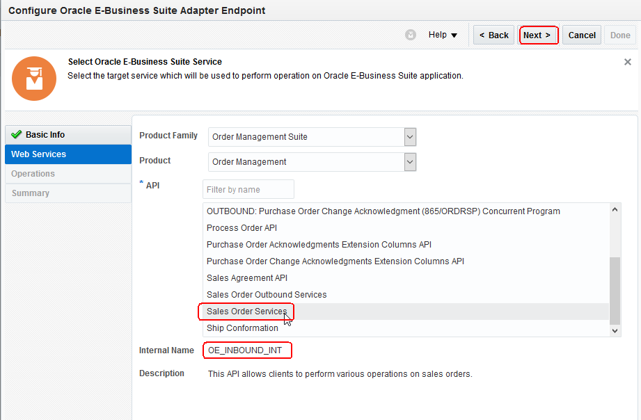

**2.3.11** In the *Operations* section of the configuration wizard, select the *Method* of `PROCESS_ORDER`, then select the *Next* button.

Note that the *Service Status* of `Ready to Use` indicates that the API has already been provisioned earlier from the EBS Integration Repository.

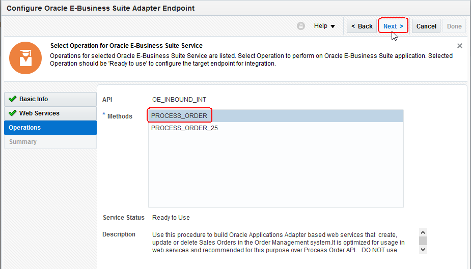

**2.3.12** In the *Summary* section of the configuration wizard, review the EBS API which is going to be used, then select the *Done* button.

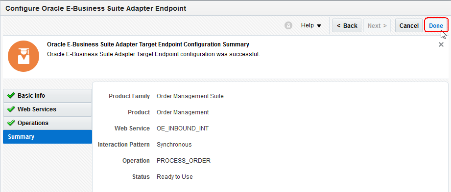

**2.3.13** Observe that both the mapping and invocation to the EBS adapter now show up in the orchestration with the name `createEBSOrder`.

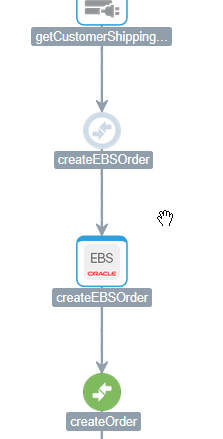

### **2.4:** Add Constant Variables for EBS Mapping

**2.4.1** Before we modify the mapping for the `PROCESS_ORDER` API, it's a good practice in ICS to create some variables in an *Assign* action to simplify the mapping process.  The variables can then also be reused across multiple API invocations if necessary.

**2.4.2** Click on the little house icon in the upper right of the designer in order to zoom into the top of the orchestration

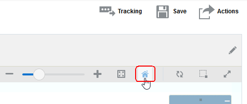

**2.4.3** Select *Actions* on the left-hand navigation in order to open up the list of available orchestration actions.

**2.4.4** Click on *Assign* then drag the action just under the *createOrder* trigger.  We're putting it there because we want to define our constant variables at the start of the orchestration.

Note that the action tray will go away after you select your connector and start to drag it

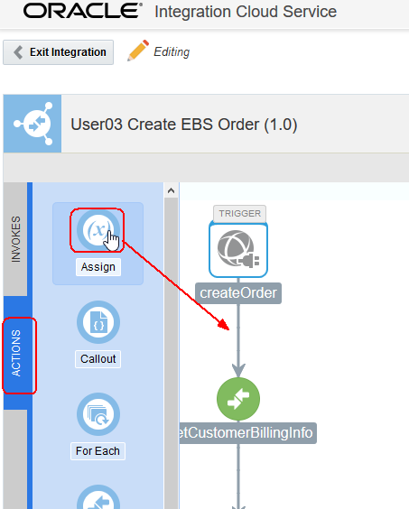

**2.4.5** Drop the *Assign* action on top of the green plus sign landing zone which will appear just below the *createOrder* trigger

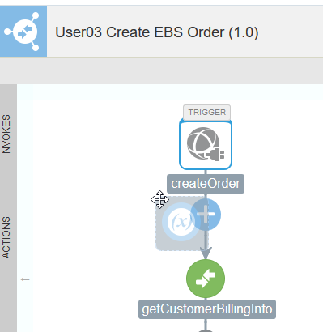

**2.4.6** Enter the *Name* of `initializeVariables` for this new assign action, then select the *OK* button.

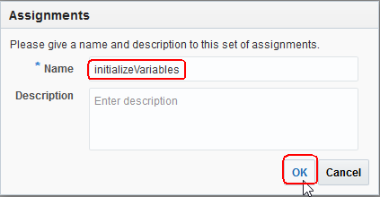

**2.4.7** Enter the variable name `EBS_Responsibility` in the *Name* column just to right of the little trash can.

**2.4.8** Next, click on the little pencil icon on the very right of the variable definition table to bring up the expression editor.

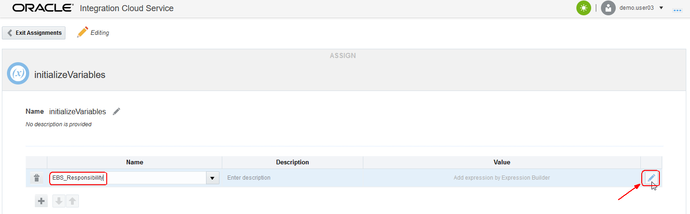

**2.4.9** Enter the constant *Expression* of `"ORDER_MGMT_SUPER_USER"` (with double quotes), then hit the *Exit Expression Builder* button.

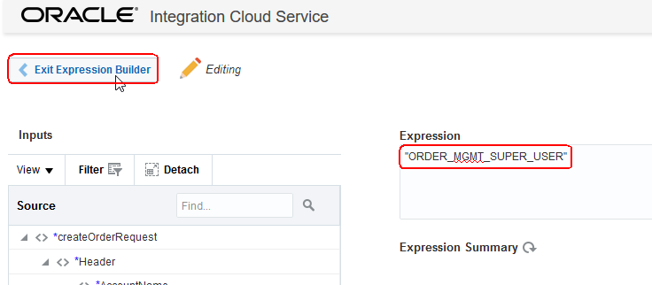

**2.4.10** A *Confirmation* dialog box will appear asking if you want to save your unsaved changes.  Select the *Yes* button.

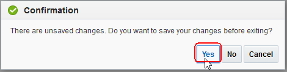

**2.4.11** Select the little plus sign in the lower left of the variable table (just below to the little trash can) in order to add the next variable assignment.

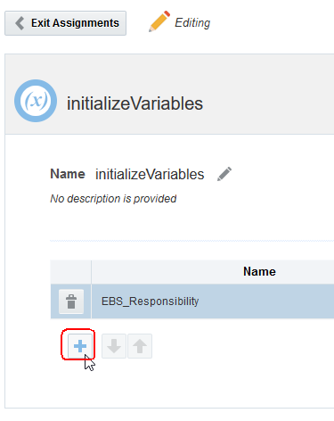

**2.4.12** Enter the following variables into the assignment action one at a time following the procedure described in 2.4.7 -> 2.4.11:

<dl>
<table>
  <tr>
    <th  style="background-color: #008000">Variable Name</th>
    <th  style="background-color: #008000">Value</th>
  </tr>
  <tr><td>EBS_RespApplication</td><td>"ONT"</td></tr>
  <tr><td>EBS_SecurityGroup</td><td>"STANDARD"</td></tr>
  <tr><td>EBS_NLSLanguage</td><td>"AMERICAN"</td></tr>
  <tr><td>EBS_OrgID</td><td>"204"</td></tr>
  <tr><td>EBS_API_Version_Number</td><td>"1.0"</td></tr>
  <tr><td>EBS_Sold_From_Org_ID</td><td>"204"</td></tr>
  <tr><td>EBS_Price_List_ID</td><td>"1000"</td></tr>
  <tr><td>EBS_Order_Type_ID</td><td>"1430"</td></tr>
</table>
</dl>

**2.4.13** After all the variables have been added to the assign action, select the *Exit Assignments* button.

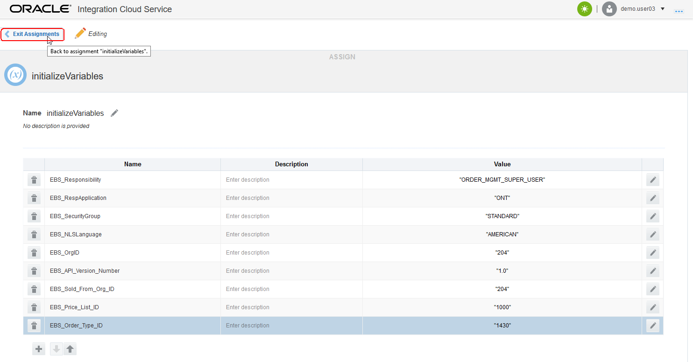

### **2.5**	Create the Mapping for the *createEBSOrder* API invocation

**2.5.1** The *createEBSOrder* mapping orchestration step is just above the corresponding *createEBSOrder* API invocation.

**2.5.2** Click on the double arrow mapping symbol to pop-up the edit pencil.

**2.5.3** Click on the little pencil to edit the mapping.

   

**2.5.4** Once the mapping editor is displayed, we can begin to map the constants we just previously created to the inbound payload for the EBS PROCESS_ORDER API

**2.5.5** We will first map the `Responsibility` target value.  Left-click and drag from the little circle just to the right of the `$EBS_Responsibility` variable in the Source variable list.

**2.5.6** Drop the `$EBS_Responsibility` on top of the little circle just to the left of the `Responsibility` variable in the Target on the right hand side of the mapping editor.

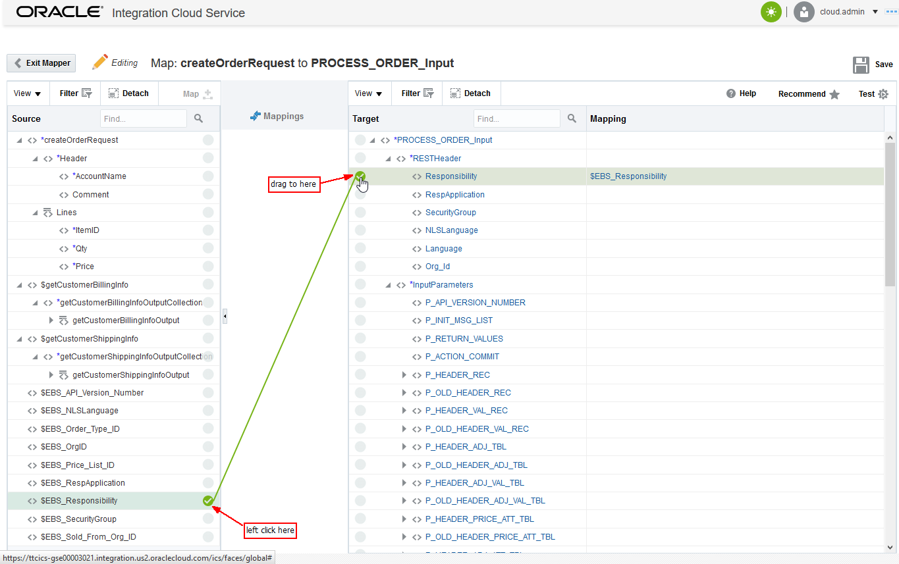

**2.5.7** Continue to map the first 6 constants according to the chart below

<dl>
<table>
  <tr>
    <th  style="background-color: #008000">Source Variable Name</th>
    <th  style="background-color: #008000">Target Variable Name</th>
  </tr>
  <tr><td>EBS_Responsibility</td><td>Responsibility</td></tr>
  <tr><td>EBS_RespApplication</td><td>RespApplication</td></tr>
  <tr><td>EBS_SecurityGroup</td><td>SecurityGroup</td></tr>
  <tr><td>EBS_NLSLanguage</td><td>NLSLanguage</td></tr>
  <tr><td>EBS_OrgID</td><td>Org_iD</td></tr>
  <tr><td>EBS_API_Version_Number</td><td>P_API_Version_Number</td></tr>
</table>
</dl>

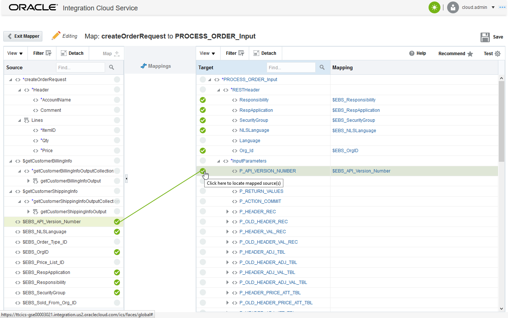

**2.5.8** Now we need to set the value of 3 of the EBS target variables to *True* by giving them the hard-coded value of `T`.

**2.5.9** Left-click on the Target variable `P_INIT_MSG_LIST` in order to bring up the advanced mapping editor

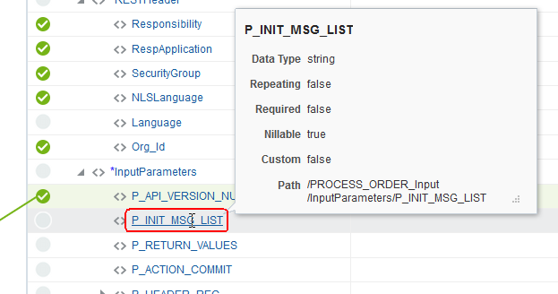

**2.5.10** In the *Build Mappings* screen left-click on the field labeled *-- Drag and Drop or Type here...* to get into the edit mode

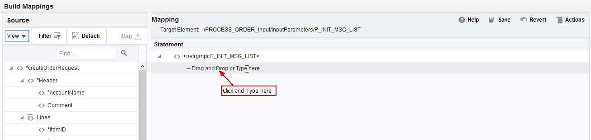

**2.5.11** Now type the constant letter `T` (with no quotes).

**2.5.12** After entering the value `T`, click on the *Save*, then *Close* buttons.

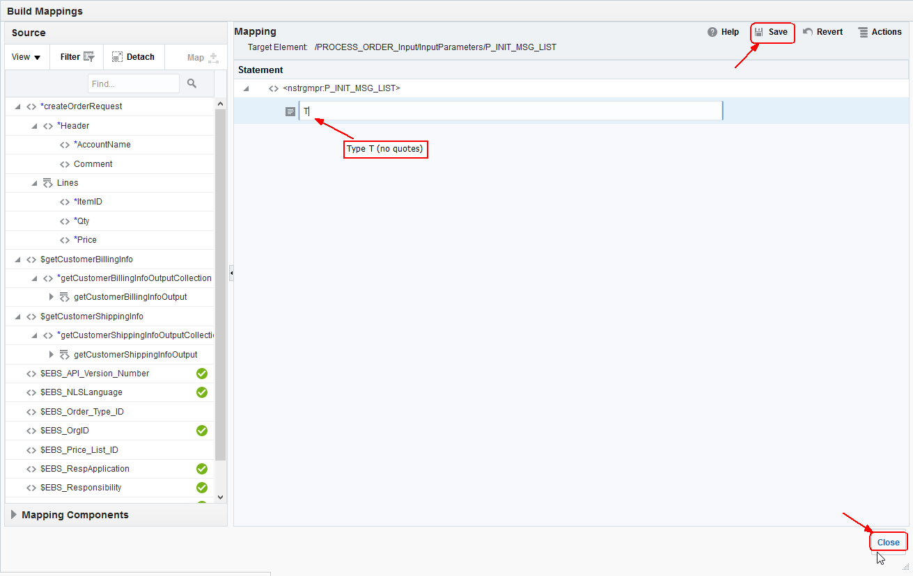

**2.5.13** Repeat steps 2.5.9 -> 2.5.12 for the following three target variables

<table>
  <tr>
    <th style="background-color: #008000">Target Variable Name</th>
  </tr>
  <tr><td>P_INIT_MSG_LIST</td></tr>
  <tr><td>P_RETURN_VALUES</td></tr>
  <tr><td>P_ACTION_COMMIT</td></tr>
  </table>

**2.5.14** After setting the constant variables to `T`, expand the `P_HEADER_REC` variable so we can map the header record values

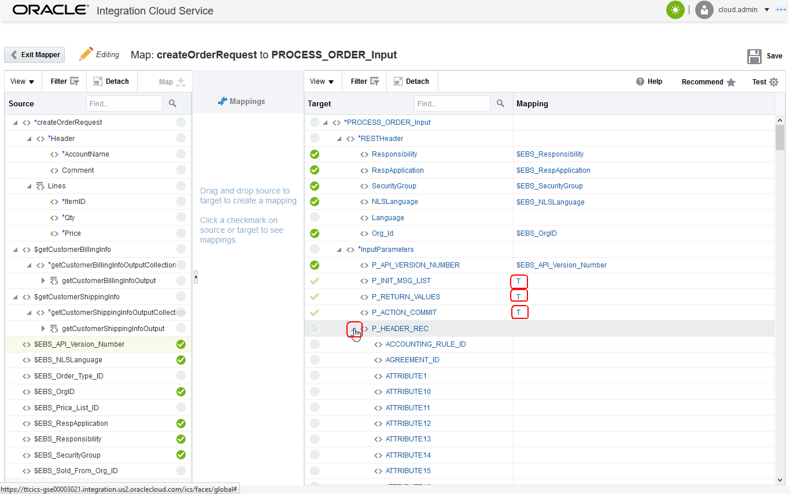

**2.5.15** 

XXXX

**2.2.3.2** We are going to map `Comment` source to the target called `ATTRIBUTE1` which is in the `P_HEADER_REC` section of the Target payload.

**2.2.3.3** Select the little arrow icon 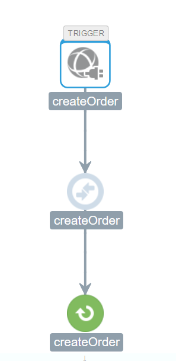 just to the left of the `P_HEADER_REC` in the Target payload to expand it and expose `ATTRIBUTE1`.

   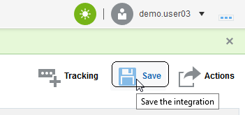

**2.2.3.4** Now that the `ATTRIBUTE1` variable can be seen, we can map the `Comment` source variable to it by dragging the little circle just to the right of the `Comment` variable over to the `ATTRIBUTE1` circle.

**2.2.3.5** Click and hold on the circle just to the right of the `Comment` Source variable then drag it on top of the little circle just to the left of the `ATTRIBUTE1` Target variable.

   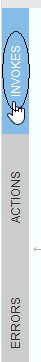

**2.2.3.6** Release the mouse on the little circle just to the left of the `ATTRIBUTE1` Target variable.

   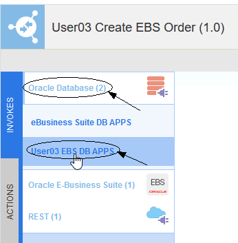

**2.2.3.7** You will now be able to see the two variables mapped together by the green line connecting them.  Also note that the `Comment` field is shown as the mapping to the right of the `ATTRIBUTE1` variable.

   

**2.2.3.8** Now we need to select the `Save` button in the upper right to save our mapping changes

   

### **2.2.4:**	Testing the Updated Mapping

---

**2.2.4.1** ICS has a built-in test harness so that you can see if the changes you made to your mapping actually work.

**2.2.4.2** First, select the `Test` button just below the `Save` button just pressed.

   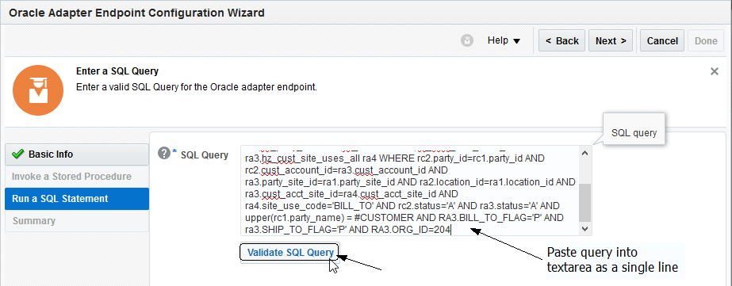

**2.2.4.3** Next, select the `Generate Inputs` button in the upper-right of the testing window.

   

**2.2.4.4** We want to put some interesting comment in the input `<ns0:Comment>` element in the `Input: createOrderRequest` incoming payload.

**2.2.4.5** Edit the data in the generated inbound payload to something custom.  In this example it was set to *This is my Comment!*

   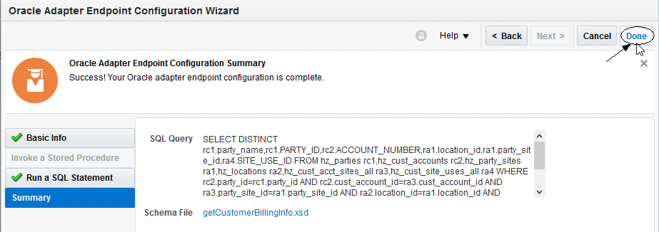

**2.2.4.6** Now that the input data is ready, select the `Execute` button in the upper-right of the test window.

   

**2.2.4.7** The mapping will be applied to the generated input data and the result will be shown in the `Output: PROCESS_ORDER_Input` section on the right side of the test window.

**2.2.4.8** Look for your custom comment and note that it has been mapped to the `P_HEADER_REC` -> `ATTRIBUTE1` element.

   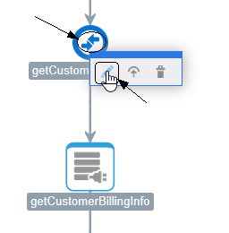

**2.2.4.9** Now that we have seen that our mapping has been successfully modified, we can close the test window.

**2.2.4.10** Select the `Close` button in the lower-right of the test window.

   

**2.2.4.11** Now we can close the Mapping Editor because our changes have been made and tested.

**2.2.4.12** Click on the `Exit Mapper` button in the upper-left of the Mapping Editor.

   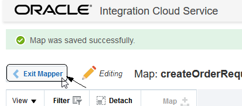

**2.2.4.13** Save your changes made to the cloned integration by pushing the `Save` button in the upper-right of the integration.

   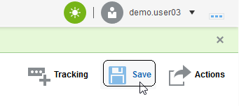

## 2.3: Add Tracking to the Integration

### **2.3.1:**	Open the “Tracking” editor

---

**2.3.1.1** We want to add the *Comment* we just mapped as a `Business Identifier`.  Business Identifiers enable runtime tracking on messages.  These identifiers will be saved in ICS’s monitoring tab for each instance of the integration that is run.

**2.3.1.2** Click on the `Tracking` button next to the *Save* button to bring up the business identifier editor.

   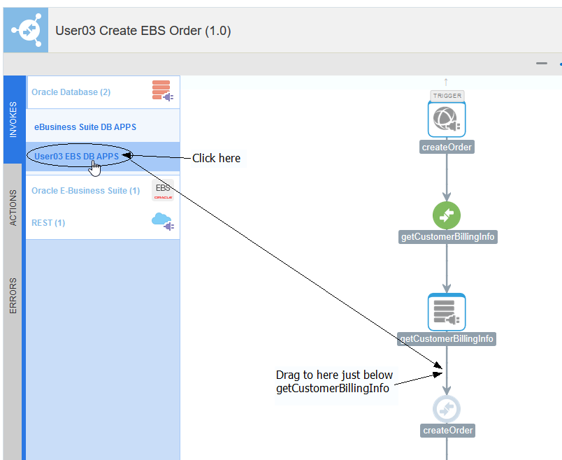

### **2.3.2:**	Add a “Business Identifier”

---

**2.3.2.1** The `Business Identifiers For Tracking` editor will be opened up

   

**2.3.2.2** Click on the *Comment* variable in the Source variable section.  The editor will show the metadata for this variable such as type, path, etc.

**2.3.2.3** Next, click on the `Shuttle Icon` to move the *Comment* variable over to be a new `Tracking Field`.

_(Note that you can also click and drag variables from the Source to the Tracking Field instead of using the shuttle icon)_

   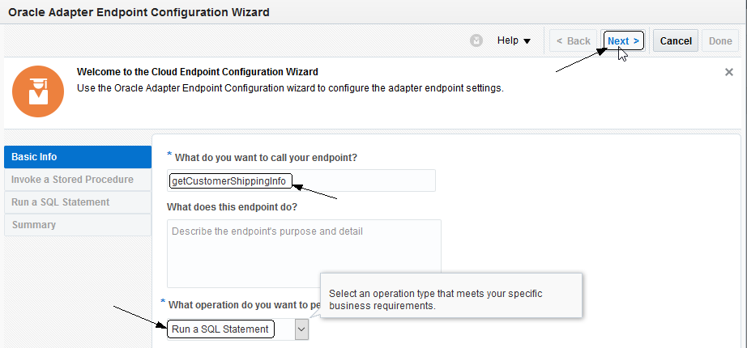

**2.3.2.4** Observe that the *Comment* variable has now been added as a `Tracking Field`.  The source variable name is also added as the `Tracking Name` by default – since *Comment* means something and is suitable for people to read in the monitoring tab we’ll keep it. If the comment variable was something random like *C2EF*, we would want to change it and give it a human-readable tracking name.

**2.3.2.5** Select the `Done` button now that the new `Business Identifier` has been added.

   

**2.3.2.6** Once again, click on the `Save` button to save the tracking changes.

   

**2.3.2.7** All modifications have now been made to the cloned integration.

**2.3.2.8** Select the `Exit Integration` button to go back to the ICS Designer Portal.

   

## 2.4: Activate Changes to the Integration

### **2.4.1:**	Select the “Activate” switch

---

**2.4.1.1** Click on the *Activate* switch/slider on the right of the cloned `Create EBS Order` integration.

   

**2.4.1.2** The `Activate Integration?` dialog will be displayed

**2.4.1.3** Select the *Enable tracing* button since this isn’t a production deployment.  This checkbox will tell ICS that the payloads for each instance of the integration will be saved in the logfiles as explored in the first part of this lab earlier.

**2.4.1.4** Now select the *Activate* button to begin activation of the integration.

   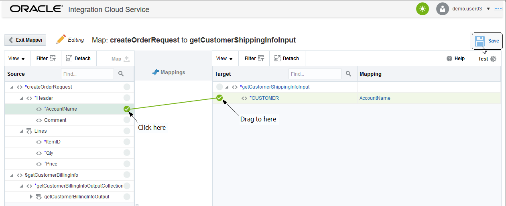

**2.4.1.5** The progress bar of the integration activation will move across the `Activate Integration?` dialog box.

   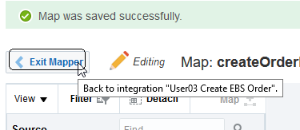

**2.4.1.6** Once the integration is activated you will see that the activation slider now is colored green with a checkmark in it.

**2.4.1.7** A message will appear on the top of the ICS Designer Portal indicating that the integration activation was successful.  The WSDL for the service endpoint will also be displayed.

   

### **2.4.2:**	Check the Service Endpoint

---

**2.4.2.1** Click on the WSDL link so we can ensure that this integration has an available service endpoint.

   

**2.4.2.2** The WSDL for you new ICS integration will now be displayed in your browser.

   

