---
# ORACLE Cloud-Native DevOps workshop #
-----
## Oracle Java Cloud Service Policy Based Auto Scaling ##

### Introduction ###
Scaling lets you add or remove resources for an Oracle Java Cloud Service instance on demand in response to changes in load on the service instance. You can scale an Oracle Java Cloud Service instance by scaling a cluster, a node, or the Coherence data tier in the service instance.
Oracle Java Cloud Service has Auto Scaling feature which allows you to define rule for a given service. When the rule's criteria meets the defined threshold Auto Scaling starts to scale in/out the service.

### About this tutorial ###
This tutorial demonstrates how to:

+ Create Auto Scaling rule

### Prerequisites ###

+ Oracle Public Cloud Services account including:
	+ Database Cloud Service
	+ Java Cloud Service
+ [Create Database Cloud Service Instance using user interface](../dbcs-create/README.md)
+ [Create Java Cloud Service Instance using user interface](../jcs-create/README.md)

### Steps ###

#### Build and Deploy Sample Load Generator Application ####

First you need to build the application which will generate load on the service instance's CPU. This is a simple Web Application which creates a large collection and repeatedly shuffle/order the elements in the list. Open a terminal and go to the folder `GIT_REPO_LOCAL_CLONE/jcs.autoscale` and run `mvn install`.

	[oracle@localhost u01]$ cd /u01/content/cloud-native-devops-workshop/jcs.autoscale/
	[oracle@localhost jcs.autoscale]$ mvn install
	[INFO] Scanning for projects...
	[INFO]                                                                         
	[INFO] ------------------------------------------------------------------------
	[INFO] Building Sample Load Generator Webapp 0.0.1
	[INFO] ------------------------------------------------------------------------
	Downloading: https://repo.maven.apache.org/maven2/org/apache/maven/plugins/maven-war-plugin/2.2/maven-war-plugin-2.2.pom
	...
	...
	...
	Downloaded: https://repo.maven.apache.org/maven2/org/apache/maven/shared/maven-filtering/1.0-beta-2/maven-filtering-1.0-beta-2.jar (33 KB at 74.5 KB/sec)
	[INFO] Packaging webapp
	[INFO] Assembling webapp [load] in [/u01/content/cloud-native-devops-workshop/jcs.autoscale/target/load]
	[INFO] Processing war project
	[INFO] Copying webapp resources [/u01/content/cloud-native-devops-workshop/jcs.autoscale/src/main/webapp]
	[INFO] Webapp assembled in [68 msecs]
	[INFO] Building war: /u01/content/cloud-native-devops-workshop/jcs.autoscale/target/load.war
	[INFO] WEB-INF/web.xml already added, skipping
	[INFO] 
	[INFO] --- maven-install-plugin:2.4:install (default-install) @ load ---
	[INFO] Installing /u01/content/cloud-native-devops-workshop/jcs.autoscale/target/load.war to /home/oracle/.m2/repository/com/oracle/sample/load/0.0.1/load-0.0.1.war
	[INFO] Installing /u01/content/cloud-native-devops-workshop/jcs.autoscale/pom.xml to /home/oracle/.m2/repository/com/oracle/sample/load/0.0.1/load-0.0.1.pom
	[INFO] ------------------------------------------------------------------------
	[INFO] BUILD SUCCESS
	[INFO] ------------------------------------------------------------------------
	[INFO] Total time: 6.958 s
	[INFO] Finished at: 2016-10-21T08:10:02-07:00
	[INFO] Final Memory: 14M/491M
	[INFO] ------------------------------------------------------------------------
	[oracle@localhost jcs.autoscale]$ 

Now [sign in](../common/sign.in.to.oracle.cloud.md) to [https://cloud.oracle.com/sign_in](https://cloud.oracle.com) and on the Dashboard Page click the **Java Instances** link. 

On the Console page select and click the Java Cloud Service name link where you want to deploy the Load Application.
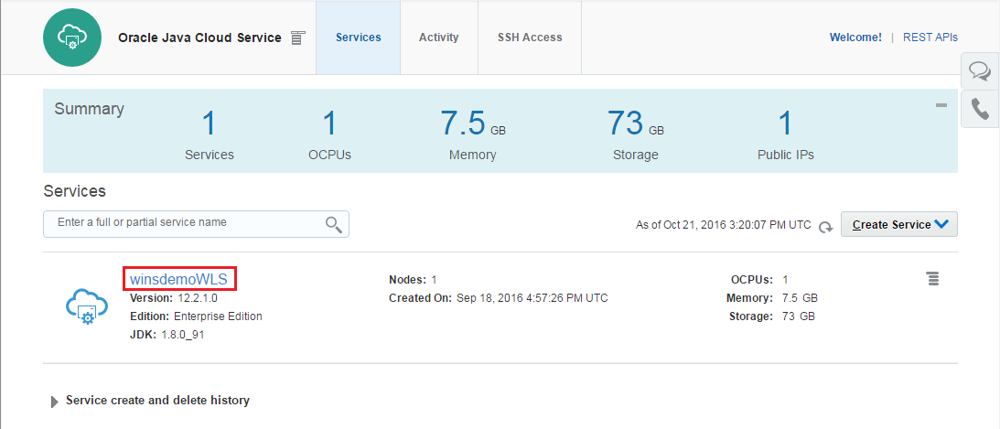

Click the hamburger menu on the top middle, next to the instance name. Select **Open WebLogic Server Console**.

A new browser (tab) opens and you are redirected to the selected console’s log-in page. If the server is protected with a self-signed certificate, you will be warned that this certificate is not trusted. This is the default configuration and you can configure your certification. Select **I Understand the Risk**, and **Add Exception** (accept certificate).
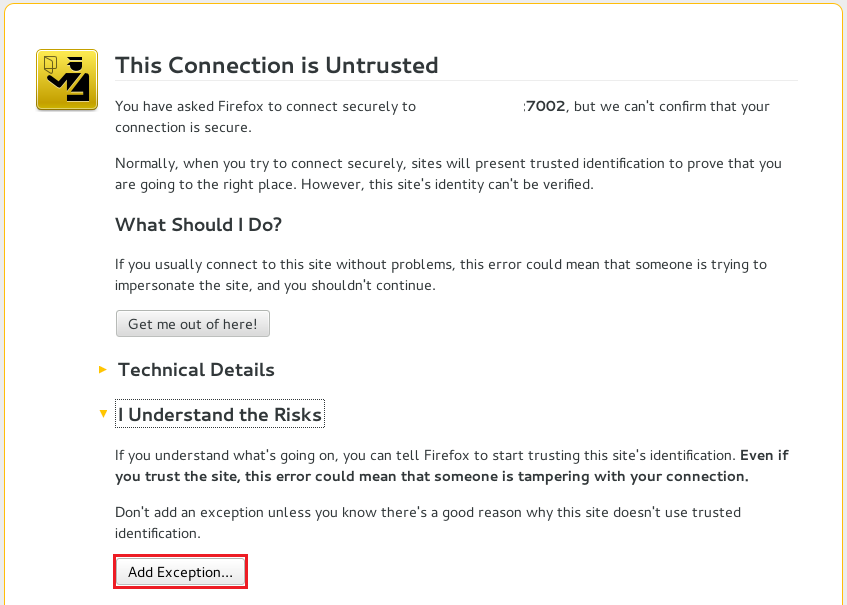

When dialog appears select **Confirm Security Exception**.

When the console log-in page appears, enter the log-in credentials you entered for WebLogic Administrator when you created the service instance. Click **Login**.

After a successful login the WebLogic Server Administration Console is displayed. On the left side in the navigation tree click **Deployments**. Then click **Lock & Edit** above and finally click the **Install** button.
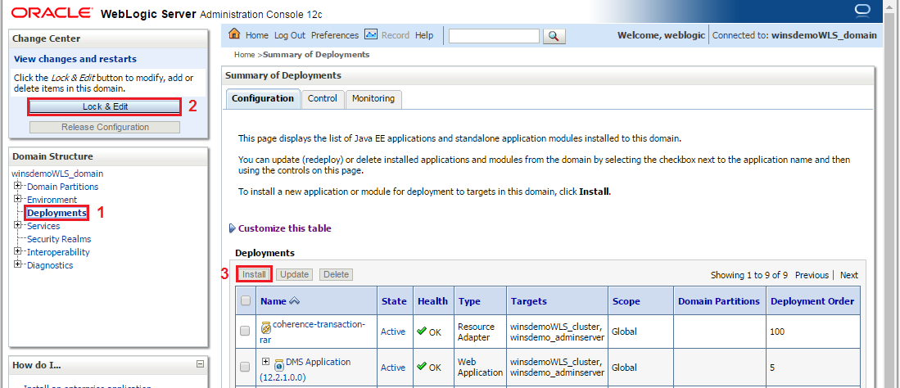

Now you need to click **Upload your file(s)** link because the WAR file not located on the server, hence it requires upload.

Click **Choose File** to open File Open dialog.

Select the previously built `load.war` (web archive) in folder: `GIT_REPO_LOCAL_CLONE/jcs.autoscale/target`.

After the file is uploaded, its name appears next to the **Browse** button. Click **Next**.

Confirm the selection of the `load.war` application archive and click **Next**. 

Make sure the installation type is Install this deployment as an application. Click **Next**.
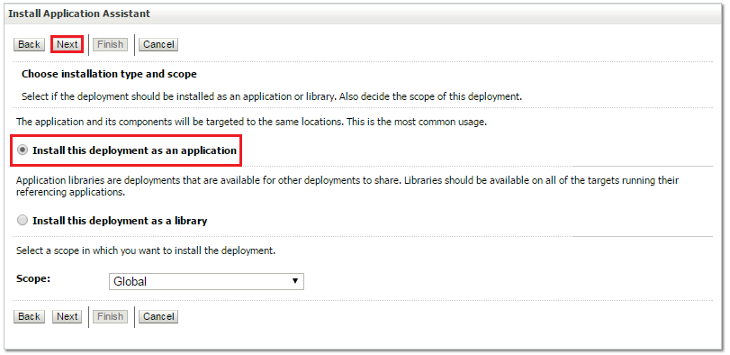

Choose to deploy the application to all the servers in the cluster, and then click **Next**.
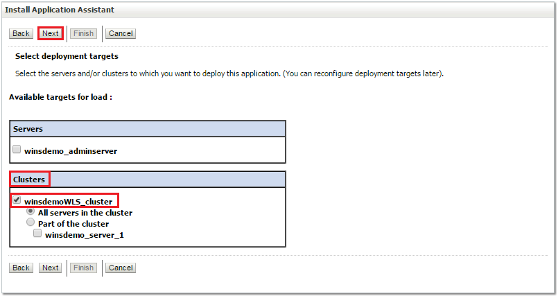

The default settings for Optional Settings are typically adequate so leave defaults. Click **Finish**.
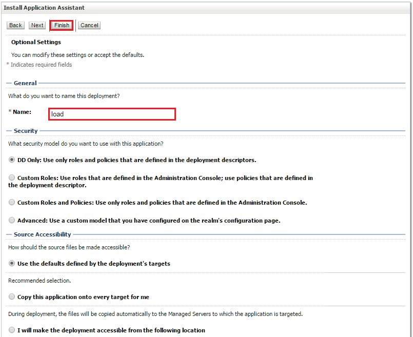

In the Change Center, click **Activate Changes**.

Now the application is in *Prepared* state and you need to make it ready to accept requests. To start a deployed application select *Deployments* in Domain Structure and click on **Control** Tab. The previously deployed application can be found in the list. Select the application, click **Start** and then select **Servicing all requests**.
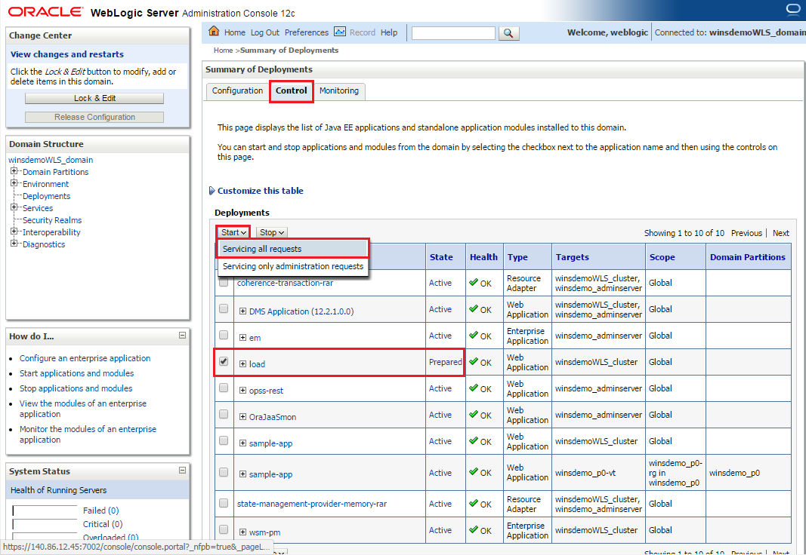

Click **Yes** to confirm the deployment.

The application is now in the *Active* state and is ready to accept requests.

#### Launch the Sample Load Generator Application ####

To hit the application first you need to get more information about your Java Cloud Service  topology. You need to have a public IP address which belongs to your Load Balancer if that exists. Otherwise you need the IP address of the VM instance which runs one of your Managed Server. 

Go back to the browser (tab) where you opened WebLogic console. That page is the Java Cloud Service details page where you can check the instance topology and the public IP addresses. Make sure that the **Overview** is selected on the left menu. If you have Load Balancer then use its IP address to hit the sample application. If you don't have Load Balancer then use IP address of VM which runs the Managed Server. Even if you have Load Balancer please note the IP address of the VM hosts WebLogic for further usage. You will access using `ssh` to the VM to check CPU load.
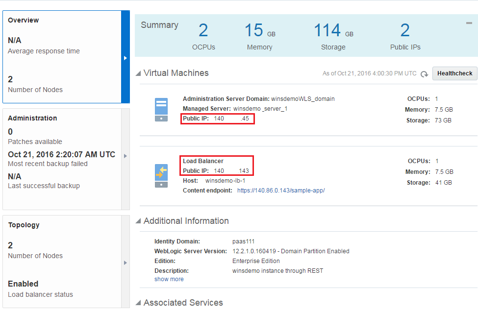

Open a browser and write the following URL: `https://<public-ip-address>/load/cpu.jsp` You should now see a simple application what will be used later for load generation.

#### Create Auto Scaling Rule ####

Create rule for Java Cloud Service which triggers auto scaling based on the defined criteria. Go back to the Java Cloud Service instance details page and click **Topology** on the left menu. Click **Add Node** and select **Auto Scaling** item.
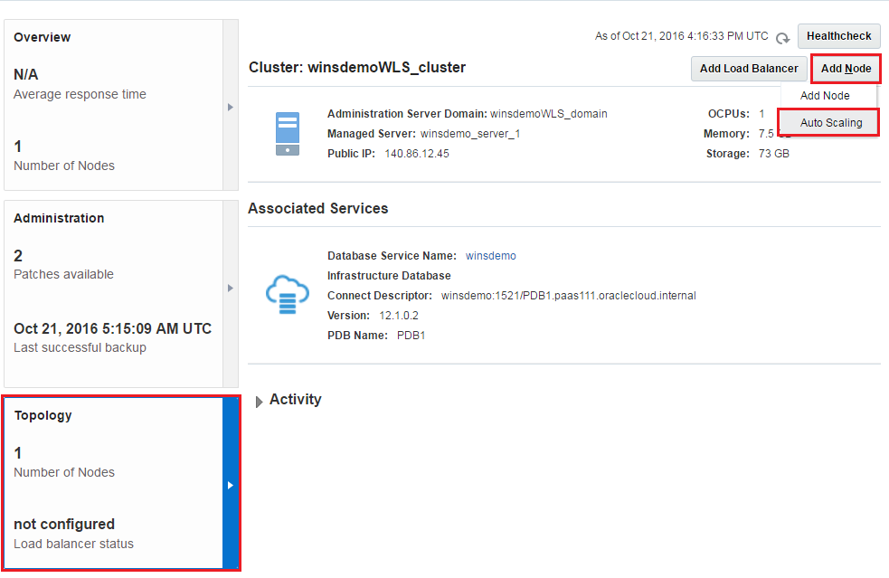

On the Rules page click **Create Rule**. 
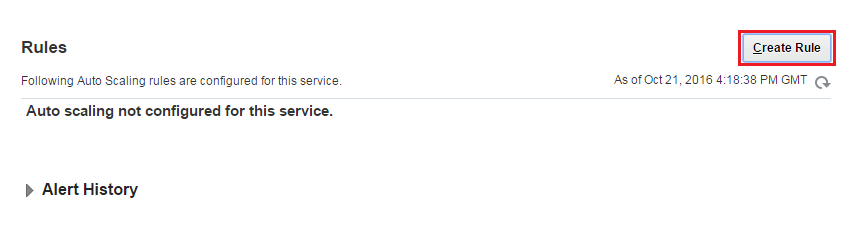

Define the rule parameters.
	
+ Perform: **Scale Out**
+ Maximum Cluster Size: **2** (1 more higher then the existing cluster size)
+ CPU Utilization: **Average** - **50%**
+ Number for measurement period: **1**
+ Period length: **5** minutes (this is the minimum)
+ VM instances: **Any**
+ Cool down period: 30 (this is the minimum)

Click **Create**.

Wait till the rule will be complete.

Before the load generation create `ssh` access to the VM hosts Managed Server to check CPU load during the utilization. Open a terminal and run `ssh -i privateKey opc@VM_PUBLIC_IP` command. The `privateKey` is your private key pair of the public key you defined during Java Cloud Service creation. If your private key has passphrase you need to provide when `ssh` requires

	[oracle@localhost jcs.autoscale]$ ssh -i ../pk.openssh opc@140.XX.XX.45
	The authenticity of host '140.86.12.45 (140.86.12.45)' can't be established.
	RSA key fingerprint is b7:3b:1a:a0:9b:f0:e4:44:78:ac:c2:a8:81:4f:03:a3.
	Are you sure you want to continue connecting (yes/no)? yes
	Warning: Permanently added '140.86.12.45' (RSA) to the list of known hosts.
	Enter passphrase for key '../pk.openssh': 
	[opc@winsdemowls-wls-1 ~]$ 

Now you have established `ssh` connection to the VM. Run `top` to check the CPU utilization  of the VM hosting Managed Server during the load generation.

	[opc@winsdemowls-wls-1 ~]$ top

The top program provides a dynamic real-time view of a running system. It can display system summary information as well as a list of tasks currently being managed by the Linux kernel. At the beginning of the second line you can see the real time CPU utilization.

	top - 16:22:15 up  5:36,  1 user,  load average: 1.49, 3.42, 1.77
	  PID USER      PR  NI  VIRT  RES  SHR S %CPU %MEM    TIME+  COMMAND                                                                                                            
	24145 oracle    20   0 5141m 1.6g  60m S  0.7 22.3   1:47.42 java                                                                                                               
	21526 oracle    20   0 5687m 1.5g  41m S  0.3 21.4 142:52.14 java                                                                                                               
	    1 root      20   0 19408 1308 1232 S  0.0  0.0   0:00.63 init                                                                                                               
	    2 root      20   0     0    0    0 S  0.0  0.0   0:00.00 kthreadd                                                                                                           
	    3 root      20   0     0    0    0 S  0.0  0.0   0:00.04 ksoftirqd/0                                                                                                        
	    5 root       0 -20     0    0    0 S  0.0  0.0   0:00.00 kworker/0:0H                                                                                                       
	    6 root      20   0     0    0    0 S  0.0  0.0   0:00.00 kworker/u:0                                                                                                        
	    7 root       0 -20     0    0    0 S  0.0  0.0   0:00.00 kworker/u:0H                                                                                                       
	    8 root      RT   0     0    0    0 S  0.0  0.0   0:00.04 migration/0                                                                                                        

Leave this terminal open and on top to check later the CPU load.

Here is the time to generate load for Java Cloud Service. Switch to the browser where the simple Load Generator Web Application was opened. Select `mid` load, enter 400000 milliseconds long run and click **Submit**.
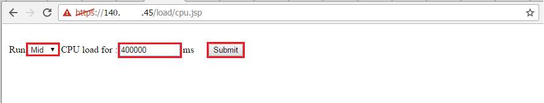

Switch back to the terminal where `top` is running to check the CPU utilization and wait till the Auto Scaling rule triggers scale out operation for Java Cloud Service. 

	top - 16:24:37 up  3:19,  1 user,  load average: 1.46, 0.35, 0.15
	Tasks: 115 total,   1 running, 114 sleeping,   0 stopped,   0 zombie
	Cpu(s): 99.8%us,  0.0%sy,  0.0%ni,  0.2%id,  0.0%wa,  0.0%hi,  0.0%si,  0.0%st
	Mem:   7397060k total,  4541608k used,  2855452k free,    91212k buffers
	Swap:  4194300k total,        0k used,  4194300k free,   802920k cached
	
	  PID USER      PR  NI  VIRT  RES  SHR S %CPU %MEM    TIME+  COMMAND                                                                                                            
	21526 oracle    20   0 5686m 1.6g  41m S 200.3 22.2   4:00.00 java                                                                                                              
	 4251 oracle    20   0 4953m 1.6g  58m S  0.3 23.2   3:33.46 java                                                                                                               
	22930 opc       20   0 95896 1772  856 S  0.3  0.0   0:00.23 sshd                                                                                                               
	    1 root      20   0 19408 1540 1232 S  0.0  0.0   0:00.63 init                                                                                                               
	    2 root      20   0     0    0    0 S  0.0  0.0   0:00.00 kthreadd                                                                                                           
	    3 root      20   0     0    0    0 S  0.0  0.0   0:00.03 ksoftirqd/0                                                                                                        
	    5 root       0 -20     0    0    0 S  0.0  0.0   0:00.00 kworker/0:0H                                                                                                       
	    6 root      20   0     0    0    0 S  0.0  0.0   0:00.00 kworker/u:0                                                                                                        
	    7 root       0 -20     0    0    0 S  0.0  0.0   0:00.00 kworker/u:0H                                                                                                       
	    8 root      RT   0     0    0    0 S  0.0  0.0   0:00.04 migration/0                                                                                                        

