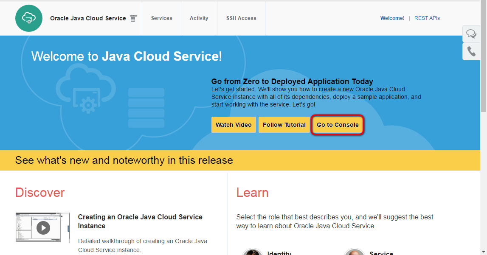
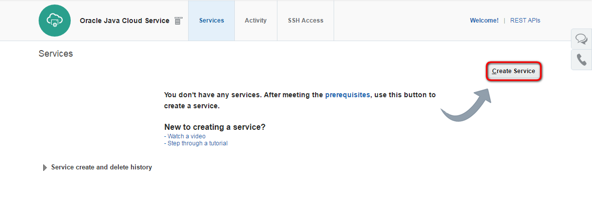
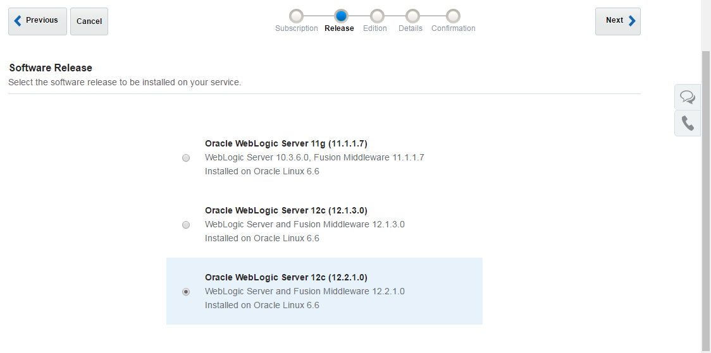
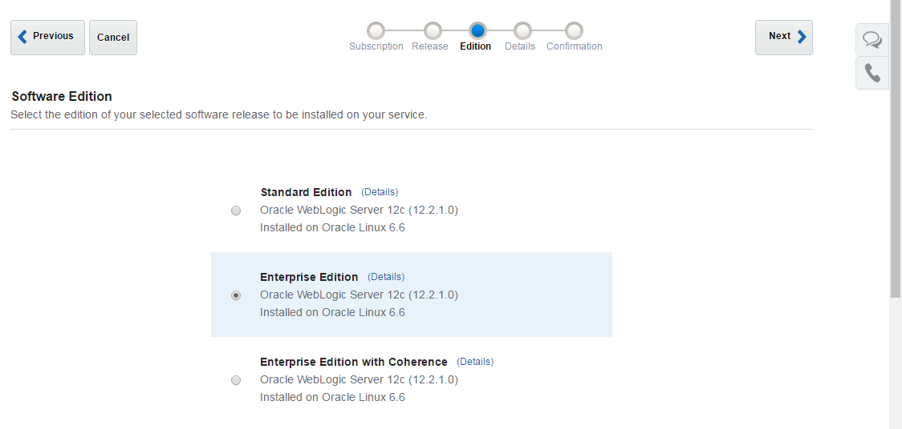
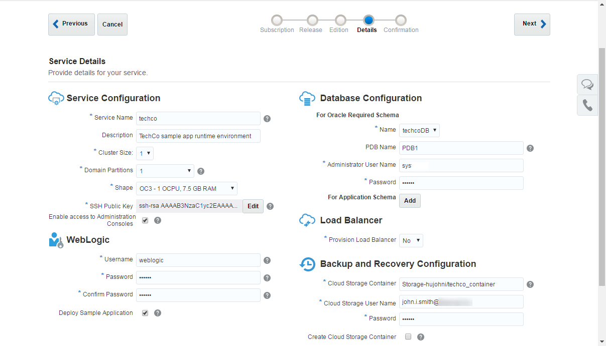
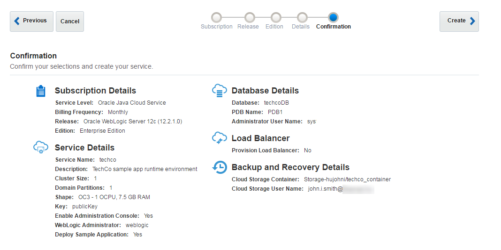
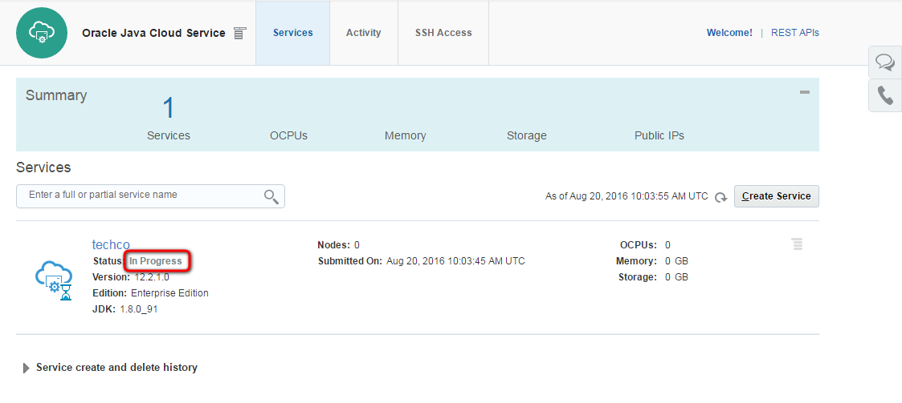

---
# ORACLE Cloud-Native DevOps workshop #

## Create Java Cloud Service instance using user interface ##

### Introduction ###

By using Oracle Java Cloud Service, you can quickly create and configure an Oracle WebLogic Server domain and set up your Java EE application environment without worrying about setting up any infrastructure or platform details yourself. All Oracle Java Cloud Service instances that you create are also preconfigured to use your database deployment in Oracle Database Cloud Service, and an object storage container that you create in your Oracle Storage Cloud Service.

### About this tutorial ###
This tutorial demonstrates how to:
	
+ create Java Cloud Service using the user interface.

### Prerequisites ###

+ Oracle Public Cloud Service account including Java, Database and Storage Cloud Service
+ Oracle Java Cloud Service uses Oracle Database Cloud Service to host the Oracle Fusion Middleware component schemas required by Oracle Java Required Files (JRF). Prior to creating an Oracle Java Cloud Service instance, [use your Oracle Database Cloud Service subscription to create a database deployment](../dbcs-create/README.md). As part of the instance creation process, Oracle Java Cloud Service provisions this database deployment with the Oracle JRF schemas.

### Steps ###

[Sign in](../common/sign.in.to.oracle.cloud.md) to [https://cloud.oracle.com/sign-in](https://cloud.oracle.com/sign-in). On the dashboard click the hamburger icon on the Java tile. Select **Open Service Console**.

This is the Java Cloud Service Console page. If this is the first time opening Java console then Welcome page will appear. In this case click **Go to Console** button.

To create new instance click **Create Service** button.

Select subscription type. Select the fully managed Oracle Java Cloud Service and the desired billing format. For more details about subscription types see the [documentation](https://docs.oracle.com/cloud/latest/jcs_gs/JSCUG/GUID-31F00F2C-221F-4069-8E8A-EE48BFEC53A2.htm#JSCUG-GUID-98DD6CE1-480F-4AA9-8131-A1D3D274440F).

Select the latest 12c Software Release.

Select the Enterprise Edition software edition.

The last input page is the Service Details page. The following parameters have to be provided:
	
+ **Service Name**: the name of the service instance e.g. techco
+ **Shape**: number of OCPU and size of the RAM. Choose the smallest (default) one.
+ **Description**: any description for your service.
+ **Cluster size**: to save resources leave the default 1. Which means one managed server.
+ **Domain Partitions**: Create mutitenant instance. Select 1 to enable partitioning.
+ **SSH Public Key**: public key which will be uploaded to the VM during the creation. It allows to connect to the VM through ssh connection using the private key. Use the same publicKey what was generated for Database Cloud Service instance. Click on Edit button and select [previously saved (during Database Cloud Service creation)](../dbcs-create/README.md) `GIT_REPO_LOCAL_CLONE/cloud-utils/publicKey`. You can also copy the content of *publicKey* into Key Value field. If you don't have or want to  to create different keypair select **Create a New Key** option and download the newly generated keypair for later usage.

+ **Enable Administration Console**: because this instance will be available on public internet the default is that the WebLogic Admin console is not enabled. Do not forget to check in to get access to the Admin console.
+ **Username**: username of WebLogic administrator. For demo purposes you can use: weblogic
+ **Password**: WebLogic administrator's password. Don't forget to note the provided password.
+ **Deploy Sample Application**: deploy the sample application. It can be useful to test accessibility (correct LB configuration, etc.) of the Java Cloud Service Instance.
+ **Database Configuration / Name**: Database Cloud Service name to store WebLogic repository data. Basically the list populated with database services within the same identity domain.
+ **Database Configuration / PDB Name**: pluggable database service identifier of the Database Cloud Service instance -provided above- which will be used to store repository schema. If you have choosen default (PDB1) during Database Cloud Service creation then leave the default here too.
+ **Database Configuration / Administrator User Name**: DBA admin to create repository schema for Java Cloud Service instance. Enter: sys.
+ **Database Configuration / Password**: DBA admin password you provided during Database Cloud Service creation.
+ **Database Configuration / For Application Schema**: It is an option to add different database service instance accessibility. For example different database used by the application and different for Java Cloud Service instance repository. You can configure later another Database Cloud Service, but here it is easier to define.
+ **Provision Load Balancer**: the save resources for sample application we will not create Load Balancer instance. Leave default: No
+ **Cloud Storage Container**: the name of the container for Database Cloud Service instance. The format is the following: Storage-IDENTITYDOMAIN/CONTAINERNAME. The container don't need to be created in advance, because -see below- there is an option to create automatically. Now give the same container what you provided (created) earlier for Database Cloud Service instance.
+ **Cloud Storage User Name and Password**: the credentials for storage. Usually it is the same what was used to sign in to Oracle Cloud Services.
+ **Create Cloud Storage Containers**: if the container defined above does not exist then check in.

For more details about parameters see the [documentation](https://docs.oracle.com/cloud/latest/jcs_gs/JSCUG/GUID-31F00F2C-221F-4069-8E8A-EE48BFEC53A2.htm#JSCUG-GUID-88BD737C-8DA9-419A-8DBF-489BDFF9C512). Click **Next**.

The final page is the summary page about the configuration before submit the instance creation request. Click **Create** to start the provisioning of the new service instance.

When the request has been accepted the Java Cloud Service Console page appears and shows the new instance. The instance now is in Maintenance (Progress) mode. Click **In Progress** link to get more information about the status.

