---
# ORACLE Cloud-Native DevOps workshop #
-----
## Deploy TechCo (Java EE) Demo Application to Java Cloud Service ##

### Introduction ###
This section describes deploying and undeploying applications to an Oracle Java Cloud Service instance by using the WebLogic Server Administration Console. You cannot deploy and undeploy applications directly through the Oracle Java Cloud Service Console.

You can use the WebLogic Server Administration Control graphical user interface to deploy and undeploy an application to an Oracle Java Cloud Service instance, just as you would deploy and undeploy the application to an on-premises service instance.

### About this tutorial ###
This tutorial demonstrates how to:
  
+ create resource (Data Source) for Java Cloud Service using WebLogic console,
+ deploy JEE application to Java Cloud Service using WebLogic console.

### Prerequisites ###

- [Prepared Database Cloud Service](../dbcs-prepare/README.md) instance which holds the TechCo Demo application's data.
- Running [Java Cloud Service instance](../jcs-create/README.md) configured to access to the prepared Database Cloud Service

### Steps ###

#### Build sample application ####
Open a terminal and change to `GIT_REPO_LOCAL_CLONE/techco-app` folder and build the sample application.

    $ [oracle@localhost Desktop]$ cd /u01/content/cloud-native-devops-workshop/techco-app
    $ [oracle@localhost techo-app]$ mvn install
Running the build you should see output similar to:

    [oracle@localhost techo-app]$ mvn install
    [INFO] Scanning for projects...
    [INFO]                                                                         
    [INFO] ------------------------------------------------------------------------
    [INFO] Building TechCo-ECommerce 1.0-SNAPSHOT
    [INFO] ------------------------------------------------------------------------
    Downloading: https://repo.maven.apache.org/maven2/org/apache/maven/plugins/maven-war-plugin/2.4/maven-war-plugin-2.4.pom
    Downloaded: https://repo.maven.apache.org/maven2/org/apache/maven/plugins/maven-war-plugin/2.4/maven-war-plugin-2.4.pom (10 KB at 3.7 KB/sec)
    ...
    ...
    ...
    [INFO] Installing /u01/content/cloud-native-devops-workshop/techo-app/pom.xml to /home/oracle/.m2/repository/com/oracle/samples/TechCo-ECommerce/1.0-SNAPSHOT/TechCo-ECommerce-1.0-SNAPSHOT.pom
    [INFO] ------------------------------------------------------------------------
    [INFO] BUILD SUCCESS
    [INFO] ------------------------------------------------------------------------
    [INFO] Total time: 01:06 min
    [INFO] Finished at: 2016-08-20T05:41:55-07:00
    [INFO] Final Memory: 24M/491M
    [INFO] ------------------------------------------------------------------------
    [oracle@localhost techco-app]$

Now the web archive (war) is ready to deploy in the `target` folder.

#### Create Data Source for sample application ####
[Sign in](../common/sign.in.to.oracle.cloud.md) to [https://cloud.oracle.com/sign-in](https://cloud.oracle.com/sign-in). Using the dashboard open the Java Cloud Service Console.

Click on the hamburger icon located at the right top corner of the service summary. From the 
menu select Open WebLogic Server Console

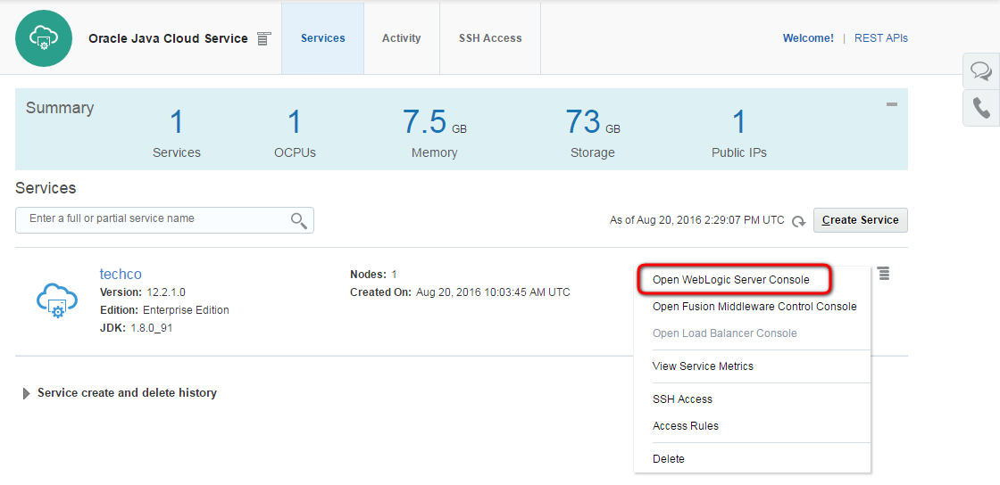

A new browser opens and you are redirected to the selected console’s log-in page. If the server is protected with a self-signed certificate, you will be warned that this certificate is not trusted. This is the default configuration and you can configure your certification. Select I Understand the Risk, and Add Exception (accept certificate). 

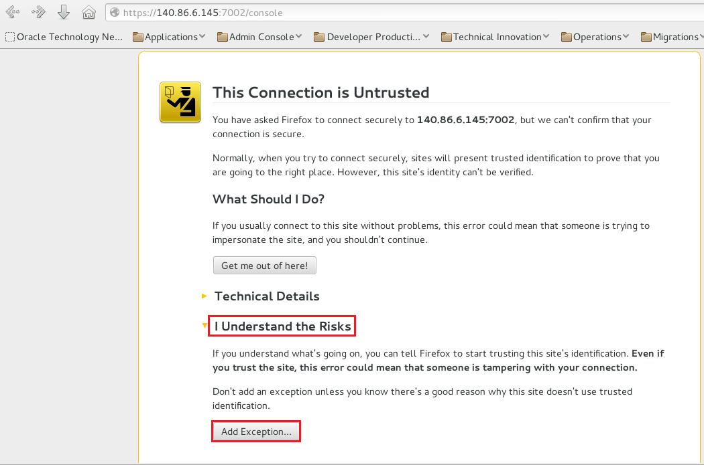

When dialog appears select Confirm Security Exception.

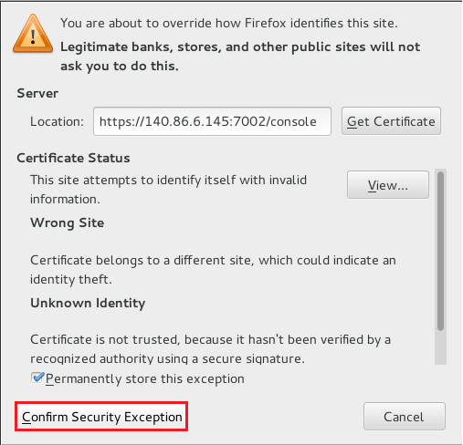

When the console log-in page appears, enter the log-in credentials you entered for WebLogic Administrator when you created the service instance.

After a successful login the WebLogic Server Administration Console is displayed. Click Lock & Edit and Service -> Data Sources. Create New **Generic Data Source**

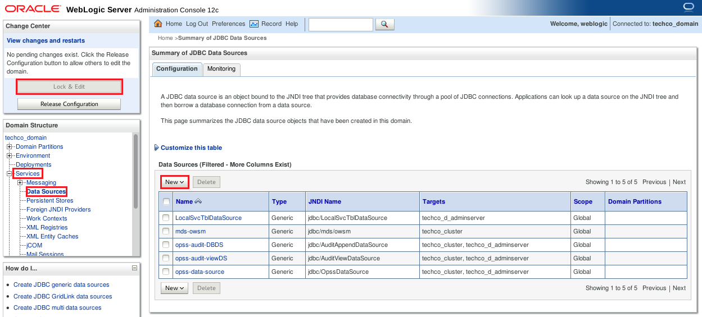

Configure the data source with the following parameters:

+ **Name**: jdbc-OE
+ **Scope**: Global (default)
+ **JNDI Name**: jdbc/OE
+ **Database type**: Oracle (default)

Click Next.

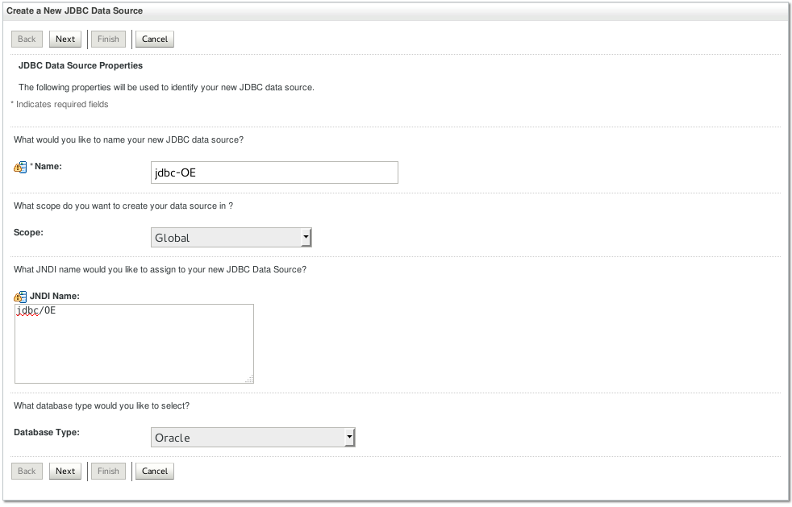

Leave the default Database Driver and click Next.

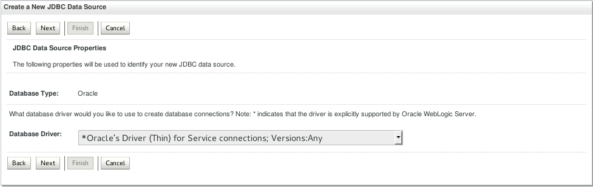 

Leave the default Transactions Options and click Next.

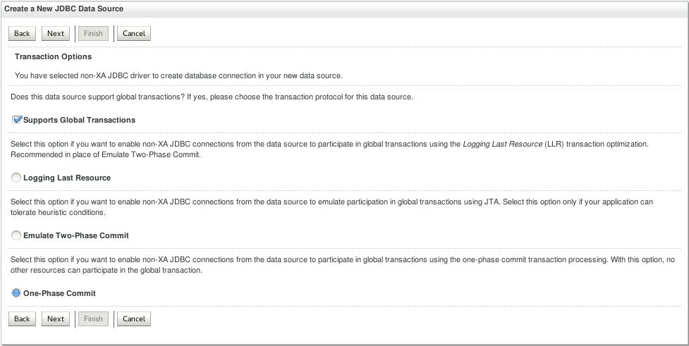

Configure the database service connection descriptor.

+ **Database Name**: `PDB1.<identitydomain>.oraclecloud.internal`
+ **Host Name**: the Database Cloud Service [prepared](../dbcs-prepare/README.md) to run sample.  application. If you followed the instructions its name likely is `techcoDB`
+ **Port**: leave the default 1521
+ **Database User Name**: oe
+ **Password**: password you entered for DBA (Database Cloud Service adminsitrator - sys) account
+ **oracle.jdbc.DRCPConnectionClass**: leave empty

Click Next.

Test the data source by click **Test Configuration**

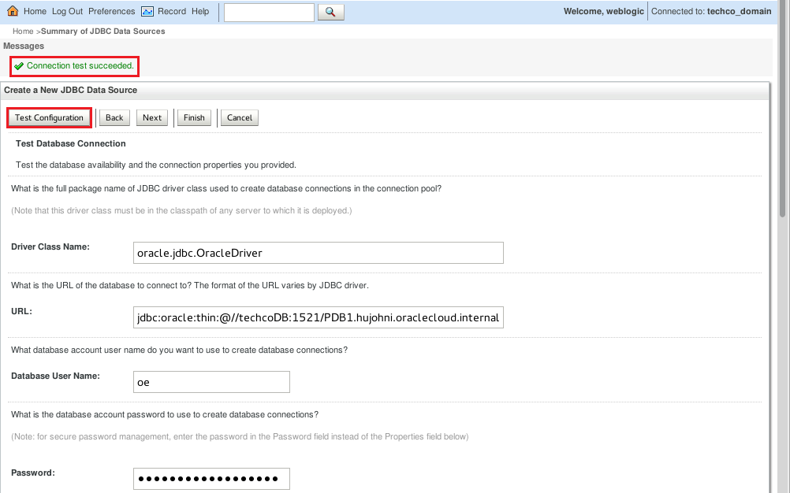

Select the servers or clusters to which you want to deploy the application. For this tutorial, choose to deploy the application to all the servers in the cluster, and then click Finish.

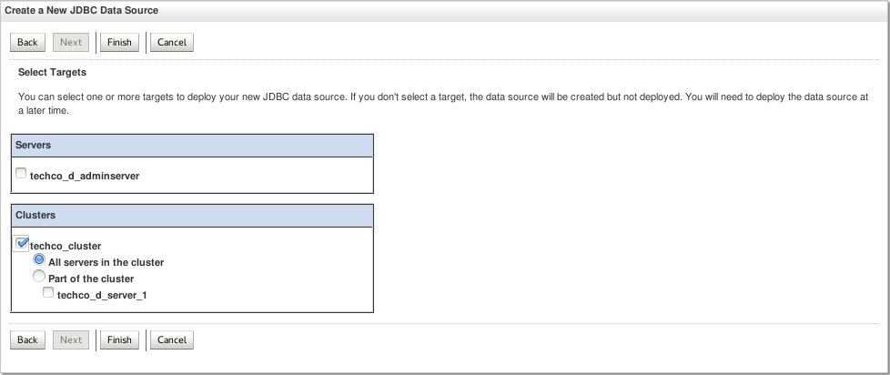

Activate Changes and check the acknowledgement: `All changes have been activated. No restarts are necessary`

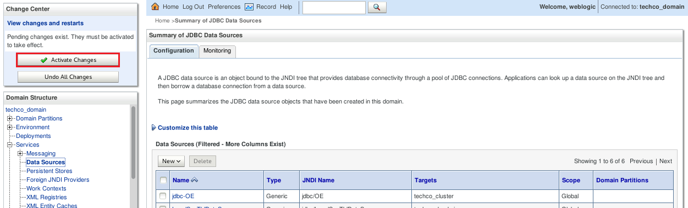

#### Deploy sample application ####
Click Lock & Edit and select Deployments in the Domain Structure tree panel. On the Deployments page, click Install.

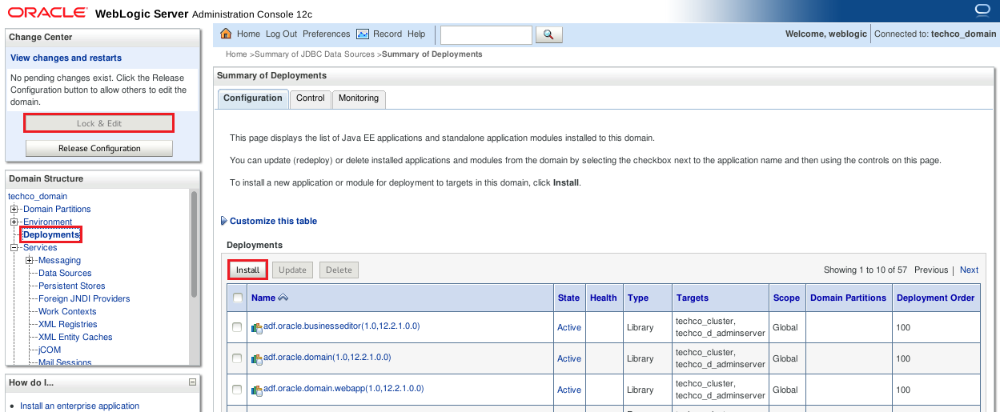

On the Install page, click upload your file(s) to upload file.

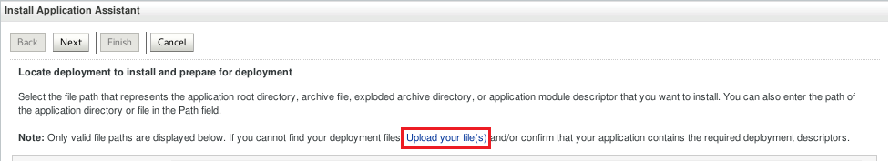

In the Install Application Assistant, click Browse to find `GIT_REPO_LOCAL_CLONE/techco-app/target/TechCo-ECommerce-1.0-SNAPSHOT.war` (In case of virtualbox image environment it is: `/u01/content/cloud-native-devops-workshop/techco-app/target/TechCo-ECommerce-1.0-SNAPSHOT.war`) to deploy and upload it.

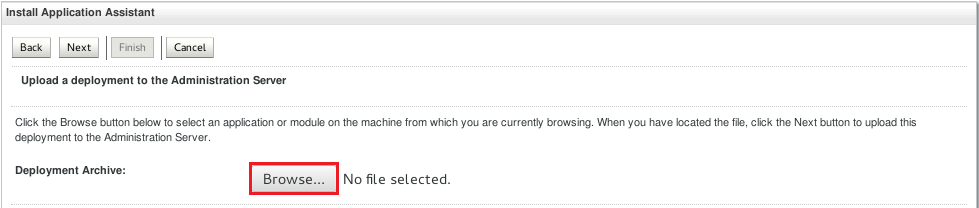

After the file is uploaded, its name appears next to the Browse button. Click Next.

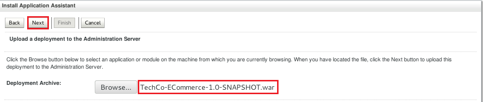

Select the file, and then click Next.

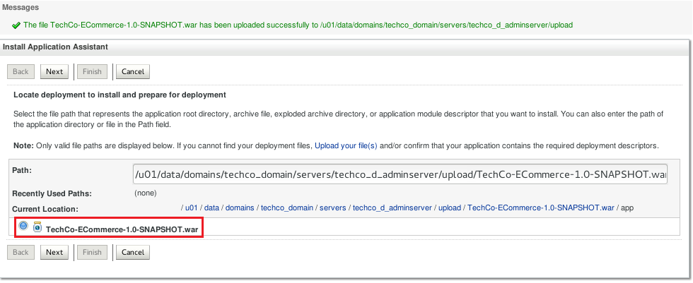

Make sure the installation type is Install this deployment as an application. Click Next.

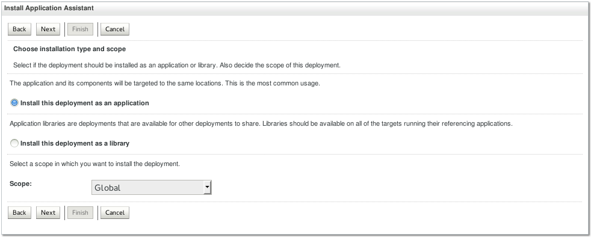

Choose to deploy the application to all the servers in the cluster, and then click Next.

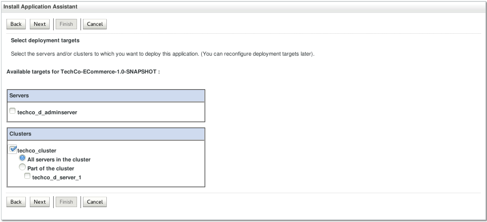

The default settings for Optional Settings are typically adequate so leave defaults. Click Next

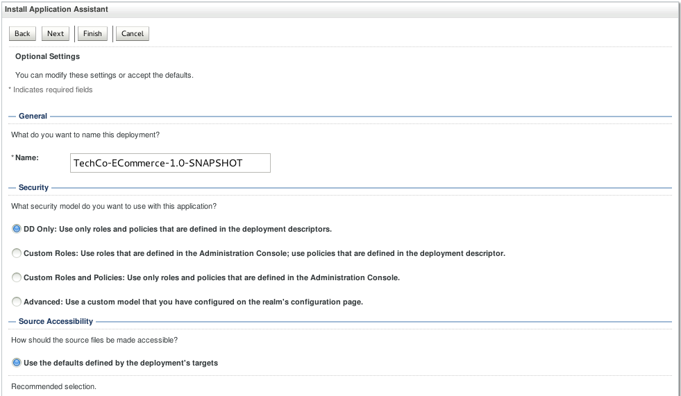

In the Change Center, click Activate Changes.

Now the application is in Prepared state and you need to make it ready to accept requests. To start a deployed application select Deployments in Domain Structure and click on Control Tab. The previously deployed application can be found in the list.

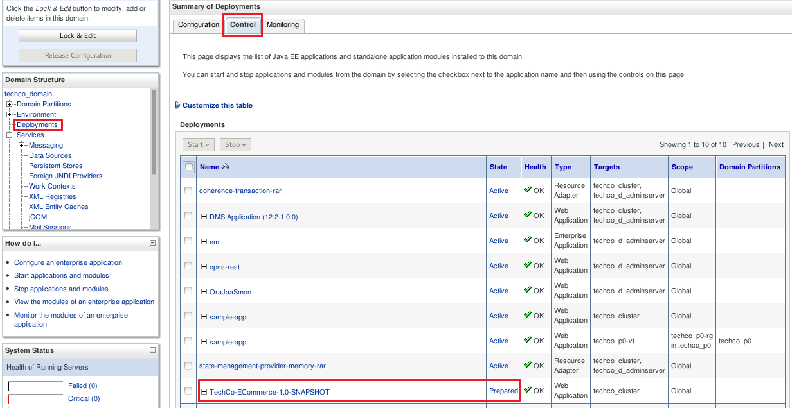

Select the application, click Start and then select Servicing all requests.

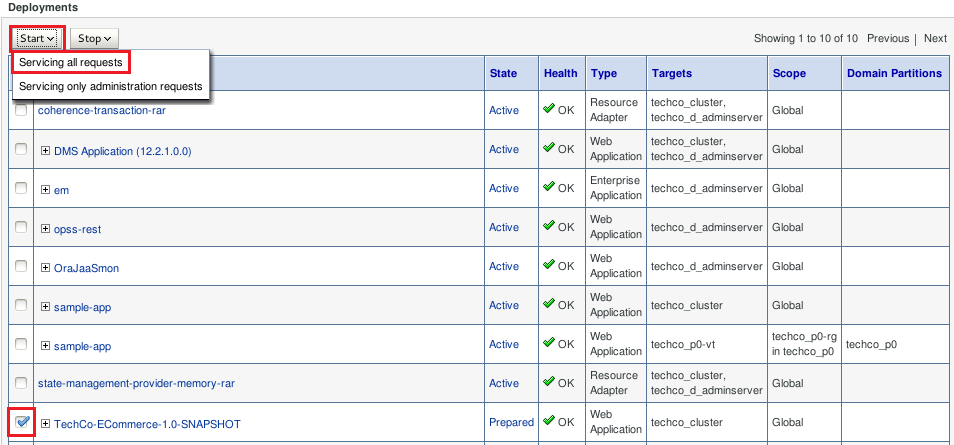

Click Yes to confirm the deployment.

The application is now in the Active state and is ready to accept requests.

#### Launch sample application ####

To test an application that you have deployed and started on an Oracle Java Cloud Service instance that does not include a load balancer requires public IP address of the compute node.

Change to the browser where the Oracle Cloud My Services dashboard is already opened. If it was closed or the session time expired then [sign in](../common/sign.in.to.oracle.cloud.md) to [https://cloud.oracle.com/sign-in](https://cloud.oracle.com/sign-in). On the dashboard open the Java Cloud Service Console.

Click the name of the service instance to which the application is deployed.

On the service instance details pages, find the list of nodes, and take note of the public IP address for the virtual machine that contains the Administration Server and Managed Server. In case if your Java Cloud Service have Load Balancer configured then use its public IP address.

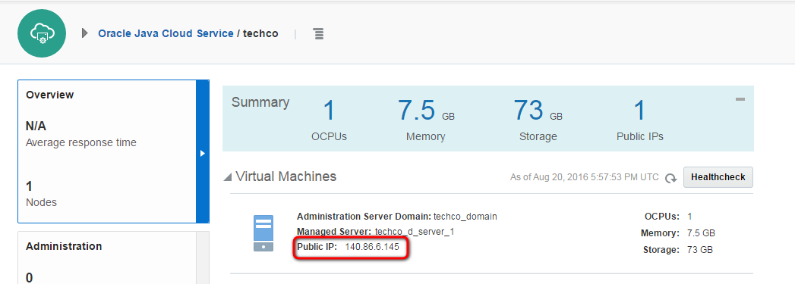

Open a browser and write the following URL: `https://<public-ip-address>/TechCo-ECommerce`
You should now see the home page of the sample application.

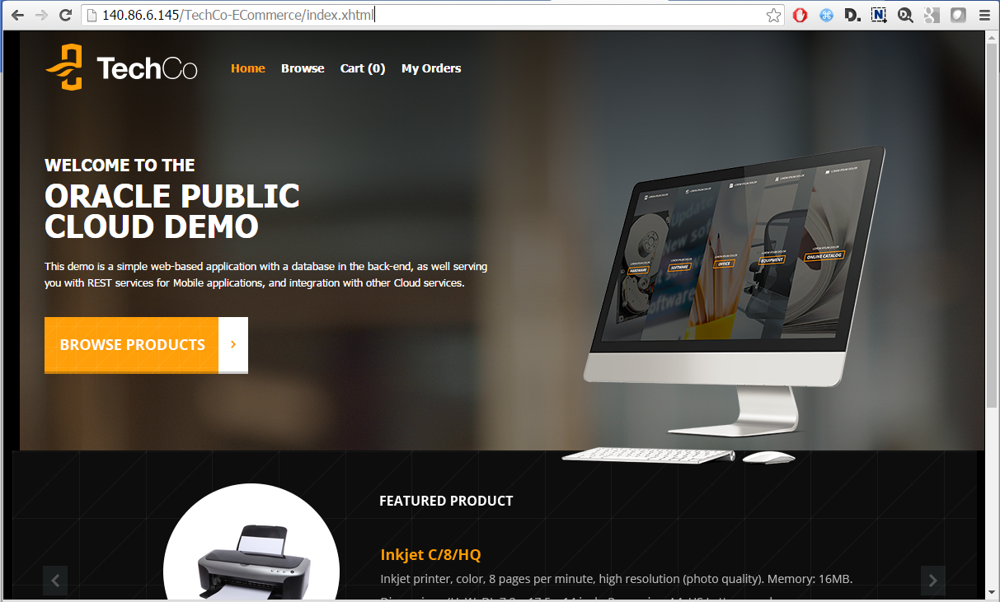
