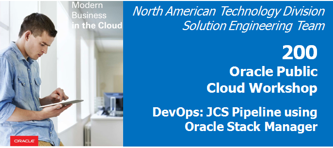  

Update: March 3, 2017

## Introduction

This is the second of several labs that are part of the **DevOps JCS Pipeline using Oracle Stack Manger workshop**. This workshop will walk you through the Software Development Lifecycle (SDLC) for a Java Cloud Service (JCS) project that goes through Infrastructure as Code and deployment of a Struts application.

In the first lab (100), the Project Manager created a new project in the Developer Cloud Service, created and assigned tasks to the developers of this application. In this lab, you will assume the persona of Operations, who will be tasked with creating an Infrastructure as Code pipeline for the provisioning of Alpha Office Java Cloud Service (JCS) environment.

***To log issues***, click here to go to the [github oracle](https://github.com/oracle/cloud-native-devops-workshop/issues/new) repository issue submission form.

## Objectives
- Access Developer Cloud Service
- Import configuration from external Git Repository
- Build Infrastructure as Code pipeline
- Check in new template file
- Import Project into Eclipse
- Check in configuration file to provision new JCS environment.

## Required Artifacts
- The following lab requires an Oracle Public Cloud account that will be supplied by your instructor. You will need to download and install latest version of Eclipse or use supplied compute VM.


# Create Initial Git Repository for Infrastructure

## Create Initial Git Repository

 Although you will remain connected to the Oracle Cloud using the user account you were provided, you are to take on the Persona of ***Bala Gupta*** as you perform the following steps. Bala is our operations engineer and will be handling all operations issues.

  

### **STEP 1:** Update Issue Status
- Click on the **AlphaOffice** Board **Active Sprints**.

    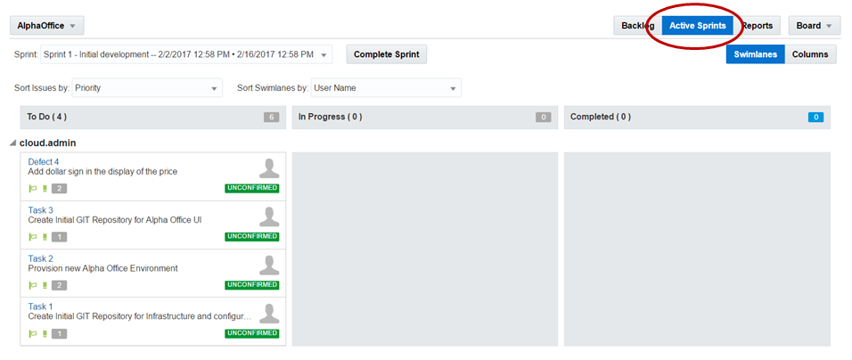

- Drag and drop **Task1 - Create Initial GIT Repository for Infrastructure and configure build** into the **In Progress** swim-lane.  

    

- Click **OK** on Change Progress popup.

    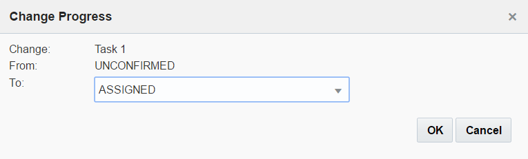
    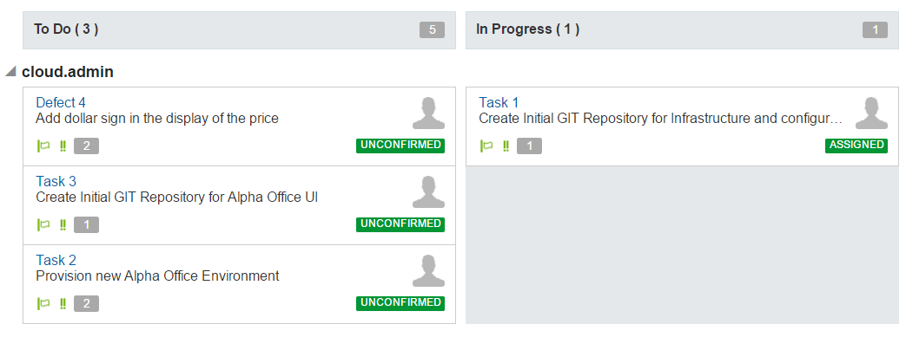

### **STEP 2:** Create Repository
- In the left hand navigation panel, click **Project**.

- Click on **New Repository** to create a new Git Repository.

    

- In the New Repository wizard enter the following information and click **Create**.

    **Name:** `JCSStackAlphaInfrastructure`

    **Description:** `JCS Stack Alpha Office Infrastructure`

    **Initial content:** `Import existing repository`

    **Enter the URL:** `https://github.com/pcdavies/JCSStackAlphaInfrastructure`

    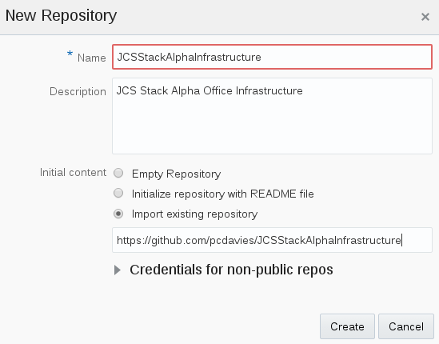

- You have now created a new GIT repository based on an existing repository.

    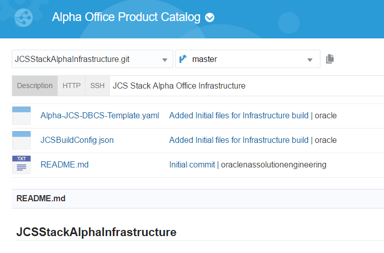

## Create Default Build for Template Upload

**Oracle Cloud Stack Manager** is a feature of Oracle Cloud that allows for the provisioning of multiple services within the Oracle Cloud. In order to build and deploy their applications, businesses often require sophisticated environments that consist of multiple, integrated cloud services. Consider a development environment whose needs include a Java application server along with a relational database. Provisioning each of these services for every member of your development team is time consuming and error prone, regardless of whether you’re using service consoles or REST APIs to provision the services. Oracle Cloud Stack Manager uses templates to provision a group of services (called a stack) and in the correct order.

### **STEP 3:** Create Template Update Build Process

Now that we have the configuration code in our managed GIT repository, we need to create a build process that will be triggered whenever a commit is made to the master branch. This build process will trigger any time the Alpha Office Stack template is modified and upload a new version via REST to the Oracle Cloud.

- On navigation panel click **Build** to access the build page and click **New Job**.

    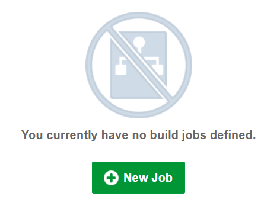

- In the New Job popup enter **Infrastructure Update Template** for the Job Name, and then click **Save**.

    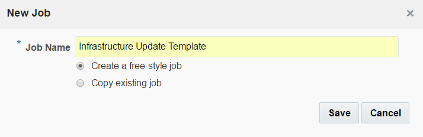

- You are now placed into the job configuration screen.        

    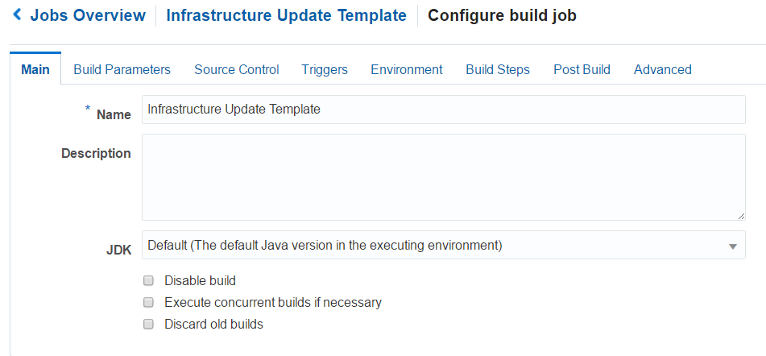

- Click the **Source Control** tab. Click **Git** and select **JCSStackAlphaInfrastructure.git** from the drop down. Expand **Advanced Git Settings** and enter `Alpha-JCS-DBCS-Template.yaml`

    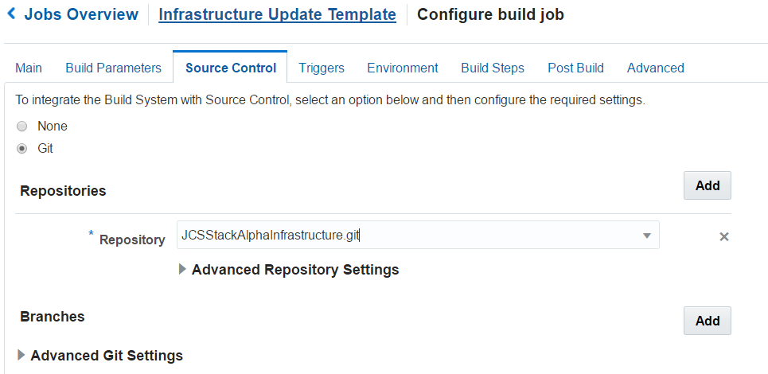

- Click the **Triggers** tab. Select **Based on SCM polling schedule**.

    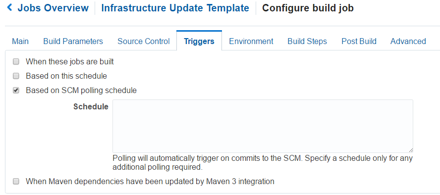    

- Click the **Build Steps** tab. Click **Add Build Step**, and select **Execute shell**.

    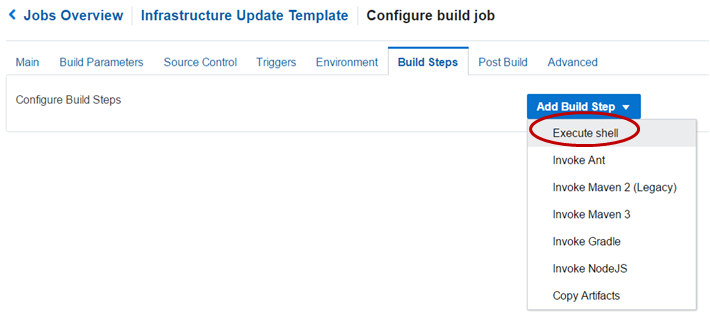

- Enter the following REST call for the **Execute Shell Command:**

```
curl --request POST \
  --user <opc username>:<opc password> \
  --url https://psm.europe.oraclecloud.com/paas/api/v1.1/instancemgmt/<OPC Identity Domain>/templates/cst/instances \
  --header 'X-ID-TENANT-NAME: <OPC Identity Domain>' \
  --header 'content-type: multipart/form-data' \
  --form template=@Alpha-JCS-DBCS-Template.yaml
```

**Note:** Replace <OPC > with your OPC credentials

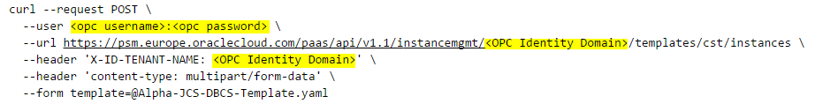

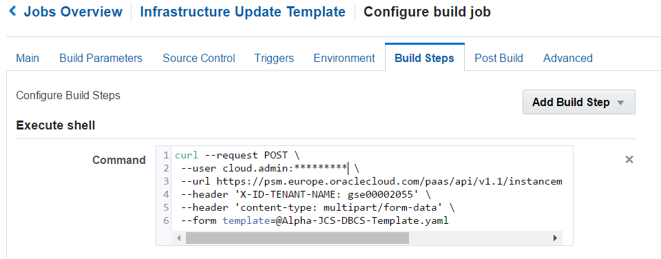

- Click **Save** to complete the configuration.

- Click the **Build Now** button to start the build. This will trigger for the build to be placed in the queue and should start shortly.

    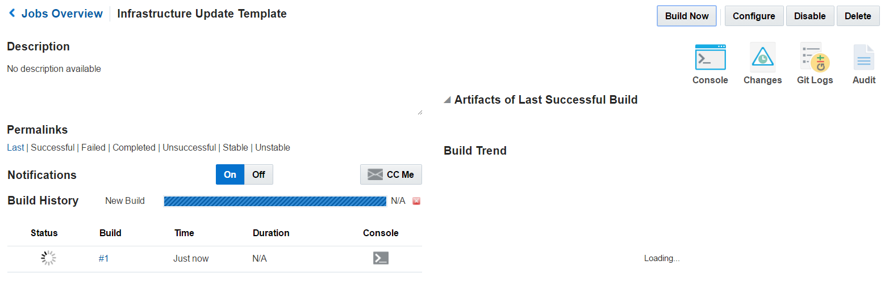

- Once the build has completed you should see a green check.  

    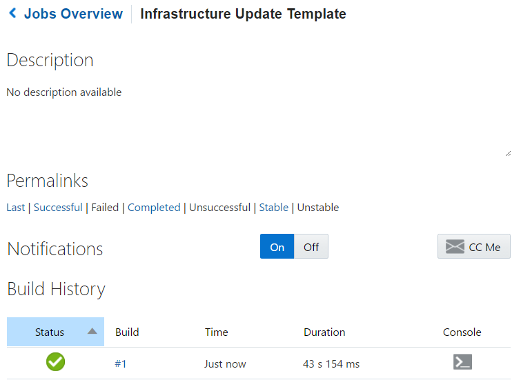

- If you want to view the results or debug a failure click on the **Console** link.

    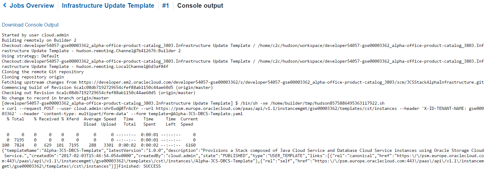

### **STEP 4:** Verify Template Upload to Oracle Cloud

- Now we will navigate to the Oracle Stack Manager console to view the newly uploaded template. Click back on the browser tab that you launched the Developer Console. Click on the far left navigation icon  and select **Database**

    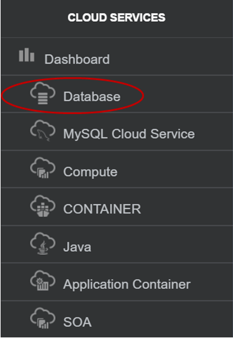

- Click on the far left navigation icon and select **Oracle Cloud Stack**

    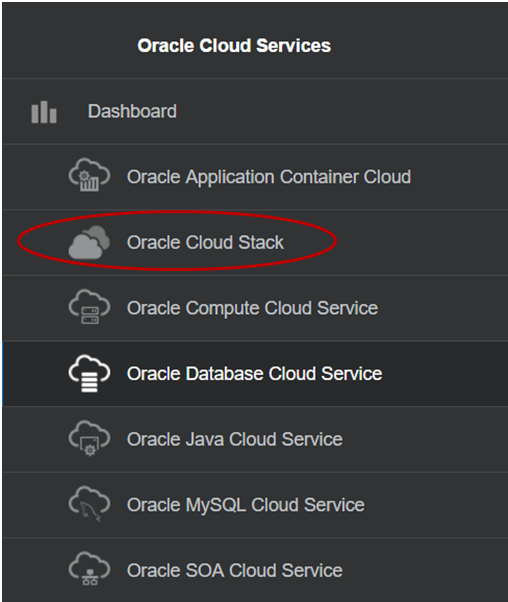

- From this service console you are able to manage and monitor all your **Stacks** and **Templates**.

    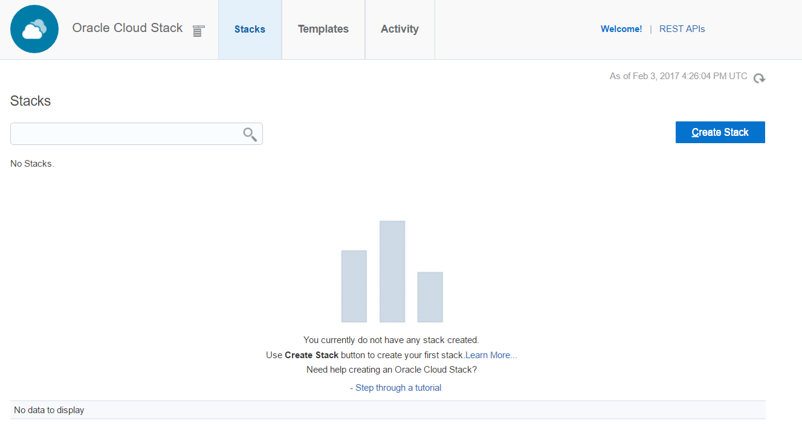

- Click on **Templates**. You should see your newly uploaded template **Alpha-JCS-DBCS-Template** along with the default templates supplied by Oracle.

    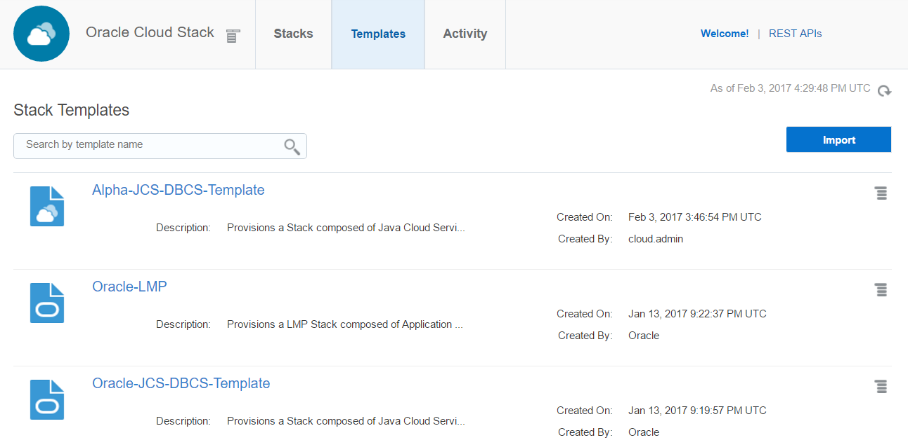

- Click on **Alpha-JCS-DBCS-Template** to view details about your template. The **Topology** gives you a graphical view of the Stack.  Our template has **JCS**, **DBCS** and **Storage Cloud** (backupContainer). If you expand the **Template** section you can view the entire template file.

    

## Create Default Build for Stack Create

### **STEP 5:** Create Stack Create Build Process

Now we will create a build process that will provision a new Oracle Stack every time a change is made to a configuration file.  This File will define the need parameters to create unique environment using Oracle Stack Manager based on the newly uploaded template **Alpha-JCS-DBCS-Template**.

- Back in the Developer Cloud Service, click **Build**, followed by clicking **New Job**.

    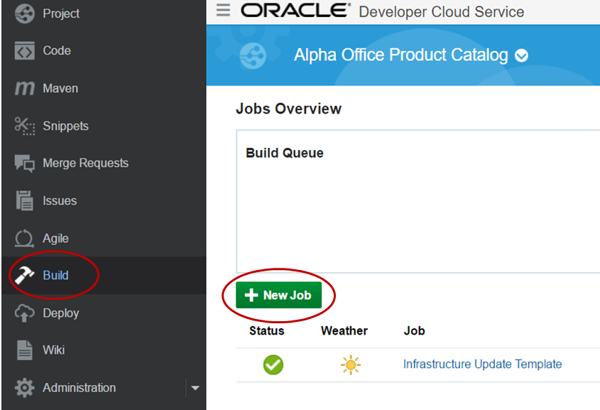

- In the New Job popup enter **Infrastructure Create Stack** for the Job Name, and then click **Save**.

    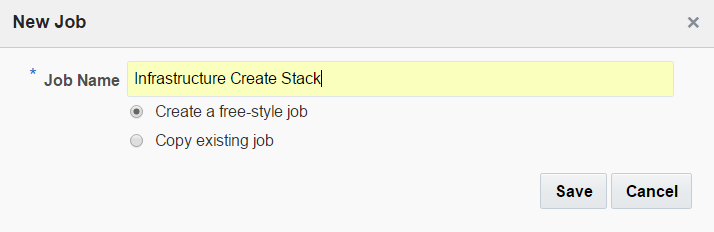

- You are now placed into the job configuration screen.        

    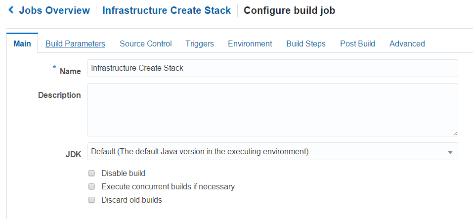

- Click the **Source Control** tab. Click **Git** and select **JCSStackAlphaInfrastructure.git** from the drop down. Expand **Advanced Git Settings** and enter `JCSBuild.conf`

    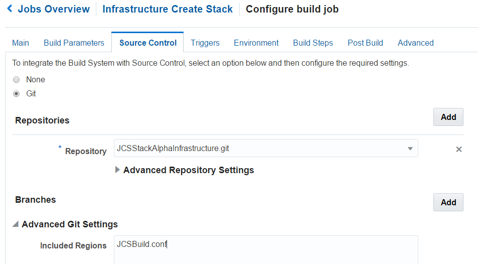

- Click the **Triggers** tab. Select **Based on SCM polling schedule**.

    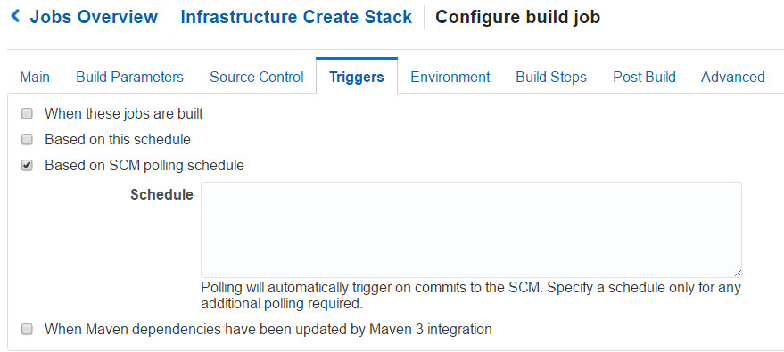    

- Click the **Build Steps** tab. Click **Add Build Step**, and select **Execute shell**.

    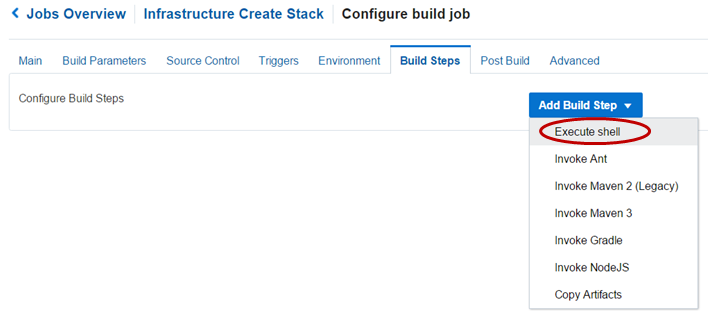

- Enter the following REST call for the **Execute Shell Command:**

```
source ./JCSBuild.conf
curl --request POST \
  --user <OPC username>:<OPC password> \
  --url https://psm.europe.oraclecloud.com/paas/api/v1.1/instancemgmt/<OPC Identity Domain>/services/stack/instances \
  --header 'X-ID-TENANT-NAME: <OPC Identity Domain>' \
  --header 'content-type: multipart/form-data' \
  --form name=$ServiceName \
  --form template=Alpha-JCS-DBCS-Template \
  --form 'parameterValues={"commonPwd":"'"$CommonPassword"'", "backupStorageContainer":"'"$BackupStorageContainer"'", "cloudStoragePassword":"<OPC password>"}}'
```

**Note:** Replace <OPC > with your OPC credentials

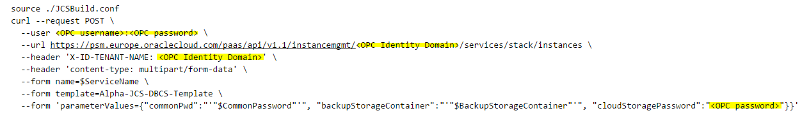

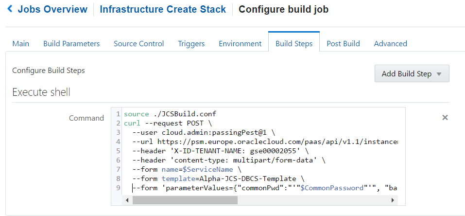

- Click **Save** to complete the configuration. We will execute a build at this time, as we want to trigger the build by updating the **JCSBuild.conf** file.

    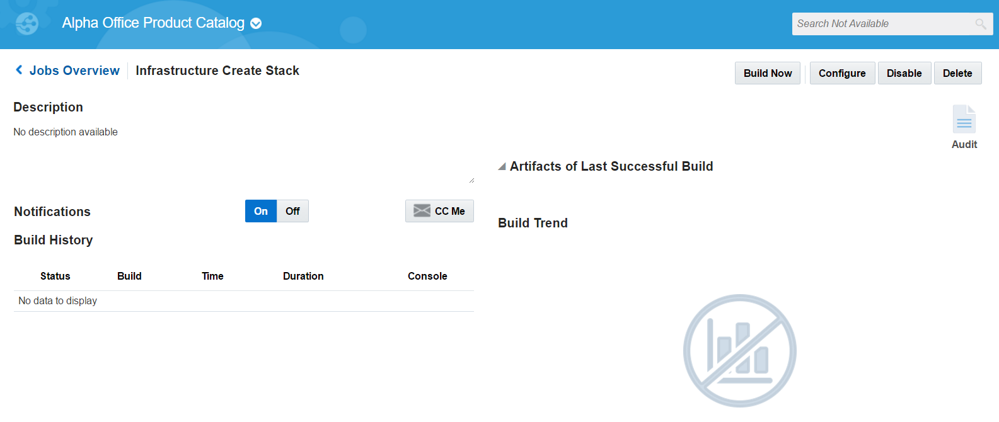

### **STEP 6:** Complete Task

We have now completed our task. To finish up this part of the lab we will want to mark the Issue as completed in our Sprint.

- Back in the Developer Cloud Service, click **Agile**, followed by clicking **Active Sprints**.

- Drag and drop **Task 1** from **In Progress** to **Completed**.

    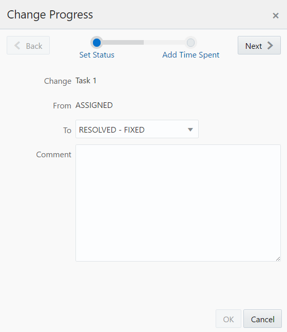

- In the Change Progress popup click **Next**

- Set number of days to 1 and click **OK**

    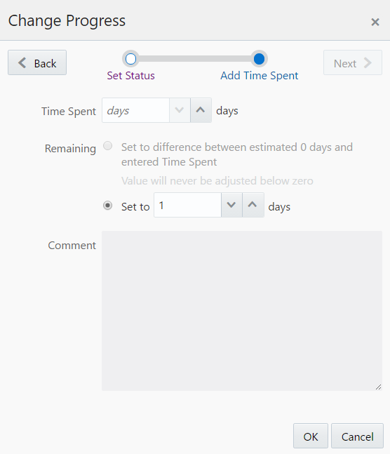

- Your Sprint should now look like the following:

    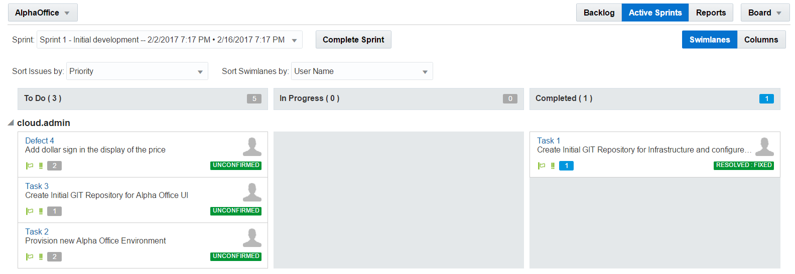

# Provision new Alpha Office Environment by modifying configuration file

##  Clone Project to Eclipse IDE

### **STEP 7:** Load Eclipse IDE

- Right Click and select **Run** on the **Eclipse** Desktop Icon

    

### **STEP 8:** Create connection to Oracle Developer Cloud Service    

- We will now create a connection to the Developer Cloud Service. To do this, first click on the menu options **Window -> Show View ->Other**

    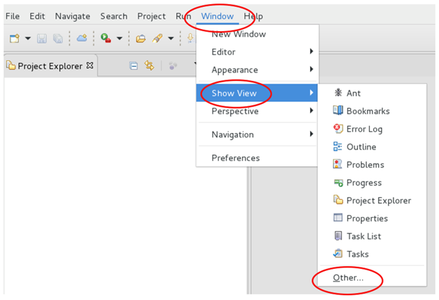

- Enter **oracle** in the search field. Select **Oracle Cloud**, and click on **OK**.

    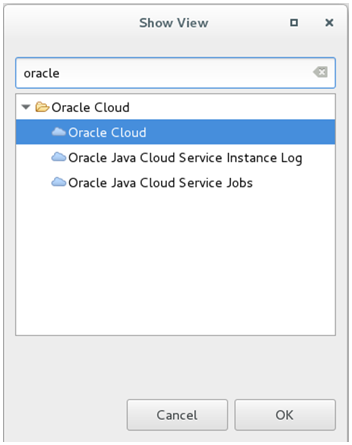

- Click on **Connect** in the Oracle Cloud tab

    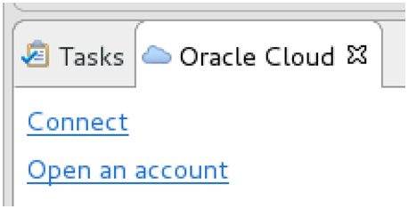

- Enter the following information and click **Finish**

    **Identity Domain:** `<your identity domain>`

    **User name:** `<your identity domain username>`

    **Password:** `<your identity domain password>`

    **Connection Name:** `OracleConnection`

    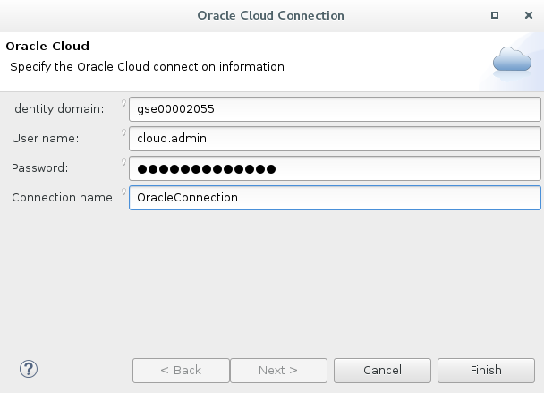

- If prompted, enter and confirm a Master Password for the Eclipse Secure Storage. In our example we use the **password** of `oracle`. Next, press **OK**.

    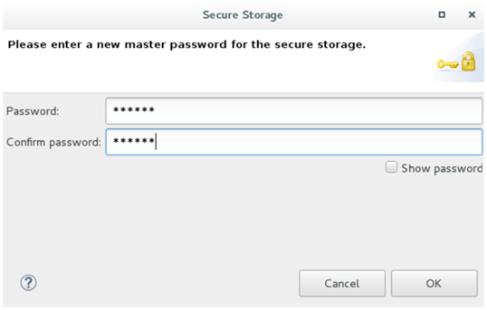

- If prompted to enter a Password Hint, click on **No**

    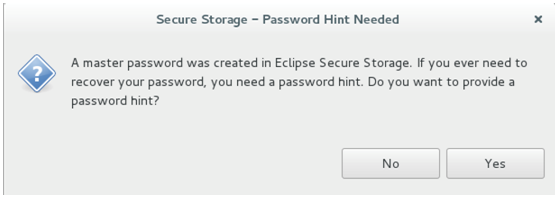

### **STEP 9:** Create a local clone of the repository

- Expand **Developer**, and then double click on **Alpha Office Product Catalog** to activate the project.

    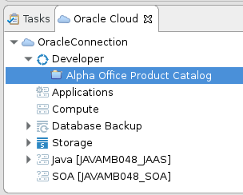

- **Expand** the **Code**, and double click on the **Git Repo [JCSStackAlphaInfrastructure.git]**, to cause the Repo to be cloned locally.

    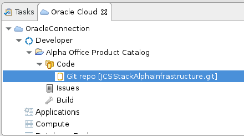

- **Right Click** on the **JCSStackAlphaInfrastructure** cloned repository and click on **Import Projects**.

    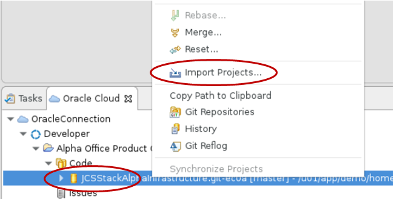

- Accept the Import defaults, and **click** on **Finish**

    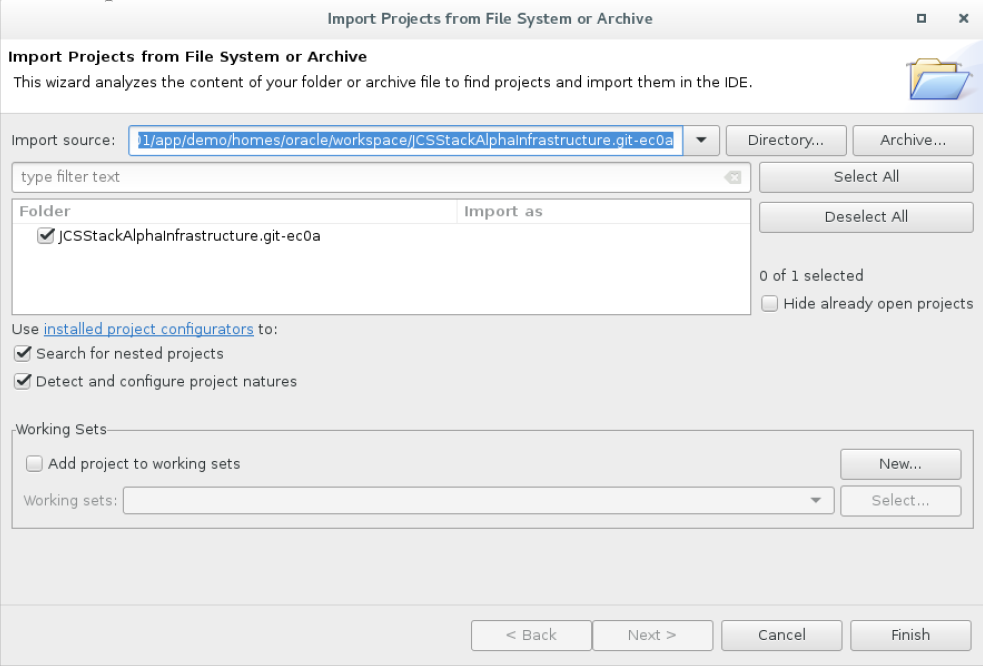

### **STEP 10:** Set Task 2 Status to In Progress

In the previous steps we updated the status of the Tasks using the web interface to the Developer Cloud Service. In this step we will use the Eclipse connection to the Developer Cloud Service to update the status of the tasks.

- Within the Oracle Cloud Connection tab, double click the **Issues** to expand, then double click on **Mine** to expand your list. Once you see the list of your Issues, then double click on **Provision new Alpha Office Environment**.

    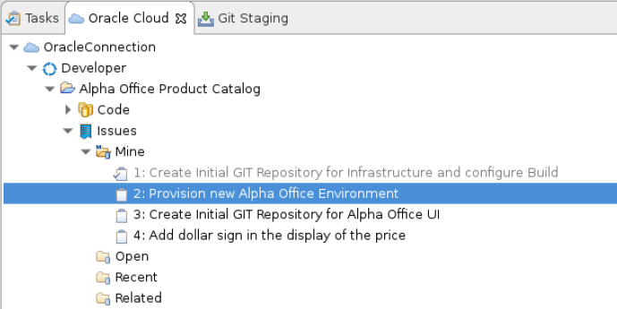

- Scroll down to the bottom of the **Provision new Alpha Office Environment** window. In the **Actions section**, and change the Actions to **Accept (change status to ASSIGNED)**, then click on **Submit**.

    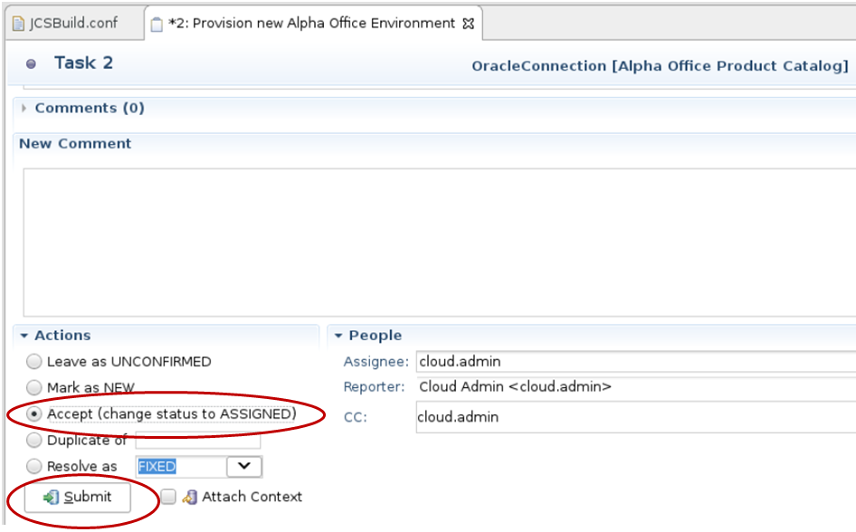

- Optionally, if you return to the Developer Cloud Service web interface, you’ll see that the Eclipse interface caused the **Task 2** to be moved to the **In Progress** column of the **Agile > Active Sprints**.

    

### **STEP 11:** Modify Configuration File

- Expand the project and double click on **JCSBuild.conf** to open

    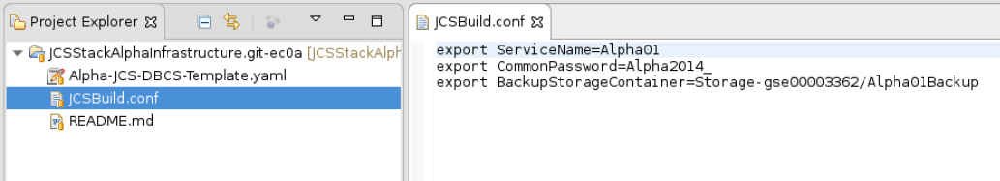

- Modify the values as defined below and click **Save All**

    **ServiceName=Alpha02**

    **BackupStroageContainer=Storage-\<Your OPC identity Domain\>/Alpha02Backup**

    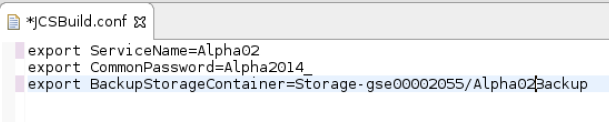

##  Commit Code

### **STEP 12:** Commit Code

- Right click on **JCSStackAlphaInfrastructure** and then Select **Team > Commit**

    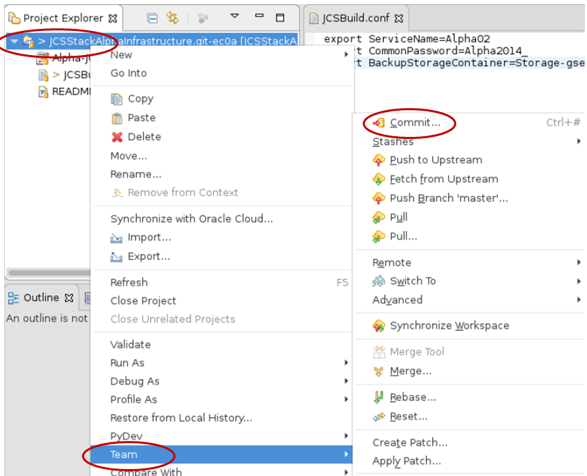

- Enter `Provision Stack Alpha02` in the Commit Message box and click **Commit and Push**.

    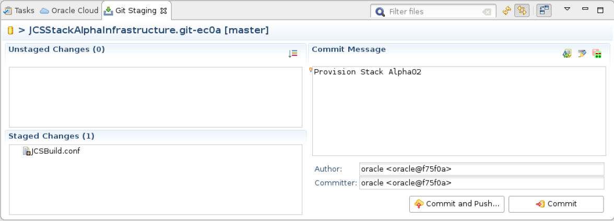

- Click **OK** on the Push Result dialog

    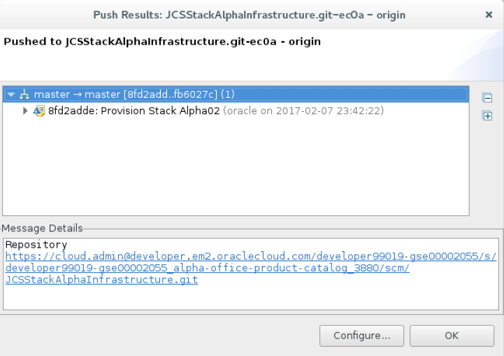

##  Verify Provisioning

### **STEP 13:** Verify Build job ran

- Click **Code** on left hand navigation then click **Commits**. Notice that the file has been committed to the Git repository.

    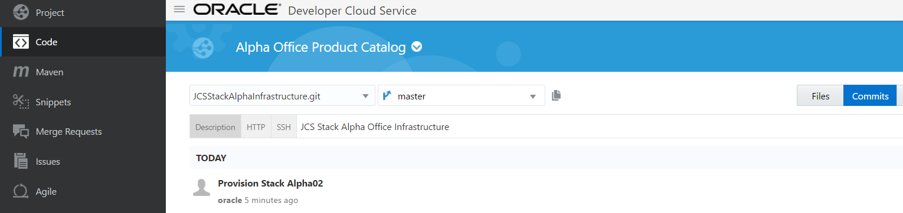

- Click **Build** on left hand navigation. You should now see that the **Infrastructure Create Stack** build is running, or just completed. If it's running, wait for it to complete.

    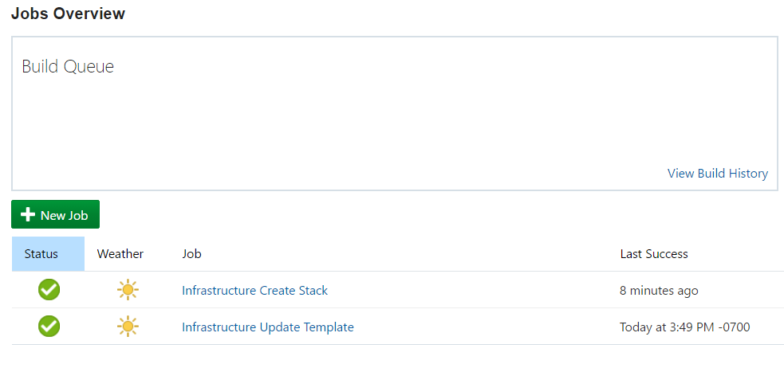

### **STEP 14:** Monitor in Oracle Cloud

- Switch back to browser tab with **Oracle Stack Manager**.  Click on **Stack** and you should see that Alpha02 stack is "Creating" and building out an Oracle Database Cloud Service and a Java Cloud Service.

    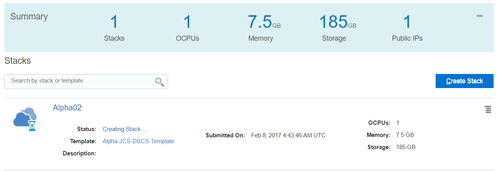

- Click on **Alpha02** to view details.

    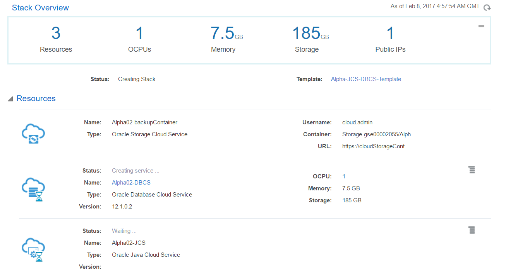

### **STEP 15:** Set Task 2 Status to In Progress

- From either Eclipse or Developer Cloud Service console update the status of **Task 2** to **Completed**. Your sprint should now look like the following.

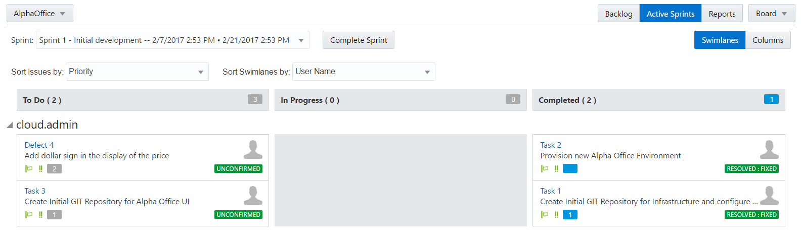

- You have completed Lab 200. For the next lab we will use an already provisioned environment.
