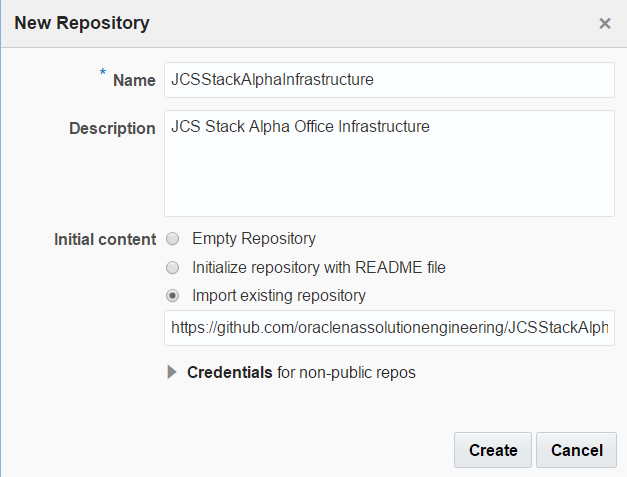

  

Update: January 29, 2017

## Introduction

This is the second of several labs that are part of the **DevOps JCS Pipeline using Oracle Stack Manger workshop**. This workshop will walk you through the Software Development Lifecycle (SDLC) for a Java Cloud Service (JCS) project that goes through Infrastructure as Code and deployment of Struts application.

In the first lab (100), the Project Manager created a new project in the Developer Cloud Service, created and assigned tasks to the developers of this application. In this lab, you will assume the persona of Operations, who will be tasked with creating an Infrastructure as Code pipeline for the provisioning of Alpha Office Java Cloud Service (JCS) environment.


Please direct comments to: Dennis Foley (dennis.foley@oracle.com)

## Objectives
- Access Developer Cloud Service
- Import configuration from external Git Repository
- Build Infrastructure as Code pipeline
- Check in new template file
- Import Project into Eclipse
- Check in configuration file to provision new JCS environment.

## Required Artifacts
- The following lab requires an Oracle Public Cloud account that will be supplied by your instructor. You will need to download and install latest version of Eclipse or use supplied compute VM.


# Create Initial Git Repository for Infrastructure

## Create Initial Git Repository

**Note:** For this lab you will take on the persona of Bala Gupta. Bala is our operations engineer and will be handling all operations issues.

### **STEP 1:** Update Issue Status
- Click on the **AlphaOffice** Board **Active Sprints**.

    

- Drag and drop **Task1 - Create Initial GIT Repository for Infrastructure and configure build** into the **In Progress** swim-lane.  

    

- Click **OK** on Change Progress popup.

    
    

### **STEP 2:** Create Repository
- In the left hand navigation panel, click **Project**.

- Click on **New Repository** to create a new Git Repository.

    

- In the New Repository wizard enter the following information and click **Create**.

    **Name:** `JCSStackAlphaInfrastructure`

    **Description:** `JCS Stack Alpha Office Infrastructure`

    **Initial content:** `Import existing repository`

    **Enter the URL:** `https://github.com/oraclenassolutionengineering/JCSStackAlphaInfrastructure`

    

- You have now created a new GIT repository based on an existing repository.

    

## Create Default Build for Template Upload

**Oracle Cloud Stack Manager** is a feature of Oracle Cloud that allows for the provisioning of multiple services within the Oracle Cloud. In order to build and deploy their applications, businesses often require sophisticated environments that consist of multiple, integrated cloud services. Consider a development environment whose needs include a Java application server along with a relational database. Provisioning each of these services for every member of your development team is time consuming and error prone, regardless of whether you’re using service consoles or REST APIs to provision the services. Oracle Cloud Stack Manager uses templates to provision a group of services (called a stack) and in the correct order.

### **STEP 3:** Create Template Update Build Process

Now that we have the configuration code in our managed GIT repository, we need to create a build process that will be triggered whenever a commit is made to the master branch. This build process will trigger any time the Alpha Office Stack template is modified and upload a new version via REST to the Oracle Cloud.

- On navigation panel click **Build** to access the build page and click **New Job**.

    

- In the New Job popup enter **Infrastructure Update Template** for the Job Name, and then click **Save**.

    

- You are now placed into the job configuration screen.        

    

- Click the **Source Control** tab. Click **Git** and select the **JCSStackAlphaInfrastructure.git* from the drop down.

    

- Click the **Build Steps** tab. Click **Add Build Step**, and select **Execute shell**.

    

- Enter the following REST call for the **Execute Shell Command:**

    ```
curl --request POST \
  --user <opc username>:<opc password> \
  --url https://psm.europe.oraclecloud.com/paas/api/v1.1/instancemgmt/<OPC Identity Domain>/templates/cst/instances \
  --header 'X-ID-TENANT-NAME: <OPC Identity Domain> \
  --header 'content-type: multipart/form-data' \
  --form template=@Alpha-JCS-DBCS-Template.yaml
```

    

- Click **Save** to complete the configuration.

- Click the **Build Now** button to start the build immediately.
