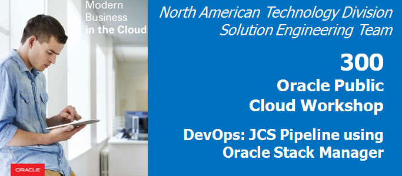  

Update: March 03, 2017

## Introduction

This is the third of several labs that are part of the **DevOps JCS Pipeline using Oracle Stack Manger workshop**. This workshop will walk you through the Software Development Lifecycle (SDLC) for a Java Cloud Service (JCS) project that goes through Infrastructure as Code and deployment of a Struts application.

In the first lab (100), the Project Manager created a new project in the Developer Cloud Service, created and assigned tasks to the developers of this application. In this lab, you will assume the persona of Java Developer who will be tasked with making enhancements to the Alpha Office Product Catalog UI.

***To log issues***, click here to go to the [github oracle](https://github.com/oracle/cloud-native-devops-workshop/issues/new) repository issue submission form.

## Objectives
- Access Developer Cloud Service
- Import configuration from external Git Repository
- Import Project into Eclipse
- Setup Build and Deployment of UI using Developer Cloud Service and Java Cloud Service

## Required Artifacts
- The following lab requires an Oracle Public Cloud account that will be supplied by your instructor. You will need to download and install latest version of Eclipse or use supplied compute VM.

# Create Initial Git Repository for Alpha Office Catalog UI

## Create Initial Git Repository

Although you will remain connected to the Oracle Cloud using the user account you were provided, you are to take on the Persona of ***John Dunbar*** as you perform the following steps. John is our Java developer who will be making the enhancements to our product catalog UI.

  

### **STEP 1:** Update Issue Status
- Click on the **AlphaOffice** Board **Active Sprints**.

    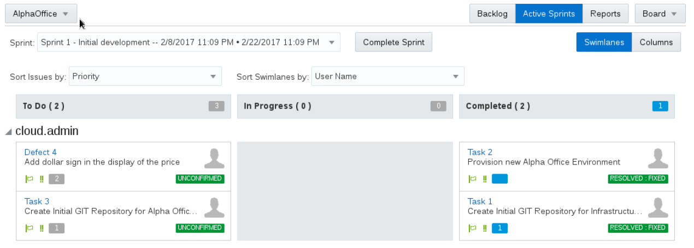

- Drag and drop **Task 3 - Create Initial GIT Repository for Alpha Office UI** into the **In Progress** swim-lane.

    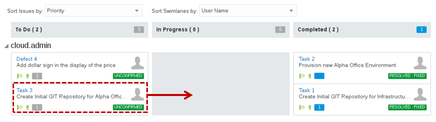

- Click **OK** on Change Progress popup.

    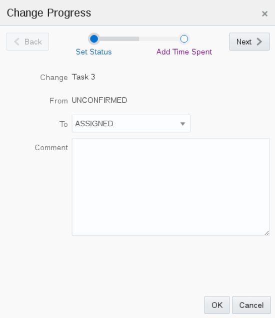

### **STEP 2:** Create Initial Git Repository

- In the left hand navigation panel, click **Project**

- Click on **New Repository** to create a new Git Repository.

    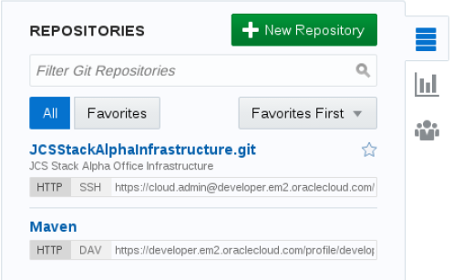

- In the New Repository wizard enter the following information and click **Create**.

    **Name:** `AlphaOfficeProductCatalogUI`

    **Description:** `Alpha Office Product Catalog UI`

    **Initial content:** `Import existing repository`

    **Enter the URL:** `https://github.com/pcdavies/AlphaOfficeProductCatalogUI.git`

    

- You have now created a new GIT repository based on an existing repository.

    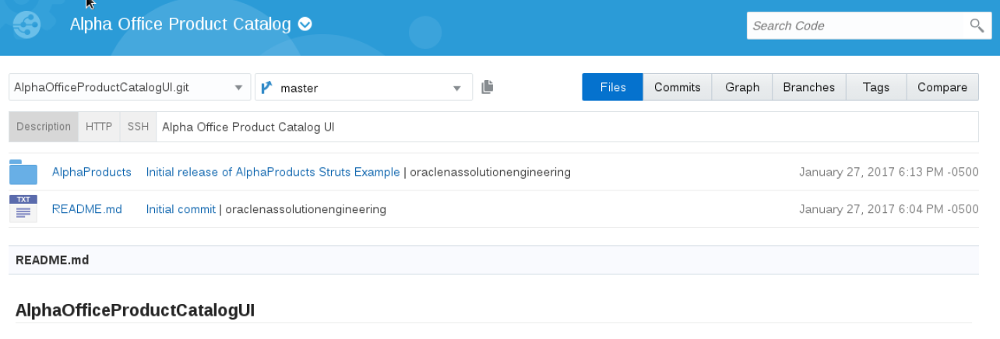

## Create Default Build for and Deployment Process

### **STEP 3:** Create Alpha Office Product Catalog UI Build Process

Now that we have the source code in our managed GIT repository, we need to create a build process that will be triggered whenever a commit is made to the master branch. We will set up a Maven build process in this section.

- On navigation panel click **Build** to access the build page and click **New Job**.

    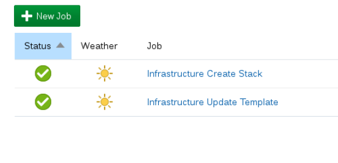

- In the New Job popup enter **Alpha Office Product Catalog UI** for the Job Name, and then click **Save**.

    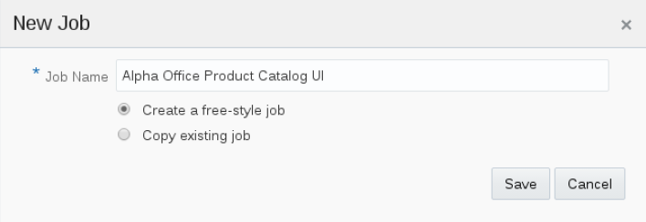

- You are now placed into the job configuration screen.        

    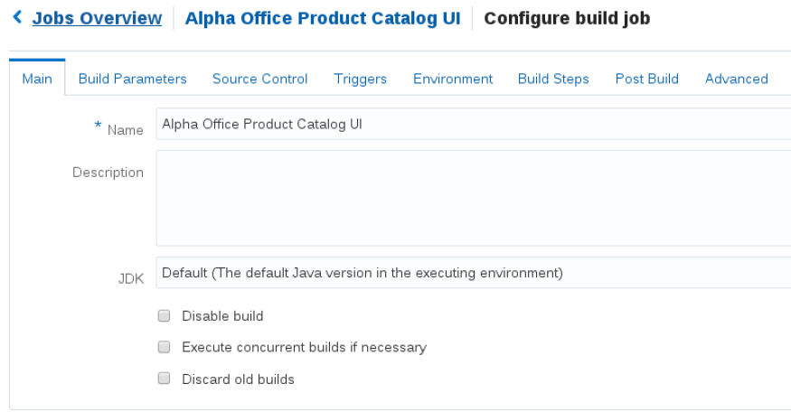

- On the Main tab on the Configure Build screen change the **JDK** drop down to **JDK8**.

    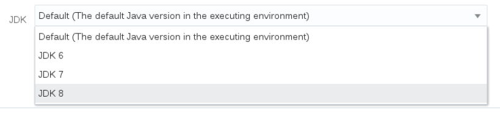

- Click the **Source Control** tab. Click **Git** and select **AlphaOfficeProductCatalogUI.git** from the drop down.

    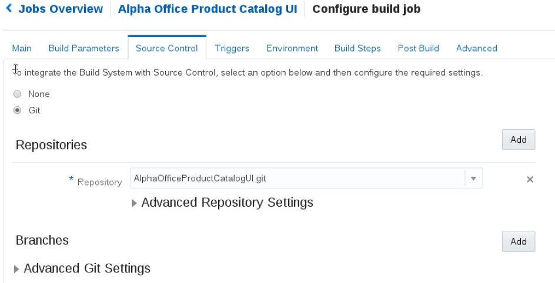

- Click the **Triggers** tab. Select **Based on SCM polling schedule**.

    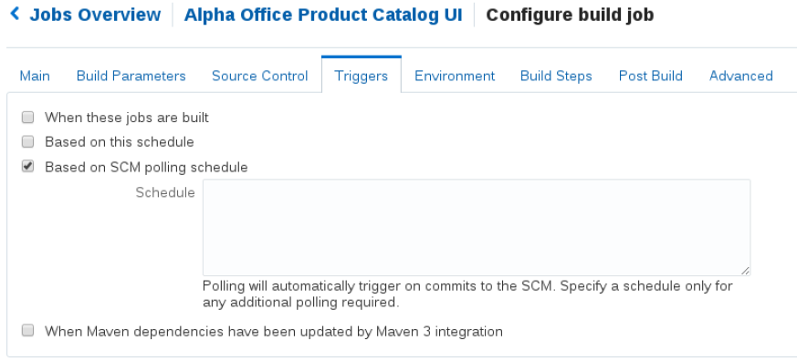    

- Click the **Build Steps** tab. Click **Add Build Step**, and select **Invoke Maven 3**.

    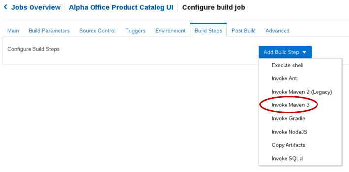

- In the Maven Build Step set the following:

    **Goal**: `clean -Dmaven.test.skip=true install` 
    
    (Note: This new Goal will allow integration tests to be run after the deployment of the application)
    
    **POM File**: `AlphaProducts/pom.xml`  

    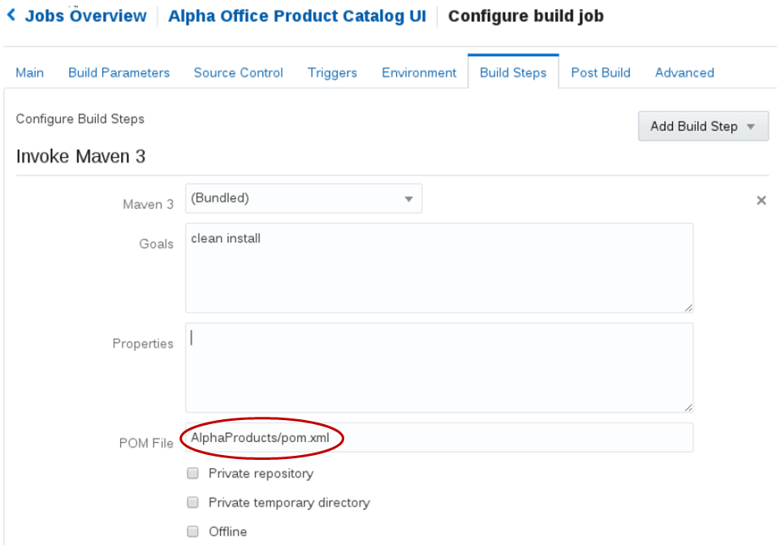

- Click the **Post Build** tab. Check **Archive the artifacts** and enter `**/target/*` for the Files to Archive.

    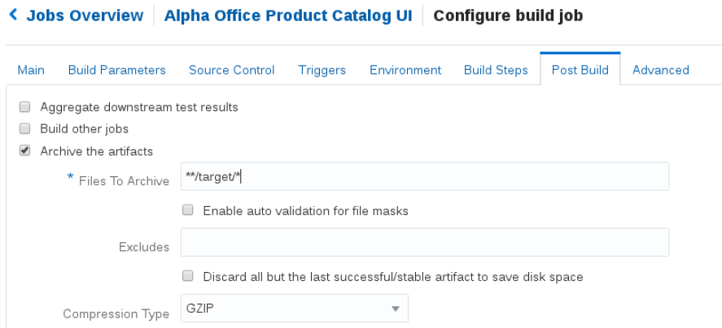

- Click **Save** to complete the configuration.

- Click the **Build Now** button to start the build. This will trigger for the build to be placed in the build queue.

- Click on the **Jobs Overview** link to return to the jobs dashboard. 

    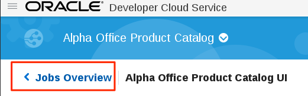

- It is possible that the Job will show in the Queue. Wait, as it may take 30 seconds or more, but the status will change indicating that the job is building as is shown below:

    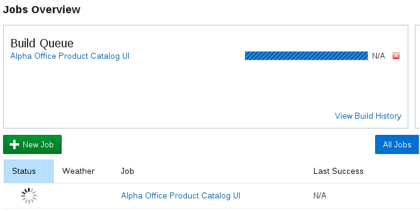

- Once the build has completed, you should see a green check next to the build name.  Wait for the build to complete before continuing to the next step, as we need the build artifact to complete the deployment configuration.

    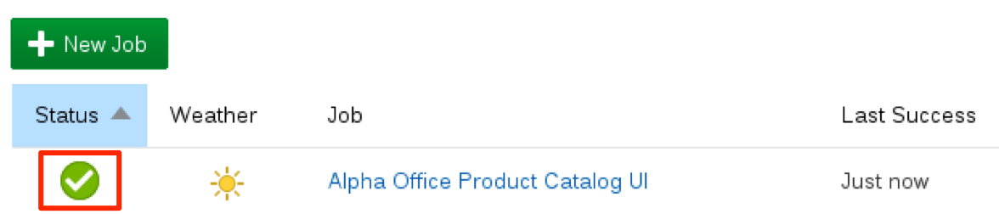

### **STEP 4:** Retrieve Public IP of JCS Instance for Deployment

Before we can configure deployment of our application we need to make note of the IP for our JCS instance. The **Alpha01A-JCS** instance has already been provisioned.

- Switch over to browser tab for cloud services. Click on the far left navigation icon and select **Oracle Java Cloud Service**.

    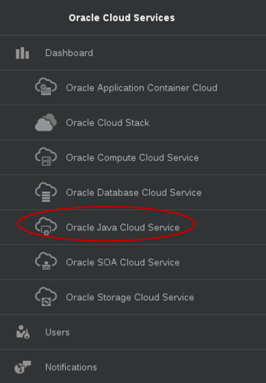

- The Java Cloud Service console shows all the provisioned instances of JCS.  You should see the instance **Alpha01A-JCS** which has been provisioned in advance.

    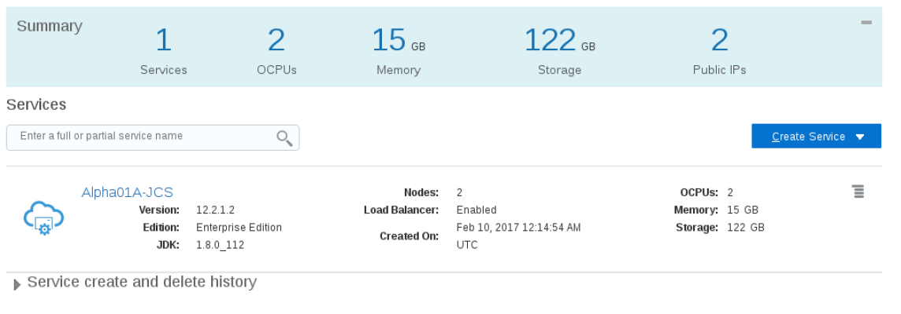

- Click on **Alpha01A-JCS** to view the details of the service. Copy down the **Public IP** to be used later in the lab.

    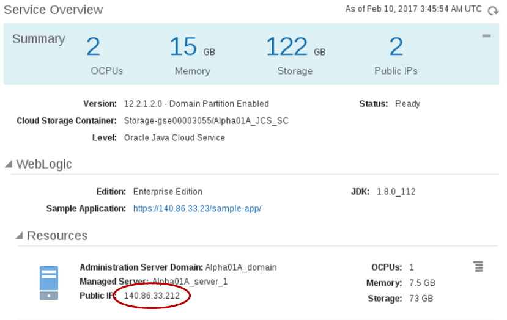

- Expland the **Load Balancer** section and copy down the **Public IP** to be used later in the lab.

    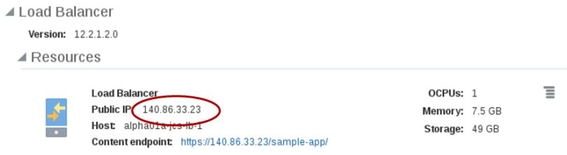

### **STEP 5:** Create Alpha Office Product Catalog UI Deployment Process

- Switch back to **Developer Cloud Service**. On the navigation panel click **Deploy** to access the Deployment page. Click **New Configuration**

    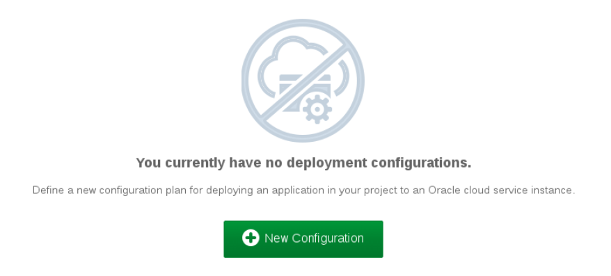

- Enter the following data:

    **Configuration Name:** `AlphaProductsDeploy`

    **Application Name:** `AlphaProducts`

    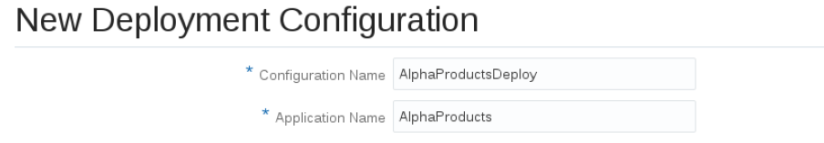

- To the right of the Deployment Target, click **New** and select **Java Cloud Service**    

    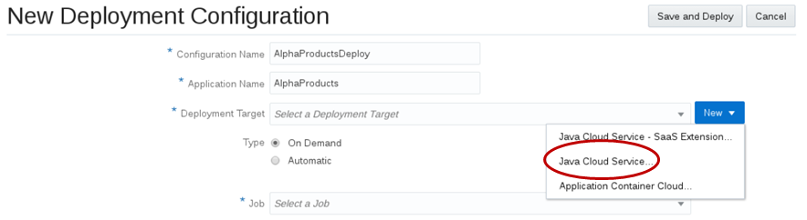

- Enter the following data:

    **Host:** `<Public IP for JCS Service capture in previous step>`

    **Username:** `weblogic`

    **Password:** `Alpha2014_`

    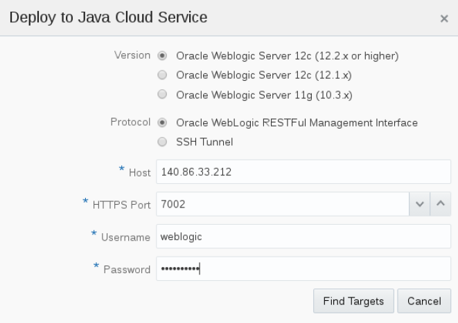

- Click **Find Targets**. Check **Accept this certificate when connecting to the JCS instance** and click **OK**

    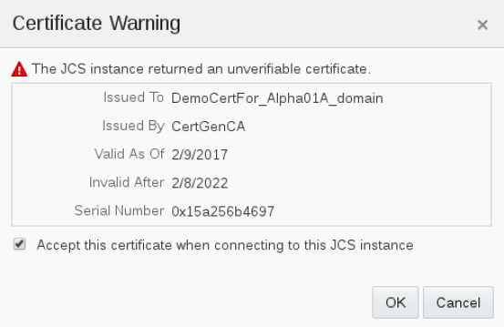

- Check **Alpha01A_cluster** to deploy to the entire cluster and click **OK**

    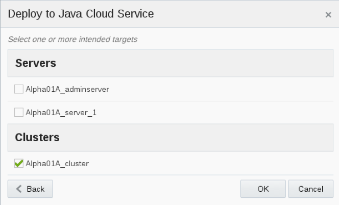

- Set the following Properties and click **Save**

    **Type:** `Automatic and check Deploy stable builds only`

    **Job:** `Alpha Office Product Catalog UI`

    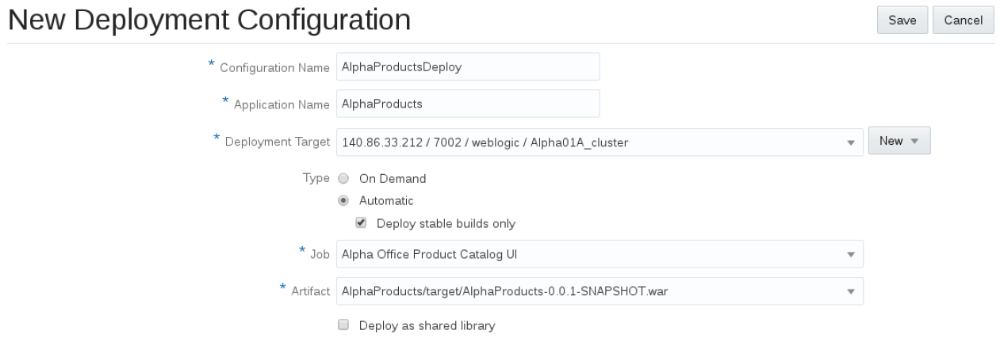

- Click drop down and select **Start**

    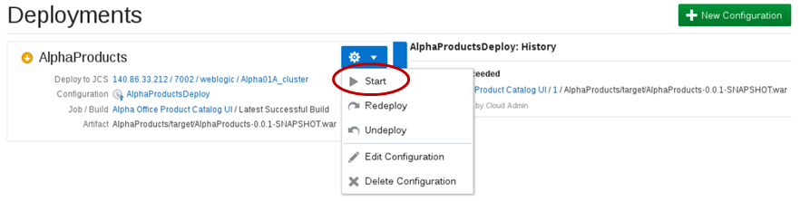

- Wait until the message **Starting application** changes to **Last deployment succeeded**

    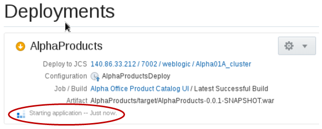
    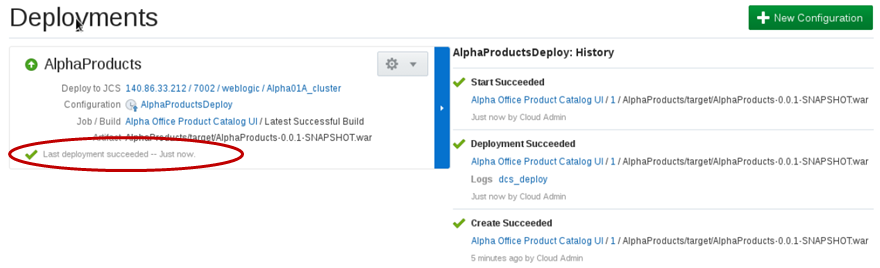

## Verify Alpha Office Product Catalog UI deployment

### **STEP 6:** Verify deployment in Weblogic Console

- Switch back to the Java Cloud Service Console browser tab, in which you are viewing **Alpha01A-JCS**. Click the hamburger menu  and select **Open WebLogic Server Console**

    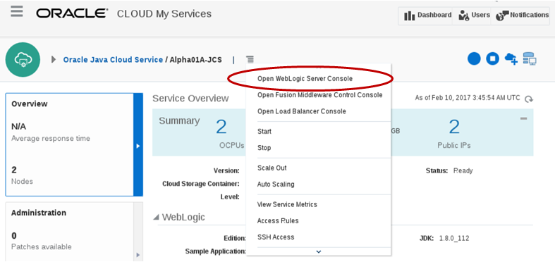

- A new browser tab will open. On the security warning click **ADVANCED** and then click **Proceed to ...**

    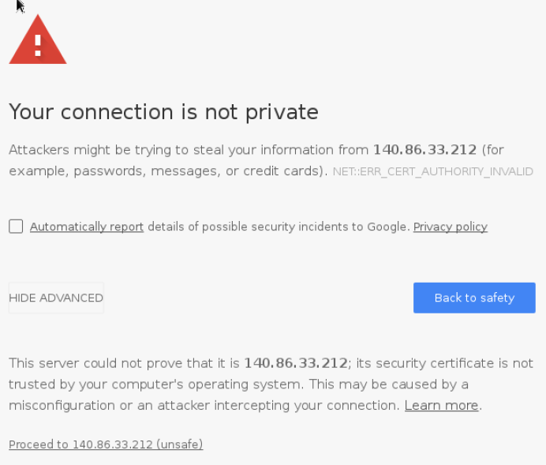

- You will be presented with the **WebLogic Server Console** login. Enter the following and click **Login**

    **Username:** `weblogic`

    **Password:** `Alpha2014_`

    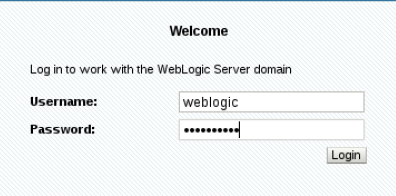

- In the **Domain Structure** panel click **Deployments**

    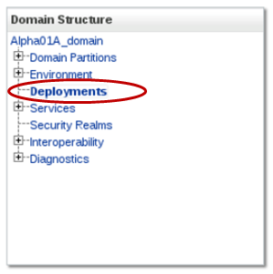

- You should see the newly deployed **AlphaProducts** application you deployed in the previous Step.

    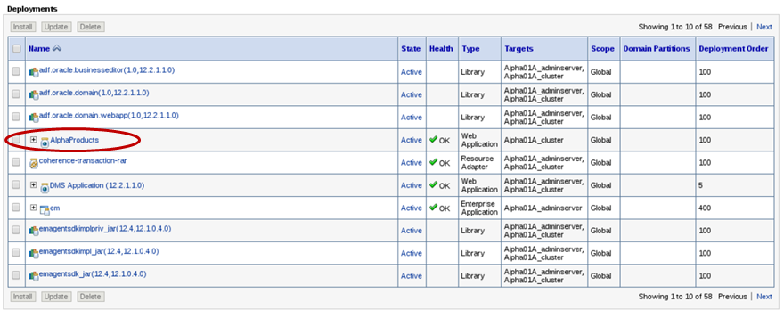

### **STEP 7:** Open UI in browser

- Open a new tab in the browser and enter the following URL:

    **https://** ***\<Public IP of Load Balancer\>*** **/AlphaProducts**

- On the security warning click **ADVANCED** and then click **Proceed to ...**

    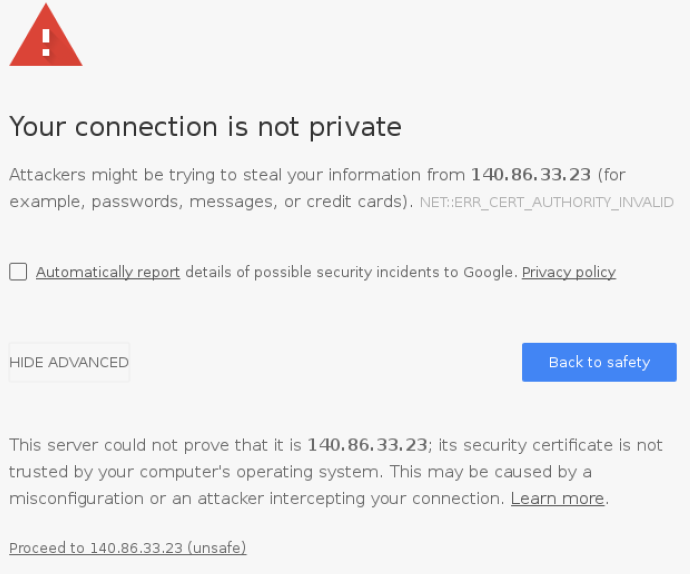

- You should now see the **Alpha Office Product Catalog UI**

    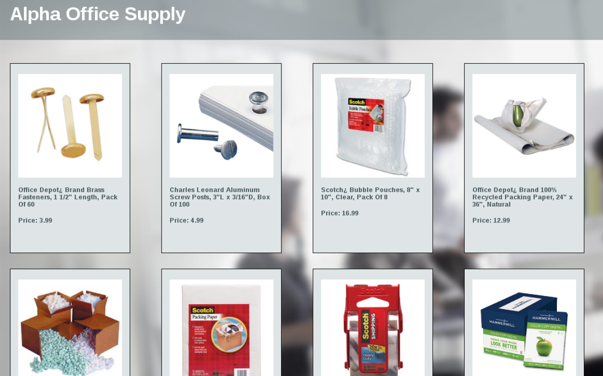

### **STEP 8:** Complete Task

We have now verified that both the build and deployment of the Alpha Office Product Catalog UI is functioning properly. To finish up this part of the lab, we will mark the Issue as completed in the Sprint.

- Back in the Developer Cloud Service window, click **Agile**, followed by clicking **Active Sprints**.

- Drag and drop **Task 3** from **In Progress** to **Completed**

    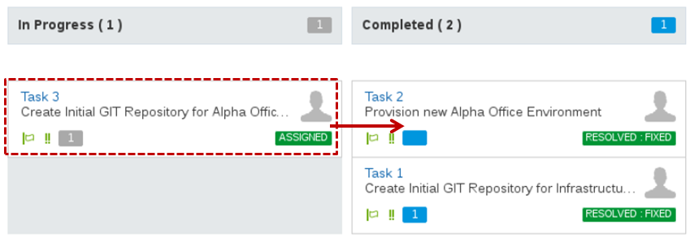

- In the Change Progress popup click **Next**

- Set number of days to **1** and click **OK**

    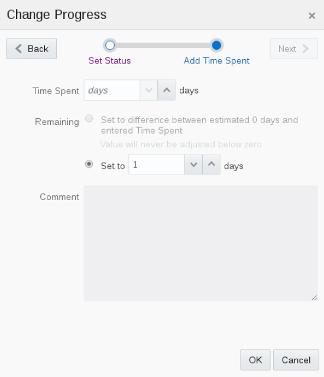

- Your Sprint should now look like the following:

    

## Add dollar sign in the display of the price

### **STEP 9:** Import Project into Eclipse

Our next activity is to work on the defect issue that has been assigned to us. We will start by updating the status in the Sprint. We will be performing the majority of work in Eclipse.

- You should already have Eclipse running and be connected to Oracle Cloud. Click back into the **Oracle Cloud** connection tab. Right click on **OracleConnection** and select **Refresh**

    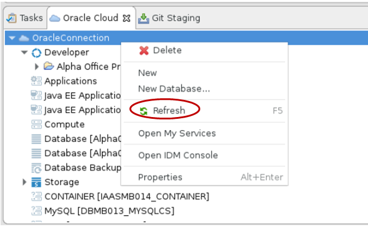

- Expand **Developer**, Expand **Alpha Office Product Catalog**, Expand **Code**. Double click on **Git Repo AlphaOfficeProductCatalogUI.git** to clone the repository.

    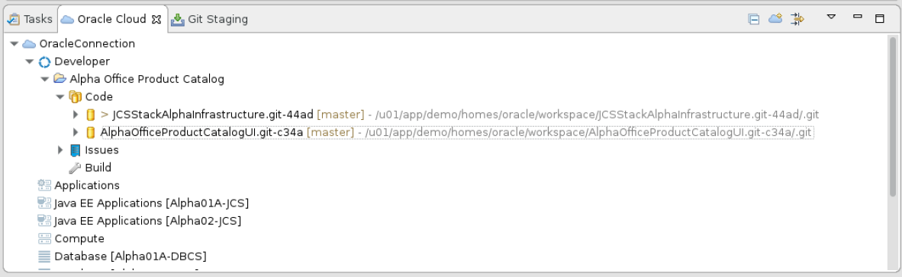

- **Right Click** on the **AlphaOfficeProductCatalogUI** cloned repository and click on **Import Projects**.

    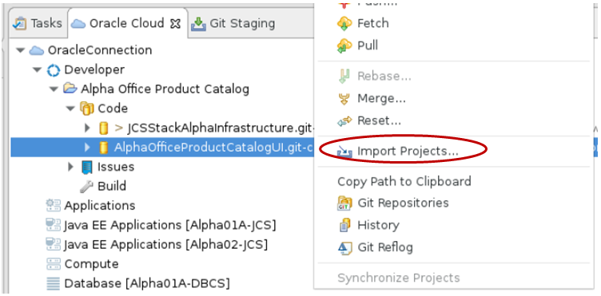

- Accept the Import defaults and click **Finish**

    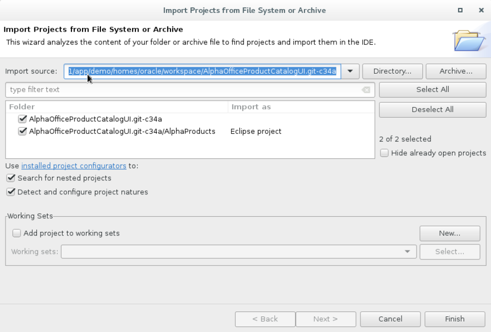

### **STEP 10:** Set Defect 4 Status to In Progress

- click the **Issues** to expand, then double click on **Mine** to expand your list. Once you see the list of your Issues, then double click on **Add dollar sign in the display of the price**.

    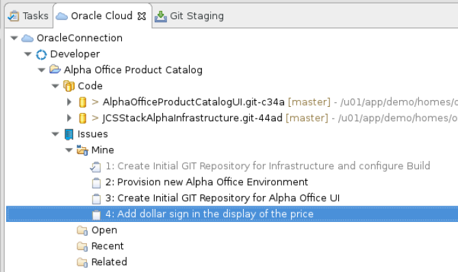   

- Scroll down to the bottom of the **Add dollar sign in the display of the price** window. In the **Actions section**, and change the Actions to **Accept (change status to ASSIGNED)**, then click on **Submit**.

    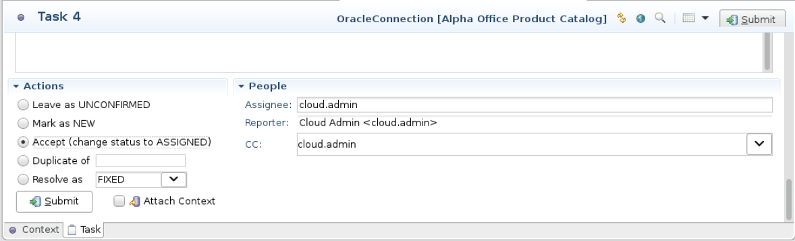

- Optionally, if you return to the Developer Cloud Service web interface, you’ll see that the Eclipse interface caused the **Defect 4** to be moved to the **In Progress** column of the **Agile > Active Sprints**.

    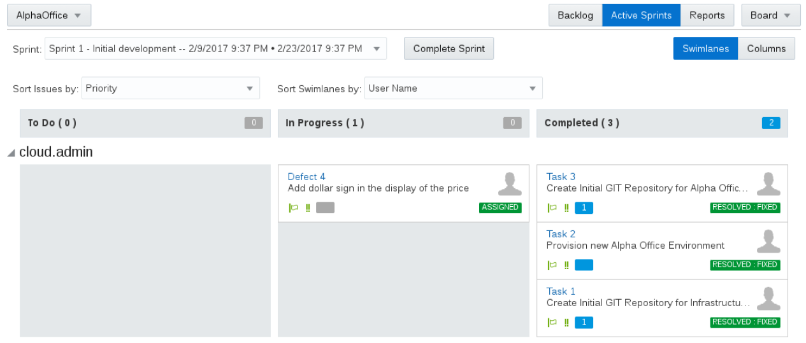

### **STEP 11:** Fix the Code

- Before we start making any changes to our code we will want to create a branch that will contain all of our work for this issue. Right click on **AlphaProducts** and select **Team >
 Switch To > New Branch**

 

- Enter **Defect4** for the Branch name, and click **Finish**. It may take minute to update the Maven dependencies. 

    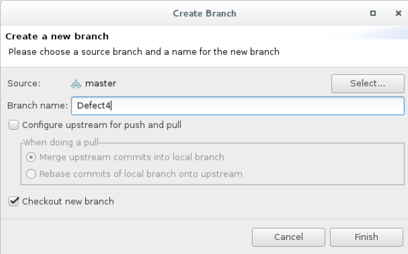

- Expand **AlpahProducts > WebContent** then double click on **displayrecords.jsp**

    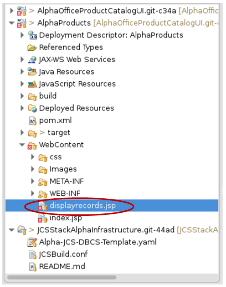

- On line 20 of **displayrecords.jsp** add **$** after the Price and click **Save All** 

    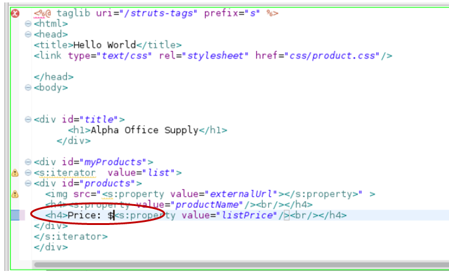

### **STEP 12:** Commit and push Code to Developer Cloud Service

- Right click on **AlphaProducts** and select **Team >
 Commit**

 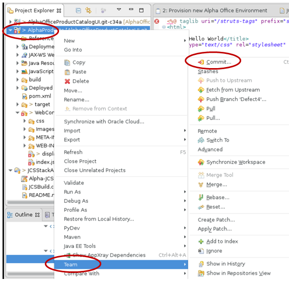

- Drag **displayrecords.jsp** from **Unstaged Changes** to **Staged Changes**. 

- Enter `Added dollar sign to display of Price` for Commit Message. 

- Click **Commit and Push**

    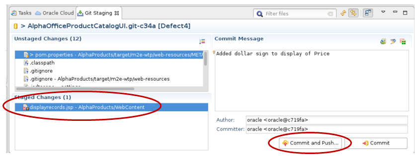

- Accept defaults and click **Next**

    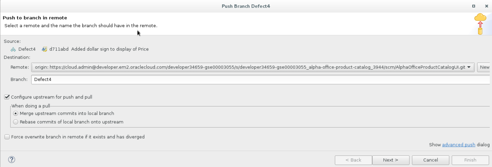

- On Push Confirmation click **Finish**

    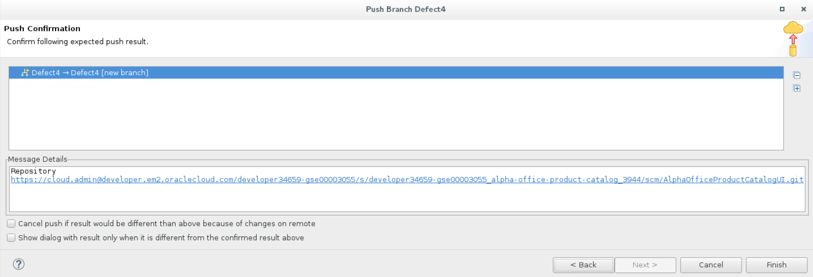

- Click **OK** on Push Results

    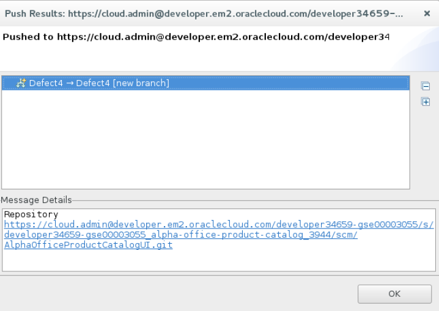

## Create Merge Request

### **STEP 13:** Create Merge request

- Return to the Developer Cloud Service Dasboard in the browser. Click on **Code**. Select the **Defect4** branch and then click on the **Commits** sub tab. Now view the commit made to the branch from within Eclipse.

    

- Now that John Dunbar has completed the task of adding dollar sign, a **Merge Request** can be created and assigned to Lisa Jones for review. Click on **Merge Requests** on the navigation panel, and then click on the **New Merge Request** button.

    

- Enter the following information into the **New Merge Request** and click **Next**

    **Repository:** `AlphaOfficeProductCatalogUI.git`

    **Target Branch:** `master`

    **Review Branch:** `Defect4`

    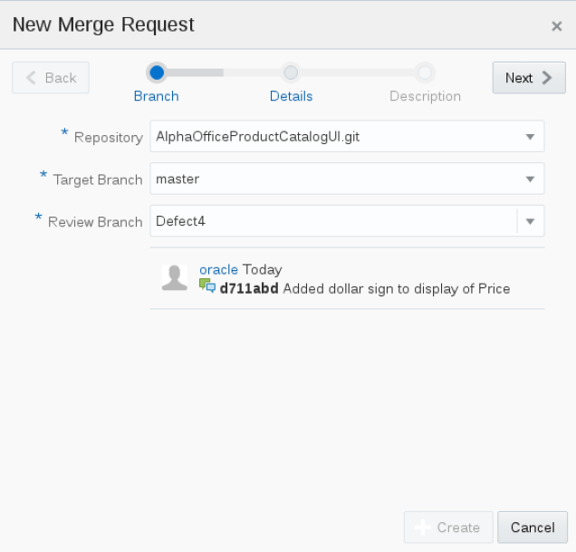

- Enter following information into **Details** and click **Create**

    **Summary:** `Added dollar sign to the display of the price`

    **Reviewers:** `Logical user is Lisa Jones - Select your username`

    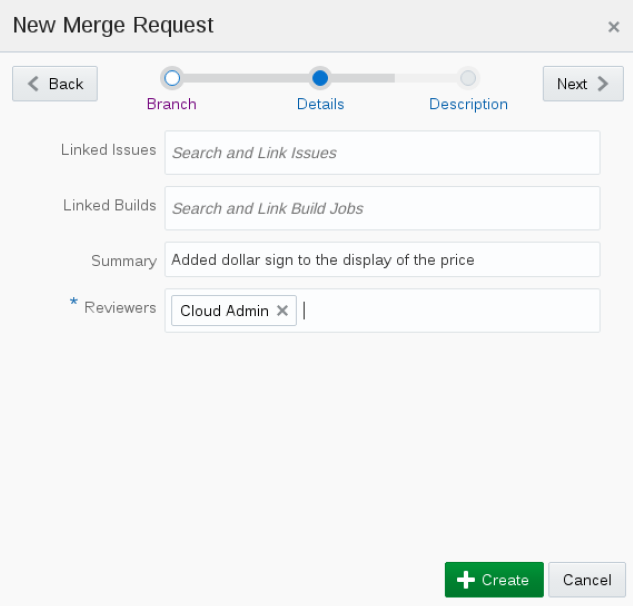

- In the **Write box**, enter the following comment and then click on the **Comment** button to save:    

    `I have updated the displayrecords.jsp to correctly display the Price.`

    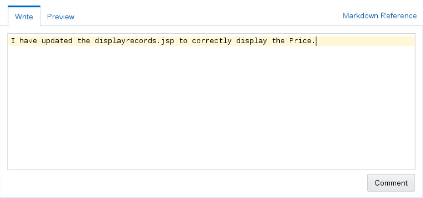

## Merge the Branch as Lisa Jones

### **STEP 13:** Merge Requests

- In the following steps the logical persona “Lisa” will merge the branch created by “John” into the master.

    

- on the navigation panel, click **Merge Requests**. Select the **Assigned to Me** search. After the search completes. click on the **Added dollar sign to the display of the price** assigned request.

    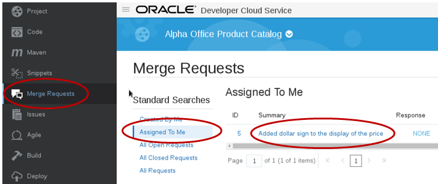

- Once the request has loaded, select the **Changed Files** tab. "Lisa" will now the opportunity to review the changes in the branch, make comments, request more information, etc. before Approving, Rejecting or Merging the Branch.

    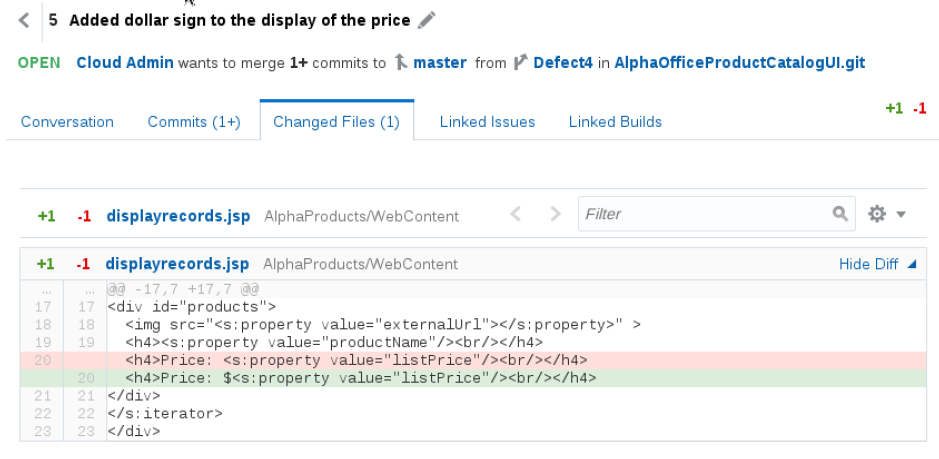

- Click on the **Merge** button.

    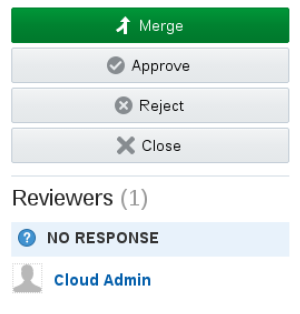

- Leave the defaults, and click on the **Merge** button in the confirmation dialog.

    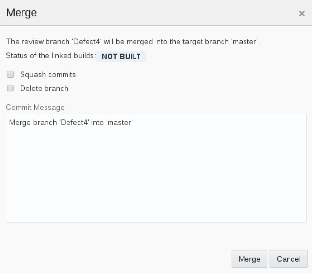

### **STEP 14:** Monitor Build and Deloyment

- Now that the code has been commited to the master branch, I may take a minute or two, but the build and deployment will automatically start. On the navigation panel click **Build**, and you should see **Alpha Office Product Catalog UI** in the queue.

    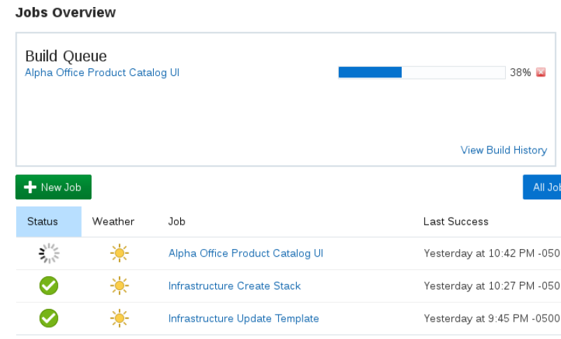

- Wait a minute or two for the build to complete. The **Last Success** will be set to **Just Now** when the build completes.

    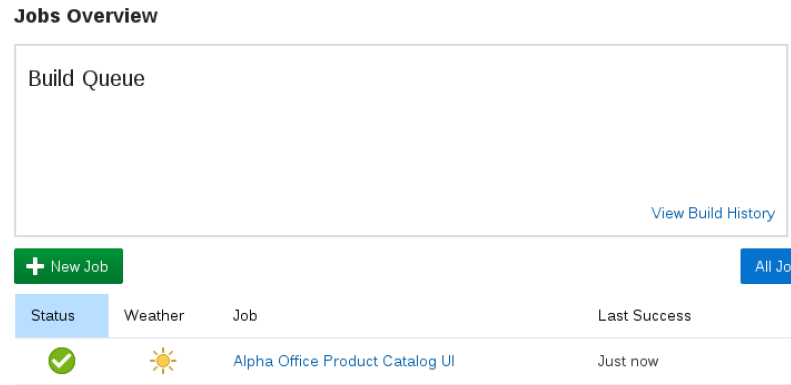

- On the navaigation panel click **deploy**. The **Last deployment** will be set to **Just Now** when the deployment completes.

    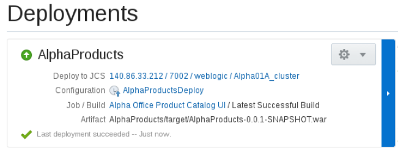

### **STEP 15:** Open UI in browser

- Open a new tab in the browser and enter the following URL:

    **https://** ***\<Public IP of Load Balancer\>*** **/AlphaProducts**

- You should now see the update **Alpha Office Product Catalog UI**

    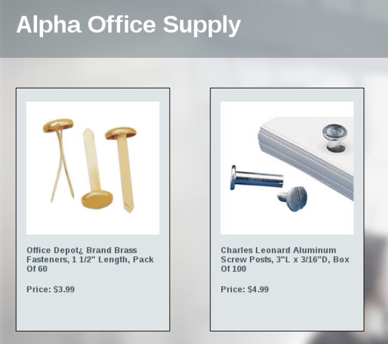

### **STEP 16:** Complete Task

We have now verified that **Alpha Office Product Catalog UI** is now displaying the price corectly. To finish up this part of the lab, we will mark the Issue as completed in the Sprint.

- Back in the Developer Cloud Service window, click **Agile**, followed by clicking **Active Sprints**.

- Drag and drop **Defect 4** from **In Progress** to **Completed**

    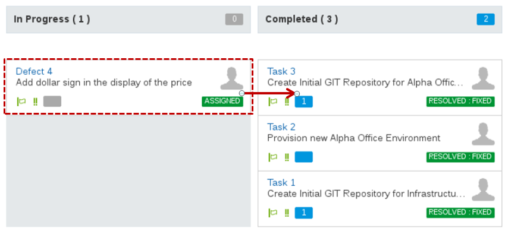

- In the Change Progress popup click **Next**

    

- Set number of days to 1 and click **OK**

    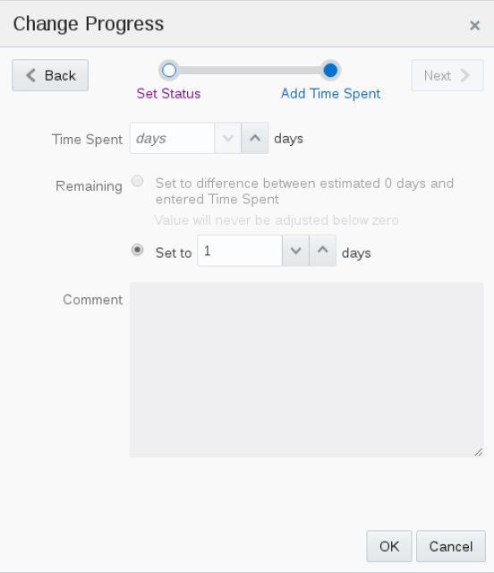

- Your Sprint should now look like the following:

    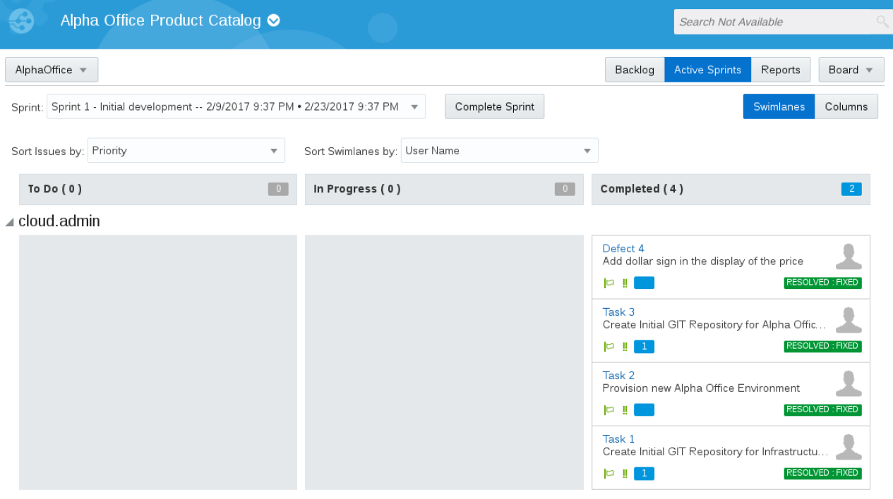

- You are now ready to move the the last lab.
