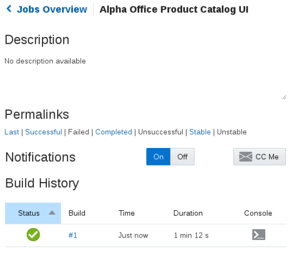

  

Update: January 29, 2017

## Introduction

This is the third of several labs that are part of the **DevOps JCS Pipeline using Oracle Stack Manger workshop**. This workshop will walk you through the Software Development Lifecycle (SDLC) for a Java Cloud Service (JCS) project that goes through Infrastructure as Code and deployment of a Struts application.

In the first lab (100), the Project Manager created a new project in the Developer Cloud Service, created and assigned tasks to the developers of this application. In this lab, you will assume the persona of Java Developer who will be tasked with making enhancements to the Alpha Office Product Catalog UI.

Please direct comments to: Dennis Foley (dennis.foley@oracle.com)

## Objectives
- Access Developer Cloud Service
- Import configuration from external Git Repository
- Import Project into Eclipse
- Setup Build and Deployment of UI using Developer Cloud Service and Java Cloud Service

## Required Artifacts
- The following lab requires an Oracle Public Cloud account that will be supplied by your instructor. You will need to download and install latest version of Eclipse or use supplied compute VM.

# Create Initial Git Repository for Alpha Office Catalog UI

## Create Initial Git Repository

**Note:** For this lab you will take on the persona of John Dunbar. John is our Java developer who will be making the enhancements to our product catalog UI.

### **STEP 1:** Update Issue Status
- Click on the **AlphaOffice** Board **Active Sprints**.

    

- Drag and drop **Task 3 - Create Initial GIT Repository for Alpha Office UI** into the **In Progress** swim-lane.

    

- Click **OK** on Change Progress popup.

    

### **STEP 2:** Create Initial Git Repository

- In the left hand navigation panel, click **Project**

- Click on **New Repository** to create a new Git Repository.

    

- In the New Repository wizard enter the following information and click **Create**.

    **Name:** `AlphaOfficeProductCatalogUI`

    **Description:** `Alpha Office Product Catalog UI`

    **Initial content:** `Import existing repository`

    **Enter the URL:** `https://github.com/pcdavies/AlphaOfficeProductCatalogUI.git`

    

- You have now created a new GIT repository based on an existing repository.

    

## Create Default Build for and Deployment Process

### **STEP 3:** Create Template Update Build Process

Now that we have the source code in our managed GIT repository, we need to create a build process that will be triggered whenever a commit is made to the master branch. We will set up a Maven build process in this section.

- On navigation panel click **Build** to access the build page and click **New Job**.

    

- In the New Job popup enter **Alpha Office Product Catalog UI** for the Job Name, and then click **Save**.

    

- You are now placed into the job configuration screen.        

    

- On the Main tab on the Configure Build screen change the **JDK** drop down to **JDK8**.

    

- Click the **Source Control** tab. Click **Git** and select **AlphaOfficeProductCatalogUI.git** from the drop down.

    

- Click the **Triggers** tab. Select **Based on SCM polling schedule**.

        

- Click the **Build Steps** tab. Click **Add Build Step**, and select **Invoke Maven 3**.

    

- Leave the default Maven Goals **clean install**. Change the POM File location to **AlphaProducts/pom.xml**

    

- Click the **Post Build** tab. Check **Archive the artifacts** and enter `**/target/*` for the Files to Archive.

    

- Click **Save** to complete the configuration.

- Click the **Build Now** button to start the build. This will trigger for the build to be placed in the queue and should start shortly. Wait, as it may take 30 seconds or more, but the status will change to the following:

    

- Once the build has completed you should see a green check.  Wait for the build to complete before continuing to the next step, as we need the build artifact to complete the deployment configuration.

    

### **STEP 3:** Retrieve Public IP of JCS Instance for Deloyment

Before we can configure deployment of our application we need to make note of the IP for our JCS instance. The **Alpha01A-JCS** instance has already been provisioned.

- Switch over to browser tab for cloud services. Click on the far left navigation icon and select**Oracle Java Cloud Service**.

    

    
