  
Update: January 28, 2017

## Introduction

This is the second of several labs that are part of the **Oracle Public Cloud DevOps Cloud Native Microservices workshop.** This workshop will walk you through the Software Development Lifecycle (SDLC) for a Cloud Native project that will create and use several Microservices.

In the first lab (100), the Project Manager created a new project in the Developer Cloud Service, added team members to the project, and created and assigned tasks to the developers of this application. In this lab, you will assume the persona of the Java developer, who will be tasked with creating several microservices that will supply data to any required front-end or analytics components (one of which you will build in the following lab, lab 300).

Please direct comments to: Dennis Foley (dennis.foley@oracle.com)

## Objectives

- Access Developer Cloud Service
- Import Code from external Git Repository
- Import Project into Eclipse
- Build and Deploy project using Developer Cloud Service and Oracle Application Container Cloud Service

## Required Artifacts

- The following lab requires an Oracle Public Cloud account that will be supplied by your instructor. You will need to download and install latest version of Eclipse

# Create Initial Static Twitter Feed Service

## Explore Developer Cloud Service

### **STEP 1**: Login to your Oracle Cloud account as Bala.Gupta

- If you just completed lab 100, or if you are still logged in as Lisa.Jones, you will need to first sign out before continuing this lab. Sign out by clicking on the user’s name (lisa.jones) at the top right corner of the screen, then selecting Sign Out from the dropdown menu.

      

- Now we can login again. From any browser, **go to the following URL**:
https://cloud.oracle.com

- Click **Sign In** in the upper right hand corner of the browser.

      

- **IMPORTANT** - Under My Services, ask ***your instructor*** which **Region** to select from the drop down list, and **click** on the **My Services** button.

      

- Enter your identity domain and click **Go**

  ***NOTE***: the **Identity Domain, User Name** and **Password** values will be given to you from your instructor.

      

- Once your Identity Domain is set, enter your **User Name** and **Password** and click **Sign In**

  **NOTE**: For the first part of this lab you will be acting as the Java Developer ***Bala Gupta***. As with the previous lab, if you are not able to support multiple users, login as a supported user, and assume the “logical” identify of Bala Gupta - the Java Developer.

      

- Once connected, you will be presented with a Dashboard displaying the various cloud services available to this account. Note: Based on your browser cookie settings, **it’s possible that once connected you will placed into the Developer Cloud Service dashboard**, and will not need to complete the next few tasks that were performed automatically.

      

### **STEP 2**: Login to Developer Cloud Service

Oracle Developer Cloud Service provides a complete development platform that streamlines team development processes and automates software delivery. The integrated platform includes issue tracking system, agile development dashboards, code versioning and code review platform, continuous integration and delivery automation, as well as team collaboration features such as wikis and live activity stream. With a rich web based dashboard and integration with popular development tools, Oracle Developer Cloud Service helps deliver better applications faster.

- From Cloud UI dashboard click on the **Developer** service. In this example the Developer Cloud Service is named **developer99019**.

      

- The Service Details page gives you a quick glance of the service status. Click **Open Service Console** for the Oracle Developer Cloud Service

      

- The Service Console will list all projects that you are currently a member of. Click **Twitter Feed Marketing Project** to access the project

      

- The Twitter Feed Marketing Project dashboard will be displayed.

      

### **STEP 3**: Review Agile Board

- Within the **Twitter Feed Marketing Project**, click on **Agile** found on the left hand navigation.

      

### **STEP 4**: Show Microservices Board

- If the **Microservices** list is not displayed as shown below, then click on the **Board Dropdown**, select **All**, and click on **Microservices**.

      

### **STEP 5**: Display the Active Sprint

- Click on the **Microservices** Board **Active Sprint**

      

## Create Initial Git Repository

### **STEP 6**: Create Initial Git Repository

To begin development on our Twitter feed microservices, we could start coding from scratch. However, prior to the formal kickoff of this project, you have already started doing some proof-of-concept development outside of the Developer Cloud Service in order to assess the feasibility of your assignment. You want to bring that existing code into the Developer Cloud Service as a starting point for your microservices. You will do that by cloning your external GIT repository into the Developer Cloud Service. Your first step will be to accept your task using the agile board.

- Drag and drop **Task1 - Create Initial GIT Repository for Twitter Feed Service** into the **In Progress** swim-lane.  

      

- Click **OK** on the Change Progress popup

      

    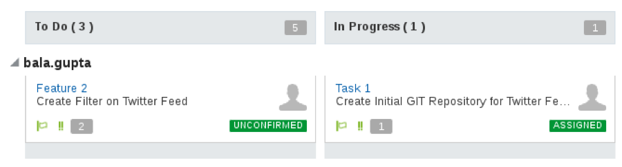  

- In the left hand navigation panel, click **Project**

- On the right side under **REPOSITORIES** click on **New Repository** to create a new Git Repository.

      

- In the New Repository wizard enter the following information and click **Create**.

    **Name:** `TwitterFeedMicroservice`

    **Description:** `Twitter Feed Microservice`

    **Initial content:** `Import existing repository`

    **Enter the URL:** `https://github.com/oraclenassolutionengineering/TwitterFeed.git`

      

- You have now created a new GIT repository based on an existing repository.

      

##Create Default Build and Deployment Process

### **STEP 7**: Create Default Build Process

Now that we have the source code in our managed GIT repository, we need to create a build process that will be triggered whenever a commit is made to the master branch. We will set up a Maven build process in this section.

- On navigation panel click **Build** to access the build page and click **New Job**.

      

- In the New Job popup enter **Twitter Feed Build** for the Job Name, and then click **Save**.

      

- You are now placed into the job configuration screen.

      

- On the Main tab of the Configure Build screen change the **JDK** drop down to **JDK8**.

      

- Click the **Source Contro**l tab. Click Git and select the **TwitterFeedMicroservice.git** from the drop down.

      

- Click the **Triggers** tab.

  **Select**: `Based on SCM polling schedule`

  **Note:** The above expression results in the repository being polled every minute to check for any changes. If there are changes, the build will trigger.

      

- Click the **Build Steps** tab. Click **Add Build Step**, and select **Invoke Maven 3**.

      

- Change **Goals** to `clean assembly:assembly`

      

- Click the **Post Build** tab and complete the following:
  - Check **Archive the artifacts**.
  - Enter `**/target/*` for Files to Archive.  
  - Verify **GZIP** in the Compression Type.
  - Check **Publish JUnit test report**
  - Enter `**/target/surefire-reports/*.xml` for the Test Report XMLs. This will provide a report on the Test Scripts results for each build.

      

- Click **Save** to complete the configuration.

- Click the **Build Now** button to start the build immediately. Wait, as it may take 30 seconds or more, but the status will change to the following:

      

  **NOTE:** Once the build begins, it should take about approximately 1 to 2 minutes for the build to complete. Once complete, you will be able to see the number of successful test runs in the Test Result Trend section. Wait for the build to complete before continuing to the next step, as we need the build artifact to complete the deployment configuration.

- After the build begins, you can also click on the **Console Icon** to monitor the build log details.

      

### **STEP 8**: Create Default Deployment Process

Now that we have successfully built our project, we need to create a deployment configuration that will watch for stable builds and deploy them to a new Application Container Cloud Service instance for testing.

- On the navigation panel click **Deploy** to access the Deployment page. Click **New Configuration**.

      

- Enter the following data:

  **Configuration Name**: `TwitterFeedMicroserviceDeploy`

  **Application Name**: `JavaTwitterMicroservice`

      

- To the Right of Deployment Target, click **New** and select **Application Container Cloud**

      

- Enter the following data:

  - **Data Center**: `<Your Assigned Datacenter>` ***(Ask instructor if needed)***

  - **Identity Domain**: `<Your Identity Domain>`

  - **Username**: `bala.gupta` **(or your appropriate username if running as single user)**

  - **Password**: `<Supplied Password>`

- Click **Test Connection**. If Successful, click **Use Connection**:

      

- Set the following Properties as follows:
  - **Runtime**: `Java`
  - **Subscription**: `Hourly`
  - **Job:** `Twitter Feed Build`
  - **Type:** `Automatic` and `Deploy stable builds only`
  - **Artifact:** `target/twitter-microservice-example-dist.zip`

      

- Click **Save**

      

- Click drop down and select **Start**

      

- Wait until the message **Starting application** changes to **Last deployment succeeded**

      

## Verify Twitter Feed Microservice deployment

### **STEP 9**: Change status to Verified

Now that we have successfully deployed the build artifact to the Application Container Cloud Service, we will update our agile board to reflect that status. Although the complexity of the next task (verification) is quite simple, we will still move the task to the “Verify Code” column before manually verifying the new functionality.

- On navigation panel click **Agile**, followed by clicking **Active Sprints**. Drag and drop **Task 1** from **In Progress** to the **Verify Code** column.

    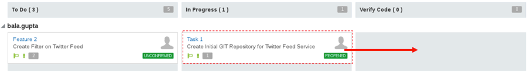  

- In the Change Progress popup, click **OK**

      

- The code is now ready for verification before moving to Completed

      

### **STEP 10**: Login to Oracle Application Container Cloud Service

- Return to the Developer Service Cloud Dashboard tab if it’s still available, then select the Dashboard icon to return to the Oracle Public Cloud Dashboard. Note: It’s possible that you may be required to once again login, if the session has expired.

      

- Once the Oracle Public Cloud **Dashboard** is displayed, click on the  

     menu to the right of the **Application Container** service. Then select **Open Service** Console

      

- On the Application Container Cloud Service (ACCS) Service Console you can view all the deployed applications, including our newly created **JavaTwitterMicroservice**. Click on the **URL**, and it will load a new browser tab

      

- Append `/statictweets` to the end of the URL in the browser, and press return (e.g.):
`https://javatwittermicroservice-.apaas.em2.oraclecloud.com/statictweets`

    Note: The URL should return a JSON array containing a Static Twitter feed. Note: If you desire to see a formatted view of the JSON, open a new tab and search Google for “JSONViewer chrome plugin” – After you install the Chrome Plugin and re-submit the URL, you will be able to view the JSON in a more readable format.

      

### **STEP 11**: Complete Task

We have now verified that the statictweets microservice has been deployed and functions properly. To finish up this part of the lab, we will mark the Issue as completed in the Sprint.

- Back in the Developer Cloud Service window, click **Agile**, followed by clicking Active Sprints.

- Drag and drop **Task 1** from **Verify Code** to **Completed**.

      

- In the Change Progress popup click **Next** and then **OK**.

      

- Your Sprint should now look like the following:

    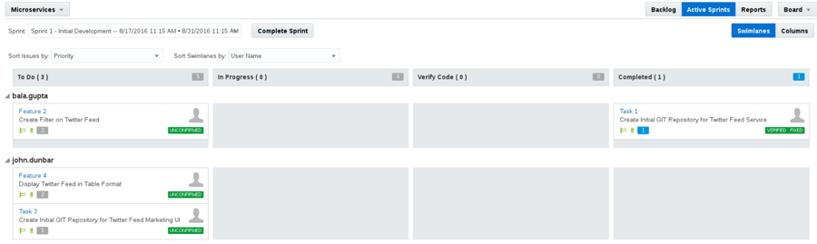  

- You can also click on the **Reports** button and view your progress in the **Burndown Chart** and **Sprint Report**.

      

# Add Filter to Static Twitter Feed Service

Now that we have completed the import, build, deployment, and verification of our initial static twitter microservice, it is time to extend the project by adding a new microservice that allows us to dynamically filter the incoming tweets based on their contents. We will use the Eclipse IDE to clone the managed GIT repository to our local workstation, test the local copy, and add the filtering feature to the local copy. We will test the new feature in Eclipse, create a new code branch for it, and commit the branch. Then we will create a merge request and switch to the Project Manager persona to approve that request. We will also see how we can manage our agile task status directly from Eclipse.

## Clone Project to Eclipse IDE

### **STEP 12**: Load Eclipse IDE

- Right Click and select **Run** on the **Eclipse** Desktop Icon

      

- Once Eclipse loads, **close** the **Welcome Window** if it is visible.

      

### **STEP 13**: Create connection to Oracle Developer Cloud Service

- We will now create a connection to the Developer Cloud Service. To do this, first click on the menu options **Window -> Show View ->Other**  

      

- Enter `oracle` in the search field. Select **Oracle Cloud**, and click on **OK**.  

      

- Click on **Connect** in the Oracle Cloud tab

      

- Enter the following information:
  - **Identity Domain**: `<your identity domain>`
  - **User name**: `bala.gupta` (or your appropriate username, if running as single user)
  - **Password**: `<your Identity domain password>`
  - **Connection Name**: `OracleConnection`

      

- If prompted, enter and confirm a Master Password for the Eclipse Secure Storage.
  - In our example we use the **password:**  `oracle`. Press **OK**.

      

  - If prompted to enter a Password Hint, click on **No**

      

### **STEP 14**: Create a local clone of the repository

- **Expand Developer**, and then **double click** on **Twitter Feed Marketing Project** to activate the project.

      

- **Expand** the **Code**, and **double click** on the **Git Repo** [**TwitterFeedMicroservice.git**], to cause the Repo to be cloned locally.

      

- **Right Click** on the **TwitterFeedMicroservice** cloned repository and **click** on **Import Projects**.

      

- Keep the wizard defaults and **click** on **Next**

      

- Accept the Import defaults, and **click on Finish**

      

### **STEP 15**: Select the correct Java JDE

- **Click** on the **TwitterFeedMicroservice** Project, then from the **top menu**, select **Project > Properties**

      

- Select the **Java Build Path** option.

      

- **Click** on the **Libraries tab**, then select the **JRE System Library**. Next, **click** on the **Edit** button.

      

- **Click** on the **Installed JREs** button.

      

- **Select** the Standard VM, which in this case is **java-1.8.0-openjdk**. Then, **click** on **Edit**

      

- **Click** on the **JRE home: Directory** button

      

- **Navigate** to **usr/java**, select **jdk1.8.0_102**, and **click** on **OK**

      

- Change the JRE Name to **jdk1.8.0_102**, and click on **Finish**

      

- Click **OK, Finish** and **OK** when prompted on the following dialogs to complete the  Library changes.

## Test the Local Cloned Services

### **STEP 16**: Set Feature 2 Status to In Progress

In the previous steps we updated the status of the Tasks assign to Bala Gupta using the web interface to the Developer Cloud Service. In this step we will use the Eclipse connection to the Developer Cloud Service to update the status of Bala’s tasks.

- Within the Oracle Cloud Connection tab, double click the **Issues** to expand, then double click on **Min**e to expand your list. Once you see the list of your Issues, then double click on **Create Filter on Twitter Feed**.

      

- Scroll down to the bottom of the **Create Filter on Twitter Feed** window. In the Actions section, and change the Actions to **Accept (change status to ASSIGNED)**, then click on **Submit**.

      

- Optionally, if you return to the Developer Cloud Service web interface, you’ll see that the Eclipse interface caused the Feature 2 to be moved to the “In Progress” column of the Agile > Active Sprints.

      

### **STEP 17**: Build and test the TwitterFeedMicroservice

- **Right Click** on the **TwitterFeedMicroservice** project. Select **Maven > Update Project**

      

- Keep the defaults, and click **OK**. This will run Maven, and build the project.

      

- To test the local copy of the project code, right click on the **TwitterFeedMicroservice** project and select **Run As > Maven Test**

      

- Double Clicking on the **Console tab** will expand The Window. You can minimize the Window by double clicking the tab again. If the TwitterFeedMicroservices test runs successfully, your console window will contain the following – Notice the message with “### Tweets in Static Tweets”. Also, you should see that there were zero Failures.

      

## Add the Filter to the Service

The Code we cloned locally contains all the source necessary to filter the Static Twitter Feed. In this section of the lab, we will un-comment the code and test the filter.

### **STEP 18**: Add Filter

- In the Project Explorer, **expand** the **TwitterFeedMicroservice > src/main/java > com.example** and **double click** on **StaticTweets.java** to open the source code.

      

- In the StaticTweets.java source file, scroll down until you find two lines of code that begin with “**--- Remove this comment**”. **Delete both of these lines** to activate the code that will cause filtering of the Static Tweets file to occur.

      

- Your code should now look like this:

      

- Next we will enable the filter in the testing code. Expand the **src/test/java > com.example folder**, and **double click** on **MyServiceTest.java** to open the source file

      

- In the MyServiceTest.java source file, locate the method **testGetStaticSearchTweets()**, and **remove** the **comments** so that section of code will execute.

      

- Click on the **Save All** icon

      

## Test the Local Filtered Services

### **STEP 19**: Run Test

- Run the Test by right clicking on **TwitterFeedMicroservice** and selecting **Run As > Maven Test**

      

- Once the test runs, you’ll see the Static Twitter feed returned for both the unfiltered and filtered tests. You should not see any Failures.

- right click on **TwitterFeedMicroservice** and select **Team > Switch To > New Branch**

      

- Enter **Feature2** for the Branch name, and click on **Finish**

      

- We can now commit our code to the branch by Right Clicking on **TwitterFeedMicroservice** and then selecting **Team > Commit**

      

- Enter “**Feature2: Added Support for Filtering**” in the Commit Message box, **Drag and Drop** the **changed files** into the **Staged Changes** panel, and click on **Commit and Push**. Note: it is possible to change the default Author and Committer to match the current “persona.” However, for the sake of this lab guide, we will leave the defaults.  

      

- Accept the Default for the **Push Branch Feature** 2 dialog and click on **Next**
- Click on the **Finish button** in the Push Confirmation dialog
- Click on **Ok** in Push Result dialog

### **STEP 21**: Complete the Create Filter Task

- In the lower left Eclipse Task List, double click on **Create Filter on Twitter Feed** task

      

- In the **Create Filter on Twitter Feed** window, scroll down to the **Actions** Section. Click on **Resolve as FIXED**, and then click on the **Submit** button

      

## Create Merge Request

### **STEP 22**: Review Sprint Status and create Merge Request

- Return to the Developer Cloud Service Dashboard in the browser, and select **Agile**. If your default Board is not set to Microservices, then set the Find Board Filter to All, and select the Microservices board.

      

- Click on **Active Sprints** button. Notice that **Feature 2** is now in the **Verify Code** column

- Next, on navigation panel click **Code**, select the **Feature2** branch and then click on the **Commits sub tab**. Now view the recent commit made to branch from within Eclipse.

      

- Now that Bala Gupta has completed the task of adding the search filter, a **Merge Request** can be created by Bala and assigned to Lisa Jones. Click on **Merge Requests** on navigation panel and then click on the **New Merge Request** button.

- Enter the following information into the **New Merge Request** and click **Next**

  **Repository:** 	`TwitterFeedMicroservice.git`

  **Target Branch:** `master`

  **Review Branch:** `Feature2`

      


- Enter the following information into **Details** and click **Create**

  **Summary:** `Merge Feature 2 into master`

  **Reviewers:** `Lisa Jones` (or current user in non-multi user env)

      


- In the **Write box**, enter the following comment and then click on the **Comment** button to save:

  `I added the ability to add a filter request to the end of the URL – e.g. statictweets/alpha`

## Merge the Branch as Lisa Jones

In the following steps “Lisa” will merge the branch create by “Bala” into the master.

***NOTE: If you are using a single user environment, you will skip the next step, and go to the following step titled: “Merge Requests”***

### **STEP 23**: Sign Out as Bala Gupta and Sign In as Lisa Jones

- Click on the **bala.gupta** dropdown located in the top right corner of the screen. Select **Sign Out**.

    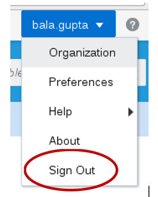  

- Following the previously documented steps, go to the URL: http://cloud.oracle.com, click on **Sign In** found on the Top Right corner of the window. Select the **correct Data Center**, click on the **My Services** button, enter the **correct Identity Domain** and click on **Go**.

- Enter lisa.jones for the username, and enter the correct password. Click on Sign In.

      

- When the Dashboard is displayed, click on the **Developer Cloud Service**. Note: It is possible that based on your browser cookie settings, you may be automatically taken to the Developer screen at the end of this step.

      

- From the Developer Cloud Service Dashboard, click on the **Open Service Console** button

      

- Select the **Twitter Feed Marketing Project**

    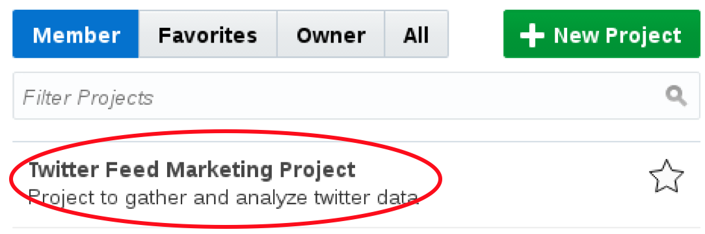  

### **STEP 24**: Merge Requests

- Before moving forward, “Lisa Jones” can take a look at the **Burndown** and **Sprint Reports** by clicking on the **Agile** navigation, then the **Reports** button

      

- Click **Sprint Report**

      

- On navigation panel click **Merge Requests**. Select the **Assigned to Me** search. After the search completes, click on the **Merge Feature 2 into master** assigned request.

      

- Once the request has loaded, select the **Changed Files** tab. “Lisa” will now have the opportunity to review the changes in the branch, make comments, request more information, etc. before Approving, Rejecting or Merging the Branch.

    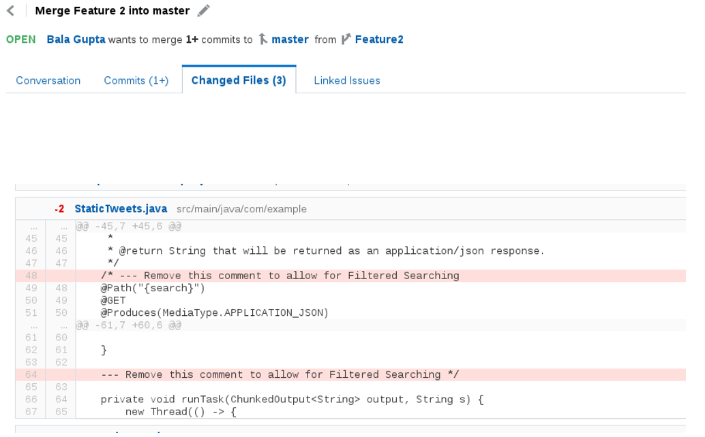  

- Click on the **Merge** button.

      

- Leave the defaults, and click on the **Merge** button in the confirmation dialog.

      

- Now that the code has been committed to the Developer Cloud Service repository, the build and deployment will automatically start. On the navigation panel click **Build**, and you should see a **Twitter Feed Build** in the Queue

      

- Wait a minute or two for the build to complete. The **Last Success** will be set to **Just Now** when the build completes.

      

## Test the JavaTwitterMicroservice in the Cloud

### **STEP 25**: Test Microservice

- Once the service has successfully deployed, navigate to **Deployments** and click on the **JavaTwitterMicroservice** link

      

- When the new browser tab loads, Append `/statictweets` to the end of the URL and **press enter** to test the original static twitter service

      

- Now change the appended URL to `/statictweets/alpha` and **press enter**. This will cause records containing the text ""**alpha**"" in the tweet’s text or hashtags to be returned.

      

- To complete the Sprint Feature, click **Agile** on left hand navigation. Then click on the **Active Sprints** button.

      

- Complete the feature request by Dragging and Dropping **Feature 2** (Create Filter on Twitter Feed) from the **Verify Column** to the **Completed Column**.

      

- Set the Status to **VERIFIED – FIXED** and click **Next** and then **OK**

      

- **Sign Out** as Lisa Jones

      

- You are now done with this lab.

# Supplementary Assignment – Twitter Live Feed Credentials

## Create Twitter App

***This is an optional assignment***, during which you’ll have an opportunity to put your new knowledge of the Developer Cloud Service to work by extending our static twitter microservices to use live twitter data. In this exercise, you will acquire Twitter Application Credentials and use them to operate on a live twitter feed in your microservices. For the purposes of this assignment, you will use a personal account to log in to twitter and generate the credentials. However, in the context of our application, assume that these credentials have been provided by Product Management and represent the approved credentials for our production application.

You have two options for managing this code change in the version control system. If you would like more practice with the multi-user workflow, you can start a new branch for this feature, commit to that branch, create a merge request, and approve the merge. We’ll refer to this in the instructions as **Method A**. If you’re comfortable with that workflow, you can switch to master in your local repository, pull the latest revision from the cloud, and commit and push directly to master for this exercise. This will be **Method B**.

### **STEP 26**: Create New Twitter App

To generate the unique twitter credentials for our microservices, we need to sign in to twitter and create a new application for this project, then generate access tokens for it.

- Navigate to https://apps.twitter.com. Click on the **Sign In** link.

      

- If you are already a twitter user, **Log In** using your twitter credentials. Otherwise, click on the **Sign up Now** link

      

- Once logged in, click on the **Create New App** button.

      

- **Enter the following** and Click on the **Create your Twitter application** button. When entering the Application Name, append something unique to the Name’s end. E.g. your initials or name:

  **Name:** `JavaTwitterMicroservice<UniqueName>`

  **Description:** `A Twitter Feed Microservice`

  **Website:** `https://cloud.oracle.com/acc`

  **Developer Agreement:** Click `Yes`

      

- Click on the **Keys and Access Tokens** tab.

      

- If at the bottom of the page your Tokens are not visible, click on the **Create my access tokens** button

      

- Note: If you are following **Method B**, before you start modifying code in Eclipse, you should switch to the master branch and pull from the remote repository.

- Return to Eclipse, and in the Project Explorer tab, expand **TwitterFeedMicroservices.git > src/main/config** and double click on **twitter-auth.json** to load the source.

      

- This is the File that will be deployed to the Application Container Cloud. Edit this file by replacing the xxx’s in **consumerKey, consumerSecret, token and tokenSecred with the Consumer Key (API Key), Consumer Secret (API Secret), Access Token and Access Token Secret** found on the Twitter Application Management page.

      

- Click on the Save All icon in Eclipse 

- So we can test locally, let’s repeat the same step by updating the Test Code’s twitter-auth.json credentials. Open the file located in **TwitterFeedMicroservices.git > src/test/resources > twitter-auth.json** and update. Once updated, click on the **Save All** Icon.

    

- Let’s now un-comment the code that will allow the online Twitter Feed to be tested. Using the Project Explorer, open the **TwitterFeedMicroservice.git > src/test/java > com.example > MyServiceTest.java** file.

    

- In the MyServiceTest.java file, located the method **testGetTweets()** and **remove the comment** surrounding that method.

    

- Click on the Eclipse Save All icon 

- Run the Test by right clicking on **TwitterFeedMicroservice** and selecting **Run As > Maven Test**

    

- After the tests run, the testGetTweets() method will return the message “The client read 10 messages!,” and all Tests should complete successfully.

    

- If you’re following **Method A**, now that you’ve enabled this new feature to access the live twitter feed, you can follow the previous steps used in this document to commit the code to the cloud. Once committed, you will use the Developer Cloud Service to create a merge request and then approve that request. Once the master branch is updated, an automatic build and deployment to the Application Container Cloud Service will be performed. Verify that deployment is successful before continuing.

- If you’re following **Method B**, now that you’ve enabled this new feature to access the live twitter feed, you can follow the previous steps used in this document to commit the code to the cloud. That will trigger an automatic build and cause the Application Container Cloud Service deployment to be performed by the Developer Cloud Service. Verify that deployment is successful before continuing.

- For either method, you will now be able append `/tweets` to the end of the Application Container Cloud Service URL and retrieve the Live Tweets.

- The example below shows the live tweets returned, once the application is re-deployed.

    

# Appendix 2 – Installing Eclipse

## Download and Install Eclipse

In this appendix you will download and install Eclipse containing the Oracle Plugin.

### **STEP 27**: Download Eclipse

- Go to the following URL: http://www.oracle.com/technetwork/developer-tools/eclipse/downloads/index.html

- Accept the **licensing agreement**, and then select the **Neon** version of Eclipse required for your operating system.

    

- Once you’ve downloaded eclipse, extract the zip file and install.
Optionally Configure Proxies

### **STEP 28**: Configuring Proxies

If you are running Eclipse behind a firewall and need to configure the proxy setting, there are several updates to be made. First, you need to ensure that Eclipse’s proxy is set, next you need to update the maven proxy setting, then finally, you need to ensure that the Oracle Plugin will work with your proxy settings.

- To set configure Eclipse’s proxy, open Eclipse and navigate to the Properties menu. Depending on the operating system, this drop down is found either from the **Eclipse > Preferences**, or **Window > Preferences**

    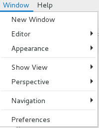

- From the preferences panel, enter “**proxy**” into the search window, and click on **Network Connections**. Select **Native** for the Active Provider. This setting works well, but it requires that you have the proxy setting configured correctly on the system running Eclipse – e.g. Windows, MAC OS or Linux. Selecting Manual should also work, but some of the plugins require the underlying operating system’s proxy to be configured.

    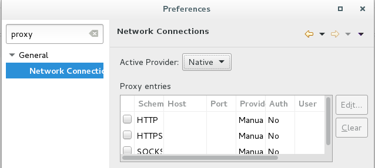

- To test that your connection works, select the menu option **Window > Show View > Other**

    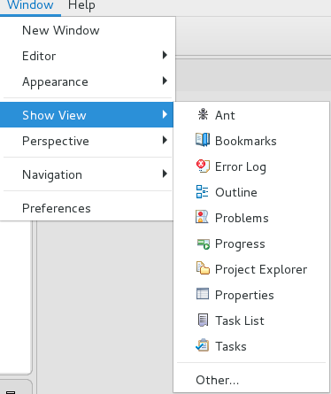

- Type “**web**” in the search field, select **Internal Web Browser** and click on **OK**

    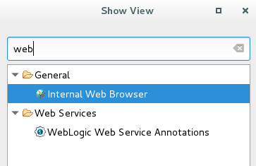

- Enter a **URL** into the and **press enter** to test your proxy settings.

    

### **STEP 29**: Update the Eclipse / Maven proxy

- From the **Eclipse > Preference** or **Window > Preferences** panel, enter **Maven** into the search box. Click on the Maven **User Settings**. Make note of the directory where the settings.xml file is to be located. In the example below, the Maven User Settings are to be located in the **/home/oracle/.m2** directory

    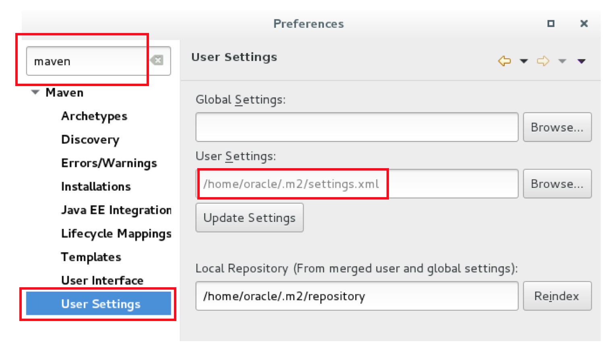

- Close Eclipse

- If the directory does not exist where the settings.xml file is to be located, **create the directory**. In this example, we will create the .m2 directory. Also, create the settings.xml file, if it does not exist. Add the following to the settings.xml file (NOTE: you will need to use your correct **Host, Port, nonProxyHosts, username and Password** settings):

    ```
<?xml version="1.0" encoding="UTF-8"?>
<settings xmlns="http://maven.apache.org/SETTINGS/1.1.0" xmlns:xsi="http://www.w3.org/2001/XMLSchema-instance"
          xsi:schemaLocation="http://maven.apache.org/SETTINGS/1.1.0 http://maven.apache.org/xsd/settings-1.1.0.xsd">
  <proxies>
    <proxy>
      <active>true</active>
      <protocol>http</protocol>
      <username>proxyuser</username>
      <password>proxypass</password>
      <host>www-proxy.us.oracle.com</host>
      <port>80</port>
      <nonProxyHosts>local.net|some.host.com</nonProxyHosts>
    </proxy>
    <proxy>
      <active>true</active>
      <protocol>https</protocol>
      <username>proxyuser</username>
      <password>proxypass</password>
      <host>www-proxy.us.oracle.com</host>
      <port>80</port>
      <nonProxyHosts>local.net|some.host.com</nonProxyHosts>
    </proxy>
  </proxies>
</settings>
```

- Reload Eclipse to use the new maven settings
