  
Update: March 31, 2017

## Introduction

This is the second of several labs that are part of the **Oracle Cloud DevOps Cloud Native Microservices workshop.** This workshop will walk you through the Software Development Lifecycle (SDLC) for a Cloud Native project that will create and use several Microservices.

In the first lab (100), the Project Manager created a new project in the Developer Cloud Service and also created and assigned tasks to the developers of this application. In this lab you will assume the persona of the Java developer, who will be tasked with creating several microservices that will supply data to any front-end or analytics applications (one of which you will build in the following lab, lab 300).

***To log issues***, click here to go to the [github oracle](https://github.com/oracle/cloud-native-devops-workshop/issues/new) repository issue submission form.

## Objectives

- Access Developer Cloud Service
- Import Code from external Git Repository
- Import Project into Eclipse
- Build and Deploy project using Developer Cloud Service and Oracle Application Container Cloud Service

## Required Artifacts

- The following lab requires an Oracle Public Cloud account that will be supplied by your instructor. You will need to download and install latest version of Eclipse. Instructions are found in the Student Guide.

# Create Initial Static Twitter Feed Service

## Explore Developer Cloud Service

### **STEP 1**: Review Agile Board

- This Lab assumes that you just completed Lab 100 and are still connected to the Oracle Cloud, that you're still in the Developer cloud Service Dashboard, and you're viewing the "Twitter Feed Marketing Project". If for some reason that is not the case, follow the first several Steps of Lab 100 to once again view the Developer Cloud Service Console.

      

- Although you will remain connected to the Oracle Cloud using the user account you were provided, you will take on the Persona of ***Bala Gupta*** as you perform the following steps.

      

- Within the **Twitter Feed Marketing Project**, click on **Agile** found on the left hand navigation.

      

### **STEP 2**: Display the Active Sprint

- On the **Microservices** Board, click **Active Sprints**

      

## Create Initial Git Repository

### **STEP 3**: Create Initial Git Repository

To begin development on our Twitter feed microservices, we could start coding from scratch. However, prior to the formal kickoff of this project, you (as Bala Gupta) have already started doing some proof-of-concept development outside of the Developer Cloud Service in order to assess the feasibility of your assignment. You want to bring that existing code into the Developer Cloud Service as a starting point for your microservices. You will do that by cloning your external GIT repository into the Developer Cloud Service. Your first step will be to accept your task using the agile board.

- Drag and drop **Task1 - Create Initial GIT Repository for Twitter Feed Service** into the **In Progress** swim-lane.  

    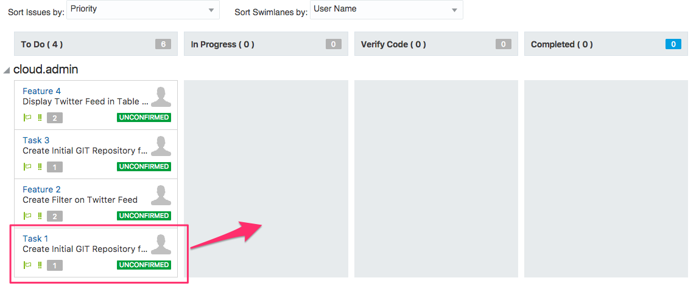  

- Click on **Next** in the Change Progress popup.

    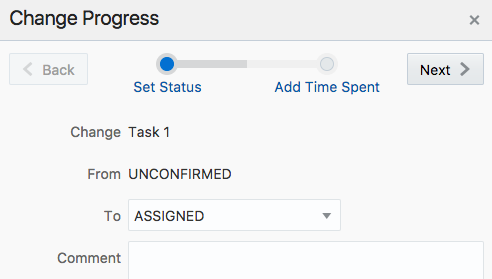  

- Leave the defaults, and Click **OK**.

      

- Your Sprint progress will appear as shown below.

    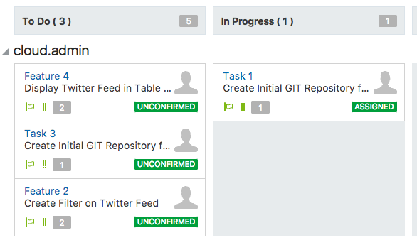  

- In the left hand navigation panel, click **Project**

- On the right side in the **REPOSITORIES** section, click on **New Repository** to create a new Git Repository.

      

- In the New Repository wizard enter the following information and click **Create**.

    **Name:** `TwitterFeedMicroservice`

    **Description:** `Twitter Feed Microservice`

    **Initial content:** `Import existing repository`

    **Enter the URL:** `https://github.com/pcdavies/TwitterFeed.git`

    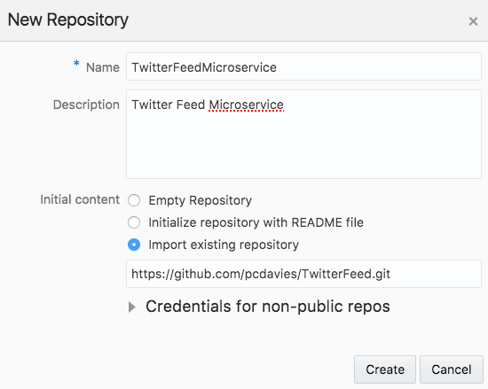  

- You have now created a new GIT repository stored within the Developer Cloud Services that is based on an existing repository.

      

## Create Default Build and Deployment Process

### **STEP 4**: Create Default Build Process

Now that we have the source code in our managed GIT repository, we need to create a build process that will be triggered whenever a commit is made to the master branch. We will set up a Maven build process in this section.

- On the left side navigation panel, click **Build** to access the build page and click **New Job**.

      

- In the New Job popup enter `Twitter Feed Build` for the Job Name, and then click **Save**.

    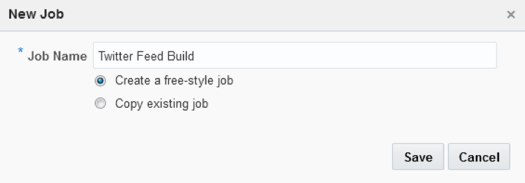  

- You are now placed into the job configuration screen.

    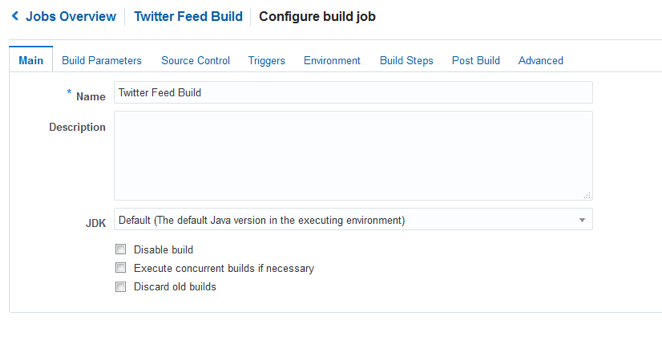  

- On the Main tab of the Configure Build screen change the **JDK** drop down to **JDK8**.

      

- Click the **Source Control** tab.

- Click **Git** and select the **TwitterFeedMicroservice.git** from the drop down.

      

- Click the **Triggers** tab.

  **Select**: `Based on SCM polling schedule`

      

- Click the **Build Steps** tab. Click **Add Build Step**, and select **Invoke Maven 3**.

    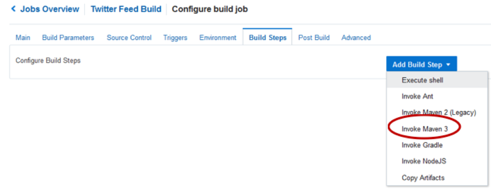  

- Change **Goals** to `clean assembly:assembly`

    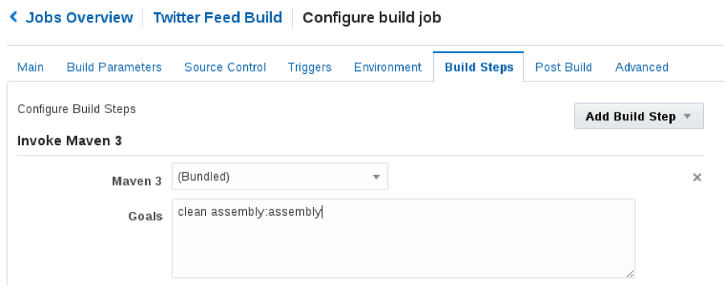  

- Click the **Post Build** tab and complete the following:
  - Check **Archive the artifacts**.
  - Enter `**/target/*` for **Files to Archive**.  
  - Verify **GZIP** in the Compression Type.
  - Check **Publish JUnit test report**
  - Enter `**/target/surefire-reports/*.xml` for the Test Report XMLs. This will provide a report on the Test Scripts results for each build.

      

- Click **Save** to complete the configuration.

- Click the **Build Now** button to start the build immediately. Wait, as it may take 30 seconds to a few minutes for the queued job to execute, but when it does, the status will change to the following:

      

  **NOTE:** Once the build begins, it should take about approximately 1 to 2 minutes for the build to complete. Once complete, you will be able to see the number of successful test runs in the Test Result Trend section. ***Wait for the build to complete before continuing to the next step***, as we need the build artifact to complete the deployment configuration.

- After the build begins, you can also click on the **Console Icon** to monitor the build log details.

      

### **STEP 5**: Create Default Deployment Process

Now that you have successfully built your project, you need to create a deployment configuration that will watch for stable builds and deploy them to a new Application Container Cloud Service instance for testing.

- On the navigation panel click **Deploy** to access the Deployment page. Click **New Configuration**.

    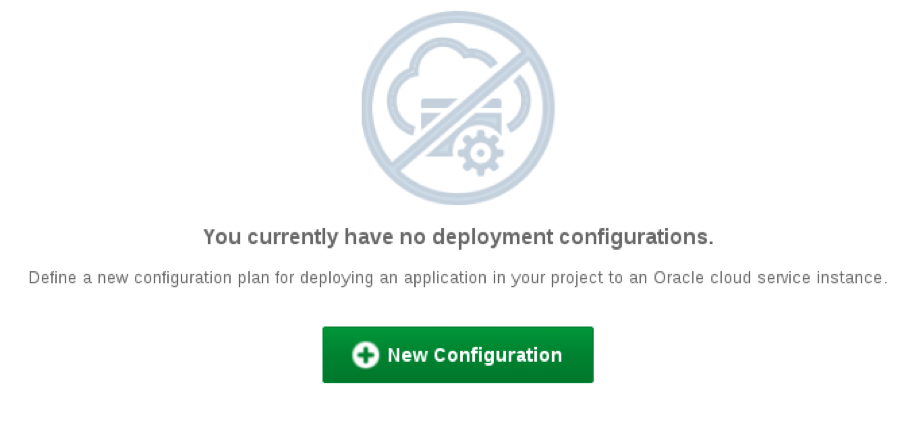  

- Enter the following data:

  **Configuration Name**: `TwitterFeedMicroserviceDeploy`

  **Application Name**: `JavaTwitterMicroservice`

      

- To the Right of Deployment Target, click **New** and select **Application Container Cloud**

      

- Enter the following data:

  - **Data Center**: `<Your Assigned Datacenter>` 

  - **Identity Domain**: `<Your Identity Domain>`

  - **Username**: `<Your User Name>`

  - **Password**: `<Supplied Password>`

- Click **Test Connection**. If Successful, click **Use Connection**:

    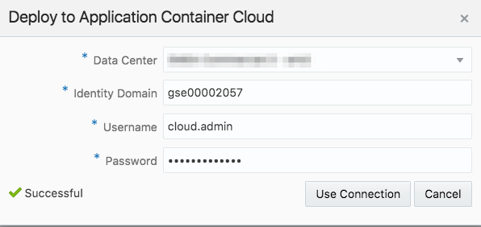  

    Note: If you are not able to connect, double check you credentials. If your connection still does not work, and this is an **Oracle Trial account**, please review the Student Guide for this workshop, and follow the steps outlining how to set your **Storage Replication Policy**.  

- Set the following Properties as follows:

  - **Runtime**: `Java`

  - **Subscription**: `Hourly`

  - **Type:** `Automatic` and `Deploy stable builds only`

  - **Job:** `Twitter Feed Build`

  - **Artifact:** `target/twitter-microservice-example-dist.zip`

    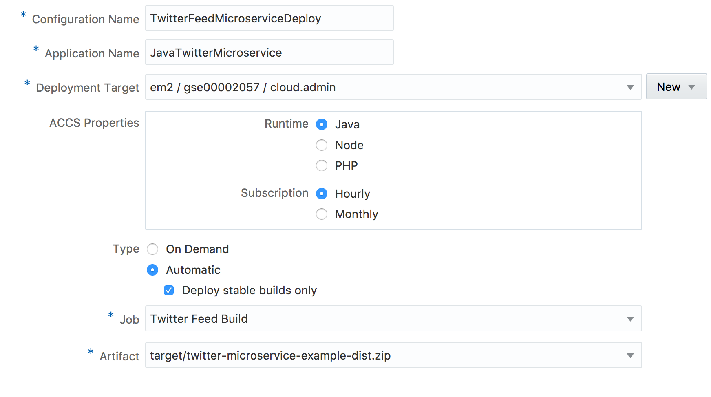  

- Click **Save**

      

- Click the gear drop down and select **Start**

    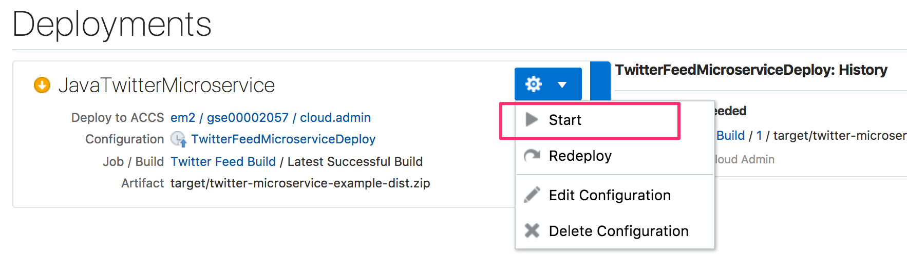  

- Wait until the message **Starting application** changes to **Last deployment succeeded**

    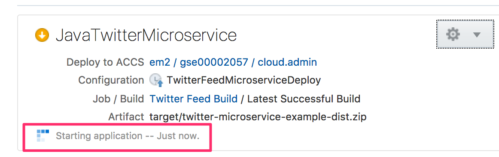  

    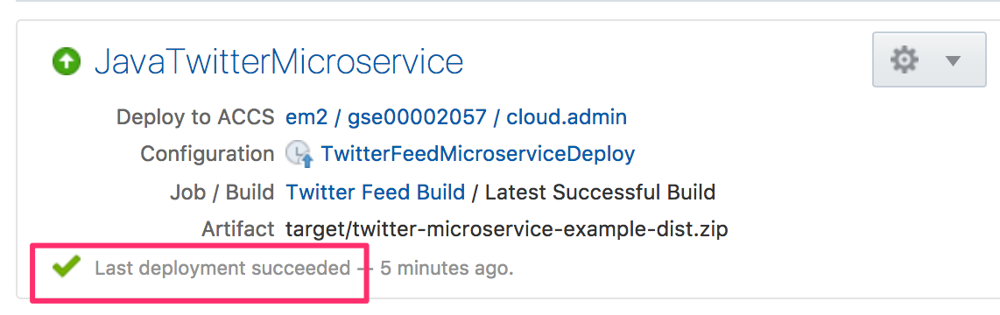  

## Verify Twitter Feed Microservice deployment

### **STEP 6**: Change status to Verified

Now that we have successfully deployed the build artifact to the Application Container Cloud Service, we will update our agile board to reflect that status. Although the complexity of the next task (verification) is quite simple, we will still move the task to the “Verify Code” column before manually verifying the new functionality.

- On navigation panel click **Agile**, followed by clicking **Active Sprints**. 

- Drag and drop **Task 1** from **In Progress** to the **Verify Code** column.

    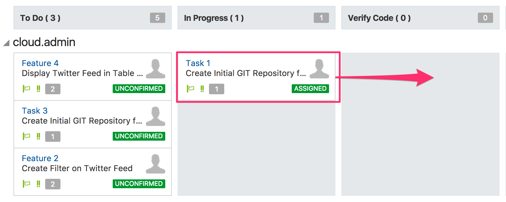  

- In the Change Progress pop up, click on **Next**

    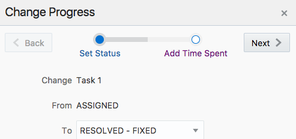  

- In the **Add Time Spent** popup, set the **Time Spent** to `1` and click **OK**

    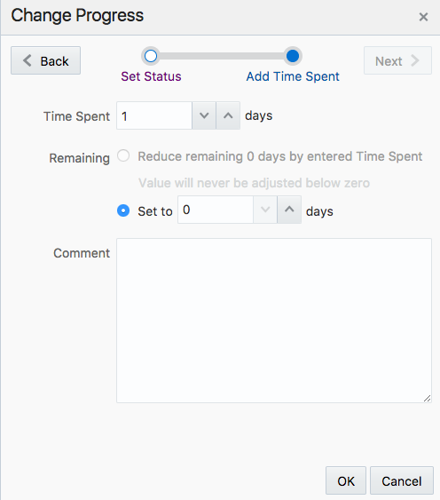  

- The code is now ready for verification before moving to Completed

    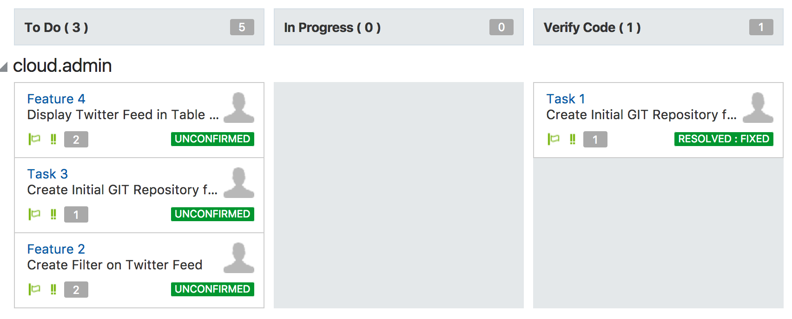  

### **STEP 7**: Login to Oracle Application Container Cloud Service

- Return to the Developer Service Cloud Dashboard tab if it’s still available, then select the Dashboard icon to return to the Oracle Public Cloud Dashboard. Note: It’s possible that you may be required to once again login, if the session has expired.

      

- Once the Oracle Public Cloud **Dashboard** is displayed, click on the   menu to the right of the **Application Container** service. Then select **Open Service** Console. Note: If the **Application Container** service is not visible, it can be added using the Customize Dashboard button. 

      

- On the Application Container Cloud Service (ACCS) Service Console you can view all the deployed applications, including our newly created **JavaTwitterMicroservice**. Click on the **URL**, and it will load a new browser tab. Alternatively, copy and paste the URL into the address bar of a new browser tab.

    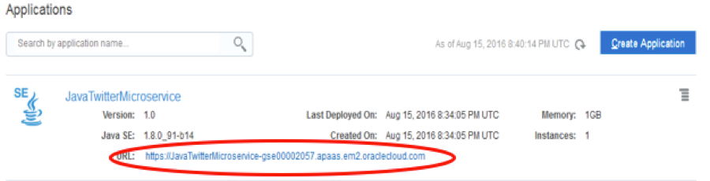  

- Append `/statictweets` to the end of the URL in the browser, and press return (e.g.):
`https://javatwittermicroservice-.apaas.em2.oraclecloud.com/statictweets`

    Note: The URL should return a JSON array containing a Static Twitter feed. Note: If you desire to see a formatted view of the JSON, and you are using Chrome, open a new tab and search Google for “JSONViewer chrome plugin” – After you install the Chrome Plugin and re-submit the URL, you will be able to view the JSON in a more readable format.

      

### **STEP 8**: Complete Task

We have now verified that the statictweets microservice has been deployed and functions properly. To finish up this part of the lab, we will mark the Issue as completed in the Sprint.

- Back in the Developer Cloud Service window, click **Agile**, followed by clicking Active Sprints.

- Drag and drop **Task 1** from **Verify Code** to **Completed**.

    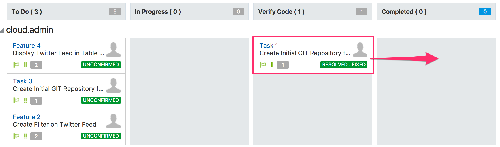  

- In the Change Progress popup click **Next**.

    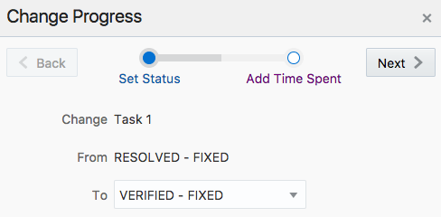  

- In the **Add Time Spent** popup, set the **Time Spent** to `1` and click **OK**.

    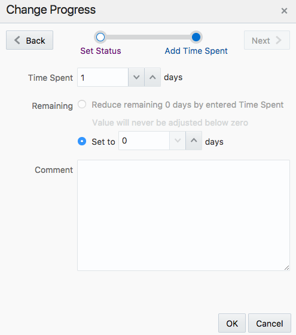  

- Your Sprint should now look like the following:

      

- You can also click on the **Reports** button and view your progress in the **Burndown Chart** and **Sprint Report**.

    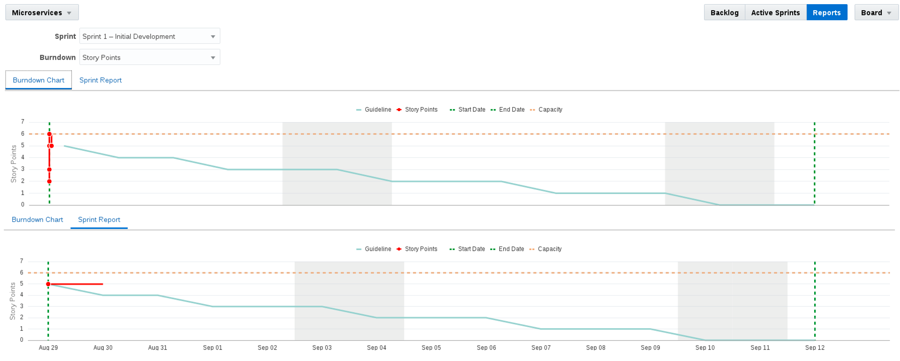  

# Add Filter to Static Twitter Feed Service

Now that we have completed the import, build, deployment, and verification of our initial static twitter microservice, it is time to extend the project by adding a new microservice that allows us to dynamically filter the incoming tweets based on their contents. We will use the Eclipse IDE to clone the managed GIT repository to our local workstation, test the local copy, and add the filtering feature to the local copy. We will test the new feature in Eclipse, create a new code branch for it, and commit the branch. Then we will create a merge request and switch to the Project Manager persona to approve that request. We will also see how we can manage our agile task status directly from Eclipse.

## Clone Project to Eclipse IDE

### **STEP 9**: Load Eclipse IDE

In the following task we will provide screen shots taken from the optional virtual box image provided with the workshop. If you are using Eclipse and Brackets on your local hardware, your screens may vary slightly.

- Right Click and select **Run** on the **Eclipse** Desktop Icon.

    Note: If you have not already installed and configured Eclipse, please see this Workshop's **Student Guide** for instructions on how to install and configure it.

      

- Once Eclipse loads, **close** the **Welcome Window** if it is visible.

      

### **STEP 10**: Create connection to Oracle Developer Cloud Service

- We will now create a connection to the Developer Cloud Service. To do this, first click on the menu options **Window -> Show View ->Other**  

      

- Enter `oracle` in the search field. Select **Oracle Cloud**, and click on **OK**.  

      

- Click on **Connect** in the Oracle Cloud tab

      

- Enter the following information:

  - **Identity Domain**: `<your identity domain>`

  - **User name**: `<your Username>`

  - **Password**: `<your Identity domain password>`

  - **Connection Name**: `OracleConnection`

      

- If prompted, enter and confirm a Master Password for the Eclipse Secure Storage.
  - In our example we use the **password:**  `oracle`. Press **OK**.

    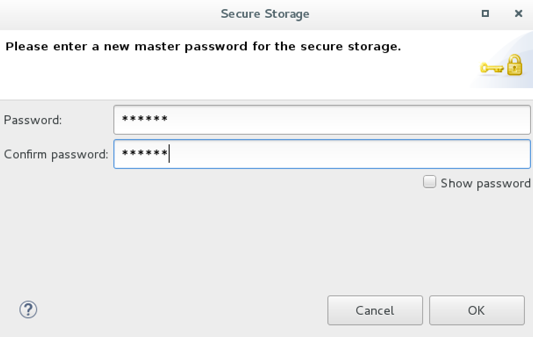  

  - If prompted to enter a Password Hint, click on **No**

    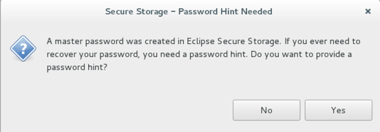  

### **STEP 11**: Create a local clone of the repository

- **Expand Developer**, and then **double click** on **Twitter Feed Marketing Project** to activate the project.

      

- **Expand** the **Code** section, and **double click** on the **Git Repo** [**TwitterFeedMicroservice.git**], to cause the Repo to be cloned locally.

      

- **Right Click** on the **TwitterFeedMicroservice** cloned repository and **click** on **Import Projects**.

    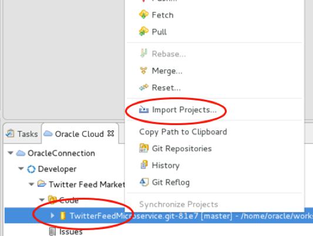  

- If the following screen is displayed, Keep the wizard defaults and **click** on **Next**:

      

- Accept the Import defaults, and **click on Finish**. Note: If nothing imports, that will be resolved in the next step. 

    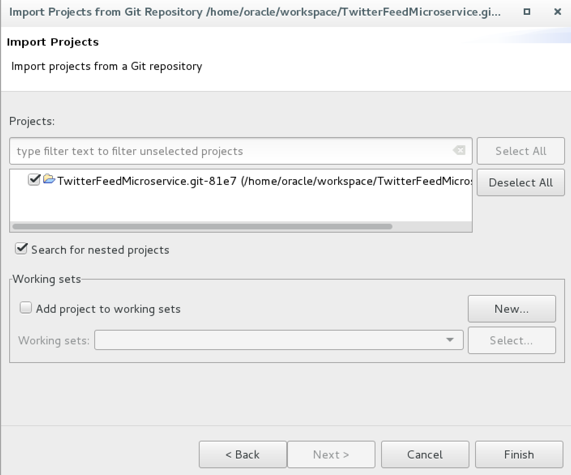  

### **STEP 12**: Import Projects

- ***If projects were NOT imported*** into your Project Explorer, as is show in the screen capture below, perform this step. If **TwitterFeedMicroService** was imported, go to the next step.

    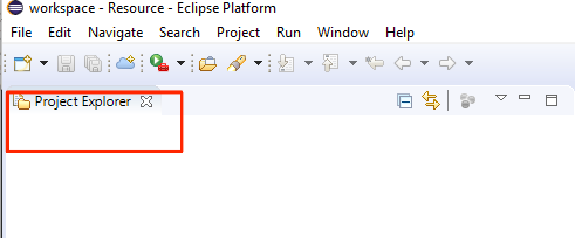  

- Choose **Import** from the Eclipse **File** menu.

    

- In the Import dialog, expand **General** > **Existing Projects into Workspace** and click on **Next**

    

- In the Import dialog, click **Browse** next to the **Select root directory** input field.

- Navigate to your **Workspace** > **TwitterFeedMicroservice.git-xxxx** folder and click **OK**. Then click **Finish**.

    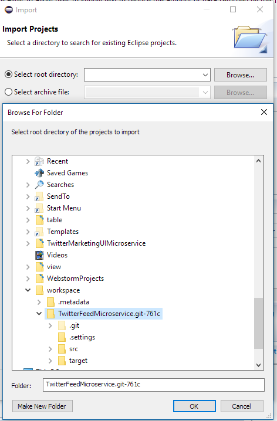

### **STEP 13**: Select the correct Java JDE

Depending on your eclipse configuration, you may need to point the project's Java Runtime Environment to a different JRE than the default. (e.g. with the Workshop's companion Virtual Box Image). In this step you will first check to see if your environment is correctly set. If the JRE is not correct, you will configure the Project Settings to point to the correct JRE.

- **Click** on the **TwitterFeedMicroservice** Project, then from the **top menu**, select **Project > Properties**

      

- Select the **Java Build Path** option.

      

- **Click** on the **Libraries tab**.

- Select the **JRE System Library**.

- **Click** on the **Edit** button.

      

- If your **Execution Environment JRE** release is **equal to or greater** than **1.8.0\_102**, as is shown in the example below, you will ***NOT*** need to complete the tasks in this STEP, and you can Click Cancel twice and continue to the next step.

    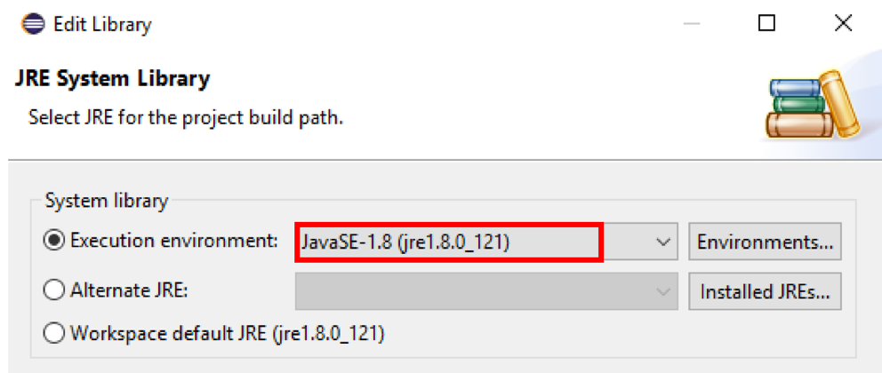  

- If the Execution Environment JRE is **less than 1.8.0\_102**, as is the case in the example below, **Click** on the **Installed JREs** button.

       

- **Select** the Standard VM, which in this case is **java-1.8.0-openjdk**. Then, **click** on **Edit**

      

- **Click** on the **JRE home: Directory** button

      

- **Navigate** to **usr/java**, select **jdk1.8.0\_102**, and **click** on **OK**

    **Note**: On Windows, the JDK Path will differ. It is likely similar to: **C:\Program Files\Java\jdk1.8.0_31**

      

- Change the JRE Name to **jdk1.8.0\_102**, and click on **Finish**

      

- Click **OK, Finish** and **OK** when prompted on the following dialogs to complete the  Library changes.

## Test the Local Cloned Services

### **STEP 14**: Set Feature 2 Status to In Progress

In the previous steps we updated the status of the Tasks assigned to "Bala Gupta" using the web interface to the Developer Cloud Service. In this step we will use the Eclipse connection to the Developer Cloud Service to update the status of Bala’s tasks.

- Within the Oracle Cloud Connection tab, double click the **Issues** to expand, then double click on **Mine** to expand your list. Once you see the list of your Issues, then double click on **Create Filter on Twitter Feed**.

      

- Scroll down to the bottom of the **Create Filter on Twitter Feed** window. In the Actions section, and change the **Actions** to **Accept (change status to ASSIGNED)**, then click on **Submit**.

      

- Optionally, if you return to the Developer Cloud Service web interface, you’ll see that the Eclipse interface caused the Feature 2 to be moved to the “In Progress” column of the Agile > Active Sprints.

    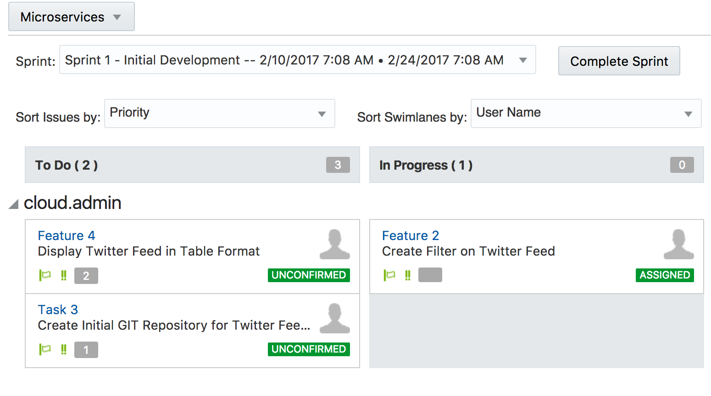  

### **STEP 15**: Build and test the TwitterFeedMicroservice

- **Right Click** on the **TwitterFeedMicroservice** project. Select **Maven > Update Project**

      

- Keep the defaults, and click **OK**. This will run Maven, and build the project.

    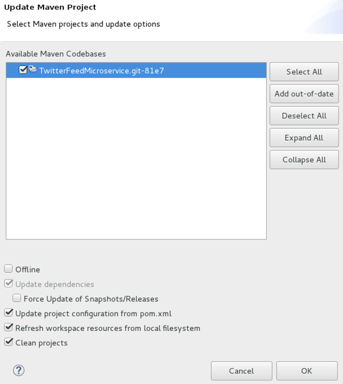  

- To test the local copy of the project code, right click on the **TwitterFeedMicroservice** project and select **Run As > Maven Test**

      

- Double Clicking on the **Console tab** will expand The Window. You can minimize the Window by double clicking the tab again. If the TwitterFeedMicroservices test runs successfully, your console window will contain the following – Notice the message with “### Tweets in Static Tweets”. You should see that there were zero Failures. Depending on your installation, you may see an exception as Eclipse's network listener is shutdown.

      

## Add the Filter to the Service

The Code we cloned locally contains the entire source necessary to filter the Static Twitter Feed. In this section of the lab, we will un-comment the code and test the filter.

### **STEP 16**: Add Filter

- In the Project Explorer, **expand** the **TwitterFeedMicroservice > src/main/java > com.example** and **double click** on **StaticTweets.java** to open the source code.

      

- In the StaticTweets.java source file, scroll down until you find two lines of code that begin with “**--- Remove this comment**”. **Delete both of these lines** to activate the code that will cause filtering of the Static Tweets file to occur.

      

- Your code should now look like this:

      

- Next we will enable the filter in the testing code. Expand the **src/test/java > com.example folder**, and **double click** on **MyServiceTest.java** to open the source file

      

- In the MyServiceTest.java source file, locate the method **testGetStaticSearchTweets()**, and **remove** the **comments** so that section of code will execute.

      

- Click on the **Save All** icon

      

## Test the Local Filtered Services

### **STEP 17**: Run Test and Create Branch

- Run the Test by right clicking on **TwitterFeedMicroservice** and selecting **Run As > Maven Test**

      

- Once the test runs, you’ll see the Static Twitter feed returned for both the unfiltered and filtered tests. You should not see any Failures.

- right click on **TwitterFeedMicroservice** and select **Team > Switch To > New Branch**

      

- Enter **Feature2** for the Branch name, and click on **Finish**

    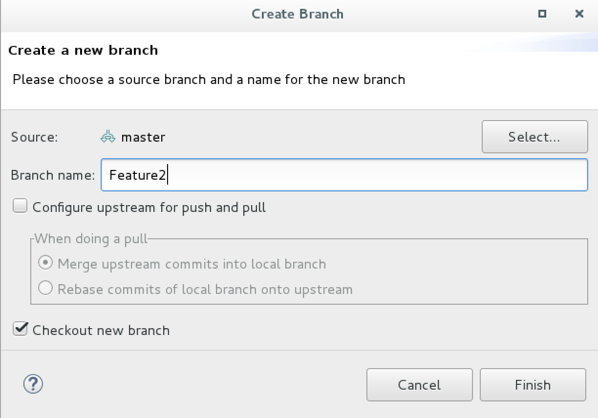  

- We can now commit our code to the branch by Right Clicking on **TwitterFeedMicroservice** and then selecting **Team > Commit**

    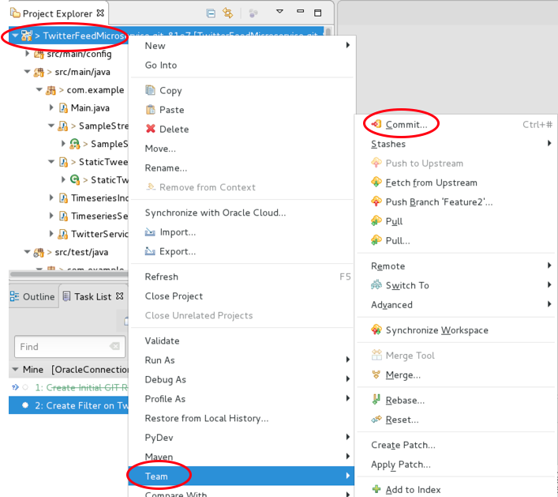  

- Enter “**Feature2: Added Support for Filtering**” in the Commit Message box.
- **Drag and Drop** the **changed files** into the **Staged Changes** panel.
- Click on **Commit and Push**. Note: it is possible to change the default Author and Committer to match the current “persona.” However, for the sake of this lab guide, we will leave the defaults.  

      

- Accept the Default for the **Push Branch Feature** 2 dialog and click on **Next**
- Click on the **Finish button** in the Push Confirmation dialog
- Click on **Ok** in Push Result dialog

### **STEP 18**: Complete the Create Filter Task

- In the lower left Eclipse Task List, double click on **Create Filter on Twitter Feed** task

      

- In the **Create Filter on Twitter Feed** window, scroll down to the **Actions** Section. Click on **Resolve as FIXED**, and then click on the **Submit** button

    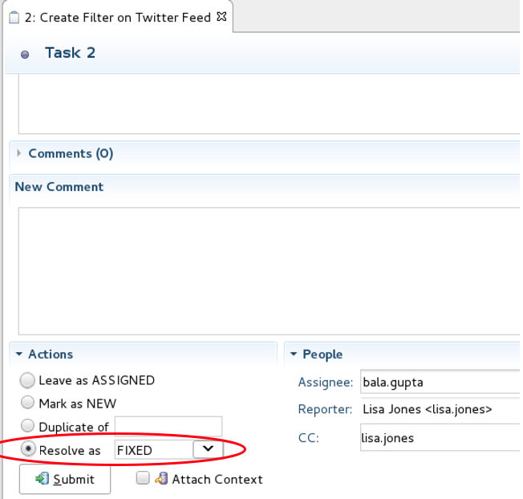  

## Create Merge Request

### **STEP 19**: Review Sprint Status and create Merge Request

- Return to the Developer Cloud Service Dashboard in the browser, and select **Agile**. If your default Board is not set to Microservices, then set the Find Board Filter to All, and select the Microservices board.

      

- Click on **Active Sprints** button. Notice that **Feature 2** is now in the **Verify Code** column

- Next, on navigation panel click **Code**, select the **Feature2** branch and then click on the **Commits sub tab**. Now view the recent commit made to branch from within Eclipse.

      

- Now that "Bala Gupta" has completed the task of adding the search filter, a **Merge Request** can be created by Bala and assigned to Lisa Jones. Click on **Merge Requests** on navigation panel and then click on the **New Merge Request** button.

      

- Enter the following information into the **New Merge Request** and click **Next**

  **Repository:** 	`TwitterFeedMicroservice.git`

  **Target Branch:** `master`

  **Review Branch:** `Feature2`

      

- Enter the following information into **Details** and click **Create**

  **Summary:** `Merge Feature 2 into master`

  **Reviewers:** `<Your Username>`

      

    **Note**: **Bala Gupta** is logically sending this request to **Lisa Jones**

- In the **Write box**, enter the following comment and then click on the **Comment** button to save:

  `I added the ability to add a filter request to the end of the URL – e.g. statictweets/alpha`

## Merge the Branch as Lisa Jones

In the following steps “Lisa” will merge the branch create by “Bala” into the master.

### **STEP 20**: Merge Requests

  

- Before moving forward, “Lisa Jones” can take a look at the **Burndown** and **Sprint Reports** by clicking on the **Agile** navigation, then the **Reports** button

      

- Click **Sprint Report**

      

- On navigation panel click **Merge Requests**. Select the **Assigned to Me** search. After the search completes, click on the **Merge Feature 2 into master** assigned request.

      

- Once the request has loaded, select the **Changed Files** tab. “Lisa” will now have the opportunity to review the changes in the branch, make comments, request more information, etc. before Approving, Rejecting or Merging the Branch.

      

- Click on the **Merge** button.

      

- Leave the defaults, and click on the **Merge** button in the confirmation dialog.

      

- Now that the code has been committed to the Developer Cloud Service repository, the build and deployment will automatically start. On the navigation panel click **Build**, and you should see a **Twitter Feed Build** in the Queue

      

- Wait a minute or two for the build to complete. The **Last Success** will be set to **Just Now** when the build completes.

      

## Test the JavaTwitterMicroservice in the Cloud

### **STEP 21**: Test Microservice

- Once the service has successfully deployed, click **Deploy** in the left-hand menu and click on the **JavaTwitterMicroservice** link

    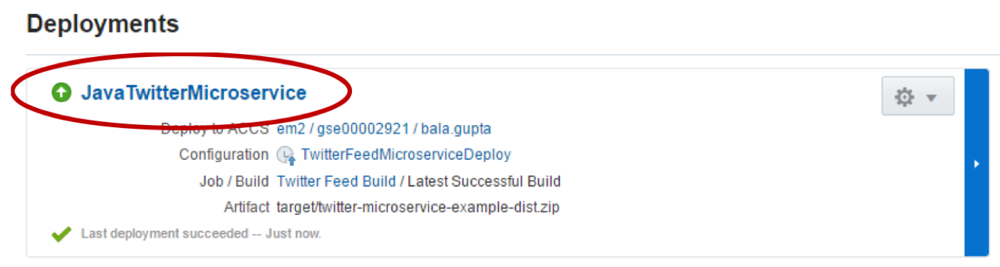  

- When the new browser tab loads, Append `/statictweets` to the end of the URL and **press enter** to test the original static twitter service

      

- Now change the appended URL to `/statictweets/alpha` and **press enter**. This will cause records containing the text ""**alpha**"" in the tweet’s text or hashtags to be returned.

      

- To complete the Sprint Feature, click **Agile** on left hand navigation. Then click on the **Active Sprints** button.

      

- Complete the feature request by Dragging and Dropping **Feature 2** (Create Filter on Twitter Feed) from the **Verify Column** to the **Completed Column**.

    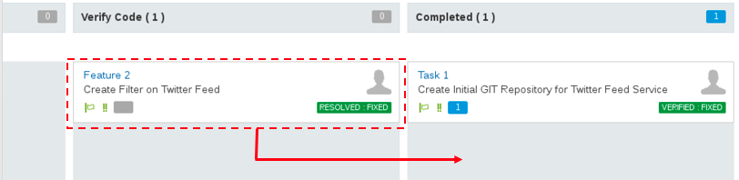  

- Set the Status to **VERIFIED – FIXED** and click **Next**.

      

- Set the **Time Spent** to `1` and click on **OK**.

      

- You are now done with this lab.

# Supplementary Assignment – Twitter Live Feed Credentials

## Create Twitter App

***This is an optional assignment***, during which you’ll have an opportunity to put your new knowledge of the Developer Cloud Service to work by extending our static twitter microservices to use live twitter data. In this exercise, you will acquire Twitter Application Credentials and use them to operate on a live twitter feed in your microservices. For the purposes of this assignment, you will use a personal account to log in to twitter and generate the credentials. However, in the context of our application, assume that these credentials have been provided by Product Management and represent the approved credentials for our production application.

You have two options for managing this code change in the version control system. If you would like more practice with the multi-user workflow, you can start a new branch for this feature, commit to that branch, create a merge request, and approve the merge. We’ll refer to this in the instructions as **Method A**. If you’re comfortable with that workflow, you can switch to master in your local repository, pull the latest revision from the cloud, and commit and push directly to master for this exercise. This will be **Method B**.

### **STEP 22**: Create New Twitter App

To generate the unique twitter credentials for our microservices, we need to sign in to twitter and create a new application for this project, then generate access tokens for it.

- Navigate to https://apps.twitter.com. Click on the **Sign In** link.

      

- If you are already a twitter user, **Log In** using your twitter credentials. Otherwise, click on the **Sign up Now** link

      

- Once logged in, click on the **Create New App** button.

      

- **Enter the following** and Click on the **Create your Twitter application** button. When entering the Application Name, append something unique to the Name’s end. E.g. your initials or name:

  **Name:** `JavaTwitterMicroservice<UniqueName>`

  **Description:** `A Twitter Feed Microservice`

  **Website:** `https://cloud.oracle.com/acc`

  **Developer Agreement:** Click `Yes`

      

- Click on the **Keys and Access Tokens** tab.

      

- If at the bottom of the page your Tokens are not visible, click on the **Create my access tokens** button

    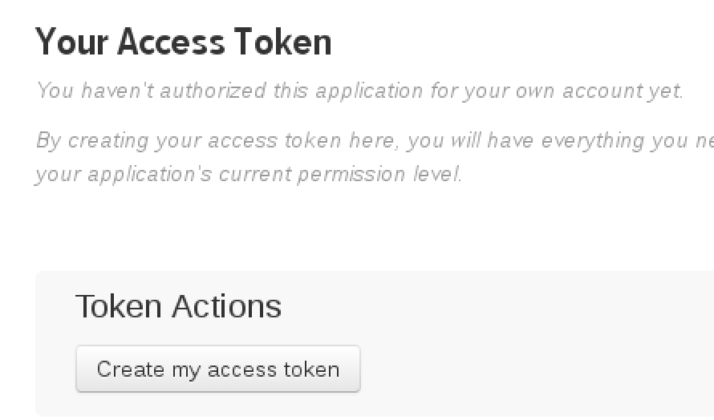  

- Note: If you are following **Method B**, before you start modifying code in Eclipse, you should switch to the master branch and pull from the remote repository.

- Return to Eclipse, and in the Project Explorer tab, expand **TwitterFeedMicroservices.git > src/main/config** and double click on **twitter-auth.json** to load the source.

    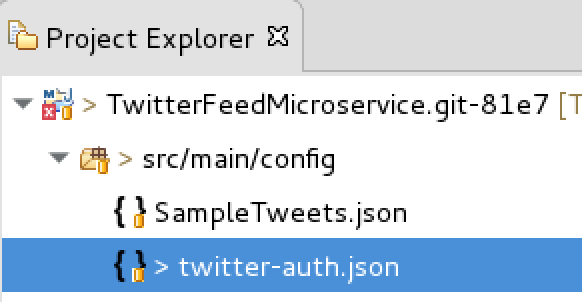  

- This is the File that will be deployed to the Application Container Cloud. Edit this file by replacing the xxx’s in **consumerKey, consumerSecret, token and tokenSecred with the Consumer Key (API Key), Consumer Secret (API Secret), Access Token and Access Token Secret** found on the Twitter Application Management page.

      

- Click on the Save All icon in Eclipse 

- So we can test locally, let’s repeat the same step by updating the Test Code’s twitter-auth.json credentials. Open the file located in **TwitterFeedMicroservices.git > src/test/resources > twitter-auth.json** and update. Once updated, click on the **Save All** Icon.

    

- Let’s now un-comment the code that will allow the online Twitter Feed to be tested. Using the Project Explorer, open the **TwitterFeedMicroservice.git > src/test/java > com.example > MyServiceTest.java** file.

    

- In the MyServiceTest.java file, located the method **testGetTweets()** and **remove the comment** surrounding that method.

    

- Click on the Eclipse Save All icon 

- Run the Test by right clicking on **TwitterFeedMicroservice** and selecting **Run As > Maven Test**

    

- After the tests run, the testGetTweets() method will return the message “The client read 10 messages!,” and all Tests should complete successfully.

    

- If you’re following **Method A**, now that you’ve enabled this new feature to access the live twitter feed, you can follow the previous steps used in this document to commit the code to the cloud. Once committed, you will use the Developer Cloud Service to create a merge request and then approve that request. Once the master branch is updated, an automatic build and deployment to the Application Container Cloud Service will be performed. Verify that deployment is successful before continuing.

- If you’re following **Method B**, now that you’ve enabled this new feature to access the live twitter feed, you can follow the previous steps used in this document to commit the code to the cloud. That will trigger an automatic build and cause the Application Container Cloud Service deployment to be performed by the Developer Cloud Service. Verify that deployment is successful before continuing.

- For either method, you will now be able append `/tweets` to the end of the Application Container Cloud Service URL and retrieve the Live Tweets.

- The example below shows the live tweets returned, once the application is re-deployed.

    
