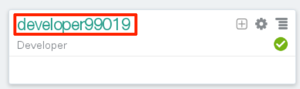
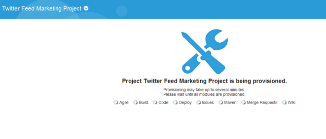
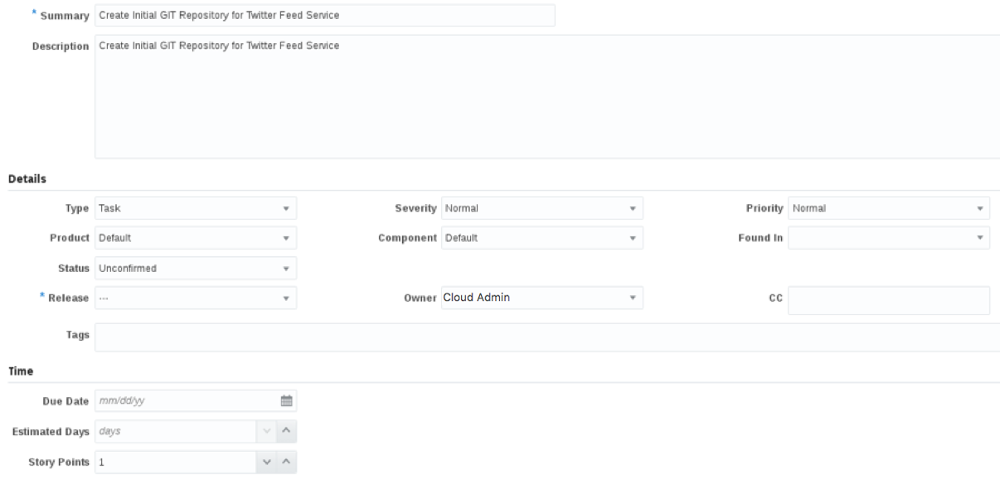
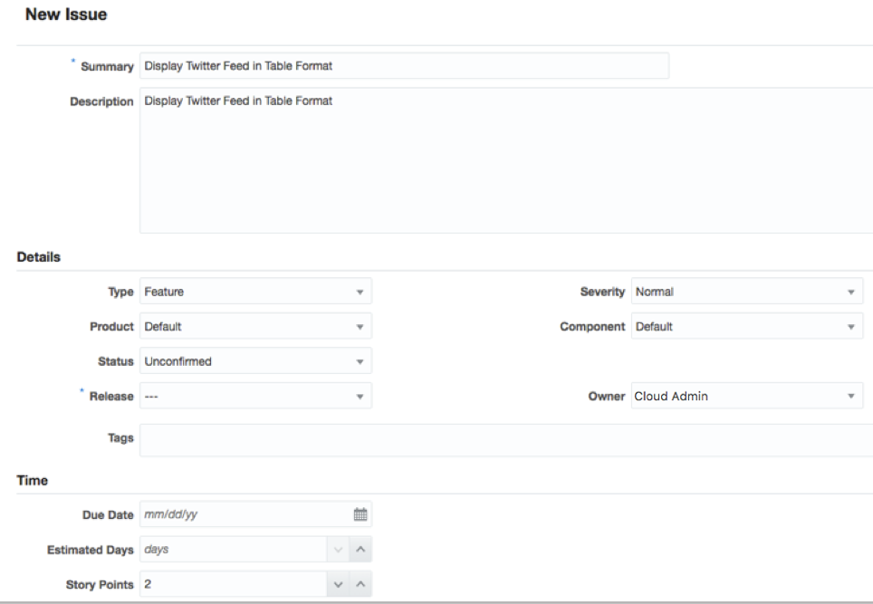
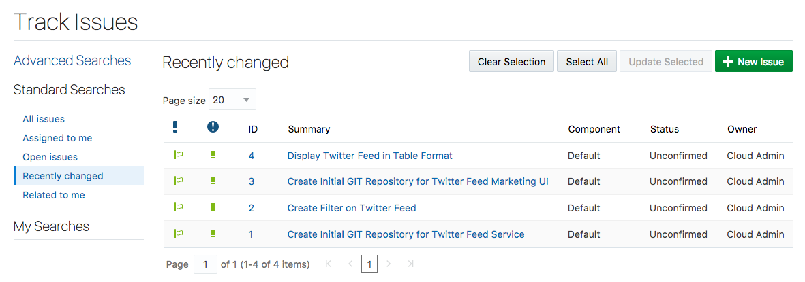
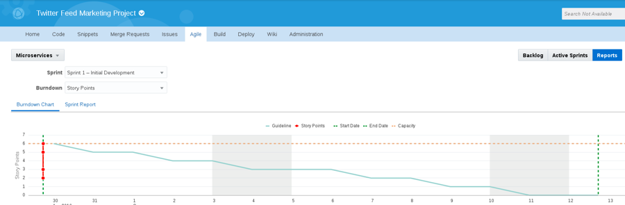

  
Update: March 31, 2017

## Introduction

このハンズオンラボは**クラウド･ネイティブ･マイクロサービス ハンズオン**の一つ目のラボです。このハンズオンではソフトウェア開発ライフサイクル(Software Development Lifecycle (SDLC))の流れを複数のマイクロサービスを作成・利用するクラウドネイティブプロジェクト通して理解していきます。

ハンズオンラボでは一人のユーザとしてログインし作業を進めますが、下記3人のユーザの作業を行います。このハンズオンでは**Oracle Developer Cloud Service**と**Oracle Application Container Cloud Service**を使用し、アプリケーション開発を行います。

- **プロジェクトマネージャ** 
  プロジェクトの作成、行なうタスクの追加、開発者へのタスクのアサインを行い、Sprintを開始します。

- **Java開発者** 
  twitterのデータ取得・フィルタリングが出来るtwitterフィードサービスの開発を行います。

- **JavaScript開発者** 
  twitterデータ分析のためのtwitterマーケティング画面を作成します。

## ゴール
- プロジェクトを作成
    - プロジェクトへユーザを追加
- Issueを作成
    - TwitterフィードマイクロサービスのIssueを作成
    - TwitterフィードマーケティングUIのIssueを作成
- Agile BoardとSprintを作成
- SprintへIssueを追加

## 前提条件
- Oracle Public Cloud環境にアクセスが出来ること

# Twitterフィードマーケティングプロジェクトの作成

## Developer Cloud Serviceでプロジェクトを作成

### **STEP 1**: Oracle Cloudアカウントへログイン
- [**こちら**](https://cloud.oracle.com)からOracle Cloudホームページへ移動します。

- 右上の**Sigin In**をクリックします。

    

- アカウント作成時に割り当てられたData Centerを選択し、**My Services** をクリックします。Data Centerの情報はトライアルアカウントの通知メールに記載があります。

    

- Identity Domain名を入力し、**Go** をクリックします。**Identity Domain名, ユーザ名, パスワード** はトライアルアカウントの通知メールに記載があります。

    

- Identity Domainがセットされたら、ユーザ名・パスワードを入力し、**Sign In** をクリックします。

  **NOTE:** このハンズオンではLisa,Bala,Johnの3人の作業が出てきますが、ハンズオンを進めるユーザーアカウントは**Trial登録時に作成したユーザアカウントのみ**を使用して進めます。

    

    

- ログインが成功すると、トライアルアカウントで使用可能なクラウドサービスの一覧が表示されたダッシュボード画面へ移動します。

    

- このハンズオンでは**Application Container、Developer and Storage、Storage**を使用しますので、それらがダッシュボード表示されていない場合、**Customize Dashboard** をクリックし、サービス名の横の**Show**を選択してダッシュボードにサービスパネルを表示させます。

    

### **STEP 2**: ストレージレプリケーションポリシーの確認・設定

***こちらはハンズオンセットアップガイドに含まれる手順と同様のものですので、すでにレプリケーションポリシーの設定が完了している方は実施不要です。***

- **Storage クラウドサービス** をクリックします。

    

- 右上の**Open Service Console** をクリックします。

    

- 下記の画面が表示されたら、デフォルト設定のまま**Set Policy** をクリックします。画面が表示されない場合、レプリケーションポリシーは既に設定されているので、追加の設定は必要ありません。

    

- ストレージレプリケーションポリシーの設定が完了しました。

    

### **STEP 3**: Developer Cloud Serviceへのログイン

Oracle Developer Cloud Serviceは、チーム開発プロセスを合理化し、ソフトウェアのデプロイを自動化する開発プラットフォームを提供します。統合プラットフォームには、課題管理システム、アジャイル開発ダッシュボード、コードのバージョン管理とレビュー・プラットフォーム、継続的な統合と配信の自動化、およびWikiやライブ・アクティビティ・ストリームなどのチーム・コラボレーション機能が含まれます。豊富なWebベースのダッシュボードと一般的な開発ツールとの統合により、Oracle Developer Cloud Serviceはより優れたアプリケーションをより迅速に提供します。

- ダッシュボードから **Developer** を選択します。手順の例ではDeveloper Cloud Service の名前が**developer99019**となっています。

    

- Service Detailsページでは、サービスの状態の概要が確認できます。

    

- **Open Service Console** をクリックして、Developer Cloud Serviceのダッシュボードへ移動します。ダッシュボードのトップ画面には現在メンバーとなっている全てのプロジェクトが表示されます。

    

### **STEP 4**: プロジェクトの作成

- **New Project** をクリックして、プロジェクト作成ウィザードを開始します。

    

- **Project Details** 画面では下記の情報を入力して、**Next**をクリックします。

    **Name:** `Twitter Feed Marketing Project`

    **Description:** `Project to gather and analyze twitter data`

    **Note:** Privateプロジェクトは自分だけが見ることができます。Sharedプロジェクトは、すべてのDeveloper Cloudユーザーに表示されます。いずれの場合でも、プロジェクトに参加するためには、プロジェクトにユーザーが追加されている必要があります。

    

- **Template** 画面ではデフォルトの **Empty Project** のまま、**Next** をクリックします。

    

- **Project Properties** 画面では**Wiki Markup** で**MARKDOWN** を選択し、**Finish** をクリックします。

    

- 数分でプロジェクトの作成が完了します。

    

- これでソフトウェア開発を管理するためのプロジェクトの作成が完了しました。

    

# Issueの作成

## TwitterフィードマイクロサービスのIssueの作成

### **STEP 5**: Issue「初期Gitリポジトリ作成(Create Initial GIT Repository for Twitter Feed Service)」の作成

このSTEPでは引き続きプロジェクト管理者の**Lisa Jones**のタスクを行います。

- 左側のナビゲーションパネルで**Issues**をクリックすると、Track Issuesページを表示します。

    

- **New Issue**をクリックして新しいIssueを作成します。New Issueには下記のデータを入力し、**Create Issue**をクリックします。(※このIssueは論理的にBala Guptaが所有します。)

    **Note:** このハンズオン・ラボは1ユーザで進めるため、TrialアカウントのユーザをIssueの物理的な所有者として割り当てます。実際の開発では**Bala Gupta** のような各担当者のユーザを所有者として割り当てます。

    

    **Summary:**
    `Create Initial GIT Repository for Twitter Feed Service`

    **Description:**
    `Create Initial GIT Repository for Twitter Feed Service`

    **Type:** `Task`

    **Owner:** `Select your account provided in the dropdown [Logical Owner = Bala Gupta]`

    **Story Points:** `1`

    Note: ストーリー・ポイントは、Scrumチームが使用する任意の尺度です。ストーリーを実装するのに必要な労力を測定するために使用されます。[こちら](https://agilefaq.wordpress.com/2007/11/13/what-is-a-story-point/) により詳細な情報が記載されています。

    

### **STEP 6**: Issue「Twitterフィードフィルター作成(Create Filter on Twitter Feed)」の作成

- **New Issue**をクリックして新しいIssueを作成します。New Issueには下記のデータを入力し、**Create Issue** をクリックします。(※このIssueは論理的にBala Guptaが所有します。)

    

    **Summary:** `Create Filter on Twitter Feed`

    **Description:** `Create Filter to allow user to supply text to reduce the amount of data returned by the Twitter feed`

    **Type:** `Feature`

    **Owner:** `Select your account provided in the dropdown [Logical Owner: Bala Gupta]`

    **Story Points:** `2`

    

### **STEP 7**: Issue「初期Gitリポジトリ作成(Create Initial GIT Repository for Twitter Feed Marketing UI)」の作成

- **New Issue**をクリックして新しいIssueを作成します。New Issueには下記のデータを入力し、**Create Issue** をクリックします。(※このIssueは論理的にJohn Dunbarが所有します。)

    

    **Summary:** `Create Initial GIT Repository for Twitter Feed Marketing UI`

    **Description:** `Create Initial GIT Repository for Twitter Feed Marketing UI`

    **Type:** `Task`

    **Owner:** `Select your account provided in the dropdown [Logical Owner: John Dunbar]`

    **Story Points:** `1`

    

### **STEP 8**: Issue「Twitterフィードを表示(Display Twitter Feed in Table Format)」の作成

- **New Issue**をクリックして新しいIssueを作成します。New Issueには下記のデータを入力し、**Create Issue** をクリックします。(※このIssueは論理的にJohn Dunbarが所有します。)

    

    **Summary:** `Display Twitter Feed in Table Format`

    **Description:** `Display Twitter Feed in Table Format`

    **Type:** `Feature`

    **Owner:** `Select account provided in the dropdown [Logical Owner: John Dunbar]`

    **Story Points:** `2`

    

- ウィンドウの**左側**にある戻る矢印  をクリックするか、左側のナビゲーションパネルの**Issues**をクリックして、新しく作成されたすべてのIssueを表示します。

    

# Agile Boardの作成

## Agile Boardと初期Sprintの作成

### Developer Cloud ServiceのAgileページの概要

Oracle Developer Cloud ServiceでAgile開発を開始する前に、Agileページの次の主要コンポーネントを理解することが重要です。

- **Board** – BoardはプロジェクトのIssueを表示および更新するために使用されます。Boardを作成するときは、それをIssue Queryに関連付けます。Boardはクエリによって返されたIssueを表示します。チームメンバーが作成したBoardを使用することも、独自のBoardを作成することもできます。必要な数のBoardを作ることができます。
- **Sprint** – Sprintは、チームメンバーが製品コンポーネントを実装する期間（通常、1週間または2週間）です。製品コンポーネントに関連するIssueをSprintに追加します。製品コンポーネントの作業を開始すると、関連するSprintを起動（またはアクティブ化）します。Sprintを使用してIssueを更新するには、まずSprintをアクティブにし、Active SprintビューにSprintを追加する必要があります。
- **Backlogビュー** – Boardのクエリによって返されたすべてのIssueを一覧表示します。このビューにはBoardに含まれるすべてのSprint(アクティブおよび非アクティブ)と、Boardのクエリに一致するIssueを含む他のBoardのSprintも表示されます。各Sprintには、追加されたIssueが一覧表示されます。Backlogセクション(Backlogビューの最後のセクション)には、まだSprintに属していない未解決のIssueがすべて一覧表示されます。Backlogビューには解決されたIssueとクローズされたIssueは表示されません。
- **Active Sprintsビュー** – BoardのすべてのアクティブなSprintを一覧表示し、ステータスをドラッグ＆ドロップするだけでIssueステータスを更新することができます。
- **Reportsビュー** – **Burndown Chartタブ**を選択してSprintの残作業の量を表示するか、**Sprint Report** タブを使用してSprintの完了および完了していないIssueを一覧表示します。

### **STEP 9**: Agile Boardの作成

- 左側のナビゲーションパネルの**Agile**をクリックして、既存のBoardが一覧表示されているページを表示します。

    

- **New Board**をクリックし、下記のデータを入力し、**Create**をクリックします。

  **Name:** `Microservices`

  **Estimation:** `Story Points`

    

### **STEP 10**: Sprintの作成
- 最初のSprintを作成します。**New Sprint**をクリック、下記のデータを入力し、**OK**をクリックします。

    **Name:** `Sprint 1 - Initial Development`

    **Story Points:** `6`

    

### **STEP 11**:	BacklogのIssueをSprintに追加

- 次に、新たに作成されたSprintにBacklogのIssueを追加します。**Sprint 1**セクションに**4つのIssue**を一度に1つずつ**ドラッグ＆ドロップ**して、SprintにIssueを追加します。

    

    

## Agile Boardのカスタマイズ

### **STEP 12**: Agile Boardのカスタマイズ

次のステップでは、アジャイルボードをカスタマイズし、新しい進捗状態を追加します。状態や条件についてのより詳細な情報が必要な場合には、[こちら](http://www.oracle.com/webfolder/technetwork/tutorials/obe/cloud/developer/AgileDevelopment/AgileDevelopment.html)に、チュートリアルがあります。

- ここでは、ボードのカスタマイズ方法を紹介します。右上の**Board**をクリックし、プルダウンから**Configure**をクリックします。

    

  **メモ**: 新しい**Progress State**を作成する前にいくつかのConditionの割り当てを解除する必要があります。IssueのConditionを追加・削除することはできませんが、Progress StateのConditionを変更することでプロジェクトのニーズに合わせて使用することができます。デフォルトではCompletedのConditionに大半のConditionが割り当てられています。

- **Progress States**をクリックして、左側の一覧から**Completed** をクリックします。**Conditions**ボックス内のすべての**RESOLVED条件** を選択します。 をクリックして、**Unassigned Conditions**ボックスに移動します。

    

- 左上の**New Progress State**をクリックします。**Name**を**Verify Code**に変更します。QAとテストを実行するためにこのProgress Stateを使用します。

    

- **Unassigned Conditions**ボックス内の**RESOLVED**の条件をすべて選択し、をクリックして**Conditions** ボックスに移動します。

    

- **Verify Code** を選択し、左上に表示されるをクリックして、**Verify Code** を**Completed**の上に移動します。これはタスクが進行する順序を決定するための重要なステップです。  

    

- 右上の**Save**をクリックして変更を保存します。

    

### **STEP 13**: Sprintの開始

- **Sprint 1**の右側の**Start Sprint**をクリックします。

- デフォルト設定のまま、**Start** をクリックします。

    

- **Active Sprints** をクリックして、スプリントダッシュボードを表示します。

    

- **Reports**ボタンをクリックして、**Barndown Chart**と**Sprint Report** を表示します。

    

- ここまででLab100は完了です。Lab200に進んでください。
