  
Update: March 31, 2017

## Introduction

このハンズオンラボは**クラウド･ネイティブ･マイクロサービス ハンズオン**の二つ目のラボです。このハンズオンではソフトウェア開発ライフサイクル(Software Development Lifecycle (SDLC))の流れを複数のマイクロサービスを作成・利用するクラウドネイティブプロジェクト通して理解していきます。

Lab 100ではプロジェクト管理者がDeveloper Cloud Serviceを利用して新規プロジェクト・タスクを作成し、各アプリケーション開発者を担当者として割り当てました。このラボでは**Java開発者**のロールとして、フロントエンドや分析用アプリケーションにデータを提供するマイクロサービスアプリケーションを開発していきます。

## ゴール

- Developer Cloud Serviceへアクセス
- 外部Gitリポジトリからのソースコードのインポート
- プロジェクトのEclipseへのインポート
- Developer Cloud Service, Application Container Cloud Serviceを使用したプロジェクトのビルド&デプロイ

## 前提条件

- Lab 100が完了していること
- Oracle Public Cloud環境にアクセスが出来ること
- 最新版のEclipseがインストールされていること(Virtual Box内に予め設定済です。)

# Twitterフィードサービスの作成

## Developer Cloud Service

### **STEP 1**: Agile Boardの確認

- Developer Cloud Serviceを開き、Lab 100で作成した**Twitter Feed Marketing Project**を開いた状態で始めてください。

      

- Trial登録時に作成したユーザアカウントを使用してハンズオンを進めますが、下記のSTEPは**Bala Gupta**の手順として進めます。

      

- **Twitter Feed Marketing Project**の左側のナビゲーションパネルで**Agile** をクリックします。

      

### **STEP 2**: アクティブなSprintの表示

- **Microservices**ボードで**Active Sprints** をクリックします。

      

## Gitリポジトリの作成

### **STEP 3**: 初期Gitリポジトリの作成

Twitterフィードマイクロサービスの開発に先立って、**あなた(Bala Gupta)**は事前に機能確認も含めたPoCを行っています。そのため、このハンズオンでは一からコーディングを行なうのではなく、外部Gitリポジトリに配置されているソースコードをDeveloper Cloud Serviceにcloneして開発を行います。まず初めにAgile Boardを使用してタスクを開始します。

- **Task1 - Create Initial GIT Repository for Twitter Feed Service**を**In Progress**のエリアにドラッグ&ドロップします。

      

- **Change Progress**のポップアップが表示されたら、**Next** をクリックします。

      

- 内容はデフォルトのまま、**OK** をクリックします。

    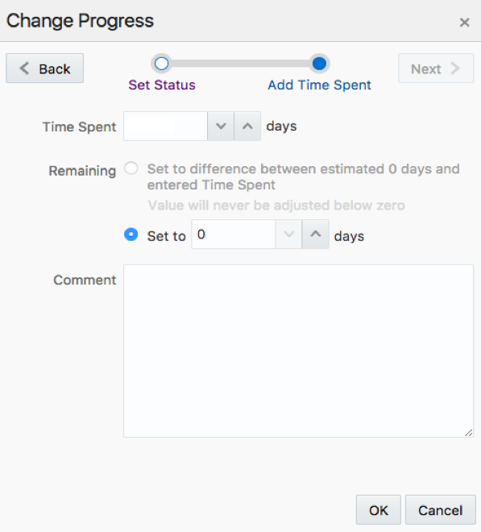  

- 下記のように**Task 1**が**In Progress**の下に表示されている事を確認します。

      

- 左側のナビゲーションパネルで**Project**をクリックします。

- 右側の**REPOSITORIES**セクションで**New Repository**をクリックして、新しいGitリポジトリを作成します。

    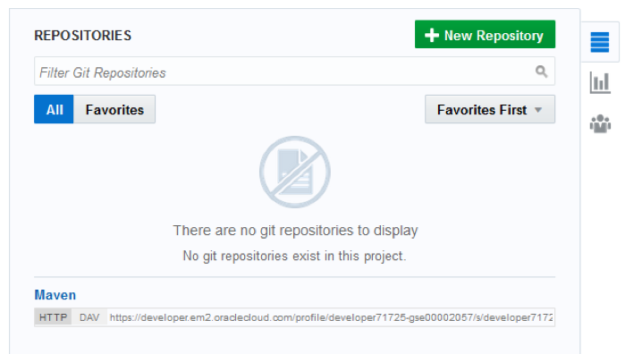  

- **New Repository**ウィザードが作成されたら、下記のデータを入力し、**Create**をクリックします。

    **Name:** `TwitterFeedMicroservice`

    **Description:** `Twitter Feed Microservice`

    **Initial content:** `Import existing repository`

    **Enter the URL:** `https://github.com/pcdavies/TwitterFeed.git`

      

- これで外部リポジトリからcloneしたDeveloper Cloud Service上のGitリポジトリの作成が完了しました。

    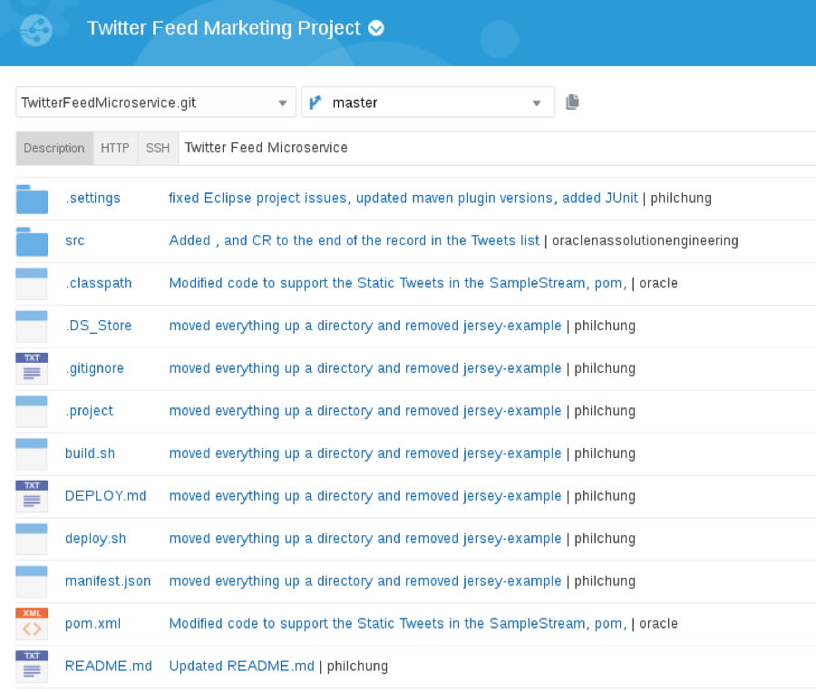  

## デフォルトビルド、デプロイジョブの作成

### **STEP 4**: デフォルトビルドジョブの作成

Gitリポジトリにソースコードを取り込めたので、masterブランチへのpushをトリガーにしたビルドジョブの作成を行います。このハンズオンではMavenビルドジョブの設定を行います。

- 左側のナビゲーションパネルで**Build**をクリックしてビルドページを表示し、**New Job** をクリックします。

      

- **New Job**のポップアップでJob Nameに`Twitter Feed Build`と入力し、**Save** をクリックします。

      

- 正常にジョブが作成されると、設定画面に移動します。

      

- **Main**タブをクリックします。

- **JDK**のプルダウンから**JDK8** を選択します。

      

- **Source Control**タブをクリックします。

- **Git** のラジオボタンを選択し、Repositoryのプルダウンから**TwitterFeedMicroservice.git**を選択します。

      

- **Triggers**タブをクリックします。

- **Based on SCM polling schedule** にチェックを入れます。

      

- **Build Steps**タブをクリックします。

- **Add Build Step**をクリックし、**Invoke Maven 3** を選択します。

      

- **Goal**に**clean assembly:assembly** を設定します。

      

- **Post Build**タブをクリックして、下記の設定を行います。
  - **Archive the artifacts**にチェックを入れます。
  - **Files to Archive**に** \*\*/target/\***と入力します。
  - **Compression Type**のプルダウンで**GZIP**を選択します。
  - **Publish JUnit test report**にチェックを入れます。
  - **Test Report XMLs**に**\*\*/target/surefire-reports/\*.xml** と入力します。この設定をすることでビルド毎にテストスクリプトの実行結果の取得が出来ます。

      

- 右上の**Save**をクリックして設定を保存します。

- **Build Now** をクリックし、ビルドの即時実行を行います。30秒から数分でキューされたジョブが実行され、下記のような状態に遷移します。

      

  **NOTE:** ビルドは数分で完了します。ビルドが完了すると成功したジョブの回数が**Test Result Trend**セクションに表示されます。ビルドで作成されたファイルをビルドジョブの設定で使用するため、***ビルドが完了するまで次のSTEPには進まないでください。***

- ビルド開始後に**Consoleアイコン**をクリックするとビルドジョブの詳細なログを確認することが出来ます。

      

### **STEP 5**: デフォルトデプロイジョブの作成

プロジェクトのビルドが正常に完了したので、Application Container Cloud Serviceのインスタンスにビルドされたアプリケーションをデプロイするためのジョブを作成します。

- 左側のナビゲーションパネルの**Deploy**をクリックして、**Deployments**ページに移動し、右上の**New Configuration** をクリックします。

      

- **New Deployemnt Configuration**ウィザードに下記のデータを入力します。

  **Configuration Name**: `TwitterFeedMicroserviceDeploy`

  **Application Name**: `JavaTwitterMicroservice`

      

- **Deployment Target**の右側にある**New**をクリックして、プルダウンから**Application Container Cloud** を選択します。

      

- **Deploy to Application Container Cloud**のポップアップに下記のデータを入力します。

  - **Data Center**: `<Your Assigned Datacenter>`

  - **Identity Domain**: `<Your Identity Domain>`

  - **Username**: `<Your User Name>`

  - **Password**: `<Supplied Password>`

- データ入力後、**Test Connection**をクリックします。接続が成功したら、**Use Connection** をクリックします。

    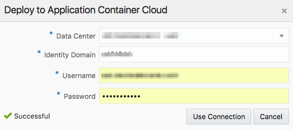  

    Note: 接続できない場合は入力した内容を確認してください。入力した内容が間違っていない場合、ストレージ・レプリケーション・ポリシーの設定が正常に行われていない可能性があるので、**Lab 100 - STEP 2: ストレージレプリケーションポリシーの確認・設定**を参考にレプリケーション・ポリシーの設定を行ってください。

- ウィザードで下記のデータを入力します。

  - **Runtime**: `Java`

  - **Subscription**: `Hourly`

  - **Type:** `Automatic` and `Deploy stable builds only`

  - **Job:** `Twitter Feed Build`

  - **Artifact:** `target/twitter-microservice-example-dist.zip`

      

- **Save** をクリックします。

      

- 右上の歯車をクリックして、プルダウンから**Start**を選択します。

      

- メッセージが**Starting application**から**Last deployment succeeded**に変わるまで待ちます。

      

      

## Twitterフィードマイクロサービスのデプロイの確認

### **STEP 6**: Issueステータスの変更

Application Container Cloud Serviceへのアプリケーションのデプロイが完了したので、Agile Boardのステータスの変更を行います。デプロイしたアプリケーションの機能確認を行なう前にAgile Board内のタスクのステータスを**Veryfy Code**に変更します。

- 左側のナビゲーションパネルで**Agile**をクリックして、**Active Sprints**をクリックします。

- **Task 1** from **In Progress** をドラッグ&ドロップして**Verify Code**エリアに移動します。

      

- **Change Progress**ポップアップで**Next** をクリックします。

      

- **Time Spent**を**1 days**に設定して、**OK** をクリックします。

      

- これでコードが**Completed**へ移動する前の**Verification**のステータスとなりました。

      

### **STEP 7**: Oracle Application Container Cloud Serviceへログイン

- Developer Cloud Serviceのサービス概要画面に戻り、右上の**Dashboard**からOracle Public Cloudダッシュボードへ移動します。サービスコンソールが残っていない場合、直接Oracle Public Cloudダッシュボードへ移動します。Note: セッションが切れている場合、再度ログインが必要な場合があります。

    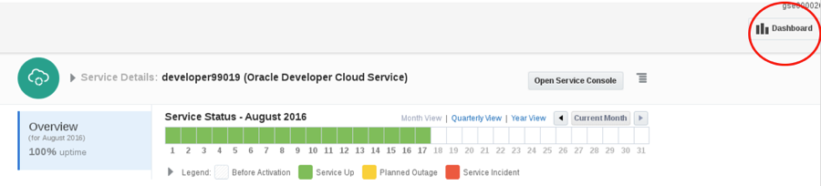  

- Oracle Public Cloudダッシュボードが表示されたら、**Application Container **の右上にあるをクリックし、プルダウンから**Open Service Console**を選択します。Note: **Application Container**が表示されていない場合、右上の**Customize Dashboard** から表示させる事が出来ます。

    

- Application Container Cloud Service(ACCS)のサービスコンソールでは、先ほどデプロイした**JavaTwitterMicroservice**を含め、全てのデプロイメントの一覧が表示されます。**URL** をクリックもしくは**URL** をコピーしてアドレスバーに入力するとデプロイされたアプリケーションが開きます。

      

- 表示されているURLの最後に`/statictweets`を追加してページを開きます。下記はサンプルのURLです。
`https://javatwittermicroservice-.apaas.em2.oraclecloud.com/statictweets`

    Note: このURLにアクセスするとTwitterフィードのJSON形式のデータが表示されます。整形された状態でデータを見たい場合、クロームであれば“JSONViewer chrome plugin”を使用することで整形されたJSONデータを確認できます。

      

### **STEP 8**: タスクの完了

これでTwitterフィードマイクロサービスのデプロイと正常に稼働していることの確認が完了しました。最後にSprintでこのIssueのステータスを**Completed**に変更します。

- Developer Cloud Serviceのダッシュボード画面に戻り、左側のナビゲーションパネルで**Agile**をクリックして、**Active Sprints**をクリックします。

- **Task 1**をドラッグ&ドロップし、**Verify Code**から**Completed** に移動します。

      

- **Change Progress**ポップアップで**Next** をクリックします。

      

- **Time Spent**を**1 days**に設定して、**OK** をクリックします。

      

- Sprintが下記のようになった事を確認します。

      

- 右上の**Report**ボタンをクリックすると、進捗を**Burndown Chart**と**Sprint Report**の形式で確認出来ます。

      

# Twitterフィードサービスへのフィルターの追加

これまでの作業でソースコードのインポート、ビルド、デプロイ、稼働確認が完了したので、フィードを動的にフィルタリング出来る機能を追加で実装します。この機能の実装ではローカル環境にリポジトリをクローンし、Eclipseからコーディングを行います。ローカル端末のExlipseで追加機能を確認したあと、修正版のコードをコミットするブランチを作成し、ソースコードのコミットを行います。コミットが完了したら、masterブランチへのマージリクエストを作成します。また、EclipseからのAgile Boardのタスクのステータスの管理方法も併せて確認します。

## Eclipseへのプロジェクトのクローン

### **STEP 9**: Eclipseの起動

これからの作業はVirtualBox環境内のEclipseを使用して行います。

- デスクトップの**Eclipse**アイコンを右クリックし、**Run** を選択します。

      

- Eclipse起動後、**Welcome Window** が表示される場合、ウィンドウを閉じます。

      

### **STEP 10**: Oracle Developer Cloud Serviceへの接続

- EclipseからDeveloper Cloud Serviceへの接続設定を行います。まず、メニューバーの**Window**をクリックし、プルダウンから**Show View ->Other**を選択します。

      

- 検索フォームに`oracle`と入力し、**Oracle Cloud**を選択して**OK** をクリックします。

      

- Oracle Cloudタブの**Connect**をクリックします。

      

- 下記のデータを入力します。

  - **Identity Domain**: `<your identity domain>`

  - **User name**: `<your Username>`

  - **Password**: `<your Identity domain password>`

  - **Connection Name**: `OracleConnection`

    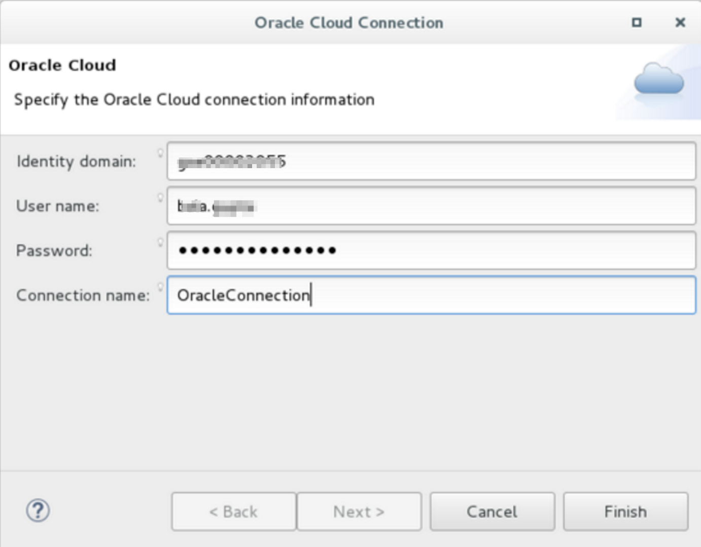  

- Eclipse Secure Storageのマスタパスワードが求められた場合、`oracle`と入力します。

      

  - パスワードヒントを求められた場合、**No** をクリックします。

      

### **STEP 11**: リポジトリのローカルクローンの作成

- **Developer**のツリーを展開し、**Twitter Feed Marketing Project** をダブルクリックして有効化します。

      

- **Code**セクションを展開し、**Git Repo** [**TwitterFeedMicroservice.git**]をダブルクリックして、ローカルにリポジトリのクローンを作成します。

      

- **TwitterFeedMicroservice**のクローンリポジトリで右クリックを行い、プルダウンから**Import Projects** を選択します。

      

- 下記の画面が表示されたら、デフォルトのまま**Next**をクリックします。

      

- デフォルト設定のまま、**Finish** をクリックします。Note: 何もインポートされない場合、次のステップでインポートが行われます。

      

### **STEP 12**: プロジェクトのインポート

- ***リポジトリがインポートされなかった場合、*** 下記の手順を行ってください。**TwitterFeedMicroService** のインポートがすでにされている場合、次のSTEPに進んでください。

      

- メニューバーの**File**をクリックして、プルダウンから**Import**を選択します。

    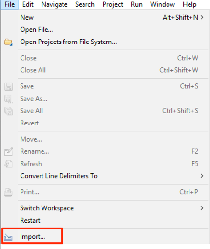

- インポートダイアログで**General** > **Existing Projects into Workspace**を選択し、**Next** をクリックします。**Import Prtojects**のウィンドウに戻ったら、**Finish** をクリックします。

    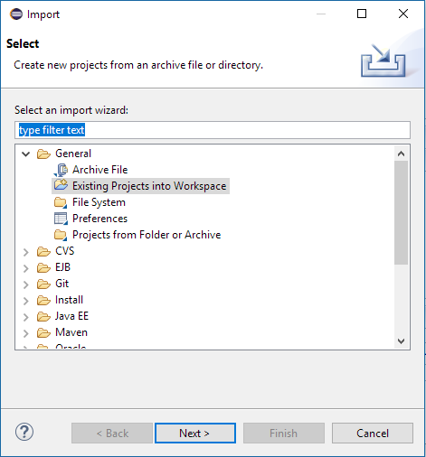

- インポートダイアログで**Select root directory**の右にある**Browse**をクリックします。

- **Browse for Folder**のポップアップで**Workspace** > **TwitterFeedMicroservice.git-xxxx**を選択し、**OK** をクリックします。

    

### **STEP 13**: Java JREを設定

JREの設定が正しく行われているかの確認を行います。正しく設定されていない場合、**Project Setting**から正しいJREの設定を行います。

- **TwitterFeedMicroservice**をクリックして、メニューバーの**Projectをクリックして**Properties** を選択します。

      

- **Java Build Path** を選択します。

      

- **Libraries tab** をクリックします。

- **JRE System Library**を選択します。

- **Edit** をクリックします。

      

- 下記の例のように**Execution Environment JRE**が**1.8.0\_102もしくはそれ以上**の場合、***次のSTEPに進んでください。***

      

- 下記の例のように**Execution Environment JRE**が**1.8.0\_102未満**の場合,**Installed JREs** をクリックします。

       

- Standard VMを選択し(下記の例の場合**java-1.8.0-openjdk**)、**Edit** をクリックします。

      

- **JRE home: Directory** をクリックします。

      

- **usr/java**に移動し、**jdk1.8.0\_102**を選択して**OK** をクリックします。

      

- JRE名を**jdk1.8.0\_102**に変更し、**Finish** をクリックします。

      

- **OK**、**Finish**、 **OK** の順で出て来るプロンプトでクリックしてライブラリの設定を完了します。

## ローカルにクローンしたサービスの確認

### **STEP 14**: Feature 2のステータスをIn Progressに変更

これまでのSTEPではDeveloper Cloud ServiceのBUIを使用して、**Bala Gupta**にアサインされたタスクのステータスを変更しました。このSTEPではEclipseを使用して、タスクのステータスの変更を行います。

- Oracle Cloud Connectionタブ内の**Issues**をダブルクリックして展開し、**Mine**をダブルクリックしてリストを表示します。Issueの一覧が表示されたら、**Create Filter on Twitter Feed** をダブルクリックします。

      

- **Create Filter on Twitter Feed**ウィンドウを下までスクロールします。ウィンドウ内の**Actions**セクションで**Accept (change status to ASSIGNED)**を選択し、**Submit** をクリックします。

    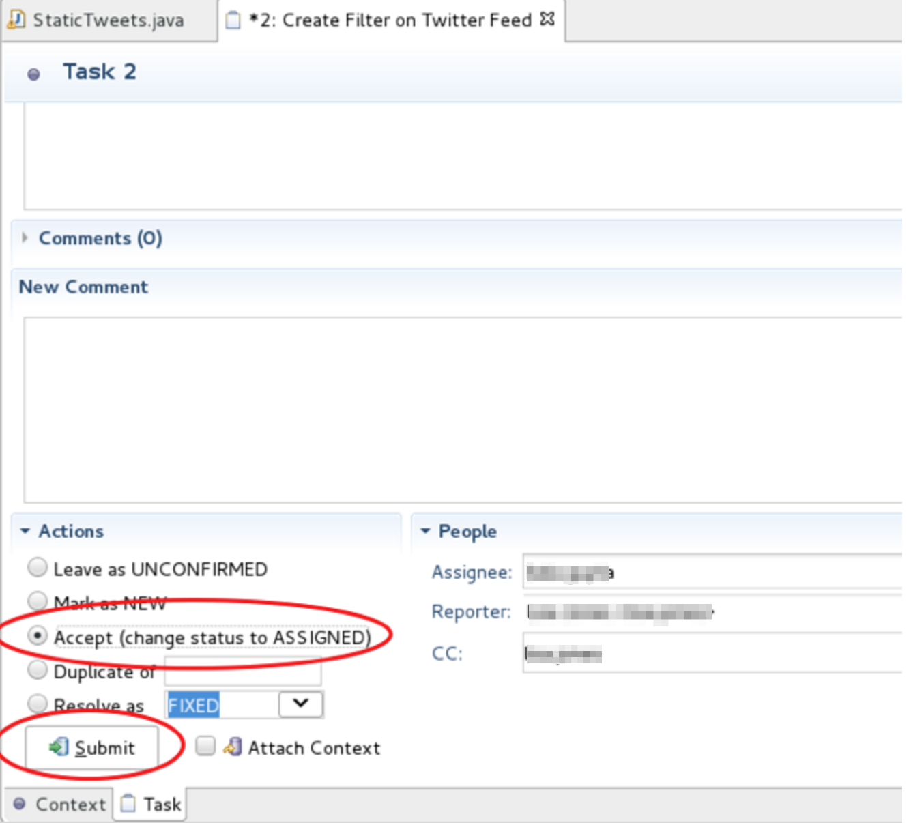  

- Developer Cloud のBUIからEclipseでの変更の反映を確認することができます。

      

### **STEP 15**: TwitterFeedMicroserviceのビルドとテスト

- **TwitterFeedMicroservice**プロジェクトで右クリックをして、**Maven > Update Project** を選択します。

      

- デフォルトのまま、**OK** をクリックします。これでMavenジョブを実行し、プロジェクトのビルドを行います。

      

- **TwitterFeedMicroservice**を右クリックして、**Run As > Maven Test** を選択してローカルコードのテストを行います。

      

- **Console** タブをダブルクリックしてウィンドウを拡大します。もう一度ダブルクリックするとウィンドウを縮小出来ます。TwitterFeedMicroservicesのテストが正常に完了すると、下記のメッセージが表示されます。Failuresの値が0になっている事を確認してください。

      

## サービスへのフィルター追加

ローカルにクローンしたソースコードにはフィルターを追加するためのソースコードが含まれています。このセクションではフィルター機能のソースコードのコメントアウトを外し、機能の確認を行います。

### **STEP 16**: フィルターの追加

- **Project Explorer**で**TwitterFeedMicroservice > src/main/java > com.example**のツリーを展開し、**StaticTweets.java** をダブルクリックして、ソースコードを表示します。

      

- **StaticTweets.java**のソースコードを下にスクロールしていき、“**--- Remove this comment**”の記述を探します。同じ内容の行が2行あるので、**両方の行を削除し** フィルター機能を有効化します。

      

- 修正後のソースコードは下記のようになります。

      

- 続いて、テストコードのフィルターに関するテストを有効化します。**src/test/java > com.example folder**のツリーを展開し、**MyServiceTest.java** をダブルクリックして、ソースコードを表示します。

      

- **MyServiceTest.java**で**testGetStaticSearchTweets()**というメソッドを探し、**コメントアウト**(下記赤点線内)を削除します。

      

- **Save All** をクリックします。

      

## ローカルのフィルター機能のテスト

### **STEP 17**: テストの実行とブランチの作成

- **TwitterFeedMicroservice**を右クリックし、**Run As > Maven Test** を選択して、テストを実行します。

      

- テストが実行されたら、フィルターされていない結果とフィルターされた結果が表示されます。Failureの値が0である事を確認してください。

- **TwitterFeedMicroservice**を右クリックし、**Team > Switch To > New Branch** を選択します。

      

- Branch Nameに**Feature2**と入力し、**Finish** をクリックします。

      

- **TwitterFeedMicroservice**を右クリックし、**Team > Commit** を選択して修正したソースコードをコミットします。

      

- Commit Messageボックスに“**Feature2: Added Support for Filtering**”と入力します。
- ソースコードを修正したファイルを**Staged Changes**エリアに**Drag and Drop**します。
- **Commit and Push** をクリックします。Note: AuthorとCommitterを現在のユーザロールの名前に変更することが出来ますが、このハンズオンでは変更せず、デフォルトの値を使用します。

      

- **Push Branch Feature**ダイアログをAcceptし、**Next**をクリックします。
- Push Confirmationダイアログの**Finish** をクリックします。
- Push Resultダイアログの**Ok**をクリックします。

### **STEP 18**: フィルター作成タスクの完了

- Eclipseの左下の**Task List**タブ内の**Create Filter on Twitter Feed** をダブルクリックします。

    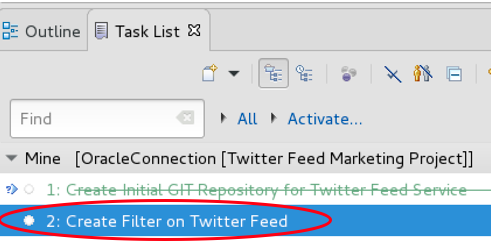  

- **Create Filter on Twitter Feed**ウィンドウで

- **Create Filter on Twitter Feed**ウィンドウを下までスクロールします。ウィンドウ内の**Actions**セクションで**Resolve as FIXED**を選択し、**Submit** をクリックします。

      

## マージリクエストの作成

### **STEP 19**: Sprint Statusのレビューとマージリクエストの作成

- Developer Cloud Serviceダッシュボードに戻り、左側のナビゲーションパネルの**Agile**をクリックします。デフォルトのBoardがMicroservicesになっていない場合、**Find Board Filter**を**All**に設定し、**Microservices** のBoardを表示します。

    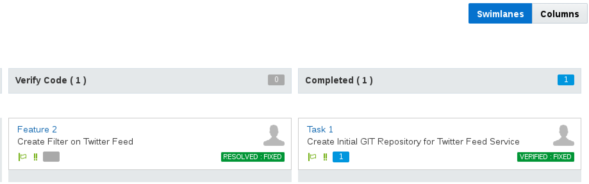  

- **Active Sprints**をクリックします。**Feature 2**が**Verify Code** エリアにあることを確認します。

- 左側のナビゲーションパネルで**Code**をクリックして、**Feature2**ブランチを選択し、**Commits sub** タブを選択します。コミットがEclipseからされていることを確認します。

      

- これで**Bala Gupta**はフィルター追加のタスクを完了したので、**Lisa Jones**に向けて、ブランチのマージリクエストを作成します。**Merge Requests**をクリックして、**New Merge Request** をクリックします。

      

- **New Merge Request**に下記のデータを入力して、**Next** をクリックします。

  **Repository:** 	`TwitterFeedMicroservice.git`

  **Target Branch:** `master`

  **Review Branch:** `Feature2`

      

- **Details**に下記のデータを入力して、**Create**をクリックします。

  **Summary:** `Merge Feature 2 into master`

  **Reviewers:** `<Your Username>`

    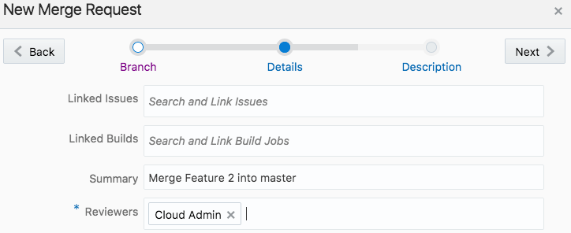  

    **Note**: このSTEPではユーザロール**Bala Gupta**がユーザロール**Lisa Jones**にマージリクエストを送信しています。

- **Write**ボックスに下記のコメントを入力し、**Comment** をクリックして保存します。

  `I added the ability to add a filter request to the end of the URL – e.g. statictweets/alpha`

## Lisa Jonesとしてブランチをマージ

ここからのSTEPでは“Bala”が作成したブランチを“Lisa”がmasterブランチへマージします。

### **STEP 20**: マージリクエスト

  

- 左側のナビゲーションパネルの**Agile**をクリックし、右上の**Reports**を選択すると、**Burndown**と**Sprint Reports** が確認できます。

      

- **Sprint Report** をクリックします。

      

- **Merge Requests**をクリックして、**Assigned to Me**を選択します。**Merge Feature 2 into master** が表示されるのでクリックします。

      

- リクエストが表示されたら、**Changed Files** タブを選択します。マージリクエストの承認・拒否・マージを行なう前に、“Lisa”はブランチへの変更、コメント等の確認を行います。

    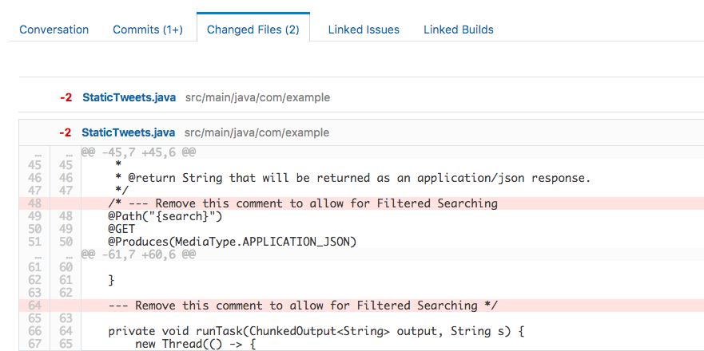  

- **Merge** をクリックします。

      

- デフォルトのまま**Merge**をクリックします。

      

- これで修正されたソースコードがDeveloper Cloud Serviceのリポジトリにコミットされましたので、自動でビルド&デプロイが実行されます。左側のナビゲーションパネルで**Build**をクリックして、**Twitter Feed Build** がQueueに入っていることを確認します。

      

- ビルドが完了するまで数分待ちます。ビルドが完了すると**Last Success**の内容が**Just Now** に変更されます。

      

## Cloud環境でJavaTwitterMicroserviceのテスト

### **STEP 21**: マイクロサービスのテスト

- サービスが正常にデプロイされたら、左側のナビゲーションパネルの**Deploy**をクリックして、**JavaTwitterMicroservice** のリンクをクリックします。

      

- ブラウザの新規タブが開いたら、URLの最後に`/statictweets`を追記してページを開き、フィルターなしのTwitterフィードを確認します。

      

- フィルターなしのフィードが確認出来たら、URIを`/statictweets/alpha`に変更し、テキストやハッシュタグに""**alpha**""が含まれたフィードのみがフィルタリングされて表示されていることを確認します。

      

- 左側ナビゲーションパネルの**Agile**をクリックし、**Active Sprints** を選択し、Sprint Featureを完了させます。

    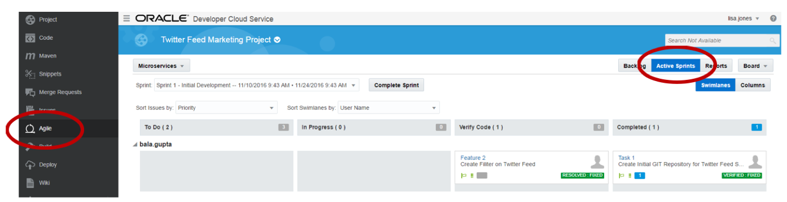  

- **Feature 2** (Create Filter on Twitter Feed)を**Verify**エリアから**Completed**エリアへドラッグ&ドロップで移動します。

      

- ステータスを**VERIFIED – FIXED**に変更し、**Next** をクリックします。

      

- **Time Spent**を**1 days**に設定して、**OK** をクリックします。

    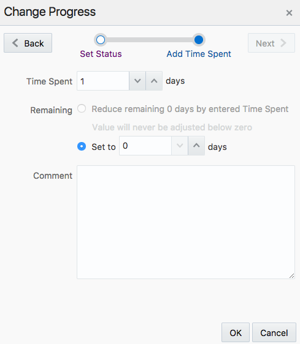  

- ここまででLab200は完了です。Lab300に進んでください。

# Supplementary Assignment – Twitter Live Feed Credentials

## Create Twitter App

***This is an optional assignment***, during which you’ll have an opportunity to put your new knowledge of the Developer Cloud Service to work by extending our static twitter microservices to use live twitter data. In this exercise, you will acquire Twitter Application Credentials and use them to operate on a live twitter feed in your microservices. For the purposes of this assignment, you will use a personal account to log in to twitter and generate the credentials. However, in the context of our application, assume that these credentials have been provided by Product Management and represent the approved credentials for our production application.

You have two options for managing this code change in the version control system. If you would like more practice with the multi-user workflow, you can start a new branch for this feature, commit to that branch, create a merge request, and approve the merge. We’ll refer to this in the instructions as **Method A**. If you’re comfortable with that workflow, you can switch to master in your local repository, pull the latest revision from the cloud, and commit and push directly to master for this exercise. This will be **Method B**.

### **STEP 22**: Create New Twitter App

To generate the unique twitter credentials for our microservices, we need to sign in to twitter and create a new application for this project, then generate access tokens for it.

- Navigate to https://apps.twitter.com. Click on the **Sign In** link.

      

- If you are already a twitter user, **Log In** using your twitter credentials. Otherwise, click on the **Sign up Now** link

      

- Once logged in, click on the **Create New App** button.

      

- **Enter the following** and Click on the **Create your Twitter application** button. When entering the Application Name, append something unique to the Name’s end. E.g. your initials or name:

  **Name:** `JavaTwitterMicroservice<UniqueName>`

  **Description:** `A Twitter Feed Microservice`

  **Website:** `https://cloud.oracle.com/acc`

  **Developer Agreement:** Click `Yes`

      

- Click on the **Keys and Access Tokens** tab.

    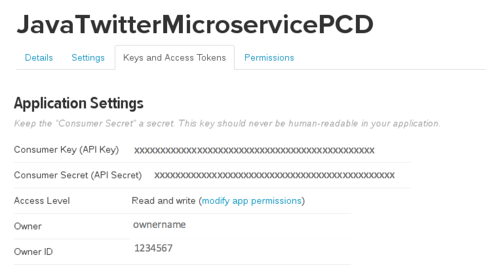  

- If at the bottom of the page your Tokens are not visible, click on the **Create my access tokens** button

      

- Note: If you are following **Method B**, before you start modifying code in Eclipse, you should switch to the master branch and pull from the remote repository.

- Return to Eclipse, and in the Project Explorer tab, expand **TwitterFeedMicroservices.git > src/main/config** and double click on **twitter-auth.json** to load the source.

      

- This is the File that will be deployed to the Application Container Cloud. Edit this file by replacing the xxx’s in **consumerKey, consumerSecret, token and tokenSecred with the Consumer Key (API Key), Consumer Secret (API Secret), Access Token and Access Token Secret** found on the Twitter Application Management page.

      

- Click on the Save All icon in Eclipse 

- So we can test locally, let’s repeat the same step by updating the Test Code’s twitter-auth.json credentials. Open the file located in **TwitterFeedMicroservices.git > src/test/resources > twitter-auth.json** and update. Once updated, click on the **Save All** Icon.

    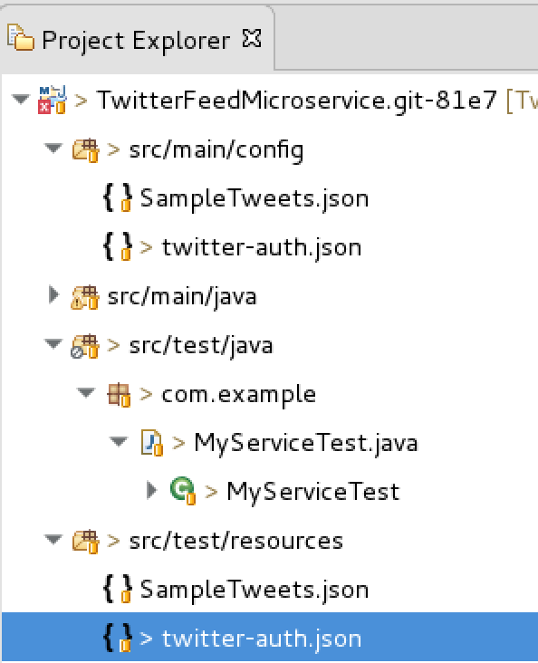

- Let’s now un-comment the code that will allow the online Twitter Feed to be tested. Using the Project Explorer, open the **TwitterFeedMicroservice.git > src/test/java > com.example > MyServiceTest.java** file.

    

- In the MyServiceTest.java file, located the method **testGetTweets()** and **remove the comment** surrounding that method.

    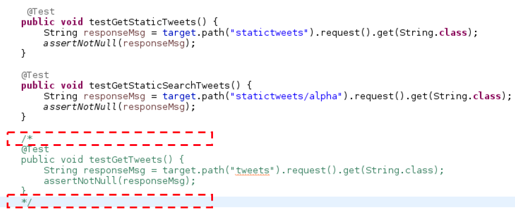

- Click on the Eclipse Save All icon 

- Run the Test by right clicking on **TwitterFeedMicroservice** and selecting **Run As > Maven Test**

    

- After the tests run, the testGetTweets() method will return the message “The client read 10 messages!,” and all Tests should complete successfully.

    

- If you’re following **Method A**, now that you’ve enabled this new feature to access the live twitter feed, you can follow the previous steps used in this document to commit the code to the cloud. Once committed, you will use the Developer Cloud Service to create a merge request and then approve that request. Once the master branch is updated, an automatic build and deployment to the Application Container Cloud Service will be performed. Verify that deployment is successful before continuing.

- If you’re following **Method B**, now that you’ve enabled this new feature to access the live twitter feed, you can follow the previous steps used in this document to commit the code to the cloud. That will trigger an automatic build and cause the Application Container Cloud Service deployment to be performed by the Developer Cloud Service. Verify that deployment is successful before continuing.

- For either method, you will now be able append `/tweets` to the end of the Application Container Cloud Service URL and retrieve the Live Tweets.

- The example below shows the live tweets returned, once the application is re-deployed.

    
