  

Update: March 31, 2017

## Introduction

This is the third of several labs that are part of the **Oracle Cloud Native Microservices** workshop. This workshop will walk you through the Software Development Lifecycle (SDLC) for a Cloud Native project that will create and use several Microservices.

In the previous lab (200), the Java Developer (Bala Gupta) created several microservices that pull data from twitter and allow for dynamic filtering based on keywords. In this lab, you will assume the role of the front-end JavaScript developer who will create a web application that incorporates the data from those microservices. This node.js application will be developed in the Developer Cloud Service taking advantage of automated builds and deployments to the Application Container Cloud Service.

***To log issues***, click here to go to the [github oracle](https://github.com/oracle/cloud-native-devops-workshop/issues/new) repository issue submission form.

## Objectives

- Access Developer Cloud Service
- Import Code from external Git Repository
- Import Project into Brackets
- Build and Deploy project using Developer Cloud Service and Oracle Application Container Cloud Service

## Required Artifacts

- The following lab requires an Oracle Cloud account that will be supplied by your instructor. You will need to download and install latest version of the Brackets text editor.


# Create Initial Twitter Marketing UI Service

## Explore Developer Cloud Service

### **STEP 1**: Review Agile Board

- This Lab assumes that you completed Lab 100 and 200 and are still connected to the Oracle Cloud, that you're still in the Developer cloud Service Dashboard, and you're viewing the "Twitter Feed Marketing Project". If for some reason that is not the case, follow the first several Steps of Lab 100 to once again view the Developer Cloud Service Console.

    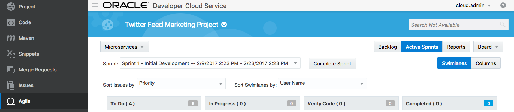  

- Although you will remain connected to the Oracle Cloud using the user account you were provided, you are to take on the Persona of ***John Dunbar*** as you perform the following steps.

      

- Click on **Agile** on the navigation panel.

      

- Click on the **Microservices** Board **Active Sprints**.

    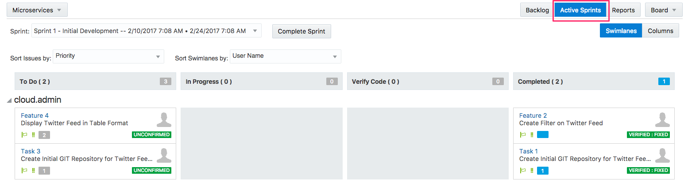  

## Create Initial Git Repository

### **STEP 2**: Create Initial Git Repository

As in the previous lab, we could start coding this application from scratch at this point. However, one of our colleagues has already begun working on the shell for our web application outside of the Developer Cloud Service. We want to use his work as a starting point and extend it to incorporate our twitter microservices. To pull his code into the Developer Cloud Service, we will clone his external GIT repository. First let’s update our agile board to show that we are working on this task:

- Drag and drop **Task 3 - Create Initial GIT Repository for Twitter Marketing UI** into the **In Progress** swim-lane.  Click **OK** on Change Progress popup.

      

    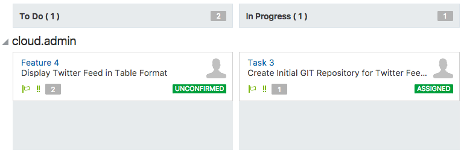  

- Click on **Project** on the navigation panel.

- Click on **New Repository** to create a new Git Repository

      

- In the New Repository wizard enter the following information and click **Create**.

    **Name:** `TwitterMarketingUIMicroservice`

    **Description:** `Twitter Marketing UI Microservice`

    **Initial content:** Import existing repository and enter the URL: `https://github.com/pcdavies/JETTwitterQuickStart.git`

      

- You have now created a new GIT repository based on an existing repository.

      

## Create Default Build and Deployment Process

### **STEP 3**: Create Default Build Process

Now that we have the source code in our managed GIT repository, we need to create a build process that will be triggered whenever a commit is made to the master branch. We will set up a shell script build process in this section.

- Click **Build** on the navigation panel to access the build page and click **New Job**.

      

- In the New Job popup enter `Twitter Marketing UI Build` for Job Name and click **Save**.

      

- You are now placed into the job configuration screen.

      

- Click the **Source Control** tab. Click Git and select **TwitterMarketingUIMicroservice.git** from the URL drop down.

    **Note:** Make sure you select the Git repository for the Twitter Marketing UI Microservice.

      

- Click the **Triggers** tab.  Select Based on **SCM polling schedule**.

      

- Click the **Build Steps** tab. Click **Add Build Step**, and select **Execute shell**.

    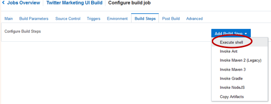  

- For **Command** enter: `npm install`

      

- Click the **Post Build** tab. Check **Archive the artifacts** and enter `**/target/*` for Files to Archive.  Verify **GZIP** in the Compression Type.

      

- Click **Save** to complete the configuration. A build should start automatically within a minute or two.  If it does not start automatically, click on the **Build Now** button. The status will change to the following:

      

- Once the build begins, it should take about approximately 1 to 2 minutes for the build to complete. Wait for the build to complete before continuing on to the next step, as we need the build artifact to create the deployment configuration.

      

### **STEP 4**: Create Default Deployment Process

Now that we have an automated build process, we will set up a deployment configuration that will push our build artifacts to a node.js environment running on the Application Container Cloud Service whenever a successful build occurs.

- Click **Deploy** to access the Deployment page and click **New Configuration**.

      

- Enter the following data:

    **Configuration Name:** `TwitterMarketingUIDeploy`

    **Application Name:** `JETFrontEndApp`

      

- Right of Deployment Target click **New** and select **Application Container Cloud**

      

- Enter the following data and click Test Connection. If Successful click Use Connection

    **Data Center**: `<Your Assigned Datacenter>` ***(Ask instructor if needed)***

    **Identity Domain**: `<Your Identity Domain>`

    **Username**: `<Your User Name>`

    **Password**: `<Supplied Password>`

      

- Set ACCS Properties to Runtime **Node** and Subscription **Hourly**. 
- Click Type **Automatic**. 
- Select Job **Twitter Marketing UI** Build.
- Select **target/jet-quickstart-client-dist.zip** for Artifact.

      

- Click **Save**

    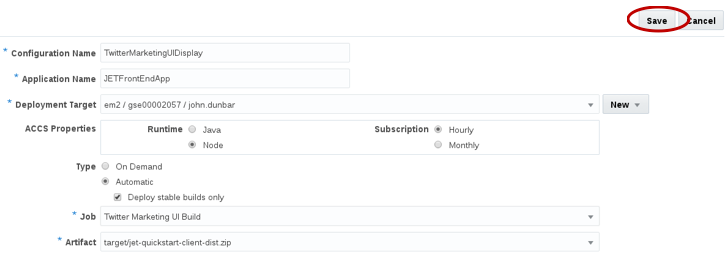  

- Click the gear drop down and select **Start**

      

- Wait until the message **Starting application** changes to **Last deployment succeeded**

      

## Verify default deployment of Twitter Marketing UI

### **STEP 5**: Change status to Verified

Now that we have successfully deployed the build artifact to the Application Container Cloud Service, we will update our agile board to reflect that status. Although the complexity of the next task (verification) is quite simple, we will still move the task to the “Verify Code” column before manually verifying the new functionality.

- Click on **Agile**, followed by clicking **Active Sprints**. Drag and drop **Task 3** from **In Progress** to the **Verify Code** column.

    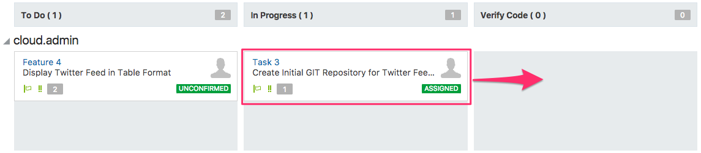  

- In the Change Progress popup, Click on **Next**

    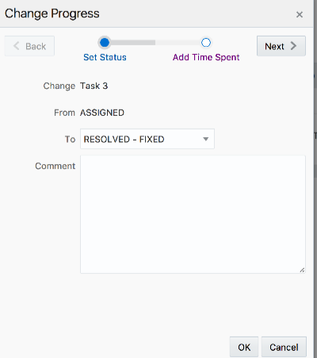  

- Enter `1` in the **Time Spent** field and click on **OK**.

    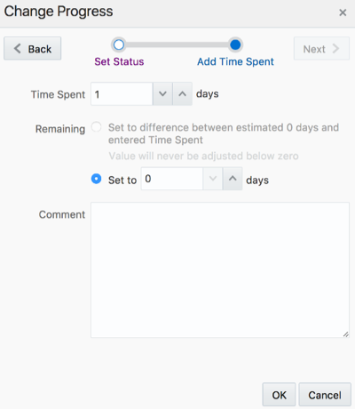  

- The code is now ready for verification before moving to Completed

      

### **STEP 6**: Login to Oracle Application Container Cloud Service

- Navigate back to the Oracle Public Cloud tab. Click **Dashboard** to return back to main Cloud Service Dashboard.

      

- On the Application Container Cloud Service (ACCS) click   and select **Open Service Console**

      

- On the ACCS Service Console you can view all the deployed applications including our newly create **JETFrontEndApp**.

      

- Click on URL or copy and paste the URL into the address bar of a new tab to bring up the application.

      

### **STEP 7**: Complete Task

We have now verified that our application has been deployed and is functional. To finish up this part of the lab we will want to mark the Issue as completed in our Sprint.

- Back in the Developer Cloud Service, click **Agile**, followed by clicking **Active Sprints**.

- Drag and drop **Task 3** from **Verify Code** to **Completed**.

      

- In the Change Progress popup click **Next**.

      

- Change the **Time Spent** to `1` and click on **OK**.

    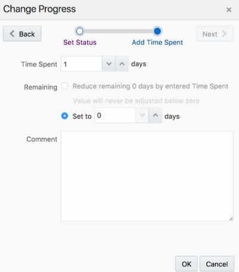  


- Your Sprint should now look like the following:

    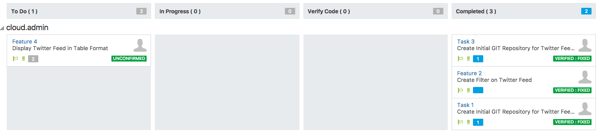  

# Extend default application to Display Twitter Feed

Now that we have our default application we want to extend this application to add the display of the twitter feed. For this task we will use Brackets text editor to pull down the code from Developer Cloud Service and add in our modifications. Once the new code is ready for deployment we will check the code in on a branch so that it can go through a code review prior to build and deployment.

### **STEP 8**: Move Task to In Progress

To start this part of the lab we will want to mark the Issue as In Progress in our Sprint.

- Back in the Developer Cloud Service, click **Agile**, followed by clicking **Active Sprints**.

- Drag and drop **Feature 4** from **To Do** to **In Progress**.

    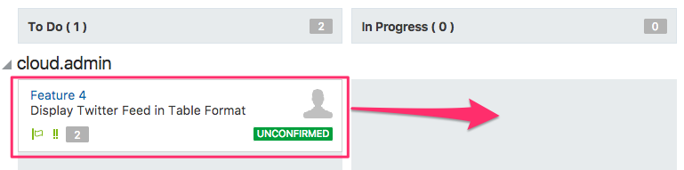  

- In the Change Progress popup click **OK**

      

## Clone Project to Brackets Text Editor

### **STEP 9**:	Start Brackets Text Editor

- Start **Brackets** text editor. How you start Brackets will depend on your OS. We have documented how to start Brackets from our OEL image.

***Note***: If you do not have Brackets installed, please follow the **Student Guide** that is part of this Workshop. You will find instruction on how to install Git and Configure Brackets.

- Right click **Brackets** desktop icon and select **Open**

      

- Brackets should open with the **TwitterMarketingUI** folder already loaded.

      

### **STEP 10**: Copy GIT URL

- Back in Developer Cloud Service, click on **Project**. On right side, select the URL for **TwitterMarketingUIMicroservice.git**. Right click and select **Copy**

      

### **STEP 11**: Clone GIT Repository

- Back in the Brackets editor, Click on  GIT icon found on the right side of the editor.

    

- Click **Clone**

  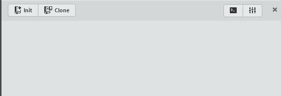  

- Paste in Git URL that you captured from Developer Cloud Service. Username should be populated automatically. Enter your **Password** and click **Save credentials**. Once completed click **OK** to start the cloning process.

      

- While the clone is running a dialog box will show you the progress.

    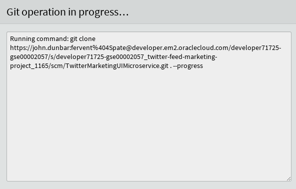  

- You now have a local copy of the repository.

      

### **STEP 12**: Run Live Preview.

- Before we make our code changes lets first run the code locally.

- Expand **doc_root** and select **index.html**

      

- On right hand panel, click  Live Preview. This will start your JavaScript application in a browser. Once you verify the application is working you can close the browser.

  

## Add Code to display Twitter Feed in Table Format

### **STEP 13**:	Modify graphics.html

- Expand **doc_root -> js -> views** and click **graphics.html**.

      

- Replace the existing code with the code block below:

```
<h1>Graphics Content</h1>

<table id="table" summary="Tweet List" data-bind="ojComponent:{component:'ojTable',
        data: tweets,
        columns: [
               {headerText: 'User Name', field: 'User', id: 'name', sortable: 'enabled'},
               {headerText: 'User Location', field: 'Location', id: 'location', sortable: 'enabled'},
               {headerText: 'Source', field: 'Source', id: 'source', sortable: 'enabled'},
               {headerText: 'Tweet', field: 'Text', id: 'text'}
               ],
        rootAttributes: {'style':'width: 100%; height:100%;'},
        scrollPolicy: 'loadMoreOnScroll',
        scrollPolicyOptions: {'fetchSize': 10}}">
</table>
```

  

### **STEP 14**: Modify graphics.js

- Expand **doc_root -> js -> viewModels** and click **graphics.js**.

      

- Add the code block below to the bottom on the **graphics.js** file:

```
/*global $, define, console*/
/*jslint sloppy:true*/

define(['ojs/ojcore', 'knockout', 'ojs/ojtable'], function (oj, ko) {

    function mainContentViewModel() {

        // change this root variable to point to YOUR environment
        var root = 'https://javatwittermicroservice-metcsgse00210.apaas.em2.oraclecloud.com/',
            self = this,
            uri = 'statictweets/',
            prettySource = function (source) {
                return source.substring(source.indexOf('>') + 1, source.lastIndexOf('<'));
            },
            url = root + uri;

        self.items = ko.observableArray([]);
        self.tweets = new oj.ArrayTableDataSource(self.items, {
            idAttribute: 'Id'
        });

        $.ajax({
            url: url,
            method: 'GET'
        }).success(function (result) {
            console.log(result.tweets);
            var items = self.items();
            ko.utils.arrayForEach(result.tweets, function (value) {
                // make sure this is a creation tweet
                if (!!value.user) {
                    items.push({
                        Id: value.id,
                        Location: value.user.location,
                        Text: value.text,
                        Source: prettySource(value.source),
                        User: value.user.name
                    });
                }
            });
            self.items.valueHasMutated();
        });
    }
    return mainContentViewModel;
});
```

- Back in the browser; navigate back to the Application Container Cloud Service service console. Copy URL for **JavaTwitterMicroservice** that was created in Lab 200.

      

- Replace the existing URL with your URL for the **root variable**. ***Make sure*** there is a '`/`' (front slash) at the **end of the URL**.

    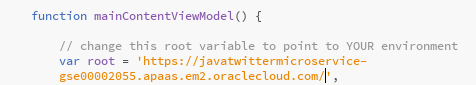  

- Completed graphics should look something like the image below:

      

- Save all files by clicking **File -> Save All**

  

### **STEP 15**: Test new changes

- Click  Live Preview to test out the new changes.

- Click  and select **Graphics**

    

- In the graphics sections you can now see all the twitter feed data:

    

# Create a new Branch and Commit Code

## Create a Branch and Commit Code

### **STEP 16**: Create a new Branch and Commit Code

- First we need to create a new branch to check in all of our changes for this feature. In the left hand navigation panel, select **master** and click **Create new branch**.

    

- In popup window, **enter** `Feature4` for branch name and click **OK**.

    

- Click  Git  icon. Check the box next to **Commit** to select all modified files.

    

- Click **Commit**.

- In popup enter the **comment** `Added code to display twitter feed in table format` and click **OK**. This will commit the changes to your local Git repository.

    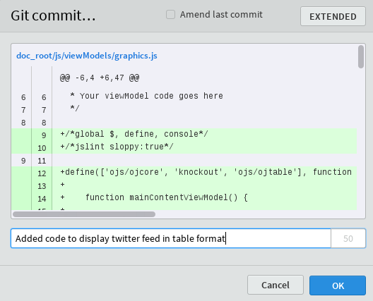

- Click  Git Push icon.

- In popup window leave all defaults and click **OK**

    

- Once Git Push completes click **OK**.

    

### **STEP 17**: Complete the Display Twitter Feed Task

- Back in the Developer Cloud Service window, click **Agile**, followed by clicking **Active Sprints**.  Make Sure you are viewing the **Microservices** board.

- Drag and drop **Feature 4** from **In Progress** to **Verify Code**.

    

- In the Change Progress popup click **Next**.

    

- In the **Time Spent** field enter `1` and click on **OK**.

    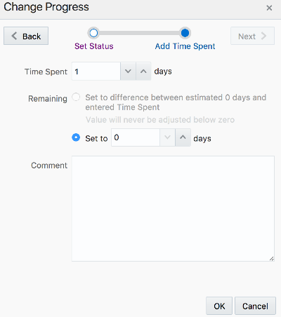

## Create Merge Request

### **STEP 18**: Review Sprint Status and create Merge Request

- Click on the **Code** tab, select the **Feature4** branch and then click on the **Commits** sub tab. Now view the recent commit that we made to branch from Brackets.

    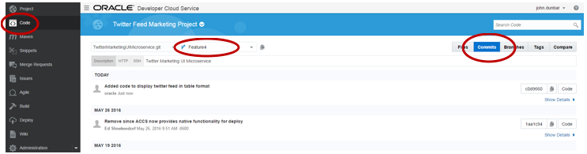

- Now that "John Dunbar" has completed the task of displaying twitter feed in table format, a Merge Request can be created by John and assigned to "Lisa Jones." 

    

- Click on **Merge Requests**, and then click on the **New Merge Request button**.

    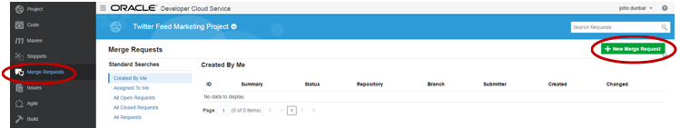

- Enter the following information into the New Merge Request and click **Next**

    **Repository:** `TwitterMarketingUIMicroservice.git`

    **Target Branch:** `master`

    **Review Branch:** `Feature4`

    

- Enter the following information into Details and click **Create**

    **Summary:** `Merge Feature 4 into master`

    **Reviewers:** `<Your Username>`

    

- In the **Write** box, enter the following comment and then click on the **Comment** button to save

    **Comment:** `I added table of Twitter feed to graphics tab`

    

## Merge the Branch as Lisa Jones


### **STEP 19**: Merge Requests

- In the following steps the logical persona “Lisa” will merge the branch created by “John” into the master.

    

- Click on **Merge Requests**. Select the **Assigned to Me** search. After the search completes, click on the **Merge Feature 4 into master** assigned request.

    

- Once the request has loaded, select the **Changed Files tab**. As the persona Lisa, you will now have the opportunity to review the changes in the branch, make comments, request more information, etc. before Approving, Rejecting or Merging the Branch.

    

- Click on the **Merge** button.

    

- Leave the defaults, and click on the **Merge** button in the confirmation dialog.

    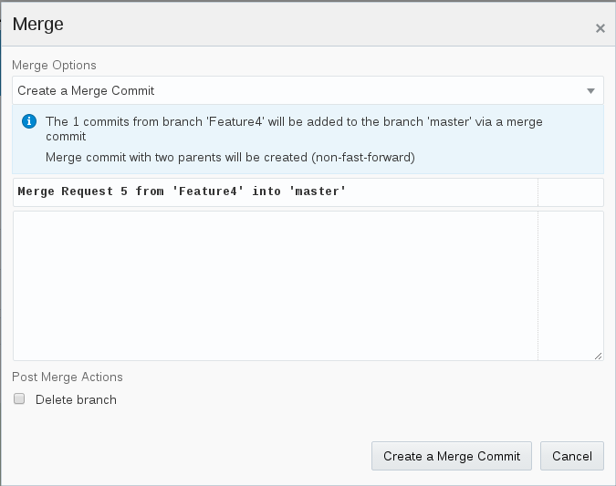

- Now that the code has been committed to the Developer Cloud Service repository, the build and deployment will automatically start. Click on **Build**, and you should see a **Twitter Marketing UI Build** in the Queue

    

- Wait a minute or two for the build to complete. The **Last Success** will be set to **Just Now** when the build completes.

    

- Click on Deploy. Wait for the **Deploy** Status to change to **Deployment update in progress**, and then change to **Last deployment succeeded** – **Just now**.

    

## Test the JETFrontEndAPP UI in the Cloud

### **STEP 20**: Test the Front End

- Once the service has successfully deployed, click on the **JETFrontEndApp** link

    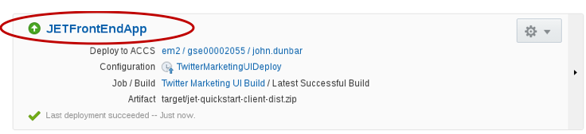

- When the new browser tab loads, click **Graphics** to display twitter feed data.

    

- To complete the Sprint Feature, click on **Agile** in the Twitter Feed Marketing Project Dashboard. Then click on the **Active Sprints** button.

    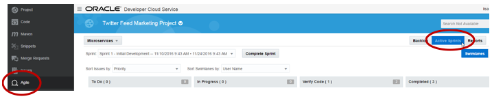

- Complete the feature request by Dragging and Dropping **Feature 4** (Display Twitter Feed in Table Format) from the **Verify** Column to the **Completed** Column.

    

- Set the Status to **VERIFIED – FIXED** and click **Next**.

    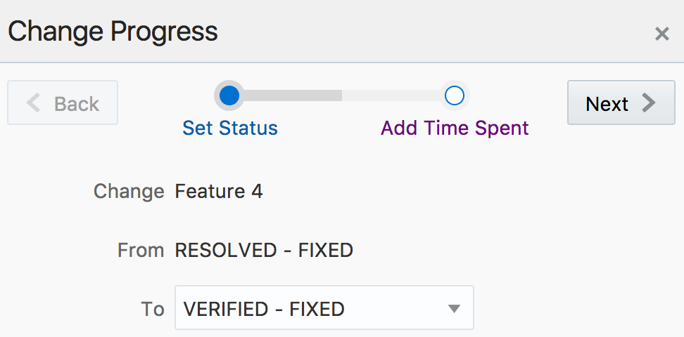

- Enter '`' into the **Time Spent** field and click on **OK**.

    

- You are now ready to move to the next lab.

