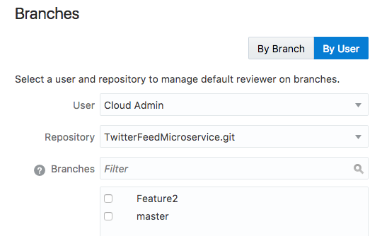

Update: March 31, 2017

## Introduction

このハンズオンラボは**クラウド･ネイティブ･マイクロサービス ハンズオン**の四つ目のラボです。このハンズオンではソフトウェア開発ライフサイクル(Software Development Lifecycle (SDLC))の流れを複数のマイクロサービスを作成・利用するクラウドネイティブプロジェクト通して理解していきます。

このラボ(Lab 400)ではプロジェクト管理者のLisa JonesとしてSprintを完了し、Oracle Developer Cloud Serviceで出力されたAgileレポートの確認を行います。

## Objectives
- Developer Cloud Serviceへアクセス
- Sprintの完了
- バックログ、Sprintレポートの確認
- 管理作業の確認

## 前提条件

- Lab 300が完了していること
- Oracle Public Cloud環境にアクセスが出来ること

# Sprintの完了

## Developer Cloud Serviceへの接続

### **STEP 1**: Agileダッシュボードの表示

- このラボはすでにLab 100,200,300を終了しており、Developer Cloud Serviceダッシュボードの"Twitter Feed Marketing Project"を表示している状態から始めます。ダッシュボードが表示されていない場合、Lab 100 - STEP 3を参考に再度ダッシュボードの表示をしてください。

- Trial登録時に作成したユーザアカウントを使用してハンズオンを進めますが、下記のSTEPは**Lisa Jones**の手順として進めます。

      

- 左側のナビゲーションパネルで**Agile**をクリックします。

    

- **Reports**をクリックして、**Burndown Chart** を確認します。

    

- **Sprint Report** をクリックします。

### **STEP 2**: Sprintの完了

- **Active Sprints**をクリックして、**Complete Sprint** をクリックします。

- ポップアップが表示されるので、**Complete Sprint** をクリックします。

##Sprint Reportの出力

### **STEP 3**: Sprint Reportの出力

- **Reports** ページに戻ります。

    

- Burndown Reportでストーリーポイントの消費傾向を確認します。Note: 通常のSprintの場合は数日間かけてSprintを行なうので、Burndown Reportには日毎の消費ポイントが表示されます。

    

- **Sprint Report**をクリックします。今回のハンズオンでは１日でSprintが完了しているため、**Sprint Report** タブのグラフは下記のような表示となっていますが、数日間かけてSprintを行った場合、Sprint完了に向けて段階的に数値が減って行きます。緑の点線はSprintの開始を示していて、赤い線はその時点での残ストーリーポイントを示しています。

    

# プロジェクト管理機能

## プロジェクト管理機能の確認

### **STEP 4**: プロジェクト管理機能の確認

- 左側のナビゲーションパネルで**Administration**をクリックすると、管理機能の一覧がプルダウンで表示されます。その中から**Properties icon**をクリックします。

    

- このパネルではプロジェクトのデフォルト設定を確認・変更出来ます。またプロジェクトの削除もこのパネルから行なうことが出来ます。

    

- 左側のナビゲーションパネルで**Administration**をクリックして、プルダウンから**Usage Metrics**をクリックします。

    

- このパネルではGitとMaven、Hudson、TaskとWikiで使用可能なストレージの領域を確認出来ます。

    

- 左側のナビゲーションパネルで**Administration**をクリックして、プルダウンから**Issues Tracking**をクリックすると下記のようなパネルが表示されます。

    

- 左側のナビゲーションパネルで**Administration**をクリックして、プルダウンから**Repositories**をクリックすると下記のようなパネルが表示されます。

    

- 左側のナビゲーションパネルで**Administration**をクリックして、プルダウンから**Branches**をクリックすると下記のようなパネルが表示されます。このパネルではユーザに紐付けられたBranchの確認を行なうことが出来ます。

    

- これでクラウド・ネイティブ・マイクロサービス ハンズオンは完了です。
