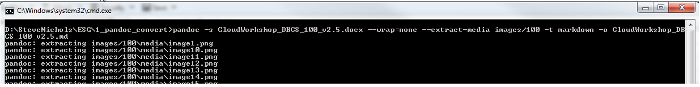
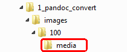
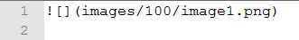
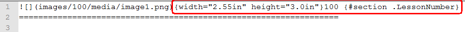
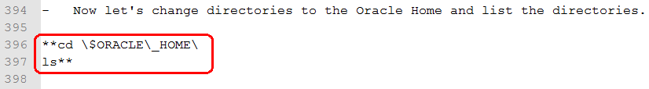
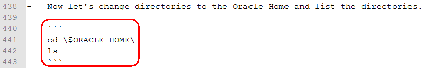
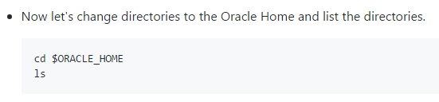
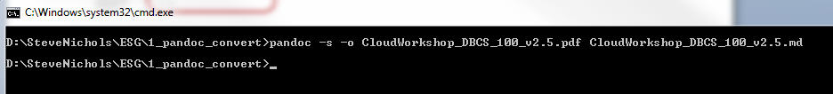
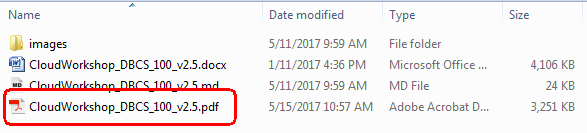

#  Microsoft Word Conversion to Markdown using Pandoc

This document steps through the process required to convert a **Microsoft Word** document to the **Markdown** format using the **Pandoc** utility.

##  Documentation

-  Pandoc Documentation:  <http://pandoc.org/MANUAL.html>

-  Markdown Documentation:  <https://github.com/adam-p/markdown-here/wiki/Markdown-Cheatsheet>

-  Visual Studio Code:  <https://code.visualstudio.com/download>

##  Word to Markdown Conversion

### **STEP 1** Issue the Pandoc Command

-  Open a command prompt and issue the pandoc command

	```
	pandoc -s CloudWorkshop_DBCS_100_v2.5.docx --wrap=none --extract-media images/100 -t markdown -o CloudWorkshop_DBCS_100_v2.5.md 
	```

	

### **STEP 2** Review the Pandoc Output

The above **pandoc** command produces the following output, an **images** directory and a **Markdown Document**


##  Post Markdown Conversion

The **Markdown** output file produced by **Pandoc** is not perfect and typically requires the following modifications. You can now use your **Markdown** editor of choice to clean-up the **Markdown** file. **Notepad++** works well for mass find and replace operations , however, there are more advanced **Markdown** editors such as **Visual Studio Code** available.

### **STEP 3**  Cleanup images directory

The **images** directory contains an extra level, **media**, we do not use. Move all the image files under the desired directory, in this example, **100**, and then delete the **media** directory



### **STEP 4** Cleanup Markdown Document

-  Update the image tags to remove the **media** folder name

	Original **image** tag

	

	Updated **image** tag

	

-  Remove the **width** and **height** metadata from each image tag along with any **section** tags

	

-  Create and Cleanup the code blocks

	**Note**:  **Code blocks** do NOT recognize **bold** or **escape** characters, they are treated as literals

	This is the initial **Markdown** output

	

	This is the modified **Markdown** which includes the **code block** and **bold** and **escape** characters removed

	

	This is how it will look in **github**.

	

#  Markdown Conversion to PDF using Pandoc

There may be a requirement to create a **PDF** from a **Markdown** document.

```
pandoc -s -o CloudWorkshop_DBCS_100_v2.5.pdf CloudWorkshop_DBCS_100_v2.5.md
```





**Note**: You may need to install **MiKTeX** (Basic Installer) from <https://miktex.org/download>
