---
# ORACLE Cloud-Native DevOps workshop #
-----
## Deploy SpringBoot demo application to Application Container Cloud Services using Developer Cloud Services ##

### About this tutorial ###
**Oracle Application Container Cloud Service** includes Oracle Java SE Cloud Service and Oracle Node Cloud Service. It provides a lightweight infrastructure so that you can run Java SE 7, Java SE 8, and Node.js applications in the Oracle Cloud.

**Oracle Developer Cloud Service** is a cloud-based software development Platform as a Service (PaaS) and a hosted environment for your application development infrastructure. It provides an open-source standards-based solution to manage the application development life cycle effectively through integration with Hudson, Git, Maven, issues, and wikis. Using Oracle Developer Cloud Service, you can commit your application source code to the Git repository on the Oracle Cloud, track assigned issues and defects online, share information using wiki pages, peer review the source code, and monitor project builds. After successful testing, you can deploy the project to Oracle Java Cloud Service - SaaS Extension, publicly available Oracle Java Cloud Service instances, Oracle Application Container Cloud Service instances, or to an on-premise production environment.

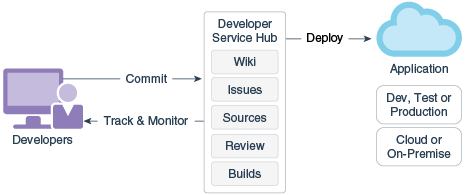

The key features of Oracle Developer Cloud Service include:

Project creation, configuration, and user management

+ Version control and source code management with Git
+ Storage of application dependencies and libraries with Maven
+ Continuous build integration with Hudson
+ Wiki for document collaboration
+ Issue tracking system to track tasks, defects, and features
+ Repository branch merge after code review
+ Deployment to Oracle Java Cloud Service - SaaS Extension, Oracle Java Cloud Service, and Oracle Application Container Cloud Service

Oracle Developer Cloud Service is available as a web interface accessible from a web browser and from Integrated Development Environments (IDEs) such as Oracle Enterprise Pack for Eclipse (OEPE), Oracle JDeveloper, and NetBeans IDE.

This tutorial shows how to deploy Spring Boot sample application to Application Container Cloud Services using Oracle Developer Cloud Services.

The Spring Boot sample application is a web application serving simple JSP pages.

This tutorial demonstrates how to:

- create Oracle Developer Cloud Service project using existing external Git repository
- configure build job for sample application
- configure Application Container Cloud Service deployment in Developer Cloud Service
- build and deploy sample application using Developer Cloud Service

### Prerequisites ###

- Oracle Public Cloud Service account including Developer Cloud Service

----

#### Create Oracle Developer Cloud Service project ####

Sign in to [https://cloud.oracle.com/sign-in](https://cloud.oracle.com/sign-in). First select your datacenter then provide the identity domain and credentials. After a successful login you will see your Dashboard. Find the Developer services tile and click the hamburger icon. In the dropdown menu click **Open Service Console**.
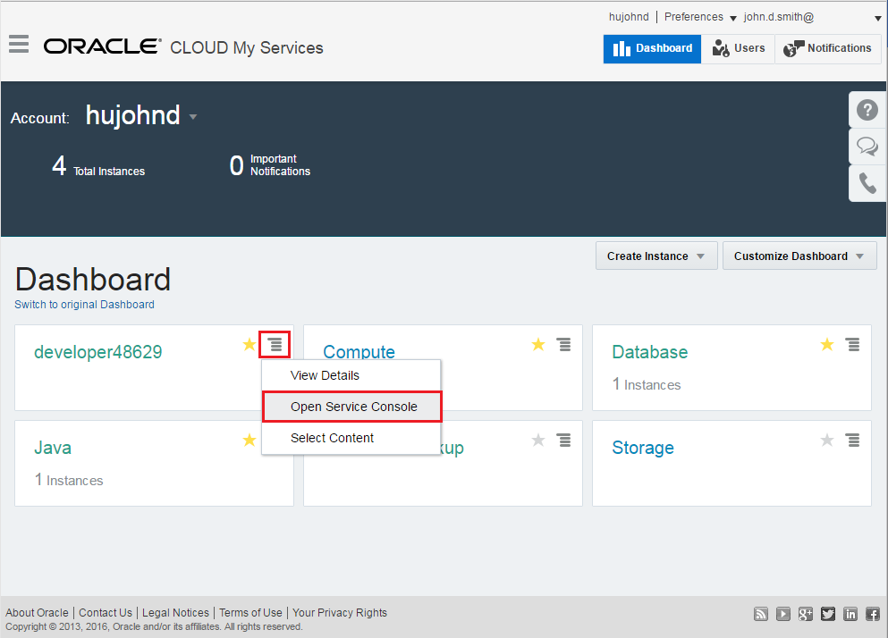

Log in to Oracle Developer Cloud Services and create a new project.

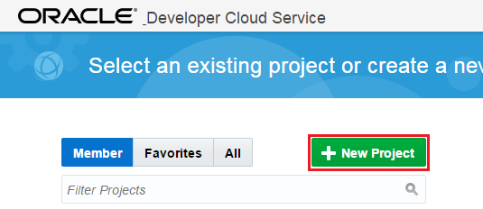

Enter the name of the project and set the desired properties. Click **Next** and select *Initial Repository* as template.

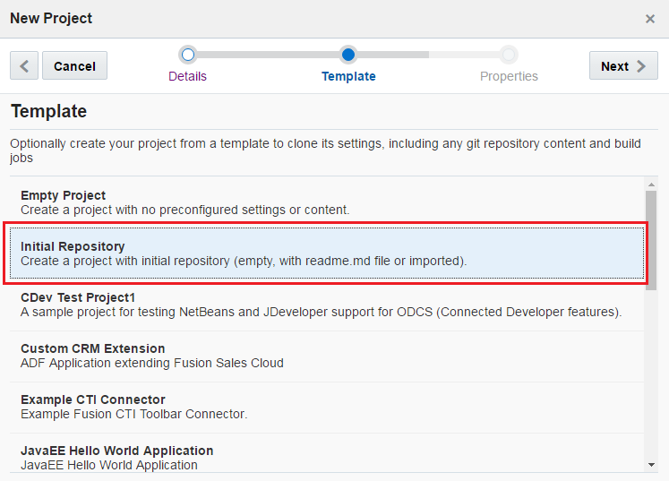

Click **Next** and on the Properties page select *Import existing repository*.
Enter or copy the *https://github.com/oracle/cloud-native-devops-workshop.git* repository address.

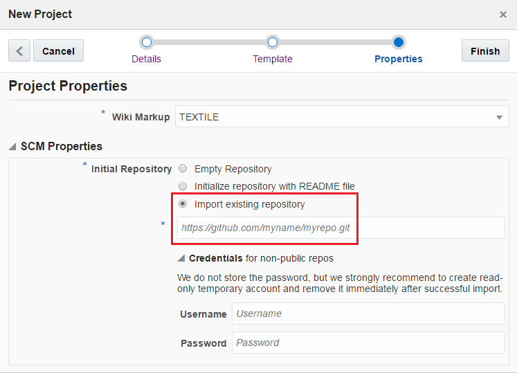

Now click **Finish** to create the project and to clone the specified repository.

### Configure build job for Spring Boot sample application ###

Once the project provisioning is ready let's create the build job to compile and package the sample Spring Boot application to the desired format for Application Container Cloud Services.

Select **Build** item on the left side menu and click the **New Job** button.

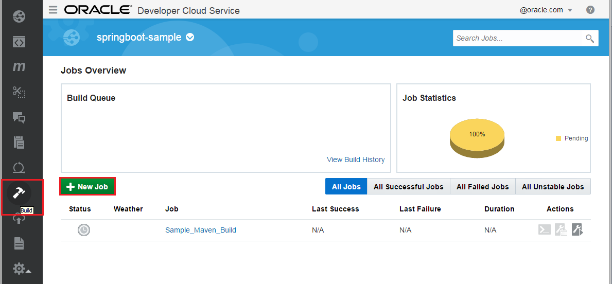

Enter a name for the new job. Select the *Create a free-style job* option and save.
On the Main configuration page of the newly created job make sure **JDK 8** is the selected JDK.

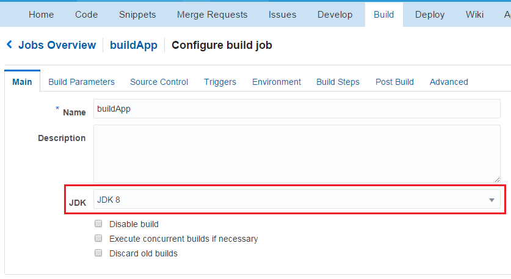

Change to the **Source Control** tab and select **Git**. In the git's properties section select the only one available Git repository which is provided in the list. Leave the advanced settings default.

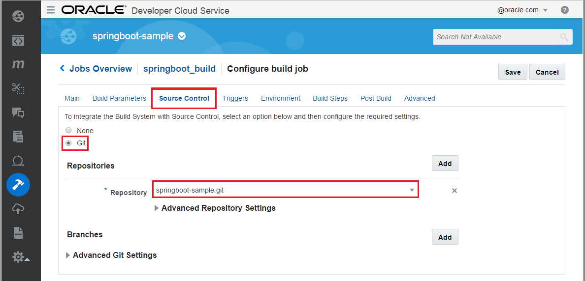

Click **Triggers** tab to configure *SCM polling*. Select **Based on SCM polling schedule**. This ensures if any files in the source code repository has changed then the build will be fired.

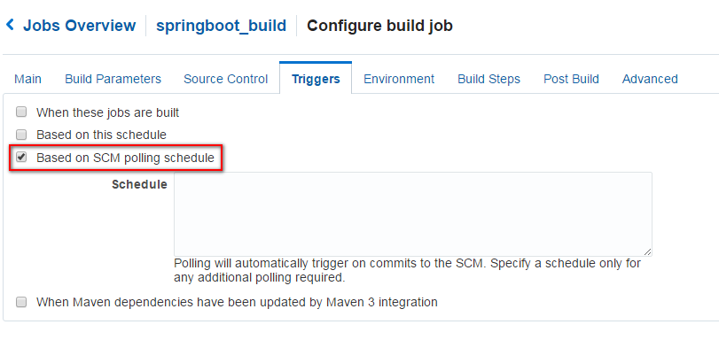

Change to **Build Steps** tab and add **Maven 3** build step. Enter **clean install** as Goals and **springboot-sample/pom.xml** to POM File field. (In case if Build Steps tab just shows **Loading...** for a long time, save the Build configuration then re-open and continue.)

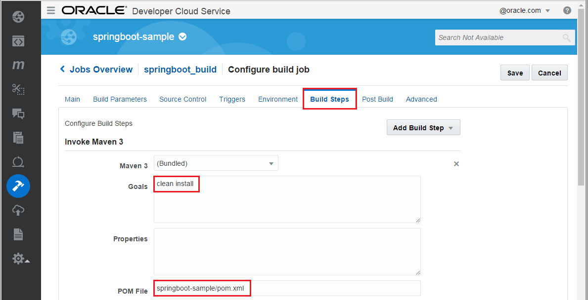

Finally change to Post Build tab and check in the **Archive the artifacts** option. Enter **springboot-sample/target/\*.zip** into **Files To Archive** field.

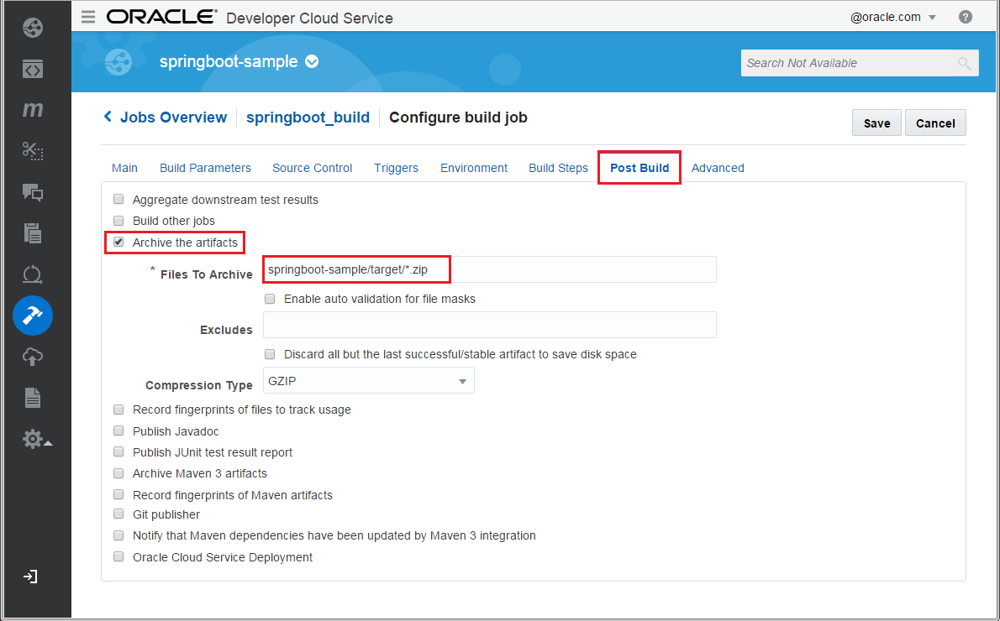

Click on **Save** to update the new job configurations. To check the build job click on **Build Now** on the job's detail page. Once the job is done check the archived artifacts. It should be the following: `springbootdemo-0.0.1.zip`

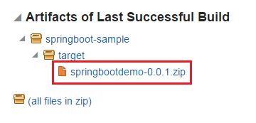

Please note the build job contains an extra build step which packs the default artifact `springbootdemo-0.0.1.war` and `manifest.json` (ACCS descriptor from the *springboot-sample/src/resources* folder) into a zip archive. This archive is the desired format to deploy a Java application to ACCS.

### Configure Application Container Cloud service deployment ###

Now create deployment configuration which enable direct deployment to Application Container Cloud services after a successful build job.
Change to **Deploy** page in DevCS and create **New Configuration** 

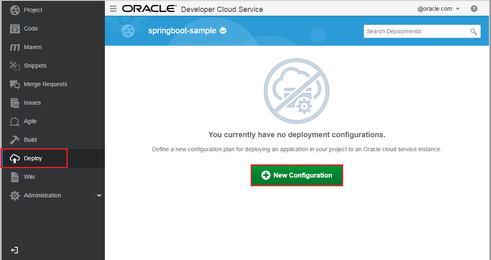

Set the following properties.
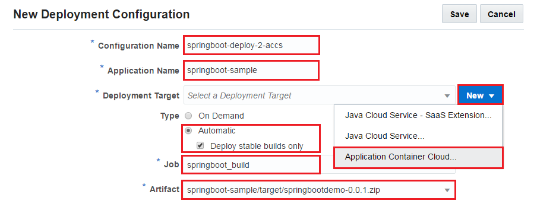

- **Configuration Name**: any name to identify deployment configuration
- **Application Name**: instance name in ACCS. This will determine the application's URL.
- **Deployment Target**: click **New** and select Application Container Cloud... and define connection properties such as **Data center**, **Identity Domain** and **credentials**. 

- **Type**: select **Automatic** which means auto deploy after a successful execution of the build job. Select your previously created job and its artifact to deploy.

Click **Save**. 

### Build and deploy the sample application ###

To initiate a deployment to Application Container Cloud Service now there are two options. You can Start deployment process using the newly created Deployment configuration. Click gear icon and select **Start**.

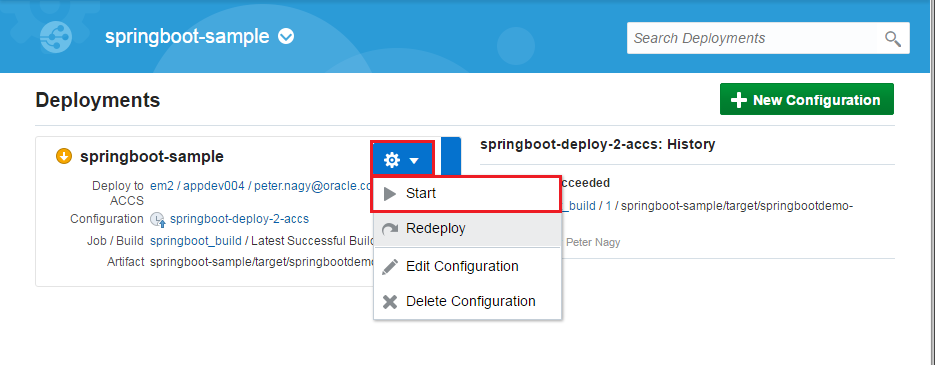

Other option is to fire a new Build Job execution which will deploy artifact after a successfull build. Go back to **Build** page and click the wrench icon belongs to Spring Boot sample application build job.

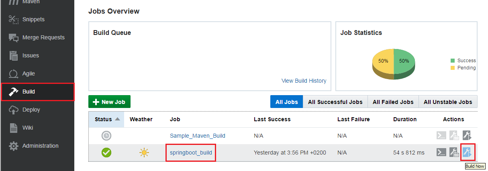 

Both way deploys Spring Boot sample application on Application Container Cloud Service. You can check the deployment result on the **Deploy** page. Once the deploy is ready (this may take a while) click the **Deploy to ACCS** link.

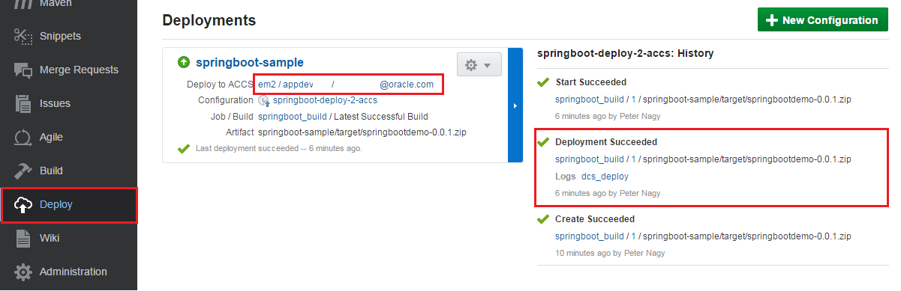

This opens the Application Container Cloud Services console. You should see your Spring Boot sample application in the list. Click the application's URL to test.

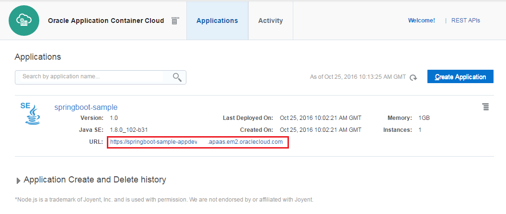

The Spring Boot sample application main page should look like this.

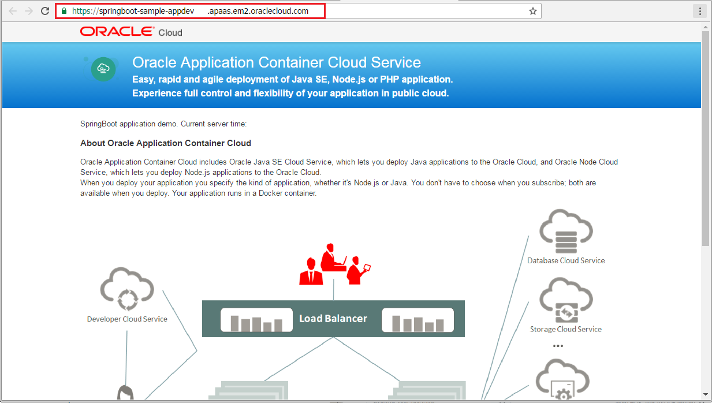

There are many other option to trigger this deploy process. For example build can be triggered by source changes or can be scheduled to specific time of the day.

### + Optional step: Make changes in the application ###

Prerequisites: Git client, Text editor

Clone your newly created Git repository hosted on Developer Cloud Service to your local machine using basic or your favourite Git tool. Make small changes for example in the JSP file. Push changes to DevCS remote repository, execute Build again and check the changes on the redeployed application.

