---
# ORACLE Cloud-Native DevOps workshop #

## Build Spring Boot container packaged application using Wercker and deploy to Oracle Application Container Cloud Service ##

### About this tutorial ###
**Wercker** is a Docker-Native CI/CD  Automation platform for Kubernetes & Microservice Deployments. Wercker is integrated with Docker containers, which package up application code and can be easily moved from server to server. Each build artifact can be a Docker container. The user can take the container from the Docker Hub or his private registry and build the code before shipping it. Its SaaS platform enables developers to test and deploy code often. They can push software updates incrementally as they are ready, rather than in bundled dumps. It makes it easier for coders to practice continuous integration, a software engineering practice in which each change a developer makes to the codebase is constantly tested in the process so that software doesn’t break when it goes live.

Wercker is based on the concept of pipelines, which are automated workflows. Pipelines take pieces of code and automatically execute a series of steps upon that code. The Wercker API provides programmatic access to information about applications, builds and deploys. There are code snippets available for Golang, Node.js and Python.

**Oracle Application Container Cloud** Service includes Oracle Java SE Cloud Service and Oracle Node Cloud Service. It provides a lightweight infrastructure so that you can run Java SE, PHP, and Node.js applications in the Oracle Cloud.

**Architecture**
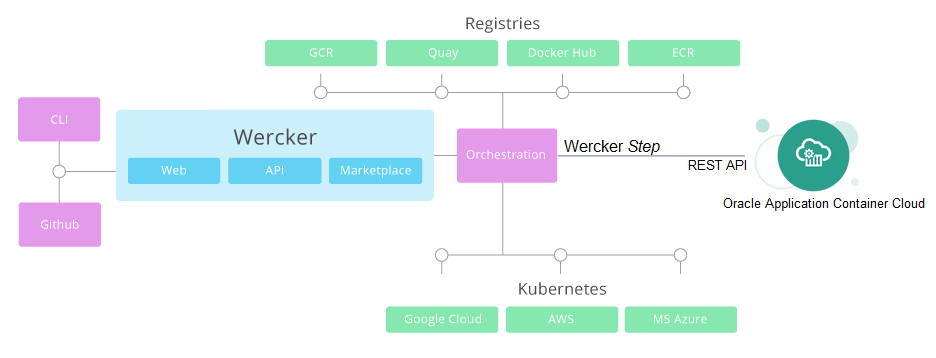

The key components of Wercker:

+ **Step** is self-contained bash script or compiled binary for accomplishing specific automation tasks.
+ **Pipelines** are a series of steps that are triggered on a git push or the completion of another pipeline.
+ **Workflows** are a set of chained and branched pipelines that allow you to form multi-stage, multi-branch complex CI/CD flows that take your project from code to production. 
+ All Wercker pipelines execute inside a **Docker container** and every build artefact can be a Docker container.
+ With Wercker you can **push your images to any container registry** public or private such as Docker.

This tutorial demonstrates how to:

- create Wercker application (CI/CD) to build Spring Boot sample application 
- deploy Spring Boot sample application to Oracle Application Container Cloud using custom Wercker Step available in repository

### Prerequisites ###

- [Github](https://github.com) account
- [Oracle Public Cloud Service](https://cloud.oracle.com) account including Application Container Cloud Service

----

#### Import Spring Boot sample sources into your github repository ####

Sign in to [https://github.com](https://github.com) using your account and select **Import repository**. In case you don't have Github account please [sign up](https://github.com/join?source=header-home).

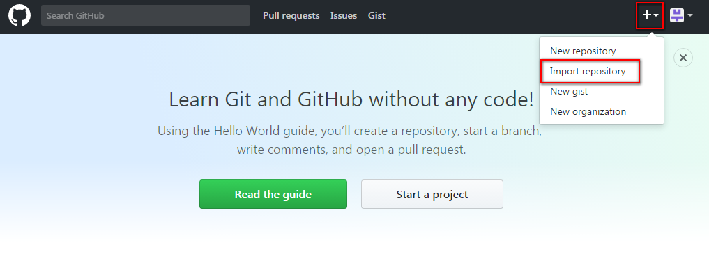

Enter or copy the *https://github.com/nagypeter/wercker-springboot.git* repository address into old repository's clone URL and use the same repository name for the new one. It will not conflict because the new repository will be available under your account. Leave the repository public. Click **Begin Import** and wait till the import is ready.

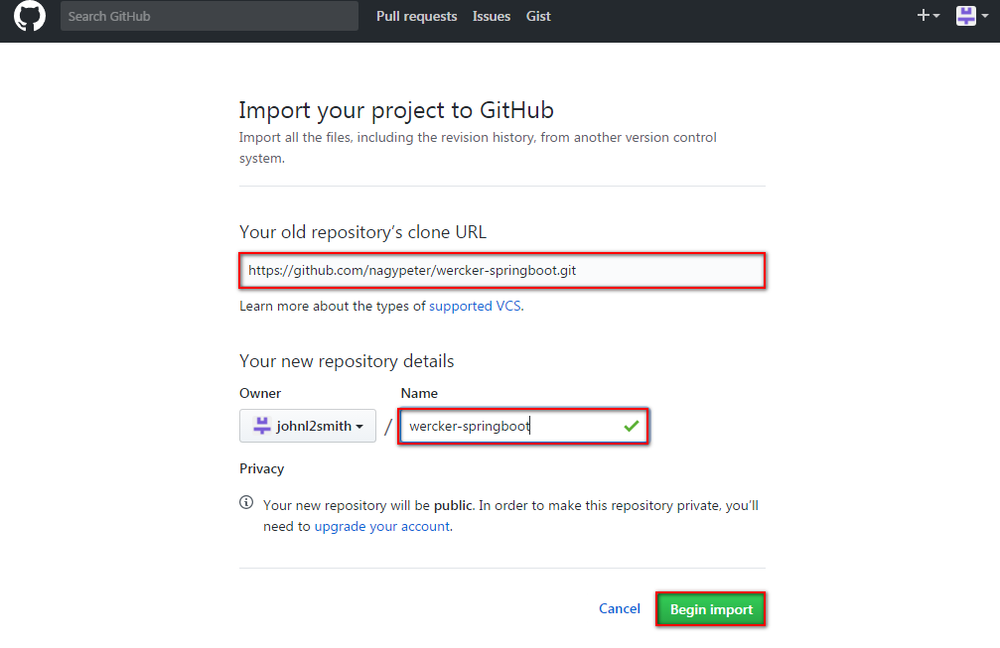

#### Sign up to Wercker using your Github account ####

When the import is done go to [https://app.wercker.com](https://app.wercker.com) and sign up using your github account. Click the **LOG IN WITH GITHUB** button.

If you use the same browser where you are already signed in to github then it will go directly to *Authorize application* github page. If not then enter your github's credentials to sign in to github. Click the **Authorize application** button to accept Wercker's request. You can revoke Wercker's authorization request anytime using your github's profile settings.

After the successfull authorization you will be redirected to *https://app.wercker.com*.

#### Create Wercker Application to build Docker container including Spring Boot sample application ####

Now here is the time to create your Wercker application. Wercker acts as continuous integration tool which will produce and push a complete Docker container including your Spring Boot sample application.

Go back to the Wercker's welcome page and click **Create your first application** button or the **+Create** dropdown list and select *Application*.

First select the repository you want to use as sources. By default it will show your Github provider and the available repositories. Select *wercker-springboot* and click **Use selected repo**.

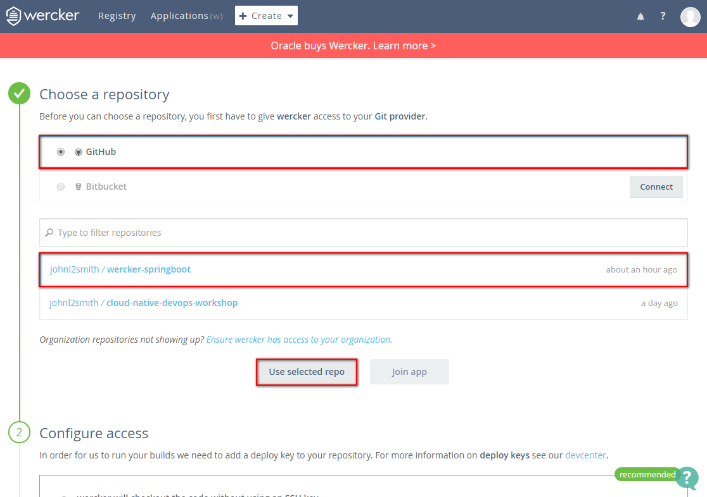

In case of private repositories you should define the access method. Since the the sample repository created as public you can leave the default checkout method. Click **Next step**.

Finally you can choose whether your application is public or not. We recommend to leave default which means the application will be private. Click **Finish** to create your application.

The next page offers to generate specific wercker.yml based on the application's language. This sample application already has one so click the **trigger a build now** link.

Now the default *build* pipeline starts to run which is a simple maven build -defined in *wercker.yml*- of the Spring Boot sample application. The result should be successfull. You can open each step (on the right side) to get more details.

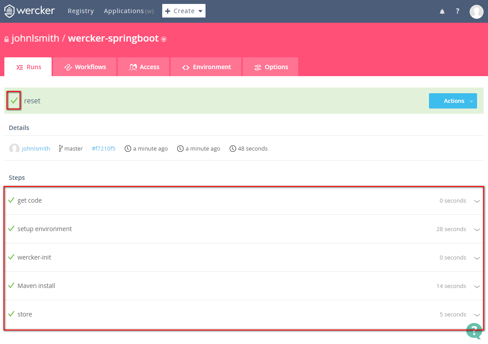

Before you move forward please inspect the *wercker.yml*. The source is available under your github repository. Open a new browser (tab) and go directly to *https://github.com/<YOUR_GITHUB_USERNAME>/wercker-springboot/blob/master/wercker.yml*. Now focus on the following part of the configuration and ignore the Docker push step in this use case:

	box: combient/java-mvn
	build:
	  steps:
	    # Build Spring Boot Sample application
	    - script:
	        name: Maven install
	        code: mvn install
	deploy-accs:
	  steps:
	    # Deploy to Oracle Application Container Cloud
	    - peternagy/oracle-accs-deploy@1.0.1:
	        opc_user: $OPC_USERNAME
	        opc_password: $OPC_PASSWORD
	        rest_url: $REST_URL
	        domain: $IDENTITY_DOMAIN
	        application_name: springboot-accs-demo
	        application_type: java
	        file: springbootdemo-0.0.1.zip

The *wercker.yml* defines the configuration of your automation pipelines with a collection of Steps that you wish to execute.
In your *wercker.yml* you can specify any pipeline you like. There is one special pipeline called dev which will only be executed when running it with the CLI using the wercker dev command. Examples of pipeline names: *build-base-container*, *build*, *push-to-registry*.

A pipeline can have its own base box, like in this example the *combient/java-mvn* Docker container. You can use different base boxes per pipeline.

Each pipeline can also specify its own Services. For example, a testing Pipeline may require access to a database server, whereas a deploy pipeline probably wouldn't. This sample has no service.

As you can see in this configuration we have the default pipeline *build* which executes the maven build and a *deploy-accs* pipeline which is not a reserved pipeline. You will create *deploy-accs* pipeline in the next step. This is why you couldn't see the Application Container Cloud deployment in the first build.

The *deploy-accs* pipeline will use a custom step [`peternagy/oracle-accs-deploy`](https://github.com/nagypeter/wercker-oracle-accs-deploy) what was built and published by other Wercker user and [available in Wercker's Step repository](https://app.wercker.com/applications/58f746a7a81610010011ef53/tab/details).

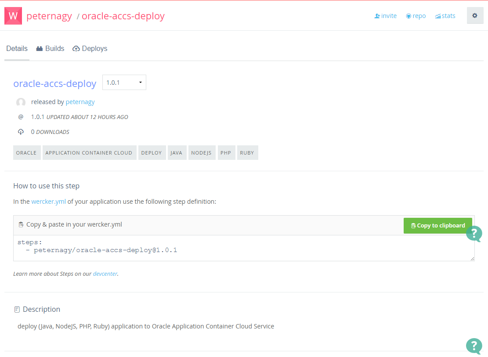

Please also note the environment variables usage. After the *deploy-accs* pipeline you will create these variables and set the values.

---
#### Wercker Steps ####

Steps are self-contained bash scripts or compiled binaries for accomplishing specific automation tasks, defined in the wercker.yml file of your application. Steps can be written manually or borrowed from the community via the Steps Registry.

**Internal steps** are developed by wercker and are baked into the wercker cli as these interact with the Docker API that is external from the container.

The **script step** allows you to execute a single or more shell commands. It has one required property: code and (as always) you can use the name property to give the step a clear name.

If you cannot find a step which solves your particular “problem” in the Steps Registry, then you can create your own step and publish it. Steps are similar to any other projects on Wercker but instead of deploying to a cloud provider, you deploy to the step registry in order to make the step available.

To be able to publish a step, you first need a Wercker application containing the following files:

+ The project needs to include a `run.sh` file which is the entry-point of your step.
+ The project needs to include a step manifest file call `wercker-step.yml`.

This demo will use [`peternagy/oracle-accs-deploy`](https://github.com/nagypeter/wercker-oracle-accs-deploy) step. Open and inspect the

+ [`wercker-step.yml`](https://github.com/nagypeter/wercker-oracle-accs-deploy/blob/master/wercker-step.yml) step manifest file which defines the step properties.
+ and [`run.sh`](https://github.com/nagypeter/wercker-oracle-accs-deploy/blob/master/wercker-step.yml) entry-point which does the deployment to application container cloud via REST API using `curl`.

---

Now switch to **Workflows** tab.

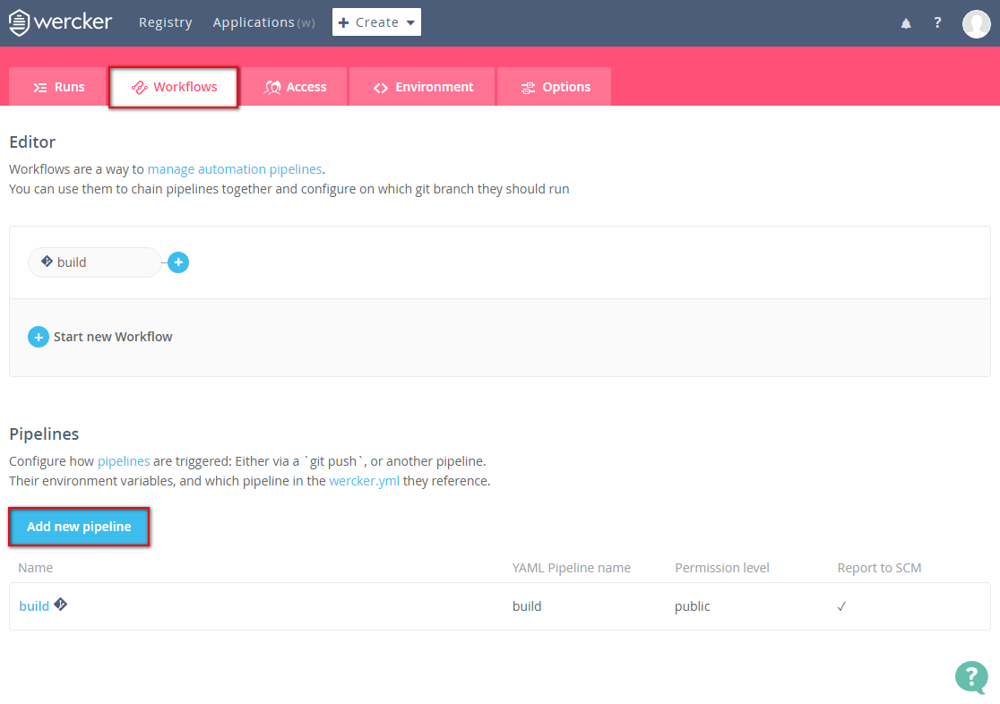

As mentioned upon creating a project in Wercker, it creates a *build* Workflow with a Git hook which executes a build pipeline. This means whenever you push changes into your github repository then a new build will be triggered. Now add a new pipeline what will do the Docker container image push to your Docker registry. Click *Add new pipeline*.

+ **Name**: *deploy-oracle-accs* (but basically it can be anything else)
+ **YML Pipeline name**: it has to be *deploy-accs*, because we already defined this pipeline in  the *wercker.yml*.
+ **Hook type**: leave default to ignore Git push. You will add this pipeline after build what has already this configuration.

Finally click **Create**.

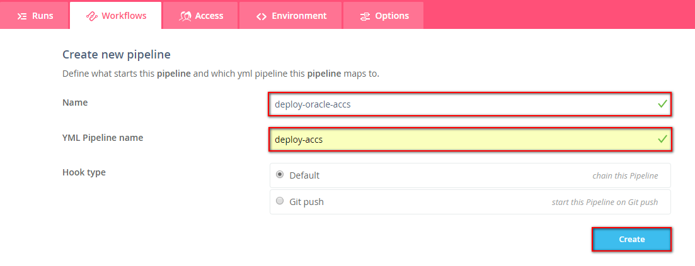

On the detail page of the new *deploy-oracle-accs* pipeline you can immediately add the required environment variables.

+ **OPC\_USERNAME** = user name for your Oracle Application Container Cloud account.
+ **OPC\_PASSWORD** = password for your Oracle Application Container Cloud account.
+ **REST\_URL** = at the time of this tutorial published it is: `https://apaas.europe.oraclecloud.com/paas/service/apaas/api/v1.1/apps` Please replace region part (europe|us|etc.) respectively. The easiest way is to locate Oracle Application Container Cloud in the My Services console, click *Details*, and look at the REST Endpoint value.
+ **IDENTITY\_DOMAIN** = Name of the identity domain for the Oracle Application Container Cloud Service account.

When you need to add new variable click **Add** button which saves the current row and add a new one. You can use the **Protected** tick box to store safely your value e.g. password.

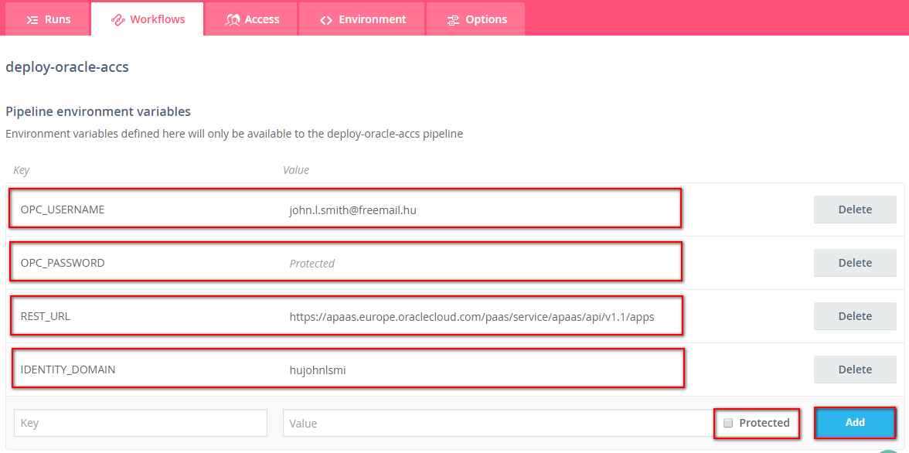

To go back workflow editor click **Workflows** tab again and start to edit your workflow. Click the blue plus icon after the *build* pipeline to add the previosly created *deploy-oracle-accs* pipeline. Leave the default * for branches and select the *deploy-oracle-accs* pipeline from the **Execute pipeline** dropdown list. Click **Add**.

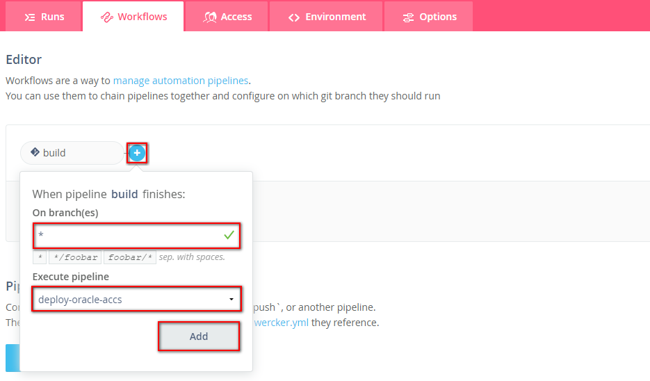

To trigger do some modification on one of the source file in your github repository. Go to the browser (tab) where github.com is opened or open it now. Modify for example the *https://github.com/<YOUR\_GITHUB\_USERNAME>/wercker-springboot/blob/master/src/main/webapp/WEB-INF/views/welcome.jsp* JSP file. Click Edit icon.

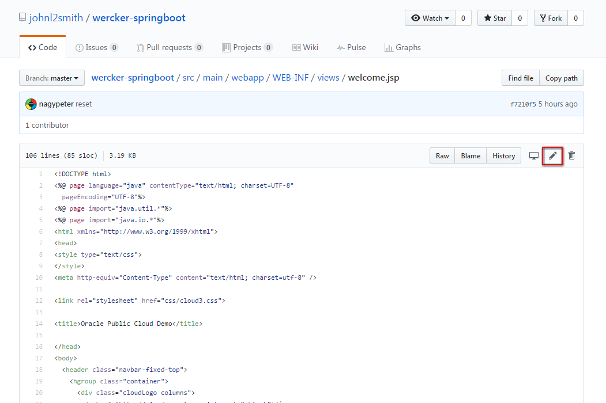

Modify the following part:

	 SpringBoot application demo. Current server time: <%= new java.util.Date() %>  

Include your name for example:

	 SpringBoot application demo by JOHN SMITH. Current server time: <%= new java.util.Date() %>  

Enter a commit message and click **Commit changes** button.

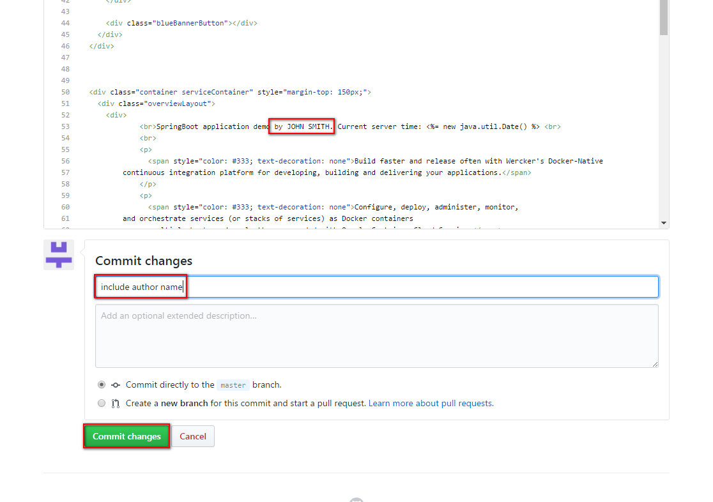

It triggers the Wercker build so when you go back to the browser where Wercker is opened you should see the following:

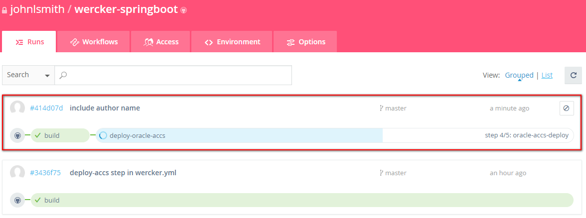

When the *build* and *deploy-oracle-accs* pipelines are done go back to the browser (tab) where you logged in to 
#### Test Spring Boot sample application deployed on Oracle Application Container Cloud Service ####

When the *build* and *deploy-oracle-accs* pipelines are done open a new browser (tab) and sign in again to [https://cloud.oracle.com/sign-in](https://cloud.oracle.com/sign-in). Select your datacenter then provide the identity domain and credentials. After a successful login you will see your Dashboard. Find the *Application Container* tile and click the hamburger icon. In the dropdown menu click **Open Service Console**. If you can not see such tile click **Customize Dashboard** and find *Application Container* in the list and change to Show the switch.

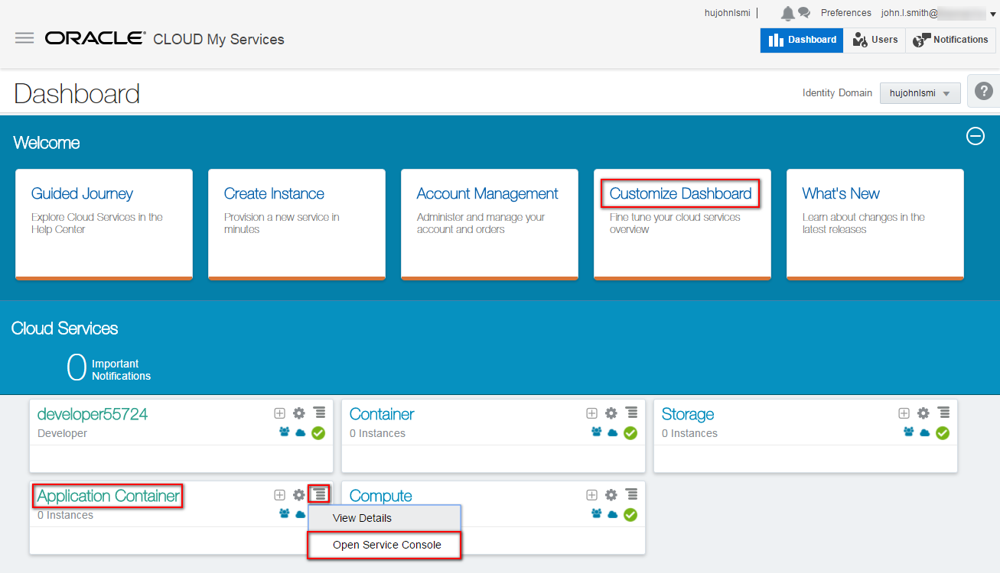

On the Application Container Cloud console you have to see a new application called *springboot-accs-demo*. Once the deployment is complete (no sand glass and the URL is enabled) click on the URL link to open the Spring Boot sample application.

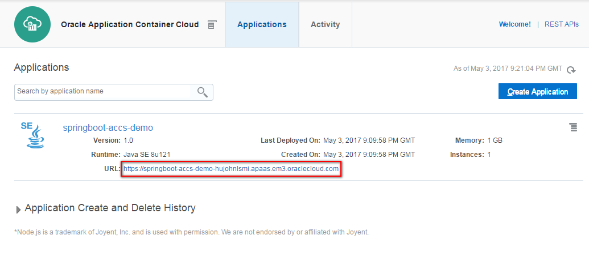

The application opens a new browser (tab) and you have to get the following webpage: 

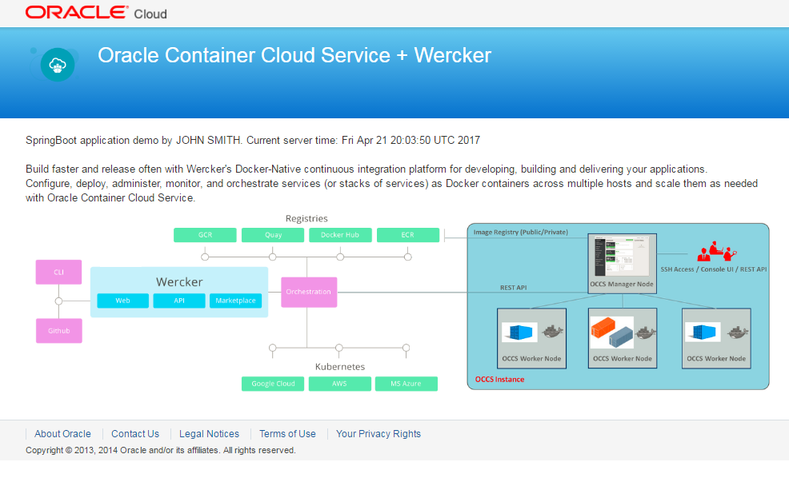

Please note your name what you inserted on *welcome.jsp* page.

Optionally modify other text on the page and push changes to build new container. Once the Wercker workflow completed you need to see the changes on your application.
