---
# ORACLE Cloud-Native DevOps workshop #

## Use Wercker step to restart Oracle Container Cloud Service in Wercker Continuous Delivery workflow ##

### About this tutorial ###
**Wercker** provides a Docker-Native CI/CD  Automation platform for Kubernetes & Microservice Deployments. Wercker is integrated with Docker containers, which package up application code and can be easily moved from server to server. In case when Wercker packaged container deployed to Oracle Container Cloud Service would be useful to restart a container whenever new version of application/Docker container available.

Currently this feature is available using publicly available Wercker Step ([https://app.wercker.com/applications/5924200572be0b01001b83aa/tab/details/)) which allows to restart the container using the specified Docker image.

To enable this step define the [oracle-occs-container-util](https://app.wercker.com/applications/5924200572be0b01001b83aa/tab/details/) step in the `wercker.yml` and the application workflow. For further details read the step or follow this tutorial. 

**Architecture**
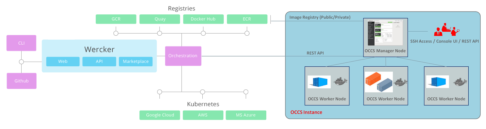

The publicly available [oracle-occs-container-util](https://app.wercker.com/applications/5924200572be0b01001b83aa/tab/details/) step use the Oracle Container Cloud Service's REST API to manage the container.

This tutorial demonstrates how to:

- define and configure [oracle-occs-container-util](https://app.wercker.com/applications/5924200572be0b01001b83aa/tab/details/) step

### Prerequisites ###

- [Build Spring Boot container packaged application using Wercker and deploy to Oracle Container Cloud Service](https://github.com/oracle/cloud-native-devops-workshop/blob/master/springboot-sample/create.wercker.ci.md)

----

#### Get Oracle Container Cloud Service's REST API URL ####

To determine the necessary URL (IP address) find your browser (tab) where you created Container Cloud Service at the beginning of this lab. If you hit the timeout or lost the browser (tab) then sign in again to [https://cloud.oracle.com/sign-in](https://cloud.oracle.com/sign-in). Select your datacenter then provide the identity domain and credentials. After a successful login you will see your Dashboard. Find the Container tile and click the hamburger icon. In the dropdown menu click **Open Service Console**.

Now you have to see your *testOCCS* (or different if you specified other name) Container Cloud Service instance ready. Click on the hamburger icon on the left and select **Container Console** from the dropdown menu.

This opens a new browser (tab). Due to the reason if the certification hasn't been setup you will get a security warning. Ignore that and allow to open the page. Notice the IP address of the manager node which represents the REST API URL.

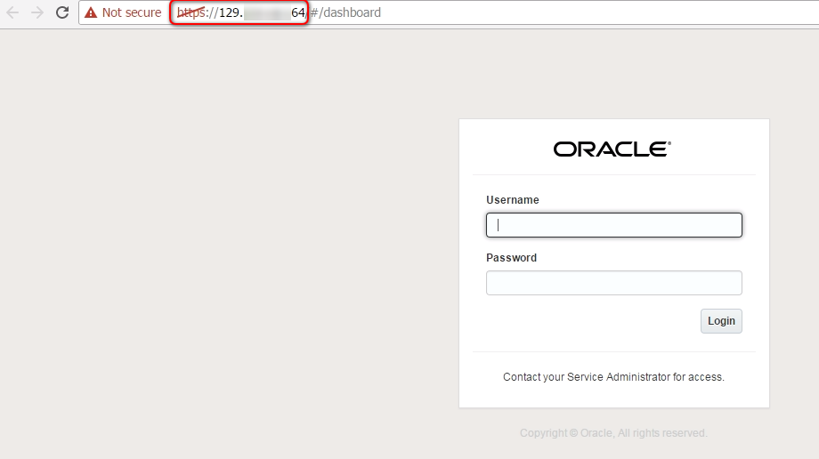

#### Add oracle-occs-container-util step to the workflow ####

Go back to the browser (tab) where you signed in to Wercker and select your [wercker-springboot](https://github.com/oracle/cloud-native-devops-workshop/blob/master/springboot-sample/create.wercker.ci.md) sample application.

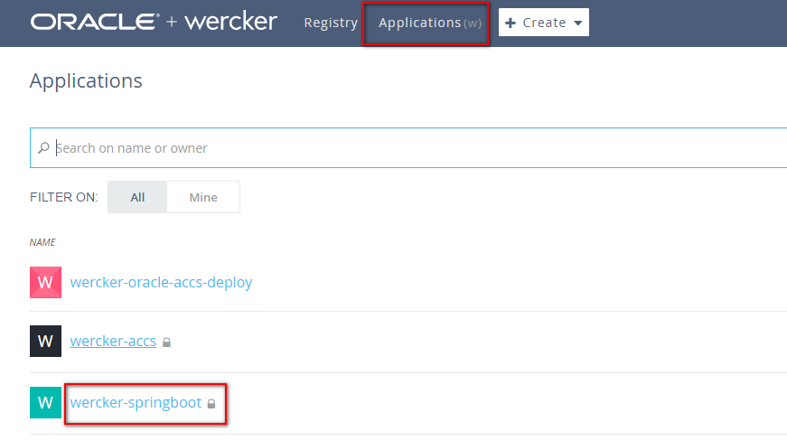

Switch to **Workflows** tab and create new pipeline for the *oracle-occs-container-util* step.

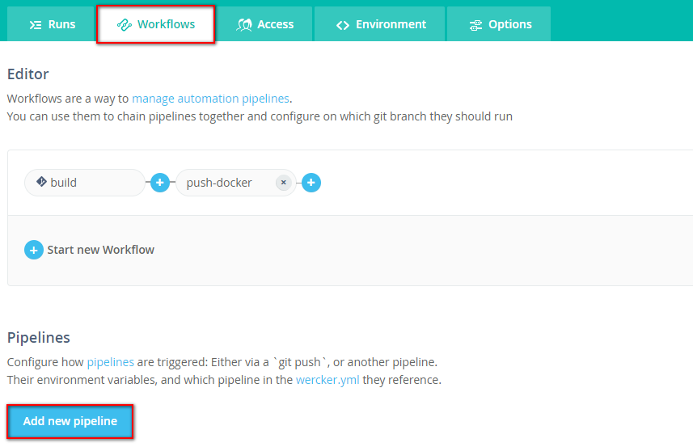

Upon creating a project in Wercker, it creates a build Workflow with a Git hook which executes a build pipeline. This means whenever you push changes into your github repository then a new build will be triggered. Now add a new pipeline what will do the restart of the container deployed on Oracle Container Cloud Service. Click **Add new pipeline**.

+ **Name**: *restart-occs-container* (but basically it can be anything else)
+ **YML Pipeline name**: use *restart-occs*. Important: the YML pipeline name is the name what you need to define in `wercker.yml` for the step.
+ **Hook type**: leave default to ignore Git push. You will add this pipeline after build what has already this configuration.

Finally click **Create**.

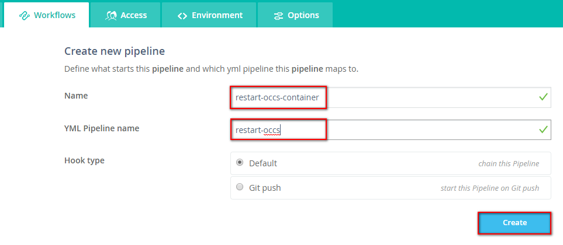

On the detail page of the new push-docker pipeline you can immediately add the required environment variables.

+ **OCCS_USERNAME** = Oracle Container Cloud Service username
+ **DOCKER_PASSWORD** = Oracle Container Cloud Service password
+ **REST_SERVER_URL** = https://<IP_ADDRESS_OF_OCCS_CONSOLE> (what was discovered in previous step)
+ **FUNCTION** = *stop* The OCCS configured to try restart of the service if that is stopped or failed for any reason.
+ **DEPLOYMENT_NAME** = the name of the OCCS deployment name. If you followe the prerequisite tutorial it has to be *wercker-springboot-1* 

When you need to add new variable click **Add** button which saves the current row and add a new one. You can use the **Protected** tick box to store safely your value e.g. password.

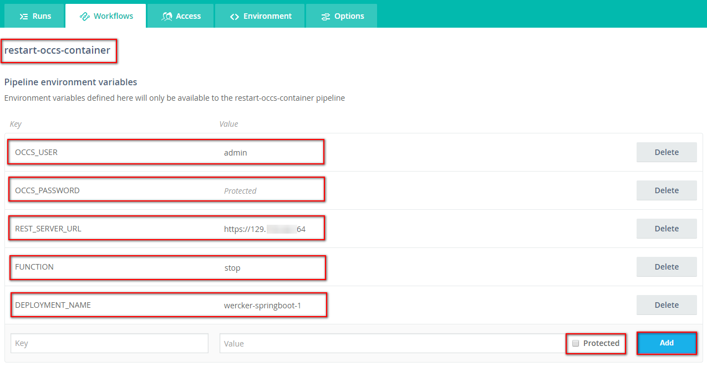

To go back workflow editor click **Workflows** tab again and start to edit your workflow. Click the blue plus icon after the *push-docker* pipeline to add the previosly created *restart-occs-container* pipeline. Leave the default * for branches and select the *restart-occs-container* pipeline from the **Execute pipeline** dropdown list. Click **Add**.

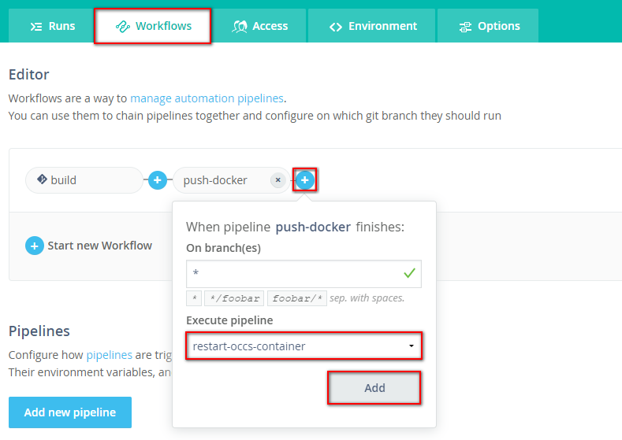

#### Add the *oracle-occs-container-util* step to the `wercker.yml` ####

Go to the browser (tab) where github.com is opened or open it now. Modify the *https://github.com/<YOUR\_GITHUB\_USERNAME>/wercker-springboot/blob/master/wercker.yml* Wercker configuration file. Click Edit icon.

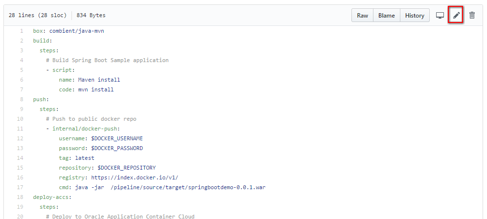

Append to the configuration the following part:

	restart-occs:
	  steps:
	    # Manage Oracle Container Cloud Service container
	    - peternagy/oracle-occs-container-util:
	        occs_user: $OCCS_USER
	        occs_password: $OCCS_PASSWORD
	        rest_server_url: $REST_SERVER_URL
	        function: $FUNCTION
			deployment_name: $DEPLOYMENT_NAME 

Enter a commit message and click **Commit changes** button.

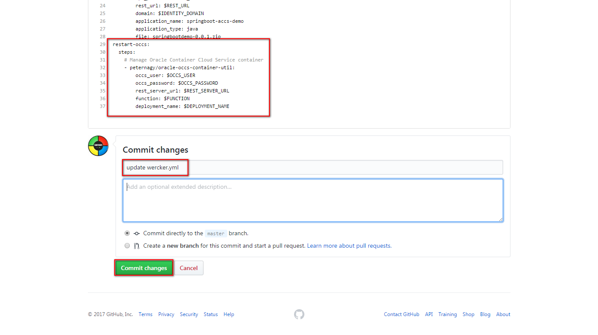

It will trigger a new build for wercker-springboot application which will create and push a new Docker container and restart the deployed Oracle Container Cloud Service. But to be sure that the Continuous Deployment is complete modify the application to make the restart visible.

#### Modify the application's home page ####

Now do some modification on the same web page what was modified in the prerequisite tutorial. Go to the browser (tab) where github.com is opened or open it now. Modify again the *https://github.com/<YOUR\_GITHUB\_USERNAME>/wercker-springboot/blob/master/src/main/webapp/WEB-INF/views/welcome.jsp* JSP file. Click Edit icon.

Modify the following part:

	<a style="color: #ffffff">Oracle Container Cloud Service + Wercker</a>

Include your name for example:

	<a style="color: #ffffff">Oracle Container Cloud Service + Wercker (Step)</a>

Enter a commit message and click **Commit changes** button. Make sure you are using Space instead of Tab in the editor.

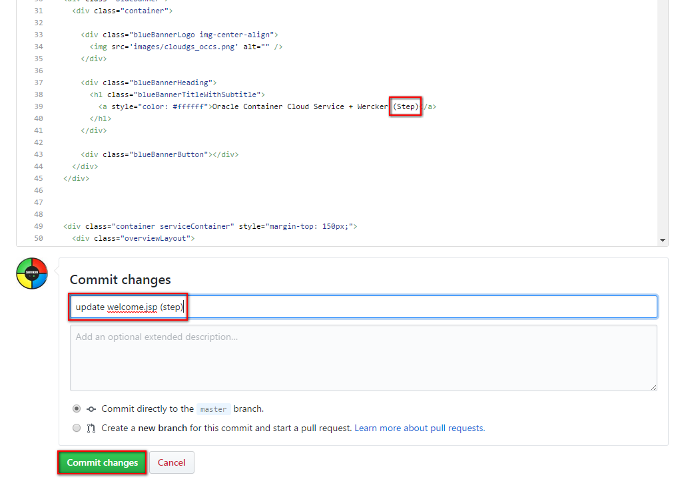

It triggers the Wercker build so when you go back to the browser where Wercker is opened you should see the following:

When the workflow has been executed successfully open a new browser (tab) and enter or copy the host's public IP address and append the 8090 port. For example: `http://129.150.68.71:8090`. (If you forgot or don't know how to figure out the application's public IP address please follow the [prerequisite tutorial](https://github.com/oracle/cloud-native-devops-workshop/blob/master/springboot-sample/create.wercker.ci.md#deploy-spring-boot-sample-docker-container-to-oracle-container-cloud-service)) You have to get the following webpage:

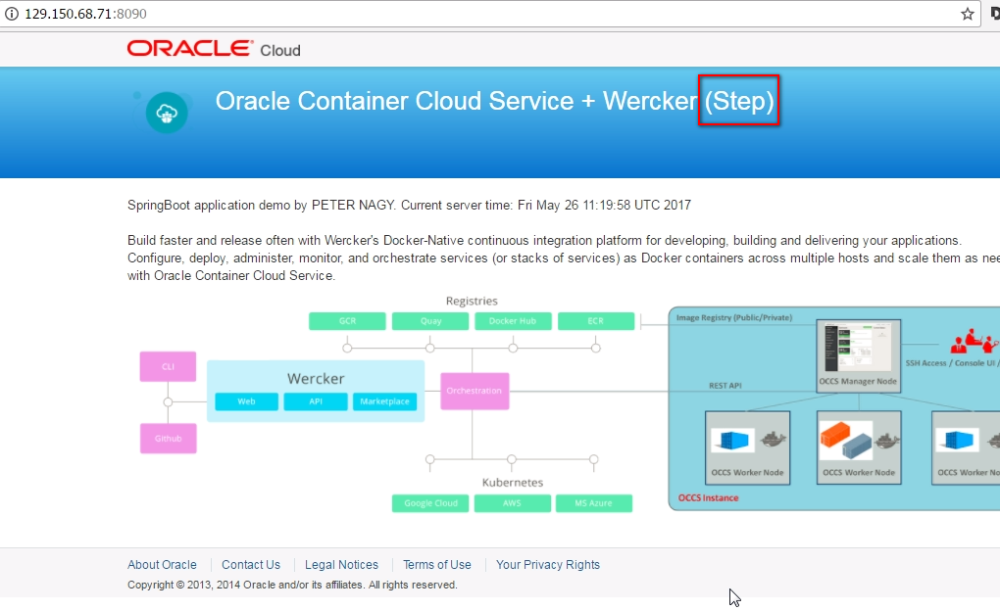

Please note the changes what you have made on *welcome.jsp* page.
