## Deploy complex cloud environment using Oracle Cloud Stack Manager ##

### About this tutorial ###
Oracle Cloud Stack Manager is a feature of Oracle Cloud that allows for the provisioning of multiple services within the Oracle Cloud. In order to build and deploy their applications, businesses often require sophisticated environments that consist of multiple, integrated cloud services. Consider a development environment whose needs include a Java application server along with a relational database. Provisioning each of these services for every member of your development team is time consuming and error prone, regardless of whether you’re using service consoles or REST APIs to provision the services. Oracle Cloud Stack Manager uses templates to provision a group of services (called a stack) and in the correct order.

In this tutorial you will learn how to quickly provision a group of related Oracle Cloud resources with Oracle Cloud Stack Manager.
You will use Cloud Stack Manager and a custom Oracle stack template to provision multiple Oracle Application Container Cloud services instances.

The FixItFast Cloud Native Application requires the following services:

- Cache service for customer and location data
- JavaSE (Spring Boot) REST service to store customer and location data in the cache
- NodeJS REST Service to persist FixItFast application's data
- NodeJS Server to host front end (JavaScript) application

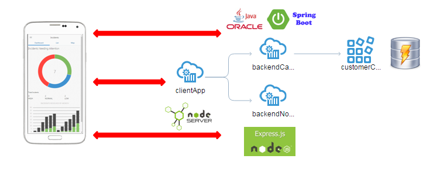

This tutorial demonstrates how to:

- create Oracle Developer Cloud Service project using existing external Git repository
- configure build job to build multiple services required by Cloud Native Application
- create and import custom Stack Template
- create Stack instance using Stack Template

### Prerequisites ###

- A valid identity domain, username and password for Oracle Cloud
- A subscription for Oracle Application Container Cloud Service

----

#### Create Oracle Developer Cloud Service project ####

Sign in to [https://cloud.oracle.com/sign-in](https://cloud.oracle.com/sign-in). First select your datacenter then click **My Services** and provide your identity domain and credentials (use DEVCS_DOMAIN, DEVCS_USER, DEVCS_PWD). After a successful login you will see your Dashboard. Find the Developer services tile and click the hamburger icon. In the dropdown menu click **Open Service Console** to open Oracle Developer Cloud Services console.
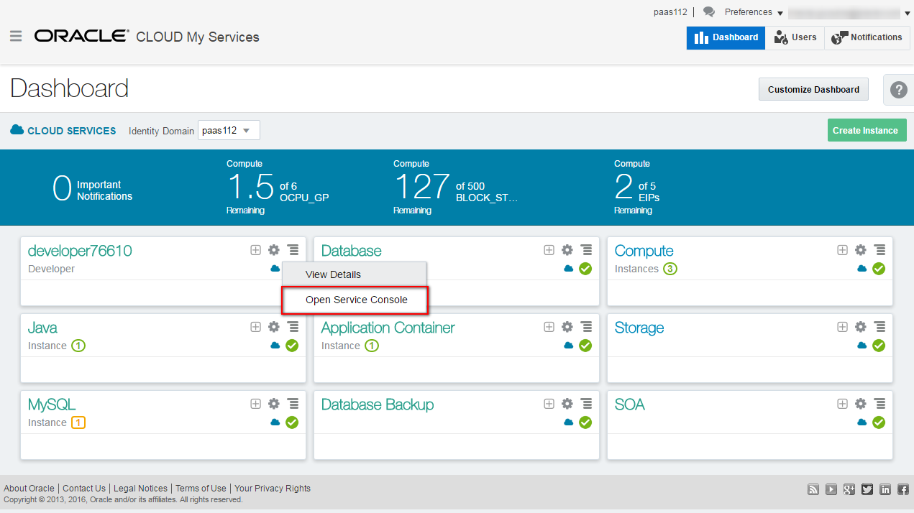

Click **+ New Project** button to create a new project.

Enter *fixitfast* as name of the project, a desired description and Click **Next**.

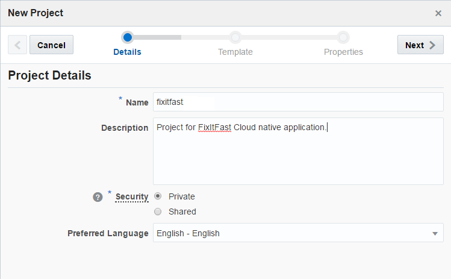

Click **Next** and select *Initial Repository* as template.

Click **Next** and on the Properties page select *MARKDOWN* as Wiki Markup and select *Import existing repository* to copy existing repository in this new project. Enter or copy the *https://github.com/oracle/cloud-native-devops-workshop.git* repository address.

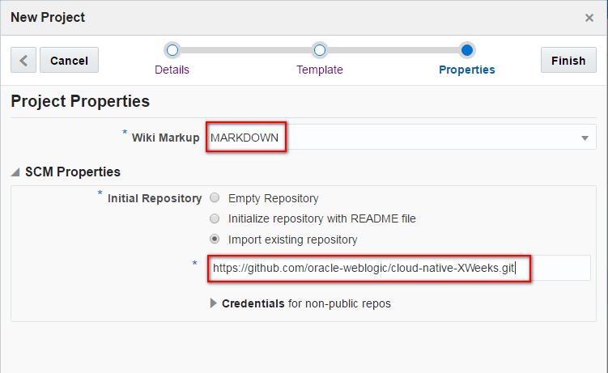

Now click **Finish** to create the project and to clone the specified repository.

### Configure build job to produce FixItFast sample application's components ###

Once the project provisioning is ready let's create the build job to compile and packaging all necessary components for FixItFast Cloud Native application.

Select **Build** item on the left side menu and click the **New Job** button.

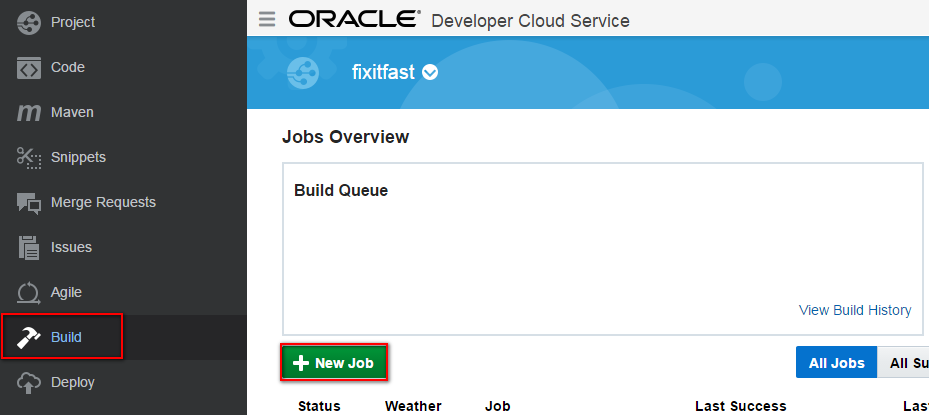

Enter a name e.g. *FixItFast-build-all-components* for the new job. Select the *Create a free-style job* option and click **Save**.

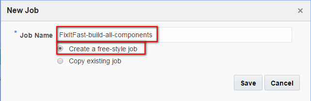

On the Main configuration page of the newly created job make sure **JDK 8** is the selected JDK.

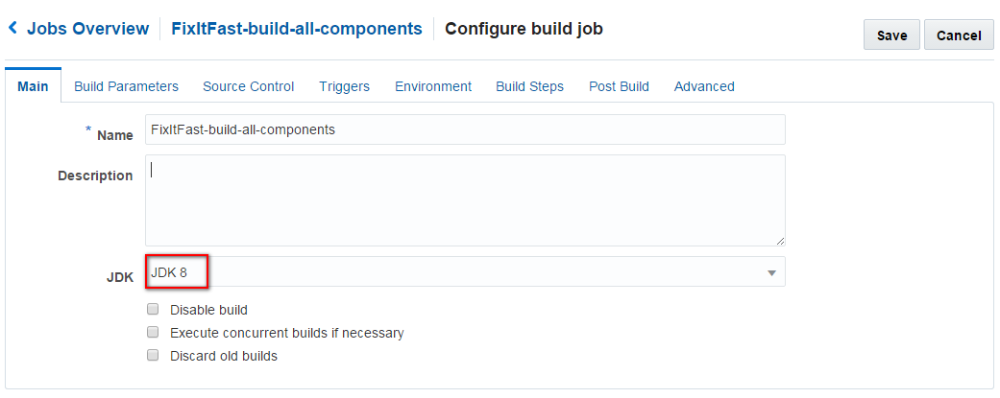

Change to the **Build Parameters** tab and select the **This build is parameterized** option. Click the **Add Parameter** button and for first select **String Parameter**. 

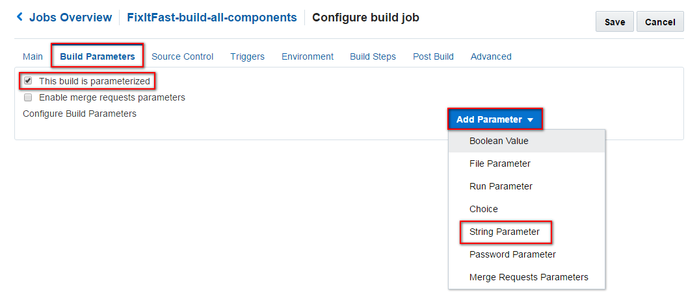

When the details area appears enter the following values below. Note you need to click **Add Parameter** for each value-pair. In case of password parameter select **Password Parameter**.

- **Type**:String Parameter, **Name**: STORAGE_USER, **Default Value**: your Oracle Public Cloud account's username (use ACCS_USER)
- **Type**:Password Parameter, **Name**: STORAGE_PASSWORD, **Default Value**: your Oracle Public Cloud account's password (use ACCS_PWD)
- **Type**:String Parameter, **Name**: STORAGE_CONTAINER, **Default Value**: xweek
- **Type**:String Parameter, **Name**: IDENTITY_DOMAIN, **Default Value**: your Oracle Public Cloud identity domain (use ACCS_DOMAIN)

When you have all the necessary parameters it should look similar like below, expect the default values. To give default values here is just an option, you can define the correct values when the build job will be started.

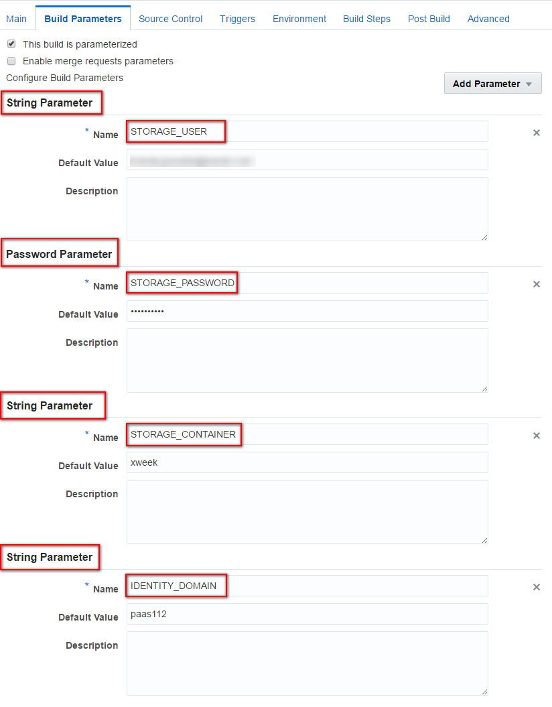 

Now change to the **Source Control** tab and select **Git**. In the git's properties section select the only one available Git repository which is provided in the list. Leave the advanced settings default.

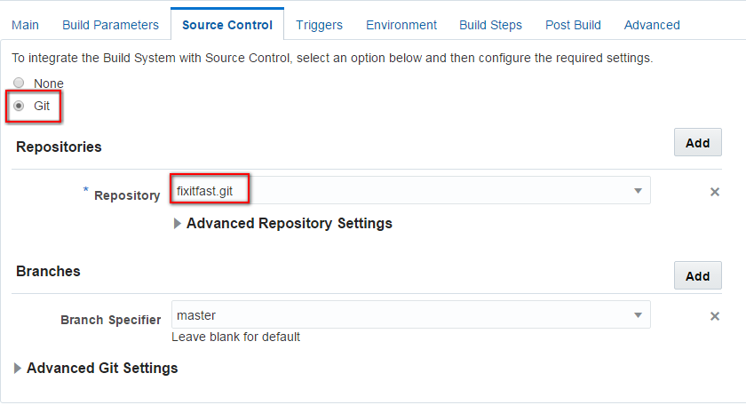

Change to **Build Steps** tab and add **Maven 3** build step for the first, JavaSE backend service component. 

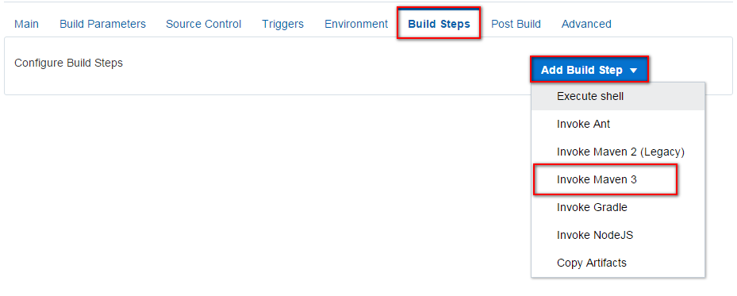

Make sure the **Goals** are *clean install* and enter *stack/java-cache-backend/pom.xml* to **POM File** field. Leave default for the rest.

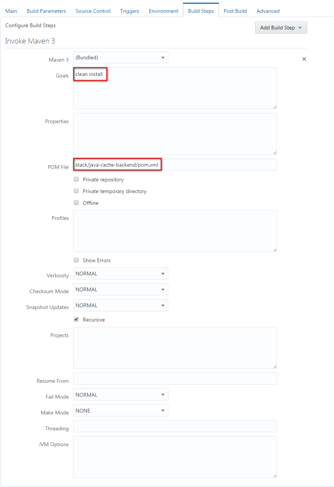

The rest of the build tasks (the 2 NodeJS components build and to copy artifacts to storage container) will be executed as shell script, thus add an Execute Shell as a second build step.

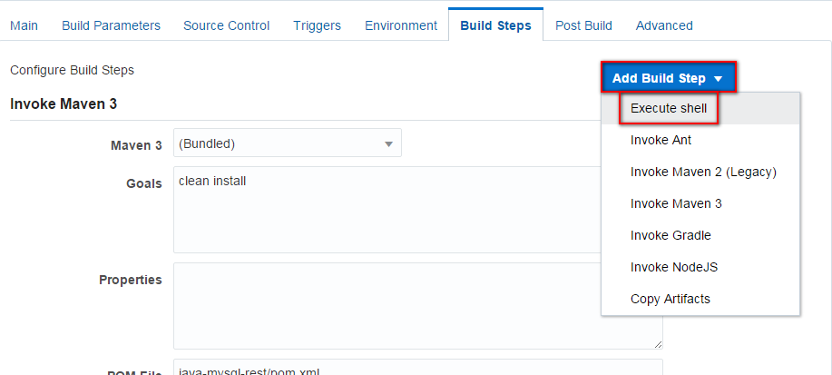

Scroll down to Command text area and copy or enter the commands below.
	
    # copy JavaSE backend artifact (fixitfast-java-cache-backend.zip) to the defined cloud storage location
	cd stack/java-cache-backend
	../postBuildAction.sh $IDENTITY_DOMAIN $STORAGE_USER $STORAGE_PASSWORD $STORAGE_CONTAINER
	
	# build NodeJS backend application
	cd ../node-fixitfast-backend
	npm install
	# copy NodeJS backend artifact (fixitfast-backend.zip) to the defined cloud storage location
	../postBuildAction.sh $IDENTITY_DOMAIN $STORAGE_USER $STORAGE_PASSWORD $STORAGE_CONTAINER
	
	cd ../..
	
	# build NodeJS client application
	git clone https://github.com/oracle/oraclejet.git
	
	cd oraclejet
	
	git checkout tags/2.2.0
	
	npm install bower
	
	bower install
	
	bower install knockout-mapping#2.4.1
	
	cd ../stack/node-fixitfast-client
	
	cp -ra ../../oraclejet/bower_components/. js/libs
	cp -ra ../../oraclejet/dist/js/libs/. js/libs
	cp -ra ../../oraclejet/dist/css/alta css/
	cp -ra ../../oraclejet/dist/css/common css/
	
	mkdir -p scss/oj/v2.2.0
	cp -ra ../../oraclejet/dist/scss/. scss/oj/v2.2.0
	
	npm install
	
	../postBuildAction.sh $IDENTITY_DOMAIN $STORAGE_USER $STORAGE_PASSWORD $STORAGE_CONTAINER

Quick explanation to the script. As you can see from the comments the script first copies the previous Maven build's result to the storage. The second part builds the NodeJS backend application then copies that to the same storage location. Finally the last part builds again a NodeJS application, but now the client component. The client requires specific version of [Oracle JET](http://www.oracle.com/webfolder/technetwork/jet/index.html) which is available on [github](https://github.com/oracle/oraclejet). The last step is a copy again to the defined storage location. Basically NodeJS build requires *npm install* which downloads the dependencies and archive the result to a single zip file. In case of the client Oracle JET uses bower to get dependencies. The *postBuildAction.sh* script simply copies any archived artifact in given folder to the cloud storage location using *curl* and defined build parameters.

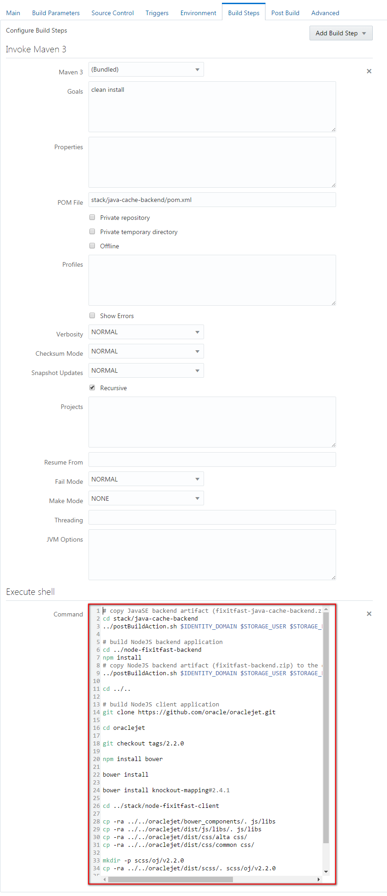

To archive artifact in Developer Cloud Service too, change to **Post Build** tab and check in the **Archive the artifacts** option. Enter __\*\*/\*.zip__ into **Files To Archive** field. Finally click **Save** to update the new job configurations.

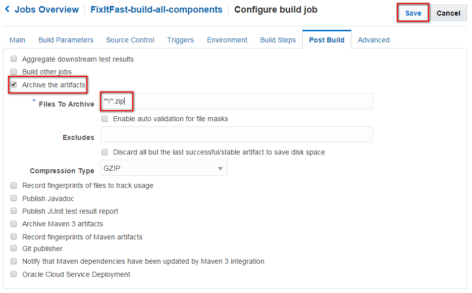

Now execute the new build job. The previous step result navigated to the *FixItFast-build-all-components* detail page. Click **Build Now**.

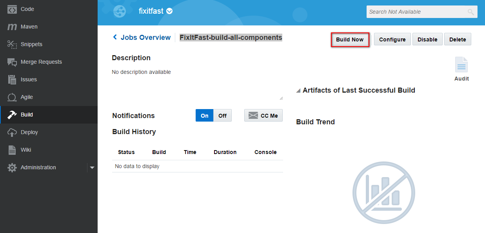

The parameters dialog appears. If the default values are correct then click **Build** and wait until the build completed. Note the container name has to be *xweek*, but the rest of the parameters need to reflect your cloud environment. 

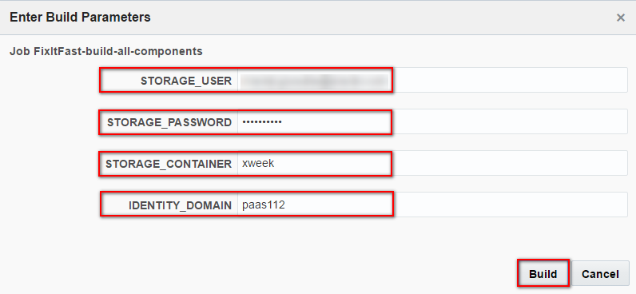
  
If the build succeded you can find a green tick at the status field in the Build History. You can download the archived artifacts, but now it is not necessary. During the build or later anytime you can check the console output of the build process. Click on **Console** icon to review the log.

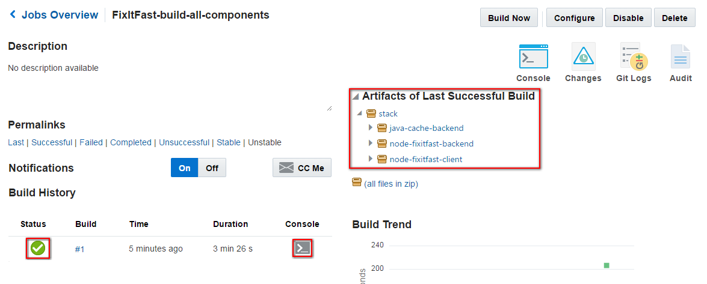

In case of build failure you can find the problem easily here in the log. If the build was successful then you can find *Finished: SUCCESS* entry at the end of the log.

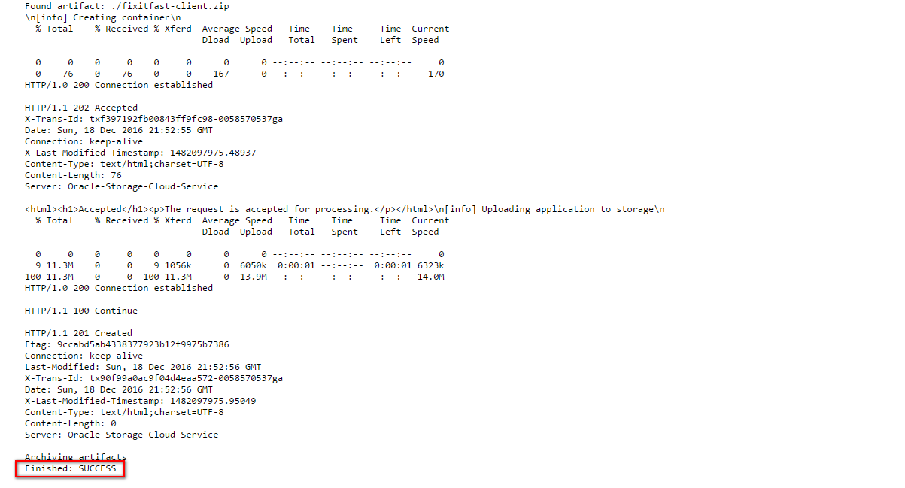

### Create custom Stack template ###

A template in Oracle Cloud Stack Manager defines the cloud services that are part of a stack as well as how they are provisioned in Oracle Cloud. They act like blueprints for the creation of cloud environments.

A template is comprised of several elements:

- *Resources* define the cloud services to create and the dependencies between them.
- *Resource parameters* control how the resources are created through the service’s public REST APIs.
- *Resource attributes* enable you to use the runtime characteristics of one resource as parameters for the creation of another resource.
- *Template parameters* allow users of the template to customize the template for a specific cloud stack.
- *Template attributes* customize the monitoring information that is displayed for stacks created from this template.

Templates are authored using the YAML standard syntax and then imported into Oracle Cloud Stack Manager. You can rapidly provision similar environments, in the same cloud data center or in different ones, by creating multiple stacks from a single template. After a stack is created from a template, its lifecycle is completely independent from the template’s lifecycle. In other words, modifications you make to the template will not affect existing cloud stacks.

Open your favourite text editor and copy or enter the following content into a new text file and save as *fixitfast-cache-stack.yaml*.

	---
	  template: 
	    templateName: FixItFast-Cache-Stack
	    templateVersion: 1.0.0
	    templateDescription: Stack template to create simple ACCS 
	    parameters: 
	      appFrontEndURL: 
	        label: Front End App archive cloud URL
	        description: Location inside Storage from where the frontend app archive can be downloaded from
	        type: String
	        mandatory: true
	        default: xweek/fixitfast-client.zip
	      appBackEndNodeURL: 
	        label: Back End Node App archive cloud URL
	        description: Location inside Storage from where the backend node app archive can be downloaded from
	        type: String
	        mandatory: true
	        default: xweek/fixitfast-backend.zip
	      appBackEndJavaURL: 
	        label: Back End Java App archive cloud URL
	        description: Location inside Storage from where the backend java app archive can be downloaded from
	        type: String
	        mandatory: true
	        default: xweek/fixitfast-java-cache-backend.zip
	    resources: 
	      customerCache: 
	        type: caching
	        parameters: 
	             serviceParameters: 
	                serviceName: customerCache
	                serviceLevel: PAAS
	                subscription: HOURLY
	                serviceDescription: Customer Cache for FixItFast application 
	      backendCacheJavaApp: 
	        type: apaas
	        parameters: 
	            name: backendCacheJava
	            runtime: java
	            subscription: MONTHLY
	            archiveURL:
	                Fn::GetParam: appBackEndJavaURL
	            deployment:
	                memory: 1G
	                instances: 1
	                services: 
	                      - 
	                        identifier: CacheBinding
	                        name: 
	                          Fn::GetAtt: 
	                            - customerCache
	                            - serviceName
	                        type: caching
	      backendNodeApp:
	        type: apaas
	        parameters: 
	            name: backendNode
	            runtime: node
	            subscription: MONTHLY
	            archiveURL:
	                Fn::GetParam: appBackEndNodeURL
	            deployment:
	                memory: 1G
	                instances: 1
	                services:
	      clientApp:
	        type: apaas
	        parameters: 
	            name: client
	            runtime: node
	            subscription: MONTHLY
	            archiveURL:
	                Fn::GetParam: appFrontEndURL
	            deployment:
	                memory: 1G
	                instances: 1
	                services:
	                environment:
	                  {
	                    "REST_FIXIT" :  { "Fn::GetAtt" : [ "backendNodeApp", "attributes.webURL.value" ] },
	                    "REST_CUSTOMERS" :  { "Fn::GetAtt" : [ "backendCacheJavaApp", "attributes.webURL.value" ] }
	                  }

Please spend few minutes and try to understand this configuration format. Files that contain YAML documents can use any file extension but *.yaml* is a typical convention. The first line in the file identifies it as a YAML document by using 3 dashes.

At the beginning you can find the Name, Version and Description of the template. The second part is for the parameters. There you can defined parameters which is necessary to create stack (services) using default values what you can override during stack creation. As you can see in this template we defined the artifacts location on the storage cloud container where the previous build job has uploaded.

The third main part is about the resources what are the service definitions. We have defined the following services:

1. *customerCache* - Application Container Cloud Cache Cloud Service
2. *backendCacheJavaApp* - Application Container Cloud Service hosting JavaSE depends on *customerCache*
3. *backendNodeApp* - Application Container Cloud Service hosting NodeJS
4. *clientApp* - Application Container Cloud Service hosting NodeJS depends on *backendNodeApp* and *backendCacheJavaApp*

Please note the dependencies and how it's parameters dynamically defined. For example the *backendCacheJavaApp* needs to get the Cache Service connection string and credentials which is done by Service Bindings and parameter usage. Or the *clientApp* needs to know the REST endpoints of *backendNodeApp* and *backendCacheJavaApp*. For more clear picture scroll up to the beginning of the this guide and review the FixItFast Cloud Native Application (Cache version) architecture.

### Import custom Stack template to Oracle Cloud Stack Manager ###

Open a new browser tab or window and use the [sign in](https://cloud.oracle.com/sign-in) page to access your dashboard again (USE ACCS DOMAIN CREDENTIALS - NOT DEVCS DOMAIN). Select your datacenter click **My Services** then provide your identity domain and credentials (if necessary, because in same browser SSO session should still alive). After a successful login you will see your Dashboard. Find the Application Container tile and click the hamburger icon. In the dropdown menu click **Open Service Console** to open Oracle Application Container Cloud Services console.

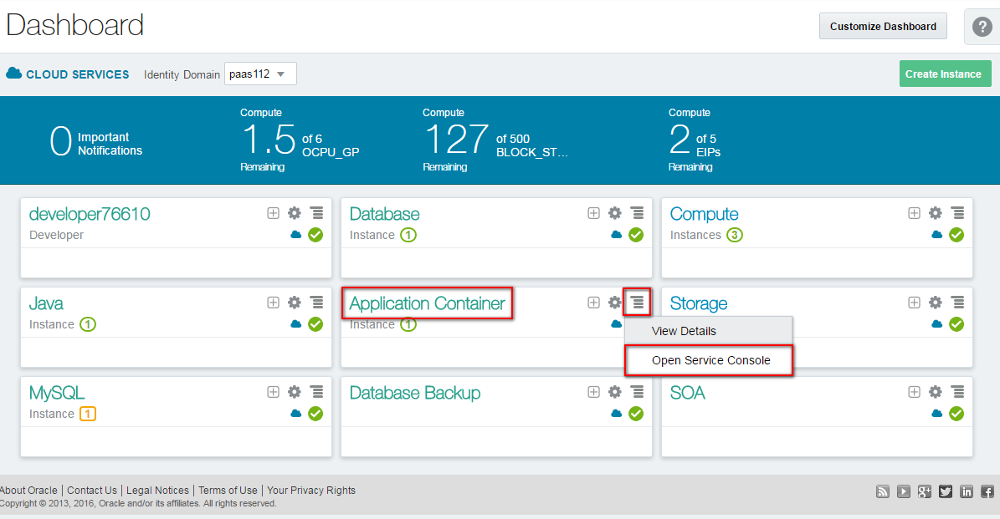

On the Application Container Cloud Service Console click the drop down menu icon next to the console title and select **Oracle Cloud Stack**.

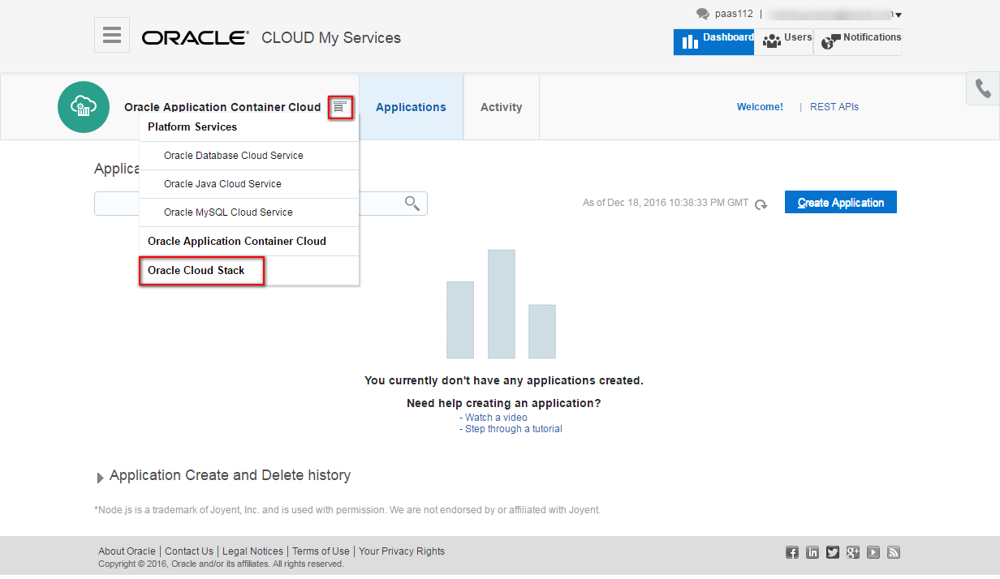

On the Oracle Cloud Stack console page select the **Template** tab and click **Import** to import your custom stack template. As you can see Stack templates are already available in the template list. These certified, Oracle-defined templates address popular use cases and deployment patterns. You do not have to import these templates into Oracle Cloud Stack Manager to begin using them. However, you can export an Oracle template, customize its definition to meet your requirements, and then import it back into Oracle Cloud Stack Manager as a new template.

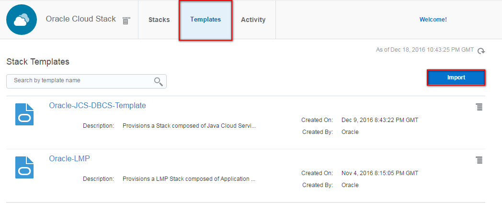

Find the *fixitfast-cache-stack.yaml* template file what you have created using the text editor on your desktop. Click **Import**.

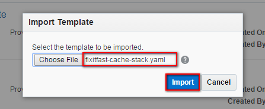

If the validation succeded then Oracle Cloud Stack imports the template. Click OK on the message dialog.

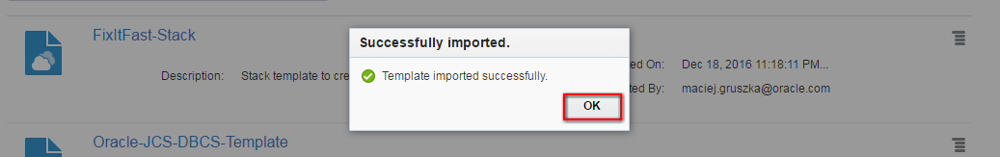

Now click the name of the newly created **FixItFast-Cache-Stack** template.

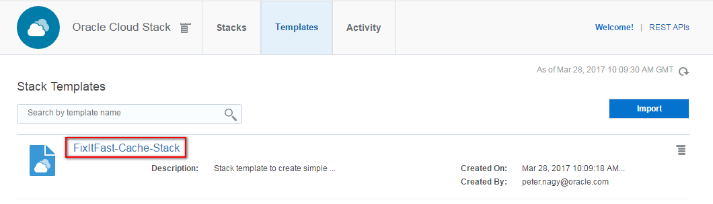

In the details page you can see the *Topology* and the raw content of the *Template* file. You can Export the yaml file for further usage, but now click **Done** to close the detail page.

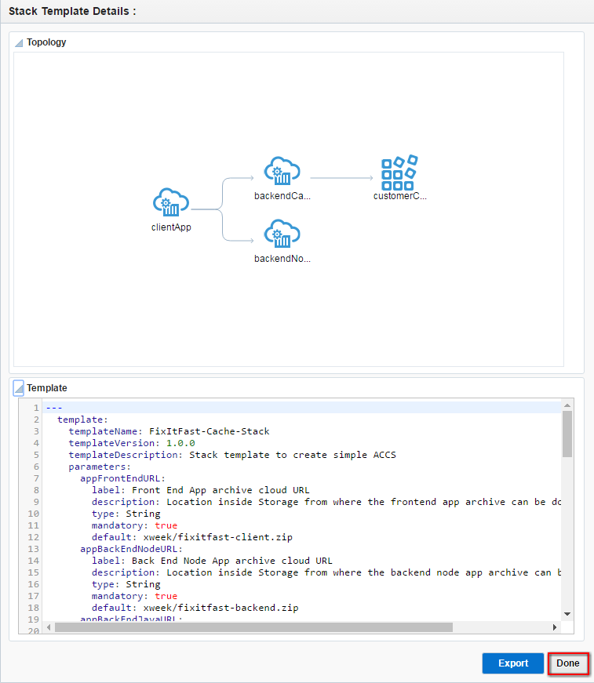

### Create Stack using Stack template ###

Now create stack using the imported , custom stack template. Click the drop down menu icon in the **FixItFast-Cache-Stack** template row on the right side and select **Create Stack** menu item.

The Create New Oracle Cloud Stack — Details page is displayed. Enter *FixItFast-application* as **Name**  and optional **Description** for the stack. Do not select **On Failure Retain Resources** otherwise the stack creation fails, any resources that were created will not be automatically deleted.
The rest of the parameters are specific to the template you imported. If you haven't changed the storage container build parameter and the stack template configuration file you can accept the default values. Click **Next**.

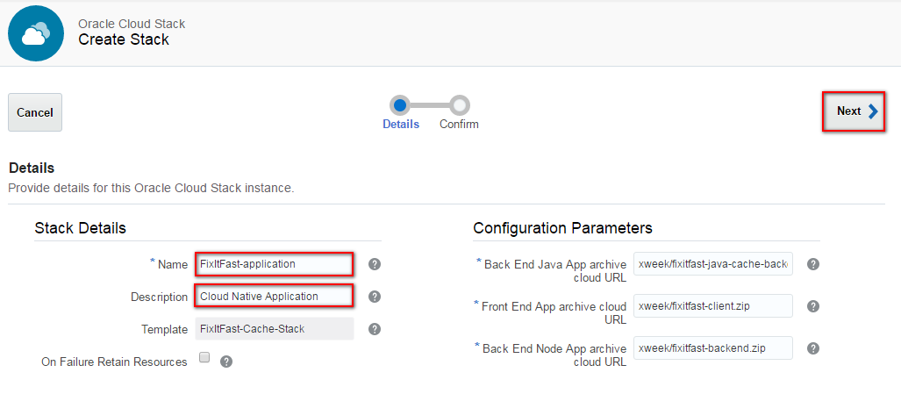

The Create New Oracle Cloud Stack — Confirmation page is displayed. Review the values you provided for the template parameters and click **Confirm** to create your stack.

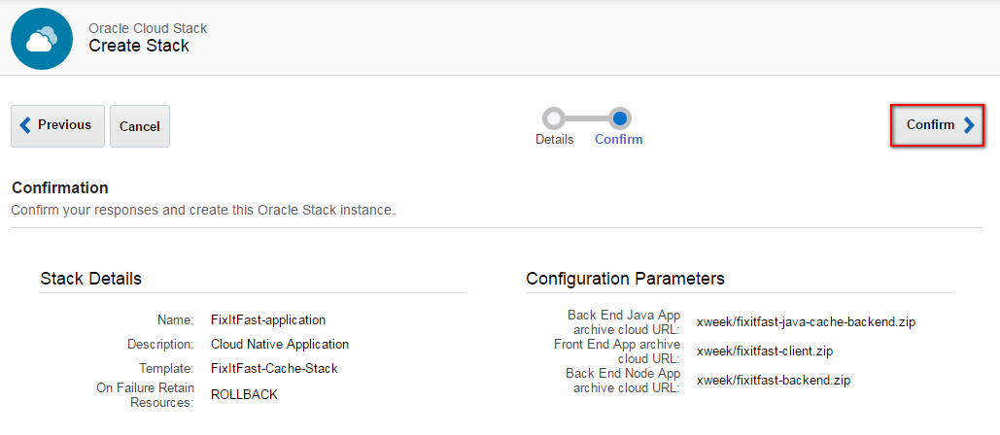

To check the stack status by services go back to the **Stacks** page and click the **FixItFast-application** stack.

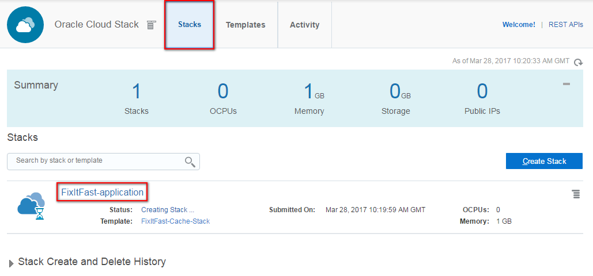

Using this page (click refresh icon after every few minutes) you can get information about the  status of services what are being created by this stack. Please note during the *customerCache* creation the stack also started to create *backendNode* component because there is no dependency between them. But the *backendCacheJava* and *client* components need to wait for *customerCache* completion since they use that service directly and indirectly. The creation of service instances should not be longer than 15 minutes.

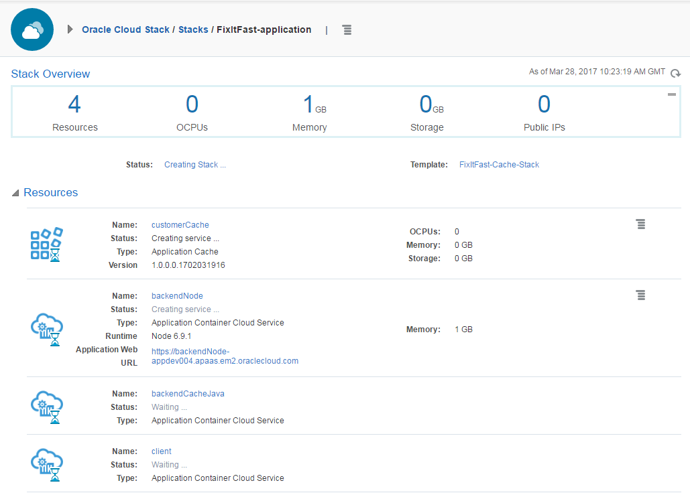

When all the services are up and running click on the *client* application's URL.

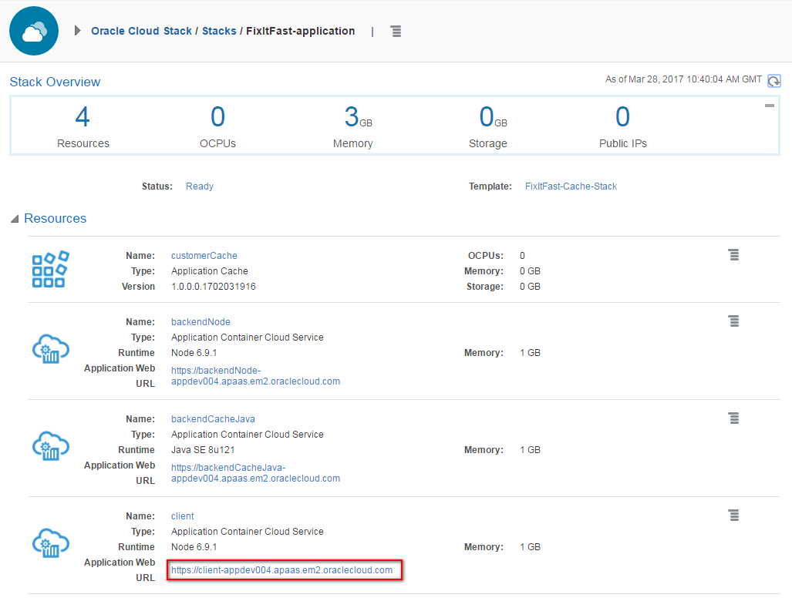

The FixItFast application is opened in a new browser tab or window. Click **Skip**.

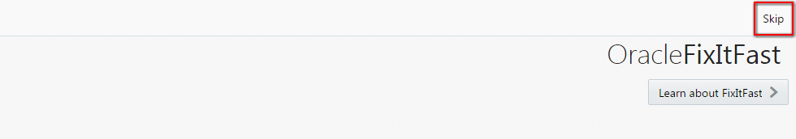

Leave the default credentials and click **Sign In**.

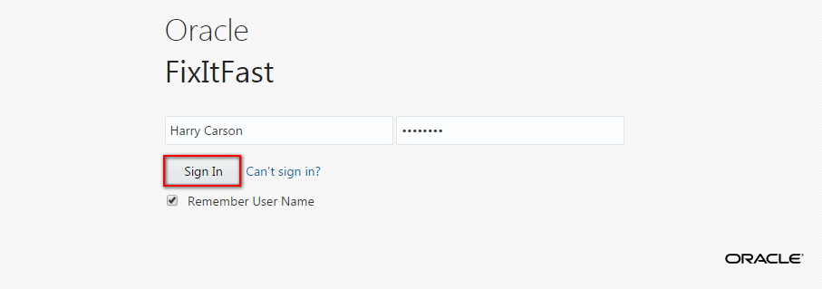

Discover the FixItFast application.

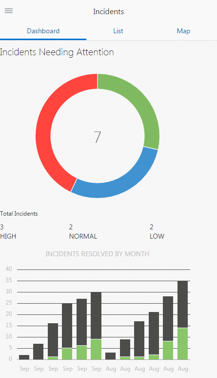

### Modify data directly in the Application Container Cloud Cache Service ###

To check dependencies the last task in this lab is to modify data directly in the cache and check changes using FixItFast application.

First check the customer list using FixItFast application. Click on the menu icon what can be found in the top left corner. In the navigation menu select **Customers**

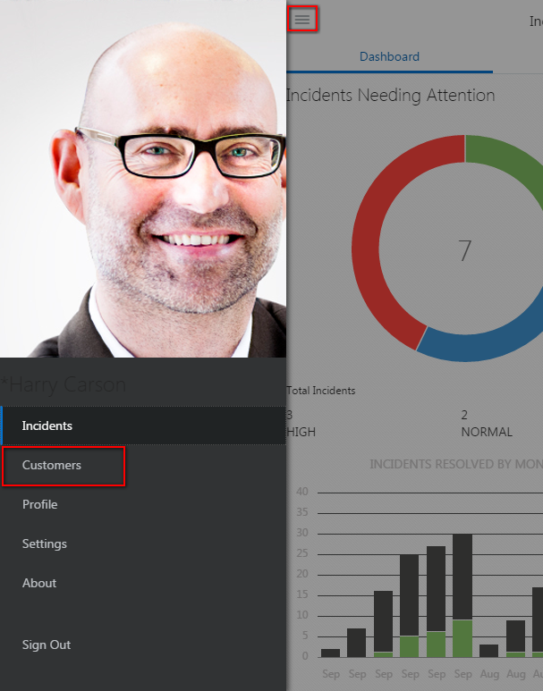

Note the first customer's name. In this demo it is *Bob Smith*. You will update this name to confirm backend dependency.

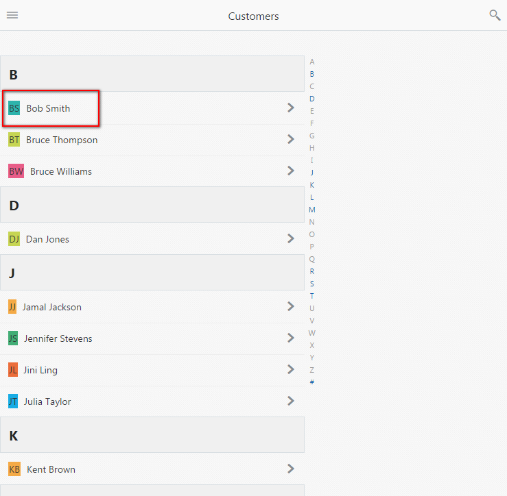

Go back to the  FixItFast-application's Stack detail page find the *backendCacheJava* application and click it's URL.

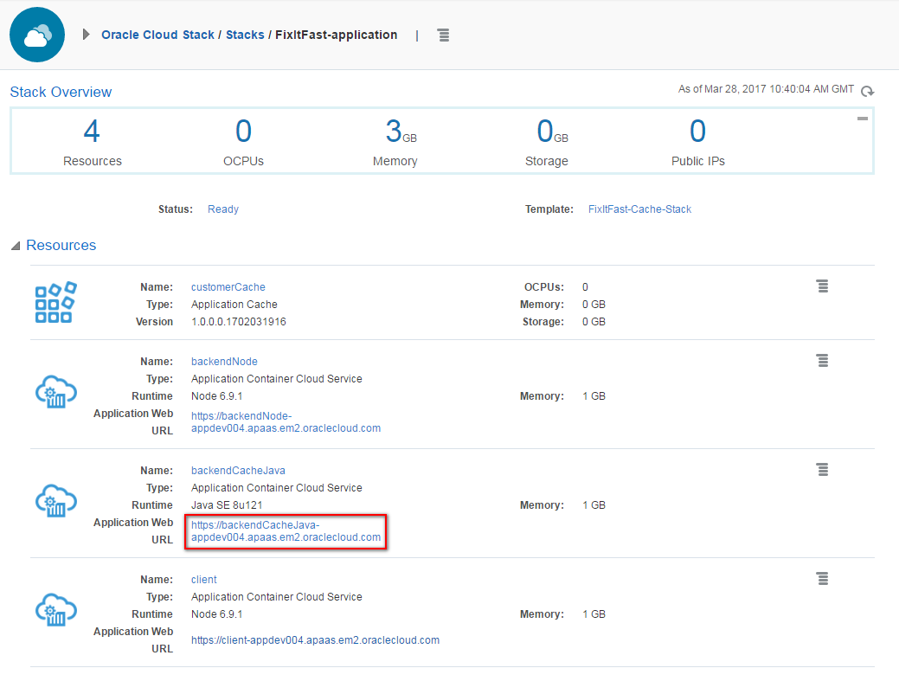

The *backendCacheJava* application's home page is displayed. Basically this component just provides REST access to customer and location data stored in Application Container Cloud Cache  Service. These pages are just for demo purposes. Click **Edit Customers** link.

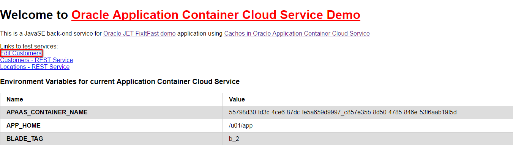

Using this page you can modify any customer data. Select *Bob Smith* customer and click **Edit**.

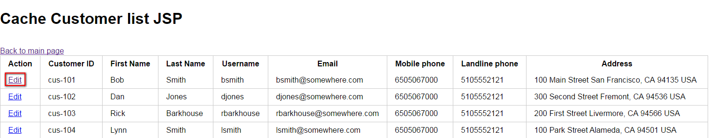

On the customer edit form change the first name to *Bobby* and click Update to save changes.

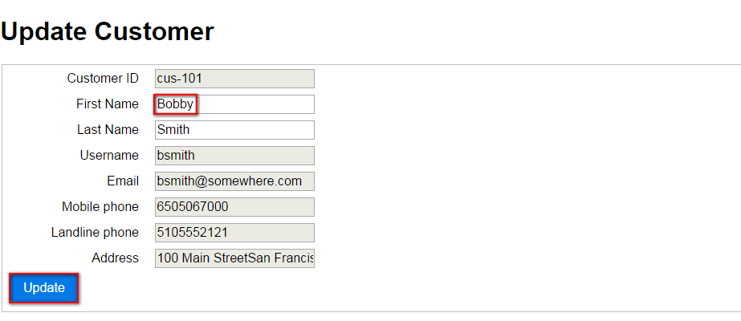

As a result you can see the changes in the customer list.

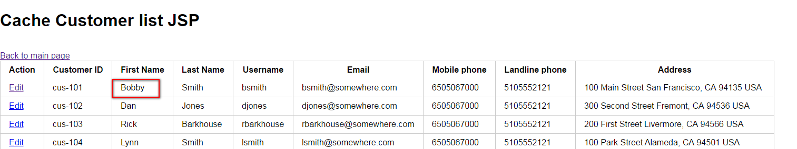

To refresh customer list go back to the FixItFast application and click the menu icon at the top left corner and select e.g. **Incidents**.

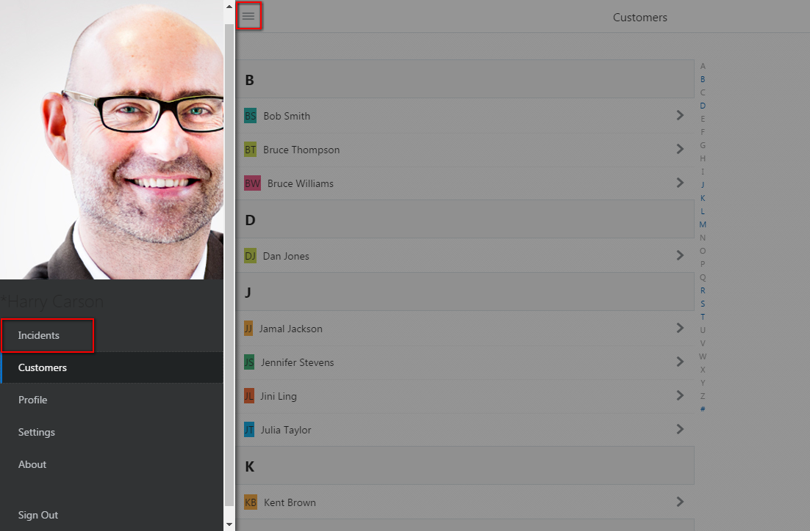

Now go back to the customer list using the menu icon again.

In the customer list you have to see the updated name: **Bobby Smith**

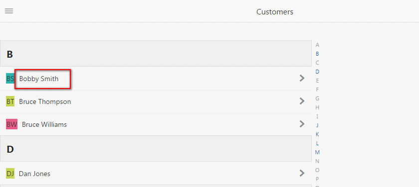

Congratulations! You have completed the Oracle Cloud Stack lab.
