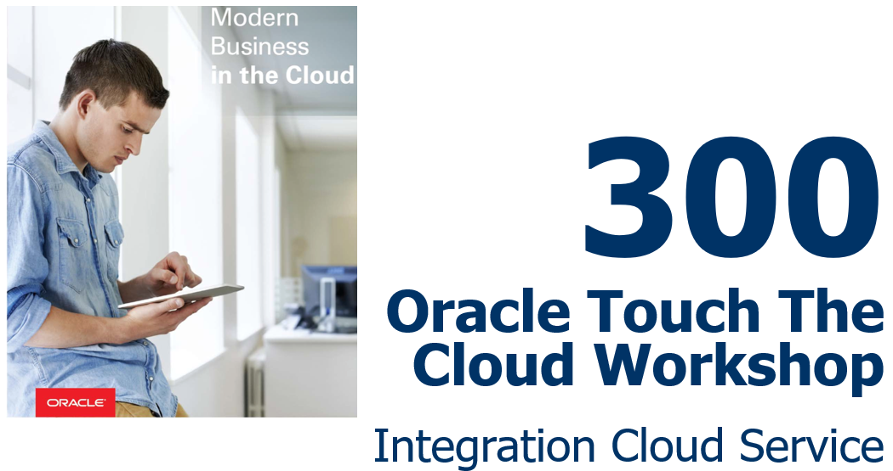  

Update: March 13, 2017

## Introduction

This is the second of several labs that are part of the **Oracle Public Cloud Touch the Cloud workshop.** This workshop will walk you through the management, modeling and administration of a typical Quote to Order process.

## Objectives

- User Experience with Process Cloud
- Process Modeling and Configuration

# 

## Process Cloud User Experience

In this section we are going to experience the interaction possible from an end user of the PCS interface.

Each step identify the role, and what the user in the specific role try to achieve. 

### **1**: Login to Oracle Cloud

---

**Role: Lisa Jones, Field Sales (lisa.jones)**

Since it is Lisa's first time signing into Oracle Cloud, she has to figure out how to access Oracle Process Cloud Services.

---

Now we can login as Lisa Jones. From any browser, **go to the following URL**:
[https://cloud.oracle.com](https://cloud.oracle.com)

**1.1** Click **Sign In** in the upper right hand corner of the browser.

  

**1.2** **IMPORTANT** - Under My Services, ask ***your instructor*** which **Region** to select from the drop down list, and **click** on the **My Services** button.

  

**1.3** Enter your identity domain and click **Go**

  ***NOTE***: the **Identity Domain, lisa.jones** and **Password** values will be given to you from your instructor.

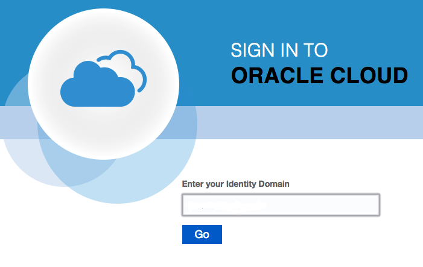  

**1.4** Once your Identity Domain is set, enter your **User Name** and **Password** and click **Sign In**

  

**1.5** Once connected, you will be presented with a Dashboard displaying the various cloud services available to this account. 

  
  
**1.6** Click on the **Oracle Process Cloud Service**

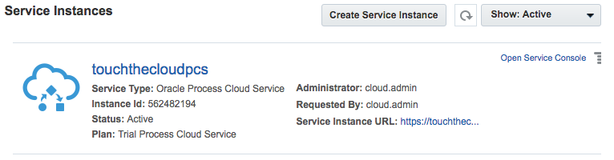

> -The Process Cloud Workspace URL https://pcsinstance-domain.process.us2.oraclecloud.com/bpm/workspace

> -The Process Cloud Composer URL can be derived by replacing the "/workspace" replaced by "/composer", which results in https://pcsinstance-domain.process.us2.oraclecloud.com/bpm/composer if applied to the sample above 

### **2**: Login to Process Cloud Service

---

**Role: Lisa Jones, Field Sales (lisa.jones)**

There are different ways to access the PCS Workspace. The direct access URL can be embedded on an Intranet page, a full set of REST API's can be used to extract the information programmatically or you can use the mobile application supplied by Oracle. 

Lisa prefer to go directly to her PCS Workspace using a browser.

---

Oracle Process Cloud Service is divided as three separate functionalities, and depending on you role, you would be able to access these functionalities. The functionalities is divided in Administrator Tasks, End-User Tasks and Developer Tasks. Since Lisa only has access defined as a End-User, so will only see the task relevant to her, **Work on Tasks** and **Track Instances**.

**2.1** From Cloud UI dashboard click on the **Service Instance URL** link. ***Or,*** using the captured URL open your browser to the **Copied URL**

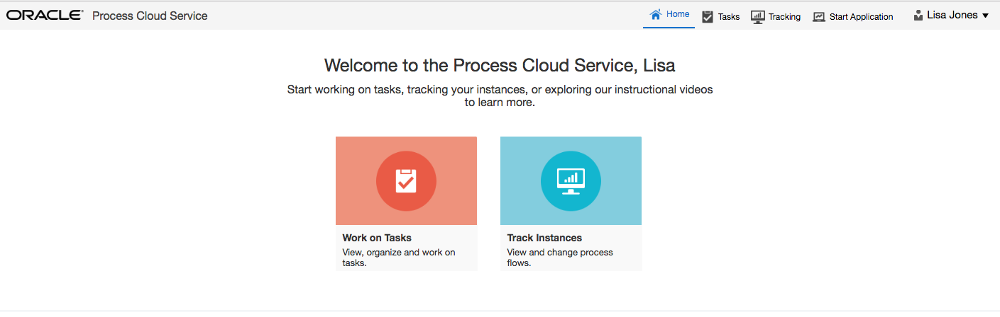  

- The  PCS Landing page gives you a quick glance of the functionality available to you (or in this case Lisa Jones).

>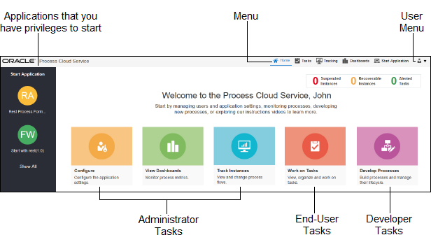

>The above picture gives an explanation of a page, for user with all privileges granted and shows the different roles associated with each activity.  

### **4**: Working on Tasks

---

**Role: Lisa Jones, Field Sales (lisa.jones)**

Lisa wants to look at her outstanding tasks, and approve the incoming Quote requests. (Although she is not aware of it at the moment, PCS can be configured to send out notifications and reminders to attend to outstanding tasks).

---

**4.1** Click **Work on Tasks** to access the Task List

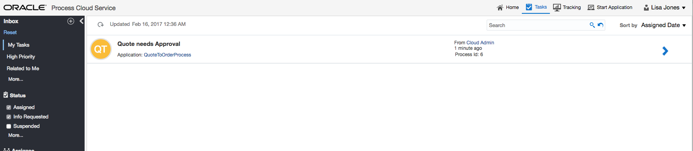  

In the list we can see the outstanding tasks allocated. You also have the capability to sort, do filtering and peek at task related to 'me'.

**4.2** Select a task by hovering over the task with mouse and clicking on it.

 

>While we are on the task form, let me take the opportunity to give you a breakdown of a typical task form: 
>1. Action Items - In this instance we have two actions defined, Approve and Reject. The Save functionality allows you to make some changes, save the state of the task and at a later stage come back to the task to complete. 
>2. Close Form / Maximize
>3. Documents Panel Expand, might also include Discussions, if enabled for process
>4. Form, or also called the payload for the task. This information is the task specific information required to decide on on an action. Depending on the configuration, information can be updated.
>5. Comments
>6. Task Information, History and Task Metadata

**4.2** Lets follow the happy path, and click on the action ***Approve***

- The page will revert to the task list and you will notice that the task disappeared from your inbox. In fact, you might also get a green confirmation message that your action was accepted.

### **5**: Tracking Instances

---

**Role: Roland Dubois, Process Owner (roland.dubois)**

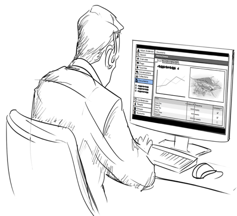

  Roland Dubois, sales director and process owner wants to see what happened to our process we have approved in the previous step. Since a process can be configured to follow different paths depending on rules and the way the process was modeled, it might be sometimes required for a process owner to look at a process instance to see what happened. 

  This audit information can also be exported and use for debugging or as input for on-premise systems.
  
---

**5.1** Logout as Lisa Jones, and log into the Process Workspace as Roland Dubois (roland.dubois).

**5.2** Click **Track Instances** to access the List of Instances

  

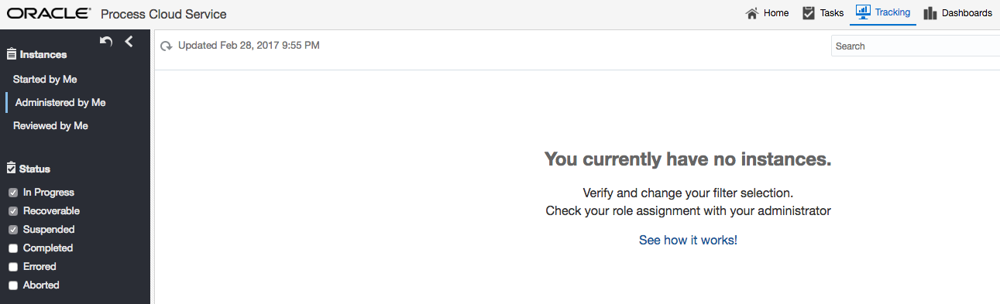

This List displays the active instances. To display completed instances as well, you have to select the **Completed** check box.

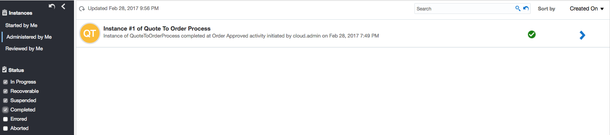

**5.3** Click on any process in the list

**5.4** To make it easier, you can expand the task to fill the browser page, by click on the expand task icon in the top left hand corner

**5.4** Expand the History heading

You have the option to view the history as a list, a tree view or diagram, depending on your needs. 

    - Graphical View : See the process as a diagram to quickly see what happened
    - List: Trace through the steps the process followed
    - Tree: Expose the capability to drill into specific step to see what happened in a step

To determine the next step in the process, you can view the diagram and determine what the next step in the process would be. 

_Sample flow where the amount was low and did not require further approval._

    This was just a highlight working with process instances, but keep in mind that there are features embedded in PCS to make life easier from a process owner's point of view. A good example might be to track instances in an error state and retry or even alter the flow to overcome the error condition.

#

## Process Modeling and Configuration

In this section we are going to experience the power of designing and implementing your own processes. Oracle PCS is based on the well documented BPMN specifications and lots of training, information and books exist around BPMN. A good starting point would be to look at *Object Management Group
Business Process Model and Notation* [Quick start Guide](http://www.bpmn.org/#tabs-quickguide) 

Don't be alarmed by the notation, it might seem overwhelming at first glance, PCS makes it easy to model and is intuitive in helping you to create a business process. 

---

### **1**: PCS Composer

---

**Role: Roland Dubois, Process Owner (roland.dubois)**

  Roland Dubois, sales director and process owner wants to change the process to add a comment to the Quote to Order process, to be able to distinguish an order placed in EBS by PCS. He is also not impressed by the high amount of the rules to determine if sales operations should approve a quote. On top of these changes, Roland also feels the need that if the amount is high risk, it should be approved by sales director as well. We are going through the steps on how to implement a change in the process.
  
---

**1.1** Follow the steps in the previous section **1: Login to Process Cloud Service** to sign into PCS, but this time using Roland Dubois (roland.dubois) sign on details.

**1.2** On the welcome page, click on Develop Processes

- You will be presented with the PCS Composer home page

> The Process Cloud Composer URL display in you browser window can be booked marked, if you want to return to the Process Composer directly **https://process-domain/process.us2.oraclecloud.com/bpm/composer/faces/app/designer/homePage.jspx** (or, if you are a lazy, you can also get back to the process composer by using **https://process-domain/process.us2.oraclecloud.com/bpm/composer/**)

- From this page you will be able to create a new Space, or even use a template to create a new process.

> An interesting exercise after the workshop, is to come back to the Create functionality and have a look at the QuickStart Apps available. You can also create a process and expose that as a QuickStart App template.

### **2**: Spaces

---

A space groups processes together, and also allows you to share a space with other users. As a space owner it allows you to give specific roles: viewer, owner and editor roles.

---

**2.1** Click on the Touch The Cloud Space

### **3**: Working with Applications

---

An Application contains all the defined artifacts, for example rules, integrations and processes to support this application.

---

In the next couple of steps we are going to extend the Quote to Order. To be safe, we are going to make a copy and use that to implement our changes.

**3.1** Click on the Quote to Order Application hamburger menu and select Clone

**3.2** Give your clone a new name, by appending your user name (User01..User10), and click Create, and leave the 'Open immediately' option on

- Now we have our clone ready to be changed, so let us proceed and implement our changes.

### **4**: Process Model

**4.1** First step is to add the comment. Click on the process to open up the process model

**4.2** Click on the Capture Order - the blue activity at the bottom right of the model. If needed, you can drag the model by clicking on any open space and drag the model to the left, to see the activity.

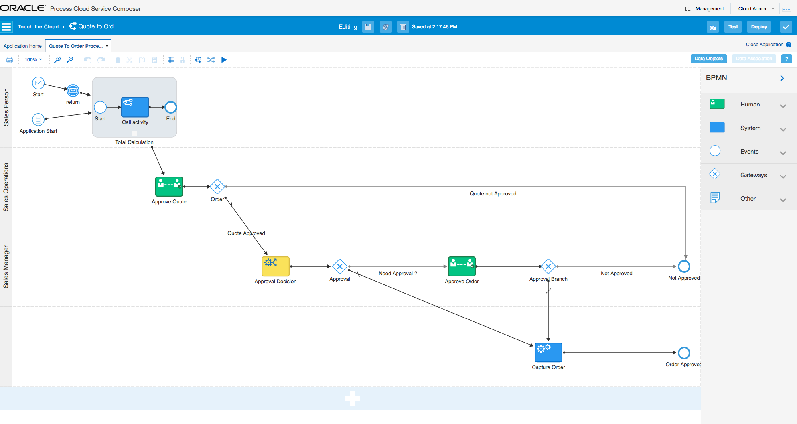

**4.3** Click on hamburger icon and select *Open Data Association*

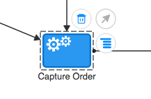 

**4.4** Now that we are in the Data Association page, we can assign the comment 

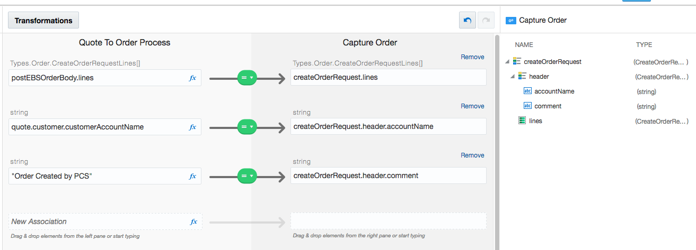

**4.5** Click **Apply**

### **5**: Editing Rules

**5.1** Back on the process model, click on the Approval Decision and select Open Decision

**5.2** Select the row ApprovalRule.in.limit, by clicking in the cell - the cursor will change to a right pointing arrow.

**5.3** Click on the Pencil Icon above table, then click on the Local Range Value Set	Pencil on the Add/Modify Page

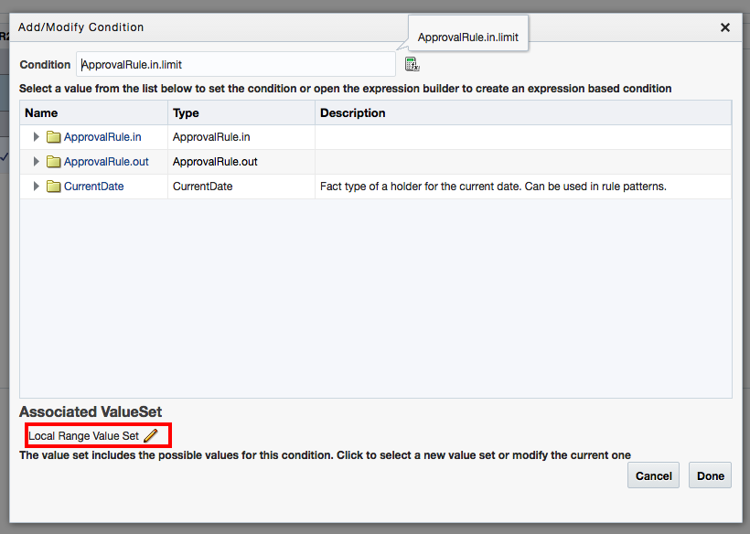

**5.4** Let's change the value to a lower limit, 5000 and also add human understandable aliases for the rule. To edit a cell, click in the cell and apply the changes as indicated.

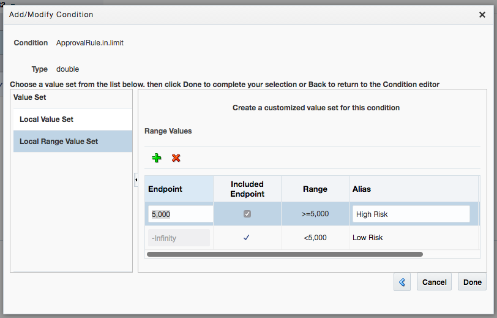

**5.5** Click on Done

- You will see the rules now display a more readable rules set

 

> Remember that this rule change would only be applied after deployment of the application.

### **6**: Adding Approvals

**6.1** First step is to add a swimlane to the process. A swimlane indicate the responsibility which will execute the action define within the lane. Click on the white plus sign at the bottom of BPM model.

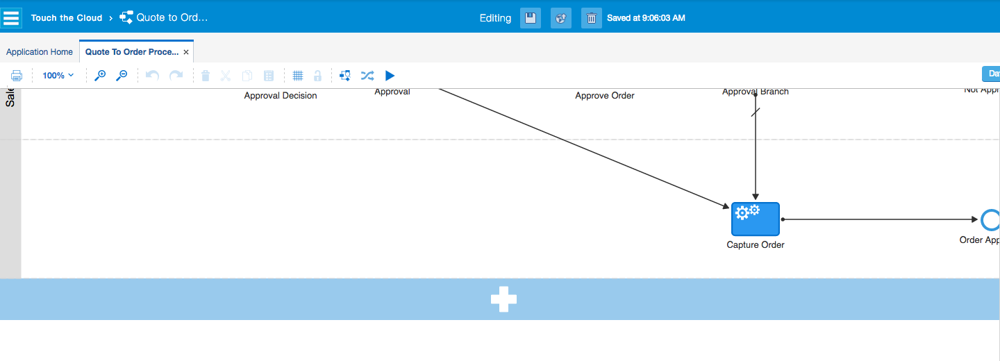

**6.2** Click on the newly created swimlane and select the pencil icon to edit the properties

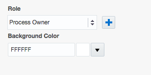

**6.3** Click on the plus sign next to Role to add Sales Director

**6.4** Next drag an Approve from the BPM Palette to the newly created **Sales Director** swimlane

**6.5** Drag the existing connection from **Approval** to the **User Task**

**6.6** Change the name, by double click on the text **User Task**

**6.7** Next we have to supply the properties for the **Sales Director Approval** task, as supplied in the screenshot below

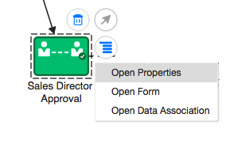

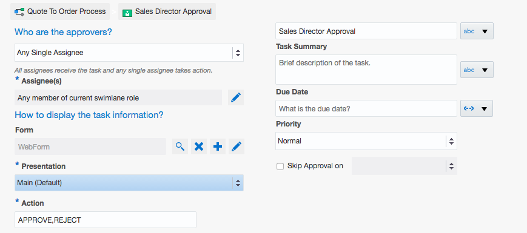

**6.8** Drag an exclusive gateway into the model, connect the human task **Sales Director Approval** with the gateway, then the gateway to the **Capture Order**, using the connector icon to create the connections

**6.9** Connect the gateway to the **Not Approved end** activity. Feel free to move the activities around to make it more readable

**6.10** With Connection highlighted, edit the properties and supply the following information, to test if the approval was rejected, by setting the condition to be **TaskOutcomeDataObject == "REJECT"**.

### **7**: Validating Changes

**7.1** Before we can go ahead and deploy the newly created application, we first have to validate if it is correct. Click on the **Check mark** in the right hand side of the screen.

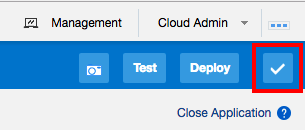

**7.2** You should see the following message, if not, look at the error codes and fix them.

### **8**: Deployment

**8.1** To deploy we need to create a snapshot

**8.2** Provide Comment and Name for snapshot (Other Options - check Make Snapshot)

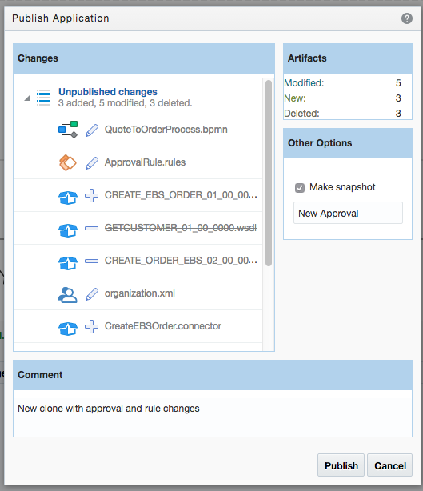

**8.3** Click on Management at top right hand of page

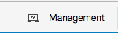

**8.4** Click on the hamburger icon next to My Server, and select deploy

**8.5** Follow the **Deployment Application to My Server** wizard

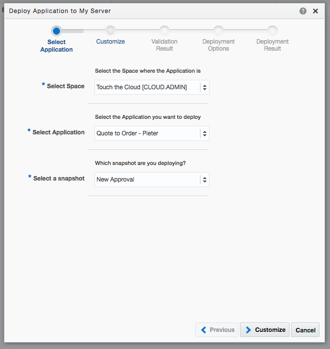

- Use cloud.admin and supplied password. Also remember to select your **Quote to Order -** ***USER(1-10)*** Application to deploy:

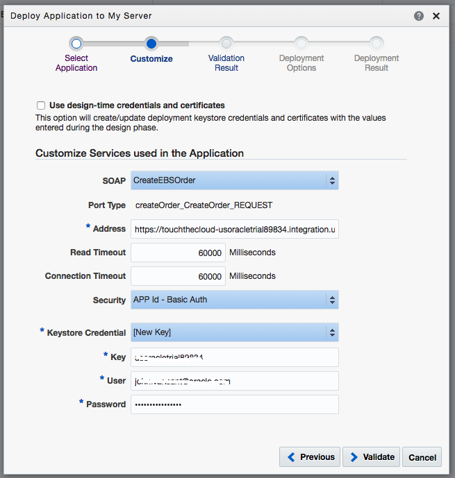

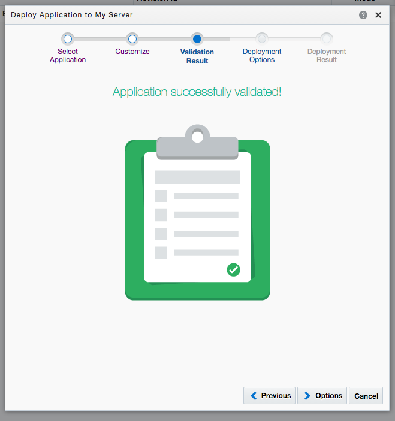

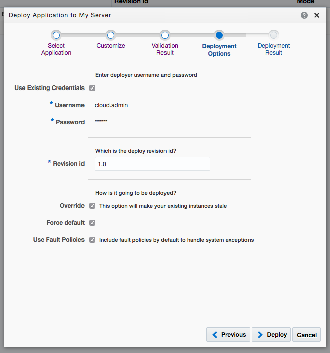

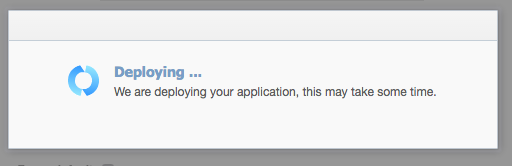

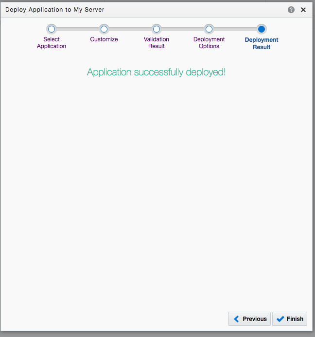

**8.6** Click on **Finish**

### **9**: Role Assignment

Now we have to assign physical users to the new **Sales Director** Role we have created.

**9.1** Click the PCS Home icon at top of page

**9.2** On the Workspace home page, click on **Configure**

**9.3** In left hand side, click on **Manage Roles**

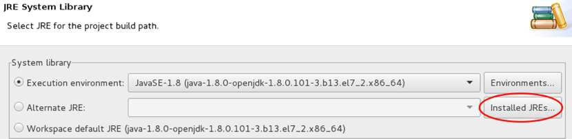

**9.4** Add ***Roland Dubois*** to the **Sales Director** role 

**9.5** Click OK

**9.6** Repeat the process for each of the roles in your application.

Here a list of users and allocated roles:

|Person        | Role            |
|:--------------|:-----------------:|
|Bala Gupta    | Sales Person    |
|John Dunbar   | Sales Manager   |
|Lisa Jones    | Sales Operations|
|Roland Dubois | Sales Director  |

# 

## Mobile Cloud Service 

In this section we are going to hook up our new changed process to the mobile application we have created in Lab 100.

---

Setup MCS to use your new deployed PCS process

1. Delete your ... Connector
2. PCS -> Designer -> Admin -> Copy your deployed WSDL (Click on Hamburger next to deployment)
3. Recreate your connector in MCS, using the WSDL URL obtained in 2

---------
### **3**: Create a Quote (***Optional, if you have not completed Lab 100***)

---

**Role: Bala Gupta, Field Sales (bala.gupta)**

In this step we are going to create some tasks to work on, if you have completed Lab 100, there should be a couple of task already available.

Login into the PCS Workspace as ***Bala*** (bala.gupta).

**3.1** On the PCS Workspace home page, click on the application **Submit Quote(1.0)**

  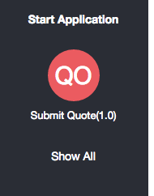

**3.2** Fill in the information requested information on the form

  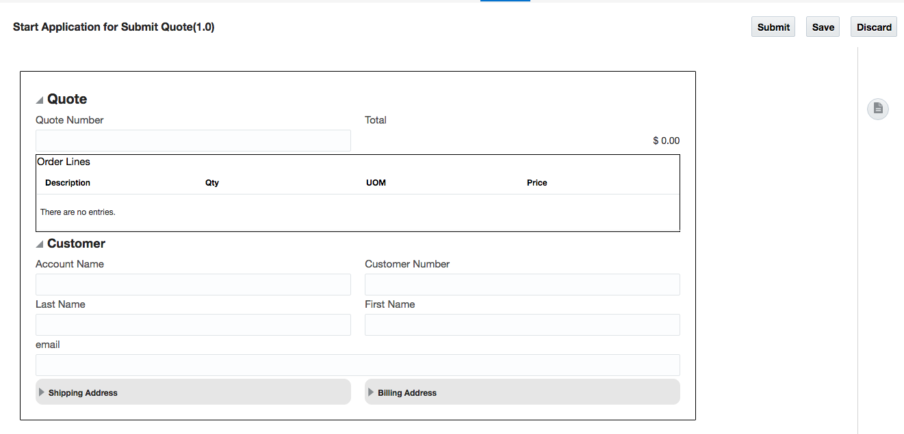

   For the fields use the following values:
   
   Quote Number: 4325
   
   Select a customer from the following table:
   
   |CustomerNumber| CustomerName                | AddressLine1          | AddressLine2       | Phone        | FirstName | LastName | City     | Country | Zip   | Email                         | 
   | :----------- | ----------------------------| ----------------------| ------------------ | ------------ | --------- | -------- | -------- | ------- | ----- | ------------------------------|
   | 1            | ABC Telecommunications      | 1021 Fifth Avenue     | New York, NY 10022 | 917-123-2345 | Vincent   | DiNatale | New York | USA     | 10022 | v.dinatale@abctelecomms.com   |
   | 2            | MedChoice - IDN             | 333 Lexington Ave     | New York, NY 10000 | 917-123-2346 | Louis     | Wohl     | New York | USA     | 10000 | louis.wohl@medchoice.com      |
   | 3            | Bronco Drilling Machinery   | 150 East 50th Street  | New York, NY 10023 | 917-123-2347 | Jack      | Thomas   | New York | USA     | 10022 | jack.thomas@broncodrilling.com|
   | 4            | BHB Technologies            | 522 West 38th Street  | New York, NY 10018 | 917-123-2348 | Robbie    | Hun      | New York | USA     | 10018 | robbie.hun@bhbtech.com        |
   | 5            | CIC Management Inc.         | 68 Church Street      | New York, NY 10000 | 917-123-2349 | Lucy      | Leu      | New York | USA     | 10000 | lucy.leu@cicmgt.com           |
   | 6            | ABC Application Software    | 536 Madison Avenue DE | New York, NY 10012 | 917-123-2350 | Lenore    | Soifer   | New York | USA     | 10012 | lenore.soifer@abcsoftware.com |
   | 7            | Capital Investments Group   | 400 Madison Avenue    | New York, NY 10024 | 917-123-2351 | James     | Roman    | New York | USA     | 10024 | james.roman@capitalinvest.com |
   | 8            | Carbon Chemical Corporation | 502 East 81st Street  | New York, NY 10028 | 917-123-2352 | Loren     | Gab      | New York | USA     | 10028 | loren.gab@carbon_chem.com     |
   | 9            | Capp Worldwide Services Inc.| 32 Ave of the Americas| New York, NY 10013 | 917-123-2353 | Paul      | Pub      | New York | USA     | 10013 | paul.pub@cappww.com           |
   | 10           | Astro-Energy Systems        | 35 East 76th Street   | New York, NY 10021 | 917-123-2354 | Jenny     | Roy      | New York | USA     | 10021 | jenny.roy@astro_energy.com    |
   
   For the items, use some of these inventory items, using UOM (unit of measure) as 'each':
   
   | ItemNumber | _Inventory Item ID_ | Description                        | List Price Per Unit |
   | :--------- | ----------------- | ---------------------------------- | -------------------:|
   | 1          | 155               | Sentinel Deluxe Desktop            |              1969.00|
   | 2          | 249               | Hard Drive - 250GB SSD             |              899.00 |
   | 3          | 436               | Lightning Inkjet Printer           |              300.00 |
   | 4          | 2848              | Vision Pad DX - Mobile Computer    |              249.00 |
   | 5          | 190878            | Vision Pad X100 - Mobile Computer  |              249.00 |
   | 6          | 2155              | Sentinel Standard Desktop - Rugged |              1900.00|
   | 7          | 174762            | 205 Digital Camera                 |              215.00 |
   | 8          | 12023             | Digital Camera, Professional       |              487.80 |
   | 9          | 12031             | Television 102"                    |              3749.99|
   | 10         | 12029             | Television 96"                     |              2608.69|

**3.3** Click on the Submit button to start the Quote to Order process.
