  

Update: March 23, 2017

# Lab 300 - Integration Cloud Service

---

## Objectives

- Part 1: Explore Integration Cloud Service (ICS)
- Part 2: Use ICS to modify an integration
- Part 3: Modify PCS Process from Lab 200 to Call New ICS Integration

## Required Artifacts

- The following lab and an Oracle Public Cloud account that will be supplied by your instructor.

## Introduction

This is the third of several labs that are part of the **Oracle Touch the Cloud** workshop. 

In this lab, you will acquire a good overview of the Oracle Integration Cloud Service (ICS), the next generation integration platform. You will explore various consoles and tools available to interact with your integration. The exercise will get your familiar with all the tooling available to work with this cloud service. You will then modify an integration to Oracle EBS, then update a PCS application to call to the updated ICS endpoint.

# Part 1: Explore Integration Cloud Service

In this first part of the lab, we will explore the main parts of Integration Cloud Service (ICS).  We’ll look at the following:
1.	Oracle Cloud Services Dashboard
2.	ICS Designer User Interface
3.	ICS Monitoring User Interface

Let’s start by logging into the Oracle Cloud account and explore the Services Dashboard

## 1.1: Explore the Oracle Cloud Dashboard

### **1.1.1**: Login to your Oracle Cloud account

---

- From your browser (Firefox or Chrome recommended) go to the following URL:
https://cloud.oracle.com
- Click Sign In in the upper right hand corner of the browser
- **IMPORTANT** - Under My Services, change Data Center to `US Commercial 2 (us2)` and click on Sign In to My Services

    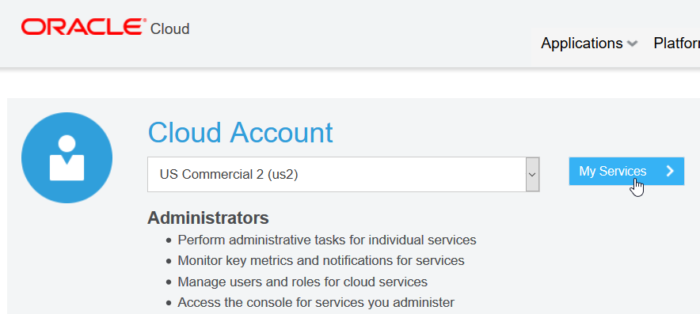

- If your identity domain is not already set, enter it and click **Go** (do not check to box to save it because this will set a cookie in the browser that needs to be cleared if you need to change identity domains later)  

    **NOTE:** the **Identity Domain** values will be given to you from your instructor.

      

- Once your Identity Domain is set, enter your `User Name` and `Password` and click **Sign In**

    ***NOTE:*** the **User Name and Password** values will be given to you by your instructor.

    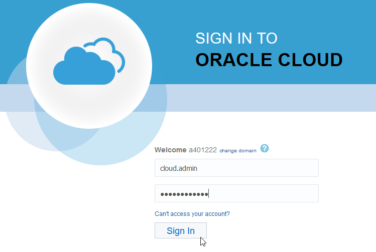  

- You will be presented with a Dashboard displaying the various cloud services available to this account.

   **NOTE:** The Cloud Services dashboard is intended to be used by the *Cloud Administrator* user role.  The Cloud Administrator is responsible for adding users, service instances, and monitoring usage of the Oracle cloud service account.  Developers and Operations roles will go directly to the service console link, not through the service dashboard.

    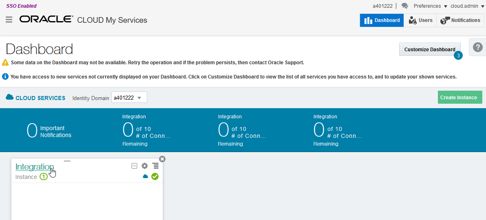

### **1.1.2:**	Explore Oracle Cloud Dashboard

---

The Cloud Dashboard is the launching pad for all the cloud services in your account. You have access to the following Cloud service: **Oracle Integration Cloud Service, Oracle Process Cloud Service, Oracle Database Cloud Service, Oracle Database Backup Service, Oracle Storage Cloud Service, Oracle Compute Cloud Service, Oracle Java Cloud Service and Oracle SOA Cloud Service**.

- To look at the details for the Integration Cloud Service (ICS) instance, first click on the `hamburger` icon, then click on the `View Details` link.

   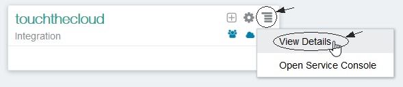

- The `Service Details` pages will show various important details about the ICS service instances in this identity domain such as: uptime, service start and end dates, and your Oracle Cloud subscription ID.

   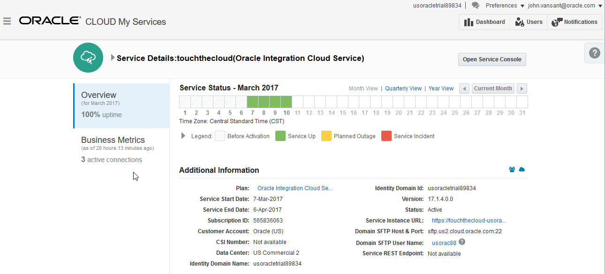

- Access to `Business Metrics` can be found in the left-hand navigation.  Select the `Business Metrics` tab as shown below:

   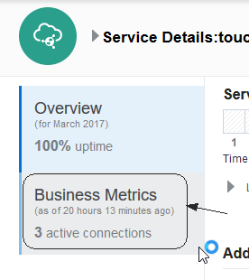

- The `Business Metrics` page will show the total number of messages that ICS has processed and the total number of active connections currently in the subscription.

   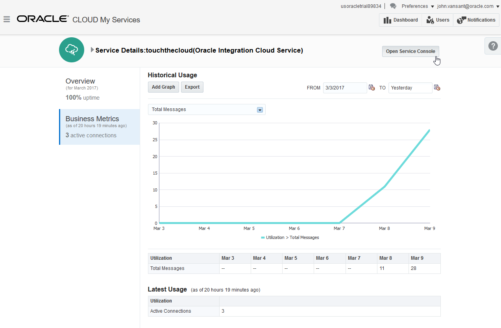

- After getting familiar with the Business Metrics, select the `Open Service Console` button to go to the ICS Service Console.  

    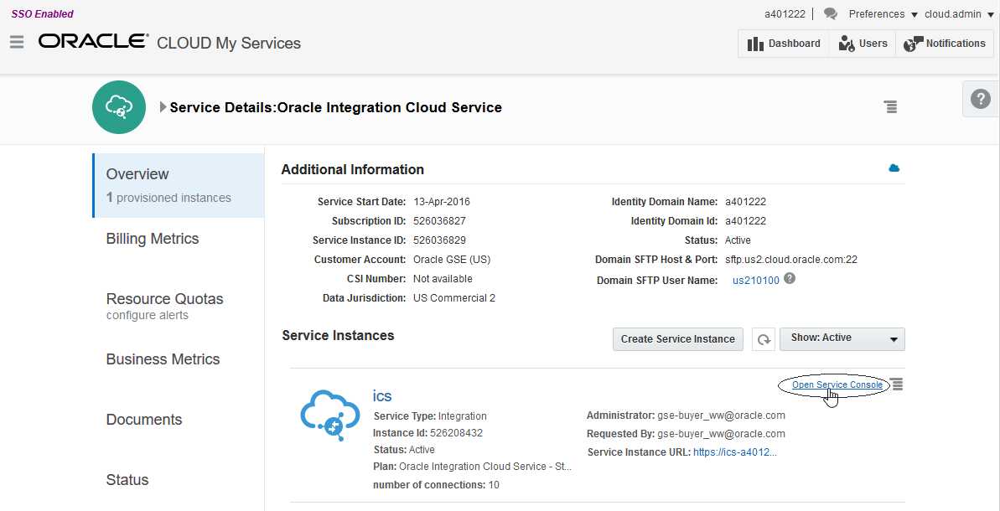  

- You will now be presented with the ICS Service Console from which you will be performing the rest of this workshop lab.

    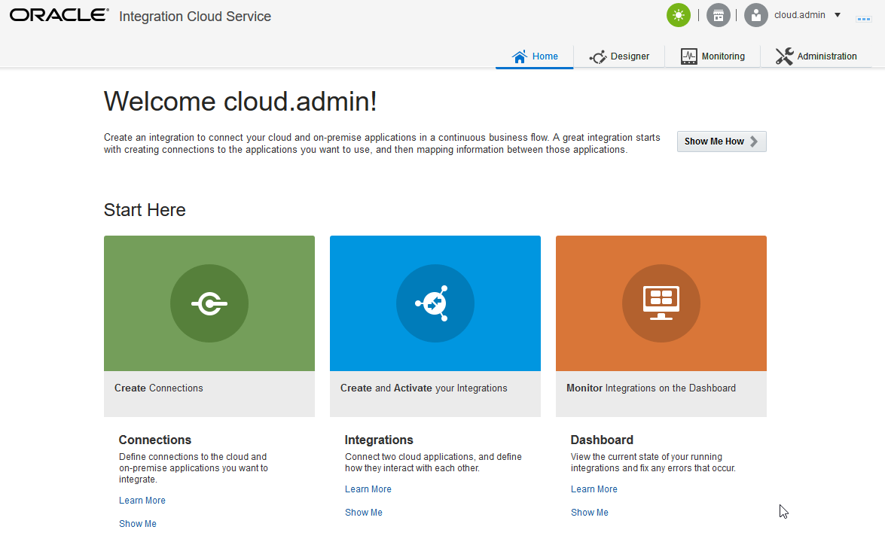  

## 1.2: Explore the ICS Designer User Interface

### **1.2.1:**	Open the ICS Designer

---

- **Click** on the `Designer` tab in the upper-right corner of the ICS Service Console to navigate to open the ICS Designer.

      

- You will be presented with the ICS Designer Portal:

      

### **1.2.2:**	Explore ICS Connections

---

- Select the `Connections` graphic in the designer portal

    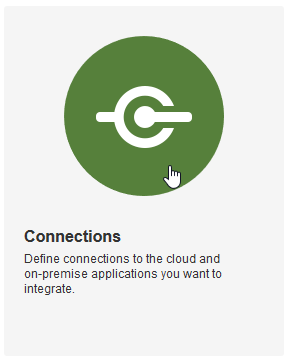  

- Make note of the connections that have been created. Notice that there are three connections, one called *eBusiness Suite OPERATIONS*, one called *eBusiness Suite DB APPS* and the other called *Create Order*.

    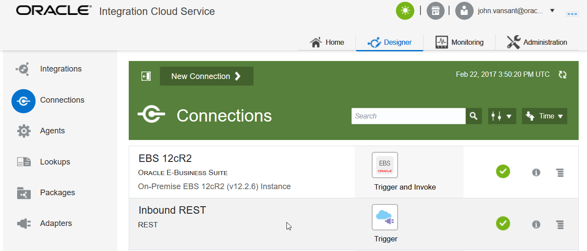  

- Note that both *eBusiness Suite OPERATIONS*, and *eBusiness Suite DB APPS* are using the ICS Connectivity Agent.  You can identify this by the note that it has an associated agent group.  This agent allows ICS to call on-premise systems.

     

*(More information about the ICS Connectivity Agent will be given later)*

- Click on the `New Connection` button so we can see all the different ICS Connectors that are available.

   

- Scroll through the list of connection types that are available in ICS:

   

- Note that the icons with the plug are those that support the ICS Connectivity Agent for those service types which are not in the cloud, but on-premise, behind the company firewall.

- When you are done browsing, select the “Cancel” button to dismiss the “Select an Adapter” dialog.

### **1.2.3:**	Explore ICS Integrations

---

- Select the `Integrations` link from the navigation bar on the left of the Connections designer console

    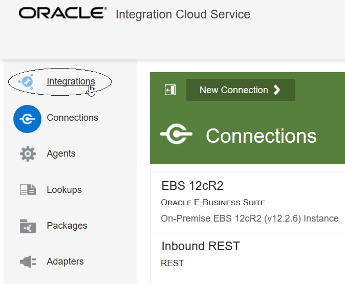  

- Make note of the integrations that have been created. We will be working with the integration called *Create EBS Order*.

    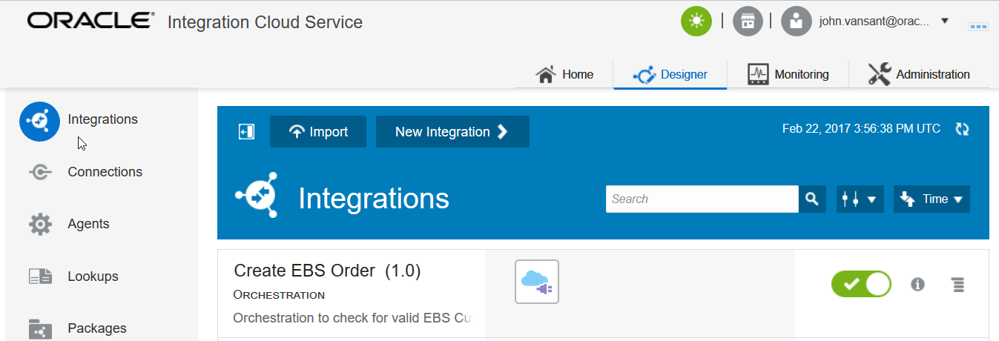  

- Open the integration `Create EBS Order` by clicking on the integration name.  We want to see what it looks like.  Since the integration is already active, we’ll be looking at it in `Viewing` mode.

   

- You can see that this orchestration has many steps in it.  The view of the orchestration is *Zoom to Fit* in the browser real estate.  In order to get a closer view of the individual steps, you can either scroll with your mouse wheel to zoom in and out, or you can use the *-/+* slider in the top right of the designer.

- Try zooming in and out by using both methods.  

- If you get zoomed-in too close and want to pan, you’ll be able to move around the orchestration using the Pan window by clicking on the dark area and moving around.

   

- Selecting the Home icon (the little house) the drawing gets reset to a zoomed in view with the orchestration trigger at the very top.

   

- Try selecting the `Maximize` viewing control on the very right of the view control bar.  This will hide some of the detail on top of the screen to give the designer the most area to work in.  Hitting the `Maximize` button again will toggle that view.

   

- Let’s look at some of the components of the integration.  Select the `Home` view button again to reset the view.

- The component at the very top of the orchestration is the `Trigger`.  The trigger is representative of the connector that’s sending data into the integration.

- If you hover over the Trigger node, you can see the details.  Our trigger is a SOAP connector type.  It is called *CreateOrder* and it is using the connection named *Create Order* that we looked at before in the Connection section of the ICS Designer.

   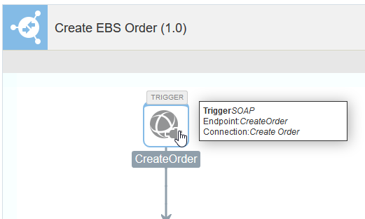

- If you click on the Trigger, a pop-up will appear with a view icon.  Select the little eye on the view icon so we can walk through the wizard that was used to setup the SOAP trigger.

  

- After the wizard initializes, you’ll be shown the basic information about the trigger – it’s name and description.

   

- Select the `Next` button to see the `Operations` that were configured for this SOAP Trigger.  Details like the Port Type, Operation, and request and response objects are shown.  In our case, no special SOAP headers were needed so that was set to `No`.

   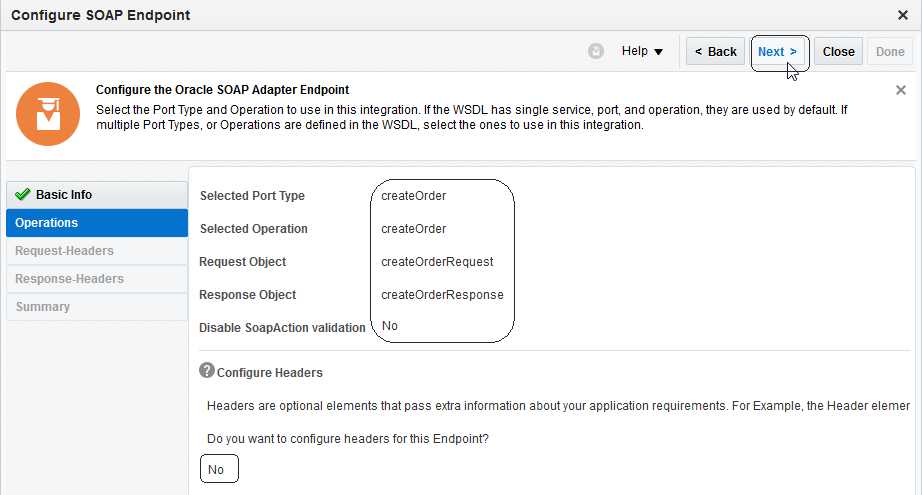

- Select `“Next` again to see the `Summary` of the Trigger’s configuration.  The SOAP WSDL was uploaded to ICS when the connection was first configured, not in the wizard to configure the Trigger.

   

- Select the `Close` button to dismiss the Trigger view wizard.

- Let’s view the next node down in the integration.  This is an *Assign* node.  The job of this Assign activity is to initialize variables that will be used in the calls to be made to the eBusiness Suite.

   

- The variables defined in this Assign activity are greyed-out because we are only viewing them.  Later on in this lab, we’ll de-activate the integration and all the values will be changeable.  These variables are constants that are needed for the EBS API call for creating an order.  You can see that variables such as the *EBS responsibility*, *application*, *security group*, and *OrgId* are needed.  Using variable rather than hard-coding these in the mapping for the adapter is preferable because they can be re-used across multiple EBS adapter invocations if necessary.

   

- Select the `Exit Assignments` button in the upper-left to go back to the view of the orchestration.

- Back in the view of the orchestration we want to explore some of the nodes toward the bottom.  You can pan directly in the design window by clicking & holding the mouse button down in the background of the design palette, then you can pan up and down.

   

- Pan down to the map called `createEBSOrder`.  Click on this map activity and select the view icon.  We are going to see the values that are mapped into EBS.

   

- This is the most complex mapping in this integration because the EBS API we’re leveraging has thousands of attributes that can be passed.

- What you’ll see in the mapper is the possible input variables on the left and the EBS inbound variables that can be mapped to on the right.  The values that have been mapped are shown to the right of the EBS inbound variables in the mapper.

- In order to simplify this view, we want to `Filter` the Target variables.  Select the `Filter` button above the Target section and then select the radio button labeled `Mapped`, then select the `Apply` button.

   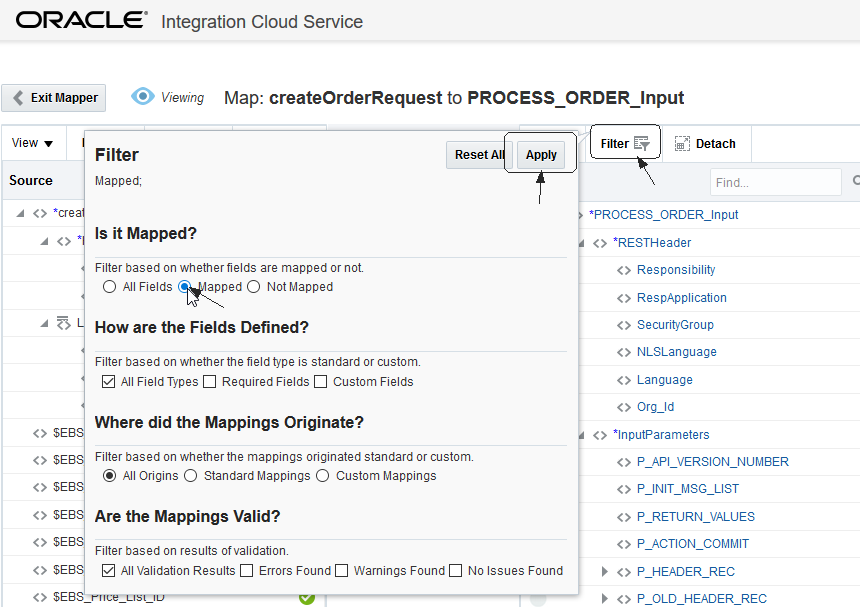

- Now we only see variables in the Target that have been mapped from a Source variable.  If you want to get a visual depiction of where a Target variable has been mapped from, select the little green checkbox to the very left of the Target variable.  This will make a line visible from the Source variable to the Target.

   

- Note that the icon next to the `P_LINE_TBL_ITEM` has a double bar on top of it.  This indicates that it is a variable that can have multiple values in it (an array).  The ICS mapper automatically adds the `for-each(Lines)` function to that mapping so all possible order lines passed in from the Source will be mapped to the EBS adapter’s invocation.

- Once you are done exploring this complex ICS map, select the `Exit Mapper` button in the upper-left to return back to the ICS orchestration.

- One last orchestration node we want to explore is one of the *Database Adapter* invocations.  Click on the database adapter call just above the `createEBSOrder` which is called `getCustomerShipToInfo`.   When you click on the little eye icon to view it, the DB Connector wizard will initialize.

  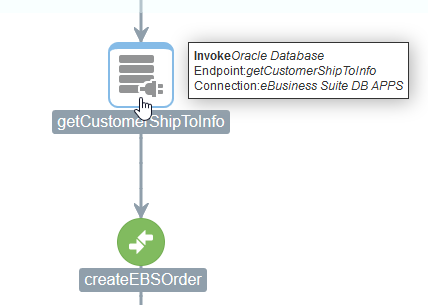

- Along with the basic information about this invoke activity like the name and description, you can see that this connection is being used to execute a SQL query on the EBS database from ICS.

  

- The SQL query being run can be examined.  This query is joining together 6 tables to provide the shipping information needed to create the EBS order for the customer.

  

- Select the `Close` button now that we have seen the SQL used in the Database Adapter invocation to the EBS Oracle Database.

- Note that ICS also has Database adapters for *MySQL*, *DB2*, and *SQL Server*.

- We’ve spent a lot of time exploring the `Create EBS Order` integration.  Let’s move on and explore the Agent setup.  Select the `Exit Integration` button in the upper-left to navigate back to the ICS Designer.

  

### **1.2.4:** Explore ICS Agents

---

- Select the `Agents` link from the navigation bar on the left of the Integrations designer console

    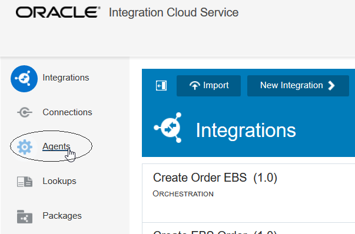  

- Make note of the agent that has been created to communicate with the EBS instance called *EBS Agent*.

   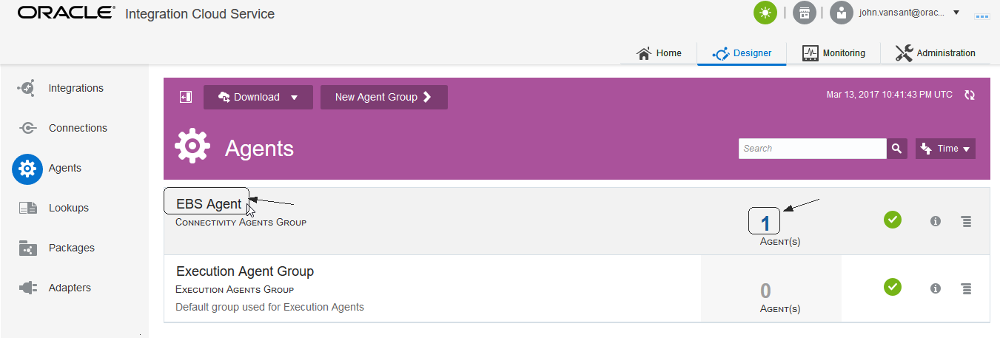  

- Selecting the `1` shows the on-premise connectivity agent that is registered with the *EBS Agent* agent group.

   

- The agent identifier along with the ICS version is shown in the details.  You can also remove the agent by selecting the `X` to the right of the dialog. Click on the `X` so you can see the connections that are currently associated with this agent.

   

- You can see that both the *eBusiness Suite DB APPS* and *eBusiness Suite OPERATIONS* ICS Connectors are both using this agent so you can’t just remove it without first removing the references to it in those connections.

- Select the `Close` button twice to dismiss the `“Agent Is In Use` and `Agent` dialogs.

- This Connectivity Agent was installed on the EBS system so it could have access to the on-premise EBS APIs.  EBS Business Events and XML Gateway messages are available for inbound integrations in Oracle Integration Cloud Service when adding the Oracle E-Business Suite Adapter as a trigger (source) connection in an integration. If the Oracle E-Business Suite Adapter is added as an invoke (target) connection, PL/SQL APIs and Concurrent Programs are available as REST services for invocation from Oracle Integration Cloud Service. In this workshop we are using an EBS PL/SQL API as a target connection.  The architecture of the ICS Connectivity Agent as used by the EBS Adapter is shown below:

   

- The Connectivity Agent is available from the `Download` pull-down on the Agent page shown below:

   

- The `Execution Agent` that you see in the download dropdown is a version of ICS that can run on-premise behind the customer firewall.  You can use ICS both in the cloud and on-premise for creating integrations.

## 1.3: Explore the ICS Monitoring User Interface

### **1.3.1:**	Open ICS Monitoring Console

---

- In the upper right corner of the ICS Portal, click the `Monitoring` tab.  The `Monitoring Tab` is where you go to see how your activated integrations are working at runtime. 

   

### **1.3.2:**	Explore ICS Monitoring Console - Dashboard

---

- By default, you will be presented with the ICS Monitoring Dashboard.  Observe the various data that is available from this dashboard such as *% of successful messages*, *# of Connection Currently Used*, etc.

    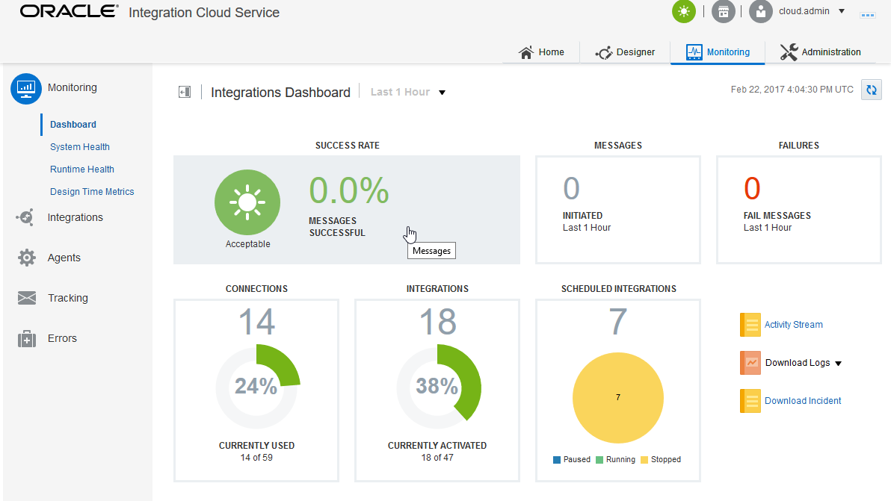  

- On the right side of the `Dashboard` there are links where you can view the `Activity Stream`, Download the logs, and Download an Incident if a service request needs to be raised.

- Click on the Activity Stream link

   

- You will be directed to the `Runtime Health` screen where you can view a summary of all messages that have passed through ICS in both chart form and numerical rollup form.

   

- In the `Activity Stream` at the bottom of the page you can see the steps in the *Create EBS Order* integration that were executed and whether or not they were successful.

### **1.3.3:**	Explore ICS Monitoring Console - Logfiles

---

- In order to see the details of the payload that passed through the ICS integration, you need to download the Activity Stream Log from the `Download Logs` link on the right of the Activity Stream.

- Select the `Download Activity Stream` link and then save the zipfile to a location on your workstation such as *C:\temp* (Windows path)

   
   

- Extract the zipfile and you’ll see that there are 2 directories of logfiles – this is because the ICS instance is running on a cluster of 2 servers for high availability.

   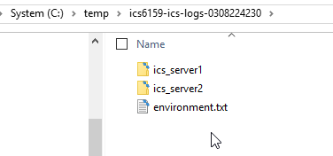

- Navigate into one of the server directories and examine the `ics-flow.log` file in your favorite text editor.

- Here is a view of the end of the *ics-flow.log* file in the *Notepad++* text editor showing the response given by EBS of the order payload after a successful execution of the create order API call:

   

- This logfile is helpful for investigation during development or runtime analysis.  The capture of the runtime payloads can be turned on or off during activation of the ICS integration where you are prompted whether or not you want to save the payloads.

### **1.3.4:**	Explore ICS Monitoring Console - Integrations & Errors

---

- Back in the ICS Monitoring console, select “Integrations” from the left-hand navigation.

- Note that all the statistics of the “Create EBS Order” are shown.

   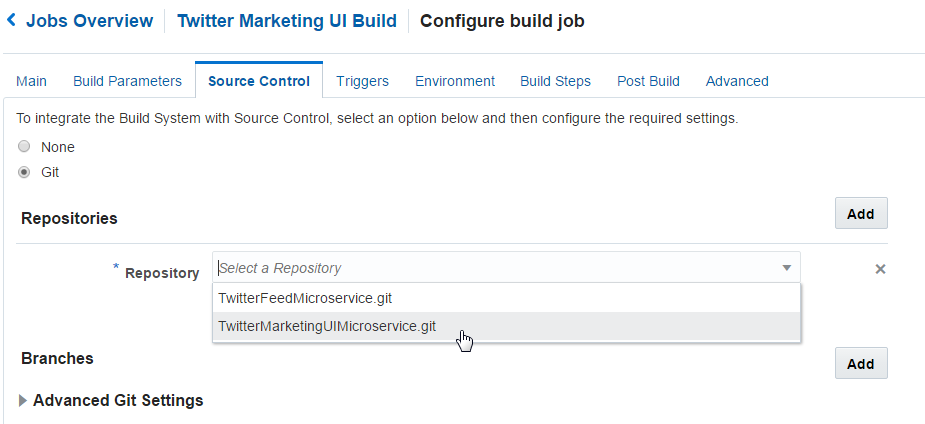

- We are wondering why there were 4 errors in the integration?  (**Note:** during the lab there may not be any errors in the integration flows like there were when this lab was written.  If not, just review the documentation below to see how the ICS monitoring can be used to pinpoint the error)

- Click on the `Errors` link beneath the red letter 4 to drill into the error details.

   

- You are directed to the ICS `Error Message Details` screen where all 4 of the failed ICS instances are listed.

- Click on the grey warning icon  on the right of the instance error description to see the details of the error.

- You can see that there was a timeout in this integration of 120 seconds.

- We want to see which step the timeout occurred on.  Click on the integration instance name so you can see the flow of this instance and where it failed.

   

- This leads us to a graphical view of that particular integration flow instance detail.

- Zooming in, we can see that everything was fine with the flow until the *createEBSOrder* API was called – this is where the flow line turns red.

  

- This shows us that the API call was timing out.

- On investigation with the EBS system, it was found that the API was down because the EBS HTTP server (Oracle HTTP Server, OHS) was not running.  Starting OHS up on EBS made the API available and now the integration is up and running again.

- Select the `Exit Instance` button to go back to the ICS Error Message Details Monitoring console.

  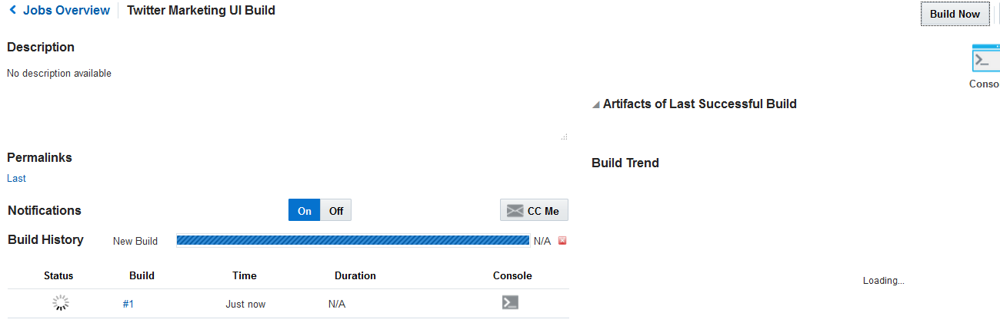

### **1.3.5:**	Explore ICS Monitoring Console - Agents

---

- Now, select `Agents` from the left-hand navigation.

- From the `Agents` monitoring console, you’ll be able to see if the ICS Connectivity Agent is up or down.  The green *sun* or *light* icon indicates that the Connectivity Agent is running fine.

  

### **1.3.6:**	Explore ICS Monitoring Console - Tracking

---

- Select the `Tracking` link in the navigation bar on the left

  

- The ICS `Tracking` monitor page shows all integration flows that have been executed.

- Select the chevron just to the right of the *Tracking* label at the top of the page to change the granularity of the Tracking report to `Last 6 Hours`

   

- Next, drill into a `COMPLETED` integration flow by selecting the integration name like we did while tracking down the Error earlier.

   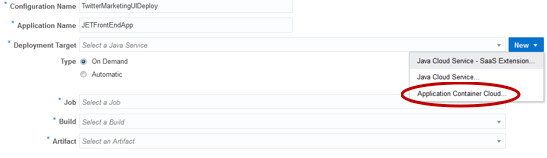

- We can now see that all steps in the this ICS integration flow were successful because the arrow is green highlighting all the orchestration flow steps.

   

- Select the `Exit Instance` button to go back to the ICS monitoring page.

   

- We are now done exploring the ICS monitoring features.

# Part 2: Use Integration Cloud Service to Modify an Integration

In this second part of the lab, we will change the *Create EBS Order* ICS integration in order to support the new requirement of adding a comment to the EBS order from the mobile application.  The following steps will be followed in this part of the lab:
1.	Clone an existing ICS integration
2.	Modify the integration to support the new comment field
3.	Update ICS tracking to include the comment
4.	Re-Activate and Test the updated orchestration
Let’s start by logging into ICS and cloning an existing integration.

## 2.1: Clone an existing integration

### **2.1.1:**	Open the ICS Design Console

---

- Open the ICS Service Console.  (Steps to do this were outlined in the first part of this lab when we were exploring ICS)

- Select the `Designer` tab on top of the ICS Service Console to go to the `ICS Designer Portal`.

- Select the `Integrations` icon

   

### **2.1.2:**	Clone the integration

---

- Click the `Hamburger` icon   just to the right of the *Create Order EBS* integration.

- Drop down to the `Clone` menu selection so we can make a working copy of the current working *Create Order EBS* integration.

   

- In the `Clone` dialog that comes up, enter the new name of the cloned integration.  Since there may be multiple participants in this lab, use your assigned user # as a prefix with *Create EBS Order* at the end.  In the following example, *demo.user01* was assigned so the name of the cloned integration is *User 01 Create EBS Order*

   

- After entering the name, select the `Clone` button in the lower-right of the dialog.

- You will now see that your new cloned integration is ready to edit as it’s in the `de-activated` state.

   

- Select the integration name in order to edit it.  In the image above `User 01 Create EBS Order` is the hot-link to select.

## 2.2: Edit the mapping to the EBS update service call

### **2.2.1:**	Navigate to the mapping *createEBSOrder*

---

- Since there are many steps in this orchestration style integration the text on each step is difficult to read.  In order to quickly zoom-in, select the `Home` icon in the view control bar in the upper-right.

   

- The *createEBSOrder* mapping step is toward the bottom of the orchestration.  As shown in the first part of the lab, by clicking and dragging your mouse in the background you can pan down the orchestration steps.

   

### **2.2.2:**	Open the mapping *createEBSOrder* for editing

---

- The *createEBSOrder* mapping orchestration step is just above the corresponding *createEBSOrder* API invocation.

- Click on the double arrow mapping symbol to pop-up the edit pencil.

- Click on the little pencil to edit the mapping.

   

### **2.2.3:**	Map the new *Comment* field

---

- Once the mapping is displayed, we need to expand the target node that we will map the inbound `Comment` field to.

- We are going to map `Comment` source to the target called `ATTRIBUTE1` which is in the `P_HEADER_REC` section of the Target payload.

- Select the little arrow icon  just to the left of the `P_HEADER_REC` in the Target payload to expand it and expose `ATTRIBUTE1`.

   

- Now that the `ATTRIBUTE1` variable can be seen, we can map the `Comment` source variable to it by dragging the little circle just to the right of the `Comment` variable over to the `ATTRIBUTE1` circle.

- Click and hold on the circle just to the right of the `Comment` Source variable then drag it on top of the little circle just to the left of the `ATTRIBUTE1` Target variable.

   

- Release the mouse on the little circle just to the left of the `ATTRIBUTE1` Target variable.

   

- You will now be able to see the two variables mapped together by the green line connecting them.  Also note that the `Comment` field is shown as the mapping to the right of the `ATTRIBUTE1` variable.

   

- Now we need to select the `Save` button to save our mapping changes

   

### **2.2.4:**	Testing the Updated Mapping

---

- ICS has a built-in test harness so that you can see if the changes you made to your mapping actually work.

- First, select the `Test` button just below the `Save` button just pressed.

   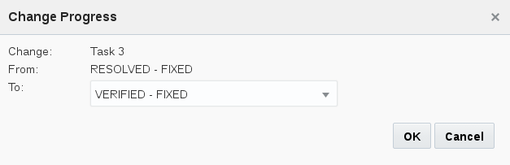

- Next, select the `Generate Inputs` button in the upper-right of the testing window.

   

- We want to put some interesting comment in the input `<ns0:Comment>` element in the `Input: createOrderRequest` incoming payload.

- Edit the data in the generated inbound payload to something custom.  In this example it was set to *This is my Comment!*

   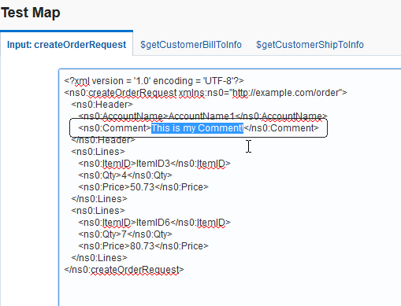

- Now that the input data is ready, select the `Execute` button in the upper-right of the test window.

   

- The mapping will be applied to the generated input data and the result will be shown in the `Output: PROCESS_ORDER_Input` section on the right side of the test window.

- Look for your custom comment and note that it has been mapped to the `P_HEADER_REC` -> `ATTRIBUTE1` element.

   

- Now that we have seen that our mapping has been successfully modified, we can close the test window.

- Select the `Close` button in the lower-right of the test window.

   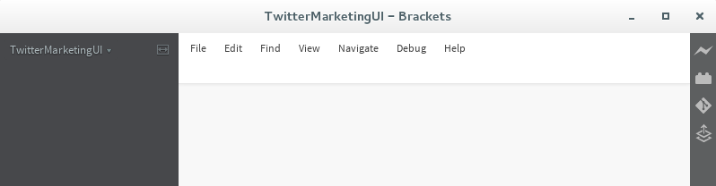

- Now we can close the Mapping Editor because our changes have been made and tested.

- Click on the `Exit Mapper` button in the upper-right of the Mapping Editor.

   

- Save your changes made to the cloned integration by pushing the `Save` button in the upper-right of the integration.

   

## 2.3: Add Tracking to the Integration

### **2.3.1:**	Open the “Tracking” editor

---

- We want to add the *Comment* we just mapped as a `Business Identifier`.  Business Identifiers enable runtime tracking on messages.  These identifiers will be saved in ICS’s monitoring tab for each instance of the integration that is run.

- Click on the `Tracking` button next to the *Save* button to bring up the business identifier editor.

   

### **2.3.2:**	Add a “Business Identifier”

---

- The `Business Identifiers For Tracking` editor will be opened up

   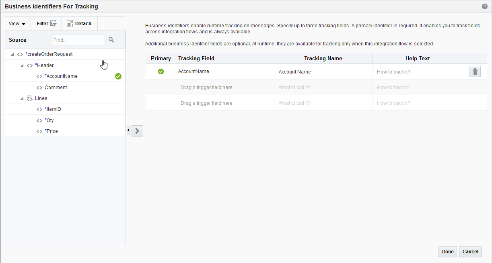

- Click on the *Comment* variable in the Source variable section.  The editor will show the metadata for this variable such as type, path, etc.

- Next, click on the `Shuttle Icon` to move the *Comment* variable over to be a new `Tracking Field`.

   

- Observe that the *Comment* variable has now been added as a `Tracking Field`.  The source variable name is also added as the `Tracking Name` by default – since *Comment* means something and is suitable for people to read in the monitoring tab we’ll keep it. If the comment variable was something random like *C2EF*, we would want to change it and give it a human-readable tracking name.

- Select the `Done` button now that the new `Business Identifier` has been added.

   

- Once again, click on the `Save` button to save the tracking changes.

   

- All modifications have now been made to the cloned integration.

- Select the `Exit Integration` button to go back to the ICS Designer Portal.

   

## 2.4: Activate Changes to the Integration

### **2.4.1:**	Select the “Activate” switch

---

- Click on the *Activate* switch/slider on the right of the cloned `Create EBS Order` integration.

   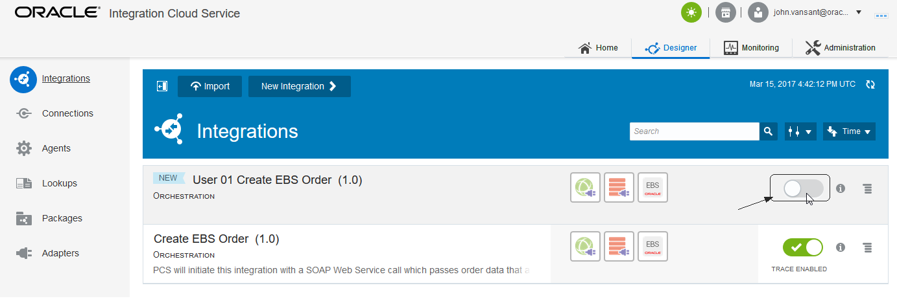

- The `Activate Integration?` dialog will be displayed

- Select the *Enable tracing* button since this isn’t a production deployment.  This checkbox will tell ICS that the payloads for each instance of the integration will be saved in the logfiles as explored in the first part of this lab earlier.

- Now select the *Activate* button to begin activation of the integration.

   

- The progress bar of the integration activation will move across the `Activate Integration?` dialog box.

   

- Once the integration is activated you will see that the activation slider now is colored green with a checkmark in it.

- A message will appear on the top of the ICS Designer Portal indicating that the integration activation was successful.  The WSDL for the service endpoint will also be displayed.

   

### **2.4.2:**	Check the Service Endpoint

---

- Click on the WSDL link so we can ensure that this integration has an available service endpoint.

   

- The WSDL for you new ICS integration will now be displayed in your browser.

   

- Now that we have a modified integration with a new service endpoint, we need to update PCS so that the comment sent in from the mobile application can be passed into ICS.

# Part 3: Testing the New ICS Integration from PCS

Now that we have a new ICS integration mapping the *Comment* field to the EBS order, we need to update the PCS process with the new ICS endpoint.
Using the PCS Process from the previous lab we’ll now go through the steps necessary to do this.

### **3.1:**	Update PCS Process with the New ICS Service

---

- First, get back into the PCS Composer and open up the PCS process you created in Lab 200 by clicking on the PCS Application name.

- In the screenshot below, we are using the process created with user `demo.user03`:

   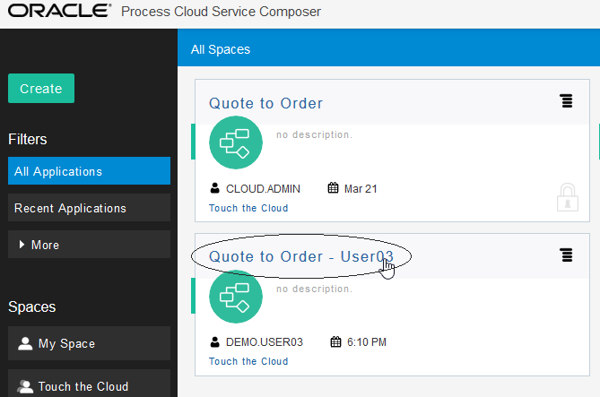

- Open up the *Quote to Order Process* process by clicking on it:

   

- Ensure that the process is in *Edit* mode by selecting the pencil icon in the top middle of the editor window.  If the process is not in edit mode, it will be shown in *Viewing* mode as shown below:

   

- Pan over to the *Capture Order* service call, click on that activity and then select the *Open Properties*:

   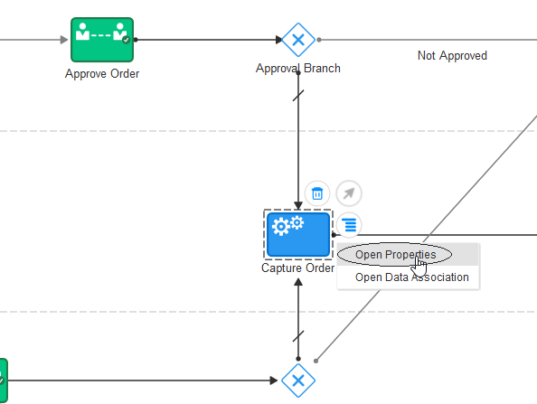

- Edit the service call by clicking on the small pencil icon on the right of the *Service Call* dropbox.

   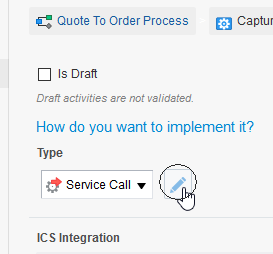

- Select the `Plus` (`+`) icon to the right of the ICS integration endpoint:

   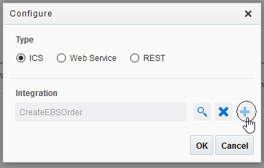

- Now select the new ICS integration that was created in the previous part of this lab, then select the *Next* button.  In the screenshot below, the integration for the *demo.user03* user is shown:

   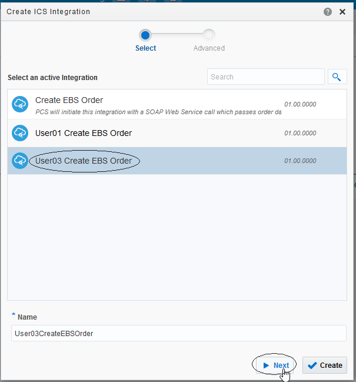

- In the Advanced service configuration dialog, select *APP Id – Username Token* for the Security.

- Select *[New Key]* for the Keystore Credential and give it a name that matches the user you have been given for the lab… something like *demo.user03.key*

- Input the username/password given to you for the workshop.  In the screenshot below, the user *demo.user03* is shown.

- After inputting all this info, click on the *Create* button:

   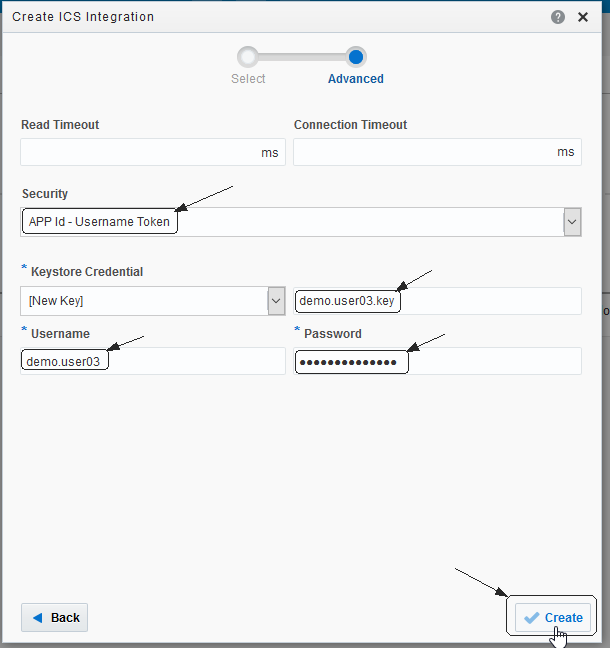

- Select the *OK* button back in the *Configuration* dialog:

   

- Collapse the properties window at the bottom of the PCS Composer by selecting the small down-arrow at the right hand side of the properties section:

   

- Now we need to map some data to the new ICS *Comment* field.

- Click on the *Capture Order* service activity and then select *Open Data Association*

   

- Drag-and-Drop the *comment* field from the new service endpoint’s *Capture Order* input to the empty textbox at the bottom of the *Capture Order* section of the *Transformations* Data Association.

   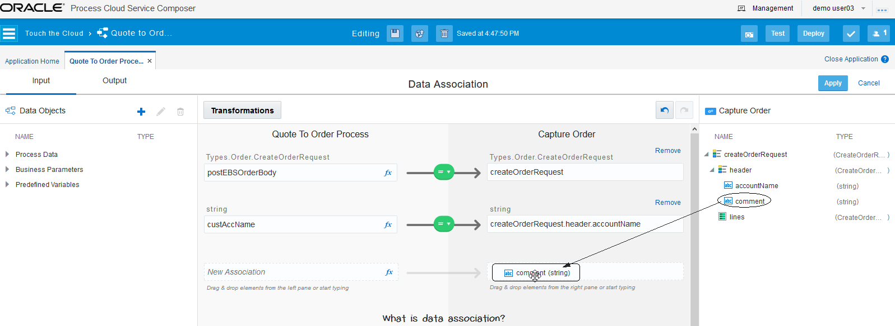

- For now, enter the hard-coded text *Comment from PCS* in the corresponding empty textbox at the bottom of the *Quote To Order Process* section of the *Transformations* Data Association.

- After that data association has been made, select the *Apply* button in the upper-right of the *Data Association* window.

   

- Save the changes made to the PCS process by clicking on the diskette icon in the middle of the top blue header bar:

   

- You are now ready to publish your changes

### **3.2:**	Deploy the Updated PCS Process

---

- The first step in deploying is to publish the process.

- Select the little *globe + arrow* icon in the middle of the top blue header bar:

   

- Select the *Make Snapshot* checkbox and enter the comment *Added New ICS Service Endpoint*.  Add the same comment to the free-form textarea at the bottom of the *Publish Application* dialog.

- After making these changes, select the *Publish* button on the bottom of the dialog:

   

- After the application has been published, it needs to be deployed.

- Select the *Management* link in the top right of the PCS Composer screen:

   

- In the upper left side of the PCS Management window, click on the `hamburger` icon then select the *Deploy* menu item:

   

- Select your *Touch the Cloud* Space in the *Select Space* dropdown

- Select your PCS application *Quote to Order – UserXX* in the *Select Application* dropdown (where `XX` is your workshop user number, ie: 01, 02, etc.)

- Select your snapshot name in the *Select a snapshot* dropdown. In the example below, the snapshot was given the name *Added New ICS Service Endpoint*

- After you have configured the application in the *Deploy Application to My Server* dialog, select the *Customize* button.

   

- Select the *Use design-time credentials and certificates* checkbox in the upper right of the *Customize* page of the wizard.

- In the *Keystore Credential* dropdown box, select the security key created during design time.  In the example shown below, we created the key called *demo.user03.key*.

- The username/password will automatically be filled in based on the key which was already created during design time.

- After customizing the new service call, select the *Validate* button:

   

- After the validation is shown to be successful, select the *Options* button:

   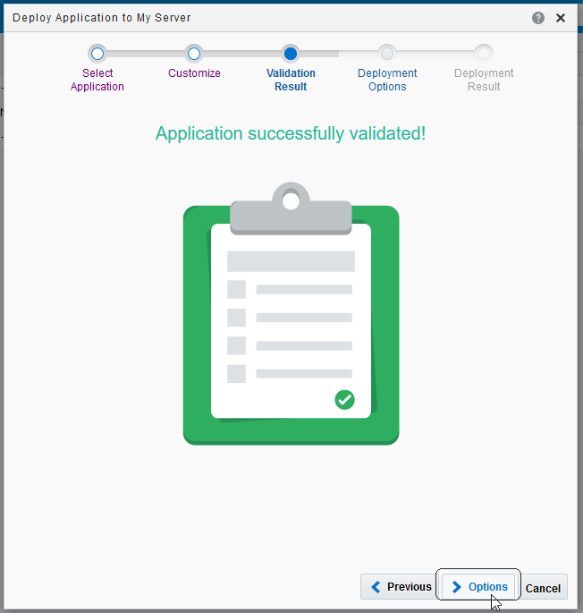

- We are going to create a new process revision because of this fairly-major change… so enter the id *2.0* in the *Revision id* textbox.

- Select the *Override* checkbox

- Select the *Force default* checkbox

- Finally, select the *Deploy* button

   

- The *Deploying* modal-dialog will pop-up and spin while this new revision is deployed.  This could take a minute or two depending on how many other participants are deploying at the same time

   

- Select the *Finish* button once the application deployment is complete

   

- The updated PCS application is now ready to test

### **3.3:**	Test the Updated PCS Process

---

- Select the *PCS Home* icon on the upper right of the PCS Management window

   

- If your PCS user (in this example, *demo.user03*) was already added in the roles for this PCS application in the PCS lab, you should see the *Submit Quote (v2.0)* icon on the left hand side of the PCS workspace home.

- If you don’t see the *Submit Quote (v2.0)* icon on the left hand navigation of the PCS workspace home, you’ll either need to add your user to the roles for this application or use the other PCS users such as `lisa.jones`, and `bala.gupta` to test out the new PCS process. This is documented in Lab 200, `Process Modeling and Configuration` section -> `Step 9: Role Assignment` section.

   

- The form created for the *Submit Quote* will be displayed.  Only a couple fields are necessary for testing.
  * Order Lines:
  * Item No = *2155*
  * Qty = *1*
  * UOM = *each*
  * Price = *$6000.00*
  * Account Name = *Imaging Innovations, Inc.*
  * After filling out the form, select the *Submit* button:

   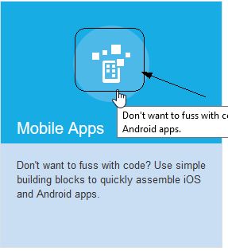

- A dialog will pop-up showing that the application has been started successfully with the input from the form you just filled out:

   

- Select the *Tasks* button on the top of the PCS Workspace:

   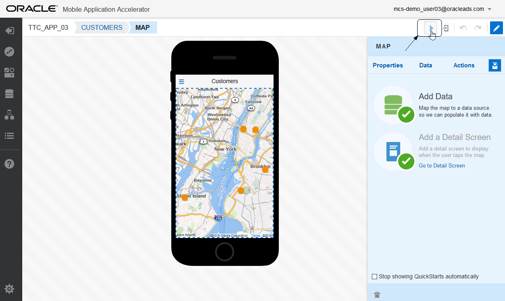

- Since this order was greater than $5000, it will have been routed to the *Sales Director* role in the PCS process.

- In the Tasks window, you should see a new PCS process for the *Sales Director*

- Select the arrow at the right of the PCS instance to see the details of the form while deciding whether to approve this quote or not.

   

- Review the quote as shown in the form.  Since this seems to be reasonable, select the *Approve* button on the top of the form

   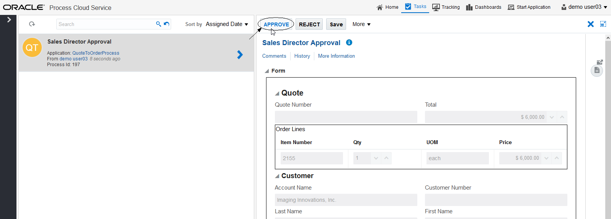

- This was the last approval needed in the process so you won’t see any more tasks for that process showing up in the tasklist.

- Select the *Tracking* icon on the top of the PCS Workspace so we can see the details of the entire process just completed.

   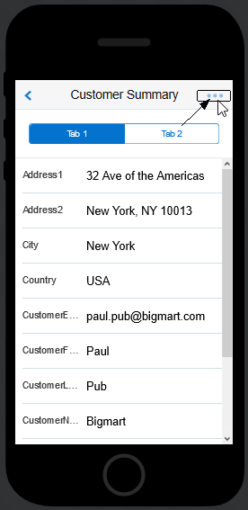

- Select the *Completed* checkbox - by default because only the `In Progress`, `Suspended`, and `Completed` are shown.

   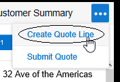

- Look near the top of the list for your process instance since it was just executed.

- Select the arrow at the right of the instance to see the details:

   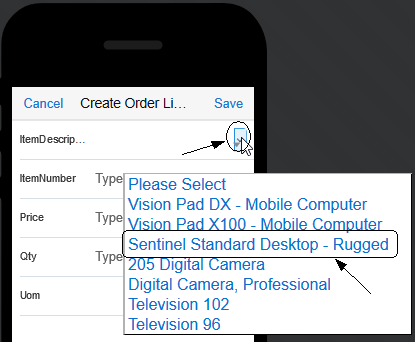

- Select the chevron icon just to the right of the *History* section so you can see a graphical representation of the process history.  The green line highlights the path that the process took.

   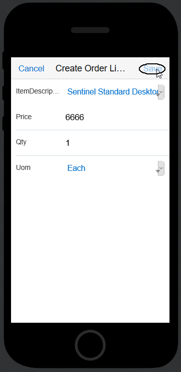
	
### **3.4:**	Ensure PCS called the new ICS Integration

---

- Login to ICS and visit the *Monitoring* window

   

- Select “Tracking” from the left-hand navigation

   

- Select your ICS integration name from the tracking list – this will probably be the first one in the list

   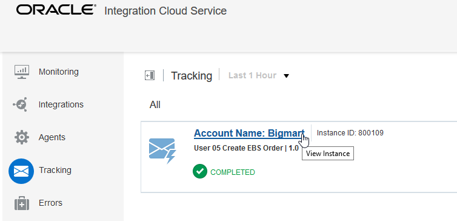

- Select the *Business Identifiers* icon on the upper right of the integration and make sure that the comment *Comment from PCS* was sent over to ICS from PCS

   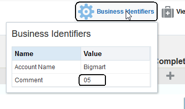

### **3.5:**	Verify the Order in EBS

---

- Login to EBS using the endpoint and credentials provided to you by the workshop organizer.  You will use the user *operations*.

- *NOTE:* For the EBS instance used in this workshop, the Oracle Single Sign-On system is used to regulate access.  Unless individual users are explicitly added to have access to the EBS system, they will not be able to access the following EBS login page.  If you can't access the login page with your Oracle SSO login, then you can look at the following screenshots to see how you would be able to see your Order in an EBS R12.2 system.

   

- Select the EBS Responsibility *Order Management, HTML User Interface*:

   

- Examine the list in the *Open Orders* report and verify that your new order shows up in the list.

   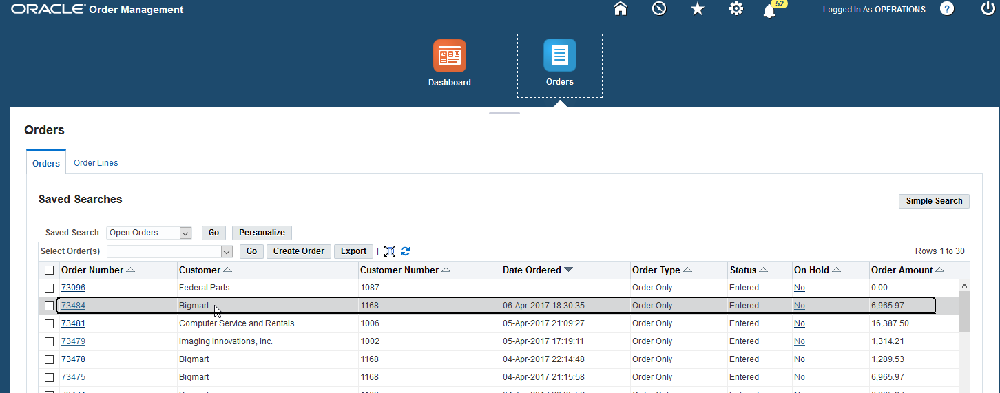

- You now have used Oracle Integration Cloud Service to explore and modify an integration to Oracle EBS. 

- This Lab is now completed.
