# Lab 100
This Lab walks you through the process of developing Mobile Cloud Service (MCS) Assets and Mobile Application Accelerator (MAX) App for the workshop.

### 1.	Design Considerations for Mobile App

Following are the assets that we will be creating during this part of the workshop.

 

- MCS Connector
    - Create MCS Connector which connects to PCS
- MCS API
    - Create MCS API using pre-defined artifacts
    - Configure MCS Connector
- MAX App
    - Create MAX App which will integrate to the MCS API

#### Workshop Pre-requisites:

1.	Chrome Browser
2.	Access to Internet, so that you can access the MCS / MAX Console 
3.	Archiving utility (zip / unzip)
4.	Text Editor
5.	Android / iOS Mobile Phone (with the “Oracle Mobile Application Accelerator” App installed from iOS AppStore / Google PlayStore), preferably to test / run the MAX App on your Mobile Phone. 
If Android / iOS Mobile Phone is not available, you can still test the MAX App using MAX simulator in the browser.

### 2.	Access Details and Collaterals

**2.1** Launch Chrome browser -> New incognito window 

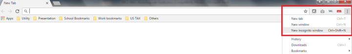  

**2.2** From your Chrome browser incognito window go to the following URL:
<https://cloud.oracle.com>

**2.3** Click Sign In in the upper right hand corner of the browser
- **IMPORTANT** - Under My Services, change Data Center to `US Commercial 2 (us2)` and click on Sign In to My Services

**2.4** If your identity domain is not already set, enter it and click **Go**

**NOTE:** the **Identity Domain** values will be given to you from your instructor.

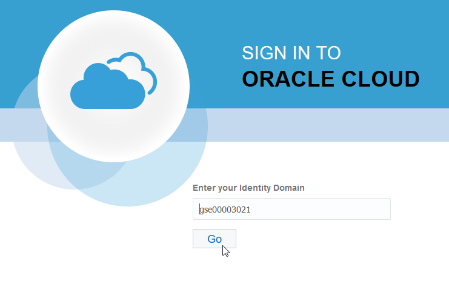  

**2.5**  Once your Identity Domain is set, enter your `User Name` and `Password` and click **Sign In**

***NOTE:*** the **User Name and Password** values will be given to you by your instructor.

  

**2.6**  You will be presented with a Dashboard displaying the various cloud services available to this account.

**NOTE:** The Cloud Services dashboard is intended to be used by the *Cloud Administrator* user role.  The Cloud Administrator is responsible for adding users, service instances, and monitoring usage of the Oracle cloud service account.  Developers and Operations roles will go directly to the service console link, not through the service dashboard.

**2.7**	Once at the Oracle Cloud My Services Dashboard click on the **Mobile Environment Service**

 

**2.8**	Now click on the link provided next to Service Instance URL

 

**2.9**	This opens the MCS Console page

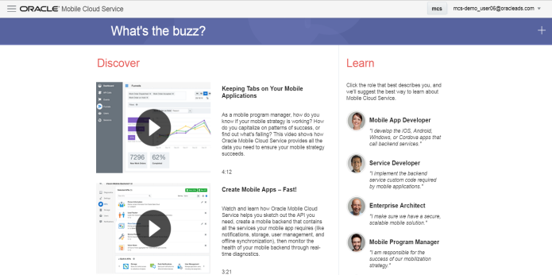

**2.10**	A csf-key is pre-defined on this MCS instance. This csf-key will be used while creating the connector, explained in the later section of this workshop. This is the credential used to connect the PCS process.

csf-key: **PCS_TTC**

**2.11**	A Mobile Backend is pre-defined on this MCS instance for testing the APIs/Connectors you are going to create as part of the workshop.

Mobile Backend Name: **TTC_MBE**

### 3.	Creating an MCS Connector

In this section, you create a connector API in Oracle Mobile Cloud Service so that your mobile application can interact with an external web service. Connectors work with either SOAP or REST services to access external cloud services offered by other providers or assets, such as databases.
Connector APIs provide a bridge between your custom APIs and the enterprise services you want to access from those APIs. Using the REST and SOAP connector types, you create connector APIs for each data source that you want to access.
You define a connector API by entering info about the target resource, creating rules for the call parameters to "shape" the returned data so that it works well in a mobile context, and specifying security policies.

In this part of the Workshop, you create an MCS connector to support interacting with a SOAP service. For this workshop, the sample SOAP services that you will use are exposed by an Oracle Process Cloud Service.

**3.0** From the MCS console page click on the **hamburger icon** next to Oracle in the top left corner of your screen

**3.1** Select **Applications** from the breadcrumb menu and then click the **Connectors** icon

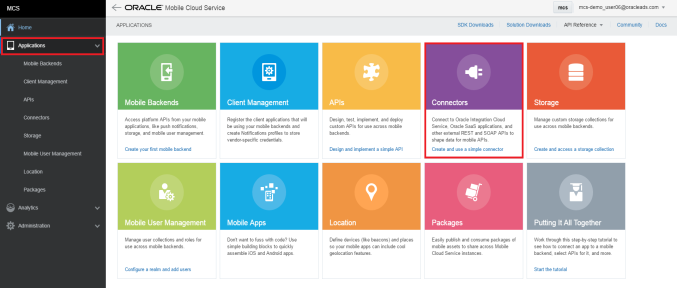

**3.2**	 Click **New Connector** and then select **SOAP** from the drop-down list.

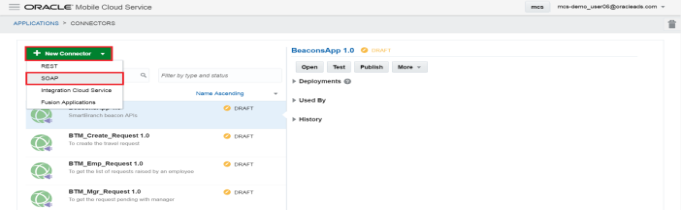

**3.3**	In the **New SOAP Connection API** dialog, enter the following values:

**API Display Name:** PCS\_TTC\_XX (where XX is the postfix of your user id, it should be 01 thru 10)

**API Name:** PCS\_TTC\_XX (should be populated based on the value entered for the Display Name)

**WSDL URL:** https://touchthecloudpcs-gse00003021.process.us2.oraclecloud.com/soa-infra/services/default/Quote\_to\_Order!1.0/QuoteToOrderProcess.service?WSDL

**Short Description:** Endpoint of PCS Approval Workflow

Click **Create**. 

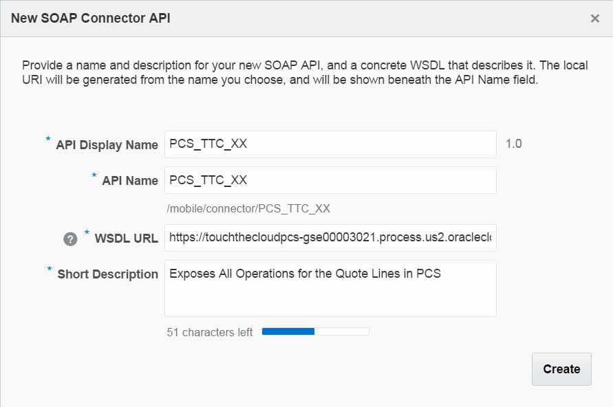

**3.4**	In the **Configure SOAP API** wizard, click **Save**

**3.5*	Click the **Next** arrow (“>”) to navigate to the **Port** train stop and observe details about the service operations that are exposed

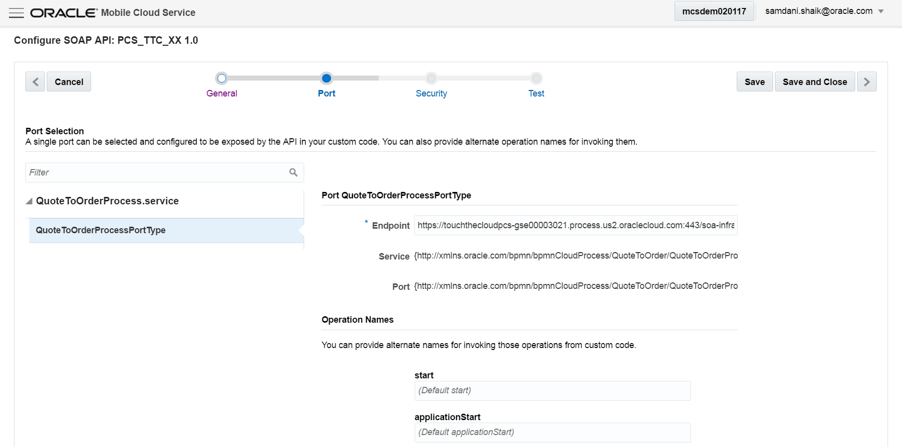

**3.6**	Click the **Next arrow** (“>”) to navigate to the **Security** settings

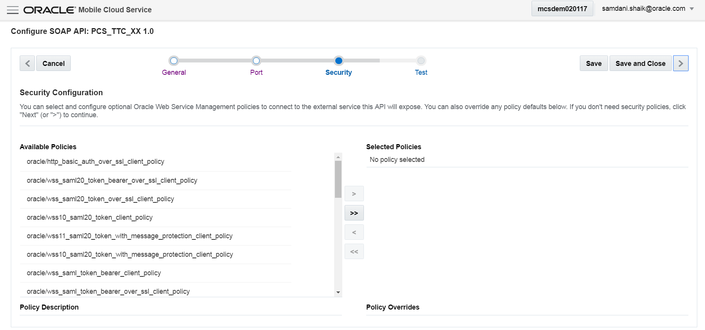

By default there are no policies selected in the **Security Configuration**. For this workshop we need to add a security policy to interact with the PCS SOAP Endpoint.

**3.7**	Select `oracle/http_basic_auth_over_ssl_client_policy` and click on “>”.
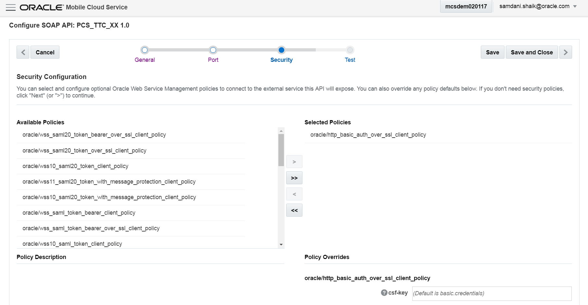

**3.8**	On highlighting the csf-key field, you would see a lock icon. Click on the lock icon and select **PCS_TTC**, the one provided in the access details and collaterals section 2.6. Click on **Select** button.

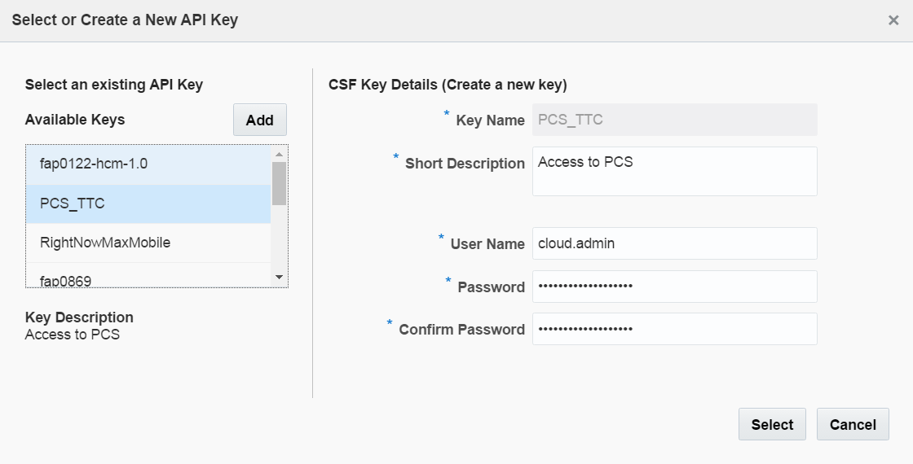

Click on **Save** to save the work at this point.

**3.9**	Click the **Next arrow** (“>”) to navigate to the **Test** page. Scroll down to see all the resource methods that the service exposes.

**3.10**	Let's test it. Invoke TTC PCS process by calling the **POST start**.

Expand the **Authentication** node and set the Mobile Backend to **TTC_MBE**, the one provided in the access details and collaterals section 2.7. Use this Mobile Backend for testing your Connectors and APIs.

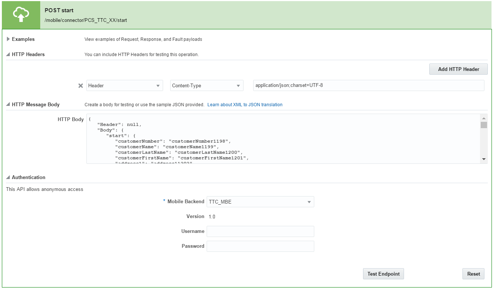

**3.11**	The response status should show 200

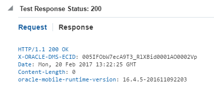

Click on **Done**. This completes the Create Connector step.

### 4.	Creating the MCS API

In this part of the workshop, you step through the process of creating and defining MCS API using pre-defined artifacts. 

**4.1**	Select **Applications** from the breadcrumb menu and then click the **APIs** icon

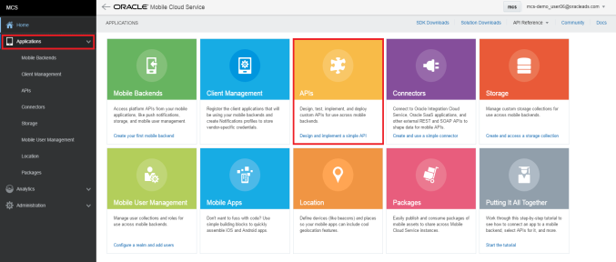

**4.2**	Click the **New API** button on the **APIS** page and then Click on **API** to start defining the API

**4.3**	In the New API pop-up window, drag and drop the TTCSalesOrderAPI.raml provided as part of the artifacts for the workshop

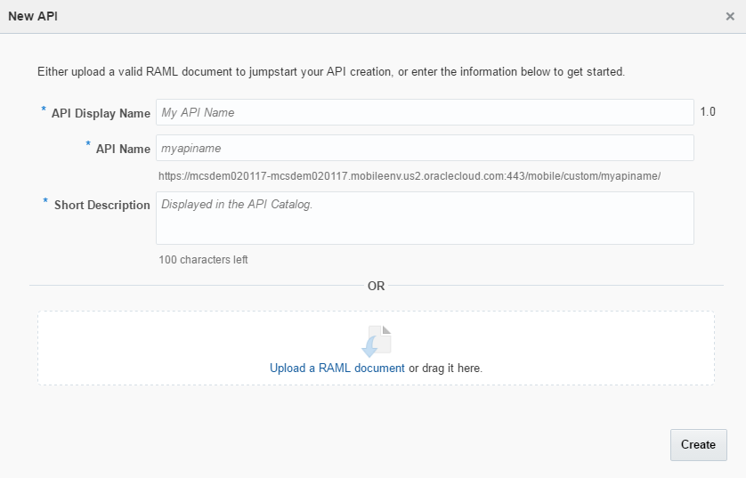

**4.4**	Change XX to your user id suffix and enter **Short Description** as “Touch the Cloud MCS API”. Then click **Create**

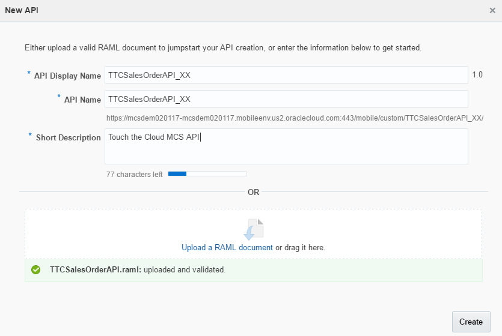

**4.5**	The API created will looks like this (Please make sure that it reflects 01-10 and not XX)

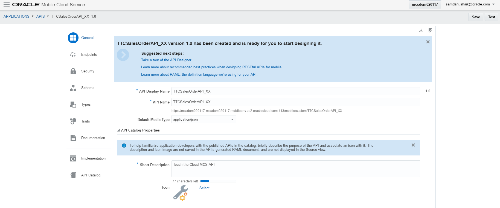

**4.6**	Disable security to the MCS API by navigating to the **Security** section

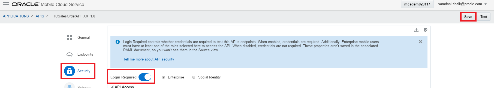

click **Save.**

Let’s step through the process of defining MCS API.
An API implementation can call MCS platform APIs (such as Storage and Notifications), other custom APIs, and external REST and SOAP web services through MCS connectors.
The coding model is based on Node.js, which is a lightweight JavaScript framework that enables you to write and run server-side code. For each API endpoint, which is the URI plus the HTTP request method (such as GET or POST), you write a route definition that specifies how to respond to a client request to that endpoint. After you have written the custom code, you package it as a Node.js module and upload it to MCS.

**4.7**	Go to **Implementation** to implement the custom API

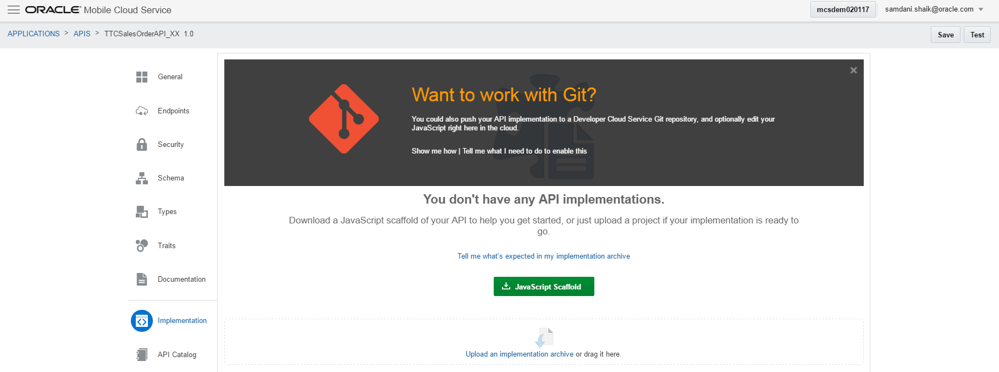

**4.8**	On your desktop, unzip the **ttcsalesorderapi.zip** file to ttcsalesorderapi folder. In the ttcsalesorderapi folder that is created locate the **package.json** file and open it in a text editor.

Replace **xx** in API name with the postfix of your user id (it should be 01 thru 10). In the connectors section too, modify the name and version of the connector by replacing **XX**. For example: "/mobile/connector/PCS\_TTC\_**XX**":"1.0"

**Refer to the code snippet:**

**4.9**	Next, from the ttcsalesorderapi folder, open the **ttcsalesorderapi.js** file in a text editor. 
Edit the methods to include code to access your API **TTCSalesOrderAPI\_XX** and Connector **PCS\_TTC\_XX**.

**Replace all XX with the postfix of your assigned user id [01 thru 10] in the file:**

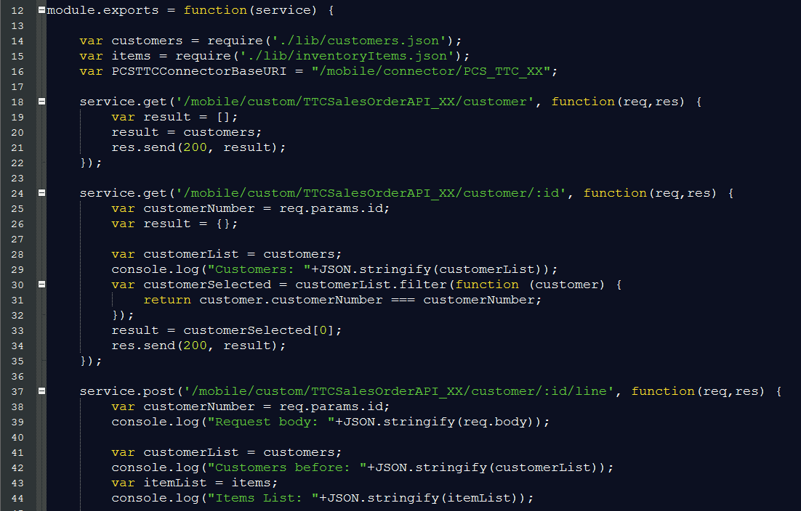

**4.10**	After saving all your work, create a zip file that includes all the files of the ttcsalesorderapi folder. Name the file **ttcsalesorderapi2.zip**.

**4.11**	Back in the MCS API implementation page, at the bottom, drag and drop **ttcsalesorderapi2.zip** to **Upload an implementation** archive section.

Close the dialog window that pops up and you can see that the JavaScript you added is now part of the implementation. Click **Save**.

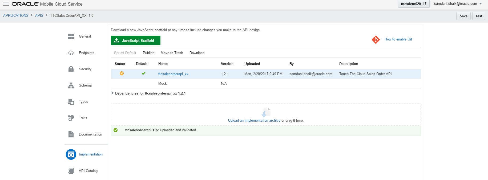

Let’s test the MCS API we just created.

**4.12**	With the implementation selected, click the **Test** button

**4.13**	In the **Get customer** Endpoint, select the Mobile Backend **TTC_MBE**, the one provided in the access details and collaterals section 2.7. Click the **Test Endpoint** button.

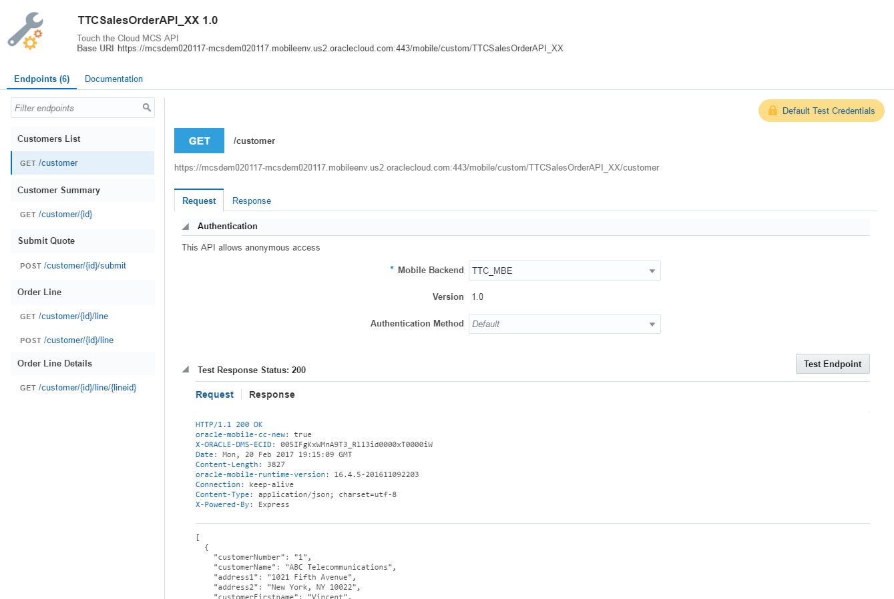

You should see the list of customers as shown below.	
Similarly, you can test the other endpoints as well.

**4.14**	 MCS APIs must be published to be available on MAX App for integration.

Click on the Hamburger Menu, select **Applications** from the breadcrumb menu and click on APIs. 

Search the API you just created i.e., **TTCSalesOrderAPI\_XX** (where XX is the postfix of your user id, it should be 01 thru 10) by using the **Filter APIs**. Then select your API and click on **Publish.**

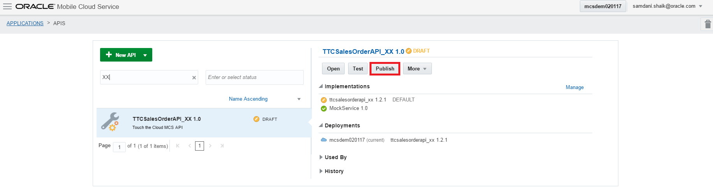

**4.15**	In the **Confirm Publish API** popup enter the comment **Initial Version**. Then click on **Publish**.

This will publish the MCS API.

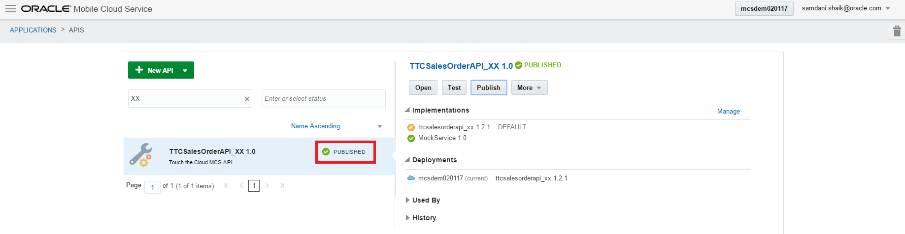

### 5.	Creating MAX App

In this section, you create a new MAX application.

**5.1**	Select **Applications** from the breadcrumb menu and then click the **Mobile Apps** icon

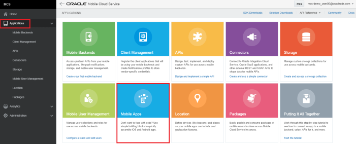

**5.2**	This opens **MAX** in a separate browser. Click on **New Application**.

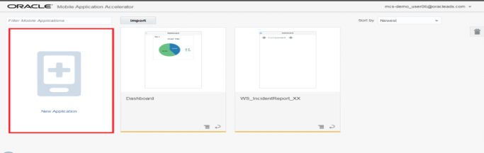

**5.3**	Enter the MAX App name as **TTC\_APP\_XX** (where XX is the postfix of your user id, it should be 01 thru 10)

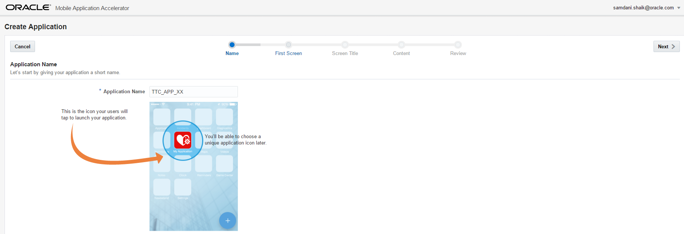

**5.4**	Click **Next** from the top right corner to choose **Screen Template**

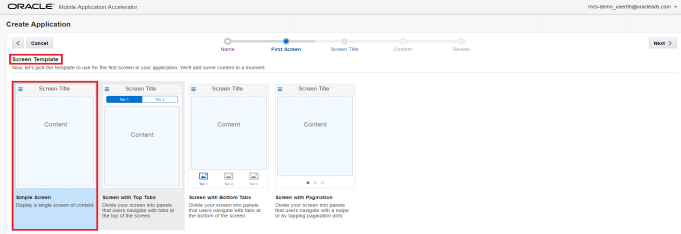

By default **Simple Screen** template is selected. Use the same and click **Next**

**5.5**	Enter **Screen Title** as **Customers** and click **Next**

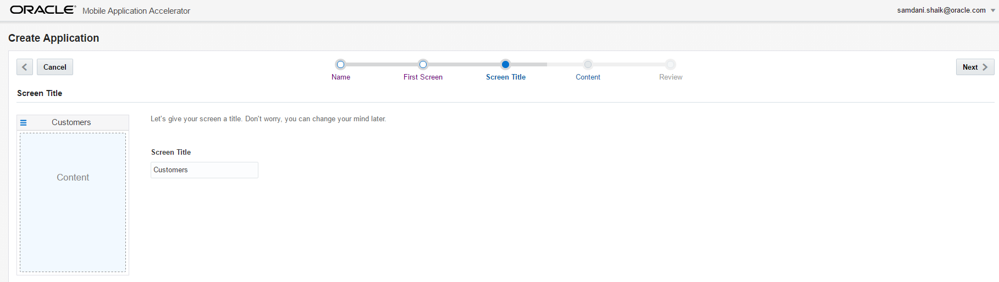

**5.6**	By default **Custom** content is selected. Use the same and click **Next**

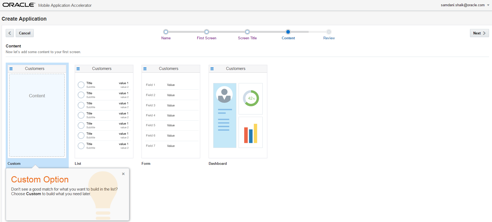

**5.7**	Click **Create** from **Review and Create**

**5.8**	Once the MAX application is created, you are taken to the Designer part of the interface where you can refine the layout and content of the pages.
On the left are a series of components you may drag and drop onto your pages. In the center is a preview of the way the screen will look and on the right is where you can set the properties for the components you add.

**5.9**	Scroll down in the **Component** palette and find the **Map**. Then, drag and drop the **Map** onto the **Component**.

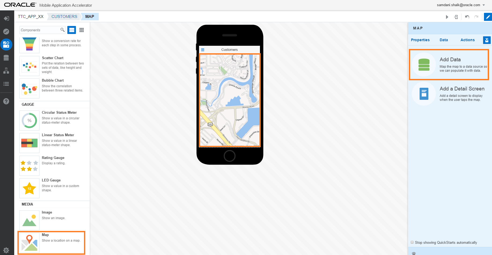

**5.10**	Click on **Add Data** from the **Data** section. This opens the page **Add Data to Map Component**. Then, select **I want to use an Address** radio button. Click **Next >**.

**5.11**	Click on **Add Service**. In the **Service Catalog**, search for the MCS API that you published i.e., **TTCSalesOrderAPI\_XX** (where XX is the postfix of your user id, it should be 01 thru 10) using Filter Services. Then select your API and click **Select** button on the bottom right corner.

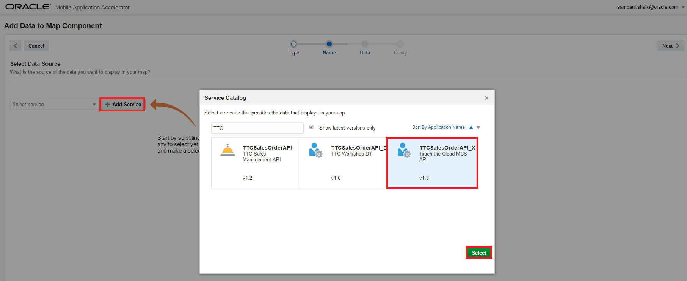

**5.12**	In the **Select Data Source** Tab select the **Customers List** business object. Then click **Next** button on the top right corner.

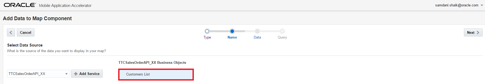

**5.13**	In the **Map Data Fields** to UI Tab map the **address1** and **address2** attributes of **Customers List** business object to **Location Value field**. Click **Live Data Preview** button for preview. Then click **Next** button.

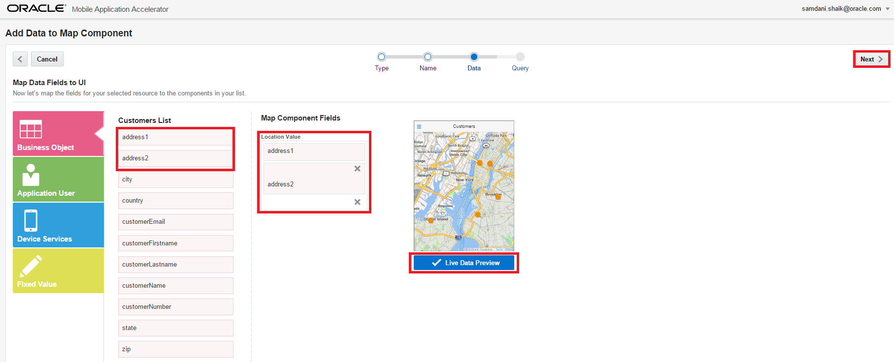

**5.14**	No Query Parameters to be set in the **Configure Query Parameters** Tab as the **Customers List** endpoint doesn’t need it. Then click **Finish** button.

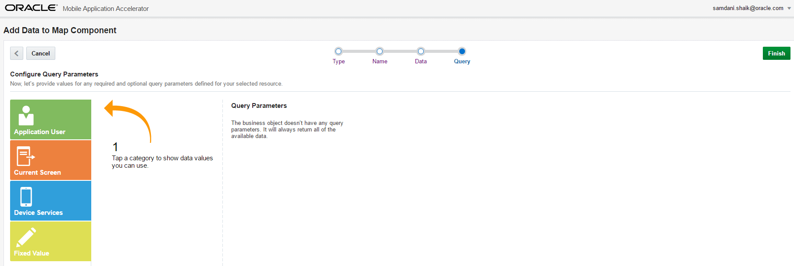

**5.15**	Once complete, preview should look like this. We will now add a detail screen by clicking on **Add a Detail Screen** on the right panel.

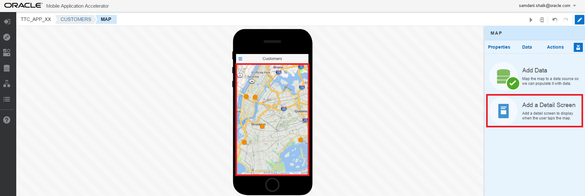

**5.16**	In the **Screen Template** Tab select **Screen with Top Tabs**. Click **Next**.

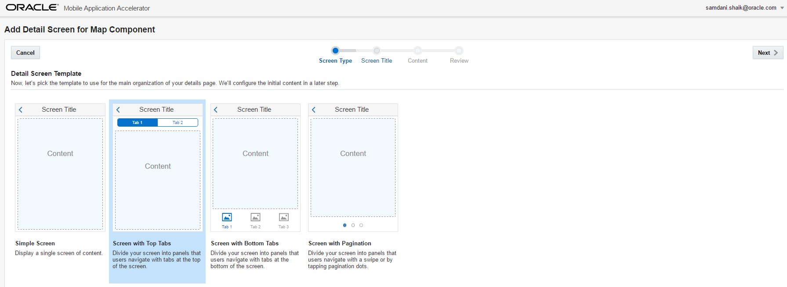

**5.17**	In the **Screen Title** Tab enter **Customer Summary** as title. Set Top Tabs as **Details** and **Quote Lines**. Click **Next**.

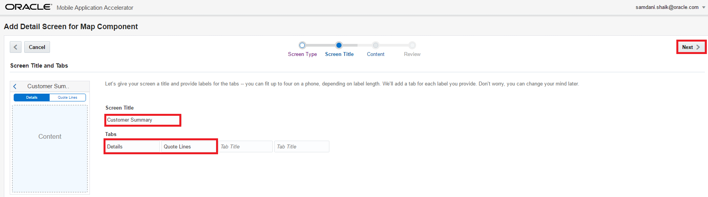

**5.18**	In the **Content** Tab select **Form**. Click **Next**.

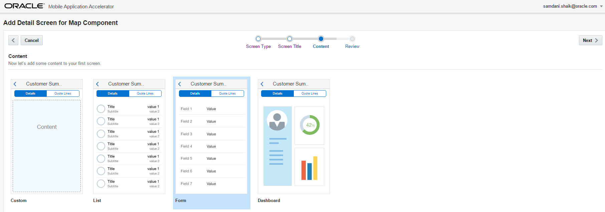

**5.19**	In the **Review** Tab click **Finish**.

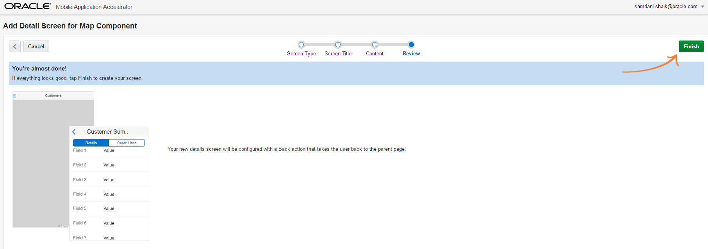

**5.20**	Select **Go to Detail Screen** text from right panel.

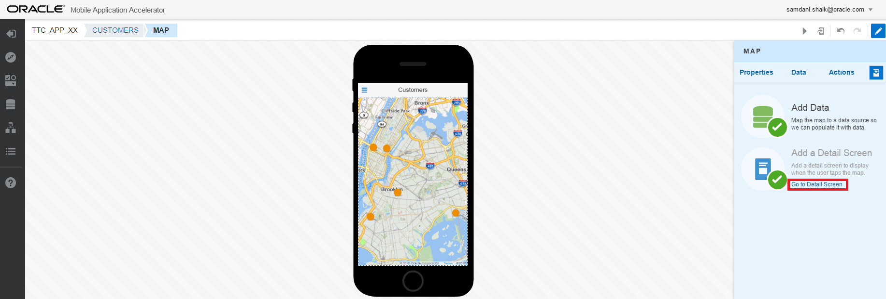

**5.21**	Preview should look like this. Click **Add Data** from right panel.

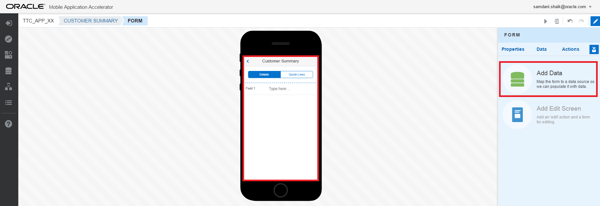

**5.22**	In **Select Data Source** Tab, select **Customer Summary** business object. Click **Next**.

**5.23**	In **Map Data Fields to UI** Tab, click **Add All Fields** to add all business object fields.

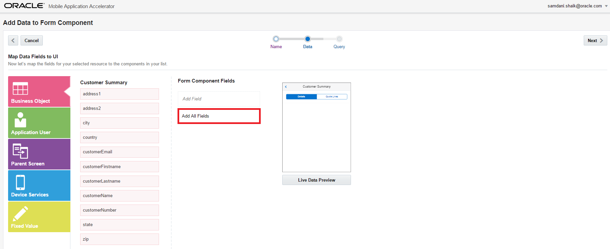

**5.24**	Click **Live Preview Data** to observe the changes live. Click **Next**.

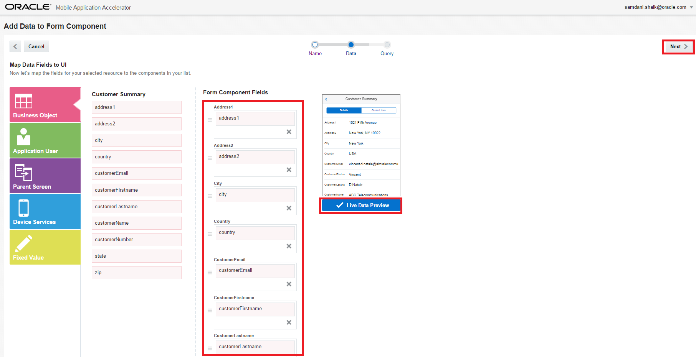

**5.25**	In **Configure Query Parameters** Tab, click on **Parent Screen**, and set the **customerNumber** parameter to the **Parent Screen's id** by dragging and dropping it. Then click **Finish**.

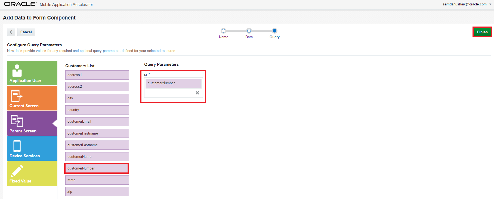

**5.26**	Once complete **Preview** should look like this.

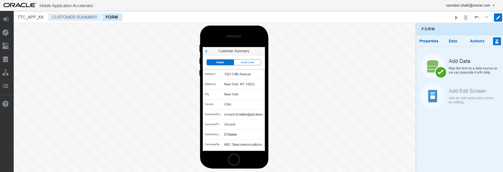

**5.27**	Click on **Quote Lines** Tab. Drag and drop **List** component to the content of the Tab. Click on **Add Data**.

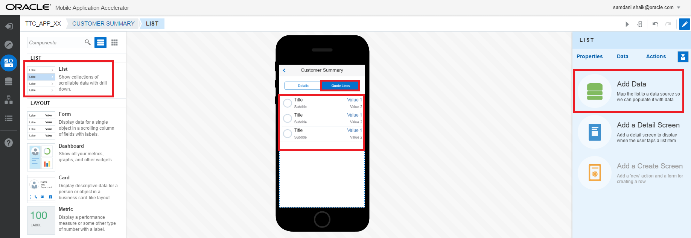

**5.28**	In the **Select Layout** Tab select the layout as shown. Click **Next**.

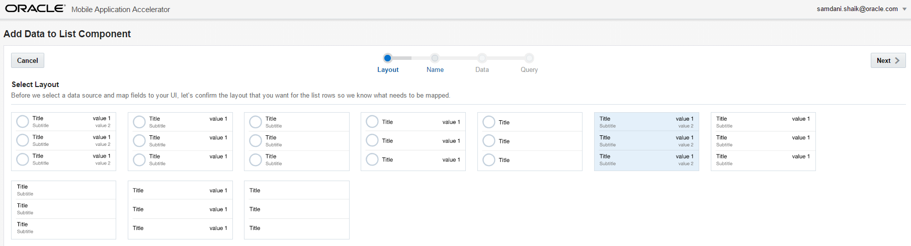

**5.29**	In **Select Data Source** Tab, select **Order Line** business object. Click **Next**.

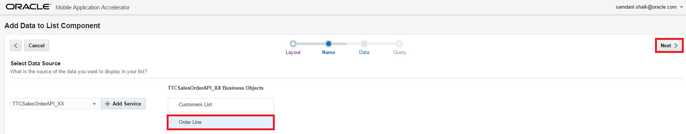

**5.30**	In **Map Data Fields to UI** Tab, map the values as shown in the screenshot below. Click **Live Preview Data** to observe the changes live. Click **Next**.

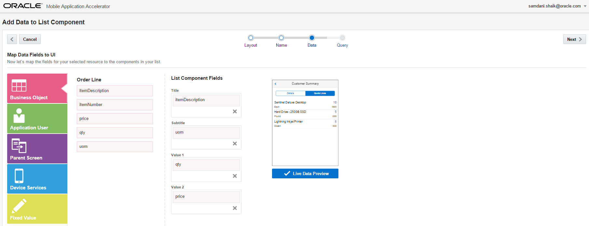

**5.31**	In **Configure Query Parameters** Tab, click on **Parent Screen**, and set the **customerNumber** parameter to the Parent Screen's id by dragging and dropping it. Then click Finish.

**5.32**	Once complete **Preview** should look like this. Click on **Add a Create Screen** on right panel

**5.33**	Click on **Go to Create Screen** text on right panel.

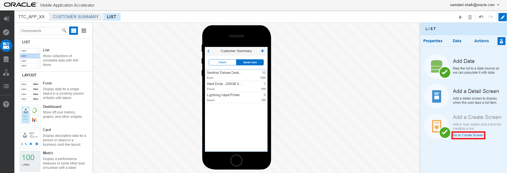

**5.34**	Create Screen should look like this. No data mapping is required as it is handled internally.

**5.35**	Change the field type for **ItemDescription** to **Select** (Drop down). 

Similarly change the field type for **Uom** to **Select**. Data mapping for these fields are predefined in MCS. 

**5.36**	Remove the ItemNumber field by clicking on the bin icon on the bottom right corner. This is automatically generated in the PCS side.

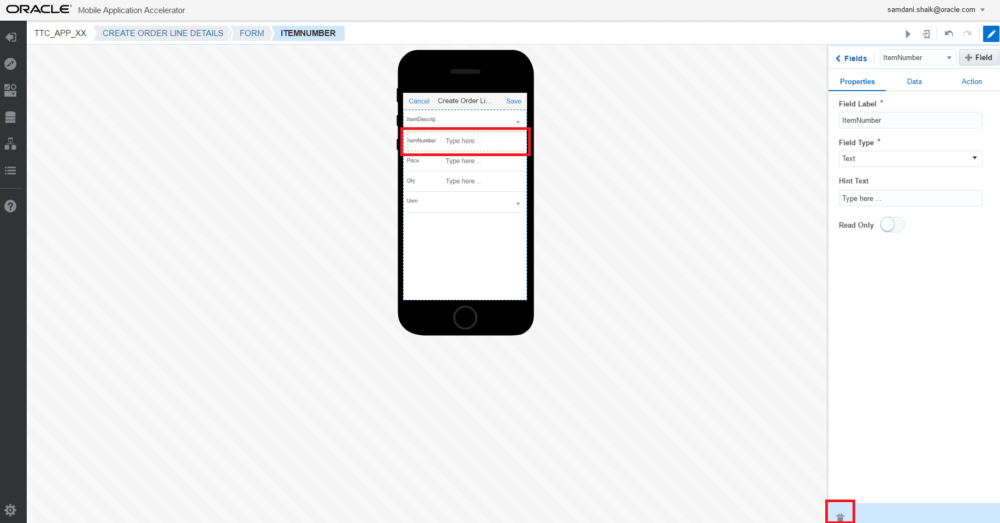

**5.37**	Now the Create form should look like this.

**5.38**	Navigate to **Screen Flow** tab by clicking on the left panel. Double click on **Customer Summary** screen.

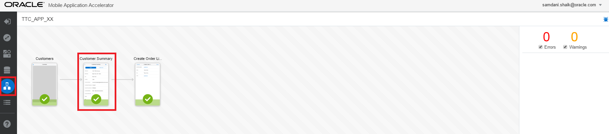

**5.39**	Select the header of the **Customer Summary** screen and select the **Create Order Line Details** button. Change label of the button to **Create Quote Line** and Modify **Navigation Action Mapper** under **Create Quote Line** button Action to map the parameters as shown in below screen shots. Click **Finish**.

 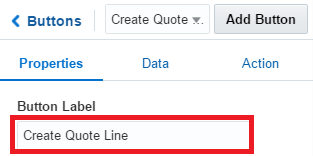 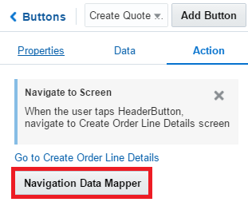

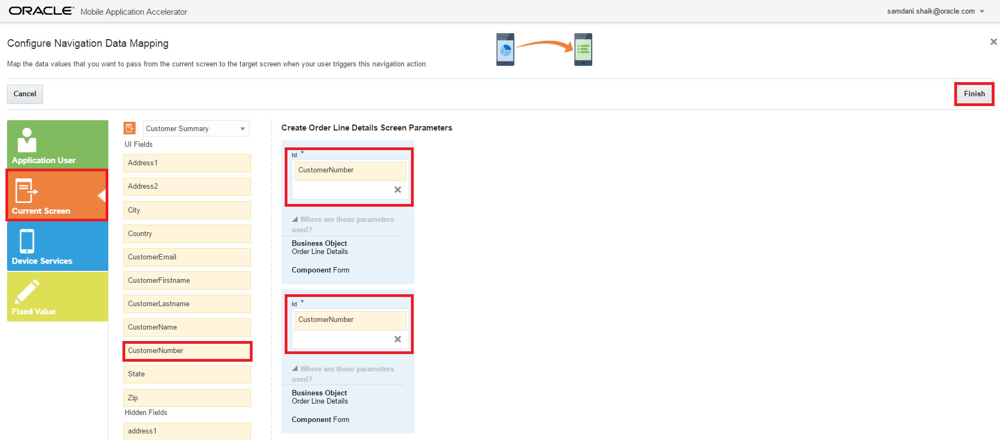

**5.40**	Select the header of the **Customer Summary** screen and add a Header Button **Submit Quote** by clicking **HEADER BUTTONS** on the right panel. Follow the screenshots below.

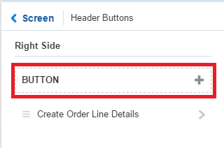 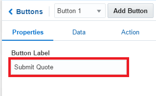

**5.41**	Add Action to the **Submit Quote** button

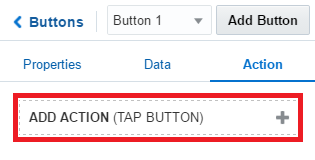 

**5.42**	Configure Action for **Submit Quote** button as shown below. (Using drag and drop)

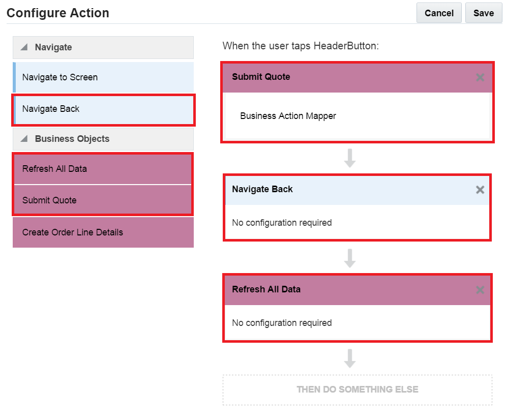

**5.43**	Modify **Business Action Mapper** under **Submit Quote** button Action to map the parameters as shown in below screen shots. Click **Finish**.

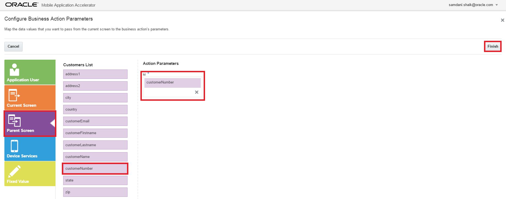

Click **Save** on **Configure Action** panel.

Let’s test the MAX app we just created.

**5.44**	You can preview your app in a hosted simulator or on a device at any point after you’ve created its first screen.
The Test tool lets you use the simulator to see how your UI displays live data. You can also test out screen navigation and the actions that you’ve configured for UI components. Click on **Test** ( ) icon from top right corner.

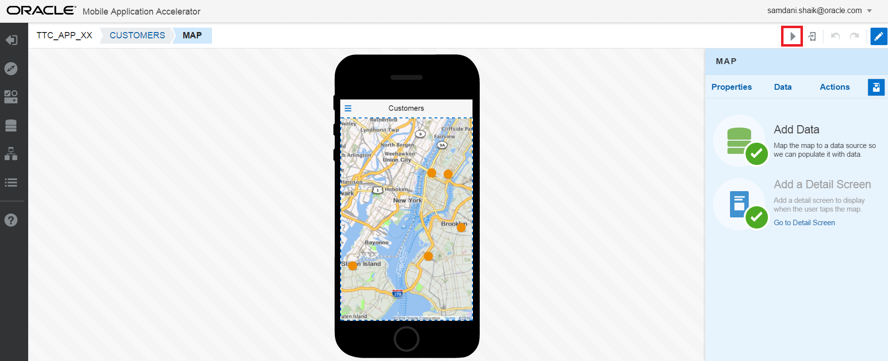

**5.45**	You need a test user account to preview your app with live data. To test the app you created use the following credentials

username: maxtester

password: W3lcome1*

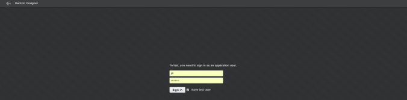

**5.46**	The MAX App opens up in the Test Console. Click on a Customer on the Map

**5.47**	Customer Summary screen shows the Details and Quote Lines for the selected customer 

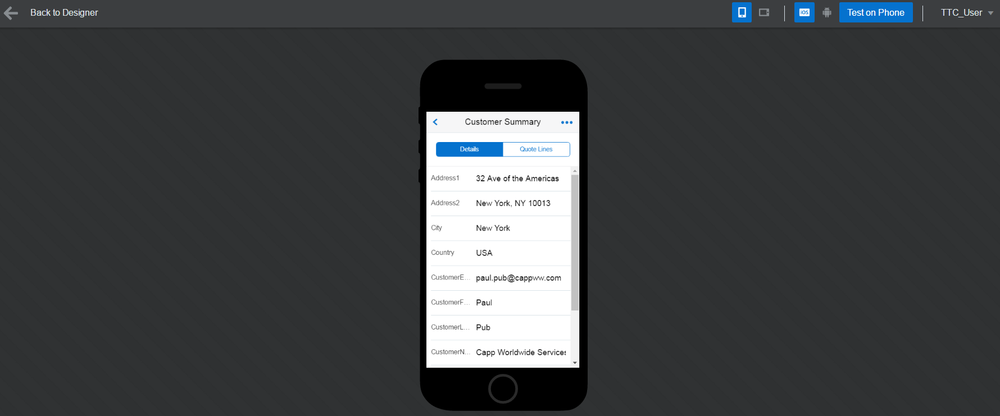

**5.48**	Navigate to Quote Lines Tab, next to Details tab

 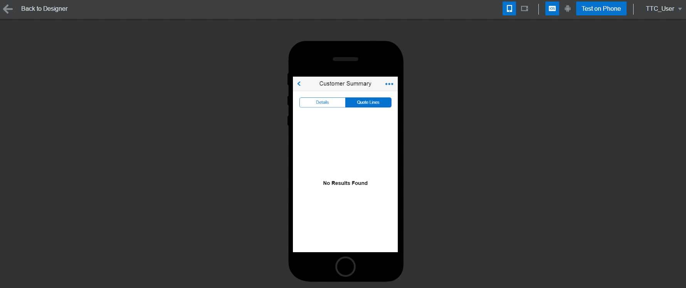

**5.49**	Create a Quote Line by using the header button **Create Quote Line** on the top right corner

 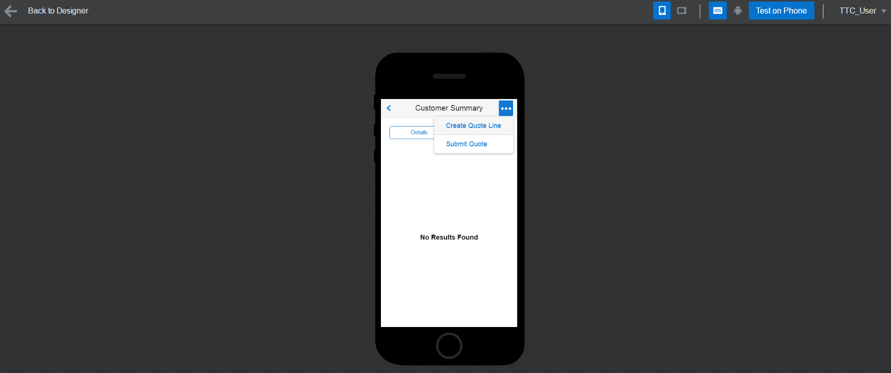

**5.50**	Fill in the Create Quote Line form and then click Save

 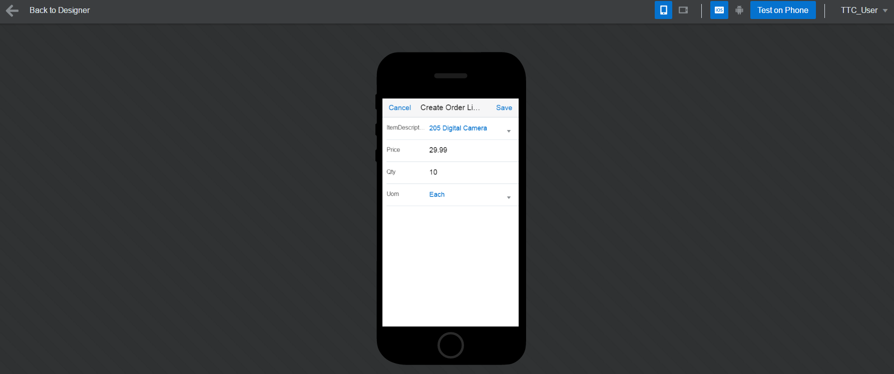

**5.51**	Once the Quote Line is created successfully, app will navigate back to the previous screen. Now you may continue creating multiple Quote Lines similarly or submit the quote by clicking **Submit Quote** header button. After submitting the quote please wait 5 to 10 seconds for the screen to refresh and return to the home page.

 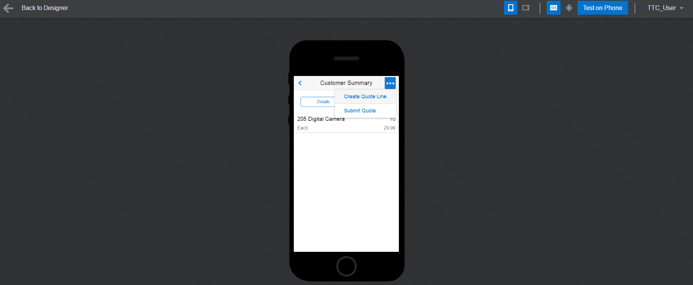

Once the Quote is successfully submitted, app will navigate back to the Map screen.

**5.52**	If you want to test the MAX App on the Mobile Phone, please proceed to the next step.

If you do not want to test the MAX App on Mobile Phone, then click on **Back to Designer** (   ). This step completes the workshop.

If you want to test the MAX App on Mobile Phone, click Test on Phone (   ) and then Build Test Application. You need the MAX Container App (“Oracle Mobile Application Accelerator” App installed from iOS AppStore / Google PlayStore) to run your app on a Mobile Phone. 

MAX generates a QR code when the build finishes. Click button next to Show QR Code. This QR code needs to be used to download the app on device

**Please do NOT publish the app**

 

 **Note:** This QR code is for testing apps that are under development. Share it with your test group. When you publish the app later on, MAX will generate a different QR code, one associated with the published (or finished) version of your app. It’s the one that you’ll use to distribute all versions of your app to its users.

**5.53**	On your device, open the MAX App (    ). Then Click Scan (    ).

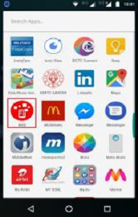             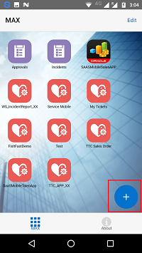

**5.54**	Point your phone at the test QR code to download the app.

 

**5.55**	Log into the app by entering your user name and password. The test app appears in the MAX App.

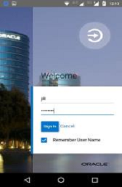 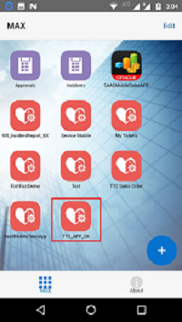

**5.56**	You can launch the MAX App, which should look like this. 

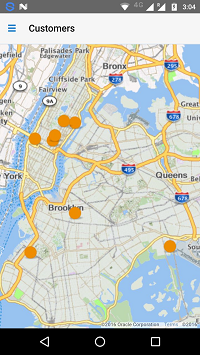

You can now create and submit a quote from your phone. Please remember to wait 5 to 10 seconds after you hit the submit button for the page to refresh. You can use the hamburger menu to navigate to log out of the app.

**This Completes LAB 100**
