

  

Update: April 6, 2017

# Lab 200 - Process cloud Service

## Introduction

This is the second of several labs that are part of the **iPaaS - Build a Quote to Order Process Workshop** 

We are going to look at the process approval workflow process that had being kicked off from Lab 100's Mobile Application. 

>If Lab 200 is your starting point, then you can have a look at the appendix at the end of this lab, to create a couple of tasks to work on.

## Objectives

- User Experience with Process Cloud
- Process Modeling and Configuration

# 

## Process Cloud User Experience

In this section we are going to experience the interaction possible from an end user of the PCS interface.

### **1**: Login to Oracle Cloud

---

**Role: Lisa Jones, Field Sales (lisa.jones)**

Since it is Lisa's first time signing into Oracle Cloud, she has to figure out how to access Oracle Process Cloud Services.

---

Now we can login as Lisa Jones. From any browser, **go to the following URL**:
[https://cloud.oracle.com](https://cloud.oracle.com)

**1.1** Click **Sign In** in the upper right hand corner of the browser.

  

**1.2** **IMPORTANT** - Under My Services, ask ***your instructor*** which **Region** to select from the drop down list, and **click** on the **My Services** button.

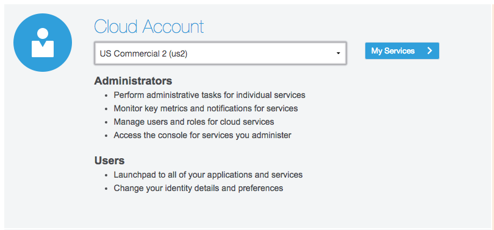  

**1.3** Enter your identity domain and click **Go**

  ***NOTE***: the **Identity Domain, lisa.jones** and **Password** values will be given to you from your instructor.

  

**1.4** Once your Identity Domain is set, enter your **User Name** and **Password** and click **Sign In**

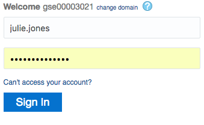  

**1.5** Once connected, you will be presented with a Dashboard displaying the various cloud services available to this account. 

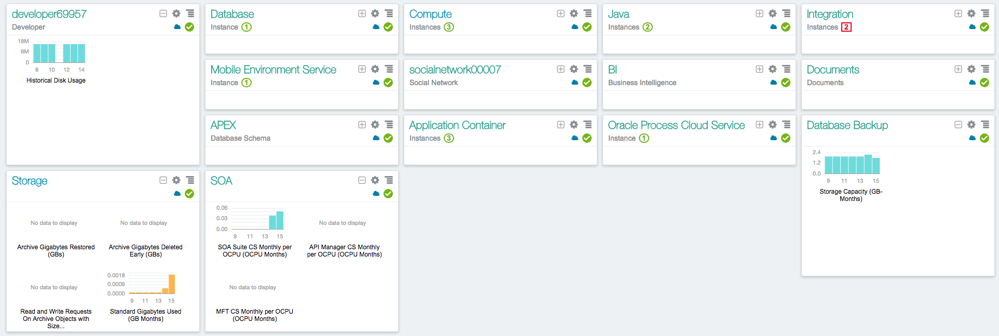  
  
**1.6** Click on the **Oracle Process Cloud Service**

**1.7** Click on the **Service Instance URL**  Service Instance URL link. This will open Process Cloud Service Console page.

### **2**: Process Cloud Service Console Overview

---

**Role: Lisa Jones, Field Sales (lisa.jones)**

---

Oracle Process Cloud Service is divided as three separate functionalities, and depending on you role, you would be able to access these functionalities. The functionalities is divided in Administrator Tasks, End-User Tasks and Developer Tasks. 

- The  PCS Landing page gives you a quick glance of the functionality available to you (or in this case Lisa Jones).

**2.1** From Cloud UI dashboard click on the **Service Instance URL** link.

Lisa will see the task relevant to her, for example, **Work on Tasks** and **Track Instances**.

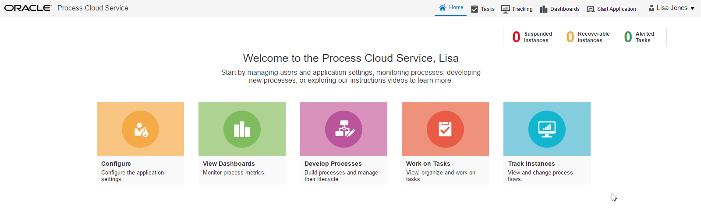  

### **3**: Working on Tasks

---

**Role: Lisa Jones, Field Sales (lisa.jones)**

Lisa wants to look at her outstanding tasks, and approve the incoming Quote requests.

---

**3.1** Click **Work on Tasks** to access the Task List

  

In the list we can see the outstanding tasks allocated to Lisa. You also have the capability to sort, do filtering and peek at task related to 'me'.

**3.2** Select a task by hovering over the task with mouse and clicking on it. The task you select should be one of the tasks you created in Lab 100, with a **XX:** in fornt of it, (where XX is the postfix of your user id, it should be 01 thru 10).

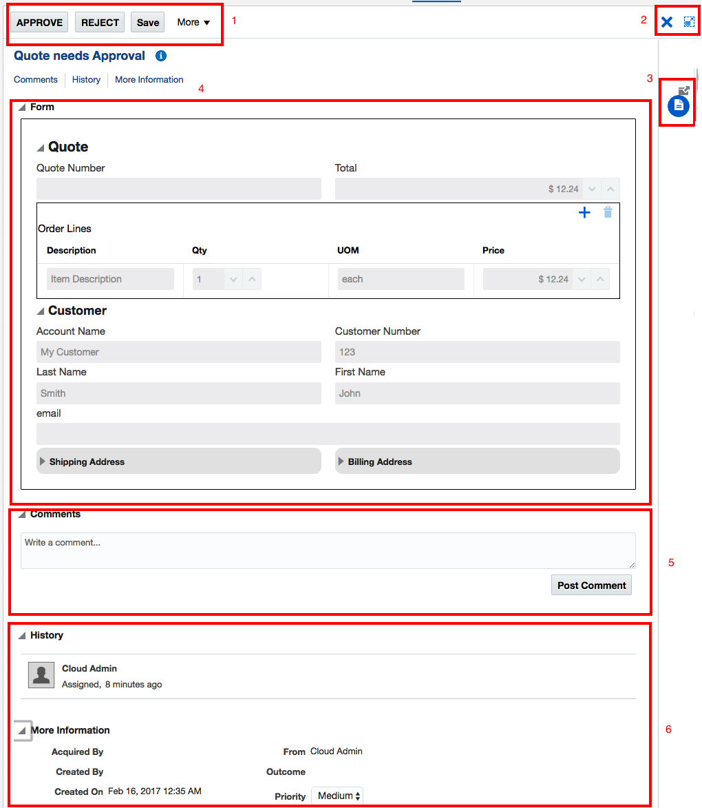 

> Breakdown of a typical task form: 
>1. Action Items - In this instance we have two actions defined, Approve and Reject. The Save functionality allows you to make some changes, save the state of the task and at a later stage come back to the task to complete. 
>2. Close Form / Maximize
>3. Documents Panel Expand, might also include Discussions, if enabled for process
>4. Form, or also called the payload for the task. This information is the task specific information required to decide on on an action. Depending on the configuration, information can be updated.
>5. Comments
>6. Task Information, History and Task Metadata

**3.2** Lets follow the happy path, and click on the action ***Approve***

- The page will revert to the task list and you will notice that the task disappeared from your inbox. In fact, you might also get a green confirmation message that your action was accepted.

### **4**: Tracking Instances

---

**Role: Roland Dubois, Process Owner (roland.dubois)**

  Roland Dubois, sales director and process owner wants to see what happened to our process we have approved in the previous step. 
  
  Since a process can be configured to follow different paths depending on rules and the way the process was modeled, it might be sometimes required for a process owner to look at a process instance to see what happened. 

  This audit information can also be exported and use for debugging or as input for on-premise systems.
  
---

**4.1** Logout as Lisa Jones, and log into the Process Workspace as Roland Dubois (roland.dubois).

**4.2** Click **Track Instances** to access the List of Instances

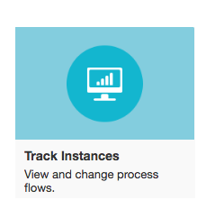  

This List displays the active instances. To display completed instances as well, you have to select the **Completed** check box.

**4.3** Click on any process in the list

**4.4** To make it easier, you can expand the task to fill the browser page, by click on the expand task icon in the top left hand corner

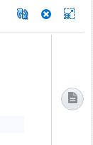

**4.5** Expand the History heading

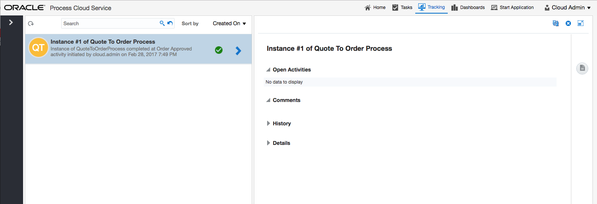

You have the option to view the history as a list, a tree view or diagram, depending on your needs. 

- Graphical View : See the process as a diagram to quickly see what happened
- List: Trace through the steps the process followed
- Tree: Expose the capability to drill into specific step to see what happened in a step

To determine the next step in the process, you can view the diagram and determine what the next step in the process would be. 

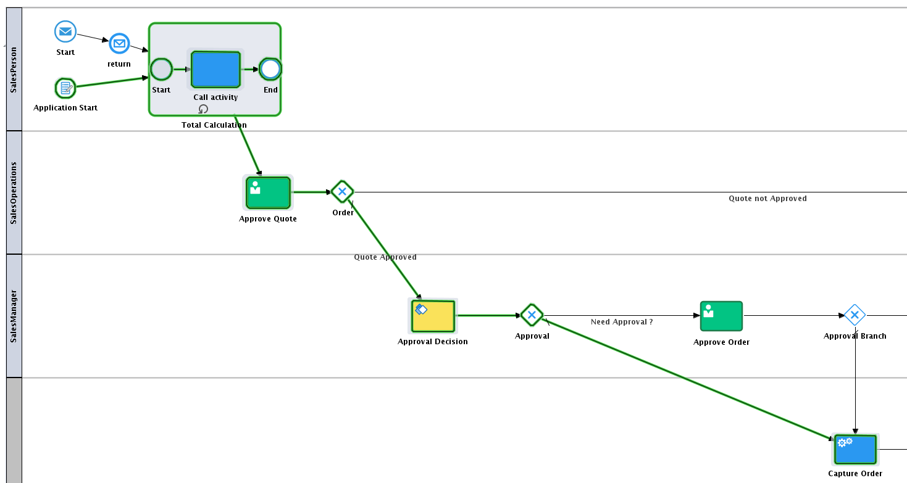

_Sample flow where the amount was low and did not require further approval._

## Process Modeling and Configuration

In this section we are going to experience the power of designing and implementing your own processes. Oracle PCS is based on the well documented BPMN specifications and lots of training, information and books exist around BPMN. A good starting point would be to look at *Object Management Group
Business Process Model and Notation* [Quick start Guide](http://www.bpmn.org/#tabs-quickguide) 

Don't be alarmed by the notation, it might seem overwhelming at first glance, PCS makes it easy to model and is intuitive in helping you to create a business process. 

---

### **1**: PCS Composer

---

**Role: YOU, Process Owner (user01-10)**

You, as sales director and process owner wants to change the process to add a comment to the Quote to Order process, to be able to distinguish an order placed in EBS by PCS. We want to change the amount of the implemented rule to determine if sales operations should approve a quote. If the amount is high risk and the amount is bigger than $ 10000, it should be approved by sales director. Else if high risk and the amount is under $10000, then the sales manager should approve the quote. 
  
We are going through the steps on how to implement these changes in the process.
  
---

**1.1** Follow the steps in the previous section **1: Login to Process Cloud Service** to sign into PCS, but this time using ***(demo.user01-10)*** sign on details.

**1.2** On the welcome page, click on Develop Processes

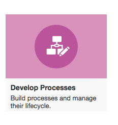

- You will be presented with the PCS Composer home page

- From this page you will be able to create a new Space, or even use a template to create a new process.

> An interesting exercise after the workshop, is to come back to the Create functionality and have a look at the QuickStart Apps available. You can also create a process and expose that as a QuickStart App template.

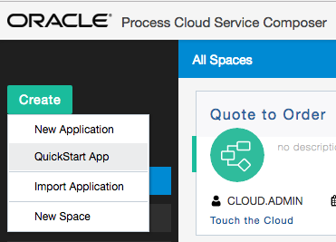

### **2**: Spaces

---

A space groups processes together, and also allows you to share a space with other users. As a space owner it allows you to give specific roles: viewer, owner and editor roles.

---

**2.1** Click on the Touch The Cloud Space

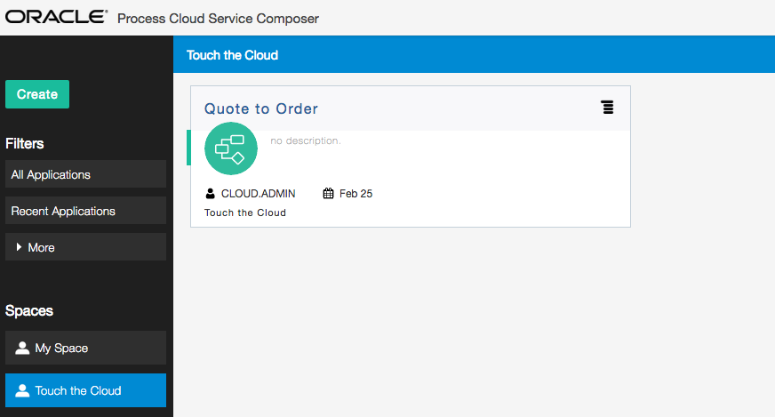

### **3**: Working with Applications

---

An Application contains all the defined artifacts, for example rules, integrations and processes to support this application.

---

In the next couple of steps we are going to extend the Quote to Order. To be safe, we are going to make a copy and use that to implement our changes.

**3.1** Click on the Quote to Order Application hamburger menu and select Clone

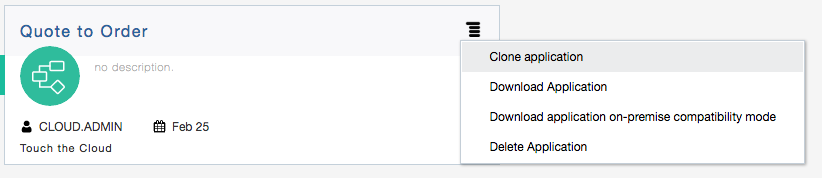

**3.2** Give your clone a new name, by appending your user name ***(User01..User10)***, and click Create, and leave the ***Open immediately*** option on. Make sure you select ***Touch the Cloud*** space to clone to.

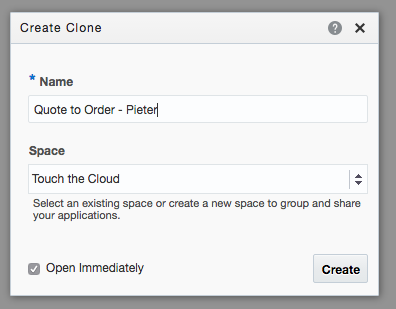

- Now we have our clone ready to be changed, so let us proceed and implement our changes.

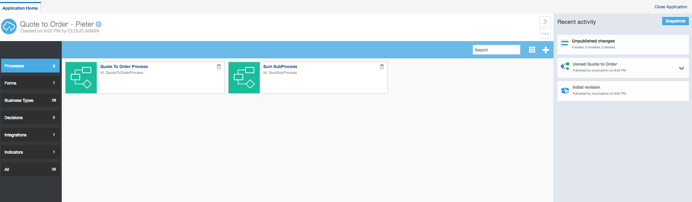

### **4**: Editing Rules

**4.1** Since we are going to edit this process, ensure that it is in **Edit** mode by selecting the `pencil icon` in the blue header at the top of the page

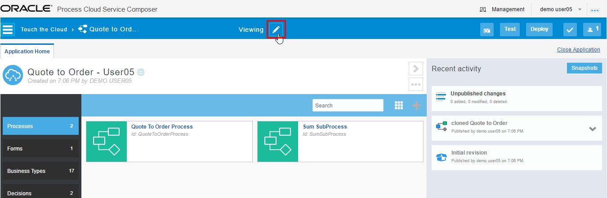

**4.2** Click on the process to open up the process model

**4.3** Back on the process model, click on the Approval Decision and select Open Decision

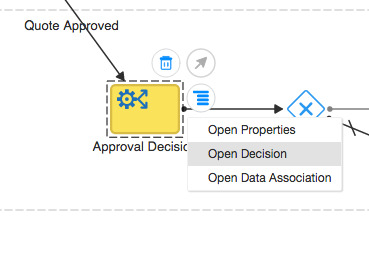

**4.4** Select the row ApprovalRule.in.limit, by clicking in the cell - the cursor will change to a right pointing arrow.

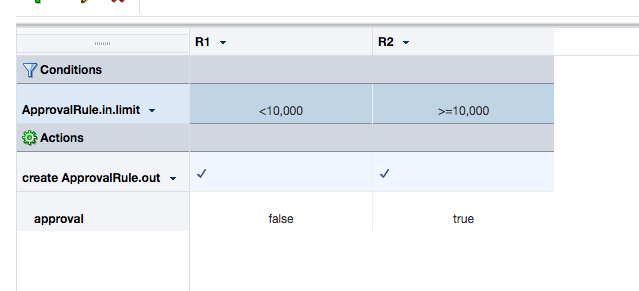

**4.5** Click on the Pencil Icon above table, then click on the Local Range Value Set	Pencil on the Add/Modify Page

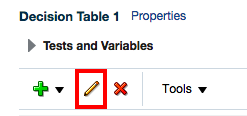

**4.6** Let's change the value to a lower limit, 5000 and also add human understandable aliases for the rule. To edit a cell, click in the cell and apply the changes as indicated.

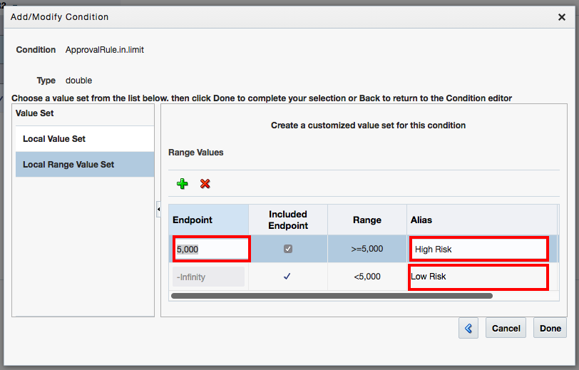

**4.7** Click on Done

- You will see the rules now display a more readable rules set

 

### **5**: Process Model

**5.1** Next step is to add the comment. Go back to the **Quote to Order Process** process by selecting the tab next to the **ApprovalRule** that you just worked on.

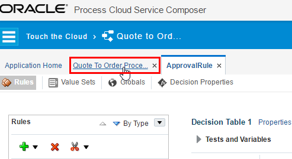

**5.2** Now, click on the process to open up the process model, if not already open.

**5.3** Click on the Capture Order - the blue activity at the bottom right of the model. If nerequired, you can drag the model by clicking on any open space and drag the model to the left, to see the activity.

**5.4** Click on hamburger icon and select ***Open Data Association***

 

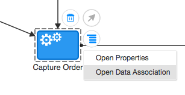

**5.5** Now that we are in the Data Association page, we can assign the comment 

On the source side of the mapping, expand the ***Process Data*** element.  On the target side, expand the ***CreateOrderRequest*** and also the ***header***,  elements. 
Drag ***mcs_id*** in the first open slot in the left hand side, and drag ***comment*** next to ***mcs_id*** to complete the assignment  

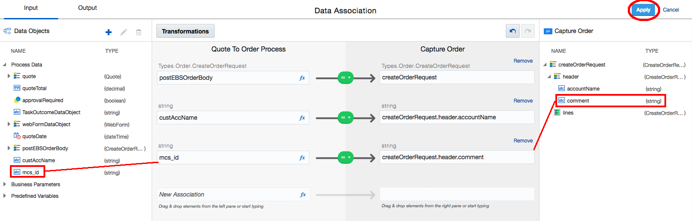

For clarity :

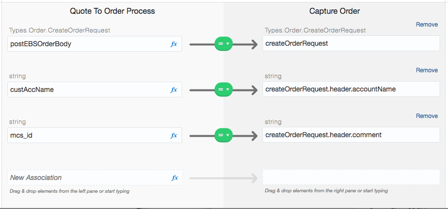

**5.6** Click **Apply** in the upper right of the Data Association window.

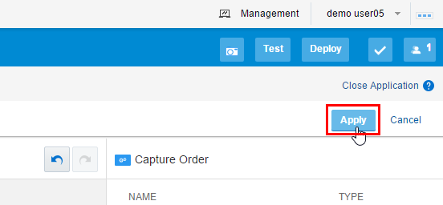

### **6**: Adding Approvals

**6.1** A swimlane indicates the role which will execute the action defined within the lane. Click on the white plus sign at the bottom of model.

**6.2** Click on the newly created swimlane and select the pencil icon to edit the properties

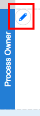

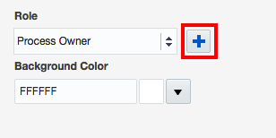

**6.3** Click on the plus sign next to Role to add `Sales Director`

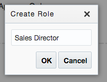

**6.4** Next drag an Approve from the BPM Palette to the newly created **Sales Director** swimlane

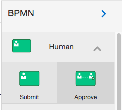

**6.5** Create a new connection from **Approval** to the **User Task**.  Create a new condition from the Approval gateway and drag it on top of the new **User task**

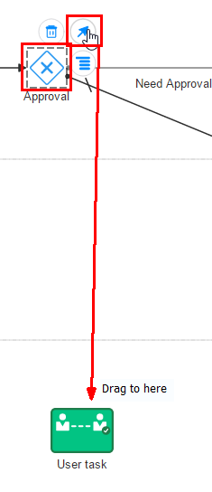

**6.6** With the new connection highlighted, edit the properties by clicking on the little pencil icon

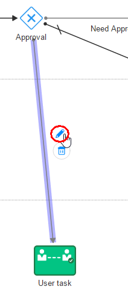

**6.7** Enter the condition `approvalRequired and quoteTotal > 10000` then select the **Validate** button to ensure it was copied correctly.

**6.8** After validating the condition, select the `OK` button to save the condition

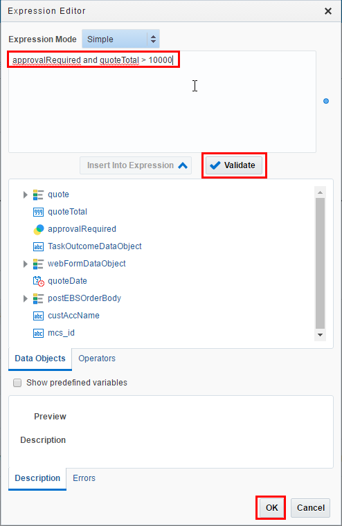

**6.9** When the quote total is between $5000 and $10000 we still want the Sales Manager to approve the order.  In order to implement this behavior, we only have to make a slight adjustment to the conditional branch to the Sales Manager's approval **Approve Order**.  Click on the line between **Approval** and **Approve Order** then select the pencil icon so we can modify the condition.

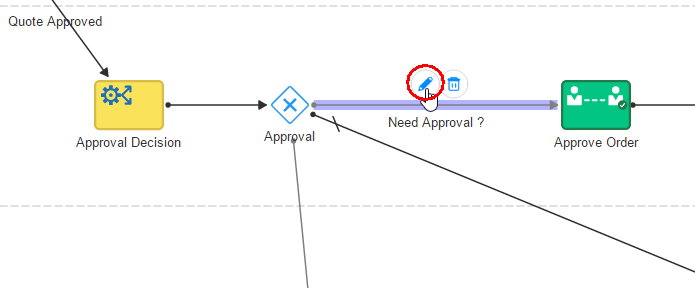

**6.10** Modify the condition so that it is `approvalRequired and quoteTotal <= 10000` then select the **Validate** button to ensure it was copied correctly.

**6.11** After validating the condition, select the `OK` button to save the condition

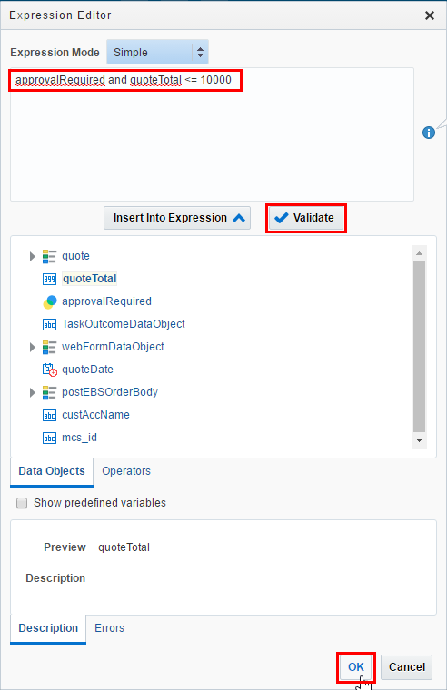

**6.12** Next, select the new activity in the **Sales Manager** swim lane and change the name by double clicking on the text **User Task**

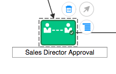

**6.13** Now we have to supply the properties for the **Sales Director Approval** task, as supplied in the screenshot below

**6.14** Fill in `Form`, `Presentation`, and `Action` as shown in the picture below.

In order to set the `Form`, select the magnifying glass icon, then select the already existing _WebForm_

Note that the `Presentation` will probably already be set to _Main_ and that the `Action` will probably already be set to _APPROVE,REJECT_

**6.15** For the `Title` property, select the pulldown just to the right of the textbox and select `Expression Editor`

**6.16** In the textarea for the expression, enter `WebForm.mcs_id + " - Sales Director Approval"`

**6.17** After entering the expression, select the **Validate** button to ensure it was copied correctly.

**6.18** After validating the condition, select the `OK` button to save the condition

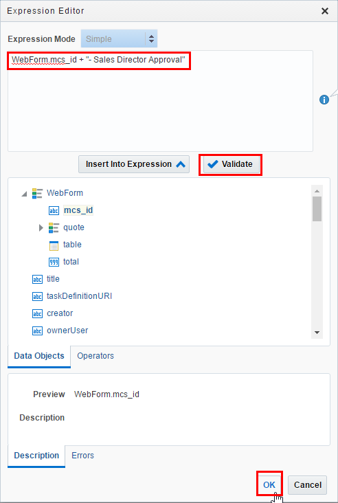

**6.19** Next, drag an exclusive gateway into the model just after the **Sales Director Approval**, connect the human task **Sales Director Approval** with the gateway, then the gateway to the **Capture Order**, using the connector icon to create the connections

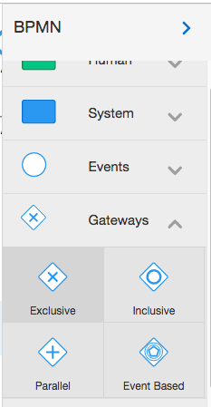

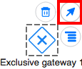

**6.20** Connect the gateway to the **Not Approved end** activity. Feel free to move the activities around to make it more readable

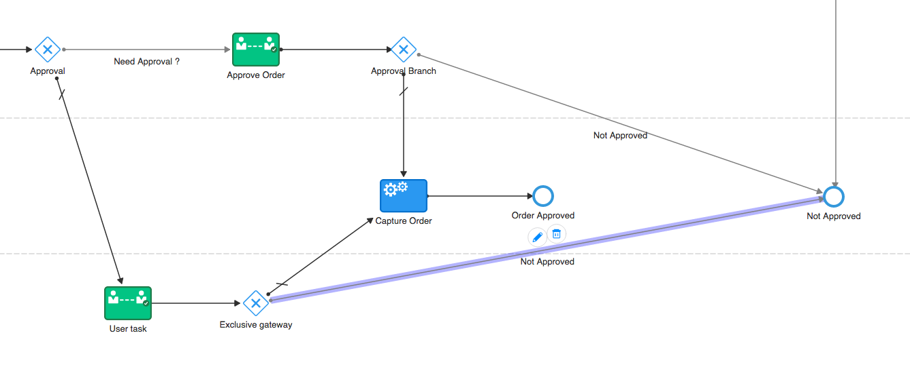

**6.21** With Connection highlighted, edit the properties and supply the following information, to test if the approval was rejected, by setting the condition to be **TaskOutcomeDataObject == "REJECT"**.

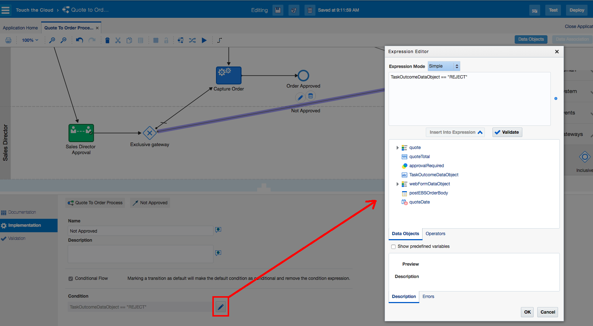

### **7**: Validating Changes

**7.1** Before we can go ahead and deploy the newly created application, we first have to validate if it is correct. Click on the **Check mark** in the right hand side of the screen.

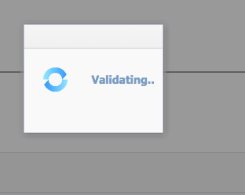

**7.2** You should see the following message, if not, look at the error codes and fix them.

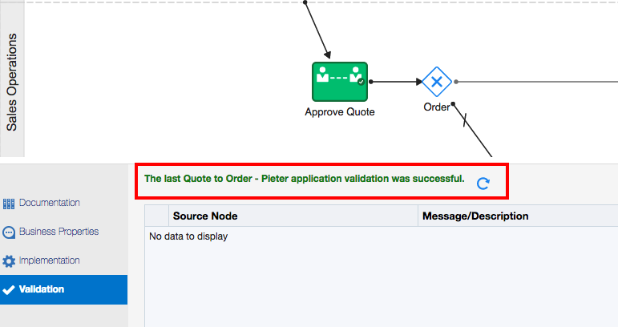

### **8**: Deployment

**8.1** To deploy we need to create a snapshot

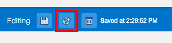

**8.2** Provide ***Comment*** and ***Name*** for snapshot. Other Options - check ***Make Snapshot***

**8.3** After filling in the comments and a name for the snapshot, click on ***Publish***

**8.4** Click on Management at top right hand of page

**8.5** If this is the first time you've published in this browser session, you may be prompted to login with your username/password for publishing.  If this is the case, enter your assigned username/password (ie: `demo.userXX`)

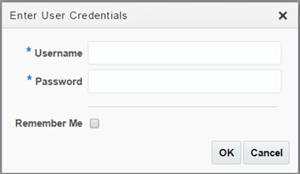

**8.6** From the **Manage Deployed Applications** screen, click on the hamburger icon next to My Server, and select deploy

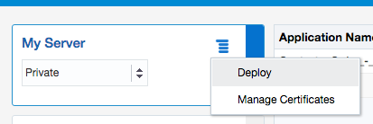

**8.7** Follow the **Deployment Application to My Server** wizard

In Space ***Touch the Cloud***, select your ***Quote to Order - USER(1-10)*** Application, with the same ***New Approval*** snapshot, we have create earlier, to deploy:

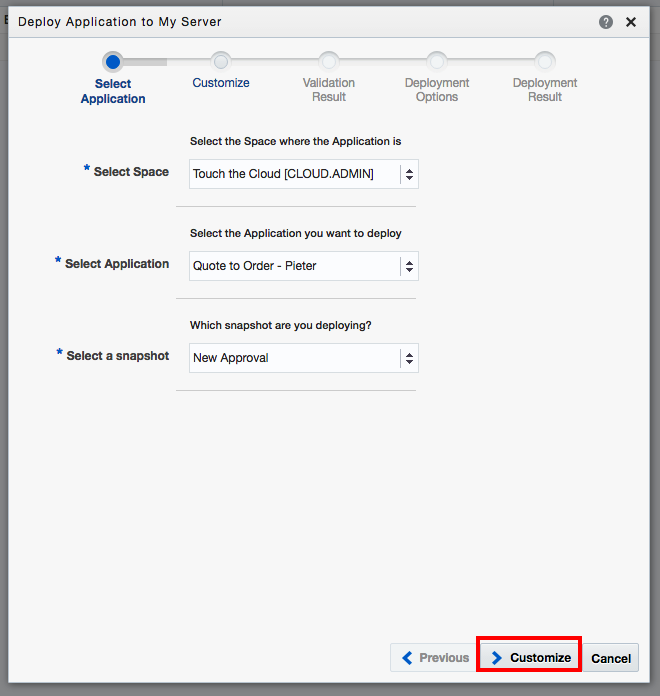

 Select the ***ICSKEY*** as **Keystore Credential** and confirm that **Security Option** is set to ***APP Id - Username Token***. _Username and password will be filled in automatically after ***ICSKEY*** was selected._ 

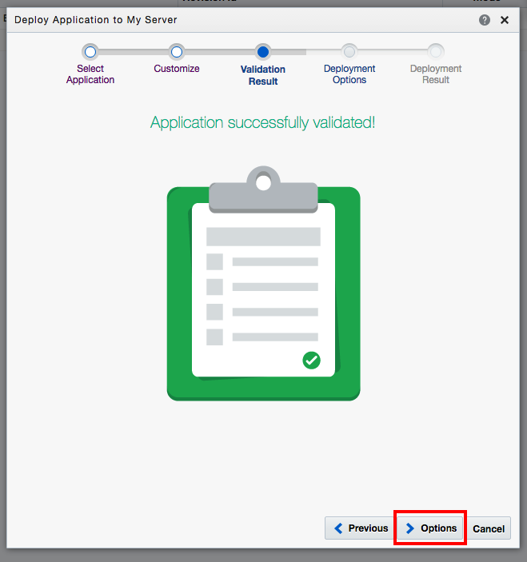

 

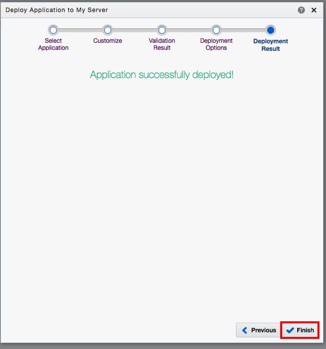

**8.8** Click on **Finish**

### **9**: Role Assignment

Now we have to assign physical users to the new **Sales Director** Role we have created.

**9.1** Click the PCS Home icon at top of page

**9.2** On the Workspace home page, click on **Configure**

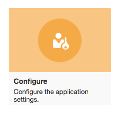

**9.3** In left hand side, click on **Manage Roles**

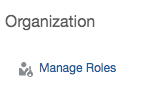

**9.4** Add ***Roland Dubois*** to the **Sales Director** role 

Find and select your app specific Sales Director (in the example user03, yours will be User01..10)

Then click on Add Member button

Search for the user 'roland' and add by selecting and clicking on OK

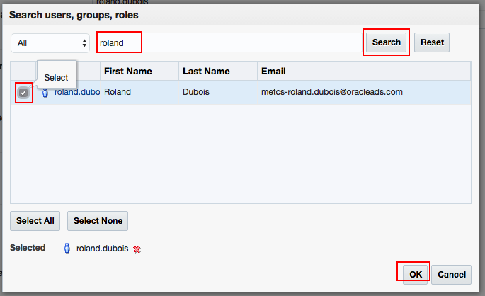

Click on Save to update the user assignment.

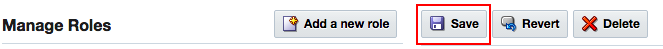

**9.5** Repeat the process for each of the roles in your application.

Here a list of users and allocated roles:

|Person        | Role            |
|:--------------|:-----------------:|
|Bala Gupta, YOU (demo.User01-10)    | Sales Person    |
|John Dunbar, YOU (demo.User01-10)  | Sales Manager   |
|Lisa Jones, YOU (demo.User01-10)    | Sales Operations|
|Roland Dubois, YOU (demo.User01-10) | Sales Director  |
 

## Testing new Process flow using Mobile Application 

In this section we are going to hook up our new process to the mobile application we have created in Lab 100.

---

### PCS

#### Capture WSDL End point

**1** From the PCS Composer Home Page, Click on Management at top right hand of page

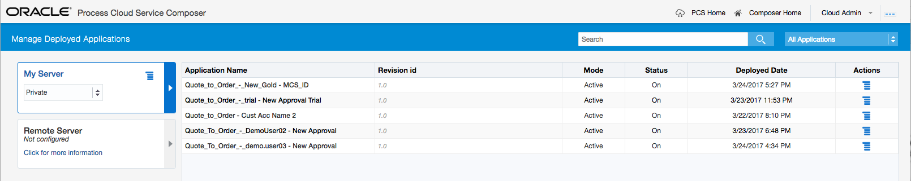

**2** Click on the ***hamburger menu*** next to your deployed application and select ***Web Services***

**3** Click on the ***link*** to open ***URL*** in new browser window

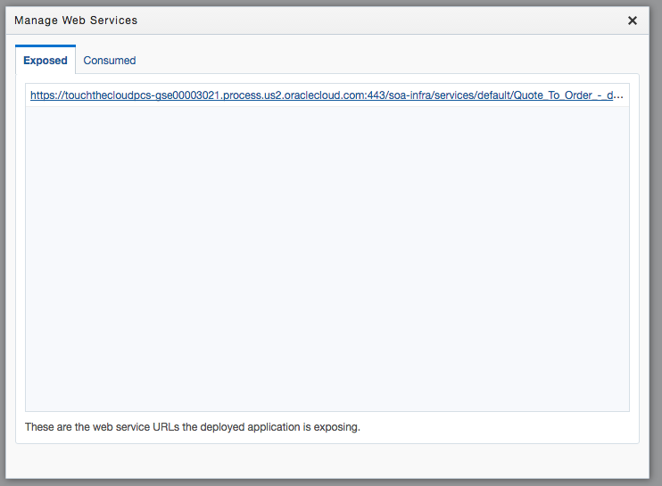

**4** Copy the **URL**

**5** Change the URL as follows, to ensure we are working with a verrsion, and not a specific deployed instance. The deployed instance might change if you redeploy the process, but the version will be the same :

Original URL -  https://touchthecloudpcs.process.us2.oraclecloud.com/soa-infra/services/default/Quote_To_Order_-_demo.user03!1.0*soa_aaf80f85-d04b-4ad5-8655-31622cb766ec/QuoteToOrderProcess.service?WSDL

Changed URL - https://touchthecloudpcs.process.us2.oraclecloud.com/soa-infra/services/default/Quote_To_Order_-_demo.user03!1.0/QuoteToOrderProcess.service?WSDL

To summarize, drop everything after the ***!1.0*** and before ***/QuoteToOrder***

Keep this URL handy to use in the MCS configuration.

### MCS

#### Setup MCS to use your new deployed PCS process

**1** Delete your ***PTC\_TTC\_XX** Connector

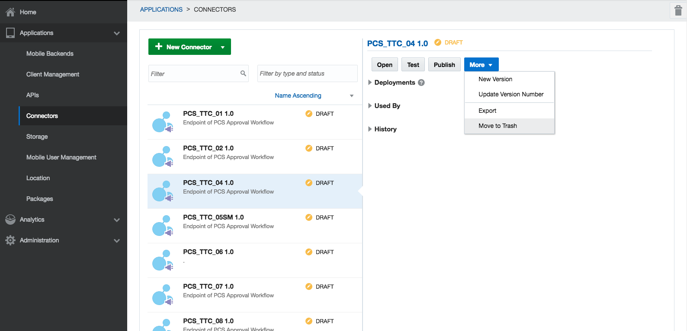

**2** Recreate your connector in MCS, using the WSDL URL obtained in PCS by following Lab 100 - 3.1 through 3.11. Replace the **WSDL URL:** referenced in 3.3 with the **WSDL** captured in previous PCS step.

**3** No need to change the API, as it reference the new Connector, which has the same name as the original

### Testing

You are now ready to trigger your own process using the already deployed Mobile Application, as only backend configuration changed.

From the Mobile Application created in Lab 100, create a new Quote.

Since YOU (User01-10), have all the roles assigned, you can use your user to step through the different approvals in the PCS task list.

After the Director Approval, then you can have a look at the full flow of the quote to order process, using the tracking screen, with the completed filter applied to the instances list.

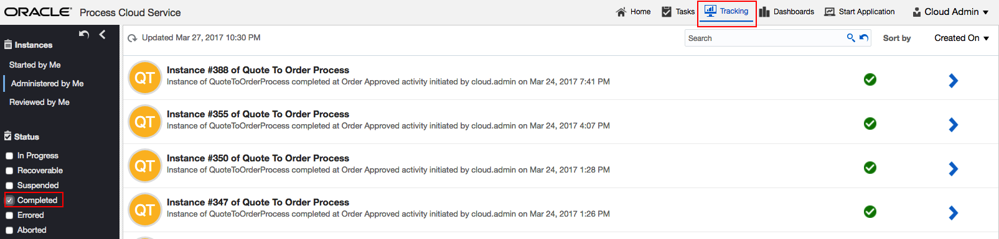

---------
*End of Lab 200*
---------

---------

# Appendix
_________

### Create a Quote, if you have not completed Lab 100

---

**Role: Bala Gupta, Field Sales (bala.gupta)**

In this step we are going to create some tasks to work on, if you have completed Lab 100, there should be a couple of task already available.

Login into the PCS Workspace as ***Bala*** (bala.gupta).

**1** On the PCS Workspace home page, click on the application **Submit Quote(1.0)**

  

**2** Fill in the information requested information on the form

  

   For the fields use the following values:
   
   Quote Number: 4325
   
   Select a customer from the following table:
   
   |CustomerNumber| CustomerName                | AddressLine1          | AddressLine2       | Phone        | FirstName | LastName | City     | Country | Zip   | Email                         | 
   | :----------- | ----------------------------| ----------------------| ------------------ | ------------ | --------- | -------- | -------- | ------- | ----- | ------------------------------|
   | 1            | ABC Telecommunications      | 1021 Fifth Avenue     | New York, NY 10022 | 917-123-2345 | Vincent   | DiNatale | New York | USA     | 10022 | v.dinatale@abctelecomms.com   |
   | 2            | MedChoice - IDN             | 333 Lexington Ave     | New York, NY 10000 | 917-123-2346 | Louis     | Wohl     | New York | USA     | 10000 | louis.wohl@medchoice.com      |
   | 3            | Bronco Drilling Machinery   | 150 East 50th Street  | New York, NY 10023 | 917-123-2347 | Jack      | Thomas   | New York | USA     | 10022 | jack.thomas@broncodrilling.com|
   | 4            | BHB Technologies            | 522 West 38th Street  | New York, NY 10018 | 917-123-2348 | Robbie    | Hun      | New York | USA     | 10018 | robbie.hun@bhbtech.com        |
   | 5            | CIC Management Inc.         | 68 Church Street      | New York, NY 10000 | 917-123-2349 | Lucy      | Leu      | New York | USA     | 10000 | lucy.leu@cicmgt.com           |
   | 6            | ABC Application Software    | 536 Madison Avenue DE | New York, NY 10012 | 917-123-2350 | Lenore    | Soifer   | New York | USA     | 10012 | lenore.soifer@abcsoftware.com |
   | 7            | Capital Investments Group   | 400 Madison Avenue    | New York, NY 10024 | 917-123-2351 | James     | Roman    | New York | USA     | 10024 | james.roman@capitalinvest.com |
   | 8            | Carbon Chemical Corporation | 502 East 81st Street  | New York, NY 10028 | 917-123-2352 | Loren     | Gab      | New York | USA     | 10028 | loren.gab@carbon_chem.com     |
   | 9            | Capp Worldwide Services Inc.| 32 Ave of the Americas| New York, NY 10013 | 917-123-2353 | Paul      | Pub      | New York | USA     | 10013 | paul.pub@cappww.com           |
   | 10           | Astro-Energy Systems        | 35 East 76th Street   | New York, NY 10021 | 917-123-2354 | Jenny     | Roy      | New York | USA     | 10021 | jenny.roy@astro_energy.com    |
   
   For the items, use some of these inventory items, using UOM (unit of measure) as 'each':
   
   | ItemNumber | _Inventory Item ID_ | Description                        | List Price Per Unit |
   | :--------- | ----------------- | ---------------------------------- | -------------------:|
   | 1          | 155               | Sentinel Deluxe Desktop            |              1969.00|
   | 2          | 249               | Hard Drive - 250GB SSD             |              899.00 |
   | 3          | 436               | Lightning Inkjet Printer           |              300.00 |
   | 4          | 2848              | Vision Pad DX - Mobile Computer    |              249.00 |
   | 5          | 190878            | Vision Pad X100 - Mobile Computer  |              249.00 |
   | 6          | 2155              | Sentinel Standard Desktop - Rugged |              1900.00|
   | 7          | 174762            | 205 Digital Camera                 |              215.00 |
   | 8          | 12023             | Digital Camera, Professional       |              487.80 |
   | 9          | 12031             | Television 102"                    |              3749.99|
   | 10         | 12029             | Television 96"                     |              2608.69|

**3** Click on the Submit button to start the Quote to Order process.
