

 

Update: March 13, 2017

## Introduction

This is the analytics part of the  **iPaaS - Build a Quote to Order Process Workshop.** This workshop will walk you through the analytics of the  of a typical Quote to Order process.

## Objectives

- Business Analytics Process Cloud

# 

## Requirements for this lab

Your custom deployed process 'Quote to Order' 

# 

## Process Cloud Business Analytics

In this section we are going to configure the Quote to Order process to gather statistics while in flight.

Each step identify the role, and what the user in that specific role is trying to achieve. 

### **STEP 1**: Instance Analytics

---

**Role: Mr User01-10, Process Owner**

  User01-10, sales director and process owner wants to see what is happening to his Quote to Order processes, in a summarized customized view. 
  
---

**1.1** Log into the Process Workspace using your user id [01-10].

**1.2** On the Process home page click the View Dashboards

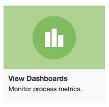

**1.3** On the following page, you will see two categories, Process Monitoring and Business Analytics.

**1.4** Feel free to look at your current Processes, by clicking on the `Open`, `Workload`, `Trend` and `Close` graphs.

Sample Trend Graph:

In the next section we are going to define what should be capture for each process instance, to be used in the business analytics graphs/reports.

### **STEP 2**: Defining Analytics Measures

---

**Role: Mr User01-10, Process Owner**

  User01-10, sales director and process owner wants extract the value of quotes per date

---

**2.1** Open your custom PCS Application in PCS Composer. 

**2.2** Ensure that the process is in *Edit* mode by selecting the pencil icon in the top middle of the editor window.  If the process is not in edit mode, it will be shown in *Viewing* mode as shown below:

**2.3** Click on the Indicators tab

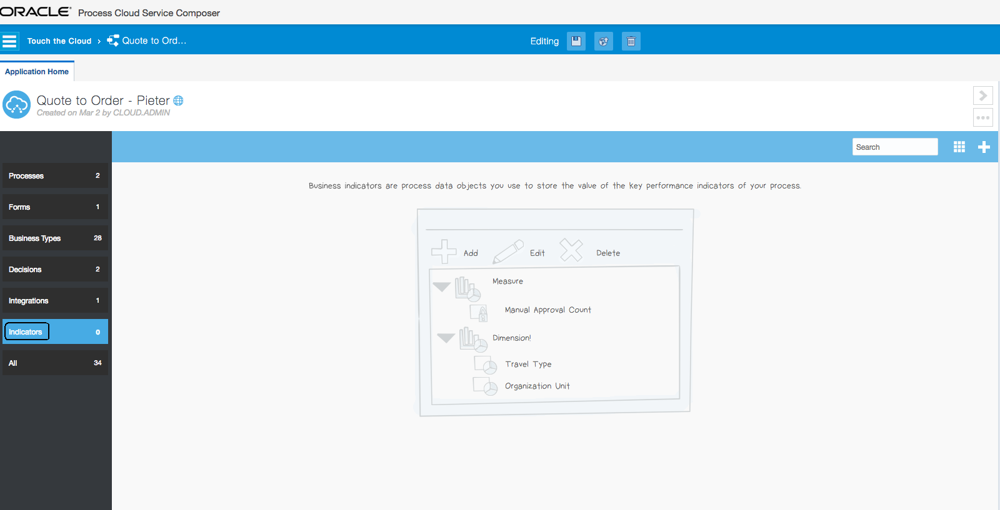

**2.4** In this step we are going to create a measure and dimension.

**2.5** Click on the white plus sign, next to Search, and select _Measure_ from the list

**2.6** Next, enter the name for the measure `quoteTotal` then select the _magnifying glass_ icon so we can select a data object where the measure will be taken from.

**2.7** Select the `quoteTotal` variable from the list, the select the **OK** button

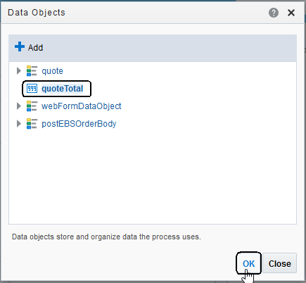

**2.8** Select the **OK** button in the Measure definition dialog to complete the definition.

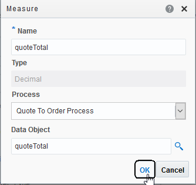

**2.9** Next, create a Dimension by clicking on the white plus sign again

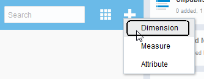

**2.10** Next, enter the name for the dimension `quoteDate` then select the _magnifying glass_ icon so we can select a data object where the measure will be taken from.

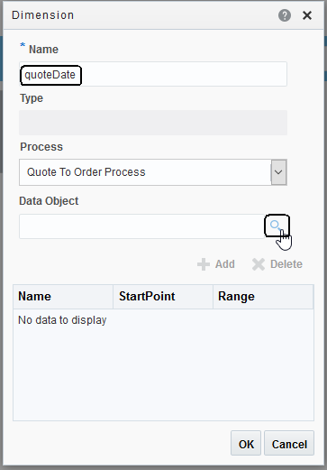

**2.11** Select the `quoteDate` variable from the list, the select the **OK** button

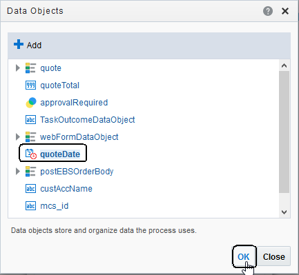

**2.12** Select the **OK** button in the Dimension definition dialog to complete the definition.

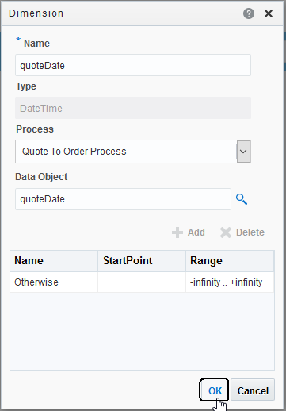

**2.13** Next step is deploy the changed application. Click on the **Save** button, then **Publish**

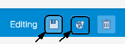

**2.14** Create a new snapshot to deploy

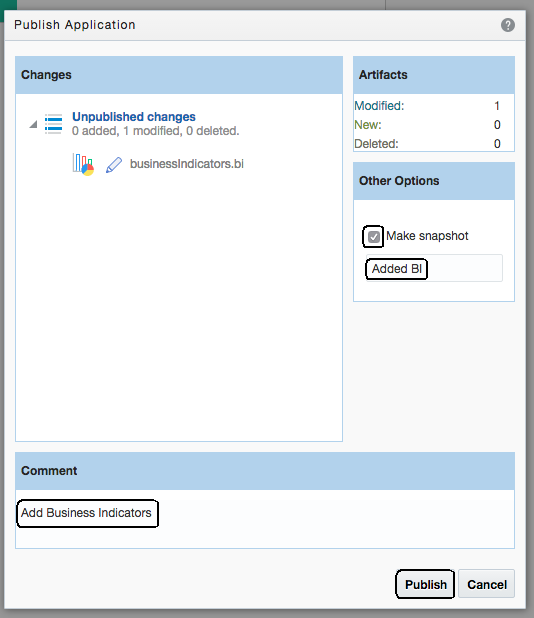

**2.15** Click on Test

**2.16** Once again, ensure that the process is in *Edit* mode by selecting the pencil icon in the top middle of the editor window.  If the process is not in edit mode, it will be shown in *Viewing* mode as shown below:

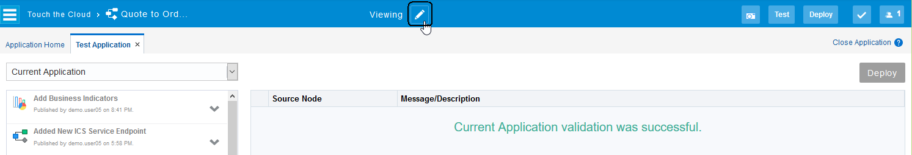

**2.17** Go ahead and do the deployment of your changed application, by clicking on the bottom deploy icon

**2.18** Add yourself to all the roles, to allow you to act as all the different roles in the process flow.

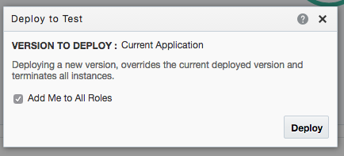

**2.19** Wait for the deployment to finish, then select the **OK** button on the _Application Deployed Successfully_ dialog.

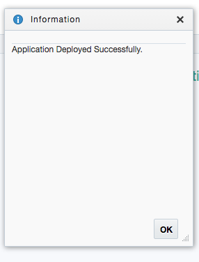

**2.20** After the deployment completed, go back to the PCS Workspace, and then Dashboards. 

**2.21** Select the Business Analytics Tab, then select the big green `Get Started` button in the middle of the screen.  Note that if this isn't your first query you won't get the big green button.

**2.22** Create a new report, with the following values

**2.23** Click on Untitled, and change the report name to Total Quotes per Week and click on save

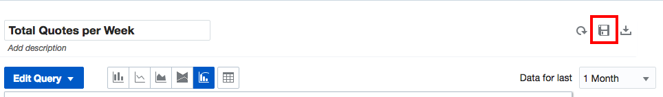

  Under the Reports section, you will see an entry for your report. The last step is to generate some information to be displayed in the report. To do this we have to start a couple of processes. See **Lab 200** **STEP 1 (Optional)** on a sample on how to create a couple of instances of your newly deployed application.

  Go ahead and create a couple of instances, and see how the report reflect the capture metrics in the process.

